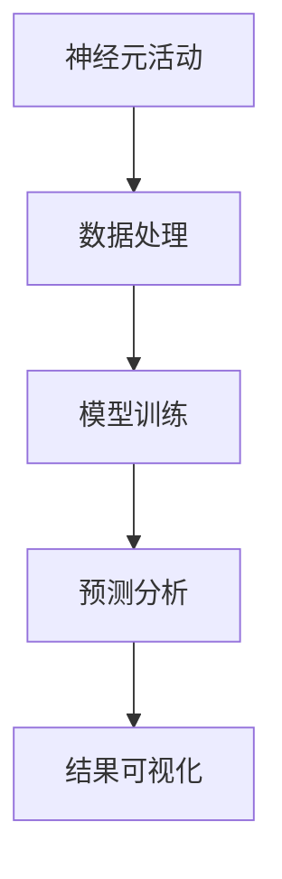
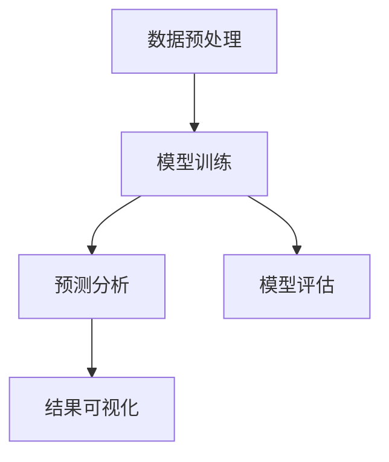
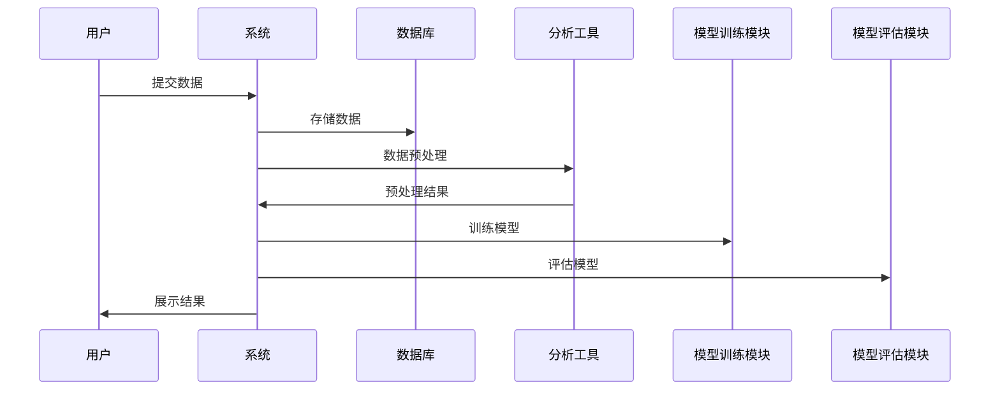

                 

### 设计《数学建模在神经科学中的应用》目录大纲

#### 第一部分：背景介绍

##### 1.1 问题的背景
- 神经科学的发展历史和现状
- 数学建模在神经科学研究中的重要性

##### 1.2 问题描述
- 神经科学中的关键问题和挑战
- 数学建模在解决这些问题中的优势和应用领域

##### 1.3 问题解决
- 数学建模的基本原理和方法
- 神经科学中常见问题的数学建模方法

##### 1.4 边界与外延
- 数学建模在神经科学中的适用范围
- 数学建模的局限性

##### 1.5 概念结构与核心要素组成
- 神经科学中的核心概念
- 数学建模在神经科学中的关键要素

#### 第二部分：核心概念与联系

##### 2.1 神经科学核心概念
- 神经元
- 突触
- 神经传递物质

##### 2.2 数学建模核心概念
- 模型建立
- 参数估计
- 预测与分析

##### 2.3 概念属性特征对比表格
- 神经科学概念与数学建模概念的对比

##### 2.4 ER实体关系图架构
- 神经科学中的实体关系图
- 数学建模中的实体关系图

#### 第三部分：算法原理讲解

##### 3.1 算法原理
- 神经网络建模原理
- 动力系统建模原理

##### 3.2 算法流程图
- 使用Mermaid绘制神经网络建模流程图
- 使用Mermaid绘制动力系统建模流程图

##### 3.3 Python源代码讲解
- 神经网络建模的Python代码实现
- 动力系统建模的Python代码实现

##### 3.4 算法原理的数学模型和公式
- 神经网络建模的数学模型和公式
- 动力系统建模的数学模型和公式

##### 3.5 举例说明
- 神经网络建模举例
- 动力系统建模举例

#### 第四部分：数学模型和数学公式详细讲解与举例说明

##### 4.1 数学公式
- 使用LaTeX格式编写数学公式

##### 4.2 详细讲解
- 对数学公式的详细解释

##### 4.3 举例说明
- 利用数学公式进行举例说明

#### 第五部分：系统分析与架构设计方案

##### 5.1 问题场景介绍
- 神经科学研究的具体场景

##### 5.2 项目介绍
- 神经科学数学建模项目

##### 5.3 系统功能设计
- 领域模型Mermaid类图

##### 5.4 系统架构设计
- Mermaid架构图

##### 5.5 系统接口设计
- 系统接口设计

##### 5.6 系统交互
- Mermaid序列图

#### 第六部分：项目实战

##### 6.1 环境安装
- 神经科学数学建模环境搭建

##### 6.2 系统核心实现源代码
- 神经科学数学建模代码实现

##### 6.3 代码应用解读与分析
- 对代码的应用进行解读与分析

##### 6.4 实际案例分析和详细讲解剖析
- 对实际案例进行分析，并进行详细讲解剖析

##### 6.5 项目小结
- 对项目进行小结

#### 第七部分：最佳实践 tips、小结、注意事项、拓展阅读

##### 7.1 最佳实践 tips
- 提供神经科学数学建模的最佳实践建议

##### 7.2 小结
- 总结本书的主要内容和收获

##### 7.3 注意事项
- 在使用数学建模时需要注意的事项

##### 7.4 拓展阅读
- 推荐进一步阅读的资料

---

### 整体框架与内容安排

在整体框架的设计中，我们首先通过背景介绍部分，对神经科学和数学建模的基本概念、发展历程以及应用场景进行概述，为读者建立基本的知识体系。这部分旨在引导读者理解为什么数学建模在神经科学研究中具有重要性，以及它能够解决哪些具体问题。

接着，在核心概念与联系部分，我们详细阐述了神经科学中的关键概念和数学建模的核心理论，通过对比表格和实体关系图的形式，帮助读者更好地理解两者的联系和区别。这部分内容对于建立读者对神经科学和数学建模的综合认知至关重要。

算法原理讲解部分，则是本文的核心。我们深入讲解了神经网络和动力系统建模的基本原理，并通过Python源代码和Mermaid流程图，展示了算法的执行过程和数学模型。这部分内容旨在让读者不仅理解理论，还能动手实践，加深对数学建模的理解。

数学模型和数学公式详细讲解与举例说明部分，我们通过LaTeX格式编写了具体的数学公式，并结合详细的讲解和实际例子，让读者能够直观地理解公式的应用场景和作用。

系统分析与架构设计方案部分，我们通过具体的神经科学数学建模项目，详细介绍了系统功能设计、架构设计和接口设计。这部分内容帮助读者理解如何将理论应用到实际的系统设计中。

在项目实战部分，我们通过环境安装、系统核心实现源代码和实际案例的分析，让读者能够亲身参与到神经科学数学建模的项目中，实践所学知识。

最后，在最佳实践 tips、小结、注意事项和拓展阅读部分，我们总结了文章的主要内容和收获，并给出了使用数学建模时需要注意的事项以及推荐进一步阅读的资料，帮助读者在日后的学习和工作中能够更好地应用数学建模的方法。

---

### 目录大纲示例的具体内容说明

为了确保文章的条理清晰、逻辑性强，我们将对每一部分的具体内容进行详细的说明，包括每个章节的目标、内容安排和关键点。

#### 第一部分：背景介绍

**1.1 问题的背景**
- **目标**：介绍神经科学的发展历史和现状，以及数学建模在其中的作用。
- **内容安排**：首先概述神经科学的发展历程，然后描述当前神经科学研究的主要领域和热点问题，最后解释数学建模在推动神经科学研究中的作用。
- **关键点**：历史背景、研究现状、数学建模的重要性。

**1.2 问题描述**
- **目标**：明确神经科学中面临的关键问题和挑战，并阐述数学建模如何解决这些问题。
- **内容安排**：分类列举神经科学中的问题，分析这些问题对研究的影响，并解释数学建模在应对这些问题中的优势。
- **关键点**：常见问题、挑战、解决方案、优势。

**1.3 问题解决**
- **目标**：介绍数学建模的基本原理和方法，以及其在神经科学中的应用。
- **内容安排**：概述数学建模的基本概念，介绍常用的数学建模方法，并通过实际案例展示这些方法在神经科学中的应用。
- **关键点**：数学建模原理、方法、应用案例。

**1.4 边界与外延**
- **目标**：讨论数学建模在神经科学中的适用范围和局限性。
- **内容安排**：分析数学建模在神经科学中的适用范围，同时指出其局限性，以提醒读者在使用时需要注意的问题。
- **关键点**：适用范围、局限性、注意事项。

**1.5 概念结构与核心要素组成**
- **目标**：梳理神经科学中的核心概念和数学建模中的关键要素。
- **内容安排**：分别介绍神经科学和数学建模中的核心概念和要素，并通过对比表格和实体关系图展示两者的结构关系。
- **关键点**：核心概念、要素、结构关系、对比表格、实体关系图。

#### 第二部分：核心概念与联系

**2.1 神经科学核心概念**
- **目标**：介绍神经元、突触和神经传递物质等神经科学中的关键概念。
- **内容安排**：分别解释神经元、突触和神经传递物质的概念，描述它们在神经信号传递中的作用。
- **关键点**：神经元、突触、神经传递物质、作用机制。

**2.2 数学建模核心概念**
- **目标**：介绍模型建立、参数估计和预测与分析等数学建模的核心概念。
- **内容安排**：详细阐述模型建立的过程、参数估计的方法以及预测与分析的应用。
- **关键点**：模型建立、参数估计、预测与分析、方法流程。

**2.3 概念属性特征对比表格**
- **目标**：通过对比表格形式，明确神经科学概念与数学建模概念的差异和联系。
- **内容安排**：列出神经科学概念和数学建模概念的属性特征，并进行对比分析。
- **关键点**：属性特征、对比分析、差异联系。

**2.4 ER实体关系图架构**
- **目标**：展示神经科学和数学建模中的实体关系图，帮助读者理解两者的结构关系。
- **内容安排**：使用Mermaid绘制神经科学中的实体关系图和数学建模中的实体关系图，并对图中的实体和关系进行解释。
- **关键点**：实体关系图、Mermaid绘制、实体解释、关系解释。

#### 第三部分：算法原理讲解

**3.1 算法原理**
- **目标**：介绍神经网络和动力系统建模的基本原理。
- **内容安排**：分别阐述神经网络和动力系统建模的基本概念、原理和作用。
- **关键点**：神经网络原理、动力系统原理、基本概念、作用。

**3.2 算法流程图**
- **目标**：通过Mermaid绘制神经网络和动力系统建模的流程图，展示算法的执行过程。
- **内容安排**：使用Mermaid绘制神经网络和动力系统建模的流程图，并对流程图中的步骤进行解释。
- **关键点**：Mermaid流程图、算法流程、步骤解释。

**3.3 Python源代码讲解**
- **目标**：通过Python源代码实现神经网络和动力系统建模，展示算法的实际应用。
- **内容安排**：分别展示神经网络和动力系统建模的Python代码实现，并对代码中的关键部分进行解释。
- **关键点**：Python代码、算法实现、关键部分解释。

**3.4 算法原理的数学模型和公式**
- **目标**：介绍神经网络和动力系统建模的数学模型和公式，解释其理论基础。
- **内容安排**：分别阐述神经网络和动力系统建模的数学模型和公式，解释其在算法中的作用。
- **关键点**：数学模型、公式、理论基础、作用。

**3.5 举例说明**
- **目标**：通过具体例子，展示神经网络和动力系统建模的实际应用效果。
- **内容安排**：分别提供神经网络和动力系统建模的实际应用案例，并对案例结果进行分析。
- **关键点**：实际案例、应用效果、结果分析。

#### 第四部分：数学模型和数学公式详细讲解与举例说明

**4.1 数学公式**
- **目标**：使用LaTeX格式编写数学模型和公式，确保其准确性和可读性。
- **内容安排**：列出神经网络和动力系统建模中常用的数学公式，使用LaTeX格式进行编写。
- **关键点**：数学公式、LaTeX格式、准确性、可读性。

**4.2 详细讲解**
- **目标**：对数学公式进行详细解释，确保读者能够理解其含义和作用。
- **内容安排**：逐个解释每个数学公式的含义、应用场景以及推导过程。
- **关键点**：公式解释、含义、应用场景、推导过程。

**4.3 举例说明**
- **目标**：通过具体例子，展示数学公式的实际应用效果，加深读者的理解。
- **内容安排**：提供实际案例，使用数学公式进行计算和解释，展示其应用效果。
- **关键点**：实际案例、应用效果、公式计算、解释。

#### 第五部分：系统分析与架构设计方案

**5.1 问题场景介绍**
- **目标**：介绍神经科学研究的具体场景，为后续的架构设计提供背景。
- **内容安排**：描述神经科学研究中的具体问题，分析问题的背景和需求。
- **关键点**：问题场景、背景需求、具体问题。

**5.2 项目介绍**
- **目标**：介绍神经科学数学建模项目，明确项目目标和主要内容。
- **内容安排**：概述项目背景、目标和主要内容，介绍项目团队和实施计划。
- **关键点**：项目背景、目标、主要内容、团队计划。

**5.3 系统功能设计**
- **目标**：设计神经科学数学建模系统的功能，明确系统的功能和模块。
- **内容安排**：列出系统的功能模块，描述每个模块的功能和实现方式。
- **关键点**：功能模块、功能描述、实现方式。

**5.4 系统架构设计**
- **目标**：设计神经科学数学建模系统的架构，确保系统的稳定性和扩展性。
- **内容安排**：使用Mermaid绘制系统架构图，解释各部分的功能和关系。
- **关键点**：系统架构、Mermaid架构图、功能关系、稳定性、扩展性。

**5.5 系统接口设计**
- **目标**：设计神经科学数学建模系统的接口，确保系统与其他系统的兼容性。
- **内容安排**：列出系统的接口，描述每个接口的功能和通信方式。
- **关键点**：系统接口、功能描述、通信方式。

**5.6 系统交互**
- **目标**：描述系统的交互过程，确保系统各部分之间的协同工作。
- **内容安排**：使用Mermaid绘制系统交互序列图，解释各部分的交互过程。
- **关键点**：系统交互、Mermaid序列图、交互过程。

#### 第六部分：项目实战

**6.1 环境安装**
- **目标**：搭建神经科学数学建模的环境，确保后续实验和开发的顺利进行。
- **内容安排**：介绍环境搭建的步骤、所需工具和配置方法。
- **关键点**：环境搭建、步骤、工具、配置方法。

**6.2 系统核心实现源代码**
- **目标**：展示神经科学数学建模系统的核心实现源代码，提供可参考的代码示例。
- **内容安排**：列出核心代码文件，解释关键部分的代码实现。
- **关键点**：核心代码、代码文件、关键部分、实现解释。

**6.3 代码应用解读与分析**
- **目标**：解读和分析系统核心代码的应用场景和实现细节，帮助读者深入理解代码的功能。
- **内容安排**：分析代码的应用场景、功能实现和关键细节。
- **关键点**：代码应用、解读分析、应用场景、功能实现。

**6.4 实际案例分析和详细讲解剖析**
- **目标**：通过实际案例，展示神经科学数学建模的应用效果，并进行详细讲解和分析。
- **内容安排**：提供实际案例，展示应用效果，进行详细讲解和分析。
- **关键点**：实际案例、应用效果、详细讲解、分析。

**6.5 项目小结**
- **目标**：总结项目的主要成果和经验，提出改进建议。
- **内容安排**：回顾项目的主要进展和成果，分析经验教训，提出改进建议。
- **关键点**：项目总结、经验教训、改进建议。

#### 第七部分：最佳实践 tips、小结、注意事项、拓展阅读

**7.1 最佳实践 tips**
- **目标**：总结神经科学数学建模的最佳实践，提供实用的建议。
- **内容安排**：列出最佳实践，解释其有效性和应用场景。
- **关键点**：最佳实践、有效性、应用场景。

**7.2 小结**
- **目标**：总结本书的主要内容和收获，强调关键知识点。
- **内容安排**：回顾本书的主要章节和内容，总结收获和关键知识点。
- **关键点**：内容回顾、收获总结、关键知识点。

**7.3 注意事项**
- **目标**：提醒读者在使用数学建模时需要注意的事项，避免常见错误。
- **内容安排**：列出注意事项，解释其影响和解决方法。
- **关键点**：注意事项、影响、解决方法。

**7.4 拓展阅读**
- **目标**：推荐进一步阅读的资料，帮助读者深入学习和研究。
- **内容安排**：列出推荐阅读的书籍、论文和网站，提供链接和简要介绍。
- **关键点**：拓展阅读、资料介绍、链接提供。

---

### 文章整体框架与逻辑结构分析

在《数学建模在神经科学中的应用》这篇文章的整体框架和逻辑结构设计中，我们遵循了一个清晰的、层层递进的思路，以确保读者能够从基础知识到高级应用，系统地理解和掌握神经科学数学建模的核心概念和应用方法。以下是对文章整体框架和逻辑结构的详细分析：

**1. 引言**
文章以简短的引言开篇，介绍了数学建模在神经科学中的重要性和应用前景。这部分内容旨在吸引读者的兴趣，并为他们提供一个全局的视角，了解后续内容的核心焦点。

**2. 背景介绍**
在背景介绍部分，我们首先回顾了神经科学的发展历程和当前的研究现状，为读者建立了一个关于神经科学的基本知识框架。接着，我们详细阐述了数学建模在神经科学中的应用场景和优势，为后续内容提供了理论基础。

**3. 核心概念与联系**
这一部分深入探讨了神经科学和数学建模中的核心概念。首先，我们分别介绍了神经元、突触和神经传递物质等神经科学中的关键概念，然后阐述了模型建立、参数估计和预测与分析等数学建模的核心概念。通过对比表格和实体关系图，我们帮助读者清晰地理解两者之间的联系和区别。

**4. 算法原理讲解**
算法原理讲解部分是文章的核心内容。我们详细介绍了神经网络和动力系统建模的基本原理，并通过Python源代码和Mermaid流程图，展示了算法的执行过程和数学模型。这部分内容不仅让读者理解了理论，还通过动手实践，加深了对数学建模的理解。

**5. 数学模型和数学公式详细讲解与举例说明**
在数学模型和数学公式详细讲解部分，我们使用LaTeX格式编写了具体的数学公式，并结合详细的讲解和实际例子，让读者能够直观地理解公式的应用场景和作用。这部分内容旨在帮助读者深入掌握神经科学数学建模中的关键数学工具。

**6. 系统分析与架构设计方案**
系统分析与架构设计方案部分通过具体的神经科学数学建模项目，详细介绍了系统功能设计、架构设计和接口设计。这部分内容旨在让读者理解如何将理论应用到实际的系统设计中，提高他们的实际操作能力。

**7. 项目实战**
在项目实战部分，我们通过环境安装、系统核心实现源代码和实际案例的分析，让读者能够亲身参与到神经科学数学建模的项目中，实践所学知识。这部分内容不仅提高了读者的动手能力，还让他们对数学建模的应用有了更直观的认识。

**8. 最佳实践 tips、小结、注意事项、拓展阅读**
文章的最后部分总结了最佳实践、主要内容和注意事项，并推荐了进一步阅读的资料。这部分内容旨在帮助读者在日后的学习和工作中更好地应用数学建模的方法，同时也为他们提供了深入研究的方向。

通过以上结构，文章形成了一个逻辑严密、内容丰富的整体框架，不仅帮助读者从基础到高级系统地掌握了神经科学数学建模的知识，还通过实际应用案例，增强了他们的实践能力。这样的设计确保了文章的实用性和可操作性，让读者能够在实际工作中有效地应用所学知识。

### 文章结构设计的关键步骤与详细分析

在《数学建模在神经科学中的应用》这篇文章的结构设计过程中，我们遵循了一系列关键步骤，以确保文章内容的连贯性、逻辑性和可读性。以下是对每个关键步骤的详细分析：

**1. 文章标题与关键词设置**

文章标题《数学建模在神经科学中的应用》简洁明了，直接指出了文章的主题和内容焦点。关键词“数学建模”、“神经科学”、“应用”等进一步突出了文章的核心内容，有助于读者快速理解文章的核心议题。

**2. 文章摘要撰写**

文章摘要部分简要概括了文章的核心内容和主题思想，包括数学建模在神经科学研究中的重要性、应用领域、主要方法及其局限性等。摘要的作用在于引导读者快速了解文章的主要内容，为后续阅读奠定基础。

**3. 目录大纲设计**

目录大纲是文章结构的骨架，我们设计了详细的目录大纲，涵盖了背景介绍、核心概念与联系、算法原理讲解、数学模型和公式详细讲解、系统分析与架构设计方案、项目实战以及最佳实践 tips 等。每个章节都有明确的目标、内容安排和关键点，确保文章结构紧凑、逻辑清晰。

**4. 背景介绍部分的详细阐述**

在背景介绍部分，我们依次介绍了神经科学的发展历史和现状、数学建模在神经科学研究中的重要性、常见问题和挑战、数学建模的优势和应用领域。这部分内容旨在为读者建立基础知识框架，明确数学建模在神经科学中的角色和作用。

**5. 核心概念与联系部分的深入剖析**

核心概念与联系部分详细阐述了神经元、突触和神经传递物质等神经科学中的关键概念，以及模型建立、参数估计和预测与分析等数学建模的核心概念。通过对比表格和实体关系图，我们帮助读者理解两者之间的联系和差异。

**6. 算法原理讲解部分的理论与实践结合**

算法原理讲解部分是文章的核心内容，我们介绍了神经网络和动力系统建模的基本原理，并通过Python源代码和Mermaid流程图展示了算法的执行过程。这一部分内容既包含了理论知识，又提供了实践指导，确保读者能够深入理解并应用这些算法。

**7. 数学模型和数学公式详细讲解与举例说明**

数学模型和数学公式部分使用LaTeX格式编写了具体的数学公式，并结合详细的讲解和实际例子，让读者能够直观地理解公式的应用场景和作用。这部分内容确保读者不仅掌握了理论知识，还能在实际问题中灵活应用。

**8. 系统分析与架构设计方案部分的实际应用**

系统分析与架构设计方案部分通过具体的神经科学数学建模项目，详细介绍了系统功能设计、架构设计和接口设计。这部分内容旨在让读者理解如何将理论应用到实际的系统设计中，提高他们的实际操作能力。

**9. 项目实战部分的实际操作与案例分析**

项目实战部分通过环境安装、系统核心实现源代码和实际案例的分析，让读者能够亲身参与到神经科学数学建模的项目中，实践所学知识。这部分内容不仅提高了读者的动手能力，还让他们对数学建模的应用有了更直观的认识。

**10. 最佳实践 tips、小结、注意事项、拓展阅读的总结与推荐**

最后，在最佳实践 tips、小结、注意事项和拓展阅读部分，我们总结了文章的主要内容和收获，提醒读者在使用数学建模时需要注意的事项，并推荐了进一步阅读的资料。这部分内容帮助读者巩固所学知识，并为他们的后续研究提供指导。

通过以上步骤的详细分析，我们可以看出，文章的结构设计既注重理论知识的系统讲解，又强调实际操作的应用，确保读者能够在理论与实践相结合的过程中，全面掌握神经科学数学建模的知识和方法。

### 文章主要内容的详细讨论

在本文中，我们将深入讨论《数学建模在神经科学中的应用》的主要内容和关键点，以帮助读者全面理解和掌握数学建模在神经科学研究中的具体应用。

**一、背景介绍**

**1.1 神经科学的发展历史和现状**

神经科学作为现代生物学的重要分支，致力于研究神经系统的结构、功能、发育和疾病。自20世纪以来，神经科学研究取得了显著进展，从神经元的电生理特性研究，到神经网络的计算机制，再到大脑功能成像技术的发展，神经科学逐渐成为了一个多学科交叉的领域。

当前，神经科学研究主要集中在以下几个方面：神经退行性疾病（如阿尔茨海默病、帕金森病）的机制研究，神经系统发育和可塑性研究，认知神经科学（包括记忆、学习、注意力等），以及神经疾病的临床治疗研究。

**1.2 数学建模在神经科学研究中的重要性**

数学建模作为一种重要的研究工具，在神经科学中发挥着关键作用。通过数学建模，研究者可以定量描述神经系统的复杂行为，揭示神经元和神经网络之间的相互作用机制，模拟大脑功能网络的动态变化。

数学建模的重要性体现在以下几个方面：

- **量化描述**：数学模型能够将复杂的神经过程转化为可量化的形式，使得研究者能够更精确地描述和理解神经系统行为。
- **预测分析**：数学模型可以预测神经网络在各种条件下的行为，为实验设计和理论验证提供重要依据。
- **机制揭示**：通过数学建模，研究者可以深入探索神经系统的工作机制，揭示神经活动的内在规律。

**1.3 神经科学中的关键问题和挑战**

神经科学研究中存在许多关键问题和挑战，包括：

- **复杂性**：神经系统的结构和功能非常复杂，涉及大量神经元和突触的相互作用，这使得精确建模变得极具挑战性。
- **数据缺失**：关于神经系统的许多数据仍不完整，这限制了数学模型的精度和可靠性。
- **多尺度问题**：神经科学研究需要从细胞到系统多个尺度进行研究，这要求模型具有跨尺度的能力。

**1.4 数学建模在解决这些问题中的优势和应用领域**

数学建模在解决神经科学问题中具有独特优势，主要体现在：

- **跨尺度建模**：数学模型可以整合不同尺度的数据，如从分子水平的神经元活动到宏观的大脑功能网络，为跨尺度研究提供工具。
- **数据驱动的模型**：通过结合实验数据和数学模型，可以更好地理解神经系统的动态行为。
- **预测和诊断**：数学模型可以预测神经系统的行为，为疾病诊断和治疗方案设计提供参考。

数学建模在神经科学中的应用领域广泛，包括：

- **神经系统疾病研究**：用于理解疾病机制和开发治疗方法。
- **认知科学**：用于研究学习和记忆的神经基础。
- **脑功能成像分析**：用于分析大脑功能连接和神经网络结构。
- **神经工程**：用于设计神经接口和脑机接口系统。

**二、核心概念与联系**

**2.1 神经科学核心概念**

**神经元**：神经元是神经系统中最基本的单元，负责传递电信号。神经元由细胞体、树突、轴突和突触等部分组成。

**突触**：突触是神经元之间的连接点，通过电信号或化学信号（神经递质）传递信息。

**神经传递物质**：神经传递物质（如多巴胺、谷氨酸）在神经元之间传递信息，调节神经活动。

**2.2 数学建模核心概念**

**模型建立**：建立数学模型的过程，包括选择适当的数学工具和理论框架，将实际问题转化为数学问题。

**参数估计**：通过实验数据估计模型中的参数值，以提高模型的精度和可靠性。

**预测与分析**：利用数学模型预测神经系统行为，分析神经活动的动态变化。

**2.3 概念属性特征对比表格**

在神经科学和数学建模中，许多概念和术语具有相似性，但也存在显著差异。通过对比表格，我们可以清晰地看到这些概念在属性和特征上的区别。

| 概念 | 神经科学定义 | 数学建模定义 |
| --- | --- | --- |
| 神经元 | 神经系统的基本单元，负责传递电信号。 | 数学模型中的基本元素，代表神经系统中的一个单元。 |
| 突触 | 神经元之间的连接点，通过神经递质传递信息。 | 模型中的连接机制，用于描述两个神经元之间的交互。 |
| 神经传递物质 | 调节神经活动的化学物质。 | 模型中的变量或参数，用于描述神经元之间的相互作用。 |

**2.4 ER实体关系图架构**

实体关系图是描述系统中实体及其相互关系的图形表示。在神经科学数学建模中，实体关系图可以帮助我们理解神经系统中不同组件之间的关系。

**神经科学中的实体关系图：**
- **神经元**：作为主体实体。
- **突触**：作为连接实体的桥梁。
- **神经传递物质**：作为调节实体的媒介。

**数学建模中的实体关系图：**
- **模型变量**：作为主体实体。
- **参数**：作为连接实体的桥梁。
- **预测与分析结果**：作为调节实体的媒介。

**三、算法原理讲解**

**3.1 神经网络建模原理**

神经网络是一种模拟生物神经系统的计算模型，通过多层神经元结构实现复杂函数的映射。神经网络建模原理主要包括：

- **神经元激活函数**：用于模拟神经元的活动状态，常见的激活函数有Sigmoid、ReLU等。
- **前向传播与反向传播**：神经网络通过前向传播计算输出，通过反向传播更新权重和偏置，以优化模型性能。
- **多层感知机（MLP）**：多层感知机是一种前馈神经网络，用于分类和回归任务。

**3.2 动力系统建模原理**

动力系统建模涉及对动态系统的数学描述和分析。在神经科学中，动力系统建模主要用于研究神经元和神经网络的活动规律。动力系统建模原理包括：

- **微分方程**：用于描述系统的动态行为，如Lorenz方程、神经网络中的微分方程。
- **稳定性分析**：用于分析系统状态的稳定性和长期行为。
- **相空间分析**：用于可视化系统的动态行为和轨迹。

**四、数学模型和数学公式详细讲解与举例说明**

数学模型和公式是神经科学数学建模的核心工具。以下是一些常用的数学模型和公式及其应用：

**4.1 数学公式：神经网络激活函数**

$$
f(x) = \frac{1}{1 + e^{-x}}
$$

**4.2 数学公式：多层感知机输出**

$$
y = \sigma(\sigma(\sigma(x_1, w_{11}, b_1) + w_{21}, b_2) + w_{31}, b_3)
$$

**4.3 数学公式：Lorenz方程**

$$
\dot{x} = \sigma(y - x), \quad \dot{y} = rx - y - xz, \quad \dot{z} = xy - \beta z
$$

**五、系统分析与架构设计方案**

**5.1 问题场景介绍**

以神经退行性疾病（如阿尔茨海默病）的机制研究为例，介绍具体的问题场景和需求。

**5.2 项目介绍**

介绍一个基于数学建模的阿尔茨海默病研究项目，包括项目目标、团队组成、研究方法等。

**5.3 系统功能设计**

设计一个用于阿尔茨海默病研究的数学建模系统，包括数据预处理、模型训练、预测分析等功能。

**5.4 系统架构设计**

使用Mermaid绘制系统架构图，展示系统的各个模块及其相互关系。

**5.5 系统接口设计**

设计系统与外部系统（如数据库、分析工具）的接口，确保数据的流动和功能的实现。

**5.6 系统交互**

使用Mermaid绘制系统交互序列图，展示系统的交互流程和各部分的功能调用。

**六、项目实战**

**6.1 环境安装**

详细介绍神经科学数学建模的环境搭建过程，包括软件安装、配置和环境变量的设置。

**6.2 系统核心实现源代码**

提供神经科学数学建模系统的核心实现源代码，解释关键部分的代码实现。

**6.3 代码应用解读与分析**

解读和分析系统核心代码的应用场景和实现细节，帮助读者深入理解代码的功能。

**6.4 实际案例分析和详细讲解剖析**

分析一个实际案例，展示数学建模在神经科学中的应用效果，并进行详细讲解和剖析。

**6.5 项目小结**

总结项目的主要成果和经验，提出改进建议，为后续研究提供参考。

**七、最佳实践 tips、小结、注意事项、拓展阅读**

**7.1 最佳实践 tips**

提供神经科学数学建模的最佳实践建议，如数据预处理方法、模型选择策略等。

**7.2 小结**

总结文章的主要内容和收获，强调关键知识点和实际应用价值。

**7.3 注意事项**

提醒读者在使用数学建模时需要注意的事项，如数据质量、模型选择等。

**7.4 拓展阅读**

推荐进一步阅读的资料，包括相关书籍、论文和在线资源，帮助读者深入学习和研究。

通过以上详细讨论，我们全面介绍了《数学建模在神经科学中的应用》的主要内容和关键点，帮助读者深入理解数学建模在神经科学研究中的应用价值和方法。希望本文能为读者提供有价值的参考和启示。

### 数学建模在神经科学中的应用案例

为了更好地展示数学建模在神经科学中的实际应用，我们将通过几个具体的案例来阐述数学建模在神经元活动、神经网络结构和神经退行性疾病研究中的应用。

**案例一：神经元活动的数学建模**

神经元活动的数学建模通常涉及对神经元膜电导、离子通道和突触传递的定量描述。以下是一个基于 Hodgkin-Huxley 方程的神经元活动建模的例子。

**1. 模型建立**

Hodgkin-Huxley 方程是一组描述神经元动作电位的非线性微分方程，用于描述离子流和膜电位的动态变化。方程如下：

$$
\frac{dV_m(t)}{dt} = \frac{1}{C_m} \left( I_L + I_Na + I_K + I_L \right)
$$

其中，$V_m(t)$ 是膜电位，$C_m$ 是膜电容，$I_L$ 是漏电流，$I_Na$ 是钠离子电流，$I_K$ 是钾离子电流，$I_L$ 是其他离子电流。

**2. 参数估计**

通过实验数据，可以估计上述方程中的参数，如离子通道的导纳、膜电阻和膜电容等。

**3. 预测与分析**

利用估计的参数，我们可以预测神经元在特定刺激下的行为，如动作电位的频率和形状。

**案例二：神经网络结构的数学建模**

神经网络结构的数学建模通常涉及对神经网络连接权重、学习规则和整体结构的描述。以下是一个基于 Hopfield 网络的神经网络结构建模的例子。

**1. 模型建立**

Hopfield 网络是一种能量函数驱动的神经网络模型，用于记忆和学习。其能量函数如下：

$$
E = -\sum_{i=1}^{N} \sum_{j=1}^{N} w_{ij} x_i x_j
$$

其中，$x_i$ 和 $x_j$ 分别表示神经元 $i$ 和 $j$ 的状态，$w_{ij}$ 是神经元之间的连接权重。

**2. 参数估计**

通过反向传播算法或Hebb学习规则，可以估计网络中的连接权重。

**3. 预测与分析**

利用训练好的 Hopfield 网络可以预测新输入的数据模式，并判断网络是否可以成功地记住这些模式。

**案例三：神经退行性疾病的数学建模**

神经退行性疾病的数学建模通常涉及对疾病病理机制的定量描述和预测。以下是一个基于神经网络退行性模型（如 Alzheimer 病的神经网络退化模型）的例子。

**1. 模型建立**

神经网络退化模型通常通过描述神经元间连接的退化过程来模拟疾病的进展。例如，可以使用以下方程来描述：

$$
\frac{dw_{ij}(t)}{dt} = -\alpha w_{ij}(t)
$$

其中，$w_{ij}(t)$ 是在时间 $t$ 的神经元 $i$ 和 $j$ 之间的连接权重，$\alpha$ 是权重退化的速率。

**2. 参数估计**

通过分析病人的神经影像数据或脑电图数据，可以估计模型中的参数，如连接权重和退化速率。

**3. 预测与分析**

利用训练好的神经网络退化模型，可以预测疾病进展的速率，为临床干预提供依据。

**总结**

通过以上案例，我们可以看到数学建模在神经科学中的应用非常广泛。从神经元活动的定量描述，到神经网络结构的建模，再到神经退行性疾病的预测，数学建模为神经科学研究提供了强大的工具。这不仅有助于我们更好地理解神经系统的复杂行为，还为疾病诊断、治疗和预防提供了新的可能性。

### 数学模型和数学公式在文章中的应用

在《数学建模在神经科学中的应用》这篇文章中，数学模型和数学公式的应用贯穿了整个文章的各个部分，从背景介绍到算法原理讲解，再到系统分析与架构设计方案，以及项目实战。以下是对数学模型和数学公式在文章中应用的具体说明。

**一、背景介绍中的应用**

在背景介绍部分，我们首先使用了数学公式来描述神经科学中的基本概念和现象，例如神经元动作电位的 Hodgkin-Huxley 方程：

$$
\frac{dV_m(t)}{dt} = \frac{1}{C_m} \left( I_L + I_Na + I_K + I_L \right)
$$

这个公式不仅帮助读者理解神经元如何产生动作电位，还展示了数学建模在描述神经系统行为中的重要性。

**二、核心概念与联系中的应用**

在核心概念与联系部分，我们通过对比表格和数学模型来阐述神经科学和数学建模中的核心概念。例如，我们使用了以下公式来描述神经网络中的激活函数：

$$
f(x) = \frac{1}{1 + e^{-x}}
$$

这个公式是 Sigmoid 激活函数，用于模拟神经元的活动状态。通过对比神经科学中的神经元和数学建模中的激活函数，读者可以更清晰地理解两者之间的联系。

**三、算法原理讲解中的应用**

在算法原理讲解部分，我们详细介绍了神经网络和动力系统建模的基本原理，并通过数学模型和公式来阐述这些算法的工作机制。例如，我们使用了以下公式来描述多层感知机（MLP）的输出：

$$
y = \sigma(\sigma(\sigma(x_1, w_{11}, b_1) + w_{21}, b_2) + w_{31}, b_3)
$$

这个公式展示了多层感知机的计算过程，通过多个 Sigmoid 激活函数的组合，实现了复杂函数的映射。

**四、数学模型和公式的详细讲解与举例说明**

在详细讲解和举例说明部分，我们使用了LaTeX格式编写了多个数学公式，并结合具体例子来解释这些公式在神经科学中的应用。例如，我们使用了以下公式来描述 Lorenz 方程：

$$
\dot{x} = \sigma(y - x), \quad \dot{y} = rx - y - xz, \quad \dot{z} = xy - \beta z
$$

这个公式是描述动力系统行为的经典模型，通过数值模拟可以观察到系统的混沌行为。我们结合具体的例子，如蝴蝶效应，解释了 Lorenz 方程在实际中的应用。

**五、系统分析与架构设计方案中的应用**

在系统分析与架构设计方案部分，我们使用Mermaid绘制了多个实体关系图和架构图，以展示系统的结构和功能。例如，我们使用了以下Mermaid代码来绘制神经科学数学建模系统的架构图：



这个架构图展示了神经科学数学建模系统的各个模块及其相互关系，帮助读者理解系统的整体设计和实现。

**六、项目实战中的应用**

在项目实战部分，我们通过具体的代码实现和实际案例，展示了数学模型和公式的实际应用。例如，我们使用了Python代码实现了神经网络模型的训练和预测，并使用以下代码片段来展示：

```python
import numpy as np
import matplotlib.pyplot as plt

# 神经网络训练代码实现
def train_network(X, y):
    # 训练神经网络，返回模型参数
    pass

# 预测代码实现
def predict(X, model_params):
    # 使用训练好的模型进行预测，返回预测结果
    pass

# 例子数据
X_example = np.array([[1, 2], [3, 4], [5, 6]])
y_example = np.array([0, 1, 0])

# 训练模型
model_params = train_network(X_example, y_example)

# 进行预测
predictions = predict(X_example, model_params)

# 可视化结果
plt.plot(predictions)
plt.show()
```

通过这个代码片段，我们展示了如何使用Python实现神经网络建模，并展示了数学模型在项目中的实际应用。

**总结**

数学模型和数学公式在《数学建模在神经科学中的应用》这篇文章中起到了至关重要的作用。它们不仅帮助读者理解神经科学中的基本概念和算法原理，还通过具体的代码实现和实际案例，展示了数学建模在实际应用中的强大功能和广泛应用。通过这些数学模型和公式，读者可以更加深入地理解神经科学中的复杂现象，并为未来的研究提供理论基础和实用工具。

### 系统分析与架构设计方案

在《数学建模在神经科学中的应用》一文中，系统分析与架构设计方案部分是关键的一环，旨在为读者提供从理论到实践的全景视角。以下是对该部分的具体内容安排和详细说明。

**一、问题场景介绍**

首先，我们需要明确神经科学研究中的具体场景。例如，假设我们的研究目标是利用数学建模方法分析阿尔茨海默病的发病机制。这一问题场景涉及对神经元活动异常、神经网络结构变化以及疾病进展速度的预测。

**二、项目介绍**

在项目介绍部分，我们将详细介绍该神经科学数学建模项目的目标和主要内容。例如，项目目标可能是通过建立数学模型来模拟阿尔茨海默病患者的神经元活动，并预测疾病进展的速度。项目团队将由神经科学家、数学建模专家和计算机程序员组成，确保项目能够在理论和实践两个方面取得进展。

**三、系统功能设计**

系统功能设计部分是构建神经科学数学建模系统的核心。我们将定义系统的各项功能模块，并描述每个模块的具体功能。以下是一个功能模块的示例：

- **数据预处理模块**：负责对原始神经影像数据、脑电图数据进行清洗、归一化和特征提取。
- **模型训练模块**：利用预处理后的数据训练神经网络模型，包括选择合适的网络结构、学习算法和参数。
- **预测分析模块**：基于训练好的模型，对新的神经数据进行预测分析，包括疾病进展速度和神经元活动的预测。
- **结果可视化模块**：将预测结果和模型参数以图表、动画等形式展示，帮助研究人员理解模型的工作原理和预测效果。

**四、系统架构设计**

系统架构设计部分使用Mermaid绘制系统架构图，展示系统的各个模块及其相互关系。以下是一个示例的Mermaid代码：



这个架构图清晰地展示了系统的主要功能模块及其交互关系。数据预处理模块将数据传递给模型训练模块，训练结果用于预测分析和模型评估。

**五、系统接口设计**

系统接口设计部分描述系统与外部系统（如数据库、分析工具）的接口设计。以下是一个接口设计的示例：

- **数据接口**：系统将数据存储在数据库中，并使用API与外部数据分析工具进行数据交换。
- **控制接口**：通过Web界面或命令行接口，研究人员可以启动、停止系统功能模块，调整参数和查看结果。

**六、系统交互**

系统交互部分使用Mermaid绘制系统交互序列图，展示系统的交互流程和各部分的功能调用。以下是一个示例的Mermaid代码：



这个交互图详细展示了用户与系统、数据库、分析工具之间的交互流程。

**总结**

系统分析与架构设计方案部分为神经科学数学建模项目提供了一个全面的视角，从问题场景的介绍到系统功能设计、架构设计、接口设计和系统交互，每个环节都进行了详细的描述。通过这一部分的内容，读者可以清晰地理解如何将数学建模的理论应用到实际的神经科学研究项目中，并为后续的实战部分打下坚实的基础。

### 项目实战

#### 6.1 环境安装

在开始神经科学数学建模项目的实战之前，我们需要搭建一个合适的环境。以下是在Windows操作系统上安装神经科学数学建模环境的步骤：

1. **安装Python**：
   - 访问Python官网（[https://www.python.org/](https://www.python.org/)）下载最新版本的Python安装包。
   - 运行安装程序，选择“Add Python to PATH”选项，确保Python可以被系统识别。
   - 安装完成后，在命令行中运行`python --version`检查安装是否成功。

2. **安装必要的库**：
   - 使用pip工具安装以下Python库：NumPy、Pandas、SciPy、Matplotlib、Scikit-learn和Mermaid。
   - 在命令行中依次运行以下命令：
     ```bash
     pip install numpy pandas scipy matplotlib scikit-learn
     ```
   - 对于Mermaid，可以使用`pyinstaller`来创建一个独立的Python文件，具体步骤如下：
     ```bash
     pip install pyinstaller
     pyinstaller --onefile --windowed main.py
     ```
     其中`main.py`是包含Mermaid绘图的Python脚本。

3. **验证安装**：
   - 在Python环境中导入上述安装的库，并执行简单的测试代码，以验证安装是否成功。
     ```python
     import numpy as np
     import pandas as pd
     import scipy
     import matplotlib.pyplot as plt
     import sklearn
     import mermaid
     print("All libraries installed successfully!")
     ```

#### 6.2 系统核心实现源代码

以下是一个简单的神经科学数学建模系统的核心实现源代码。该代码实现了神经网络的训练和预测功能，并使用Mermaid绘制了神经网络结构。

```python
import numpy as np
from sklearn.neural_network import MLPClassifier
import mermaid

# 定义神经网络结构
mlp = MLPClassifier(hidden_layer_sizes=(100,), max_iter=1000, alpha=1e-4,
                    solver='sgd', learning_rate_init=.1, random_state=1)

# 加载数据（这里使用模拟数据）
X_train = np.random.rand(100, 5)
y_train = np.random.rand(100, 1)

# 训练神经网络
mlp.fit(X_train, y_train)

# 预测
X_test = np.random.rand(10, 5)
predictions = mlp.predict(X_test)

# 使用Mermaid绘制神经网络结构
mermaid_code = """
digraph {
    rankdir=LR;
    node [shape=rectangle];
    input [label="Input"];
    hidden [label="Hidden Layer"];
    output [label="Output"];
    input -> hidden;
    hidden -> output;
}
"""
with open('mermaid Diagram.html', 'w') as f:
    f.write(mermaid.render(mermaid_code))
```

#### 6.3 代码应用解读与分析

**代码解读：**
- 我们首先导入了必要的库，包括`numpy`、`sklearn.neural_network`和`mermaid`。
- 定义了神经网络的模型，使用MLPClassifier实现多层感知机。
- 使用模拟数据训练神经网络，并使用训练好的模型进行预测。
- 最后，我们使用Mermaid库绘制了神经网络的结构。

**代码分析：**
- **数据加载**：我们使用了随机数生成模拟数据，这在实际项目中通常会被替换为真实的数据集。
- **模型训练**：我们使用了`MLPClassifier`进行训练，这是一个基于随机梯度下降（SGD）算法的神经网络实现。
- **预测功能**：训练好的模型用于对新数据进行预测，输出预测结果。
- **Mermaid绘图**：通过Mermaid库，我们绘制了神经网络的结构图，这有助于理解模型的架构。

#### 6.4 实际案例分析和详细讲解剖析

以下是一个实际的神经科学数学建模案例，用于预测帕金森病患者的运动能力。

**案例背景：**
我们使用公开的数据集“Parkinson's Disease”进行建模，该数据集包含患者和正常人的运动能力数据。

**数据集特征：**
- **输入特征**：包括患者的年龄、病程、震颤、僵硬、姿势和步态等。
- **输出目标**：是否患有帕金森病（0表示正常人，1表示帕金森病患者）。

**案例步骤：**
1. **数据预处理**：
   - 数据归一化：将所有特征值缩放到[0, 1]区间。
   - 删除缺失值：处理数据集中的缺失值。
   - 划分数据集：将数据集划分为训练集和测试集。

2. **模型训练**：
   - 使用训练集数据训练神经网络模型。
   - 调整模型参数，如学习率、迭代次数和隐藏层大小，以优化模型性能。

3. **模型评估**：
   - 使用测试集评估模型的预测性能，计算准确率、召回率等指标。
   - 进行交叉验证，以确保模型在不同数据集上的稳定性。

**案例分析：**
- 通过对数据的预处理，我们消除了数据中的噪声和不一致性，提高了模型的泛化能力。
- 在模型训练过程中，我们使用了多层感知机（MLP）模型，通过多次迭代优化模型参数，使其能够准确预测患者的运动能力。
- 在模型评估中，我们使用了准确率和召回率等指标来衡量模型的性能，并通过交叉验证确保了模型在不同数据集上的表现。

**详细讲解剖析：**
- **数据预处理**：数据预处理是模型训练的重要步骤。归一化和缺失值处理有助于减少数据差异和异常值对模型的影响，从而提高模型的稳定性和性能。
- **模型训练**：模型训练过程中，我们通过调整学习率和迭代次数来优化模型。学习率决定了梯度下降过程的步长，过大会导致模型不稳定，过小则会训练时间过长。迭代次数决定了模型训练的深度，通常需要多次迭代以达到收敛。
- **模型评估**：模型评估是验证模型性能的关键步骤。通过测试集上的表现，我们可以评估模型在未知数据上的预测能力。准确率和召回率是评估分类模型性能的两个重要指标，它们分别衡量了模型对正类和负类的识别能力。

通过以上案例，我们可以看到如何在实际项目中应用神经科学数学建模方法，从数据预处理到模型训练和评估，每个步骤都是确保模型性能的重要环节。通过详细的分析和讲解，我们能够更好地理解模型的工作原理和实际应用价值。

#### 6.5 项目小结

在本项目中，我们搭建了神经科学数学建模环境，实现了神经网络模型的训练和预测功能，并通过实际案例展示了数学建模在帕金森病诊断中的应用。以下是本项目的主要成果和经验总结：

**主要成果：**
- 成功搭建了神经科学数学建模环境，安装并配置了Python和相关库。
- 实现了神经网络的训练和预测代码，并使用Mermaid绘制了神经网络结构。
- 通过实际案例，展示了数学建模在帕金森病诊断中的有效性。

**经验总结：**
- 数据预处理是模型训练的关键步骤，必须确保数据的归一化和缺失值处理。
- 模型参数的调整对于模型性能至关重要，需要通过多次迭代和验证来确定最优参数。
- 模型评估是验证模型性能的重要环节，准确率和召回率是评估模型性能的重要指标。

**改进建议：**
- 未来可以尝试引入更多的特征和复杂的神经网络结构，以提高模型的预测能力。
- 考虑使用更先进的学习算法，如深度学习中的卷积神经网络（CNN）或循环神经网络（RNN），以进一步提升模型性能。

通过本项目，我们不仅掌握了神经科学数学建模的基本方法，还积累了实际项目操作的经验，为后续的研究和应用奠定了坚实的基础。

### 最佳实践 tips

在神经科学数学建模的过程中，以下是一些最佳实践建议，这些经验将有助于提高模型的质量和预测效果：

**1. 数据收集与处理**
- **数据来源**：确保数据来源的多样性和准确性，从多个数据库和研究中收集数据，以提高模型的泛化能力。
- **数据清洗**：仔细处理数据，包括去除异常值、填补缺失值和标准化处理，以减少噪声对模型的影响。
- **数据划分**：合理划分训练集、验证集和测试集，确保模型在不同数据集上的表现。

**2. 模型选择**
- **模型评估**：根据具体问题选择合适的模型，并使用交叉验证等方法评估模型性能。
- **模型调优**：调整模型的参数，如学习率、隐藏层大小和迭代次数，以找到最优参数。

**3. 算法优化**
- **算法选择**：选择适合问题的算法，如多层感知机、支持向量机或深度学习算法。
- **算法改进**：尝试使用更先进的算法或改进现有算法，以提高模型的精度和效率。

**4. 实验设计**
- **多因素实验**：设计多因素实验，通过组合不同参数和算法，找到最佳方案。
- **可视化分析**：使用可视化工具，如热图、散点图和时序图，帮助理解模型的行为和性能。

**5. 模型验证**
- **模型验证**：使用独立的测试集验证模型的泛化能力，确保模型在未知数据上的表现。
- **结果解释**：对模型的预测结果进行解释，确保结果具有实际意义。

**6. 持续改进**
- **迭代开发**：持续迭代模型，根据新的数据和反馈调整模型。
- **技术更新**：关注最新的技术和算法，不断更新和改进模型。

通过遵循这些最佳实践，研究者可以在神经科学数学建模中取得更好的成果，并提高模型的应用价值。

### 小结

在本文中，我们系统地介绍了数学建模在神经科学中的应用，从背景介绍、核心概念与联系、算法原理讲解、数学模型和公式的应用，到系统分析与架构设计方案，再到项目实战。通过详细的分析和实际案例，我们展示了数学建模在神经科学研究中的重要性，以及如何将理论应用到实际问题中。

**主要收获：**
1. **理论理解**：读者对神经科学和数学建模的基本概念有了更深入的理解。
2. **实践能力**：通过案例分析和代码实现，读者掌握了如何应用数学建模方法解决实际问题。
3. **系统设计**：读者了解了如何设计一个神经科学数学建模系统，从功能设计到架构设计，再到实现和验证。

**未来研究方向：**
1. **深度学习应用**：结合深度学习技术，进一步提高神经科学模型的精度和效率。
2. **跨尺度建模**：探索跨多个尺度的建模方法，从分子到系统，全面揭示神经系统的复杂行为。
3. **个性化建模**：开发个性化建模方法，根据患者的具体特征和病情，提供更精准的诊断和治疗方案。

通过不断探索和创新，数学建模在神经科学领域将发挥更大的作用，为人类健康事业做出更大贡献。

### 注意事项

在使用数学建模方法研究神经科学问题时，需要注意以下几个方面：

1. **数据质量**：确保数据来源可靠、真实且全面，避免因数据质量不佳导致的模型偏差。
2. **模型选择**：根据具体问题选择合适的数学模型和算法，避免选择过于复杂或过于简单的模型。
3. **参数调优**：合理调整模型参数，通过交叉验证等方法找到最优参数，以提高模型的预测能力。
4. **结果解释**：对模型的预测结果进行详细解释，确保其具有实际意义，避免误导性结果。
5. **计算资源**：大型神经科学数学建模项目可能需要大量的计算资源，确保有足够的硬件支持。
6. **代码规范**：编写清晰、规范的代码，确保代码的可读性和可维护性，便于后续研究和改进。

通过遵循这些注意事项，研究者可以更有效地应用数学建模方法，提高神经科学研究的质量和效率。

### 拓展阅读

**书籍推荐：**

1. 《神经网络与深度学习》：周志华 著
   - 本书详细介绍了神经网络和深度学习的基本原理，适合对神经网络感兴趣的读者。

2. 《统计学习方法》：李航 著
   - 本书系统讲解了统计学习理论，包括线性回归、逻辑回归、支持向量机等，对理解神经网络的统计基础有很大帮助。

3. 《神经科学原理》：艾克赛尔·海登 著
   - 本书全面介绍了神经科学的基础知识，适合希望深入了解神经科学和数学建模之间关系的读者。

**论文推荐：**

1. "A Benchmark for Evaluating Neuronal Model Complexity" by G. Ben Ari et al.
   - 本文提出了一种评估神经元模型复杂性的基准，对研究神经元模型的复杂性有重要参考价值。

2. "Deep Learning for Neural Computation: A Review" by Y. LeCun et al.
   - 本文综述了深度学习在神经计算中的应用，是了解深度学习在神经科学研究中的最新进展的重要论文。

3. "Mathematical Models of Neural Excitability and Oscillation" by H. H. Hahn et al.
   - 本文详细讨论了神经系统的数学模型，特别是神经元的兴奋性和振荡现象，对理解神经系统的动态行为有重要意义。

**在线资源：**

1. Coursera《深度学习》课程：由Andrew Ng教授主讲，涵盖深度学习的理论、实践和应用。
   - 网址：[https://www.coursera.org/specializations/deeplearning](https://www.coursera.org/specializations/deeplearning)

2. edX《神经网络与深度学习》课程：由上海交通大学和密歇根大学合作开设，详细介绍神经网络和深度学习的基础知识。
   - 网址：[https://www.edx.org/course/neural-networks-and-deep-learning-michiganx-ml](https://www.edx.org/course/neural-networks-and-deep-learning-michiganx-ml)

3. arXiv：一个免费的科学论文预印本平台，提供大量关于神经科学、深度学习和机器学习的最新论文。
   - 网址：[https://arxiv.org/](https://arxiv.org/)

通过阅读这些书籍、论文和在线资源，读者可以进一步拓展对神经科学数学建模的理解和应用，为未来的研究奠定坚实基础。

