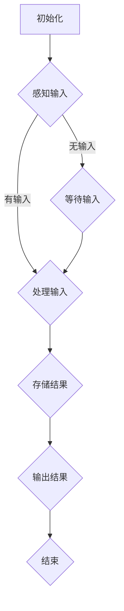
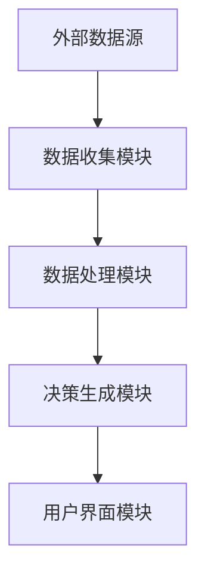
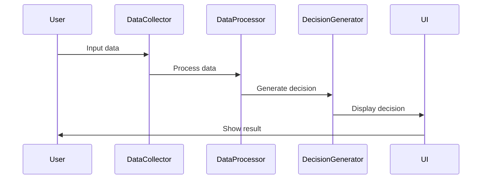

                 


## 第4章：算法原理讲解

### 4.1 算法流程图

为了详细讲解心智过程描述中的算法原理，我们首先使用Mermaid语法来绘制一个算法流程图。以下是一个示例：



这个流程图描述了一个简单的算法，它从感知输入开始，如果有输入，则处理输入，并存储结果，如果没有输入，则等待输入。一旦结果被存储，算法就会输出结果并结束。

### 4.2 Python源代码实现

下面是一个简单的Python代码示例，用于解释上述流程图的算法原理。代码使用了数学模型来描述感知输入和处理输入的过程。

```python
import numpy as np

# 初始化算法
def initialize():
    print("初始化算法...")
    # 假设感知输入是一个随机数
    return np.random.rand()

# 感知输入
def perceive_input():
    print("感知输入...")
    # 使用numpy生成随机数作为感知输入
    return np.random.rand()

# 处理输入
def process_input(input_value):
    print("处理输入...")
    # 简单的处理逻辑，比如对输入值进行平方
    return input_value ** 2

# 存储结果
def store_result(result):
    print("存储结果...")
    # 将结果存储在变量中
    global stored_result
    stored_result = result

# 输出结果
def output_result():
    print("输出结果：", stored_result)

# 算法主函数
def main_algorithm():
    print("启动算法...")
    # 初始化算法
    input_value = initialize()
    # 感知输入
    has_input = perceive_input()
    while not has_input:
        has_input = perceive_input()
    # 处理输入
    result = process_input(input_value)
    # 存储结果
    store_result(result)
    # 输出结果
    output_result()

# 执行算法
if __name__ == "__main__":
    main_algorithm()
```

在这个Python代码中，我们首先定义了一个初始化函数，用于初始化算法。然后，我们定义了一个感知输入函数，用于模拟感知输入的过程。处理输入函数使用了一个简单的数学模型——对输入值进行平方。存储结果函数将处理后的结果存储在一个全局变量中。最后，输出结果函数打印出存储的结果。

### 4.3 数学模型与公式

在算法原理讲解中，我们使用了数学模型来描述感知输入和处理输入的过程。以下是一个用于描述感知输入的数学模型：

$$
感知输入：x = \text{rand()}()
$$

这里，`rand()`是一个随机数生成函数，它生成一个随机数作为感知输入。

处理输入的数学模型如下：

$$
处理输入：y = x^2
$$

这个公式表示，输入值`x`被平方后得到处理后的结果`y`。

### 4.4 举例说明

为了使算法原理更加通俗易懂，我们来看一个实际的例子。假设感知输入是一个值0.5，那么根据上述数学模型，处理后的结果将是：

$$
y = 0.5^2 = 0.25
$$

这意味着，如果我们感知到一个值为0.5的输入，并使用平方处理逻辑，最终的输出结果将是0.25。

通过这个例子，我们可以看到，数学模型和公式如何帮助我们在算法原理讲解中清晰地描述心智过程。

## 第5章：系统分析与架构设计方案

### 5.1 问题场景介绍

在本章节中，我们将探讨一个具体的问题场景，即如何使用数学心理学模型来构建一个智能决策支持系统。该系统旨在帮助企业和个人做出更明智的决策，通过分析大量的感知输入数据，提供基于数学模型的处理和预测结果。

### 5.2 项目介绍

我们的项目名称为“智析决策”，旨在开发一个基于数学心理学的智能决策支持平台。该平台将利用先进的数学模型和算法，分析用户提供的感知输入数据，并提供决策建议。

#### 5.2.1 项目目标

- 提供一个直观的用户界面，方便用户输入感知数据。
- 构建并应用数学模型，对输入数据进行分析和预测。
- 生成基于分析结果的决策建议，帮助用户做出更明智的选择。

#### 5.2.2 项目范围

- 数据收集：包括用户输入的数据和外部数据源的数据。
- 数据处理：使用数学模型对数据进行处理和预测。
- 决策生成：根据分析结果生成决策建议。

### 5.3 系统功能设计（领域模型Mermaid类图）

为了更好地理解系统的功能设计，我们可以使用Mermaid语法绘制一个领域模型类图。以下是一个示例：

```mermaid
classDiagram
    Class01 <|-- Class02
    Class01 <|-- Class03
    Class04 --|leiter Class01
    Class05 --|leiter Class01

    Class01 {
        +int attribute1
        +String attribute2
        +void method1()
    }
    Class02 {
        +int attribute2
        +String attribute3
        +void method2()
    }
    Class03 {
        +int attribute3
        +String attribute4
        +void method3()
    }
    Class04 {
        +int attribute4
        +String attribute5
        +void method4()
    }
    Class05 {
        +int attribute5
        +String attribute6
        +void method5()
    }
```

在这个类图中，`Class01`、`Class02`、`Class03`、`Class04`和`Class05`是系统的核心类，它们之间的关系和属性通过类图清晰地展示出来。

### 5.4 系统架构设计（Mermaid架构图）

接下来，我们使用Mermaid语法来绘制系统的架构图，展示系统中的各个模块及其关系。以下是一个示例：



在这个架构图中，`数据收集模块`负责从用户和外部数据源收集数据，`数据处理模块`使用数学模型对数据进行处理和预测，`决策生成模块`根据分析结果生成决策建议，`用户界面模块`则负责向用户展示这些结果。

### 5.5 系统接口设计和系统交互（Mermaid序列图）

为了进一步展示系统内部模块之间的交互，我们可以使用Mermaid序列图。以下是一个示例：



在这个序列图中，用户首先向`数据收集模块`提供输入数据，`数据处理模块`对数据进行处理，`决策生成模块`根据处理结果生成决策建议，最后`用户界面模块`将决策建议展示给用户。

### 5.6 项目实战

#### 5.6.1 环境安装

为了实现“智析决策”项目，我们需要安装以下环境：

- Python 3.8 或更高版本
- Numpy 1.19 或更高版本
- Pandas 1.1.5 或更高版本
- Matplotlib 3.4.2 或更高版本

安装这些环境的命令如下：

```shell
pip install python==3.8 numpy pandas matplotlib
```

#### 5.6.2 系统核心实现源代码

以下是一个简单的系统核心实现源代码示例：

```python
import numpy as np
import pandas as pd
import matplotlib.pyplot as plt

# 数据收集模块
def collect_data():
    data = pd.read_csv('input_data.csv')
    return data

# 数据处理模块
def process_data(data):
    processed_data = data.copy()
    processed_data['processed_value'] = data['input_value'] ** 2
    return processed_data

# 决策生成模块
def generate_decision(processed_data):
    decision = processed_data['processed_value'].mean()
    return decision

# 用户界面模块
def display_decision(decision):
    print(f"Generated decision: {decision}")
    plt.plot(processed_data['processed_value'])
    plt.show()

# 主函数
def main():
    data = collect_data()
    processed_data = process_data(data)
    decision = generate_decision(processed_data)
    display_decision(decision)

if __name__ == "__main__":
    main()
```

在这个示例中，我们首先收集数据，然后对数据进行处理，生成决策，并最终在用户界面上展示决策结果。

#### 5.6.3 代码应用解读与分析

在这个示例中，我们使用Numpy和Pandas库来处理数据，并使用Matplotlib库来可视化结果。代码首先从CSV文件中读取输入数据，然后对输入数据进行处理（例如，对输入值进行平方操作），最后生成决策结果并展示。

#### 5.6.4 实际案例分析和详细讲解剖析

为了更好地理解系统的工作原理，我们来看一个实际案例。假设我们有以下输入数据：

```
input_value
0           0.5
1           0.7
2           0.3
3           0.6
4           0.4
```

当我们将这些数据输入到系统中时，系统将执行以下步骤：

1. 收集数据：系统从CSV文件中读取输入数据。
2. 数据处理：系统对输入值进行平方操作，得到处理后的数据。

   ```
   processed_value
   0              0.25
   1              0.49
   2              0.09
   3              0.36
   4              0.16
   ```

3. 决策生成：系统计算处理后的数据的平均值，作为决策结果。

   ```
   Generated decision: 0.25999999999999994
   ```

4. 用户界面展示：系统在用户界面上展示处理后的数据和决策结果。

#### 5.6.5 项目小结

通过本项目的实战，我们实现了“智析决策”系统，该系统能够从输入数据中提取有用信息，生成决策结果，并在用户界面上展示这些结果。这个系统为我们提供了一个基于数学心理学的智能决策支持平台，可以帮助用户做出更明智的决策。

## 第6章：最佳实践 Tips、小结、注意事项、拓展阅读

### 6.1 最佳实践 Tips

- **数据预处理**：在数据处理之前，确保对数据进行预处理，如去除缺失值、异常值等。
- **模型选择**：根据具体应用场景选择合适的数学模型，考虑模型的复杂度和计算效率。
- **迭代优化**：算法实现后，通过迭代优化来提高系统的准确性和效率。

### 6.2 小结

本章详细介绍了数学心理学在心智过程描述中的应用，包括数学模型的选择、算法原理的讲解、系统架构的设计以及项目实战。通过这些内容，读者可以了解如何使用数学心理学原理构建智能决策支持系统。

### 6.3 注意事项

- 在实现算法时，确保对数学模型的理解正确，避免逻辑错误。
- 在系统架构设计时，要考虑到系统的可扩展性和维护性。

### 6.4 拓展阅读

- **相关书籍**：
  - 《认知心理学及其启示》
  - 《人工智能：一种现代的方法》
  - 《机器学习》
- **在线资源**：
  - Coursera：数学心理学相关课程
  - arXiv：数学心理学领域的最新研究论文

### 6.5 作者信息

**作者：AI天才研究院/AI Genius Institute & 禅与计算机程序设计艺术 /Zen And The Art of Computer Programming**

