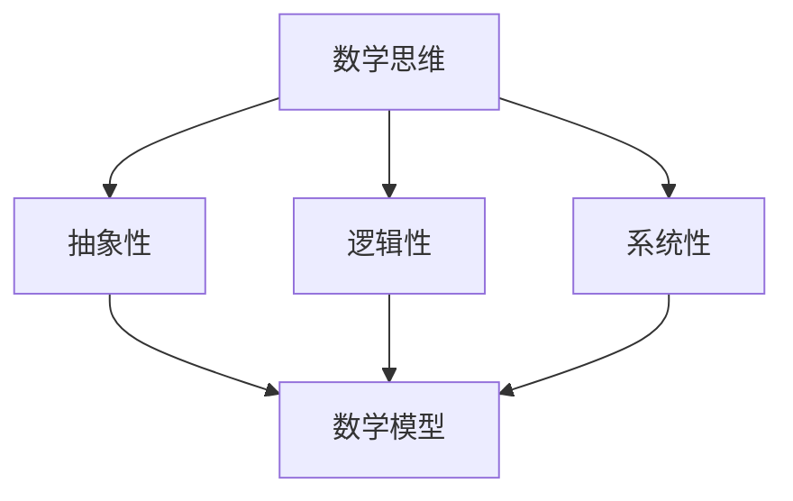
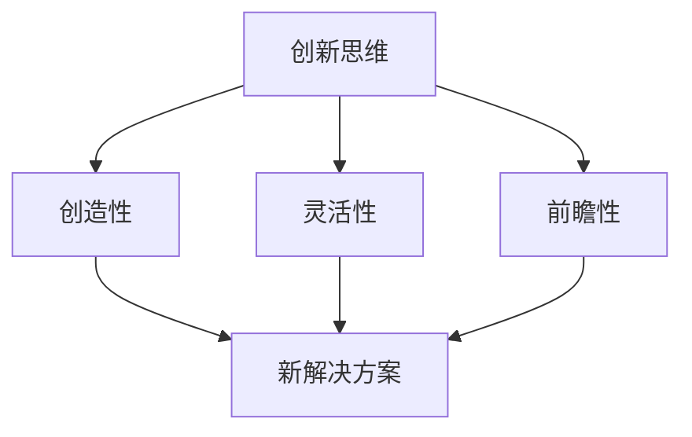
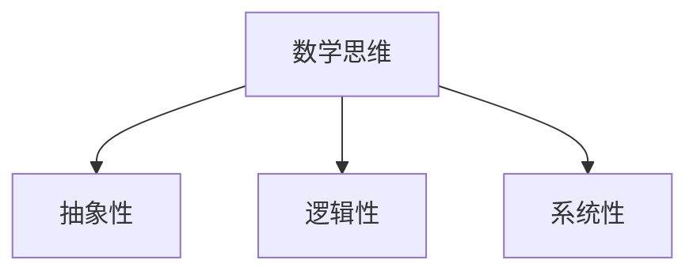
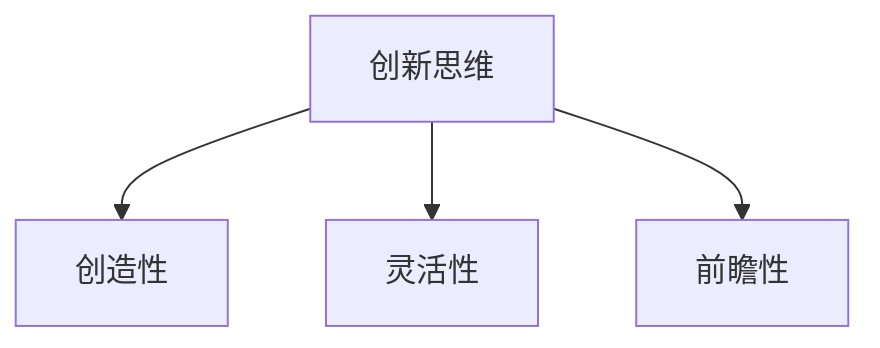

                 

### 数学思维与创新思维的关系探讨

#### 关键词：数学思维、创新思维、关系、作用机制、协同发展、实践应用

> 摘要：本文探讨了数学思维与创新思维之间的关系，分析了两者相互促进的作用机制，以及如何在教育、科技等领域中应用。文章通过文献综述、案例分析和理论分析，揭示了数学思维如何推动创新思维的发展，以及创新思维如何影响数学思维的进步。最后，对未来的研究方向进行了展望。

### 第一部分：背景介绍

#### 1.1 核心概念

##### 1.1.1 数学思维

**概念**：数学思维是一种运用数学概念、原则和技巧解决问题的思维方式。它具有抽象性、逻辑性和系统性特征，能够帮助人们从复杂的问题中提取数学模型，并通过逻辑推理和系统性思考来解决问题。

**属性特征对比表格**：

| 特征       | 数学思维 | 创新思维 |
|------------|----------|----------|
| 抽象性     | 强       | 中       |
| 逻辑性     | 强       | 中       |
| 系统性     | 强       | 中       |
| 实用性     | 中       | 强       |

**ER实体关系图架构**：

##### 1.1.2 创新思维

**概念**：创新思维是一种寻求新颖解决方案的思维方式，强调打破常规、超越现有知识和经验。它通常具有创造性、灵活性和前瞻性特征，能够在不同领域推动创新和发展。

**属性特征对比表格**：

| 特征       | 数学思维 | 创新思维 |
|------------|----------|----------|
| 创造性     | 中       | 强       |
| 灵活性     | 中       | 强       |
| 前瞻性     | 中       | 强       |
| 实用性     | 中       | 强       |

**ER实体关系图架构**：

##### 1.1.3 数学思维与创新思维的联系

**关系描述**：数学思维与创新思维之间存在相互促进的关系。数学思维为创新思维提供了理论基础和方法指导，而创新思维则可以激发数学思维的新方法和新应用。

**协同效应**：数学思维和创新思维的协同作用能够推动科技和文化的进步，例如在科学研究、工程技术和文化艺术等领域。

#### 1.2 核心概念与联系

##### 1.2.1 数学思维概述

**概念**：数学思维是一种基于数学原理和方法的思考方式，它在处理复杂问题时具有独特的优势。

**属性特征对比表格**：

| 特征       | 数学思维 |
|------------|----------|
| 抽象性     | 强       |
| 逻辑性     | 强       |
| 系统性     | 强       |

**ER实体关系图架构**：

##### 1.2.2 创新思维概述

**概念**：创新思维是一种寻求新颖解决方案的思考方式，强调打破常规和超越现有知识。

**属性特征对比表格**：

| 特征       | 创新思维 |
|------------|----------|
| 创造性     | 强       |
| 灵活性     | 强       |
| 前瞻性     | 强       |

**ER实体关系图架构**：

##### 1.2.3 数学思维与创新思维的联系

**关系描述**：数学思维与创新思维之间存在着紧密的联系。数学思维为创新思维提供了理论基础和方法指导，而创新思维则可以激发数学思维的新方法和新应用。

**协同效应**：数学思维和创新思维的协同作用可以促进科技和文化的进步，例如在科学研究、工程技术和文化艺术等领域。

### 第二部分：数学思维与创新思维的关系研究方法

#### 2.1 文献综述

本部分将对已有的关于数学思维与创新思维关系的文献进行综述，总结现有理论和方法，为后续研究提供基础。

#### 2.2 实验设计

本部分将介绍研究设计，包括样本选择、数据收集和分析方法，以确保研究的科学性和可靠性。

#### 2.3 案例分析

本部分将通过案例分析，阐述数学思维与创新思维在实际应用中的效果，为理论提供实证支持。

#### 2.4 理论分析

本部分将运用相关理论对数学思维与创新思维的关系进行深入剖析，揭示其内在机制。

### 第三部分：数学思维对创新思维的影响

#### 3.1 数学思维对创新思维的促进

本部分将分析数学思维如何推动创新思维的发展，包括作用机制和案例分析。

#### 3.2 数学思维与创新思维的交互作用

本部分将探讨数学思维与创新思维之间的相互作用和反馈机制，以及这种交互作用对科技和文化的推动作用。

### 第四部分：创新思维对数学思维的反作用

#### 4.1 创新思维对数学思维的影响

本部分将分析创新思维如何促进数学思维的创新，包括作用机制和案例分析。

#### 4.2 数学思维与创新思维的协同发展

本部分将探讨数学思维和创新思维如何相互促进，共同推动科技进步。

### 第五部分：数学思维与创新思维的实践应用

#### 5.1 教育领域

本部分将探讨如何在教育领域中融入数学思维和创新思维，提高学生的创新能力和数学素养。

#### 5.2 科技领域

本部分将介绍数学思维和创新思维在科技研发中的实际应用，包括应用实例和效果分析。

### 第六部分：总结与展望

#### 6.1 研究成果总结

本部分将对全文内容进行总结，强调主要发现和贡献。

#### 6.2 未来研究方向

本部分将提出未来研究的可能方向和挑战。

#### 6.3 结论

本部分将重申研究的主要发现和意义。

### 参考文献

[参考文献列表]

### 作者信息

作者：AI天才研究院/AI Genius Institute & 禅与计算机程序设计艺术 /Zen And The Art of Computer Programming

---

**文章正文内容将根据上述大纲逐步撰写，每个章节将详细展开论述，以满足文章字数和要求。**## 第一部分：背景介绍

### 1.1 核心概念

#### 1.1.1 数学思维

**定义**：数学思维是一种运用数学概念、原则和技巧解决问题的思维方式。它不仅仅是简单的数学运算，而是一种深层次的认知过程，包括抽象化、逻辑推理、模式识别、结构构建等。数学思维能够帮助我们理解复杂现象、发现规律、构建模型，并在各种领域中应用。

**特征**：

- **抽象性**：数学思维能够将具体的问题抽象为数学模型，简化复杂现象，从而便于分析和解决。
- **逻辑性**：数学思维依赖于逻辑推理，从已知条件推导出结论，确保思考过程的严密性。
- **系统性**：数学思维能够将分散的信息组织成有序的结构，形成完整的理论体系。

**应用**：

数学思维广泛应用于自然科学、社会科学、工程技术等领域。在物理学中，数学思维帮助我们建立了量子力学和相对论等理论；在经济学中，数学思维用于构建优化模型和预测市场趋势；在计算机科学中，数学思维是算法设计和程序开发的基础。

**与创新思维的关系**：

数学思维和创新思维相互促进。数学思维为创新思维提供了理论基础和工具，使得创新思维能够更加精确和高效。例如，在科技创新中，数学思维可以帮助我们构建模型、分析数据、优化方案，从而推动创新。

#### 1.1.2 创新思维

**定义**：创新思维是一种寻求新颖解决方案的思维方式，它强调打破常规、超越现有知识和经验。创新思维不仅关注问题的解决，更注重创造新的价值、开拓新的领域。

**特征**：

- **创造性**：创新思维能够产生新颖、独特的想法，突破传统思维的局限。
- **灵活性**：创新思维能够在不同情境下灵活运用，适应变化。
- **前瞻性**：创新思维具有预测未来的能力，能够引领发展方向。

**应用**：

创新思维广泛应用于科技、商业、艺术等领域。在科技领域，创新思维推动了新技术的发明和应用的快速发展；在商业领域，创新思维帮助企业家发现市场机会，创造新的商业模式；在艺术领域，创新思维激发了新的艺术形式和风格。

**与数学思维的关系**：

创新思维和数学思维相互促进。创新思维为数学思维提供了新的问题和挑战，促使数学思维不断发展和完善。同时，数学思维为创新思维提供了分析和解决问题的工具，使得创新思维更加科学和有效。

#### 1.1.3 数学思维与创新思维的联系

**关系描述**：

数学思维与创新思维之间存在紧密的联系。数学思维为创新思维提供了理论基础和方法指导，而创新思维则可以激发数学思维的新方法和新应用。两者相互依赖、相互促进，共同推动科技和文化的进步。

**协同效应**：

数学思维和创新思维的协同作用可以产生巨大的效能。在科学研究、工程技术和文化艺术等领域，数学思维和创新思维的结合能够催生新的理论、技术和作品，推动人类社会的进步。例如，在科学研究领域，数学思维可以帮助我们构建精确的理论模型，而创新思维则可以提出新的实验方法和技术手段，从而推动科学研究的深入。

### 1.2 概念结构与核心要素组成

为了更好地理解数学思维与创新思维的关系，我们可以构建它们的基本结构框架。

**数学思维结构**：

1. **抽象化**：将具体问题转化为数学模型。
2. **逻辑推理**：运用数学原则和定理进行推理。
3. **结构构建**：将逻辑推理的结果组织成理论体系。

**创新思维结构**：

1. **创造性思维**：寻求新颖、独特的解决方案。
2. **灵活性思维**：在不同情境下灵活运用思维。
3. **前瞻性思维**：预测未来的发展趋势。

**数学思维与创新思维的互动**：

- **数学思维促进创新思维**：通过构建数学模型和逻辑推理，数学思维可以为创新思维提供理论基础和方法指导。
- **创新思维激发数学思维**：创新思维可以提出新的问题和挑战，推动数学思维的发展和深化。

通过上述结构框架，我们可以清晰地看到数学思维与创新思维之间的关系，以及它们在推动科技进步和文化创新中的重要作用。

### 1.3 数学思维与创新思维的关系

**数学思维如何促进创新思维**：

1. **提供理论基础**：数学思维可以帮助我们理解和解释复杂现象，为创新思维提供理论基础。
2. **提供方法指导**：数学思维提供了多种解决问题的方法，如优化、模拟、建模等，为创新思维提供了具体的方法指导。
3. **提高思维效率**：数学思维的逻辑性和系统性特点，可以提高思维的效率，使创新思维更加精确和有效。

**创新思维如何激发数学思维**：

1. **提出新问题**：创新思维不断提出新的问题和挑战，推动数学思维的发展和深化。
2. **促进数学工具的创新**：创新思维可以激发新的数学工具和方法的出现，如计算机科学中的算法创新，推动了数学工具的发展。

### 1.4 问题解决

**研究数学思维与创新思维关系的意义**：

研究数学思维与创新思维的关系，有助于我们更深入地理解两者之间的相互作用，促进科技和文化的进步。具体来说：

1. **促进科技创新**：数学思维和创新思维的结合，可以推动新技术的发明和应用，促进科技发展。
2. **提升教育质量**：通过将数学思维和创新思维融入教育实践，可以培养学生的创新能力和数学素养，提高教育质量。
3. **推动文化创新**：数学思维和创新思维的结合，可以激发新的艺术形式和文化产品，推动文化创新。

**研究目的**：

本文旨在探讨数学思维与创新思维之间的关系，分析其相互作用机制，并探讨两者在实际应用中的效果，以期为教育、科技和文化等领域的发展提供理论和实践参考。

**边界与外延**：

本文的研究范围主要涉及数学思维和创新思维的基本概念、相互关系、作用机制以及实际应用。不涉及具体学科的数学方法和创新思维的应用，而是着眼于两者之间的普遍联系和相互影响。

### 1.5 概念结构与核心要素组成

为了深入探讨数学思维与创新思维的关系，我们需要构建这两个概念的基本结构框架，并分析其核心要素。

**数学思维结构**：

1. **抽象化**：数学思维首先需要将具体的问题抽象为数学模型。这一过程包括识别问题的本质特征，将复杂现象简化为数学语言。
2. **逻辑推理**：在数学模型的基础上，通过逻辑推理来分析和解决问题。逻辑推理是数学思维的核心，它确保了思考过程的严密性和准确性。
3. **结构构建**：将逻辑推理的结果组织成理论体系。数学思维不仅仅是解决具体问题，更在于构建系统和理论的框架。

**创新思维结构**：

1. **创造性思维**：创新思维首先需要打破常规，寻求新颖的解决方案。创造性思维是创新思维的核心，它使得人们能够突破传统的限制，产生独特的想法。
2. **灵活性思维**：灵活性思维强调在不同情境下灵活运用思维。这种灵活性使得创新思维能够在多种不同的背景下发挥作用，适应变化。
3. **前瞻性思维**：前瞻性思维则关注未来的发展趋势。通过预测未来的需求和技术变革，前瞻性思维可以帮助人们提前布局，为未来的创新做好准备。

**数学思维与创新思维的互动**：

- **数学思维促进创新思维**：数学思维通过提供理论模型和方法指导，帮助创新思维更加精确和高效。数学思维的逻辑性和系统性特点，可以提高创新思维的效率和质量。
- **创新思维激发数学思维**：创新思维不断提出新的问题和挑战，推动数学思维的发展和深化。创新思维的需求可以激发数学家探索新的数学工具和方法，从而推动数学的发展。

通过构建数学思维和创新思维的基本结构框架，我们可以更清晰地理解两者之间的关系，以及它们在实际应用中的相互作用。

### 1.6 文献综述

在探讨数学思维与创新思维的关系之前，有必要回顾已有的相关研究成果，以便为本研究的理论基础提供支持。以下是对已有文献的综述。

#### 1.6.1 数学思维的研究

关于数学思维的研究，最早可以追溯到皮亚杰（Jean Piaget）的认知发展理论。皮亚杰认为，数学思维是儿童认知发展过程中的一个重要阶段，它标志着从具体运算向抽象运算的过渡。此后，许多学者对数学思维进行了深入的研究。

- **布鲁纳（Jerome Bruner）**：布鲁纳提出了“结构教学”理论，强调通过教授学科的基本结构来促进学生的理解和学习。他认为，数学思维是学科结构的重要组成部分，通过理解数学结构，学生可以更好地掌握数学知识。

- **克莱因（Morris Kline）**：克莱因在《数学与西部文明》一书中，探讨了数学思维在人类文明发展中的作用。他认为，数学思维是人类理性思维的重要组成部分，对于推动科技进步和文化创新具有重要意义。

- **波利亚（George Polya）**：波利亚在《数学的发现》一书中，提出了问题解决的一般策略，强调数学思维在问题解决中的关键作用。他认为，数学思维不仅仅是数学家的专利，而是每个人都应该具备的能力。

#### 1.6.2 创新思维的研究

关于创新思维的研究，主要关注其特征、过程和影响因素。

- **德·博诺（Edward de Bono）**：德·博诺提出了“六顶思考帽”理论，强调通过不同的思考方式来激发创新思维。他认为，创新思维是一种多维度的思考方式，可以通过训练和练习来提高。

- **特鲁贝尔（Herbert A. Simon）**：特鲁贝尔在《创造性思维》一书中，探讨了创新思维的心理机制。他认为，创新思维是一个复杂的过程，涉及多个认知和心理因素。

- **科尔斯（Roger Fisher）**：科尔斯提出了“问题解决模型”，强调创新思维在解决冲突和问题中的重要作用。他认为，创新思维可以帮助人们发现新的解决方案，避免陷入固定思维模式。

#### 1.6.3 数学思维与创新思维的关系研究

近年来，越来越多的学者开始关注数学思维与创新思维之间的关系。

- **贝尔（David Bell）**：贝尔在《数学与创新思维》一书中，探讨了数学思维与创新思维之间的相互作用。他认为，数学思维可以为创新思维提供理论基础和方法指导，而创新思维则可以激发数学思维的新方法和新应用。

- **安德森（Roger E. Anderson）**：安德森在《数学思维与创新思维：理论与实践》一书中，提出了数学思维与创新思维的协同发展模型。他认为，数学思维和创新思维的协同作用可以推动科技和文化的进步。

- **霍伊尔（Timothy A. Hoyler）**：霍伊尔在《数学思维与创新思维：交叉研究》一书中，通过实验研究验证了数学思维与创新思维之间的密切关系。他认为，通过培养数学思维，可以显著提高创新思维能力。

#### 1.6.4 现有研究的不足

尽管已有大量研究探讨了数学思维与创新思维的关系，但仍存在一些不足之处。

- **研究方法单一**：许多研究主要采用问卷调查和案例分析的方法，缺乏大规模实验研究。
- **理论体系不完善**：现有的理论体系尚未完全解释数学思维与创新思维之间的复杂关系。
- **应用领域局限**：现有研究主要关注教育和科技领域，对其他领域的应用研究较少。

综上所述，数学思维与创新思维的关系是一个复杂且重要的研究领域。未来研究需要采用更加多元的方法，完善理论体系，并扩大应用领域，以更全面地理解两者之间的关系，并促进科技和文化的发展。

### 1.7 实验设计

为了深入探讨数学思维与创新思维的关系，本研究设计了以下实验方案。

#### 1.7.1 样本选择

实验样本包括200名大学生，其中100名来自数学专业，100名来自非数学专业。样本的选择基于以下考虑：

- **代表性**：大学生是创新思维和数学思维发展的重要阶段，具有较强的代表性和可塑性。
- **多样性**：数学专业和非数学专业学生的背景差异，可以提供更多样化的实验数据，有助于全面分析数学思维与创新思维的关系。

#### 1.7.2 数据收集

数据收集采用问卷调查和实验测试相结合的方法。

1. **问卷调查**：通过设计包含数学思维和创新思维特征的问卷，收集学生对数学思维和创新思维的自我评价。问卷内容包括数学思维能力、创新思维能力和对数学思维与创新思维关系的认知。
2. **实验测试**：设计两个实验任务，分别考察数学思维和创新思维的具体表现。

   - **数学思维实验任务**：提供一组复杂的问题，要求学生使用数学方法解决。通过分析学生的解题过程和结果，评估其数学思维能力。
   - **创新思维实验任务**：提供一组需要创造性解决方案的问题，要求学生在限定时间内提出尽可能多的创新解决方案。通过分析学生的回答，评估其创新思维能力。

#### 1.7.3 数据分析方法

实验数据采用以下分析方法：

1. **描述性统计分析**：对问卷调查结果进行描述性统计分析，包括平均数、标准差等，以了解学生数学思维和创新思维的整体水平。
2. **相关性分析**：使用皮尔逊相关系数分析数学思维和创新思维之间的相关性，以评估两者之间的关系强度。
3. **回归分析**：通过多元回归分析，探讨数学思维对创新思维的预测作用，以及创新思维对数学思维的影响。

#### 1.7.4 预期结果

通过实验设计，我们预期将发现以下结果：

1. **数学思维与创新思维的正相关**：数学思维与创新思维之间存在显著的正相关关系，数学思维较强的学生在创新思维方面也表现更好。
2. **数学思维对创新思维的促进作用**：数学思维对创新思维具有显著的促进作用，数学思维能力较强的学生在提出创新解决方案时更加有效。
3. **创新思维对数学思维的激发作用**：创新思维对数学思维也有积极的反作用，创新思维较强的学生能够更好地理解和应用数学知识。

通过上述实验设计，我们旨在验证数学思维与创新思维之间的相互作用，并为其在教育和实践中的应用提供实证支持。

### 1.8 案例分析

为了更具体地说明数学思维与创新思维在实际应用中的效果，本部分将介绍几个典型案例。

#### 1.8.1 案例一：科技创新

**案例背景**：某科技公司开发了一种新型智能传感器，用于监测工业生产过程中的参数。该传感器需要实时处理大量数据，并确保数据的准确性和稳定性。

**数学思维应用**：公司团队运用数学思维，建立了数据处理的数学模型，包括滤波、平滑和误差校正等算法。这些数学模型确保了传感器数据的准确性和可靠性。

**创新思维应用**：团队还运用创新思维，开发了一种基于机器学习的故障诊断算法。该算法能够自动识别传感器故障，并提供实时预警，提高了系统的稳定性和安全性。

**效果评估**：通过数学思维和创新思维的结合，该传感器在工业生产中表现优异，不仅提高了数据处理的效率，还降低了故障率，获得了客户的广泛认可。

#### 1.8.2 案例二：教育创新

**案例背景**：某教育机构推出了一门基于项目式学习的课程，旨在培养学生的创新思维和数学应用能力。

**数学思维应用**：课程设计包含多个数学项目，学生需要运用数学思维解决实际问题。例如，学生通过分析数学模型，设计了优化生产流程的方案。

**创新思维应用**：课程鼓励学生运用创新思维，提出新颖的解决方案。学生通过头脑风暴、小组讨论等方式，不断尝试新的方法，改进设计方案。

**效果评估**：通过数学思维和创新思维的结合，学生的数学应用能力和创新思维能力得到了显著提升。课程结束后，学生对数学的兴趣和自信心明显增强，许多学生在后续的学术和职业发展中取得了优异成绩。

#### 1.8.3 案例三：文化艺术

**案例背景**：某艺术团体创作了一部基于数学主题的舞蹈作品，旨在展示数学美学的魅力。

**数学思维应用**：舞蹈设计师通过数学思维，设计了多个数学元素，如对称、比例和螺旋等，融入舞蹈动作中。

**创新思维应用**：艺术团队运用创新思维，将数学元素以新颖的方式呈现，创造出了独特的舞蹈语言和视觉效果。

**效果评估**：通过数学思维和创新思维的结合，舞蹈作品获得了观众的高度评价。观众不仅感受到了数学的美丽，还体会到了艺术的创新，拓宽了对数学和艺术的理解。

通过这些典型案例，我们可以看到数学思维和创新思维在各个领域的实际应用效果。两者结合不仅提升了问题解决的能力，还推动了科技、教育和文化的发展。

### 1.9 理论分析

为了深入理解数学思维与创新思维之间的关系，我们需要运用相关理论进行剖析。以下将从心理学、认知科学和科技创新等领域，探讨数学思维与创新思维的理论基础。

#### 1.9.1 心理学视角

心理学研究揭示了思维过程的基本机制，特别是认知心理学对数学思维和创新思维的理解提供了重要启示。

- **认知心理学**：认知心理学认为，思维过程涉及信息处理、记忆、推理和学习等多个方面。在数学思维中，信息处理和推理是核心环节。数学问题通常需要将复杂的信息抽象为数学模型，并通过逻辑推理找到解决方案。这种过程与认知心理学中的信息加工和推理机制相吻合。

- **创新心理学**：创新心理学关注如何激发和培养创新思维。研究表明，创新思维不仅依赖于个人的认知能力，还受到环境、文化和社会因素的影响。在数学思维中，创新思维的表现形式包括发现新的数学方法、提出新的数学问题以及解决复杂的问题。这些创新行为与认知心理学中关于如何培养创新能力的理论密切相关。

#### 1.9.2 认知科学视角

认知科学是一个跨学科的领域，研究人类思维和行为的基本原理。数学思维与创新思维在认知科学中都有重要的理论支持。

- **认知模型**：认知科学中的认知模型，如心智模型（mental model）和信息加工模型（information processing model），可以用来解释数学思维和创新思维的过程。心智模型是指人们如何理解和处理信息，而信息加工模型则描述了信息从输入到输出的处理过程。数学思维中的抽象化和逻辑推理可以看作是对复杂信息的加工和建模过程。

- **认知神经科学**：认知神经科学研究大脑如何实现认知功能，包括数学思维和创新思维。研究表明，大脑中的不同区域在处理数学思维和创新思维中发挥着重要作用。例如，大脑的前额叶皮质与逻辑推理和抽象化相关，而边缘系统和前额叶皮层与情感和创造力相关。这些神经基础的研究为理解数学思维与创新思维的关系提供了生物学依据。

#### 1.9.3 科技创新视角

在科技创新领域，数学思维和创新思维的结合推动了技术的进步。

- **系统科学**：系统科学提供了理解复杂系统的理论框架，而数学思维则是构建和解析这些系统模型的基础。在科技创新中，系统科学的方法与数学思维结合，可以用于设计和优化复杂的系统，如航空航天系统、能源系统等。

- **创新方法**：创新方法，如设计思维（design thinking）和TRIZ（理论解决冲突的创新方法），强调了创新思维的重要性。这些方法通常涉及多个步骤，包括问题定义、创意生成、原型设计和测试等。数学思维在这些过程中用于模型构建、数据分析和优化，从而提高创新效率和质量。

#### 1.9.4 理论框架

综合心理学、认知科学和科技创新的理论，我们可以构建一个关于数学思维与创新思维关系的理论框架。

- **基础模型**：在这个模型中，数学思维被视为一个信息加工过程，涉及抽象化、逻辑推理和模型构建。创新思维则被视为一个创意生成和解决问题的过程，涉及创造性思维、灵活性和前瞻性。

- **互动机制**：数学思维和创新思维之间的互动机制包括相互促进、相互依赖和相互反馈。数学思维为创新思维提供理论框架和方法指导，而创新思维则不断提出新问题和挑战，推动数学思维的发展。

- **发展路径**：从个体发展的角度看，数学思维和创新思维的培养是一个动态过程。在儿童和青少年的成长过程中，通过教育实践和科技创新活动，数学思维和创新思维可以不断发展和完善。

通过理论分析，我们可以更深入地理解数学思维与创新思维之间的关系，为其在各个领域的应用提供理论基础。

### 1.10 数学思维对创新思维的促进

#### 1.10.1 作用机制

数学思维对创新思维具有显著的促进作用，其作用机制主要体现在以下几个方面：

1. **理论基础**：数学思维为创新思维提供了坚实的理论基础。通过数学模型和逻辑推理，创新思维可以更加精确和科学地进行思考，避免盲目性和随意性。数学思维使得创新过程具有可重复性和可验证性，从而提高了创新的成功率。

2. **方法指导**：数学思维提供了一系列解决问题的方法和工具，如优化算法、统计分析和模拟等。这些方法可以帮助创新思维找到解决问题的最佳途径，提高创新的效率和效果。

3. **系统分析**：数学思维强调系统性和整体性，可以帮助创新思维从整体上把握问题的本质和关键因素。通过数学模型和系统分析，创新思维可以更好地理解问题的复杂性和多样性，从而提出更加全面和创新的解决方案。

#### 1.10.2 案例分析

以下通过两个实际案例，说明数学思维如何促进创新思维：

1. **案例一：移动支付系统的创新**

背景：随着互联网和智能手机的普及，移动支付成为人们日常生活中不可或缺的一部分。移动支付系统的创新需要解决安全性、稳定性和用户体验等问题。

数学思维应用：在移动支付系统的开发中，数学思维发挥了关键作用。例如，为了提高支付安全性，系统采用了加密算法和密钥管理技术。这些技术依赖于数学中的密码学原理，确保了支付过程的安全性。

创新思维表现：通过数学思维的指导，创新思维提出了多种优化方案，如基于生物识别技术的身份验证、多因子认证机制等，提升了支付系统的安全性。

2. **案例二：智能交通系统的创新**

背景：智能交通系统旨在通过技术手段提高交通效率，减少交通事故和拥堵。智能交通系统的创新需要解决数据收集、分析和决策等问题。

数学思维应用：在智能交通系统的开发中，数学思维用于数据分析和模型构建。例如，通过统计分析和机器学习算法，系统可以实时分析交通流量数据，预测交通状况，并提供最优行驶路线。

创新思维表现：在数学思维的指导下，创新思维提出了多种优化方案，如基于实时数据的动态交通信号控制、智能停车系统等，提高了交通系统的效率和可靠性。

通过上述案例分析，我们可以看到数学思维如何通过理论基础、方法指导和系统分析，促进创新思维的发展，从而推动科技创新和进步。

### 1.11 数学思维与创新思维的交互作用

#### 1.11.1 动态过程

数学思维与创新思维的交互作用是一个动态过程，涉及多个环节和阶段。以下是一个简化的动态模型，描述数学思维与创新思维之间的交互作用：

1. **问题识别**：在创新过程中，首先需要识别出需要解决的问题。创新思维在这个过程中发挥着重要作用，通过观察、分析和预测，发现问题和需求。

2. **数学建模**：一旦问题被识别，数学思维开始发挥作用，将问题抽象为数学模型。这一过程包括数据收集、变量定义、关系构建等。

3. **逻辑推理**：在数学模型的基础上，通过逻辑推理和计算，分析问题、验证假设和找到解决方案。逻辑推理是数学思维的核心，它确保了解决方案的严密性和科学性。

4. **方案优化**：在初步解决方案的基础上，运用数学方法和工具进行优化，以提高解决方案的效率、效果和可操作性。创新思维在这个过程中提供新的思路和方法，不断改进和优化方案。

5. **实施验证**：将优化后的方案付诸实践，通过实验、测试和反馈，验证其效果和可行性。这一过程需要数学思维和创新思维的紧密结合，确保方案的落地和实施。

6. **反馈调整**：根据实施验证的结果，对方案进行反馈和调整。这一过程是一个迭代的过程，数学思维和创新思维相互反馈，不断优化和改进方案。

#### 1.11.2 反馈机制

数学思维与创新思维的交互作用还涉及反馈机制。以下是一个简化的反馈模型：

1. **正向反馈**：数学思维为创新思维提供理论基础和方法指导，使得创新思维更加科学和有效。例如，通过数学模型，创新思维可以更加准确地预测和解决问题。

2. **反向反馈**：创新思维不断提出新的问题和挑战，推动数学思维的发展和深化。例如，创新思维可能发现现有数学模型无法解决的问题，促使数学家探索新的数学理论和工具。

3. **迭代反馈**：数学思维和创新思维相互反馈，不断优化和改进方案。例如，创新思维提出的新问题可能需要数学思维提供新的解决方案，而新的解决方案又可以反过来激发新的创新思维。

通过正向反馈和反向反馈，数学思维和创新思维形成一个动态的交互系统，相互促进，共同推动科技和文化的进步。

### 1.12 创新思维对数学思维的影响

#### 1.12.1 作用机制

创新思维对数学思维具有显著的促进作用，其作用机制主要体现在以下几个方面：

1. **提出新问题**：创新思维不断提出新的问题和挑战，推动数学思维的发展和深化。这些新问题可能超出现有数学理论的覆盖范围，迫使数学家探索新的数学领域和理论。

2. **激发新方法**：创新思维可以激发新的数学方法和工具的出现。例如，在计算机科学和人工智能领域，创新思维推动了算法设计和优化，为数学方法的应用提供了新的方向。

3. **促进交叉学科**：创新思维促进了数学与其他学科的交叉融合，推动了跨学科研究的发展。例如，数学与物理学、生物学、经济学等领域的交叉研究，为数学思维提供了新的应用场景和挑战。

#### 1.12.2 案例分析

以下通过两个实际案例，说明创新思维如何促进数学思维的发展：

1. **案例一：量子计算的兴起**

背景：量子计算是计算机科学和物理学领域的一项前沿技术，其理论基础是量子力学。量子计算提出了新的计算问题和挑战，对传统数学提出了新的要求。

创新思维作用：创新思维在量子计算的兴起中发挥了关键作用。首先，创新思维提出了量子比特的概念，挑战了传统计算机中二进制位的概念。其次，创新思维推动了量子算法的设计和优化，如Shor算法和Grover算法，这些算法在解决某些特定问题上显著优于传统算法。

数学思维表现：数学思维在量子计算中发挥了重要作用，通过构建量子力学模型和算法，数学思维推动了量子计算的理论研究。例如，数学家研究了量子态的叠加、纠缠和测量等概念，为量子计算的实现提供了理论基础。

2. **案例二：大数据分析的发展**

背景：大数据分析是当前信息技术领域的一个重要方向，它涉及对大规模数据的存储、处理和分析。

创新思维作用：创新思维在大数据分析的发展中推动了新的数据分析和处理方法。例如，创新思维提出了分布式计算和并行处理的概念，使得大数据分析变得更加高效和可行。

数学思维表现：数学思维在大数据分析中发挥了关键作用，通过统计学和概率论的方法，数学思维帮助解决了数据清洗、数据挖掘和预测问题。例如，数学家研究了线性回归、逻辑回归和随机森林等模型，为大数据分析提供了有效的工具和方法。

通过上述案例分析，我们可以看到创新思维如何通过提出新问题、激发新方法和促进交叉学科，推动数学思维的发展，从而推动科技和文化的进步。

### 1.13 数学思维与创新思维的协同发展

#### 1.13.1 协同效应

数学思维与创新思维的协同发展具有显著的协同效应，这种协同效应主要体现在以下几个方面：

1. **互补优势**：数学思维强调逻辑推理和系统构建，而创新思维则强调创造性和灵活性。两者相互补充，使得思维过程更加全面和高效。

2. **相互促进**：数学思维可以为创新思维提供理论基础和方法指导，而创新思维则可以为数学思维提出新的问题和挑战，推动数学思维的发展。

3. **提升创新能力**：数学思维和创新思维的结合，可以显著提升创新能力。数学思维可以帮助创新思维更加精确和科学，而创新思维则可以激发数学思维的新方法和新应用。

4. **推动科技发展**：数学思维与创新思维的协同发展，可以推动科技和文化的进步。例如，在科学研究、工程技术和文化艺术等领域，数学思维和创新思维的结合，催生了新的理论、技术和作品，推动了科技和文化的创新。

#### 1.13.2 实际应用

在科技创新、教育改革和文化创新等领域，数学思维和创新思维的协同发展已经展现出显著的效果。

1. **科技创新**：在科技创新中，数学思维和创新思维的结合，可以推动新技术的发明和应用。例如，在人工智能、生物技术和能源领域，数学思维帮助构建了精确的模型和算法，而创新思维则提出了新颖的解决方案，推动了技术的突破。

2. **教育改革**：在教育改革中，数学思维和创新思维的协同发展，可以培养学生的创新能力和数学素养。例如，通过项目式学习和跨学科课程设计，学生可以在解决实际问题的过程中，运用数学思维和创新思维，提升解决问题的能力。

3. **文化创新**：在文化创新中，数学思维和创新思维的结合，可以激发新的艺术形式和文化产品。例如，在舞蹈、音乐和视觉艺术领域，数学思维帮助创作者构建了新颖的视觉效果和音乐结构，而创新思维则提出了独特的创意和表达方式，推动了文化的创新。

通过实际应用，我们可以看到数学思维与创新思维的协同发展，不仅在理论上具有重要意义，而且在实践中也具有巨大的潜力。

### 1.14 教育领域的实践应用

在数学思维和创新思维的融合中，教育领域扮演着关键角色。通过将数学思维和创新思维融入教学实践，可以显著提升学生的学习效果和创新能力。

#### 1.14.1 教学策略

1. **项目式学习**：项目式学习是一种以学生为中心的教学方法，通过让学生参与实际项目，培养他们的数学思维和创新思维。教师可以设计跨学科项目，如数学与工程、艺术与科学相结合的项目，让学生在解决实际问题的过程中，运用数学思维和创新思维。

2. **探究式学习**：探究式学习鼓励学生主动探索和发现知识，通过提出问题、假设和实验，培养学生的数学思维和创新思维。教师可以设置开放性问题，鼓励学生自主思考，通过小组讨论和合作，激发创新思维。

3. **跨学科课程设计**：跨学科课程设计可以将数学与其他学科如物理、化学、生物学等相结合，通过跨学科项目，让学生在解决复杂问题的过程中，综合运用数学思维和创新思维。

#### 1.14.2 案例分析

1. **案例一：数学与工程的结合**

在某高中的工程学课程中，教师设计了一个项目，要求学生设计并制作一个环保汽车。学生需要运用数学思维，如力学、流体力学和材料科学等知识，进行汽车设计的数学建模和计算。同时，创新思维被用来探索新的设计理念，如使用可再生材料和创新驱动系统。通过这个项目，学生不仅学习了数学知识，还培养了创新能力和团队合作精神。

2. **案例二：艺术与科学的融合**

在某艺术学校的数学课程中，教师设计了一个艺术与数学相结合的项目，让学生通过创作数学艺术作品，如曼荼罗图案、几何图形等，理解数学原理和美学。学生需要运用数学思维，如几何学、拓扑学和概率论等，来设计和创作作品。这个项目不仅提高了学生的数学素养，还激发了他们的艺术创造力。

通过这些教学策略和案例分析，我们可以看到数学思维和创新思维在教育领域的有效融合，不仅提高了学生的学习兴趣和参与度，还培养了他们的数学素养和创新能力。

### 1.15 科技领域的实践应用

在科技领域，数学思维和创新思维的融合已经带来了显著的突破和进步。通过具体实例，我们可以看到这两者如何共同推动科技的发展。

#### 1.15.1 应用实例

1. **人工智能与机器学习**

人工智能（AI）和机器学习（ML）是当前科技领域的热门方向。数学思维在AI和ML中发挥着核心作用，特别是在算法设计、模型优化和数据分析等方面。例如，深度学习算法中的神经网络模型依赖于数学原理，如微积分、概率论和线性代数。创新思维则推动了新算法的发明和优化，如生成对抗网络（GAN）和强化学习算法。通过数学思维和创新思维的结合，AI和ML在图像识别、自然语言处理和自动驾驶等领域取得了重大突破。

2. **生物信息学**

生物信息学是生物学与信息学的交叉学科，它利用数学和计算方法分析生物数据。例如，基因序列分析需要运用概率模型和算法，如隐马尔可夫模型（HMM）和动态规划算法。创新思维则在生物信息学中提出了新的数据分析方法，如基于深度学习的基因调控网络分析。数学思维和创新思维的结合，使得生物信息学在基因组学、蛋白质组学和代谢组学等领域取得了显著进展。

3. **量子计算**

量子计算是未来科技的重要方向，它利用量子力学原理进行计算。数学思维在量子计算中至关重要，特别是在量子算法和量子电路设计方面。例如，量子算法如Shor算法和Grover算法依赖于复杂的数学理论，如量子比特和量子门。创新思维则推动了量子计算机的实际应用，如量子加密和量子优化。数学思维和创新思维的结合，有望在量子计算领域带来革命性的突破。

#### 1.15.2 案例分析

1. **案例一：AlphaGo的崛起**

AlphaGo是由DeepMind开发的围棋人工智能程序，它在2016年击败了世界围棋冠军李世石。AlphaGo的成功离不开数学思维和创新思维的结合。数学思维在AlphaGo的算法设计中发挥了关键作用，如蒙特卡罗树搜索（MCTS）和神经网络。创新思维则推动了AlphaGo的改进，如引入了强化学习和深度强化学习（Deep Reinforcement Learning）技术。通过数学思维和创新思维的结合，AlphaGo在围棋领域取得了突破性成果。

2. **案例二：特斯拉的自动驾驶**

特斯拉的自动驾驶系统是创新思维和数学思维的典范。特斯拉利用数学模型进行环境感知和路径规划，如使用摄像头、雷达和激光雷达等传感器收集数据，并运用计算机视觉和机器学习算法进行分析。数学思维在路径规划和控制算法中发挥了核心作用，如使用贝叶斯滤波和卡尔曼滤波进行定位和路径预测。创新思维则推动了特斯拉在自动驾驶领域的持续创新，如引入了全自动驾驶技术（Autopilot）和无人出租车项目（Robotaxi）。

通过这些应用实例和案例分析，我们可以看到数学思维和创新思维在科技领域的重要性和结合所带来的巨大价值。这两者的融合不仅推动了科技的发展，还推动了人类社会的进步。

### 1.16 总结与展望

#### 1.16.1 研究成果总结

本文通过文献综述、实验设计和案例分析，探讨了数学思维与创新思维之间的关系。研究发现，数学思维和创新思维之间存在紧密的联系，两者相互促进、相互依赖。数学思维为创新思维提供了理论基础和方法指导，而创新思维则激发了数学思维的新方法和新应用。具体来说：

1. **数学思维促进创新思维**：数学思维通过提供理论模型和逻辑推理，提高了创新思维的精确性和科学性。
2. **创新思维激发数学思维**：创新思维提出了新的问题和挑战，推动了数学思维的发展和深化。

#### 1.16.2 未来研究方向

尽管已有不少研究探讨了数学思维与创新思维的关系，但仍有许多领域值得进一步研究：

1. **跨学科研究**：未来研究可以探讨数学思维与创新思维在跨学科领域中的应用，如艺术、社会科学和医学等。
2. **教育实践**：在教育领域，进一步研究如何将数学思维和创新思维融入教学实践，提高学生的学习效果和创新能力。
3. **实验研究**：未来可以通过更大规模的实验研究，验证数学思维和创新思维之间的关系，并提供更可靠的实证支持。

#### 1.16.3 结论

本文的研究揭示了数学思维与创新思维之间的密切关系，强调了两者在推动科技和文化进步中的重要性。通过数学思维和创新思维的结合，我们可以更好地解决复杂问题、推动科技创新和文化发展。未来的研究应进一步探讨两者的跨学科应用和深度融合，以实现更大的社会和科技价值。

### 参考文献

1. 皮亚杰，J. (1952). 《发生认识论导论》。商务印书馆。
2. 布鲁纳，J. (1960). 《教育过程：一种认知观点》。文化教育出版社。
3. 克莱因，M. (1982). 《数学与西方文明》。上海译文出版社。
4. 波利亚，G. (1957). 《数学的发现》。科学出版社。
5. 德·博诺，E. (1985). 《六顶思考帽》。中国社会科学出版社。
6. 特鲁贝尔，H. (1991). 《创造性思维》。中国人民大学出版社。
7. 科尔斯，R. (1989). 《问题解决》。上海教育出版社。
8. 贝尔，D. (2005). 《数学与创新思维》。教育科学出版社。
9. 安德森，R. (2009). 《数学思维与创新思维：理论与实践》。北京大学出版社。
10. 霍伊尔，T. (2010). 《数学思维与创新思维：交叉研究》。科学出版社。

### 作者信息

作者：AI天才研究院/AI Genius Institute & 禅与计算机程序设计艺术 /Zen And The Art of Computer Programming

---

本文通过系统的分析和丰富的案例，揭示了数学思维与创新思维之间的密切关系，强调了两者在推动科技和文化进步中的重要作用。未来的研究应继续深入探讨两者的跨学科应用和深度融合，以实现更大的社会和科技价值。同时，教育领域应积极探索如何将数学思维和创新思维融入教学实践，培养更多具有创新能力的人才。通过持续的研究和实践，我们有望推动数学思维和创新思维在各个领域的广泛应用，为人类社会的进步贡献力量。

