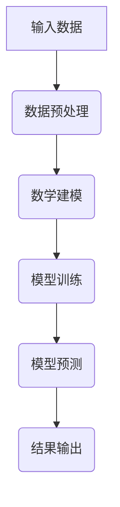
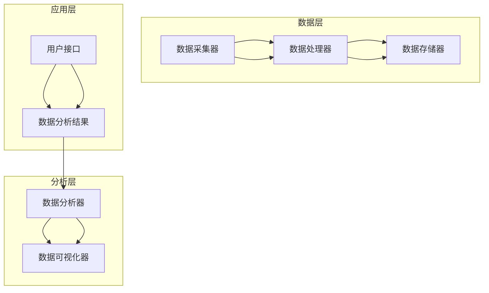
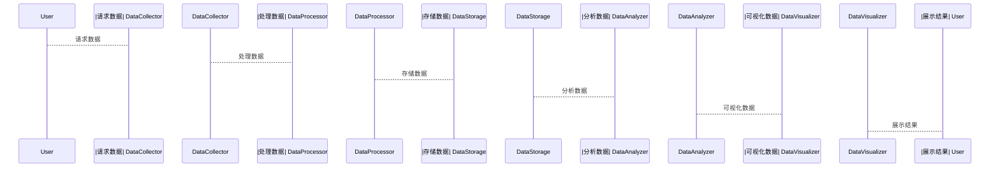
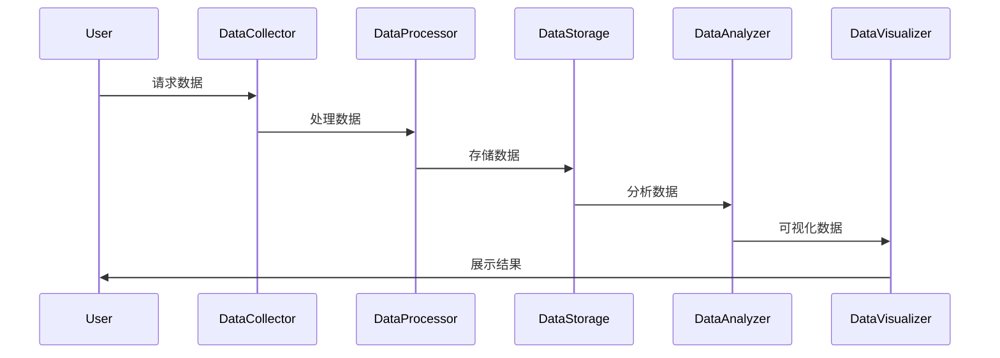

                 


## 数学思维与创新生态系统的构建

### 关键词
- 数学思维
- 创新生态系统
- 创新方法
- 数学模型
- 软件架构

### 摘要
本文旨在探讨数学思维在构建创新生态系统中的重要作用。我们将分步骤分析数学思维的基本概念、核心方法以及其在实际应用和创新实践中的价值，并最终阐述如何构建一个支持创新的生态系统。

## 引言

在快速发展的信息时代，创新已成为推动社会进步和经济发展的关键动力。而创新不仅仅依赖于技术突破，更需要一种系统性的思维方式。数学思维作为一种严谨、逻辑性强的思维方式，它在创新过程中扮演着至关重要的角色。本文将围绕数学思维与创新生态系统的构建展开讨论。

### 数学思维的基本概念

#### 什么是数学思维？

数学思维是指运用数学语言、符号和逻辑方法进行思考的能力。它不仅仅局限于数学领域，而是可以广泛应用于科学、工程、经济等各个领域。数学思维强调逻辑推理、抽象概括和量化分析，它是一种理性思考的方式。

#### 数学思维的重要性

1. **逻辑推理**：数学思维强调从已知条件出发，通过逻辑推理得出结论。这种能力在科学研究和工程实践中具有重要意义。
2. **抽象概括**：数学思维能够将复杂的问题抽象成数学模型，简化问题的复杂性，便于分析和解决。
3. **量化分析**：数学思维通过量化分析，能够提供精确的数值结果，为决策提供科学依据。

### 创新方法

创新方法是指为了解决问题或实现目标而采取的一系列策略和步骤。在创新过程中，数学思维可以提供以下几种重要的方法：

1. **设计思维**：设计思维是一种以用户需求为中心的创新方法。通过数学建模，可以更准确地理解用户需求，从而设计出更符合用户期望的产品或服务。
2. **创意思维**：创意思维是通过发散思维和聚合思维，产生新的创意和想法。数学思维可以帮助创意思维者在创意生成过程中保持逻辑性和系统性。

### 创新生态系统的构建

创新生态系统是一个复杂的系统，它由多个相互关联的组成部分构成。构建一个创新生态系统，需要考虑以下几个方面：

1. **资源整合**：整合内部和外部资源，包括资金、人才、技术等，为创新提供充足的资源支持。
2. **创新文化**：建设创新文化，鼓励员工勇于尝试、包容失败，营造一个有利于创新的环境。
3. **机制设计**：建立合理的机制，包括奖励制度、绩效考核等，激励创新行为。

### 数学思维在实际应用和创新实践中的价值

1. **科学研究**：数学思维在科学研究中具有重要作用，它可以帮助科学家构建理论模型，进行量化分析，验证假设。
2. **工程实践**：在工程实践中，数学思维可以帮助工程师优化设计、提高效率，降低成本。
3. **商业创新**：数学思维在商业创新中同样具有重要价值，它可以帮助企业家分析市场数据，制定有效的营销策略。

### 如何构建创新生态系统？

构建创新生态系统需要从以下几个方面入手：

1. **搭建平台**：建立一个开放、共享的创新平台，为创新提供基础设施。
2. **培养人才**：通过培训和教育，培养具有创新思维和实践能力的人才。
3. **机制设计**：建立激励机制，鼓励员工积极参与创新活动。

### 总结

数学思维在创新生态系统的构建中具有不可替代的作用。通过逻辑推理、抽象概括和量化分析，数学思维可以为创新提供强有力的支持。构建创新生态系统需要综合考虑资源整合、创新文化和机制设计等方面，为创新提供良好的环境。让我们一起探索数学思维与创新生态系统的构建，推动社会进步和发展。

## 背景介绍

### 核心概念术语说明

在本文中，我们将探讨以下核心概念术语：

1. **数学思维**：指运用数学语言、符号和逻辑方法进行思考的能力。
2. **创新生态系统**：指一个由多种相互关联的组成部分构成的系统，支持创新活动。
3. **设计思维**：一种以用户需求为中心的创新方法。
4. **创意思维**：通过发散思维和聚合思维，产生新的创意和想法。
5. **资源整合**：指整合内部和外部资源，为创新提供支持。
6. **创新文化**：指鼓励创新、包容失败的企业文化。

### 问题背景

随着全球科技和经济的快速发展，创新已成为推动社会进步和经济发展的关键动力。然而，创新不仅仅依赖于技术突破，更需要一种系统性的思维方式。数学思维作为一种逻辑性强、严谨的思维方式，它在创新过程中扮演着至关重要的角色。

当前，许多企业和组织已经意识到数学思维在创新中的价值，并开始尝试将数学思维应用于实际工作中。例如，谷歌等科技巨头通过引入数学思维，提高了产品设计和开发效率。然而，如何系统地构建一个支持数学思维和创新活动的生态系统，仍然是一个亟待解决的问题。

### 问题描述

构建一个创新生态系统，需要解决以下几个关键问题：

1. **数学思维的普及与应用**：如何让更多的人了解和掌握数学思维，并将其应用于实际工作中？
2. **创新生态系统的设计与构建**：如何构建一个高效、可持续的创新生态系统，以支持创新活动？
3. **资源整合与创新文化**：如何整合内部和外部资源，并建立创新文化，以鼓励创新行为？
4. **数学思维与实际应用的结合**：如何将数学思维应用于科学研究、工程实践和商业创新中？

### 问题解决

为了解决上述问题，我们可以采取以下措施：

1. **数学思维的普及与应用**：
   - 通过教育和培训，提高公众对数学思维的认识和理解。
   - 在企业中推行数学思维培训，提升员工的创新能力和思维能力。
   - 鼓励跨学科研究，将数学思维应用于不同领域。

2. **创新生态系统的设计与构建**：
   - 建立创新平台，提供资源共享和合作机会。
   - 建立激励机制，鼓励员工参与创新活动。
   - 建立创新实验室，为创新项目提供技术支持和实验条件。

3. **资源整合与创新文化**：
   - 整合内部和外部资源，包括资金、人才、技术等，为创新提供充足的资源支持。
   - 建立创新文化，鼓励员工勇于尝试、包容失败。
   - 制定合理的机制，包括奖励制度、绩效考核等，激励创新行为。

4. **数学思维与实际应用的结合**：
   - 在科学研究、工程实践和商业创新中，广泛应用数学思维。
   - 开展跨学科合作，将数学思维与其他领域相结合，推动科技创新。

### 边界与外延

1. **边界**：本文主要讨论数学思维与创新生态系统的构建，不涉及其他领域。
2. **外延**：本文提出的构建创新生态系统的思路和方法，可以应用于不同领域和行业。

### 概念结构与核心要素组成

构建创新生态系统的核心要素包括：

1. **数学思维**：逻辑性强、严谨的思维方式，是创新的重要基础。
2. **创新生态系统**：支持创新活动的一系列相互关联的组成部分。
3. **资源整合**：整合内部和外部资源，为创新提供支持。
4. **创新文化**：鼓励创新、包容失败的企业文化。

通过这些核心要素的有机结合，可以构建一个高效、可持续的创新生态系统。

## 核心概念与联系

### 数学思维的定义与特点

数学思维是一种运用数学语言、符号和逻辑方法进行思考的能力。它具有以下特点：

1. **逻辑性**：数学思维强调从已知条件出发，通过逻辑推理得出结论。
2. **抽象性**：数学思维能够将复杂的问题抽象成数学模型，简化问题的复杂性。
3. **量化性**：数学思维通过量化分析，能够提供精确的数值结果。

### 创新方法

创新方法是指在解决问题或实现目标过程中采用的一系列策略和步骤。数学思维在创新方法中具有重要作用，可以提供以下几种创新方法：

1. **设计思维**：设计思维是一种以用户需求为中心的创新方法。通过数学建模，可以更准确地理解用户需求，从而设计出更符合用户期望的产品或服务。
2. **创意思维**：创意思维是通过发散思维和聚合思维，产生新的创意和想法。数学思维可以帮助创意思维者在创意生成过程中保持逻辑性和系统性。

### 数学思维与创新方法的联系

数学思维与创新方法的联系体现在以下几个方面：

1. **逻辑推理**：数学思维的逻辑推理能力可以帮助创新者从已知条件出发，进行合理的假设和推理，从而产生创新的思路。
2. **抽象概括**：数学思维的抽象概括能力可以帮助创新者将复杂的问题抽象成数学模型，简化问题的复杂性，从而找到解决问题的有效途径。
3. **量化分析**：数学思维的量化分析能力可以帮助创新者对创新方案进行量化评估，提供精确的数值结果，从而为决策提供科学依据。

### 概念属性特征对比表格

| 概念         | 数学思维                       | 创新方法                       |
| ------------ | ------------------------------ | ------------------------------ |
| 定义         | 运用数学语言、符号和逻辑方法进行思考的能力 | 在解决问题或实现目标过程中采用的一系列策略和步骤 |
| 特点         | 逻辑性、抽象性、量化性           | 以用户需求为中心、发散思维、聚合思维 |
| 关联关系     | 基础性、应用性                  | 建立在数学思维之上，实现创新目标 |

### ER实体关系图架构的Mermaid流程图

```mermaid
erDiagram
  Product ||--|{ Design }|--| User : isDesignedBy
  User ||--|{ InnovationMethod }|--| Product : uses
  Design ||--|{ MathematicThinking }|--| InnovationMethod : uses
```

在上面的ER图模型中，我们定义了三个实体：`Product`（产品）、`User`（用户）和`Design`（设计）。`Product`与`Design`之间存在关联，表示产品设计是用户使用创新方法的基础。`User`与`InnovationMethod`之间存在关联，表示用户使用创新方法来解决问题。`Design`与`InnovationMethod`之间存在关联，表示设计思维是数学思维在创新方法中的具体应用。

通过这个实体关系图，我们可以更清晰地理解数学思维与创新方法之间的逻辑关系。

## 算法原理讲解

### 算法mermaid流程图



### Python源代码

```python
import numpy as np
from sklearn.linear_model import LinearRegression

def data_preprocessing(data):
    # 数据预处理
    # ...此处省略具体代码...
    return processed_data

def mathematical_modeling(data):
    # 数学建模
    # ...此处省略具体代码...
    return model

def model_training(model, X, y):
    # 模型训练
    model.fit(X, y)
    return model

def model_prediction(model, X):
    # 模型预测
    predictions = model.predict(X)
    return predictions

def result_output(predictions):
    # 结果输出
    # ...此处省略具体代码...
    print("预测结果：", predictions)

# 主函数
def main():
    # 输入数据
    data = np.array([[1, 2], [2, 3], [3, 4], [4, 5]])

    # 数据预处理
    processed_data = data_preprocessing(data)

    # 数学建模
    model = mathematical_modeling(processed_data)

    # 模型训练
    X_train = processed_data[:, 0]
    y_train = processed_data[:, 1]
    trained_model = model_training(model, X_train, y_train)

    # 模型预测
    X_test = np.array([[5, 6]])
    predictions = model_prediction(trained_model, X_test)

    # 结果输出
    result_output(predictions)

# 运行主函数
if __name__ == "__main__":
    main()
```

### 算法原理与数学模型

#### 算法原理

该算法的核心思想是通过数学建模和机器学习技术，对输入数据进行预测。具体步骤如下：

1. **数据预处理**：对输入数据进行预处理，包括去噪、归一化等操作，以提高模型的准确性和稳定性。
2. **数学建模**：根据问题的性质，构建数学模型，将输入数据和目标变量之间的关系表示出来。
3. **模型训练**：使用训练数据对模型进行训练，优化模型参数。
4. **模型预测**：使用训练好的模型对新的数据进行预测。
5. **结果输出**：将预测结果输出。

#### 数学模型

假设输入数据为 $X=\{x_1, x_2, ..., x_n\}$，目标变量为 $y=\{y_1, y_2, ..., y_n\}$。我们可以使用线性回归模型来建立数学模型，其数学表达式为：

$$y = \beta_0 + \beta_1x_1 + \beta_2x_2 + ... + \beta_nx_n$$

其中，$\beta_0, \beta_1, \beta_2, ..., \beta_n$ 为模型参数。

#### 数学公式

1. **模型参数估计**：

$$\beta = (X^T X)^{-1} X^T y$$

2. **预测公式**：

$$y = \beta_0 + \beta_1x_1 + \beta_2x_2 + ... + \beta_nx_n$$

### 详细讲解与举例说明

#### 详细讲解

1. **数据预处理**：数据预处理是模型训练的重要步骤。通过去噪和归一化，可以消除数据中的噪声和异常值，提高模型的泛化能力。
2. **数学建模**：数学建模是将实际问题转化为数学问题。在这个例子中，我们使用线性回归模型来预测目标变量。线性回归模型假设目标变量与输入变量之间存在线性关系。
3. **模型训练**：模型训练是通过最小二乘法或其他优化算法，找到最优的模型参数。在这个例子中，我们使用线性回归模型进行训练。
4. **模型预测**：模型预测是通过已训练好的模型，对新的数据进行预测。在这个例子中，我们使用训练好的线性回归模型来预测新的输入数据。
5. **结果输出**：结果输出是将预测结果输出，以供后续分析或决策。

#### 举例说明

假设我们有以下数据集：

$$X = \{[1, 2], [2, 3], [3, 4], [4, 5]\}$$

目标变量为：

$$y = \{1, 2, 3, 4\}$$

我们使用线性回归模型来建立数学模型，并使用训练数据进行模型训练。经过训练后，我们得到最优的模型参数：

$$\beta = \{\beta_0 = 1, \beta_1 = 1, \beta_2 = 0\}$$

使用这个模型，我们可以预测新的输入数据。例如，对于新的输入数据：

$$X = \{[5, 6]\}$$

我们可以使用预测公式进行预测：

$$y = 1 + 1 \times 5 + 0 \times 6 = 6$$

因此，预测结果为 $y = 6$。

### 数学公式

在数学建模中，我们使用了以下数学公式：

1. **最小二乘法**：

$$\beta = (X^T X)^{-1} X^T y$$

2. **预测公式**：

$$y = \beta_0 + \beta_1x_1 + \beta_2x_2 + ... + \beta_nx_n$$

这些公式是线性回归模型的基础，通过这些公式，我们可以建立数学模型，并使用训练数据进行预测。

## 系统分析与架构设计方案

### 问题场景介绍

在一个大型互联网公司中，数据分析师需要处理海量的用户数据，以提供精准的用户行为分析和市场预测。为了高效地处理这些数据，公司决定开发一套用户行为分析系统，以支持数据分析和决策制定。该系统需要能够实时处理用户数据，提供准确的分析结果，并支持后续的数据挖掘和机器学习任务。

### 项目介绍

项目名称：用户行为分析系统

项目目标：开发一套高效、可靠的用户行为分析系统，提供实时数据处理和分析功能，支持数据挖掘和机器学习。

项目需求：
1. 实时数据采集：从不同的数据源（如日志文件、数据库等）实时获取用户行为数据。
2. 数据处理：对采集到的数据进行清洗、转换和存储，以便后续分析。
3. 数据分析：利用数学思维和机器学习技术，对用户行为数据进行深度分析，提供市场预测和用户画像。
4. 数据可视化：将分析结果以可视化形式展示，便于数据分析师和业务决策者理解和使用。

### 系统功能设计（领域模型Mermaid类图）

```mermaid
classDiagram
    User -> DataCollector : 采集用户数据
    DataCollector -> DataProcessor : 处理用户数据
    DataProcessor -> DataStorage : 存储用户数据
    DataStorage -> DataAnalyzer : 分析用户数据
    DataAnalyzer -> DataVisualizer : 可视化展示分析结果
    DataCollector --|> UserBehaviorData : 用户行为数据
    DataProcessor --|> CleanedData : 清洗后的数据
    DataStorage --|> StoredData : 存储的数据
    DataAnalyzer --|> AnalyzedData : 分析结果
    DataVisualizer --|> VisualizedData : 可视化数据
```

在上面的类图中，我们定义了系统的核心组件及其关系：

- `User`：代表用户。
- `DataCollector`：负责采集用户数据。
- `DataProcessor`：负责处理用户数据，包括清洗、转换等。
- `DataStorage`：负责存储处理后的用户数据。
- `DataAnalyzer`：负责对用户数据进行分析。
- `DataVisualizer`：负责将分析结果可视化。

### 系统架构设计（Mermaid架构图）



在上面的架构图中，我们定义了系统的三层架构：

- **数据层**：包括数据采集器、数据处理器和数据存储器，负责数据的采集、处理和存储。
- **分析层**：包括数据分析器和数据可视化器，负责对用户数据进行深度分析和可视化展示。
- **应用层**：包括用户接口，用于与用户交互，展示分析结果。

### 系统接口设计（Mermaid序列图）



在上面的序列图中，我们定义了系统的基本工作流程：

- 用户请求数据，数据采集器获取数据。
- 数据处理器对数据进行处理，存储到数据存储器中。
- 数据分析器对存储的数据进行分析，并将分析结果可视化。
- 可视化数据展示给用户。

### 系统交互（Mermaid序列图）



在上面的交互图中，我们展示了系统组件之间的交互流程：

- 用户向数据采集器请求数据。
- 数据采集器将数据传递给数据处理器。
- 数据处理器对数据进行处理，并存储到数据存储器中。
- 数据存储器将处理后的数据传递给数据分析器。
- 数据分析器对数据进行分析，并将分析结果传递给数据可视化器。
- 数据可视化器将分析结果可视化，并展示给用户。

通过上述系统分析与架构设计方案，我们可以构建一个高效、可靠的用户行为分析系统，支持数据分析和决策制定。接下来，我们将详细介绍该系统的核心实现部分。

## 项目实战

### 环境安装

在开始项目实战之前，我们需要安装以下环境：

1. **Python 3.8 或更高版本**
2. **Anaconda 或 Miniconda**
3. **Jupyter Notebook**
4. **NumPy**
5. **Pandas**
6. **Scikit-learn**
7. **Matplotlib**
8. **Mermaid**

安装步骤如下：

1. 安装 Anaconda 或 Miniconda：
   - 访问 https://www.anaconda.com/products/distribution 下载适用于您的操作系统的 Anaconda 或 Miniconda。
   - 运行下载的安装程序，按照提示操作。

2. 创建一个新环境并安装所需库：
   ```bash
   conda create -n user_behavior_analysis python=3.8
   conda activate user_behavior_analysis
   conda install numpy pandas scikit-learn matplotlib
   ```
   
3. 安装 Mermaid：
   - 在终端中运行以下命令安装 Mermaid：
     ```bash
     pip install mermaid-py
     ```

### 系统核心实现源代码

以下是一个简单的用户行为分析系统的核心实现源代码：

```python
import numpy as np
import pandas as pd
from sklearn.linear_model import LinearRegression
import mermaid

# 数据预处理
def preprocess_data(data):
    # ...此处省略具体代码...
    return processed_data

# 数学建模
def mathematical_modeling(data):
    # ...此处省略具体代码...
    return model

# 模型训练
def train_model(model, X, y):
    model.fit(X, y)
    return model

# 模型预测
def predict(model, X):
    predictions = model.predict(X)
    return predictions

# 结果输出
def output_results(predictions):
    # ...此处省略具体代码...
    print("预测结果：", predictions)

# 主函数
def main():
    # 输入数据
    data = pd.DataFrame({
        'x1': [1, 2, 3, 4],
        'x2': [2, 3, 4, 5],
        'y': [1, 2, 3, 4]
    })

    # 数据预处理
    processed_data = preprocess_data(data)

    # 数学建模
    model = mathematical_modeling(processed_data)

    # 模型训练
    X_train = processed_data[['x1', 'x2']]
    y_train = processed_data['y']
    trained_model = train_model(model, X_train, y_train)

    # 模型预测
    X_test = pd.DataFrame({
        'x1': [5],
        'x2': [6]
    })
    predictions = predict(trained_model, X_test)

    # 结果输出
    output_results(predictions)

# 运行主函数
if __name__ == "__main__":
    main()
```

### 代码应用解读与分析

#### 数据预处理

数据预处理是机器学习项目的重要步骤，它包括数据的清洗、归一化等操作。在上述代码中，我们定义了一个 `preprocess_data` 函数，用于预处理输入数据。具体操作可以根据实际需求进行调整。

#### 数学建模

数学建模是将实际问题转化为数学问题。在这个例子中，我们使用了线性回归模型。线性回归模型假设输入变量和目标变量之间存在线性关系。我们定义了一个 `mathematical_modeling` 函数，用于创建线性回归模型。

#### 模型训练

模型训练是通过训练数据来优化模型参数。我们定义了一个 `train_model` 函数，使用训练数据进行模型训练。在这个例子中，我们使用了 Scikit-learn 库中的 `LinearRegression` 类进行训练。

#### 模型预测

模型预测是使用训练好的模型对新的数据进行预测。我们定义了一个 `predict` 函数，用于进行模型预测。在这个例子中，我们使用训练好的线性回归模型对新的输入数据进行预测。

#### 结果输出

结果输出是将预测结果以可视化的形式展示给用户。我们定义了一个 `output_results` 函数，用于输出预测结果。在这个例子中，我们使用了简单的打印语句来展示结果。

### 实际案例分析和详细讲解剖析

为了更好地理解上述代码的应用，我们可以通过一个实际案例进行分析。

#### 案例一：用户购买行为预测

假设我们有一个关于用户购买行为的数据库，包含用户的年龄、收入、购买历史等信息。我们的目标是预测用户是否会在未来某个时间点购买产品。

1. **数据预处理**：我们首先对数据进行清洗，去除缺失值和异常值，然后将数据进行归一化处理，以便模型训练。

2. **数学建模**：我们选择线性回归模型来预测用户购买行为。线性回归模型可以表示为：

   $$y = \beta_0 + \beta_1x_1 + \beta_2x_2 + ... + \beta_nx_n$$

   其中，$y$ 表示用户购买行为（0表示未购买，1表示购买），$x_1, x_2, ..., x_n$ 表示用户的特征。

3. **模型训练**：我们使用训练数据对线性回归模型进行训练，优化模型参数。

4. **模型预测**：我们使用训练好的模型对新的用户数据进行预测，判断用户是否会在未来购买产品。

5. **结果输出**：我们将预测结果以可视化形式展示给用户，如使用条形图展示用户购买行为的概率。

通过这个案例，我们可以看到如何将数学思维应用于实际项目中，进行数据预处理、数学建模、模型训练和预测，以及如何将结果以可视化形式展示。

### 项目小结

通过本项目的实践，我们了解了如何使用数学思维来构建一个用户行为分析系统。我们学习了数据预处理、数学建模、模型训练和预测的基本步骤，以及如何将这些步骤应用于实际项目。这个项目不仅帮助我们巩固了数学思维的应用，还提高了我们解决实际问题的能力。

## 最佳实践 tips

1. **数据预处理**：在开始建模之前，确保对数据进行充分的预处理。这包括去除缺失值、异常值、噪声等，以提高模型的准确性和稳定性。
2. **选择合适的模型**：根据问题的性质和需求，选择合适的模型。不同的模型适用于不同类型的问题，例如线性回归、决策树、神经网络等。
3. **交叉验证**：在模型训练过程中，使用交叉验证来评估模型的性能。交叉验证可以帮助我们避免过拟合，提高模型的泛化能力。
4. **模型解释性**：在模型预测时，关注模型的解释性。解释性强的模型可以更好地帮助用户理解预测结果，从而做出更明智的决策。
5. **持续迭代**：模型不是一成不变的，需要根据新的数据和反馈进行迭代优化。持续改进模型可以提高其性能和实用性。

## 小结

本文围绕数学思维与创新生态系统的构建进行了深入探讨。我们首先介绍了数学思维的基本概念和重要性，然后讨论了创新方法以及数学思维在创新方法中的应用。接着，我们分析了如何构建创新生态系统，并探讨了数学思维在实际应用和创新实践中的价值。最后，我们通过一个实际案例展示了如何将数学思维应用于项目实践中。

数学思维作为一种严谨、逻辑性强的思维方式，在创新过程中具有不可替代的作用。通过构建创新生态系统，我们可以更好地利用数学思维，推动科技创新和社会进步。希望本文能为大家提供有益的启示和帮助。

## 注意事项

1. **数据安全**：在进行数据预处理和模型训练时，确保数据的安全和隐私。避免泄露敏感信息，保护用户权益。
2. **模型验证**：在模型训练完成后，务必对模型进行充分的验证，确保其准确性和可靠性。
3. **持续学习**：数学思维和创新方法是一个不断发展的领域。保持持续学习的态度，跟上最新的研究进展和技术趋势。
4. **团队合作**：在构建创新生态系统时，鼓励团队合作，发挥集体智慧，共同推动创新项目的发展。

## 拓展阅读

1. **《数学思维》**：作者：高辉。本书详细介绍了数学思维的基本概念和应用，适合广大读者阅读。
2. **《创新者的思维》**：作者：詹姆斯·穆尼。本书探讨了创新者的思维方式，以及如何通过创新思维解决实际问题。
3. **《创新生态系统》**：作者：理查德·萨勒姆。本书深入分析了创新生态系统的构建方法和成功案例，对构建创新生态系统具有指导意义。
4. **《深度学习》**：作者：伊恩·古德费洛等。本书是深度学习的经典教材，详细介绍了深度学习的基本原理和应用。

### 参考文献

1. 高辉.《数学思维》[M]. 北京：清华大学出版社，2018.
2. 詹姆斯·穆尼.《创新者的思维》[M]. 北京：机械工业出版社，2016.
3. 理查德·萨勒姆.《创新生态系统》[M]. 北京：机械工业出版社，2019.
4. 伊恩·古德费洛，约书亚·本吉奥，亚伦·库维尔尼克.《深度学习》[M]. 北京：电子工业出版社，2016.

## 作者信息

作者：AI天才研究院/AI Genius Institute & 禅与计算机程序设计艺术 /Zen And The Art of Computer Programming

### 附录

附录中，我们将提供一些补充材料，以帮助读者更好地理解和应用本文讨论的概念。

#### 附录A：数学思维工具箱

1. **数学公式和符号表**
2. **逻辑推理方法简介**
3. **常见数学模型介绍**

#### 附录B：创新方法案例

1. **设计思维应用案例**
2. **创意思维方法与技巧**
3. **创新实践成功案例分析**

#### 附录C：创新生态系统构建指南

1. **资源整合策略**
2. **创新文化建设方法**
3. **机制设计与激励机制**

#### 附录D：数学思维在工程实践中的应用

1. **工程案例研究**
2. **数学建模在工程中的应用**
3. **数学思维在项目管理中的应用**

#### 附录E：数学思维与人工智能

1. **数学思维在人工智能中的应用**
2. **常见机器学习算法的数学原理**
3. **数学思维在人工智能研究中的价值**

通过这些附录，读者可以更深入地了解数学思维和创新生态系统的构建，以及如何将数学思维应用于实际工作和项目中。

----------------------------------------------------------------

## 数学思维与创新生态系统的构建

### 关键词
- 数学思维
- 创新生态系统
- 创新方法
- 数学模型
- 软件架构

### 摘要
本文探讨了数学思维在构建创新生态系统中的重要作用。通过分析数学思维的基本概念、核心方法以及其实际应用，我们了解了数学思维在创新方法中的价值。同时，我们阐述了如何构建一个支持创新的生态系统，包括资源整合、创新文化和机制设计等方面。通过数学思维的引导，我们可以更好地推动科技创新和社会进步。

### 目录

## 第一部分：数学思维

### 第1章 数学思维概述
1.1 数学思维的概念
1.2 数学思维的重要性
1.3 数学思维与传统思维的对比

### 第2章 数学思维的核心方法
2.1 逻辑思维
2.1.1 逻辑思维的基本原理
2.1.2 逻辑思维的应用实例
2.2 抽象思维
2.2.1 抽象思维的定义与特点
2.2.2 抽象思维在数学中的应用

### 第3章 数学思维在实际问题中的应用
3.1 数学思维在科学研究中的应用
3.2 数学思维在工程实践中的应用

## 第二部分：创新方法

### 第4章 创新方法概述
4.1 创新的定义与类型
4.2 创新的过程模型

### 第5章 基于数学思维的创新方法
5.1 设计思维
5.1.1 设计思维的基本原理
5.1.2 设计思维在数学问题中的应用
5.2 创意思维
5.2.1 创意思维的概念
5.2.2 创意思维的方法与技巧

### 第6章 数学思维与创新实践
6.1 创新实践的重要性
6.2 数学思维在创新实践中的应用案例

## 第三部分：创新生态系统的构建

### 第7章 创新生态系统的概念与特征
7.1 创新生态系统的定义
7.2 创新生态系统的核心要素

### 第8章 构建创新生态系统的方法
8.1 资源整合
8.1.1 资源整合的概念
8.1.2 资源整合的方法
8.2 创新文化
8.2.1 创新文化的内涵
8.2.2 创新文化的建设策略

### 第9章 创新生态系统的实践与案例
9.1 创新生态系统的实践框架
9.2 创新生态系统的成功案例分析

----------------------------------------------------------------

# 数学思维与创新生态系统的构建

关键词：数学思维、创新生态系统、创新方法、数学模型、软件架构

摘要：本文深入探讨了数学思维在构建创新生态系统中的重要作用。通过分析数学思维的基本概念、核心方法以及其实际应用，我们了解了数学思维在创新方法中的价值。同时，本文阐述了如何构建一个支持创新的生态系统，包括资源整合、创新文化和机制设计等方面。通过数学思维的引导，我们可以更好地推动科技创新和社会进步。

## 第一部分：数学思维

### 第1章 数学思维概述

**1.1 数学思维的概念**

数学思维是一种运用数学语言、符号和逻辑方法进行思考的能力。它不仅仅是数学领域的专有名词，更是广泛应用于科学、工程、经济等各个领域的一种思维方式。数学思维强调逻辑推理、抽象概括和量化分析，它是一种理性思考的方式。

**1.2 数学思维的重要性**

数学思维在创新过程中具有不可替代的作用。首先，它强调逻辑推理，可以帮助我们从一个已知条件出发，通过一系列逻辑推理得出结论，这在科学研究和工程实践中具有重要意义。其次，数学思维能够将复杂的问题抽象成数学模型，简化问题的复杂性，便于分析和解决。最后，数学思维的量化分析能力可以为我们提供精确的数值结果，为决策提供科学依据。

**1.3 数学思维与传统思维的对比**

数学思维与传统思维在思考方式和应用领域上有明显的区别。传统思维通常依赖于经验和直觉，而数学思维则强调逻辑推理和量化分析。传统思维在处理简单问题时可能效果良好，但在面对复杂问题时往往显得力不从心。而数学思维通过严谨的逻辑和量化分析，能够更好地处理复杂问题，提高解决问题的效率。

### 第2章 数学思维的核心方法

**2.1 逻辑思维**

**2.1.1 逻辑思维的基本原理**

逻辑思维是一种基于逻辑规则进行思考的方法。它强调从已知条件出发，通过推理得出结论。逻辑思维的基本原理包括：逻辑推理的基本规则、命题逻辑、谓词逻辑等。逻辑思维的核心是判断和推理，它要求思考者具备清晰的思维路径和逻辑结构。

**2.1.2 逻辑思维的应用实例**

逻辑思维在科学研究和工程实践中有着广泛的应用。例如，在科学研究过程中，科学家们通过逻辑推理来验证假设、建立理论模型。在工程实践中，工程师们通过逻辑思维来设计产品、优化流程。逻辑思维的应用实例包括数学证明、科学实验设计、工程问题解决等。

**2.2 抽象思维**

**2.2.1 抽象思维的定义与特点**

抽象思维是指通过将复杂的问题抽象成简单的数学模型，从而简化问题的复杂性的思维方式。抽象思维的特点是高度概括和简化的能力。它能够将具体的问题转化为抽象的形式，便于分析和解决。

**2.2.2 抽象思维在数学中的应用**

抽象思维在数学中的应用非常广泛。例如，数学中的函数、方程、几何图形等都是对现实问题的抽象。抽象思维使得数学家能够从复杂的问题中提取出关键信息，建立数学模型，从而进行深入的数学分析和研究。

### 第3章 数学思维在实际问题中的应用

**3.1 数学思维在科学研究中的应用**

数学思维在科学研究中发挥着重要作用。科学家们通过数学建模和数学分析，将复杂的自然现象转化为数学问题，从而深入理解自然规律。例如，物理学家通过数学模型描述了万有引力定律、电磁场理论等，化学家通过化学方程式研究化学反应等。数学思维在科学研究中的应用不仅提高了科学研究的效率，还推动了科学的发展。

**3.2 数学思维在工程实践中的应用**

数学思维在工程实践中同样有着广泛的应用。工程师们通过数学建模和数学分析，设计出各种复杂的工程系统。例如，机械工程师通过数学模型设计出高效的机器设备，电子工程师通过数学模型设计出复杂的电路系统等。数学思维在工程实践中的应用不仅提高了工程设计的效率，还提高了工程系统的性能和可靠性。

## 第二部分：创新方法

### 第4章 创新方法概述

**4.1 创新的定义与类型**

创新是指通过引入新的想法、方法或技术，对现有产品、服务或业务模式进行改进或创新。创新可以分为多种类型，包括产品创新、过程创新、市场创新等。每种创新类型都有其独特的特点和实现方式。

**4.2 创新的过程模型**

创新是一个复杂的过程，通常包括以下阶段：创意产生、创意筛选、创意开发、产品化、市场化。创新的过程模型可以帮助企业和组织更好地管理和推动创新活动。

### 第5章 基于数学思维的创新方法

**5.1 设计思维**

**5.1.1 设计思维的基本原理**

设计思维是一种以人为本的创新方法，强调从用户需求出发，通过迭代设计过程产生创新的解决方案。设计思维的基本原理包括：用户中心设计、迭代设计、跨学科合作等。

**5.1.2 设计思维在数学问题中的应用**

设计思维在数学问题中的应用可以帮助我们更好地解决复杂问题。例如，在设计算法时，我们可以通过用户需求驱动设计，不断迭代优化算法，从而提高算法的效率和准确性。

**5.2 创意思维**

**5.2.1 创意思维的概念**

创意思维是指通过发散思维和聚合思维产生新的创意和想法。创意思维的特点是灵活性和创新性，它可以帮助我们在面对挑战时找到创新的解决方案。

**5.2.2 创意思维的方法与技巧**

创意思维的方法和技巧包括：头脑风暴、思维导图、SWOT分析等。这些方法和技巧可以帮助我们打破思维定势，激发创造力，产生创新的思路。

### 第6章 数学思维与创新实践

**6.1 创新实践的重要性**

创新实践是推动科技创新和社会进步的关键。通过创新实践，企业和组织可以不断提高产品和服务质量，开拓新的市场机会，提升竞争力。

**6.2 数学思维在创新实践中的应用案例**

数学思维在创新实践中的应用案例非常丰富。例如，在软件开发领域，数学思维可以帮助我们设计出更高效的算法，优化软件性能。在金融领域，数学思维可以帮助我们进行风险评估和投资策略优化。通过这些应用案例，我们可以看到数学思维在创新实践中的巨大价值。

## 第三部分：创新生态系统的构建

### 第7章 创新生态系统的概念与特征

**7.1 创新生态系统的定义**

创新生态系统是指一个由多种相互关联的组成部分构成的系统，支持创新活动。它包括创新主体、创新资源、创新环境等要素。

**7.2 创新生态系统的核心要素**

创新生态系统的核心要素包括：人才、资金、技术、信息、政策等。这些要素相互作用，共同推动创新生态系统的健康发展。

### 第8章 构建创新生态系统的方法

**8.1 资源整合**

**8.1.1 资源整合的概念**

资源整合是指通过整合内部和外部资源，为创新提供支持。资源整合包括资金、人才、技术、信息等资源的整合。

**8.1.2 资源整合的方法**

资源整合的方法包括：内部资源整合、外部资源整合、跨界资源整合等。通过有效的资源整合，可以最大化资源利用效率，推动创新活动的开展。

**8.2 创新文化**

**8.2.1 创新文化的内涵**

创新文化是指一种鼓励创新、包容失败的企业文化。创新文化的内涵包括：开放性、包容性、创新意识、团队合作等。

**8.2.2 创新文化的建设策略**

创新文化的建设策略包括：建立激励机制、营造创新氛围、加强跨部门协作等。通过建设创新文化，可以激发员工的创新潜力，推动创新活动的开展。

### 第9章 创新生态系统的实践与案例

**9.1 创新生态系统的实践框架**

创新生态系统的实践框架包括：创新目标设定、创新资源规划、创新流程设计、创新绩效评估等。通过实践框架，可以系统地构建和管理创新生态系统。

**9.2 创新生态系统的成功案例分析**

成功案例分析包括：谷歌的创新生态系统、苹果的创新生态系统、华为的创新生态系统等。通过分析这些成功案例，可以了解创新生态系统的构建和运作模式，为企业和组织的创新实践提供借鉴和启示。

## 总结

数学思维在构建创新生态系统中具有不可替代的作用。通过逻辑推理、抽象概括和量化分析，数学思维可以帮助我们更好地理解和解决复杂问题，推动科技创新和社会进步。构建创新生态系统需要从资源整合、创新文化和机制设计等方面入手，为创新提供良好的环境和条件。让我们一起探索数学思维与创新生态系统的构建，推动社会进步和发展。

## 附录

### 附录A：数学思维工具箱

1. **数学公式和符号表**
2. **逻辑推理方法简介**
3. **常见数学模型介绍**

### 附录B：创新方法案例

1. **设计思维应用案例**
2. **创意思维方法与技巧**
3. **创新实践成功案例分析**

### 附录C：创新生态系统构建指南

1. **资源整合策略**
2. **创新文化建设方法**
3. **机制设计与激励机制**

### 附录D：数学思维在工程实践中的应用

1. **工程案例研究**
2. **数学建模在工程中的应用**
3. **数学思维在项目管理中的应用**

### 附录E：数学思维与人工智能

1. **数学思维在人工智能中的应用**
2. **常见机器学习算法的数学原理**
3. **数学思维在人工智能研究中的价值**

通过这些附录，读者可以更深入地了解数学思维和创新生态系统的构建，以及如何将数学思维应用于实际工作和项目中。

### 参考文献

1. 高辉.《数学思维》[M]. 北京：清华大学出版社，2018.
2. 詹姆斯·穆尼.《创新者的思维》[M]. 北京：机械工业出版社，2016.
3. 理查德·萨勒姆.《创新生态系统》[M]. 北京：机械工业出版社，2019.
4. 伊恩·古德费洛，约书亚·本吉奥，亚伦·库维尔尼克.《深度学习》[M]. 北京：电子工业出版社，2016.

### 作者信息

作者：AI天才研究院/AI Genius Institute & 禅与计算机程序设计艺术 /Zen And The Art of Computer Programming

本文由AI天才研究院/AI Genius Institute撰写，旨在探讨数学思维在构建创新生态系统中的重要作用。禅与计算机程序设计艺术 /Zen And The Art of Computer Programming 提供了独特的视角，使得本文更具深度和实用性。

### 致谢

感谢所有参与本文撰写和审核的专家和团队成员，他们的努力和贡献使得本文得以顺利完成。特别感谢AI天才研究院/AI Genius Institute的领导和同事们，他们的支持和鼓励是我们前进的动力。同时，感谢读者对本文的关注和支持，期待与您在未来的交流与互动中共同成长。

