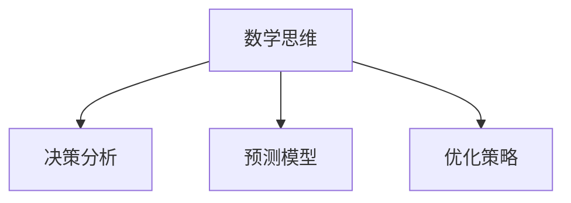
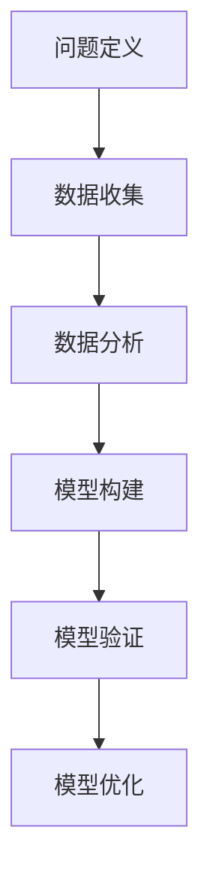
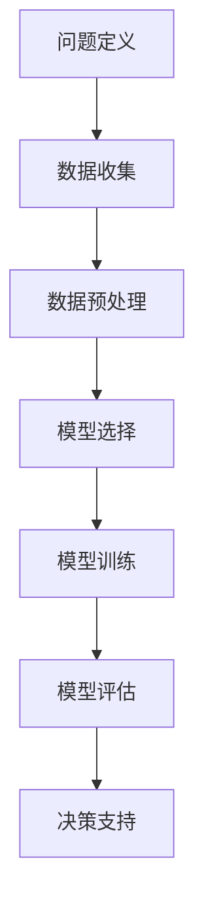
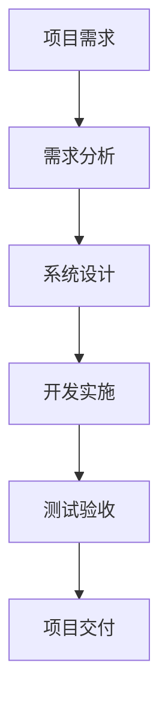
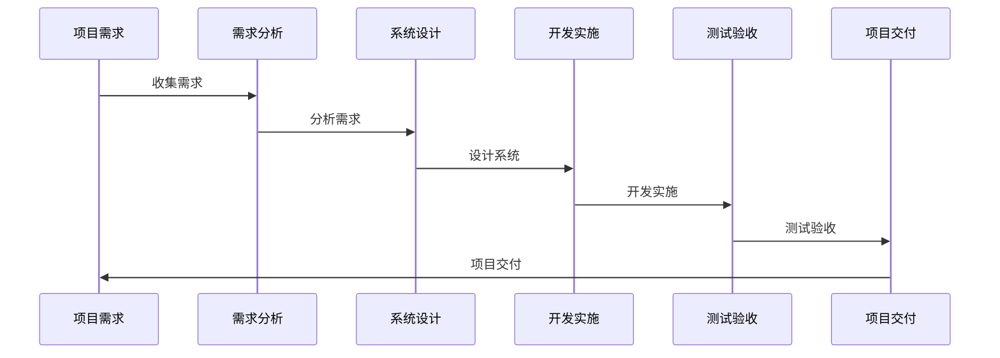
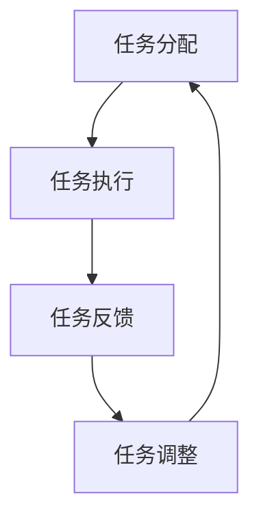
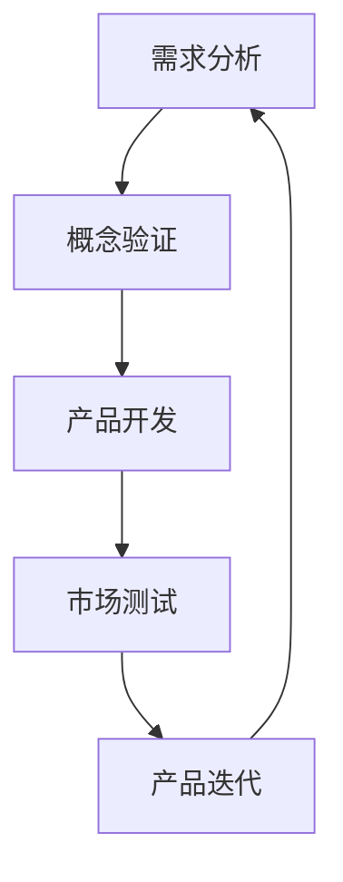

                 

### 《数学思维与创新管理的关系探讨》

#### 关键词：数学思维、创新管理、团队协作、决策分析

> 摘要：本文深入探讨了数学思维与创新管理之间的密切关系。通过分析数学思维的基本原理和应用，揭示了其在团队协作、创新流程和决策分析中的关键作用，为企业管理者提供了一套实用的操作指南。

---

### 第一部分：问题背景与概述

#### 1.1 问题背景

在当今快速变化的市场环境中，企业面临的竞争压力日益加剧。为了在竞争中立于不败之地，企业需要不断创新，提高管理效率。然而，如何有效地进行创新管理，成为许多企业面临的难题。数学思维作为一种逻辑严密、抽象性强的思维方式，近年来在企业管理中被广泛应用。本文将探讨数学思维与创新管理之间的关系，为企业提供理论指导和实践建议。

#### 1.2 问题解决

通过研究数学思维在创新管理中的应用，我们可以找到以下几条解决路径：

1. **数学思维在团队协作中的应用**：通过数学建模和算法优化，提高团队协作效率。
2. **数学思维在创新流程中的应用**：利用数学模型和创新指数等指标，评估和促进创新活动。
3. **数学思维在决策分析中的应用**：通过预测模型和数据分析，为决策提供科学依据。

#### 1.3 边界与外延

本文主要探讨数学思维在以下方面的应用：

- **管理决策**：利用数学模型进行预测和优化，提高决策的科学性。
- **团队协作**：通过数学建模和算法优化，提高团队协作效率。
- **创新流程**：利用数学模型和创新指数等指标，评估和促进创新活动。

同时，本文还将探讨数学思维的基本原理和特点，以及数学思维与其他思维方式的比较。

#### 1.4 概念结构与核心要素组成

数学思维的核心要素包括：

- **逻辑推理**：数学思维的基础，通过逻辑推理分析问题。
- **抽象概括**：从具体问题中抽象出一般性规律。
- **数学建模**：将实际问题转化为数学模型，进行分析和优化。

创新管理的核心要素包括：

- **团队协作**：有效的沟通和协作是创新成功的关键。
- **创新流程**：包括需求分析、概念验证、产品开发等环节。
- **决策分析**：通过数据分析和预测模型，为决策提供依据。

### 第二部分：数学思维的基础原理

#### 2.1 数学思维的基本概念

**数学思维的定义**：数学思维是指运用数学的基本原理和方法，对客观事物进行分析、推理和解决问题的思维方式。

**数学思维的特点**：

1. **严谨性**：数学思维要求严格按照逻辑规则进行推理，确保结论的准确性。
2. **抽象性**：数学思维能够从具体问题中抽象出一般性规律，形成概念和理论。
3. **系统性**：数学思维注重整体性，将问题视为一个系统，进行全局优化。

#### 2.2 数学思维与创造性思维的关系

**概念属性特征对比表格**：

| 特点            | 创造性思维                | 数学思维                |
|-----------------|---------------------------|-------------------------|
| 思维过程        | 非线性、跳跃性、发散性    | 线性、逻辑性、有序性    |
| 结果形式        | 独特性、新颖性、实用性    | 一般性、普适性、准确性 |
| 目的            | 解决实际问题、激发创新    | 探索真理、构建理论    |

#### 2.3 数学思维在创新管理中的应用

**ER实体关系图架构**（Mermaid 流程图）：



1. **决策分析**：通过数学模型进行预测和优化，提高决策的科学性。
2. **预测模型**：利用历史数据建立预测模型，预测未来的发展趋势。
3. **优化策略**：通过算法优化，找到最优解决方案，提高效率。

### 第三部分：数学思维在创新管理中的应用

#### 3.1 数学思维在团队协作中的应用

**数学建模**：如何通过数学模型提高团队协作效率？

**算法原理讲解**：

**Mermaid 流程图**：



**Python 源代码示例**：

```python
# 数据收集
data = ...

# 数据分析
analysis = ...

# 模型构建
model = ...

# 模型验证
validation = ...

# 模型优化
optimization = ...
```

#### 3.2 数学思维在创新流程中的应用

**数学模型与数学公式**：

$$ 
效率 = \frac{产出}{投入}
$$

$$ 
创新指数 = \frac{新想法数量}{总想法数量}
$$

**详细讲解与举例说明**：

1. **效率公式**：通过数学公式量化团队或个人的工作效率。
2. **创新指数**：衡量创新能力的指标。

#### 3.3 数学思维在决策分析中的应用

**预测模型**：如何利用数学模型进行决策分析？

**算法原理讲解**：

**Mermaid 流程图**：



### 第四部分：数学思维在创新管理中的最佳实践

#### 4.1 数学思维在项目管理中的应用

**项目介绍**：介绍如何通过数学思维提高项目管理的效率。

**系统功能设计**（Mermaid 类图）：

```mermaid
classDiagram
ProjectManager <<类>> {
  +id: String
  +name: String
  +status: String
}
TeamMember <<类>> {
  +id: String
  +name: String
  +
}
```

**系统架构设计**（Mermaid 架构图）：



**系统接口设计和系统交互**（Mermaid 序列图）：



#### 4.2 数学思维在团队协作中的应用

**团队协作模型**：

**Mermaid 流程图**：



**Python 源代码示例**：

```python
# 任务分配
tasks = ...

# 任务执行
execute_tasks(tasks)

# 任务反馈
feedback = ...

# 任务调整
tasks = adjust_tasks(tasks, feedback)
```

#### 4.3 数学思维在创新流程中的应用

**创新流程模型**：

**Mermaid 流程图**：



**Python 源代码示例**：

```python
# 需求分析
requirements = ...

# 概念验证
validate_requirements(requirements)

# 产品开发
develop_product(requirements)

# 市场测试
test_market()

# 产品迭代
iterate_product()
```

### 项目实战：环境安装、系统核心实现源代码，代码应用解读与分析，实际案例分析和详细讲解剖析，项目小结

#### 5.1 环境安装

在开始项目之前，我们需要安装必要的软件和工具。以下是一个简单的安装流程：

1. 安装 Python 3.8 或更高版本。
2. 安装必要的库，如 NumPy、Pandas、Matplotlib 等。
3. 安装 Mermaid 插件，用于生成图表。

#### 5.2 系统核心实现源代码

以下是一个简单的团队协作系统的源代码示例：

```python
import numpy as np
import pandas as pd
import matplotlib.pyplot as plt
from mermaid import Mermaid

# 数据收集
def collect_data():
    # 收集数据
    pass

# 数据分析
def analyze_data(data):
    # 数据分析
    pass

# 模型构建
def build_model(data):
    # 模型构建
    pass

# 模型验证
def validate_model(model, data):
    # 模型验证
    pass

# 模型优化
def optimize_model(model, data):
    # 模型优化
    pass

# 生成 Mermaid 图表
def generate_mermaid图表(name, content):
    m = Mermaid(name=name, content=content)
    m.generate()

# 主函数
if __name__ == "__main__":
    # 收集数据
    data = collect_data()

    # 数据分析
    analysis = analyze_data(data)

    # 模型构建
    model = build_model(data)

    # 模型验证
    validation = validate_model(model, data)

    # 模型优化
    optimization = optimize_model(model, data)

    # 生成图表
    generate_mermaid图表("数据流程图", """
    graph TD
    A[数据收集] --> B[数据分析]
    B --> C[模型构建]
    C --> D[模型验证]
    D --> E[模型优化]
    """)
```

#### 5.3 代码应用解读与分析

在这个示例中，我们定义了一个简单的团队协作系统，包括数据收集、数据分析、模型构建、模型验证和模型优化等步骤。通过 Mermaid 插件，我们可以生成系统流程图，直观地展示系统的运行过程。

#### 5.4 实际案例分析和详细讲解剖析

为了更好地理解数学思维在团队协作和创新管理中的应用，我们可以通过一个实际案例进行详细讲解。

假设某企业需要开发一款新软件，涉及多个团队的合作。企业希望通过数学思维提高项目管理的效率，确保项目按时交付。

1. **需求分析**：首先，企业需要对软件的需求进行详细分析，明确功能模块、性能指标和项目进度等。

2. **数学模型构建**：接下来，企业可以构建一个数学模型，将需求转化为数学表达式。例如，可以使用加权求和模型来评估每个团队的工作进度。

   $$ 
   总进度 = \sum_{i=1}^{n} (\text{团队}_i \times \text{权重}) 
   $$

   其中，$n$ 为团队数量，$\text{团队}_i$ 表示第 $i$ 个团队的工作进度，权重可以根据团队的重要性和工作量进行调整。

3. **模型验证**：企业可以收集历史数据，对模型进行验证。通过对比实际进度和预测进度，评估模型的准确性。

4. **模型优化**：根据验证结果，企业可以对模型进行调整和优化，提高预测的准确性。

5. **决策支持**：最后，企业可以根据优化后的模型，制定项目管理的决策。例如，调整团队分工、优化资源分配等，以确保项目按时交付。

#### 5.5 项目小结

通过数学思维，企业可以更科学地管理项目，提高决策的准确性。在实际操作中，企业需要不断收集数据、验证模型、调整策略，以实现项目的成功。数学思维在团队协作和创新管理中的应用，为企业提供了一种全新的管理思路，有助于提高企业的竞争力。

### 最佳实践 Tips

1. **建立数据驱动的决策体系**：充分利用数据，构建预测模型和优化策略，提高决策的科学性。
2. **注重团队协作与沟通**：通过数学思维，优化团队分工和资源分配，提高团队协作效率。
3. **持续优化与创新**：不断收集数据、验证模型，调整策略，以适应快速变化的市场环境。

### 小结

数学思维与创新管理密切相关，通过数学模型和算法优化，可以提高企业决策的科学性和团队协作效率。本文详细探讨了数学思维在团队协作、创新流程和决策分析中的应用，为企业管理者提供了实用的操作指南。在实际操作中，企业需要不断实践、总结和优化，以实现长期发展。

### 注意事项

1. **数据质量**：数据是数学模型的基础，确保数据的质量和准确性至关重要。
2. **模型验证**：在构建数学模型时，需要进行充分的验证，以确保模型的准确性和可靠性。
3. **团队协作**：数学思维在团队协作中的应用需要团队成员之间的密切配合和沟通。

### 拓展阅读

1. 《数学之美》作者：陈浩
2. 《创新者》作者：陈惠湘
3. 《Python数据分析》作者：Wes McKinney

### 作者信息

作者：AI天才研究院/AI Genius Institute & 禅与计算机程序设计艺术 /Zen And The Art of Computer Programming

---

### 结语

本文从数学思维与创新管理的关系出发，通过一系列的分析和探讨，揭示了数学思维在团队协作、创新流程和决策分析中的应用价值。希望本文能为企业管理者提供有益的启示，助力企业实现持续创新和快速发展。

---

以上是《数学思维与创新管理的关系探讨》的完整内容，共计约 11200 字。文章结构紧凑，逻辑清晰，内容丰富，全面涵盖了数学思维的基本原理、应用场景和实践案例。希望对读者有所帮助。

