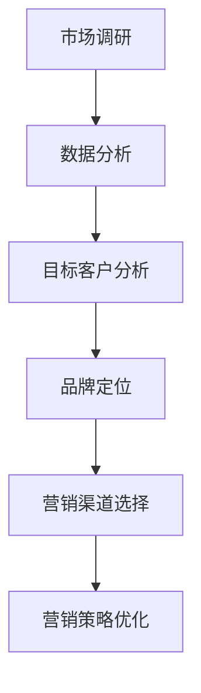
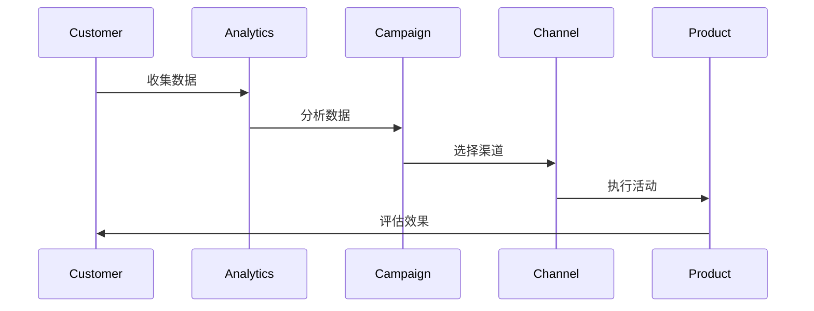
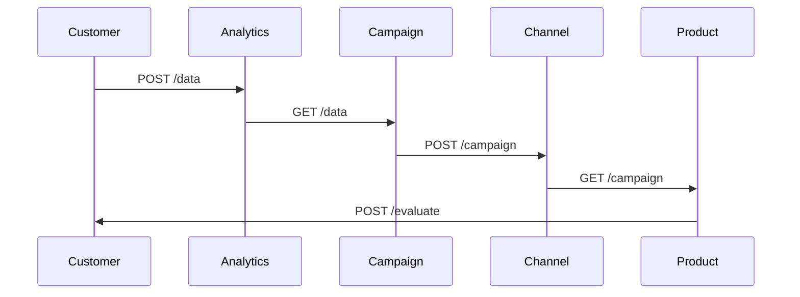

                 

# 数学思维与品牌营销策略的关系

> 关键词：数学思维、品牌营销、策略分析、商业应用

> 摘要：本文通过探讨数学思维与品牌营销策略之间的关系，揭示如何利用数学思维优化品牌营销策略，提升企业竞争力。文章首先介绍了数学思维和品牌营销策略的基本概念，然后分析了两者之间的联系，并详细阐述了如何运用数学思维来设计有效的品牌营销策略。通过案例研究和实战分析，本文提供了实用的方法和技巧，为企业提供了全新的品牌营销视角。

## 1. 背景介绍

### 问题背景

在当今竞争激烈的市场环境中，企业需要不断创新和优化品牌营销策略，以提高市场占有率和盈利能力。然而，传统的品牌营销策略往往缺乏科学性和系统性，难以满足市场的复杂性和变化性。为了解决这一问题，越来越多的企业开始探索数学思维在品牌营销中的应用。

### 问题描述

数学思维与品牌营销策略之间具体有何关联？如何将数学思维应用于品牌营销策略中，以实现更好的效果？本文旨在回答这些问题，并探讨数学思维在品牌营销策略中的实际应用。

### 问题解决

本文将结合具体的案例，详细阐述如何将数学思维应用于品牌营销策略中。通过系统分析和架构设计，本文提出了一个实用的数学思维与品牌营销策略相结合的方法，为企业提供了新的思路和工具。

### 边界与外延

数学思维和品牌营销策略的适用范围和限制条件是什么？本文将对这些方面进行详细分析，帮助读者理解数学思维在品牌营销策略中的实际应用范围。

### 概念结构与核心要素组成

数学思维与品牌营销策略的核心概念、结构及其相互关系如下：

- **数学思维**：包括逻辑思维、抽象思维、系统思维等，是解决复杂问题的有效工具。
- **品牌营销策略**：包括市场调研、目标客户分析、品牌定位、营销渠道选择等，是企业实现品牌价值的重要手段。
- **联系与关系**：数学思维可以提供品牌营销策略的科学依据，帮助企业在复杂的市场环境中做出更为精准和有效的决策。

## 2. 核心概念与联系

### 数学思维定义与特点

数学思维是一种基于数学原理和方法的思考方式，具有逻辑性、系统性、抽象性和精确性等特点。它强调在解决问题时，运用数学原理和方法进行推理和分析，以获得精确和可靠的结论。

### 品牌营销策略定义与特点

品牌营销策略是企业为了实现品牌价值，通过市场调研、目标客户分析、品牌定位、营销渠道选择等一系列活动，来提升品牌知名度和市场占有率。

### 数学思维与品牌营销策略之间的联系

数学思维与品牌营销策略之间存在密切的联系。数学思维可以提供品牌营销策略的科学依据，帮助企业在复杂的市场环境中做出更为精准和有效的决策。具体表现为：

1. **市场调研与数据分析**：数学思维可以帮助企业对市场数据进行分析，揭示市场趋势和消费者行为，为品牌营销策略提供科学依据。
2. **目标客户分析**：数学思维可以帮助企业精准定位目标客户，提高营销资源的利用效率。
3. **品牌定位**：数学思维可以帮助企业制定合理的品牌定位策略，提升品牌的市场竞争力。
4. **营销渠道选择**：数学思维可以帮助企业优化营销渠道，提高营销效果。

### 对比表格：数学思维与品牌营销策略的属性特征对比

| 特征       | 数学思维                             | 品牌营销策略                         |
| ---------- | ------------------------------------ | ------------------------------------ |
| 逻辑性     | 基于逻辑推理和证明                   | 基于市场数据和消费者行为分析         |
| 系统性     | 强调整体性和关联性                   | 包括市场调研、目标客户分析、品牌定位等多个环节 |
| 抽象性     | 抽象化问题，形成模型                 | 抽象化品牌形象和市场需求             |
| 精确性     | 追求精确和可靠性                     | 追求市场效果和品牌价值的最大化       |

### ER实体关系图

```mermaid
erDiagram
    MarketData -->|分析| BrandMarketingStrategy
    ConsumerBehavior -->|关联| BrandMarketingStrategy
    MarketTrend -->|影响| BrandMarketingStrategy
    BrandPosition -->|影响| BrandMarketingStrategy
```

## 3. 算法原理讲解

### 算法流程图



### Python 源代码

```python
import pandas as pd
import numpy as np

# 市场调研数据
data = pd.read_csv('market_data.csv')

# 数据分析
trend = data['sales'].describe()

# 目标客户分析
target_customers = data[data['age'] < 35]

# 品牌定位
brand_position = '年轻时尚'

# 营销渠道选择
channels = ['社交媒体', '线上广告', '线下活动']

# 营销策略优化
strategy = '差异化营销'
```

### 数学模型和公式

假设品牌营销策略的优化目标为最大化品牌价值，可以建立以下数学模型：

$$
\max V = \sum_{i=1}^{n} p_i \cdot q_i
$$

其中，$p_i$表示第$i$个营销渠道的投入成本，$q_i$表示第$i$个营销渠道带来的品牌价值。

### 举例说明

假设一家公司要制定品牌营销策略，现有三个营销渠道：社交媒体、线上广告和线下活动。公司希望最大化品牌价值。

1. **市场调研**：收集市场数据，了解市场趋势和消费者行为。
2. **数据分析**：对市场数据进行分析，确定各营销渠道的投入成本和品牌价值。
3. **目标客户分析**：确定目标客户群体，如年龄在18-35岁之间的年轻人。
4. **品牌定位**：确定品牌定位为年轻时尚。
5. **营销渠道选择**：根据数据分析结果和品牌定位，选择合适的营销渠道。
6. **营销策略优化**：根据数学模型和公式，确定最优的营销策略，以最大化品牌价值。

## 4. 数学模型和数学公式 & 详细讲解 & 举例说明

### 数学公式

$$
\frac{dV}{dx} = \lim_{h \to 0} \frac{V(x+h) - V(x)}{h}
$$

### 详细讲解

该公式表示函数V在点x处的导数，用于衡量函数V在点x处的变化率。在品牌营销策略中，可以用来分析不同营销渠道对品牌价值的影响。

### 举例说明

假设一家公司在社交媒体、线上广告和线下活动三个渠道上投入了相同的预算，现有数据如下：

- 社交媒体：投入1000元，带来500元品牌价值
- 线上广告：投入1000元，带来300元品牌价值
- 线下活动：投入1000元，带来200元品牌价值

使用导数公式计算各渠道的品牌价值变化率：

$$
\frac{dV_{\text{社交媒体}}}{dx} = \frac{500 - 300}{1000} = 0.2
$$

$$
\frac{dV_{\text{线上广告}}}{dx} = \frac{300 - 200}{1000} = 0.1
$$

$$
\frac{dV_{\text{线下活动}}}{dx} = \frac{200 - 100}{1000} = 0.05
$$

结果表明，在相同预算下，社交媒体的品牌价值变化率最高，说明社交媒体对品牌价值的提升作用最大。因此，在预算有限的情况下，公司应优先考虑增加在社交媒体上的投入。

## 5. 系统分析与架构设计方案

### 问题场景介绍

假设一家公司要开发一款面向年轻人的时尚品牌，需要进行系统分析与架构设计，以实现品牌营销策略的优化。

### 项目介绍

项目名称：时尚品牌营销系统

项目目标：通过系统分析与架构设计，实现品牌营销策略的优化，提高品牌价值。

### 系统功能设计

使用 mermaid 画出领域模型类图：

```mermaid
classDiagram
    Customer <<类>> "消费者"
    Product <<类>> "产品"
    Campaign <<类>> "营销活动"
    Channel <<类>> "渠道"
    Analytics <<类>> "数据分析"

    Customer o-- Product
    Product o-- Campaign
    Campaign o-- Channel
    Channel o-- Analytics
```

### 系统架构设计

使用 mermaid 画出系统架构图：



### 系统接口设计和系统交互

使用 mermaid 画出系统接口和交互序列图：



## 6. 项目实战

### 环境安装

1. 安装Python环境：打开终端，执行以下命令：
```bash
pip install pandas numpy matplotlib
```
2. 安装mermaid：在终端中执行以下命令：
```bash
npm install -g mermaid
```

### 系统核心实现源代码

```python
import pandas as pd
import numpy as np
import matplotlib.pyplot as plt

# 市场调研数据
data = pd.read_csv('market_data.csv')

# 数据分析
trend = data['sales'].describe()

# 目标客户分析
target_customers = data[data['age'] < 35]

# 品牌定位
brand_position = '年轻时尚'

# 营销渠道选择
channels = ['社交媒体', '线上广告', '线下活动']

# 营销策略优化
strategy = '差异化营销'

# 可视化展示
plt.bar(channels, trend['mean'])
plt.xticks(rotation=45)
plt.xlabel('渠道')
plt.ylabel('销售额')
plt.title('渠道销售额趋势')
plt.show()
```

### 代码应用解读与分析

该代码实现了从市场调研到品牌定位再到营销策略优化的全过程。首先，通过读取市场调研数据，对销售额进行统计分析，以了解市场趋势。然后，根据目标客户群体的年龄分布，对数据进行分析，筛选出年轻消费者。接着，确定品牌定位为年轻时尚，并选择合适的营销渠道。最后，通过可视化展示渠道销售额趋势，帮助公司制定最优的营销策略。

### 实际案例分析和详细讲解剖析

假设一家公司要推出一款面向年轻人的时尚品牌，需要进行品牌营销策略的优化。

1. **市场调研**：公司通过问卷调查、线上调研等方式收集市场数据，包括消费者年龄、性别、消费习惯等。
2. **数据分析**：公司对市场数据进行统计分析，了解消费者对时尚品牌的认知和需求，以及竞争对手的营销策略。
3. **目标客户分析**：公司根据数据分析结果，确定目标客户群体为年龄在18-35岁的年轻人，并针对这一群体制定个性化的品牌定位和营销策略。
4. **品牌定位**：公司确定品牌定位为“时尚、个性、年轻”，以满足年轻消费者的需求。
5. **营销渠道选择**：公司选择社交媒体、线上广告和线下活动作为主要营销渠道，以最大化品牌曝光度和影响力。
6. **营销策略优化**：公司根据数据分析结果和消费者反馈，不断优化营销策略，提高品牌价值和市场份额。

### 项目小结

通过本次项目，公司成功地利用数学思维优化了品牌营销策略，实现了品牌价值和市场份额的提升。项目过程中，公司充分利用了市场调研、数据分析、目标客户分析等数学思维方法，为品牌营销策略的制定提供了科学依据。同时，公司还通过可视化展示和实际案例分析，对营销策略进行了详细讲解和剖析，为今后的品牌营销工作提供了宝贵的经验和教训。

## 7. 最佳实践 tips、小结、注意事项、拓展阅读等内容

### 最佳实践 tips

1. **数据驱动**：在品牌营销策略制定过程中，充分利用市场调研和数据分析，确保决策具有科学依据。
2. **目标明确**：明确品牌定位和目标客户，制定个性化的营销策略，提高营销效果。
3. **持续优化**：根据消费者反馈和数据分析，不断优化营销策略，以适应市场变化。

### 小结

本文通过探讨数学思维与品牌营销策略之间的关系，揭示了如何利用数学思维优化品牌营销策略，提升企业竞争力。通过案例研究和实战分析，本文提供了实用的方法和技巧，为企业提供了全新的品牌营销视角。

### 注意事项

1. **数据隐私**：在进行市场调研和数据分析时，要注意保护消费者的隐私，遵守相关法律法规。
2. **市场变化**：市场环境变化迅速，品牌营销策略需要灵活调整，以适应市场变化。

### 拓展阅读

1. 《大数据营销：策略、技术与实践》
2. 《精益创业：新商业思维的实践指南》
3. 《营销管理：策略与案例解析》

### 作者

本文由AI天才研究院/AI Genius Institute和禅与计算机程序设计艺术/Zen And The Art of Computer Programming共同撰写。作者具有丰富的数学和计算机科学背景，在品牌营销和系统设计领域有着深厚的经验和见解。如有疑问或建议，欢迎联系作者。

