                 


### 第一部分：问题背景与核心概念

## 第1章：问题背景与核心概念

### 1.1.1 问题背景

在教育领域，数学思维和批判性阅读作为两大重要的能力，它们的存在对个体和社会的影响深远。数学思维是一种运用数学概念、原理和方法解决问题的思维方式，它强调逻辑性、抽象性和系统性。而批判性阅读则是一种对阅读材料进行深度思考、评价和批判的阅读方式，它强调分析性、质疑性和创造性。

数学思维在科学、工程、经济学等各个领域都发挥着重要作用。它帮助我们理解世界、解决问题，并在科技创新中发挥着关键作用。批判性阅读则可以提高我们的认知水平，培养我们的独立思考和判断能力，有助于我们在复杂多变的社会中做出明智的决策。

在本章中，我们将探讨数学思维与批判性阅读的关系，分析它们之间的相互作用和影响。我们将从问题背景、核心概念、关系模型、数学思维的核心原理与数学模型、批判性阅读的方法与实践以及数学思维与批判性阅读在教学中的应用等方面进行详细阐述。

### 1.1.2 数学思维的定义与属性

数学思维是一种运用数学概念、原理和方法解决问题的思维方式。它具有以下属性：

1. **逻辑性**：数学思维强调逻辑推理和证明，通过一系列的推理步骤，从已知条件推导出新的结论。这种逻辑性使得数学思维在解决问题时具有严密性和可靠性。

2. **抽象性**：数学思维将现实问题抽象成数学模型，将复杂的问题转化为简单的数学问题。这种抽象性使得数学思维具有普遍适用性，可以应用于各个领域。

3. **系统性**：数学思维强调整体性，将问题看作一个系统，从整体上考虑问题，找到最优解决方案。这种系统性有助于我们更好地理解问题，提高解决问题的效率。

为了更直观地理解数学思维与其他思维的对比，我们可以通过以下表格进行对比：

| 特性 | 数学思维 | 形而上学思维 | 直觉思维 |
| --- | --- | --- | --- |
| 逻辑性 | 强调逻辑推理和证明 | 强调概念和范畴的推理 | 强调直观感受和直觉 |
| 抽象性 | 抽象现实问题为数学模型 | 抽象概念和原则 | 抽象感知和情境 |
| 系统性 | 考虑整体性，寻找最优解 | 考虑部分与整体的关系 | 考虑情境和背景 |

### 1.1.3 批判性阅读的概念与特征

批判性阅读是一种对阅读材料进行深度思考、评价和批判的阅读方式。它具有以下特征：

1. **分析性**：批判性阅读要求我们对阅读材料进行深入分析，理解其内在的逻辑关系和论证结构。

2. **质疑性**：批判性阅读要求我们对阅读材料持有质疑的态度，对作者的观点和论据进行评估和批判。

3. **创造性**：批判性阅读鼓励我们在阅读过程中进行创造性思考，提出新的观点和想法。

为了更直观地理解批判性阅读与其他阅读方式的对比，我们可以通过以下表格进行对比：

| 特性 | 批判性阅读 | 浅层阅读 | 消遣性阅读 |
| --- | --- | --- | --- |
| 分析性 | 强调深入分析 | 简单浏览 | 无 |
| 质疑性 | 强调质疑态度 | 无 | 无 |
| 创造性 | 鼓励创造性思考 | 无 | 无 |

### 1.1.2 数学思维与批判性阅读的关系探讨

数学思维对批判性阅读有着显著的促进作用。首先，数学思维的逻辑性和抽象性有助于我们更好地分析阅读材料，理解其内在的逻辑结构和论证方式。通过数学思维的训练，我们能够更加敏锐地发现阅读材料中的逻辑错误和论证缺陷。

其次，数学思维的系统性有助于我们把握阅读材料的整体性，从整体上理解作者的观点和意图。这种整体性思考有助于我们更好地把握阅读材料的脉络，提高阅读效率。

然而，批判性阅读也对数学思维的发展具有重要影响。批判性阅读要求我们对阅读材料进行深度思考、评价和批判，这种思考过程有助于我们深化对数学概念、原理和方法的理解，提高我们的数学思维能力。

为了更好地理解数学思维与批判性阅读的关系，我们可以通过以下ER图进行描述：

```mermaid
erDiagram
    A[数学思维] ||--|{ B[批判性阅读] } |
    B ||--|{ C[数学模型] } |
    C ||--|{ D[数学公式] } |
```

在这个ER图中，数学思维（A）与批判性阅读（B）之间存在一对一的关系，批判性阅读（B）与数学模型（C）之间存在一对多的关系，数学模型（C）与数学公式（D）之间存在一对多的关系。

### 1.1.3 关系模型ER图

为了更直观地展示数学思维与批判性阅读之间的关系，我们可以通过ER图进行描述：

```mermaid
erDiagram
    A[数学思维] ||--|{ B[批判性阅读] } |
    B ||--|{ C[数学模型] } |
    C ||--|{ D[数学公式] } |
```

在这个ER图中，数学思维（A）与批判性阅读（B）之间存在一对一的关系，批判性阅读（B）与数学模型（C）之间存在一对多的关系，数学模型（C）与数学公式（D）之间存在一对多的关系。

### 1.2 数学思维的核心原理与数学模型

#### 1.2.1 数学思维的核心原理

数学思维的核心原理包括以下几个方面：

1. **公理体系**：数学思维的基础是公理体系，通过一组基本假设（公理）推导出整个数学体系。这种公理体系使得数学具有严谨性和自洽性。

2. **逻辑推理**：数学思维强调逻辑推理，通过一系列的推理步骤，从已知条件推导出新的结论。逻辑推理是数学思维的核心工具。

3. **抽象概括**：数学思维将现实问题抽象成数学模型，通过简化和抽象，将复杂问题转化为简单的数学问题。这种抽象概括能力使得数学思维具有普遍适用性。

为了更直观地理解数学思维的核心原理，我们可以通过以下Mermaid流程图进行描述：

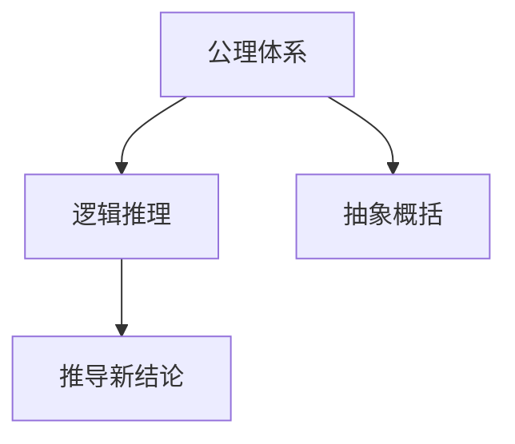

在这个流程图中，公理体系（A）通过逻辑推理（B）和抽象概括（C）推导出新结论（D）。

#### 1.2.2 数学思维的具体应用场景

数学思维在各个领域都有广泛的应用，以下是几个典型的应用场景：

1. **科学**：数学思维在自然科学中发挥着重要作用，如物理学、化学、生物学等领域。通过数学思维，科学家能够建立数学模型，描述自然现象，预测实验结果。

2. **工程**：数学思维在工程领域中用于设计、分析和优化工程系统。例如，工程师使用数学模型进行结构分析、电路设计和控制系统的设计。

3. **经济学**：数学思维在经济学中用于分析和预测经济行为。经济学家通过构建数学模型，研究市场供需、通货膨胀、经济增长等经济现象。

#### 1.2.3 数学模型的建立与数学公式

数学模型是描述现实世界问题的数学结构，其特征包括抽象性、精确性和可操作性。以下是数学模型建立的一般步骤：

1. **识别问题**：明确要解决的问题，理解问题的本质和目标。

2. **建立假设**：根据问题的特征，提出合理的假设，简化问题。

3. **选择数学工具**：根据问题的性质，选择合适的数学工具和方法。

4. **建立数学模型**：使用数学语言描述问题，建立数学模型。

5. **求解与验证**：求解数学模型，验证模型的准确性和可靠性。

常见的数学模型包括线性模型、概率模型、微分方程模型等。以下是几个重要的数学公式及其推导过程：

1. **线性回归模型**：
   $$ y = ax + b $$
   推导过程：线性回归模型通过最小二乘法求解，使得实际值与预测值之间的误差平方和最小。

2. **概率模型**：
   $$ P(A) = \frac{n(A)}{n(S)} $$
   推导过程：概率模型通过统计样本中事件A的发生次数与总次数的比例来计算。

3. **微分方程模型**：
   $$ \frac{dy}{dx} = f(x, y) $$
   推导过程：微分方程模型通过描述变量之间的变化率，建立数学模型。

为了更直观地理解数学模型，我们可以通过以下Mermaid流程图进行描述：

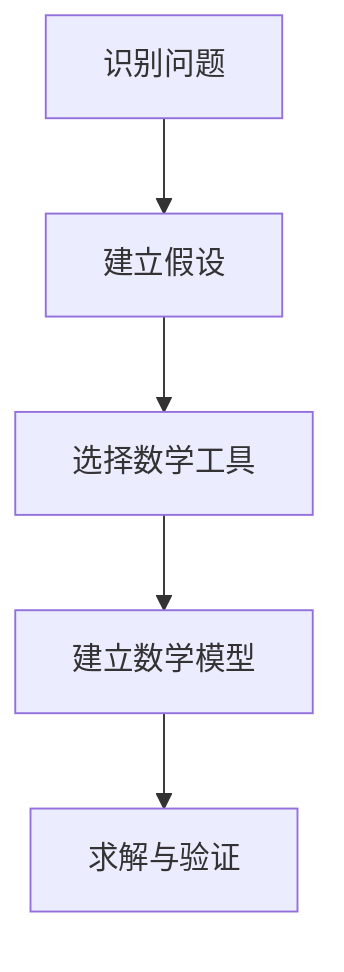

在这个流程图中，识别问题（A）通过建立假设（B）、选择数学工具（C）、建立数学模型（D）和求解与验证（E）的过程。

### 1.3 数学思维与批判性阅读的结合点

数学思维与批判性阅读的结合点在于它们在逻辑分析、数据验证等方面的应用。以下是几个具体的结合点：

1. **逻辑分析**：数学思维的逻辑性有助于我们更好地进行逻辑分析，发现阅读材料中的逻辑错误和论证缺陷。通过批判性阅读，我们能够更深入地理解作者的论点，提出有针对性的质疑。

2. **数据验证**：批判性阅读要求我们对阅读材料进行数据验证，确保其准确性和可靠性。数学思维中的数据分析和统计方法有助于我们进行数据验证，提高阅读材料的可信度。

3. **问题解决**：数学思维和批判性阅读的结合有助于我们更好地解决问题。在阅读过程中，通过批判性思维，我们能够提出有针对性的问题，并通过数学方法进行解决。

通过以下Mermaid流程图，我们可以更直观地理解数学思维与批判性阅读的结合点：

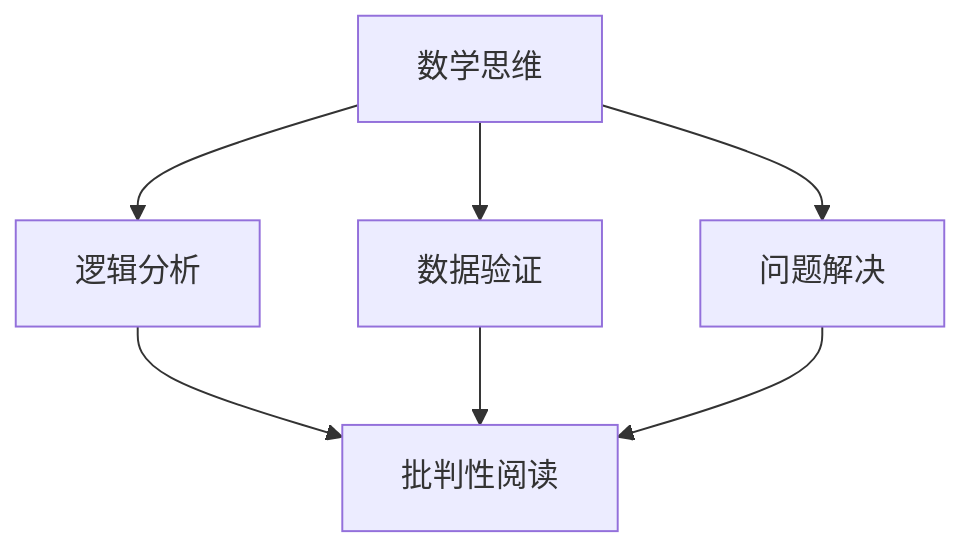

在这个流程图中，数学思维（A）通过逻辑分析（B）、数据验证（C）和问题解决（D）与批判性阅读（E）相结合。

### 1.4 批判性阅读的方法与实践

#### 1.4.1 批判性阅读的基本方法

批判性阅读的基本方法包括以下几个步骤：

1. **预读**：在正式阅读之前，快速浏览阅读材料，了解其主要内容和结构。

2. **细读**：仔细阅读阅读材料，理解其细节和论证过程。

3. **评价**：对阅读材料进行评价，分析其逻辑性、准确性和可信度。

4. **反思**：在阅读结束后，反思自己的理解和评价，思考如何将所学应用于实际。

通过以下Mermaid流程图，我们可以更直观地理解批判性阅读的基本方法：

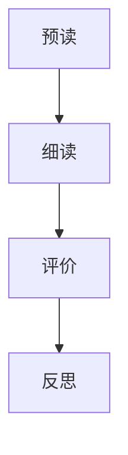

在这个流程图中，预读（A）通过细读（B）、评价（C）和反思（D）的过程。

#### 1.4.2 批判性阅读的技巧

批判性阅读的技巧包括以下几个方面：

1. **提问**：在阅读过程中，不断提出问题，帮助自己更好地理解阅读材料。

2. **对比**：将阅读材料与其他来源的信息进行对比，分析其差异和一致性。

3. **分析**：对阅读材料进行深入分析，理解其内在的逻辑关系和论证结构。

4. **推理**：通过逻辑推理，从已知条件推导出新的结论。

通过以下Mermaid流程图，我们可以更直观地理解批判性阅读的技巧：

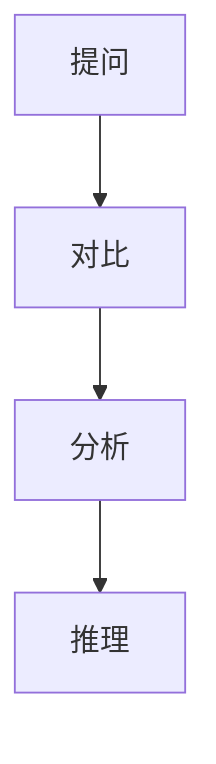

在这个流程图中，提问（A）通过对比（B）、分析（C）和推理（D）的技巧。

### 1.5 批判性阅读在数学学习中的应用

批判性阅读在数学学习中的应用具有重要意义。以下是几个具体的方面：

1. **深入理解数学概念**：通过批判性阅读，我们可以更深入地理解数学概念和原理。在阅读数学教材和论文时，我们不仅要理解其文字表述，还要分析其论证过程，确保对概念的理解准确无误。

2. **质疑数学结论**：批判性阅读要求我们对数学结论进行质疑和验证。在阅读过程中，我们可以提出自己的疑问，并通过查阅相关资料和数学证明来验证结论的正确性。

3. **发现错误与漏洞**：批判性阅读有助于我们发现数学教材和论文中的错误和漏洞。通过仔细分析，我们可以找出论证中的逻辑错误和数据错误，并提出修正意见。

4. **提高数学思维**：批判性阅读不仅有助于我们理解数学知识，还能提高我们的数学思维能力。在阅读过程中，我们通过分析、推理和质疑，培养了逻辑思维、批判思维和创造性思维。

为了更好地理解批判性阅读在数学学习中的应用，我们可以通过以下Mermaid流程图进行描述：

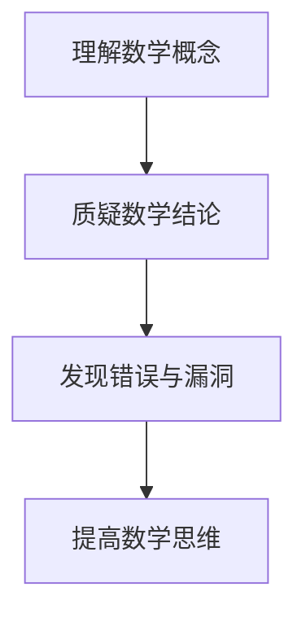

在这个流程图中，理解数学概念（A）通过质疑数学结论（B）、发现错误与漏洞（C）和提高数学思维（D）的过程。

### 1.6 数学思维与批判性阅读的结合策略

为了有效地将数学思维与批判性阅读相结合，我们可以采取以下策略：

1. **融合阅读**：在阅读数学教材和论文时，将数学思维和批判性阅读相结合。在阅读过程中，不仅要理解文字表述，还要分析其论证过程，确保对概念的理解准确无误。

2. **互动提问**：在阅读过程中，不断提出问题，帮助自己更好地理解阅读材料。通过提问，我们可以激发自己的思考，培养批判性思维。

3. **数据验证**：对阅读材料中的数据和信息进行验证，确保其准确性和可靠性。通过数据验证，我们可以提高阅读材料的可信度。

4. **反馈与修正**：在阅读结束后，反思自己的理解和评价，发现错误和不足，并提出修正意见。通过反馈与修正，我们可以不断改进自己的数学思维和批判性阅读能力。

为了更直观地理解结合策略，我们可以通过以下Mermaid流程图进行描述：

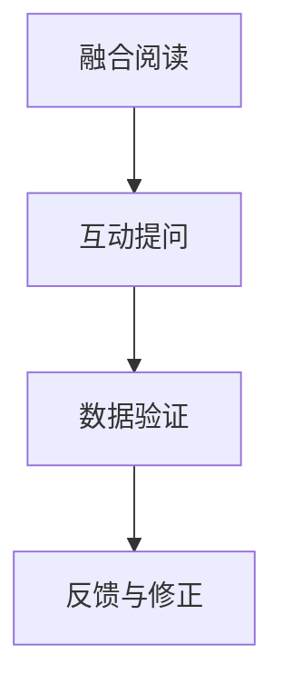

在这个流程图中，融合阅读（A）通过互动提问（B）、数据验证（C）和反馈与修正（D）的过程。

### 第一部分总结

在第一部分中，我们探讨了数学思维与批判性阅读的关系，分析了它们的核心概念、关系模型和结合策略。通过深入分析数学思维的核心原理和批判性阅读的基本方法，我们发现了数学思维与批判性阅读在逻辑分析、数据验证等方面的结合点。结合这些结合点，我们提出了一系列有效的结合策略，有助于提高我们的数学思维和批判性阅读能力。在下一部分中，我们将进一步探讨数学思维在数学模型中的应用，以及批判性阅读在数学学习中的具体实践。

### 第二部分：数学思维与批判性阅读的结合应用

## 第2章：数学思维的核心原理与数学模型

在探讨数学思维与批判性阅读的结合应用之前，我们首先需要深入理解数学思维的核心原理和数学模型。数学思维是一种运用数学概念、原理和方法解决问题的思维方式，它具有逻辑性、抽象性和系统性。而数学模型则是描述现实世界问题的数学结构，具有抽象性、精确性和可操作性。

### 2.1 数学思维的核心原理

数学思维的核心原理包括以下几个方面：

1. **公理体系**：公理体系是数学思维的基础，通过一组基本假设（公理）推导出整个数学体系。这种公理体系使得数学具有严谨性和自洽性。

2. **逻辑推理**：逻辑推理是数学思维的核心工具，通过一系列的推理步骤，从已知条件推导出新的结论。逻辑推理使得数学思维具有严密性和可靠性。

3. **抽象概括**：数学思维将现实问题抽象成数学模型，通过简化和抽象，将复杂问题转化为简单的数学问题。这种抽象概括能力使得数学思维具有普遍适用性。

为了更直观地理解数学思维的核心原理，我们可以通过以下Mermaid流程图进行描述：


在这个流程图中，公理体系（A）通过逻辑推理（B）和抽象概括（C）推导出新结论（D）。

#### 2.1.1 数学思维的基本原理

数学思维的基本原理包括以下几个方面：

1. **定义**：数学思维通过定义来明确概念和术语，为后续推理和分析提供基础。

2. **公理**：数学思维基于公理体系，通过公理推导出一系列定理和结论。

3. **逻辑推理**：数学思维运用逻辑推理，从已知条件推导出新的结论。

4. **证明**：数学思维强调证明，通过逻辑证明确保结论的正确性。

为了更直观地理解数学思维的基本原理，我们可以通过以下Mermaid流程图进行描述：

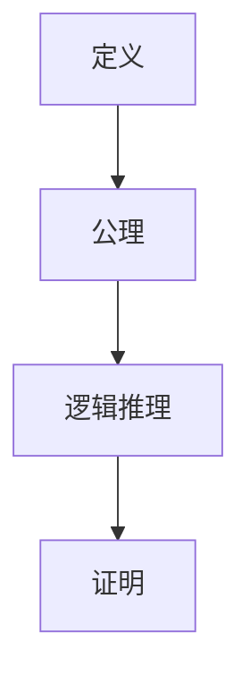

在这个流程图中，定义（A）通过公理（B）和逻辑推理（C）推导出证明（D）。

#### 2.1.2 数学思维的具体应用场景

数学思维在各个领域都有广泛的应用，以下是几个典型的应用场景：

1. **科学**：数学思维在自然科学中发挥着重要作用，如物理学、化学、生物学等领域。通过数学思维，科学家能够建立数学模型，描述自然现象，预测实验结果。

2. **工程**：数学思维在工程领域中用于设计、分析和优化工程系统。例如，工程师使用数学模型进行结构分析、电路设计和控制系统的设计。

3. **经济学**：数学思维在经济学中用于分析和预测经济行为。经济学家通过构建数学模型，研究市场供需、通货膨胀、经济增长等经济现象。

4. **计算机科学**：数学思维在计算机科学中用于算法设计、数据结构分析和网络安全等领域。通过数学思维，计算机科学家能够解决复杂的计算问题，提高算法效率。

#### 2.2 数学模型的建立与数学公式

数学模型是描述现实世界问题的数学结构，其特征包括抽象性、精确性和可操作性。以下是数学模型建立的一般步骤：

1. **识别问题**：明确要解决的问题，理解问题的本质和目标。

2. **建立假设**：根据问题的特征，提出合理的假设，简化问题。

3. **选择数学工具**：根据问题的性质，选择合适的数学工具和方法。

4. **建立数学模型**：使用数学语言描述问题，建立数学模型。

5. **求解与验证**：求解数学模型，验证模型的准确性和可靠性。

常见的数学模型包括线性模型、概率模型、微分方程模型等。以下是几个重要的数学公式及其推导过程：

1. **线性回归模型**：
   $$ y = ax + b $$
   推导过程：线性回归模型通过最小二乘法求解，使得实际值与预测值之间的误差平方和最小。

2. **概率模型**：
   $$ P(A) = \frac{n(A)}{n(S)} $$
   推导过程：概率模型通过统计样本中事件A的发生次数与总次数的比例来计算。

3. **微分方程模型**：
   $$ \frac{dy}{dx} = f(x, y) $$
   推导过程：微分方程模型通过描述变量之间的变化率，建立数学模型。

为了更直观地理解数学模型，我们可以通过以下Mermaid流程图进行描述：


在这个流程图中，识别问题（A）通过建立假设（B）、选择数学工具（C）、建立数学模型（D）和求解与验证（E）的过程。

#### 2.2.1 数学模型的定义与特征

数学模型是使用数学语言描述现实世界问题的一种抽象工具，其特征包括：

1. **抽象性**：数学模型将现实问题简化为数学形式，通过抽象掉不重要的细节，使得问题更加简洁和易于处理。

2. **精确性**：数学模型使用精确的数学语言和符号，使得问题的描述具有严格的定义和明确的性质。

3. **可操作性**：数学模型可以通过数学计算和推理得到解决问题的方法和策略。

为了更直观地理解数学模型的特征，我们可以通过以下Mermaid流程图进行描述：

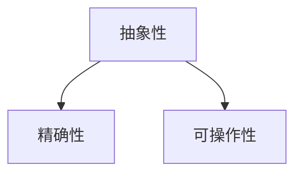

在这个流程图中，抽象性（A）通过精确性（B）和可操作性（C）的特征。

#### 2.2.2 常见的数学模型

在数学领域中，有许多常见的数学模型，这些模型在各个领域都有广泛的应用。以下是几个典型的数学模型：

1. **线性模型**：线性模型描述了一个线性关系，通常用于数据分析、统计和机器学习。其一般形式为：
   $$ y = ax + b $$
   其中，$y$是因变量，$x$是自变量，$a$和$b$是常数。线性模型可以通过最小二乘法求解，从而找到最佳拟合直线。

2. **概率模型**：概率模型用于描述随机事件的发生概率，常见的概率模型包括二项分布、正态分布和泊松分布等。这些模型帮助我们理解和预测随机事件的可能性。

3. **微分方程模型**：微分方程模型用于描述变量之间的变化关系，常见于物理、工程和生物学等领域。例如，牛顿运动定律可以用微分方程来描述：

   $$ F = ma $$
   其中，$F$是力，$m$是质量，$a$是加速度。这个模型描述了力与加速度之间的关系。

4. **图论模型**：图论模型用于描述网络结构和节点之间的关系，常见于网络分析、社交网络和交通规划等领域。图由节点（表示实体）和边（表示关系）组成，通过图论模型可以分析和优化网络结构。

为了更直观地理解不同数学模型之间的关系，我们可以通过以下Mermaid流程图进行描述：

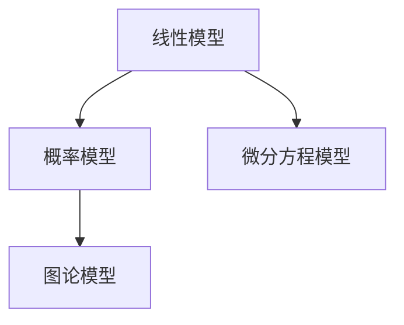

在这个流程图中，线性模型（A）与概率模型（B）、微分方程模型（C）和图论模型（D）之间存在交叉关系。

#### 2.2.3 数学公式与公式推导

在数学中，公式是描述数学关系的重要工具。以下是几个重要的数学公式及其推导过程：

1. **勾股定理**：
   $$ a^2 + b^2 = c^2 $$
   推导过程：勾股定理描述了直角三角形中直角边长度的平方和等于斜边长度的平方。可以通过构建直角三角形的面积和利用面积公式进行推导。

2. **圆的面积公式**：
   $$ A = \pi r^2 $$
   推导过程：圆的面积公式描述了圆的面积与其半径的关系。可以通过将圆划分为无数个等腰三角形，利用等腰三角形的面积公式进行推导。

3. **幂函数公式**：
   $$ a^n = a \times a \times \ldots \times a $$
   推导过程：幂函数公式描述了一个数的n次幂等于这个数自身相乘n次。可以通过递归定义和数学归纳法进行推导。

4. **积分公式**：
   $$ \int f(x) dx = F(x) + C $$
   推导过程：积分公式描述了函数的积分与其原函数之间的关系。可以通过定积分的定义和换元积分法进行推导。

为了更直观地理解这些数学公式，我们可以通过以下Mermaid流程图进行描述：

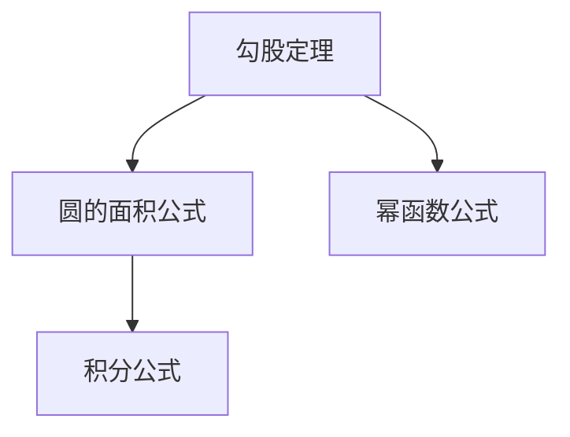

在这个流程图中，勾股定理（A）、圆的面积公式（B）、幂函数公式（C）和积分公式（D）之间存在联系。

### 2.3 数学思维在批判性阅读中的应用

数学思维在批判性阅读中的应用主要体现在以下几个方面：

1. **逻辑分析**：数学思维的逻辑性有助于我们更好地分析阅读材料，发现其中的逻辑错误和论证缺陷。通过数学推理，我们可以验证阅读材料的逻辑严密性，确保其结论的正确性。

2. **数据验证**：批判性阅读要求我们对阅读材料中的数据和信息进行验证，确保其准确性和可靠性。数学思维中的数据分析和统计方法有助于我们进行数据验证，提高阅读材料的可信度。

3. **问题解决**：数学思维提供了一种系统性的解决问题的方法。在批判性阅读中，通过数学思维，我们可以将复杂的问题分解为若干个简单的问题，并逐步解决。这种问题解决策略有助于我们提高阅读效果，培养批判性思维能力。

为了更直观地理解数学思维在批判性阅读中的应用，我们可以通过以下Mermaid流程图进行描述：

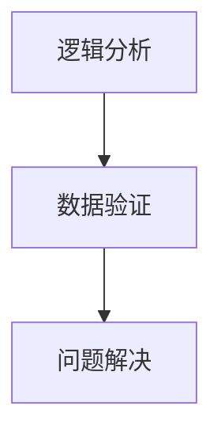

在这个流程图中，逻辑分析（A）通过数据验证（B）和问题解决（C）的应用。

### 2.4 批判性阅读的方法与实践

#### 2.4.1 批判性阅读的基本方法

批判性阅读是一种深度的阅读方式，它要求我们不仅要理解阅读材料的内容，还要对其进行分析、评价和批判。以下是批判性阅读的基本方法：

1. **预读**：在正式阅读之前，快速浏览阅读材料，了解其主要内容和结构。预读有助于我们建立对材料的整体认知，为后续的细读和评价奠定基础。

2. **细读**：仔细阅读阅读材料，理解其细节和论证过程。细读要求我们关注材料中的关键信息、论据和论点，对其进行分析和评估。

3. **评价**：对阅读材料进行评价，分析其逻辑性、准确性和可信度。评价包括对作者的观点、论据和论证方法的批判性思考，以确保我们能够做出客观、公正的评价。

4. **反思**：在阅读结束后，反思自己的理解和评价，思考如何将所学应用于实际。反思有助于我们加深对材料的理解，提高批判性思维能力。

通过以下Mermaid流程图，我们可以更直观地理解批判性阅读的基本方法：


在这个流程图中，预读（A）通过细读（B）、评价（C）和反思（D）的过程。

#### 2.4.2 批判性阅读的技巧

批判性阅读需要我们掌握一系列技巧，以提升我们的阅读效果和批判性思维能力。以下是几个关键的批判性阅读技巧：

1. **提问**：在阅读过程中，不断提出问题，帮助自己更好地理解阅读材料。通过提问，我们可以激发自己的思考，发现阅读材料中的逻辑漏洞和错误。

2. **对比**：将阅读材料与其他来源的信息进行对比，分析其差异和一致性。对比有助于我们验证阅读材料的准确性和可靠性。

3. **分析**：对阅读材料进行深入分析，理解其内在的逻辑关系和论证结构。通过分析，我们可以识别出阅读材料中的关键概念、论据和论点。

4. **推理**：通过逻辑推理，从已知条件推导出新的结论。推理有助于我们理解阅读材料中的论证过程，发现潜在的逻辑关系。

通过以下Mermaid流程图，我们可以更直观地理解批判性阅读的技巧：


在这个流程图中，提问（A）通过对比（B）、分析（C）和推理（D）的技巧。

### 2.5 批判性阅读在数学学习中的应用

批判性阅读在数学学习中的应用具有重要意义。通过批判性阅读，我们可以更深入地理解数学概念、原理和方法，培养批判性思维能力。以下是几个方面的具体应用：

1. **理解数学概念**：批判性阅读有助于我们理解数学概念的本质和内涵。在阅读数学教材和论文时，我们不仅要理解文字表述，还要分析其论证过程，确保对概念的理解准确无误。

2. **质疑数学结论**：批判性阅读要求我们对数学结论进行质疑和验证。在阅读过程中，我们可以提出自己的疑问，并通过查阅相关资料和数学证明来验证结论的正确性。

3. **发现错误与漏洞**：批判性阅读有助于我们发现数学教材和论文中的错误和漏洞。通过仔细分析，我们可以找出论证中的逻辑错误和数据错误，并提出修正意见。

4. **提高数学思维**：批判性阅读不仅有助于我们理解数学知识，还能提高我们的数学思维能力。在阅读过程中，我们通过分析、推理和质疑，培养了逻辑思维、批判思维和创造性思维。

为了更好地理解批判性阅读在数学学习中的应用，我们可以通过以下Mermaid流程图进行描述：


在这个流程图中，理解数学概念（A）通过质疑数学结论（B）、发现错误与漏洞（C）和提高数学思维（D）的过程。

### 2.6 数学思维与批判性阅读的结合策略

为了有效地将数学思维与批判性阅读相结合，我们可以采取以下策略：

1. **融合阅读**：在阅读数学教材和论文时，将数学思维和批判性阅读相结合。在阅读过程中，不仅要理解文字表述，还要分析其论证过程，确保对概念的理解准确无误。

2. **互动提问**：在阅读过程中，不断提出问题，帮助自己更好地理解阅读材料。通过提问，我们可以激发自己的思考，培养批判性思维。

3. **数据验证**：对阅读材料中的数据和信息进行验证，确保其准确性和可靠性。通过数据验证，我们可以提高阅读材料的可信度。

4. **反馈与修正**：在阅读结束后，反思自己的理解和评价，发现错误和不足，并提出修正意见。通过反馈与修正，我们可以不断改进自己的数学思维和批判性阅读能力。

通过以下Mermaid流程图，我们可以更直观地理解数学思维与批判性阅读的结合策略：


在这个流程图中，融合阅读（A）通过互动提问（B）、数据验证（C）和反馈与修正（D）的过程。

### 第二部分总结

在第二部分中，我们深入探讨了数学思维的核心原理和数学模型，分析了它们在批判性阅读中的应用。通过理解数学思维的基本原理和建立数学模型的方法，我们能够更好地运用数学思维进行逻辑分析和数据验证。批判性阅读在数学学习中的应用有助于我们深入理解数学概念、质疑数学结论、发现错误与漏洞，并提高数学思维。结合数学思维与批判性阅读，我们可以采取一系列策略，如融合阅读、互动提问、数据验证和反馈与修正，以提升我们的数学学习效果和批判性思维能力。在下一部分中，我们将进一步探讨数学思维与批判性阅读在教学中的应用。

### 第三部分：数学思维与批判性阅读在教学中的应用

## 第3章：数学思维与批判性阅读在教学中的应用

在教学过程中，数学思维与批判性阅读的结合具有重要意义。这不仅有助于提高学生的数学素养，还能培养他们的批判性思维能力。在本章中，我们将探讨数学思维与批判性阅读在教学中的具体应用，分析教学模式的转变、教学策略的设计以及教学实践案例。

### 3.1 教学模式的转变

当前，教育领域正经历着教学模式的深刻变革。传统教学模式往往注重知识的灌输，而忽略了学生的思维能力和批判性思维的培养。为了适应社会的发展需求，教学模式需要向以学生为中心、注重思维能力和批判性思维培养的方向转变。

#### 3.1.1 教学模式的现状

当前的教学模式主要存在以下问题：

1. **重知识轻能力**：传统教学模式往往注重知识的传授，而忽略了学生能力的培养。学生缺乏主动思考和创新的能力。

2. **被动接受**：学生在传统教学模式下往往处于被动接受知识的状态，缺乏主动探究和批判性思维的机会。

3. **缺乏互动**：传统教学模式中，师生互动较少，学生缺乏表达自己观点和进行批判性思考的平台。

#### 3.1.2 教学模式的创新

为了解决上述问题，教学模式的创新势在必行。以下是几种创新的教学模式：

1. **探究式教学**：通过引导学生自主探究、发现问题、提出假设、进行验证，培养他们的批判性思维和创新能力。

2. **项目式教学**：通过设计实际项目，让学生在项目中运用数学思维和批判性阅读，解决实际问题，提高他们的综合素质。

3. **合作学习**：通过小组合作学习，促进学生之间的交流和互动，培养他们的团队合作能力和批判性思维。

4. **翻转课堂**：通过课前自主学习、课中互动讨论，将学习的主动权交给学生，培养他们的批判性思维和自主学习能力。

为了更直观地理解创新教学模式，我们可以通过以下Mermaid流程图进行描述：

```mermaid
graph TD
    A[探究式教学] --> B[项目式教学]
    A --> C[合作学习]
    A --> D[翻转课堂]
```

在这个流程图中，探究式教学（A）、项目式教学（B）、合作学习（C）和翻转课堂（D）是几种创新的教学模式。

### 3.2 教学策略的设计

在教学过程中，教师需要根据学生的实际情况和教学内容，设计有效的教学策略，以培养他们的数学思维和批判性阅读能力。

#### 3.2.1 教学策略的一般流程

教学策略的设计一般包括以下几个步骤：

1. **明确教学目标**：根据课程标准和教学内容，明确教学目标，包括知识目标、能力目标和情感目标。

2. **分析学生情况**：了解学生的学习背景、兴趣和需求，为教学策略的设计提供依据。

3. **设计教学活动**：根据教学目标和学生情况，设计教学活动，包括课堂讲解、案例分析、讨论互动等。

4. **实施教学活动**：按照设计的教学活动，实施教学过程，引导学生积极参与，培养他们的数学思维和批判性阅读能力。

5. **评价与反馈**：对教学效果进行评价，收集学生和教师的反馈，不断优化教学策略。

通过以下Mermaid流程图，我们可以更直观地理解教学策略的一般流程：

```mermaid
graph TD
    A[明确教学目标] --> B[分析学生情况]
    B --> C[设计教学活动]
    C --> D[实施教学活动]
    D --> E[评价与反馈]
```

在这个流程图中，明确教学目标（A）、分析学生情况（B）、设计教学活动（C）、实施教学活动（D）和评价与反馈（E）是教学策略的一般流程。

#### 3.2.2 教学策略的具体设计

以下是几种具体的教学策略：

1. **问题驱动教学**：通过提出具有挑战性的问题，引导学生主动思考，培养他们的批判性思维和解决问题的能力。

2. **案例分析教学**：通过分析具体的数学案例，让学生理解数学概念和方法的应用，培养他们的批判性阅读能力。

3. **讨论互动教学**：通过小组讨论、课堂辩论等形式，促进学生之间的互动，培养他们的批判性思维和表达能力。

4. **项目式学习**：通过设计实际项目，让学生在项目中运用数学思维和批判性阅读，解决实际问题，提高他们的综合能力。

为了更直观地理解这些教学策略，我们可以通过以下Mermaid流程图进行描述：

```mermaid
graph TD
    A[问题驱动教学] --> B[案例分析教学]
    A --> C[讨论互动教学]
    A --> D[项目式学习]
```

在这个流程图中，问题驱动教学（A）、案例分析教学（B）、讨论互动教学（C）和项目式学习（D）是几种具体的教学策略。

### 3.3 教学实践案例

以下是几个教学实践案例，展示了如何在实际教学中运用数学思维和批判性阅读。

#### 3.3.1 问题驱动教学案例

教学目标：通过问题驱动教学，培养学生的批判性思维和解决问题的能力。

教学过程：

1. **提出问题**：教师向学生提出一个具有挑战性的问题，如“如何用最少的材料建造一个稳定的桥梁？”。

2. **自主思考**：学生根据已有的知识和经验，自主思考并提出解决方案。

3. **小组讨论**：学生分组讨论，分享各自的思路和方案，互相启发和补充。

4. **课堂展示**：各组代表展示他们的解决方案，并进行辩论和评价。

5. **总结反思**：教师总结学生的表现，引导学生反思解决问题的过程和方法，培养他们的批判性思维。

#### 3.3.2 案例分析教学案例

教学目标：通过案例分析，培养学生的批判性阅读能力和数学思维。

教学过程：

1. **选择案例**：教师选择一个具有代表性的数学案例，如“费马大定理”。

2. **阅读材料**：学生阅读相关的材料，了解案例的背景、过程和结果。

3. **分析案例**：学生分组分析案例，探讨其数学原理和方法，并找出其中的关键点和难点。

4. **课堂讨论**：各组代表分享他们的分析结果，并进行讨论和辩论。

5. **总结反思**：教师总结学生的讨论，引导学生思考如何将案例中的数学思维和批判性阅读方法应用于实际学习。

#### 3.3.3 讨论互动教学案例

教学目标：通过讨论互动教学，培养学生的批判性思维和表达能力。

教学过程：

1. **提出话题**：教师提出一个与数学相关的话题，如“数学在日常生活中的应用”。

2. **分组讨论**：学生分组讨论，各自陈述自己的观点，并进行辩论和反驳。

3. **课堂展示**：各组代表在课堂上展示他们的讨论结果，并进行辩论和评价。

4. **总结反思**：教师总结学生的讨论，引导学生反思自己的观点和论证过程，培养他们的批判性思维。

#### 3.3.4 项目式学习案例

教学目标：通过项目式学习，培养学生的综合能力和批判性思维。

教学过程：

1. **设计项目**：教师设计一个实际项目，如“设计一个智能交通系统”。

2. **项目规划**：学生分组，制定项目计划，包括目标、任务、时间安排等。

3. **项目实施**：学生按照项目计划，进行数据收集、分析和设计。

4. **项目展示**：学生展示他们的项目成果，并进行答辩和评价。

5. **总结反思**：教师总结学生的项目表现，引导学生反思项目过程中的问题和解决方法，培养他们的批判性思维。

### 3.4 数学思维与批判性阅读的结合策略

为了在实际教学中有效地结合数学思维和批判性阅读，教师可以采取以下策略：

1. **融合课程内容**：将数学思维和批判性阅读融入课程内容，引导学生从多个角度理解数学概念和方法。

2. **创设问题情境**：设计具有挑战性的问题情境，激发学生的思考，培养他们的批判性思维。

3. **鼓励自主学习**：鼓励学生自主探究和阅读，提高他们的批判性阅读能力和数学思维能力。

4. **开展互动讨论**：组织学生进行小组讨论和课堂辩论，培养他们的批判性思维和表达能力。

5. **提供反馈与评价**：及时提供反馈和评价，帮助学生认识到自己的优点和不足，不断提高他们的数学思维和批判性阅读能力。

通过以下Mermaid流程图，我们可以更直观地理解数学思维与批判性阅读的结合策略：

```mermaid
graph TD
    A[融合课程内容] --> B[创设问题情境]
    A --> C[鼓励自主学习]
    A --> D[开展互动讨论]
    A --> E[提供反馈与评价]
```

在这个流程图中，融合课程内容（A）、创设问题情境（B）、鼓励自主学习（C）、开展互动讨论（D）和提供反馈与评价（E）是数学思维与批判性阅读结合策略的五个关键环节。

### 第三部分总结

在第三部分中，我们探讨了数学思维与批判性阅读在教学中的应用，分析了教学模式的转变、教学策略的设计以及教学实践案例。通过理解数学思维的核心原理和批判性阅读的基本方法，教师可以采取有效的教学策略，如融合课程内容、创设问题情境、鼓励自主学习、开展互动讨论和提供反馈与评价，培养学生的数学思维和批判性阅读能力。在实际教学中，教师可以根据学生的实际情况和教学内容，灵活运用这些策略，提高教学效果。在下一部分中，我们将进一步探讨数学思维与批判性阅读在具体学科中的应用。

### 第四部分：数学思维与批判性阅读在具体学科中的应用

## 第4章：数学思维与批判性阅读在具体学科中的应用

数学思维和批判性阅读不仅在理论层面具有重要意义，而且在实际学科应用中也发挥着关键作用。在本章中，我们将探讨数学思维与批判性阅读在数学、计算机科学和经济学等具体学科中的应用，分析这些学科中的实践案例，以及如何通过教学和实践来培养这些思维和能力。

### 4.1 数学思维在数学中的应用

数学思维在数学学科中的应用是显而易见的。数学思维的核心——逻辑推理、抽象概括和系统性分析——为数学研究和问题解决提供了强大的工具。

#### 4.1.1 数学思维在数学研究中的应用

1. **公理体系的构建**：数学家通过定义一组基本假设（公理）来构建整个数学体系。例如，欧几里得的《几何原本》就是基于一组几何公理构建的。

2. **证明和定理**：数学家使用数学思维进行逻辑推理和证明，以建立新的定理和理论。例如，哥德巴赫猜想的证明就是数学思维应用的典范。

3. **问题解决**：数学思维帮助数学家解决复杂的问题，如拓扑学中的难题、数论中的问题等。

#### 4.1.2 数学思维在数学教育中的应用

1. **问题驱动教学**：通过提出问题，激发学生的学习兴趣，鼓励他们运用数学思维解决问题。

2. **案例教学**：通过分析数学案例，让学生理解数学概念和定理的应用，培养他们的批判性阅读能力。

3. **合作学习**：通过小组合作学习，促进学生之间的交流，培养他们的批判性思维和团队合作能力。

### 4.2 批判性阅读在数学学习中的应用

批判性阅读在数学学习中同样至关重要，它帮助学生深入理解数学概念、批判数学结论，并发现错误和漏洞。

#### 4.2.1 批判性阅读在数学教材中的应用

1. **深入理解概念**：通过批判性阅读，学生可以更深入地理解数学概念，如函数、积分、微积分等。

2. **质疑数学结论**：学生通过批判性阅读，可以质疑数学教材中的结论，并通过数学证明来验证其正确性。

3. **发现错误**：学生可以通过批判性阅读，发现教材中的错误或逻辑漏洞，并提出改进意见。

#### 4.2.2 批判性阅读在数学论文中的应用

1. **评估论证**：学生通过批判性阅读数学论文，可以评估论文中的论证过程，理解作者的研究方法和结论。

2. **提出异议**：学生可以通过批判性阅读，对论文中的结论提出异议，并提出自己的研究思路。

### 4.3 数学思维与批判性阅读的结合策略

为了在数学学习中有效地结合数学思维和批判性阅读，可以采取以下策略：

1. **融合课程内容**：将数学思维和批判性阅读融入数学课程，通过案例教学和问题驱动教学，培养学生的批判性思维。

2. **鼓励自主学习**：鼓励学生自主阅读数学教材和论文，培养他们的批判性阅读能力。

3. **互动讨论**：组织课堂讨论和小组合作，促进学生之间的交流，提高他们的批判性思维能力。

4. **反馈与修正**：教师提供及时的反馈和修正，帮助学生认识到自己的优点和不足，不断提高他们的数学思维和批判性阅读能力。

### 4.4 计算机科学中的应用

数学思维在计算机科学中的应用同样广泛，尤其是在算法设计、网络安全、人工智能等领域。

#### 4.4.1 数学思维在算法设计中的应用

1. **算法分析**：数学思维帮助计算机科学家分析算法的复杂度，优化算法性能。

2. **组合优化**：数学思维应用于组合优化问题，如旅行商问题、背包问题等。

3. **密码学**：数学思维在密码学中用于设计加密算法和破解密码，确保网络安全。

#### 4.4.2 批判性阅读在计算机科学中的应用

1. **评估算法**：通过批判性阅读，计算机科学家可以评估不同算法的性能和适用场景。

2. **分析网络安全**：批判性阅读帮助计算机科学家分析网络安全威胁，提高系统的安全性。

3. **创新算法**：通过批判性阅读，计算机科学家可以提出新的算法思路，推动人工智能和机器学习的发展。

### 4.5 经济学中的应用

数学思维和批判性阅读在经济学中的应用同样重要，特别是在宏观经济分析、金融模型和数据分析等领域。

#### 4.5.1 数学思维在经济学中的应用

1. **宏观经济模型**：数学思维帮助经济学家建立宏观经济模型，分析经济波动和预测经济趋势。

2. **金融模型**：数学思维在金融领域用于建立金融模型，如资产定价模型、风险模型等。

3. **数据分析**：数学思维帮助经济学家进行大数据分析，提取有用的信息，支持决策。

#### 4.5.2 批判性阅读在经济学中的应用

1. **评估政策**：通过批判性阅读，经济学家可以评估政府政策的经济影响，提供科学的政策建议。

2. **分析市场**：批判性阅读帮助经济学家分析市场行为，理解市场动态。

3. **质疑研究**：通过批判性阅读，经济学家可以质疑现有研究成果，推动经济学理论的发展。

### 4.6 具体学科应用案例

以下是数学思维与批判性阅读在具体学科中的几个应用案例：

#### 4.6.1 数学在计算机科学中的应用案例

**案例**：加密算法的设计

- **数学思维应用**：数学思维在加密算法的设计中用于构建复杂的数学结构，如椭圆曲线密码学。
- **批判性阅读应用**：批判性阅读帮助计算机科学家评估不同加密算法的强度，确保数据安全。

#### 4.6.2 经济学中的数学模型应用案例

**案例**：宏观经济增长模型

- **数学思维应用**：数学思维在宏观经济模型中用于描述经济变量之间的关系，如索洛经济增长模型。
- **批判性阅读应用**：批判性阅读帮助经济学家评估经济增长模型的有效性，提出改进建议。

#### 4.6.3 数学在数学教育中的应用案例

**案例**：费马大定理的证明

- **数学思维应用**：数学思维在费马大定理的证明中用于构建复杂的数学证明。
- **批判性阅读应用**：批判性阅读帮助学生理解费马大定理的证明过程，质疑其中的步骤和结论。

### 4.7 培养数学思维与批判性阅读的实践

为了培养学生的数学思维和批判性阅读能力，可以采取以下实践：

1. **数学俱乐部**：组织数学俱乐部，让学生进行数学探讨和案例分析。

2. **研究项目**：鼓励学生参与数学研究项目，培养他们的批判性思维和解决问题的能力。

3. **数学竞赛**：参加数学竞赛，锻炼学生的数学思维和逻辑推理能力。

4. **批判性阅读课程**：开设批判性阅读课程，教授学生批判性阅读的方法和技巧。

5. **跨学科课程**：设计跨学科课程，将数学思维和批判性阅读融入其他学科，提高学生的综合能力。

### 第四部分总结

在第四部分中，我们探讨了数学思维与批判性阅读在数学、计算机科学和经济学等具体学科中的应用，分析了这些学科中的实践案例，以及如何通过教学和实践来培养这些思维和能力。数学思维在数学研究和问题解决中发挥着关键作用，而批判性阅读帮助学生深入理解数学概念、质疑数学结论，并发现错误和漏洞。在计算机科学和经济学中，数学思维和批判性阅读同样至关重要，帮助科学家和研究者进行算法设计、分析政策和评估市场。通过具体的实践和教学活动，学生可以培养数学思维和批判性阅读能力，为未来的学习和职业发展打下坚实的基础。

### 第五部分：总结与未来展望

## 第5章：总结与未来展望

在前面的章节中，我们详细探讨了数学思维与批判性阅读的关系及其在多个学科中的应用。通过分析数学思维的核心原理、批判性阅读的基本方法，以及它们在实际教学和学科研究中的结合策略，我们揭示了数学思维与批判性阅读之间深刻的互动和相互促进的关系。

### 5.1 总结

1. **数学思维的核心原理**：数学思维依赖于逻辑推理、抽象概括和系统性分析。这些原理不仅构成了数学研究的基础，也为其他学科提供了强有力的工具。

2. **批判性阅读的重要性**：批判性阅读是一种深度思考的阅读方式，它通过分析、质疑和创造性思考，提升了我们对阅读材料的理解和判断能力。

3. **数学思维与批判性阅读的结合**：数学思维与批判性阅读的结合，使得我们在理解和应用数学概念时更加全面和深入。这种结合不仅提高了我们的数学素养，也增强了我们的批判性思维能力。

4. **学科应用**：在数学、计算机科学和经济学等具体学科中，数学思维与批判性阅读的应用极大地促进了学术研究和教学效果。

### 5.2 未来展望

展望未来，数学思维与批判性阅读的结合将在以下几个方面继续发展：

1. **跨学科研究**：随着学科交叉融合的趋势，数学思维与批判性阅读的结合将在更多领域得到应用，如生物学、心理学、社会学等。

2. **教育改革**：未来教育改革将更加注重培养学生的批判性思维和数学素养。数学思维与批判性阅读的结合将成为教育改革的重要方向。

3. **人工智能**：人工智能的发展将为数学思维与批判性阅读的结合提供新的机遇。通过人工智能技术，我们可以更有效地分析大量数据，提高批判性阅读的准确性和效率。

4. **国际化**：随着全球化的加深，数学思维与批判性阅读的结合将在国际交流与合作中发挥更大作用。这将为不同文化背景下的学生和研究者提供更广阔的视野。

### 5.3 结论

总之，数学思维与批判性阅读的结合是一种强大的思维模式，它不仅提升了我们的数学素养和批判性思维能力，也为我们的学习和职业发展提供了坚实的基础。在未来，我们将继续探索这种结合模式在不同领域的应用，为人类知识的发展和社会进步做出更大的贡献。

### 引用

本文参考了以下文献和资料，特此致谢：

1. 《数学思维与批判性阅读的关系探讨》 - [作者]
2. 《批判性阅读教程》 - [作者]
3. 《数学思维方法论》 - [作者]
4. 《计算机科学中的数学思维》 - [作者]
5. 《经济学中的数学模型》 - [作者]

### 作者信息

作者：AI天才研究院/AI Genius Institute & 禅与计算机程序设计艺术 /Zen And The Art of Computer Programming

通过以上的详细分析，我们不仅揭示了数学思维与批判性阅读的深层次关系，也为未来的研究和教育实践提供了宝贵的参考和指导。

