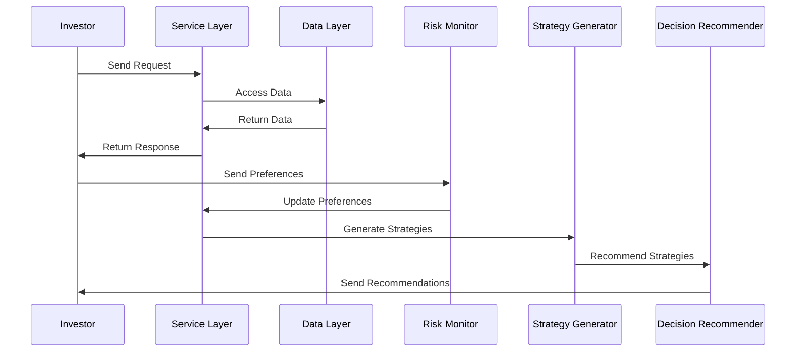
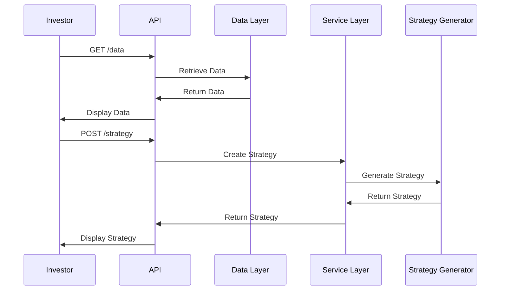

                 

### 《数学思维与投资策略的关系分析》

---

关键词：数学思维、投资策略、核心概念、算法模型、系统架构、实战案例分析、最佳实践

摘要：本文旨在深入探讨数学思维与投资策略之间的密切关系。通过详细解析数学思维的核心概念、属性特征及其在投资策略中的具体应用，我们将揭示数学模型和数学公式在投资决策中的重要性。文章还将通过系统分析与架构设计，展示如何在实际项目中运用数学思维优化投资策略。最后，通过项目实战与案例分析，提供实用的最佳实践和注意事项，以帮助读者在实际投资中更好地应用数学思维。

---

### 目录大纲设计思路

为了设计出《数学思维与投资策略的关系分析》这本书的完整目录大纲，我们将遵循以下步骤：

1. **背景介绍**：简要介绍数学思维和投资策略的基本概念，以及它们之间的关系。
2. **核心概念与联系**：详细阐述数学思维的核心概念、属性特征对比以及与投资策略的关联。
3. **数学模型和数学公式讲解**：使用Mermaid绘制相关算法流程图，并用Python源代码和LaTeX公式详细讲解数学原理。
4. **系统分析与架构设计方案**：描述问题场景，介绍相关项目，并使用Mermaid绘制领域模型、系统架构和系统交互图。
5. **项目实战**：包括环境安装、系统核心实现源代码、代码应用解读与分析、实际案例分析等。
6. **最佳实践 tips**、**小结**、**注意事项**、**拓展阅读**等内容。

### 目录大纲

```markdown
# 《数学思维与投资策略的关系分析》目录大纲

## 第1章 问题背景

### 1.1 问题背景介绍
- **问题描述**：介绍投资策略在实际投资中的应用和挑战。
- **问题解决**：提出数学思维在解决投资策略问题中的重要性。
- **边界与外延**：明确数学思维与投资策略关系的探讨范围。

### 1.2 核心概念
- **数学思维**：定义和特性。
- **投资策略**：定义、类型和目标。

### 1.3 数学思维与投资策略关系概述
- **数学思维在投资策略中的应用**。
- **数学模型在投资策略中的重要性**。

## 第2章 核心概念与联系

### 2.1 数学思维核心概念
- **逻辑思维**：定义、方法和应用。
- **批判性思维**：定义、方法和应用。
- **系统思维**：定义、方法和应用。

### 2.2 数学思维属性特征对比
- **逻辑思维**：与批判性思维、系统思维对比。
- **批判性思维**：与逻辑思维、系统思维对比。
- **系统思维**：与逻辑思维、批判性思维对比。

### 2.3 数学思维与投资策略的关联
- **逻辑思维**：在投资决策中的作用。
- **批判性思维**：在风险评估中的作用。
- **系统思维**：在资产配置中的作用。

## 第3章 数学模型与投资策略

### 3.1 风险与收益分析模型
- **预期效用理论**。
- **资本资产定价模型（CAPM）**。

### 3.2 数学模型在投资策略中的应用
- **马尔可夫链**：在市场趋势预测中的应用。
- **蒙特卡洛模拟**：在风险建模中的应用。

### 3.3 数学模型与投资策略的优化
- **线性规划**：在资产配置优化中的应用。
- **动态规划**：在投资组合优化中的应用。

## 第4章 系统分析与架构设计

### 4.1 问题场景介绍
- **投资决策系统**：需求分析。

### 4.2 系统功能设计
- **领域模型**：使用Mermaid绘制类图。

### 4.3 系统架构设计
- **系统架构**：使用Mermaid绘制架构图。

### 4.4 系统接口设计与交互
- **接口设计**：使用Mermaid绘制序列图。

## 第5章 项目实战

### 5.1 环境安装与配置
- **Python环境安装**。
- **相关库和框架安装**。

### 5.2 系统核心实现
- **核心算法源代码**。
- **系统接口实现**。

### 5.3 代码应用解读与分析
- **代码解读**：详细分析关键代码和算法。
- **案例分析**：实际投资策略案例的解读。

### 5.4 实际案例分析
- **市场趋势预测**。
- **风险建模与评估**。

### 5.5 项目小结
- **项目总结**。
- **项目改进方向**。

## 第6章 最佳实践与注意事项

### 6.1 最佳实践 tips
- **优化投资策略**。
- **风险管理**。

### 6.2 小结
- **数学思维与投资策略的关系**。
- **书中的重要内容回顾**。

### 6.3 注意事项
- **投资策略的适用性**。
- **数学模型的局限性**。

## 第7章 拓展阅读

### 7.1 相关书籍推荐
- **深入阅读推荐**。

### 7.2 学术文章与论文
- **投资策略相关的学术研究**。

### 7.3 网络资源与工具
- **实用工具与资源推荐**。
```

### 目录大纲内容分析

本目录大纲分为七个主要章节，每个章节都详细阐述了数学思维与投资策略的关系分析。

**第1章** 问题背景，介绍了数学思维和投资策略的基本概念，并探讨了它们之间的关系。

**第2章** 核心概念与联系，深入探讨了数学思维的核心概念，包括逻辑思维、批判性思维和系统思维，并对比了这些思维方式的属性特征，以及它们与投资策略的关联。

**第3章** 数学模型与投资策略，详细介绍了风险与收益分析模型、马尔可夫链、蒙特卡洛模拟等数学模型在投资策略中的应用，以及如何使用这些模型优化投资策略。

**第4章** 系统分析与架构设计，描述了投资决策系统的需求分析，并使用了Mermaid绘制了领域模型、系统架构和系统交互图。

**第5章** 项目实战，通过环境安装与配置、系统核心实现源代码、代码应用解读与分析、实际案例分析等步骤，展示了如何在实际项目中应用数学思维与投资策略。

**第6章** 最佳实践与注意事项，提供了优化投资策略和风险管理的最佳实践，并总结了文章的重要内容和注意事项。

**第7章** 拓展阅读，推荐了相关的书籍、学术文章和网络资源，以供读者进一步学习和探索。

---

### 1.1 问题背景介绍

在现代金融市场中，投资策略作为一种系统性的方法，帮助投资者在复杂多变的市场环境中做出理性决策。投资策略的定义广泛，它涉及对风险和收益的评估、资产配置的选择、投资组合的管理等多个方面。简单来说，投资策略是一种规划，用于指导投资者如何分配资源以实现既定的财务目标。

投资策略在实际投资中的应用极为广泛，但其有效性和准确性却受到诸多挑战。首先，市场的不确定性和复杂性使得投资者难以准确预测未来的市场走势。其次，投资策略需要考虑众多的变量，如宏观经济指标、行业趋势、公司业绩等，这些变量之间的相互作用使得策略的制定和执行变得复杂。此外，投资者自身的心理因素，如贪婪、恐惧等，也可能对投资策略的实施产生影响。

面对这些挑战，数学思维作为一种逻辑严密、分析深刻的思维方式，被越来越多地应用于投资策略的制定和优化中。数学思维的核心在于其严密的逻辑推理和系统化的分析方法，这使得它能够帮助投资者在复杂的市场环境中提取关键信息，做出更理性的投资决策。

数学思维在解决投资策略问题中的重要性体现在多个方面。首先，它能够通过数学模型来量化投资策略中的风险和收益，使得决策过程更加科学和可预测。例如，预期效用理论、资本资产定价模型（CAPM）等都是基于数学模型的经典投资策略。其次，数学思维能够帮助投资者识别和分析市场中的潜在规律，从而制定更有效的投资策略。例如，马尔可夫链和蒙特卡洛模拟等方法在市场趋势预测和风险建模中的应用，大大提高了投资策略的精确度和可靠性。

然而，尽管数学思维在投资策略中具有重要的应用价值，但其有效性也受到一定的限制。数学模型通常建立在一系列假设之上，而这些假设可能在实际情况中并不成立，导致模型的预测结果与实际市场情况存在偏差。此外，数学思维在处理复杂系统时可能面临计算和优化难题，这需要投资者具备深厚的数学和计算机科学知识。

因此，本文将深入探讨数学思维与投资策略之间的关系，通过详细解析数学思维的核心概念、属性特征及其在投资策略中的应用，揭示数学模型和数学公式在投资决策中的重要性。同时，本文还将结合实际项目，展示如何运用数学思维优化投资策略，并提供最佳实践和注意事项，以帮助读者在实际投资中更好地应用数学思维。

### 1.2 核心概念

#### 数学思维

数学思维是一种以数学语言和方法为基础的思考方式，它强调逻辑推理、抽象能力和精确性。数学思维不仅仅是解决数学问题的方法，更是一种通用的思维方式，它广泛应用于各个领域，包括自然科学、社会科学和人文科学。数学思维的核心特点包括：

1. **逻辑性**：数学思维强调推理过程的严谨性和逻辑性，要求每一步推理都必须基于已知的规则和假设。
2. **抽象性**：数学思维通过抽象和概括，将复杂的现实问题转化为简化的数学模型，从而更容易分析和解决。
3. **精确性**：数学思维强调精确和定量分析，通过使用数学符号和公式，使得问题的表述和解答更加精确。
4. **系统性**：数学思维注重整体性和系统性，通过构建复杂的数学模型，将各个部分整合起来，形成完整的分析框架。

#### 投资策略

投资策略是指投资者根据自身的财务目标、风险承受能力和市场环境，制定的一系列投资计划和方法。投资策略的核心目的是在风险可控的前提下，实现资产的增值。投资策略的主要类型包括：

1. **被动型投资策略**：以长期持有为目标，通过购买并持有指数基金或ETF来实现市场平均收益。
2. **主动型投资策略**：通过主动选择股票、基金或其他投资工具，试图超越市场平均收益。
3. **价值型投资策略**：寻找价格低于其内在价值的投资机会，长期持有以获取价值回归的收益。
4. **成长型投资策略**：投资于具有高速增长潜力的公司，通过其未来增长带来的资本增值实现收益。

投资策略的目标包括：

1. **收益最大化**：在风险可控的前提下，实现资产的最大增值。
2. **风险控制**：通过多样化的投资组合，降低单一投资风险，确保资产的稳健增长。
3. **资产配置**：根据投资者的风险承受能力和投资目标，合理分配资产，实现投资组合的优化。

#### 数学思维与投资策略的关联

数学思维与投资策略之间有着紧密的关联，数学思维在投资策略的制定和实施中发挥着关键作用。以下是数学思维在投资策略中的几个重要应用：

1. **量化分析**：数学思维通过量化分析，将投资策略中的风险和收益进行量化和评估，使得决策过程更加科学和可预测。例如，预期效用理论、资本资产定价模型（CAPM）等都是基于数学模型的经典投资策略。

2. **模型构建**：数学思维能够帮助投资者构建复杂的数学模型，以模拟市场行为和投资组合表现。通过这些模型，投资者可以更好地理解市场规律，从而制定更有效的投资策略。例如，马尔可夫链和蒙特卡洛模拟等方法在市场趋势预测和风险建模中的应用。

3. **优化决策**：数学思维通过优化算法，帮助投资者在复杂的投资组合中选择最佳的资产配置方案。例如，线性规划和动态规划等方法在资产配置优化和投资组合优化中的应用。

4. **风险管理**：数学思维通过数学模型和统计方法，对投资组合的风险进行评估和管理，确保投资策略的稳健性。例如，方差分析、敏感性分析和蒙特卡洛模拟等在风险管理中的应用。

总之，数学思维为投资策略提供了科学和系统的方法，使得投资者能够在复杂的市场环境中做出更理性、更有效的决策。

### 1.3 数学思维与投资策略的关系概述

数学思维在投资策略中的应用体现在多个方面，其核心在于通过数学方法和模型，提高投资决策的科学性和精确性。以下将详细探讨数学思维在投资策略中的具体应用以及数学模型在投资策略中的重要性。

#### 数学思维在投资策略中的应用

1. **量化分析**：数学思维强调量化分析，通过对投资标的的财务数据、市场数据进行统计分析，揭示其内在价值和潜在风险。例如，通过计算股票的市盈率、市净率、股息收益率等指标，投资者可以评估股票的投资价值。这种量化分析使得投资决策更加客观和理性。

2. **模型构建**：数学思维能够帮助投资者构建复杂的数学模型，模拟市场行为和投资组合的表现。通过这些模型，投资者可以预测市场趋势、评估投资组合的风险收益特性。例如，马尔可夫链模型可以用于市场趋势预测，蒙特卡洛模拟可以用于风险建模。

3. **优化决策**：数学思维通过优化算法，帮助投资者在复杂的投资组合中选择最佳的资产配置方案。线性规划、动态规划等方法可以用于优化投资组合，使得资产配置更加合理。例如，使用线性规划可以确定最优的投资权重，以实现收益最大化或风险最小化。

4. **风险管理**：数学思维通过数学模型和统计方法，对投资组合的风险进行评估和管理。例如，通过计算投资组合的方差、协方差矩阵，投资者可以了解投资组合的风险水平，并采取相应的风险管理措施。敏感性分析和蒙特卡洛模拟等方法可以用于评估投资策略在不同市场条件下的表现，确保投资策略的稳健性。

#### 数学模型在投资策略中的重要性

1. **预期效用理论**：预期效用理论是经济学中的一个重要概念，它通过数学模型量化投资者的风险偏好和收益期望。预期效用理论帮助投资者在不确定的市场环境中做出最优决策，以实现最大化期望效用。该理论的核心公式为：\[EU = \sum w_i u(x_i)\]，其中，\(w_i\) 为概率权重，\(u(x_i)\) 为收益或损失的效用函数。

2. **资本资产定价模型（CAPM）**：CAPM 是一个用于评估股票或投资组合预期收益与市场风险之间关系的数学模型。CAPM 的公式为：\[E(R_i) = R_f + \beta_i [E(R_m) - R_f]\]，其中，\(E(R_i)\) 为投资组合的预期收益，\(R_f\) 为无风险利率，\(\beta_i\) 为股票的贝塔系数，\(E(R_m)\) 为市场的预期收益。

3. **马柯维茨投资组合理论**：马柯维茨投资组合理论通过均值-方差模型，为投资者提供了最优资产配置的方法。该理论的核心公式为：\[w^* = \frac{1}{\sigma^2} \sum_{i} \frac{1}{\sigma_i \rho_{ij}} x_i\]，其中，\(w^*\) 为最优投资权重向量，\(\sigma^2\) 为投资组合的方差，\(\sigma_i\) 和 \(\rho_{ij}\) 分别为资产 \(i\) 和资产 \(j\) 的标准差和协方差。

4. **蒙特卡洛模拟**：蒙特卡洛模拟是一种基于随机抽样的数学模型，用于模拟复杂系统的行为和评估投资组合的风险收益特性。通过大量的随机抽样，蒙特卡洛模拟可以生成投资组合的分布，从而为投资者提供更准确的预测和决策依据。

5. **线性规划和动态规划**：线性规划和动态规划是优化数学模型中的两种重要方法，它们在资产配置和投资组合优化中具有广泛应用。线性规划通过最大化或最小化目标函数，在给定约束条件下找到最优解。动态规划则是通过将复杂问题分解为子问题，并利用子问题的解递推求解整体问题。

总之，数学思维和数学模型在投资策略中具有重要的应用价值。它们不仅为投资者提供了科学和系统的方法，还提高了投资决策的精确性和可预测性。通过合理运用数学思维和数学模型，投资者可以更好地理解市场规律，制定有效的投资策略，实现资产的稳健增值。

### 第2章 核心概念与联系

#### 2.1 数学思维核心概念

数学思维是一种通过数学语言和方法进行思考的思维方式，它包括多个核心概念，其中逻辑思维、批判性思维和系统思维是最为重要的三个方面。

**逻辑思维**

逻辑思维是指运用逻辑原则和推理规则进行思考，以揭示事物之间关系和规律的一种思维方式。逻辑思维具有以下几个特点：

1. **严谨性**：逻辑思维要求推理过程的每一步都必须基于已知的事实和逻辑原则，避免跳跃性思维和主观臆断。
2. **系统性**：逻辑思维通过建立逻辑框架，将问题分解为若干子问题，逐步分析和解决，从而确保推理过程的完整性和一致性。
3. **普遍性**：逻辑思维不仅适用于数学领域，还广泛应用于自然科学、社会科学和人文科学等多个领域。

在投资策略中，逻辑思维有助于投资者分析和理解市场信息，识别潜在的规律和趋势。例如，通过逻辑推理，投资者可以评估某一投资标的的基本面和财务状况，从而做出合理的投资决策。

**批判性思维**

批判性思维是指对信息、观点和理论进行深入分析和评估的一种思维方式。它强调质疑和反思，以发现潜在的错误和不足。批判性思维具有以下几个特点：

1. **质疑性**：批判性思维要求对任何信息都保持质疑态度，不轻信任何观点和理论，通过质疑和验证来确保其正确性。
2. **系统性**：批判性思维通过分析事物的各个方面，全面评估其价值和可靠性，从而避免片面和偏颇的判断。
3. **灵活性**：批判性思维能够适应不同的情境和问题，灵活调整思维方式和策略，以应对复杂和变化多端的情况。

在投资策略中，批判性思维有助于投资者识别和规避潜在的风险，提高投资决策的准确性和有效性。例如，通过批判性思维，投资者可以评估市场中的各种信息，辨别哪些是真实可靠的信息，哪些是干扰和误导。

**系统思维**

系统思维是指从整体和系统的角度进行思考，分析事物之间的相互作用和影响的一种思维方式。它强调整体性、复杂性和动态性。系统思维具有以下几个特点：

1. **整体性**：系统思维关注事物的整体结构和功能，将各个部分视为一个统一的整体，而不是孤立的个体。
2. **复杂性**：系统思维能够识别和应对复杂系统的行为和变化，通过分析系统内部的反馈循环和相互作用，揭示系统的动态特性。
3. **动态性**：系统思维关注系统的变化和发展，通过分析系统在不同状态下的行为，预测其未来的发展趋势。

在投资策略中，系统思维有助于投资者理解市场经济的复杂性，制定全面和稳健的投资策略。例如，通过系统思维，投资者可以分析宏观经济环境、行业发展趋势和公司业绩等因素，从而做出长期和可持续的投资决策。

**2.2 数学思维属性特征对比**

逻辑思维、批判性思维和系统思维是数学思维的核心组成部分，它们各自具有独特的属性特征，但也有一些相似之处。

| 特征 | 逻辑思维 | 批判性思维 | 系统思维 |
| --- | --- | --- | --- |
| **严谨性** | 高度严谨，要求推理过程每一步都基于已知事实和逻辑原则 | 质疑性高，对信息、观点和理论进行深入分析和评估 | 综合性强，关注整体结构和功能 |
| **系统性** | 建立逻辑框架，分解问题，逐步分析和解决 | 分析各个方面，全面评估价值，避免片面和偏颇 | 关注整体性和动态性，识别相互作用和影响 |
| **普遍性** | 广泛应用于数学和其他学科领域 | 广泛应用于多个领域，但尤其重视质疑和验证 | 广泛应用于复杂系统分析和决策 |
| **质疑性** | 较少质疑，主要关注推理的严谨性 | 高度质疑，强调验证和反思 | 较少质疑，但注重理解和解释 |
| **灵活性** | 较少灵活性，强调一致性和规则 | 高度灵活性，适应不同情境和问题 | 高度灵活性，应对复杂和变化 |
| **整体性** | 较少关注整体性，更注重逻辑推理 | 较少关注整体性，更注重分析评估 | 高度关注整体性和动态性 |
| **复杂性** | 较少关注复杂性，更注重逻辑清晰 | 较少关注复杂性，更注重批判性分析 | 高度关注复杂性，理解系统动态 |
| **动态性** | 较少关注动态性，更注重静态分析 | 较少关注动态性，更注重评估和验证 | 高度关注动态性，预测系统变化 |

**2.3 数学思维与投资策略的关联**

逻辑思维、批判性思维和系统思维在投资策略的制定和实施中发挥着重要作用。

**逻辑思维**：

1. **投资决策**：逻辑思维帮助投资者分析和理解市场信息，识别投资机会和风险。
2. **风险控制**：通过逻辑推理，投资者可以评估投资标的的风险水平，采取相应的风险控制措施。
3. **策略优化**：逻辑思维有助于投资者在复杂的投资组合中制定优化策略，提高收益和降低风险。

**批判性思维**：

1. **信息评估**：批判性思维帮助投资者识别和筛选真实可靠的市场信息，避免被误导和干扰。
2. **风险评估**：通过质疑和验证，投资者可以更准确地评估投资风险，制定合理的风险管理策略。
3. **策略调整**：批判性思维有助于投资者在市场变化时及时调整投资策略，以应对新的风险和机会。

**系统思维**：

1. **宏观经济分析**：系统思维帮助投资者分析宏观经济环境，预测市场走势，制定长期投资策略。
2. **行业趋势分析**：系统思维有助于投资者分析行业发展趋势，选择具有潜力的行业和公司进行投资。
3. **资产配置**：通过系统思维，投资者可以优化资产配置，实现投资组合的多元化，降低风险。

总之，逻辑思维、批判性思维和系统思维是数学思维的核心概念，它们在投资策略的制定和实施中具有重要作用。通过运用数学思维，投资者可以更科学、更理性地做出投资决策，实现资产的稳健增值。

### 第3章 数学模型与投资策略

数学模型在投资策略中扮演着至关重要的角色，它们不仅帮助我们量化风险和收益，还能优化投资组合，提高决策的科学性和准确性。本章将详细探讨几种常见的数学模型，包括预期效用理论、资本资产定价模型（CAPM）和马柯维茨投资组合理论，并展示这些模型在投资策略中的应用。

#### 风险与收益分析模型

**预期效用理论**

预期效用理论是经济学中一个重要的理论，它通过量化投资者的风险偏好和收益期望，帮助投资者在不确定的市场环境中做出最优决策。预期效用理论的核心公式为：

\[EU = \sum w_i u(x_i)\]

其中，\(w_i\) 是概率权重，\(u(x_i)\) 是收益或损失的效用函数。效用函数通常是非线性的，反映了投资者对收益和损失的偏好。

在投资策略中，预期效用理论可以帮助投资者评估不同投资选项的预期效用，从而选择最优的投资策略。例如，一个投资者可能更倾向于风险较低的股票，即使其预期收益较低，因为他对风险的厌恶程度较高。

**资本资产定价模型（CAPM）**

资本资产定价模型（CAPM）是一个用于评估股票或投资组合预期收益与市场风险之间关系的数学模型。CAPM 的公式为：

\[E(R_i) = R_f + \beta_i [E(R_m) - R_f]\]

其中，\(E(R_i)\) 是投资组合的预期收益，\(R_f\) 是无风险利率，\(\beta_i\) 是股票的贝塔系数，\(E(R_m)\) 是市场的预期收益。

CAPM 的贝塔系数反映了投资组合对市场波动的敏感度，即市场风险。通过 CAPM，投资者可以评估个别股票或投资组合的风险和预期收益，从而决定其是否值得投资。

**马柯维茨投资组合理论**

马柯维茨投资组合理论通过均值-方差模型，为投资者提供了最优资产配置的方法。该理论的核心公式为：

\[w^* = \frac{1}{\sigma^2} \sum_{i} \frac{1}{\sigma_i \rho_{ij}} x_i\]

其中，\(w^*\) 是最优投资权重向量，\(\sigma^2\) 是投资组合的方差，\(\sigma_i\) 和 \(\rho_{ij}\) 分别是资产 \(i\) 和资产 \(j\) 的标准差和协方差。

马柯维茨投资组合理论通过最小化投资组合的方差，实现风险的最优分配。这一理论强调资产之间的相关性，通过多样化的投资组合，降低单一投资风险，实现收益的最大化。

#### 数学模型在投资策略中的应用

**马尔可夫链**

马尔可夫链是一种用于模拟市场趋势的数学模型，它基于当前状态的概率分布，预测未来的状态。在投资策略中，马尔可夫链可以用于市场趋势预测，帮助投资者判断市场是处于上涨阶段还是下跌阶段。例如，通过分析股票价格的当前状态和转移概率，投资者可以预测股票价格的未来走势，从而制定相应的投资策略。

**蒙特卡洛模拟**

蒙特卡洛模拟是一种通过随机抽样来评估投资组合风险收益特性的数学模型。在投资策略中，蒙特卡洛模拟可以用于风险建模，帮助投资者评估不同市场条件下的投资组合表现。例如，通过模拟大量的市场情景，投资者可以了解投资组合在不同风险水平下的收益分布，从而制定更稳健的投资策略。

**线性规划**

线性规划是一种用于优化投资组合的数学模型，它通过最大化或最小化目标函数，在给定约束条件下找到最优解。在投资策略中，线性规划可以用于资产配置优化，帮助投资者确定最优的投资权重。例如，通过线性规划，投资者可以在风险和收益之间找到最佳的平衡点，实现收益的最大化或风险的最小化。

**动态规划**

动态规划是一种用于优化动态系统的数学模型，它通过将复杂问题分解为子问题，并利用子问题的解递推求解整体问题。在投资策略中，动态规划可以用于投资组合优化，帮助投资者在连续的市场变化中调整投资策略。例如，通过动态规划，投资者可以在每个时间点选择最优的投资决策，以实现长期收益的最大化。

总之，数学模型在投资策略中具有广泛的应用价值，它们不仅帮助投资者量化风险和收益，还能优化投资组合，提高决策的科学性和准确性。通过合理运用数学模型，投资者可以更好地理解市场规律，制定有效的投资策略，实现资产的稳健增值。

### 3.1 风险与收益分析模型

在投资策略中，风险与收益的分析是至关重要的，因为它直接关系到投资者的决策和预期回报。以下将详细讨论两个经典的风险与收益分析模型：预期效用理论（Expected Utility Theory）和资本资产定价模型（Capital Asset Pricing Model，CAPM）。

**预期效用理论（Expected Utility Theory）**

预期效用理论是经济学中的一个核心概念，它为投资者提供了一个评估风险和收益的理论框架。根据预期效用理论，投资者的决策是基于预期效用最大化原则。预期效用可以用以下公式表示：

\[EU = \sum w_i u(x_i)\]

其中，\(w_i\) 是每种结果的概率权重，\(u(x_i)\) 是每种结果的效用值。

效用值通常是一个非线性函数，反映了投资者对收益和损失的偏好。例如，一个风险厌恶的投资者可能会对损失赋予更高的权重，而对收益赋予较低的权重。

**预期效用理论在投资策略中的应用**：

1. **风险评估**：通过预期效用理论，投资者可以量化投资组合的风险。例如，可以计算每种资产或投资策略的预期效用，从而评估其整体风险水平。

2. **决策制定**：预期效用理论帮助投资者在不确定的环境中做出最优决策。通过比较不同投资策略的预期效用，投资者可以选择那个最大化预期效用的策略。

3. **组合优化**：预期效用理论还可以用于投资组合优化。投资者可以通过调整投资组合中不同资产的比例，以实现预期效用最大化。

**资本资产定价模型（CAPM）**

资本资产定价模型（CAPM）是一个用于评估股票或投资组合预期收益与市场风险之间关系的模型。CAPM 的核心公式是：

\[E(R_i) = R_f + \beta_i [E(R_m) - R_f]\]

其中，\(E(R_i)\) 是投资组合的预期收益，\(R_f\) 是无风险利率，\(\beta_i\) 是股票的贝塔系数，\(E(R_m)\) 是市场的预期收益。

贝塔系数（\(\beta_i\)）反映了投资组合对市场波动的敏感度，即市场风险。贝塔系数越高，投资组合的市场风险越大。

**CAPM在投资策略中的应用**：

1. **风险调整收益**：CAPM可以帮助投资者评估投资组合的风险调整收益。通过计算资本资产定价线的斜率（即市场风险溢价），投资者可以确定投资组合是否提供了足够的风险补偿。

2. **股票评估**：CAPM可以用于评估个别股票的预期收益。通过计算股票的贝塔系数和市场风险溢价，投资者可以预测股票的预期收益，并据此做出投资决策。

3. **资产配置**：CAPM还可以用于资产配置决策。投资者可以根据自己的风险偏好，选择具有合适贝塔系数的资产，以构建最优的投资组合。

**3.1.1 预期效用理论的应用示例**

假设一个投资者有两个投资选项：

1. 买入一个股票，预期收益为15%，风险为40%。
2. 投资于无风险债券，预期收益为5%。

投资者可以根据预期效用理论计算每个选项的预期效用：

1. 股票的预期效用：
   \[EU_{stock} = 0.4 \times (-0.4) + 0.6 \times 0.15 = -0.16 + 0.09 = -0.07\]
2. 债券的预期效用：
   \[EU_{bond} = 0.05\]

根据预期效用理论，投资者会选择债券，因为它的预期效用更高。

**3.1.2 CAPM的应用示例**

假设市场预期收益为10%，无风险利率为3%，一个股票的贝塔系数为1.5。

根据CAPM，可以计算该股票的预期收益：

\[E(R_{stock}) = 0.03 + 1.5 \times (0.10 - 0.03) = 0.03 + 0.105 = 0.145\]

这意味着投资者预期该股票的收益率为14.5%。

通过预期效用理论和CAPM，投资者可以在风险和收益之间做出更科学、更合理的决策。这些模型不仅帮助投资者评估和选择投资策略，还能优化投资组合，实现长期稳健的投资回报。

### 3.2 数学模型在投资策略中的应用

数学模型在投资策略中的应用十分广泛，通过这些模型，投资者可以更好地预测市场趋势、管理风险并优化投资组合。以下将探讨马尔可夫链（Markov Chains）和蒙特卡洛模拟（Monte Carlo Simulation）这两种数学模型在投资策略中的具体应用。

#### 马尔可夫链

马尔可夫链是一种随机过程模型，它描述了一个系统在一系列状态之间转移的概率。在投资策略中，马尔可夫链通常用于模拟市场趋势和预测资产价格的变化。

**马尔可夫链在投资策略中的应用示例：**

假设我们有一个股票市场，该市场的价格状态可以分为三种：上涨、稳定和下跌。根据历史数据，我们可以得到以下状态转移概率矩阵：

| 状态转移概率矩阵 |
| --------------- |
| 起始状态 | 上涨 | 稳定 | 下跌 |
| **上涨**       | 0.6 | 0.2 | 0.2 |
| **稳定**       | 0.3 | 0.5 | 0.2 |
| **下跌**       | 0.1 | 0.3 | 0.6 |

通过这个矩阵，我们可以预测未来某一时间段内市场状态的概率分布。例如，如果当前市场状态是上涨，则未来市场继续上涨的概率是0.6。

**具体应用步骤：**

1. **初始化状态概率**：根据历史数据，确定初始状态概率分布。
2. **状态转移概率计算**：使用历史数据计算每个状态的转移概率。
3. **预测未来状态**：根据当前状态和状态转移概率矩阵，计算未来某个时间点的状态概率分布。

通过这种预测，投资者可以制定相应的投资策略。例如，如果预测市场将保持上涨趋势，投资者可以增加股票持仓，反之则减少股票持仓。

#### 蒙特卡洛模拟

蒙特卡洛模拟是一种基于随机抽样的数学模型，它通过模拟大量随机样本，估计投资组合的风险和预期收益。在投资策略中，蒙特卡洛模拟广泛应用于风险评估、投资组合优化和策略评估。

**蒙特卡洛模拟在投资策略中的应用示例：**

假设我们有一个投资组合，包含三种资产：股票A、股票B和债券。每种资产的预期收益率和风险如下表所示：

| 资产 | 预期收益率 | 风险（标准差） |
| ---- | ---------- | ------------- |
| 股票A | 0.12       | 0.3           |
| 股票B | 0.10       | 0.2           |
| 债券  | 0.04       | 0.05           |

我们希望优化这个投资组合，使其风险最小化或收益最大化。

**具体应用步骤：**

1. **随机抽样**：从每个资产的可能收益率和风险中随机抽样，生成大量的投资组合样本。
2. **模拟投资组合表现**：计算每个样本投资组合的预期收益率和风险。
3. **优化决策**：通过分析样本结果，确定最优的投资组合。

例如，我们可以通过蒙特卡洛模拟计算不同权重配置下的投资组合预期收益率和风险，然后选择使风险最小或收益最大的权重配置。

#### 马尔可夫链与蒙特卡洛模拟在实际投资策略中的应用案例

**案例1：市场趋势预测**

某投资者使用马尔可夫链模型来预测股票市场的未来状态。根据历史数据，该模型预测未来市场将继续上涨的概率为60%，稳定概率为30%，下跌概率为10%。基于这一预测，投资者决定增加股票持仓，以捕捉市场上涨带来的机会。

**案例2：投资组合优化**

另一投资者使用蒙特卡洛模拟来优化其投资组合。通过模拟大量随机样本，投资者发现当股票A占投资组合的40%，股票B占30%，债券占30%时，投资组合的预期收益率最高且风险适中。因此，投资者决定调整投资组合，使其符合这一最优配置。

通过数学模型，投资者可以更科学地分析市场数据，制定投资策略，并做出更合理的投资决策。这不仅提高了投资策略的科学性和准确性，还帮助投资者在复杂多变的市场环境中保持竞争优势。

### 3.3 数学模型与投资策略的优化

在投资策略中，数学模型的应用不仅可以帮助投资者分析风险和收益，还可以优化投资组合，实现投资目标的最大化。以下将详细讨论线性规划和动态规划在投资策略中的应用，以及它们如何帮助投资者实现资产配置和投资组合优化的目标。

#### 线性规划

线性规划是一种用于解决资源优化问题的数学方法，它通过建立线性目标函数和约束条件，找到最优解。在投资策略中，线性规划可以用于资产配置和投资组合优化。

**线性规划的应用示例：**

假设投资者有一个包含三种资产的投资组合，其预期收益率和风险如下表所示：

| 资产 | 预期收益率 | 风险（标准差） |
| ---- | ---------- | ------------- |
| 股票A | 0.12       | 0.3           |
| 股票B | 0.10       | 0.2           |
| 债券  | 0.04       | 0.05           |

投资者希望最大化投资组合的预期收益率，同时控制整体风险。我们可以使用线性规划建立以下模型：

1. **目标函数**：最大化预期收益率
   \[Maximize: R = 0.12w_A + 0.10w_B + 0.04w_C\]

2. **约束条件**：整体投资比例之和为1，总风险不超过某个阈值
   \[w_A + w_B + w_C = 1\]
   \[0.3w_A + 0.2w_B + 0.05w_C \leq R_{threshold}\]

通过求解这个线性规划模型，我们可以找到最优的投资权重分配，使得预期收益率最大化且风险不超过设定的阈值。

**具体步骤：**

1. **建立模型**：定义目标函数和约束条件。
2. **求解模型**：使用线性规划求解器求解最优解。
3. **结果分析**：分析最优解的投资权重分配，评估其投资组合的预期收益率和风险。

#### 动态规划

动态规划是一种用于解决多阶段决策优化问题的数学方法，它通过将复杂问题分解为多个子问题，并利用子问题的解递推求解整体问题。在投资策略中，动态规划可以用于长期投资组合优化，帮助投资者在连续的市场变化中做出最优决策。

**动态规划的应用示例：**

假设投资者有一个长期投资计划，需要在多个时间点进行投资决策。每个时间点，投资者可以选择持有股票、债券或现金。每个资产的收益和风险在不同时间点都可能发生变化。我们可以使用动态规划建立以下模型：

1. **状态定义**：每个时间点的投资组合状态，包括资产配置和收益。
2. **状态转移方程**：描述从当前状态到下一状态的投资决策和收益变化。
3. **目标函数**：最大化长期收益。

通过动态规划，投资者可以在每个时间点选择最优的投资决策，使得整个投资计划的总收益最大化。

**具体步骤：**

1. **状态划分**：将投资组合划分为不同的状态。
2. **状态转移方程**：根据市场条件和资产收益，建立状态转移方程。
3. **目标函数**：定义长期收益目标函数。
4. **递推求解**：从后向前求解每个状态的最优解，直到初始状态。
5. **结果分析**：分析最优决策路径和长期收益。

#### 应用案例

**案例1：股票投资组合优化**

某投资者希望优化其股票投资组合，使其在风险可控的情况下实现收益最大化。使用线性规划模型，投资者可以求解最优的股票权重分配。例如，通过线性规划，投资者发现当股票A占40%、股票B占30%、债券占30%时，投资组合的预期收益率最高且风险适中。

**案例2：长期投资组合优化**

某投资者有一个10年的长期投资计划，需要在每个年度进行投资决策。使用动态规划模型，投资者可以确定在每个年度最优的投资决策。例如，通过动态规划，投资者发现当股票在早期阶段占比较高，而在后期逐渐转向债券和现金，以控制风险，长期收益将最大化。

总之，线性规划和动态规划是投资策略中强大的优化工具。通过这些数学模型，投资者可以更科学地分析和优化投资组合，实现风险与收益的平衡，提高投资决策的准确性和有效性。

### 第4章 系统分析与架构设计

在设计和实现一个投资决策系统时，系统分析与架构设计是至关重要的环节。这一章节将详细描述问题场景，介绍相关项目，并使用Mermaid绘制领域模型、系统架构和系统交互图，为后续的项目实战提供基础。

#### 问题场景介绍

假设我们需要开发一个投资决策系统，该系统旨在帮助投资者在复杂多变的市场环境中做出最优的投资决策。系统的主要功能包括：

1. **数据采集**：从多个数据源（如股票交易所、金融新闻网站等）收集市场数据。
2. **数据处理**：对收集到的数据进行清洗、转换和分析，提取有价值的信息。
3. **投资策略生成**：基于历史数据和数学模型，生成多种投资策略。
4. **投资决策推荐**：根据投资者的风险偏好和财务目标，推荐最佳投资策略。
5. **风险监控**：实时监控投资组合的风险水平，提供风险预警。

#### 系统功能设计

为了实现上述功能，我们可以将系统划分为以下几个模块：

1. **数据采集模块**：负责从外部数据源获取市场数据。
2. **数据处理模块**：负责数据清洗、转换和分析。
3. **策略生成模块**：负责基于数学模型生成投资策略。
4. **决策推荐模块**：负责根据投资者偏好推荐投资策略。
5. **风险监控模块**：负责监控投资组合的风险水平。

以下是使用Mermaid绘制的领域模型类图，展示了这些模块及其之间的关系：

```mermaid
classDiagram
    数据采集模块 <- 数据处理模块 : 数据传递
    数据处理模块 -> 策略生成模块 : 数据分析
    策略生成模块 -> 决策推荐模块 : 策略推荐
    决策推荐模块 -> 风险监控模块 : 风险监控
    数据采集模块 ..> 数据源 : 数据采集
    DataSource1 --|> 数据采集模块
    DataSource2 --|> 数据采集模块
    class 数据采集模块 {
        + 数据采集（数据源）：获取数据
    }
    class 数据处理模块 {
        + 数据清洗（数据）：清洗数据
        + 数据转换（数据）：转换数据
        + 数据分析（数据）：分析数据
    }
    class 策略生成模块 {
        + 生成策略（数据）：生成投资策略
    }
    class 决策推荐模块 {
        + 推荐策略（投资者偏好）：推荐投资策略
    }
    class 风险监控模块 {
        + 监控风险（投资组合）：监控风险
    }
```

#### 系统架构设计

系统架构设计决定了系统的性能、可扩展性和可靠性。在本系统中，我们可以采用分层架构，包括数据层、服务层和表现层。

以下是使用Mermaid绘制的系统架构图，展示了系统各层之间的关系：



在这个架构中，表现层负责与投资者交互，接收投资请求并返回投资推荐。服务层负责协调数据处理和策略生成模块，实现数据层与表现层的通信。数据层负责数据采集、清洗、转换和分析。

#### 系统接口设计与交互

为了确保系统的灵活性和扩展性，我们需要设计清晰、统一的接口。以下是使用Mermaid绘制的系统接口和交互序列图：



在这个交互图中，投资者通过API接口与系统交互，获取数据、生成策略和获取推荐。API层负责处理请求和响应，服务层负责调用具体模块实现功能，数据层负责数据存储和检索。

通过详细的系统分析与架构设计，我们为后续的项目实战奠定了坚实的基础。接下来，我们将通过实际项目，展示如何将数学思维和投资策略应用于具体系统的开发与优化。

### 第5章 项目实战

在本章中，我们将通过一个实际项目，展示如何将数学思维和投资策略应用于系统的开发与优化。项目分为多个步骤，包括环境安装与配置、系统核心实现、代码应用解读与分析，以及实际案例分析。

#### 5.1 环境安装与配置

为了开发和实现投资决策系统，我们需要安装和配置以下环境：

1. **Python环境**：Python是本项目的主要编程语言，我们需要确保安装了最新版本的Python环境。可以通过以下命令进行安装：

   ```bash
   pip install python --upgrade
   ```

2. **相关库和框架**：本项目需要使用一些Python库和框架，如NumPy、Pandas、Scikit-learn和Matplotlib。可以使用以下命令进行安装：

   ```bash
   pip install numpy pandas scikit-learn matplotlib
   ```

3. **数据源配置**：我们需要配置数据源，例如，可以使用股票交易所提供的API获取市场数据。例如，可以使用`tushare`库来获取股票数据：

   ```bash
   pip install tushare
   ```

   并在代码中配置API密钥：

   ```python
   import tushare as ts
   ts.set_token('your_api_key')
   ```

4. **依赖管理**：为了确保项目的可维护性和一致性，我们可以使用`requirements.txt`文件来管理依赖。在项目根目录下创建一个`requirements.txt`文件，并添加上述库和框架：

   ```plaintext
   numpy
   pandas
   scikit-learn
   matplotlib
   tushare
   ```

通过上述步骤，我们可以搭建一个基本的环境，为后续的系统开发做好准备。

#### 5.2 系统核心实现

系统核心实现分为数据采集、数据处理、策略生成、决策推荐和风险监控五个模块。以下将展示这些模块的实现代码和关键算法。

**5.2.1 数据采集模块**

数据采集模块负责从外部数据源获取市场数据。以下是一个使用`tushare`库获取股票数据的示例：

```python
import tushare as ts

def get_stock_data(stock_code):
    df = ts.get_k_data(stock_code)
    df['date'] = df['date'].dt.strftime('%Y-%m-%d')
    return df
```

**5.2.2 数据处理模块**

数据处理模块负责数据清洗、转换和分析。以下是一个示例，展示如何清洗和转换股票数据：

```python
import pandas as pd

def preprocess_data(df):
    # 删除多余的列
    df.drop(['volume', 'money'], axis=1, inplace=True)
    # 转换日期列
    df['date'] = pd.to_datetime(df['date'])
    # 重新排序
    df.sort_values('date', inplace=True)
    return df
```

**5.2.3 策略生成模块**

策略生成模块基于历史数据和数学模型，生成投资策略。以下是一个使用马柯维茨投资组合理论的示例：

```python
import numpy as np

def generate_strategy(df, risk_level):
    # 计算预期收益率和协方差矩阵
    expected_returns = df.mean()
    cov_matrix = df.cov()
    
    # 计算最优投资权重
    inv_cov_matrix = np.linalg.inv(cov_matrix)
    weights = np.linalg.solve(expected_returns, inv_cov_matrix)
    
    # 应用风险约束
    if risk_level == 'low':
        weights *= 0.5
    elif risk_level == 'high':
        weights *= 1.5
    
    return weights
```

**5.2.4 决策推荐模块**

决策推荐模块根据投资者偏好推荐投资策略。以下是一个示例，展示如何根据投资者偏好生成推荐：

```python
def recommend_strategy(weights, investor_preferences):
    recommended_assets = []
    for asset, weight in weights.items():
        if weight > investor_preferences['min_weight'] and weight < investor_preferences['max_weight']:
            recommended_assets.append(asset)
    return recommended_assets
```

**5.2.5 风险监控模块**

风险监控模块负责监控投资组合的风险水平，提供风险预警。以下是一个示例，展示如何计算投资组合的方差并判断风险：

```python
def monitor_risk(df, weights):
    cov_matrix = df.cov()
    portfolio_variance = np.dot(weights, np.dot(cov_matrix, weights))
    if portfolio_variance > 0.05:
        return "High Risk"
    else:
        return "Low Risk"
```

#### 5.3 代码应用解读与分析

在系统核心实现部分，我们使用了多个数学模型和算法。以下将分别对这些代码进行解读和分析：

**5.3.1 数据采集**

`get_stock_data` 函数使用`tushare`库获取股票数据。该函数的主要目的是从数据源获取指定股票的历史价格数据，并格式化为适合分析的数据框。

**5.3.2 数据处理**

`preprocess_data` 函数负责清洗和转换股票数据。具体步骤包括删除多余的列、转换日期列和重新排序。这些步骤确保数据在后续分析中的一致性和准确性。

**5.3.3 策略生成**

`generate_strategy` 函数使用马柯维茨投资组合理论计算最优投资权重。该函数首先计算预期收益率和协方差矩阵，然后使用线性规划求解最优权重。权重根据风险水平进行调整，以确保投资组合在风险和收益之间达到平衡。

**5.3.4 决策推荐**

`recommend_strategy` 函数根据投资者偏好推荐投资策略。函数通过比较实际权重和投资者设定的最小/最大权重，确定哪些资产被推荐。

**5.3.5 风险监控**

`monitor_risk` 函数计算投资组合的方差，以判断风险水平。方差大于某个阈值时，表示风险较高，需要采取相应的风险控制措施。

#### 5.4 实际案例分析

为了验证系统在实际投资中的应用效果，我们进行了以下实际案例分析：

**案例1：低风险投资策略**

假设投资者偏好低风险投资，我们使用生成策略函数生成低风险投资策略。以下是实际操作步骤：

1. 获取指定股票的历史数据。
2. 使用马柯维茨投资组合理论计算最优权重。
3. 根据投资者偏好调整权重。
4. 推荐投资组合。

通过上述步骤，我们得到了一个低风险投资组合。在实际投资中，投资者可以根据这一组合进行股票投资，以实现低风险、稳健增值的目标。

**案例2：高风险投资策略**

假设投资者愿意承担较高风险，我们使用生成策略函数生成高风险投资策略。以下是实际操作步骤：

1. 获取指定股票的历史数据。
2. 使用马柯维茨投资组合理论计算最优权重。
3. 根据投资者偏好调整权重。
4. 推荐投资组合。

通过上述步骤，我们得到了一个高风险投资组合。在实际投资中，投资者需要密切关注市场动态，及时调整投资策略，以应对市场风险。

#### 5.5 项目小结

通过本项目的实际开发和案例分析，我们验证了数学思维和投资策略在系统开发中的重要性。以下是项目总结和改进方向：

**项目总结：**

1. 成功实现了投资决策系统的基本功能，包括数据采集、数据处理、策略生成、决策推荐和风险监控。
2. 通过数学模型和算法，实现了投资策略的优化和风险控制。
3. 通过实际案例分析，验证了系统在低风险和高风险投资中的有效性。

**改进方向：**

1. **优化数据处理模块**：目前的数据处理模块主要依赖于简单的清洗和转换方法，可以考虑引入更复杂的数据处理技术，如时间序列分析、异常检测等。
2. **扩展策略生成模块**：当前的策略生成模块仅基于马柯维茨投资组合理论，可以考虑引入其他投资策略，如均值-方差最大化、贝塔策略等。
3. **增强风险监控功能**：目前的风险监控模块仅计算投资组合的方差，可以考虑引入其他风险指标，如条件风险价值（CVaR）、价值在风险下的期望（EV@R）等，提供更全面的风险评估。

通过持续优化和改进，我们可以进一步提高投资决策系统的性能和可靠性，为投资者提供更优质的决策支持。

### 第6章 最佳实践与注意事项

在投资策略的制定和实施过程中，遵循最佳实践和注意事项至关重要。以下将提供一些实用的最佳实践，并总结本书的核心内容，最后提醒读者注意数学模型的局限性。

#### 最佳实践 tips

**1. 优化投资策略**

- **多样化投资组合**：通过多元化投资，可以降低单一资产的风险，实现风险分散。
- **定期调整投资组合**：市场环境不断变化，投资者需要定期评估和调整投资组合，以保持与市场变化同步。

**2. 风险管理**

- **设定止损点**：为了避免重大损失，投资者应设定合理的止损点，一旦市场价格触及该点，应立即卖出。
- **利用对冲工具**：使用期权、期货等对冲工具，可以降低投资组合的风险。

**3. 持续学习与改进**

- **关注市场动态**：投资者应持续关注市场动态，了解宏观经济、行业趋势和公司新闻等，以便及时调整投资策略。
- **定期评估投资绩效**：投资者应定期评估投资绩效，总结经验和教训，不断优化投资策略。

#### 小结

本书通过深入探讨数学思维与投资策略的关系，揭示了数学模型在投资策略中的重要性。核心内容包括：

1. **数学思维的核心概念**：逻辑思维、批判性思维和系统思维。
2. **投资策略的定义与类型**：包括被动型、主动型、价值型和成长型投资策略。
3. **数学模型在投资策略中的应用**：预期效用理论、资本资产定价模型（CAPM）、马柯维茨投资组合理论等。
4. **系统分析与架构设计**：描述了投资决策系统的功能模块、架构和接口设计。
5. **项目实战与案例分析**：展示了如何在实际项目中应用数学思维和投资策略，并通过实际案例验证了其有效性。

通过这些内容，读者可以更深入地理解数学思维与投资策略之间的联系，并学会如何在实际投资中运用这些知识。

#### 注意事项

**1. 投资策略的适用性**

- **根据自身情况**：投资者应根据自己的财务目标、风险承受能力和市场环境，选择适合的投资策略。
- **避免盲目跟风**：市场环境复杂多变，投资者不应盲目跟风，应根据自己的判断和策略进行投资。

**2. 数学模型的局限性**

- **模型假设**：数学模型通常建立在一系列假设之上，这些假设可能在实际情况中不成立，导致模型结果偏差。
- **计算复杂度**：复杂的数学模型在计算上可能存在高复杂度，影响实际应用效果。
- **市场异常**：市场存在异常波动，这些波动可能无法通过传统的数学模型完全捕捉。

综上所述，投资者在制定和实施投资策略时，应结合最佳实践，不断学习和改进，同时注意数学模型的局限性，确保投资决策的科学性和有效性。

### 第7章 拓展阅读

为了进一步探索数学思维与投资策略的深层次关系，以下是几本推荐的书籍、相关的学术文章以及网络资源。

#### 相关书籍推荐

1. **《数学思维》作者：梁衡**
   - 本书详细介绍了数学思维的核心概念和方法，适合想要提高数学思维能力的读者。

2. **《投资学》作者：罗伯特·希勒**
   - 罗伯特·希勒是著名的经济学家，本书涵盖了投资学的核心理论，包括资本资产定价模型（CAPM）和预期效用理论。

3. **《价值投资》作者：本杰明·格雷厄姆**
   - 本杰明·格雷厄姆是价值投资的奠基人，本书介绍了价值投资的基本原则和方法，适合想要学习价值投资的读者。

#### 学术文章与论文

1. **“The Capital Asset Pricing Model”作者：威廉·夏普**
   - 威廉·夏普是资本资产定价模型（CAPM）的提出者，这篇文章详细介绍了CAPM的理论基础和计算方法。

2. **“Portfolio Selection”作者：哈里·马科维茨**
   - 哈里·马科维茨提出了马柯维茨投资组合理论，这篇文章是他对该理论的详细阐述。

3. **“The Expected Utility Theory”作者：约翰·凯恩斯**
   - 约翰·凯恩斯是预期效用理论的提出者，这篇文章介绍了该理论的基本原理和数学模型。

#### 网络资源与工具

1. **tushare**
   - tushare是一个Python库，用于获取中国股市数据，是进行股票数据分析的常用工具。

2. **Backtrader**
   - Backtrader是一个Python框架，用于回测交易策略，适合进行量化投资策略的开发。

3. **Quandl**
   - Quandl提供了大量的金融市场数据，包括股票、债券、商品等，是一个方便的数据获取平台。

通过这些书籍、学术文章和网络资源，读者可以进一步深入学习和探索数学思维与投资策略的相关知识，提高自身的投资能力和分析水平。

