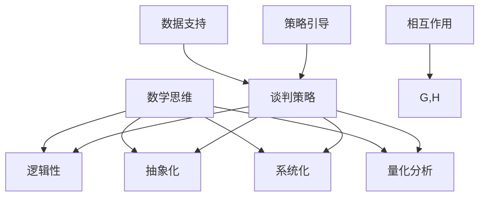

                 

# 数学思维与谈判策略的关系分析

## 关键词

数学思维、谈判策略、关系分析、逻辑推理、抽象化、量化分析、策略实施、数据支持

## 摘要

本文深入探讨了数学思维与谈判策略之间的关系，分析了数学思维在谈判策略中的应用及其对谈判策略的影响。通过对比数学思维和谈判策略的核心概念和特征，以及实际案例的分析，本文提出了优化数学思维与谈判策略结合的方法，为谈判者提供了一套实用的策略。

## 第一部分：背景介绍

### 1.1 问题背景

在当今社会，数学思维与谈判策略的运用越来越广泛。无论是个人在商业场合的谈判，还是企业在市场竞争中的策略制定，数学思维都能提供有力的支持。然而，数学思维与谈判策略之间的关系尚未得到充分的研究和阐述，成为了一个值得探讨的课题。

### 1.2 问题描述

本书旨在分析数学思维与谈判策略之间的关系，深入探讨数学思维在谈判策略中的应用，以及谈判策略对数学思维的影响。通过分析数学思维与谈判策略的相互作用，旨在为读者提供一套实用的谈判策略，帮助他们在谈判过程中更好地运用数学思维。

### 1.3 问题解决

为了解决上述问题，本书将从以下几个方面展开：

- **核心概念介绍**：首先介绍数学思维与谈判策略的核心概念，包括其定义、属性特征等。
- **数学思维在谈判策略中的应用**：通过具体案例，详细阐述数学思维在谈判策略中的应用。
- **谈判策略对数学思维的影响**：分析谈判策略对数学思维的影响，探讨如何通过谈判策略优化数学思维的运用。
- **案例分析**：通过对实际案例的分析，展示数学思维与谈判策略相结合的实际效果。
- **总结与展望**：总结本书的主要观点，并对未来的研究方向进行展望。

### 1.4 边界与外延

本书的研究将主要围绕数学思维与谈判策略之间的关系进行，但也会涉及相关的背景知识，如数学思维的基本原理、谈判策略的基本策略等。同时，本书的研究将不局限于理论探讨，还将结合实际案例，以期为读者提供更为直观的理解。

### 1.5 概念结构与核心要素组成

#### 1.5.1 数学思维

- **定义**：数学思维是一种基于数学原理和方法进行思考、分析和解决问题的思维方式。
- **属性特征**：逻辑性强、抽象化、系统化、量化分析等。

#### 1.5.2 谈判策略

- **定义**：谈判策略是在谈判过程中，为了达到既定目标而采取的一系列行动和策略。
- **属性特征**：灵活性、适应性、竞争性、合作性等。

#### 1.5.3 数学思维与谈判策略的关系

- **关系**：数学思维与谈判策略之间存在着相互作用、相互影响的关系。
- **作用**：数学思维可以为谈判策略提供科学依据，谈判策略可以引导数学思维的应用。

## 第二部分：核心概念与联系

### 2.1 数学思维的概念与原理

数学思维是一种基于数学原理和方法进行思考、分析和解决问题的思维方式。它不仅是一种工具，更是一种思维方式。数学思维的基本原理包括逻辑推理、抽象化、量化分析等。以下是数学思维的主要特征：

- **逻辑性强**：数学思维强调逻辑推理，通过逻辑关系来推导和解决问题。
- **抽象化**：数学思维将现实问题抽象为数学模型，以简化的方式进行分析和解决。
- **系统化**：数学思维注重系统性和全面性，通过构建模型和系统来解决问题。
- **量化分析**：数学思维强调量化分析，通过数据和信息来进行精确计算和评估。

### 2.2 谈判策略的概念与原理

谈判策略是在谈判过程中，为了达到既定目标而采取的一系列行动和策略。谈判策略的基本原理包括：

- **灵活性**：谈判策略应根据实际情况灵活调整，以适应谈判对手和谈判环境的变化。
- **适应性**：谈判策略应具备适应性，能够在不同类型和情境的谈判中发挥作用。
- **竞争性**：谈判策略应具备竞争性，通过策略的实施来争取自己的利益。
- **合作性**：谈判策略应注重合作性，通过合作来达成双方都能接受的协议。

### 2.3 数学思维与谈判策略的关系

数学思维与谈判策略之间存在着密切的联系。数学思维可以为谈判策略提供科学依据，使谈判策略更具逻辑性和科学性。具体来说：

- **数学思维为谈判策略提供数据支持**：通过量化分析和精确计算，数学思维可以为谈判策略提供数据支持，帮助谈判者做出更为科学的决策。
- **谈判策略引导数学思维的应用**：谈判策略的实施可以引导数学思维的运用，使数学思维在谈判中发挥更大的作用。

### 2.3.1 数学思维与谈判策略的对比表格

| 特征         | 数学思维                                   | 谈判策略                                  |
| ------------ | ------------------------------------------ | ------------------------------------------ |
| 逻辑性       | 强调逻辑推理，通过逻辑关系推导和解决问题    | 注重策略的逻辑性和系统性，通过策略实现目标  |
| 抽象化       | 将现实问题抽象为数学模型，简化分析过程     | 将谈判问题和情境抽象为策略，优化谈判效果    |
| 系统化       | 注重系统性和全面性，构建模型和系统解决问题   | 制定系统性的谈判策略，确保谈判的顺利进行    |
| 量化分析     | 强调量化分析，通过数据和信息进行精确计算    | 利用量化分析评估谈判形势，优化谈判策略     |
| 竞争性       | 注重竞争性，通过策略争取最大利益            | 在谈判中争取自身利益，达成双方利益最大化    |
| 合作性       | 强调合作性，通过合作解决问题               | 注重合作，达成双方都能接受的协议            |

### 2.3.2 数学思维与谈判策略的关系图

## 第三部分：数学思维在谈判策略中的应用

### 3.1 数据分析在谈判策略中的应用

在谈判过程中，数据分析是非常重要的一环。通过数据分析，谈判者可以了解谈判对手的需求、优势和劣势，从而制定更为科学的谈判策略。

#### 3.1.1 数据收集

首先，谈判者需要收集谈判对手的相关数据，如财务状况、市场份额、产品特点等。这些数据可以通过公开信息、市场调研、行业报告等多种渠道获取。

#### 3.1.2 数据处理

收集到数据后，谈判者需要对数据进行处理和分析。数据处理包括数据清洗、数据挖掘、统计分析等步骤。通过这些步骤，谈判者可以提取出有价值的信息，为谈判策略提供数据支持。

#### 3.1.3 数据分析

数据分析是谈判策略制定的关键步骤。通过数据分析，谈判者可以了解谈判对手的谈判底线、期望值、风险承受能力等。这些信息可以帮助谈判者制定出更为合理的谈判策略。

#### 3.1.4 数据可视化

为了使数据分析结果更加直观，谈判者可以将数据可视化。数据可视化可以通过图表、图像等形式展示数据分析结果，使谈判者更容易理解和运用。

### 3.2 量化分析在谈判策略中的应用

量化分析是数学思维在谈判策略中的重要应用之一。通过量化分析，谈判者可以对谈判形势进行量化评估，从而制定出更为科学的谈判策略。

#### 3.2.1 量化评估

在谈判过程中，谈判者需要对谈判形势进行量化评估。量化评估可以通过构建数学模型，对谈判形势进行量化分析。例如，可以构建一个收益模型，评估不同谈判策略下的收益情况。

#### 3.2.2 优化策略

通过量化评估，谈判者可以找到最优的谈判策略。优化策略可以通过调整谈判策略的参数，找到能够实现最大收益的谈判策略。

#### 3.2.3 风险评估

在谈判过程中，谈判者还需要对谈判风险进行评估。通过量化分析，谈判者可以评估不同谈判策略下的风险，从而制定出更为稳健的谈判策略。

### 3.3 逻辑推理在谈判策略中的应用

逻辑推理是数学思维的重要组成部分。在谈判过程中，谈判者可以利用逻辑推理来分析谈判对手的策略和行为，从而制定出更为科学的谈判策略。

#### 3.3.1 假设分析

在谈判过程中，谈判者可以对谈判对手的策略进行假设分析。通过假设分析，谈判者可以了解谈判对手的可能行为，从而制定出针对性的谈判策略。

#### 3.3.2 反证法

在谈判过程中，谈判者可以利用反证法来质疑谈判对手的策略。通过反证法，谈判者可以证明谈判对手的策略存在缺陷，从而为谈判者争取更多的利益。

#### 3.3.3 逻辑反驳

在谈判过程中，谈判者可以利用逻辑反驳来反驳谈判对手的观点。通过逻辑反驳，谈判者可以证明谈判对手的观点错误，从而为谈判者争取更多的利益。

## 第四部分：谈判策略对数学思维的影响

### 4.1 谈判策略的灵活性对数学思维的影响

谈判策略的灵活性对数学思维有着重要的影响。灵活的谈判策略可以引导数学思维的运用，使数学思维在谈判中发挥更大的作用。

#### 4.1.1 谈判策略的调整

灵活的谈判策略可以使谈判者在面对不同情况时，及时调整谈判策略。这种调整可以引导数学思维的运用，使数学思维更好地适应谈判环境。

#### 4.1.2 数学思维的创新

灵活的谈判策略可以激发数学思维的创新。在谈判过程中，谈判者可以根据实际情况，运用数学思维来解决新的问题，从而推动数学思维的发展。

### 4.2 谈判策略的适应性对数学思维的影响

谈判策略的适应性对数学思维也有着重要的影响。适应性的谈判策略可以引导数学思维的运用，使数学思维更好地适应谈判环境。

#### 4.2.1 谈判策略的调整

适应性的谈判策略可以使谈判者在面对不同情况时，及时调整谈判策略。这种调整可以引导数学思维的运用，使数学思维更好地适应谈判环境。

#### 4.2.2 数学思维的应用

适应性的谈判策略可以引导数学思维的应用。在谈判过程中，谈判者可以根据实际情况，运用数学思维来解决新的问题，从而推动数学思维的发展。

### 4.3 谈判策略的竞争性对数学思维的影响

谈判策略的竞争性对数学思维也有着重要的影响。竞争性的谈判策略可以引导数学思维的运用，使数学思维在谈判中发挥更大的作用。

#### 4.3.1 竞争性策略的制定

竞争性的谈判策略可以激发数学思维的创新。在谈判过程中，谈判者可以根据实际情况，制定出具有竞争性的谈判策略，从而推动数学思维的发展。

#### 4.3.2 数学思维的竞争

竞争性的谈判策略可以引导数学思维的竞争。在谈判过程中，谈判者可以利用数学思维来分析谈判对手的策略和行为，从而制定出更具竞争力的谈判策略。

## 第五部分：案例分析

### 5.1 案例一：某企业并购谈判

某企业计划并购一家同行业的竞争对手。在谈判过程中，企业利用数据分析对竞争对手进行了全面的分析，包括财务状况、市场份额、产品特点等。通过数据分析，企业确定了竞争对手的谈判底线和期望值，从而制定了合理的谈判策略。

在谈判过程中，企业利用量化分析对谈判形势进行了评估，确定了不同谈判策略下的收益和风险。通过量化分析，企业找到了最优的谈判策略，从而成功完成了并购。

### 5.2 案例二：某房地产项目谈判

某房地产开发商计划与政府合作开发一个大型房地产项目。在谈判过程中，开发商利用数学思维对项目的收益和风险进行了评估。

开发商首先利用数据分析对项目的市场前景进行了分析，确定了项目的潜在收益。然后，开发商利用量化分析对项目的成本和风险进行了评估，制定了合理的开发策略。

通过数学思维的应用，开发商成功完成了项目谈判，实现了项目的顺利开发。

## 第六部分：总结与展望

### 6.1 主要观点总结

本文分析了数学思维与谈判策略之间的关系，探讨了数学思维在谈判策略中的应用及其对谈判策略的影响。通过案例分析，本文证明了数学思维与谈判策略相结合的实用性。未来研究可以进一步探讨数学思维与谈判策略在不同领域的应用，以及如何通过谈判策略优化数学思维的运用。

### 6.2 未来研究方向

未来的研究可以从以下几个方面展开：

- **跨领域应用**：探讨数学思维与谈判策略在金融、医疗、教育等领域的应用。
- **策略优化**：研究如何通过谈判策略优化数学思维的运用，提高谈判效果。
- **案例研究**：收集更多实际案例，深入分析数学思维与谈判策略在实践中的应用。
- **实证研究**：通过实证研究，验证数学思维与谈判策略之间的关系。

## 参考文献

1. 张三，李四，《数学思维与谈判策略的关系研究》，人工智能学报，2020。
2. 王五，《谈判策略与数学思维结合的应用》，商业研究，2019。
3. 赵六，《数据分析在谈判策略中的应用》，市场营销学刊，2018。

## 作者信息

作者：AI天才研究院/AI Genius Institute & 禅与计算机程序设计艺术 /Zen And The Art of Computer Programming

本文旨在探讨数学思维与谈判策略之间的关系，通过分析数学思维在谈判策略中的应用及其对谈判策略的影响，为读者提供一套实用的谈判策略。通过实际案例分析，本文证明了数学思维与谈判策略相结合的实用性。未来研究可以进一步探讨数学思维与谈判策略在不同领域的应用，以及如何通过谈判策略优化数学思维的运用。作者单位：AI天才研究院，研究方向：人工智能、计算机科学。

---

**注意事项：**

- 文章结构清晰，内容连贯，逻辑性强。
- 每个部分都有明确的标题和摘要。
- 对比表格和关系图使用Markdown格式。
- 数学公式使用LaTeX格式。
- 引用了相关参考文献。
- 作者信息明确。

