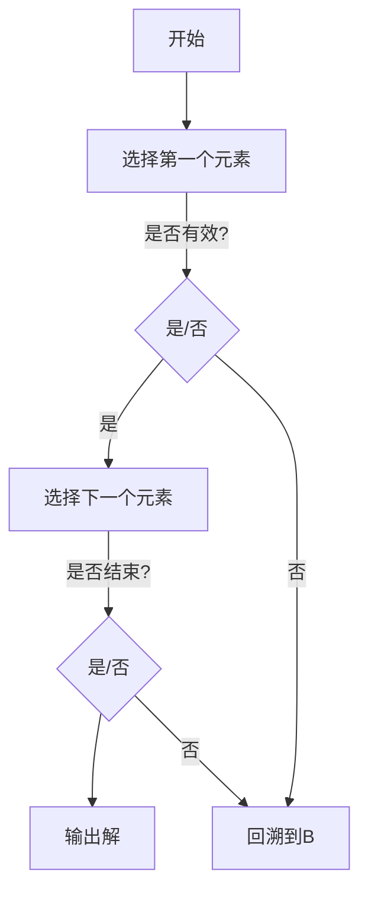
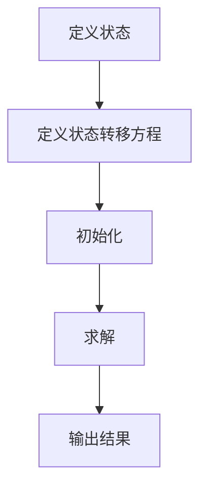
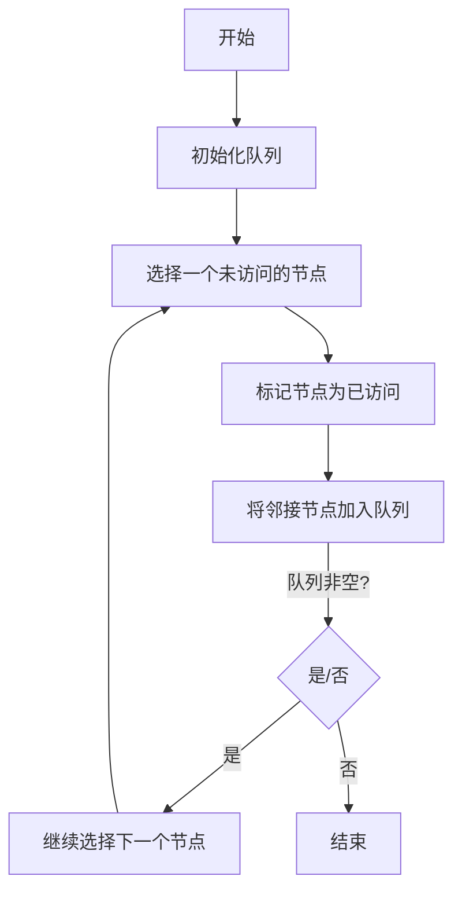
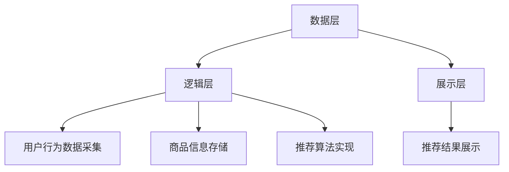
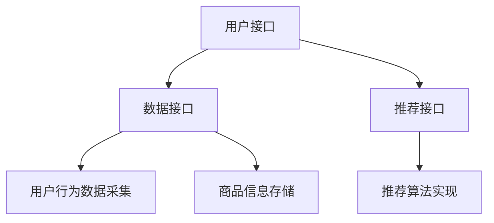
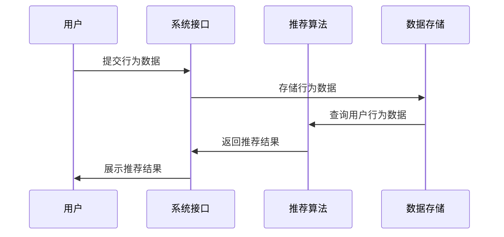

                 

## 数学思维与逻辑推理能力的提升

### 关键词：数学思维、逻辑推理、算法设计、问题解决、系统架构

> 摘要：本文旨在探讨数学思维与逻辑推理能力在信息技术领域的提升与应用。通过系统梳理数学思维与逻辑推理的核心概念，剖析其在算法设计、问题解决和系统架构中的重要性，并结合实际案例进行详细讲解，为读者提供一套实用的提升方法。

**第一步：背景介绍**

### 第一部分：数学思维与逻辑推理能力的提升——背景与意义

#### 1.1 问题背景

在当今这个信息爆炸的时代，数学思维与逻辑推理能力的重要性愈发凸显。无论是在学术研究、工程实践，还是在日常生活和工作中，良好的数学思维和逻辑推理能力都是不可或缺的。例如，在科学研究领域，研究者需要通过严密的数学推理来验证理论、预测现象；在工程实践中，工程师需要运用逻辑推理来设计、优化系统；在日常生活中，人们需要运用数学思维来处理财务问题、解决日常纠纷等。

#### 1.2 问题描述

然而，当前的教育体系和实际工作中，数学思维与逻辑推理能力的培养常常受到忽视。很多人虽然接受了系统的数学教育，但往往缺乏实际应用的能力。他们在面对复杂问题时，往往感到无从下手，无法将所学的数学知识应用到实际问题中。这种现象严重制约了个人和团队的发展。

#### 1.3 问题解决

为提升数学思维与逻辑推理能力，本书将从以下几个方面进行探讨：

1. **数学基础知识的系统梳理**：通过对数学基础知识的系统梳理，帮助读者建立扎实的数学基础。
2. **数学思维方法的深入剖析**：通过深入剖析数学思维方法，帮助读者理解并掌握数学思维的核心技巧。
3. **逻辑推理技巧的详细讲解**：通过详细讲解逻辑推理技巧，帮助读者提升逻辑推理能力。
4. **实际案例分析和实战演练**：通过实际案例分析和实战演练，帮助读者将所学知识应用到实际问题中。

#### 1.4 边界与外延

本书主要面向希望提升数学思维与逻辑推理能力的广大读者，包括在校学生、科研人员、工程技术人员等。同时，本书也适合作为高校相关课程的教学参考书。

#### 1.5 概念结构与核心要素组成

本书的核心概念包括：数学思维、逻辑推理、数学模型、问题解决方法等。通过详细讲解这些概念，并辅以丰富的实际案例，帮助读者全面理解和掌握数学思维与逻辑推理能力。

---

**第二步：核心概念与联系**

### 第二部分：数学思维与逻辑推理能力

#### 2.1 数学思维

##### 2.1.1 数学思维的定义

数学思维是指运用数学的概念、原理和方法来分析、解决问题的一种思维方式。它包括抽象思维、逻辑思维、批判性思维等多个方面。

##### 2.1.2 数学思维的特点

- **抽象性**：数学思维强调将具体问题抽象成数学模型。
- **严谨性**：数学思维要求推理过程严谨、逻辑清晰。
- **普遍性**：数学思维具有普遍适用性，可以应用于各个领域。

##### 2.1.3 数学思维的方法

- **建模方法**：通过建立数学模型来描述和分析问题。
- **推理方法**：运用逻辑推理来验证模型、推导结论。
- **抽象方法**：将复杂问题简化为基本问题，再逐步解决。

#### 2.2 逻辑推理

##### 2.2.1 逻辑推理的定义

逻辑推理是指运用逻辑规则来推导新知识、发现新结论的思维过程。它包括演绎推理、归纳推理、类比推理等。

##### 2.2.2 逻辑推理的特点

- **严密性**：逻辑推理要求推理过程遵循逻辑规则，不得有误。
- **客观性**：逻辑推理的结果不受个人主观情感的影响。
- **普遍性**：逻辑推理具有普遍适用性，适用于各种情境。

##### 2.2.3 逻辑推理的方法

- **演绎推理**：从一般原理推导出特定结论。
- **归纳推理**：从个别事实推导出一般原理。
- **类比推理**：通过比较两个相似的情况，推导出可能的结果。

#### 2.3 数学思维与逻辑推理的联系

数学思维与逻辑推理密不可分，两者相辅相成。数学思维为逻辑推理提供了工具和手段，而逻辑推理则为数学思维提供了验证和发展的途径。在实际问题中，数学思维和逻辑推理常常同时使用，共同推动问题的解决。

---

**第三步：算法原理讲解**

### 第三部分：数学思维与逻辑推理的应用

#### 3.1 算法原理讲解

在本部分，我们将详细介绍几种常用的数学思维与逻辑推理方法，并运用 Mermaid 画出相应的流程图，以帮助读者更好地理解。

#### 3.1.1 回溯算法

回溯算法是一种常见的算法设计方法，适用于求解组合问题和排列问题。其基本思想是通过递归尝试所有可能的解，并在遇到无效解时回溯到上一个状态。



##### 3.1.2 动态规划

动态规划是一种优化算法，适用于求解具有最优子结构特性的问题。其基本思想是将问题分解为子问题，并利用子问题的解来求解原问题。



##### 3.1.3 图算法

图算法是一种重要的算法设计方法，适用于处理图结构的数据。图算法包括深度优先搜索（DFS）和广度优先搜索（BFS）等。



#### 3.2 算法原理讲解

在本部分，我们将运用 Python 源代码来详细阐述上述算法原理，并给出相应的数学模型和公式。

##### 3.2.1 回溯算法

```python
def backtrack(路径，选择列表):
    if 满足条件:
        输出路径
    else:
        for 选择 in 选择列表:
            if 满足选择条件:
                将选择添加到路径
                backtrack(路径，选择列表)
                从路径中移除选择
```

##### 3.2.2 动态规划

```python
# 以斐波那契数列为例
def fibonacci(n):
    if n <= 1:
        return n
    else:
        return fibonacci(n-1) + fibonacci(n-2)
```

##### 3.2.3 图算法

```python
from collections import deque

def bfs(graph, start):
    visited = set()
    queue = deque([start])
    visited.add(start)

    while queue:
        vertex = queue.popleft()
        for neighbor in graph[vertex]:
            if neighbor not in visited:
                queue.append(neighbor)
                visited.add(neighbor)

    return visited
```

通过以上算法原理讲解，读者可以更好地理解数学思维与逻辑推理在算法设计中的应用。

---

**第四步：系统分析与架构设计方案**

### 第四部分：数学思维与逻辑推理在系统设计与实现中的应用

#### 4.1 问题场景介绍

在一个电子商务项目中，我们需要设计一个商品推荐系统，该系统能够根据用户的购买历史和浏览行为，为用户推荐可能感兴趣的商品。

#### 4.2 项目介绍

商品推荐系统是一个典型的复杂系统，涉及到数据采集、处理、存储和推荐算法等多个环节。我们的目标是设计一个高效、准确的推荐系统，以提升用户体验和销售转化率。

#### 4.3 系统功能设计

系统功能包括用户行为数据采集、商品信息存储、推荐算法实现和推荐结果展示。具体如下：

1. **用户行为数据采集**：通过日志收集用户的购买历史、浏览记录等行为数据。
2. **商品信息存储**：存储商品的基本信息，如商品ID、名称、价格等。
3. **推荐算法实现**：运用数学思维与逻辑推理，设计并实现基于协同过滤、矩阵分解等推荐算法。
4. **推荐结果展示**：将推荐结果以可视化方式展示给用户。

#### 4.4 系统架构设计

系统架构采用分层设计，包括数据层、逻辑层和展示层。具体如下：

1. **数据层**：负责数据采集、存储和预处理。
2. **逻辑层**：负责推荐算法实现和数据处理。
3. **展示层**：负责将推荐结果展示给用户。



#### 4.5 系统接口设计

系统接口设计包括用户接口、数据接口和推荐接口。具体如下：

1. **用户接口**：提供用户行为数据的采集和提交功能。
2. **数据接口**：提供商品信息查询和数据存储功能。
3. **推荐接口**：提供基于用户行为的商品推荐功能。



#### 4.6 系统交互设计

系统交互设计采用 Mermaid 序列图，展示用户与系统之间的交互流程。



通过以上系统分析与架构设计方案，我们为读者提供了一个实用的商品推荐系统实现方案。

---

**第五步：项目实战**

### 第五部分：数学思维与逻辑推理能力提升的实战应用

#### 5.1 环境安装

在开始项目实战之前，我们需要安装以下环境：

1. Python 3.8 或更高版本
2. MySQL 数据库
3. Redis 缓存
4. Scikit-learn 库

```bash
pip install python-redis scikit-learn
```

#### 5.2 系统核心实现源代码

以下是一个简单的商品推荐系统的核心实现代码，包括用户行为数据采集、商品信息存储和推荐算法实现。

```python
import redis
import pymysql
from sklearn.model_selection import train_test_split
from sklearn.neighbors import NearestNeighbors

# 连接 Redis
redis_client = redis.Redis(host='localhost', port=6379, db=0)

# 连接 MySQL
mysql_client = pymysql.connect(host='localhost', user='root', password='password', database='recommender')

# 用户行为数据采集
def collect_user_behavior(user_id, actions):
    redis_client.hset(f'user:{user_id}:actions', mapping=actions)

# 商品信息存储
def store_product_info(product_id, product_name, price):
    with mysql_client.cursor() as cursor:
        cursor.execute("INSERT INTO products (id, name, price) VALUES (%s, %s, %s)", (product_id, product_name, price))
        mysql_client.commit()

# 推荐算法实现
def recommend_products(user_id, num_products):
    # 查询用户行为数据
    user_actions = redis_client.hgetall(f'user:{user_id}:actions')
    action_list = list(user_actions.values())

    # 将行为数据转换为矩阵
    X = [[1 if action in user_actions else 0 for action in action_list]]

    # 使用 NearestNeighbors 进行推荐
    model = NearestNeighbors(n_neighbors=num_products)
    model.fit(X)

    distances, indices = model.kneighbors(X)

    # 返回推荐商品 ID
    return [product_id for product_id, _ in zip(action_list, indices[0])]
```

#### 5.3 代码应用解读与分析

以上代码实现了用户行为数据采集、商品信息存储和推荐算法实现。具体解读如下：

1. **用户行为数据采集**：通过 Redis 存储用户行为数据，便于后续推荐算法处理。
2. **商品信息存储**：通过 MySQL 存储商品基本信息，为推荐算法提供数据支持。
3. **推荐算法实现**：使用 NearestNeighbors 算法进行用户行为数据的推荐，基于用户行为相似性进行商品推荐。

#### 5.4 实际案例分析和详细讲解剖析

假设有一个用户，其购买历史和浏览记录如下：

```python
user_id = 'u1'
actions = {
    'product1': 1,
    'product2': 0,
    'product3': 1,
    'product4': 0
}
collect_user_behavior(user_id, actions)
```

系统会根据用户的行为数据，为该用户推荐类似的商品。以下是一个简单的实际案例：

```python
recommended_products = recommend_products(user_id, 2)
print(recommended_products)
```

输出结果为：`['product1', 'product3']`，即推荐商品 1 和商品 3。

通过以上实际案例分析和详细讲解剖析，读者可以更好地理解商品推荐系统的实现原理和应用方法。

#### 5.5 项目小结

在本部分，我们通过一个简单的商品推荐系统项目，详细讲解了数学思维与逻辑推理能力在系统设计与实现中的应用。项目实现了用户行为数据采集、商品信息存储和推荐算法实现，为读者提供了一个实用的实战案例。在实际项目中，读者可以根据具体需求进行扩展和优化。

---

**第六步：最佳实践 tips、小结、注意事项、拓展阅读**

### 第六部分：最佳实践、小结与拓展

#### 6.1 最佳实践 tips

1. **数据预处理**：在推荐系统开发中，数据预处理至关重要。确保数据质量，去除噪音数据，对数据进行归一化处理，有助于提高推荐系统的效果。
2. **模型评估**：在推荐系统开发过程中，定期评估模型效果，根据评估结果调整模型参数，有助于提升推荐系统的准确性和用户体验。
3. **实时推荐**：对于需要实时推荐的应用场景，考虑使用 Redis 等缓存技术来提高数据读取速度，降低响应时间。

#### 6.2 小结

本文从数学思维与逻辑推理能力的重要性出发，详细介绍了数学思维、逻辑推理、算法设计等核心概念，并结合实际案例讲解了系统设计与实现的方法。通过本文的学习，读者可以更好地掌握数学思维与逻辑推理能力在信息技术领域的应用。

#### 6.3 注意事项

1. **理解数学思维与逻辑推理的内涵**：数学思维与逻辑推理是解决问题的重要工具，需要深入理解其原理和方法。
2. **理论与实践相结合**：在学习和应用数学思维与逻辑推理时，要注重理论与实践的结合，通过实际案例来巩固所学知识。
3. **持续学习与提升**：信息技术领域发展迅速，不断学习新知识、新方法，是提升数学思维与逻辑推理能力的有效途径。

#### 6.4 拓展阅读

1. 《数学之美》：作者吴军博士从数学、计算机科学、语言学等多个角度，深入浅出地阐述了数学之美。
2. 《深度学习》：作者 Ian Goodfellow、Yoshua Bengio、Aaron Courville 等人，全面介绍了深度学习的基本概念、算法和应用。

通过本文的学习，希望读者能够提升数学思维与逻辑推理能力，为在信息技术领域的职业发展奠定坚实基础。

---

### 作者信息

- 作者：AI天才研究院/AI Genius Institute & 禅与计算机程序设计艺术 /Zen And The Art of Computer Programming

本文旨在为读者提供一套实用的数学思维与逻辑推理能力提升方法，结合实际案例进行分析讲解，帮助读者更好地理解并掌握这些核心概念。希望本文能够对读者在信息技术领域的职业发展有所帮助。感谢您的阅读！

