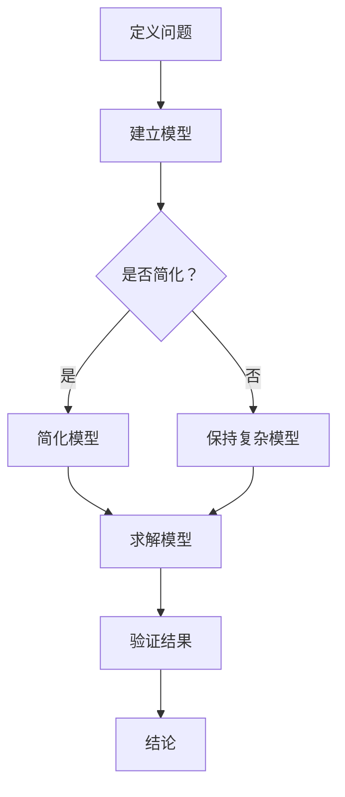
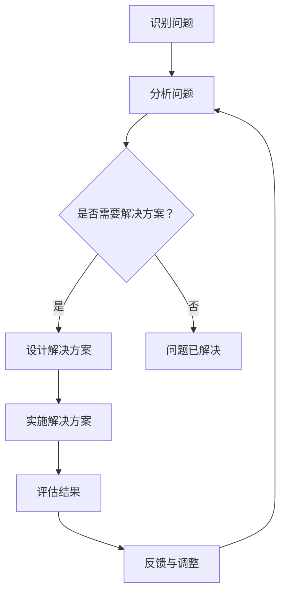
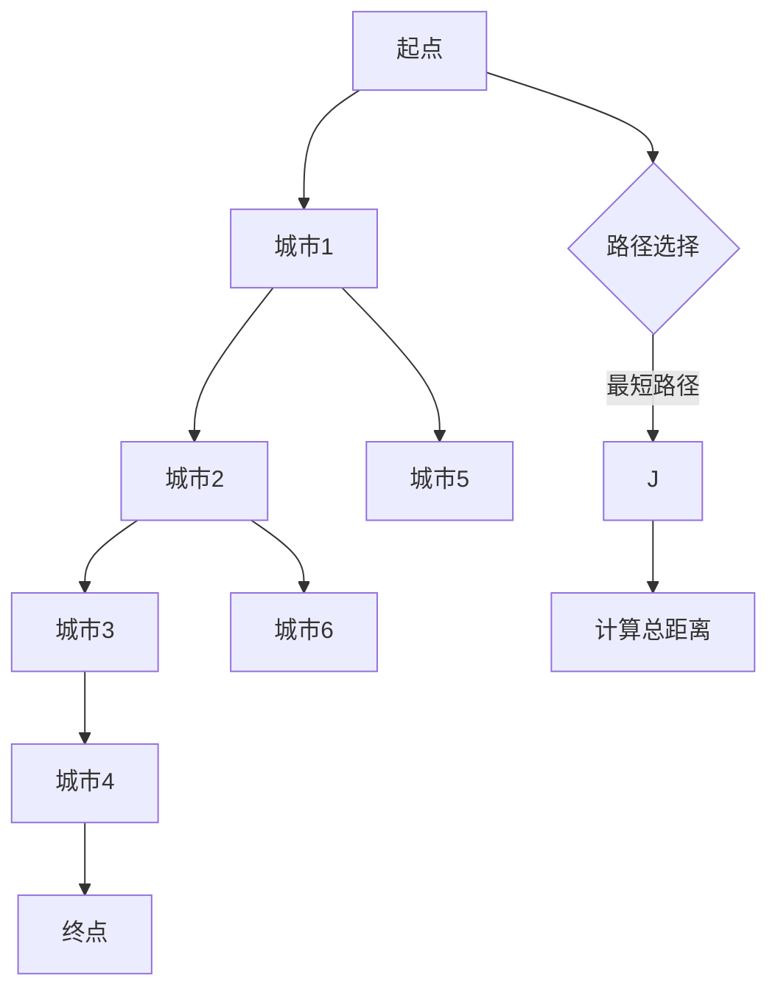
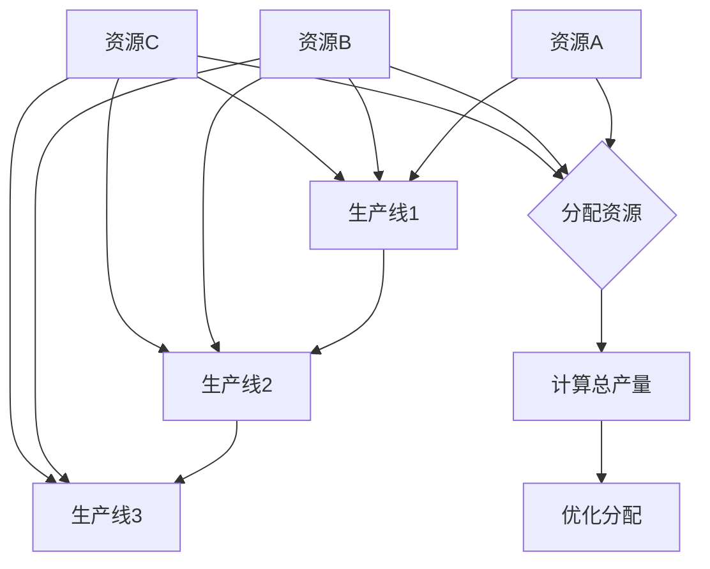
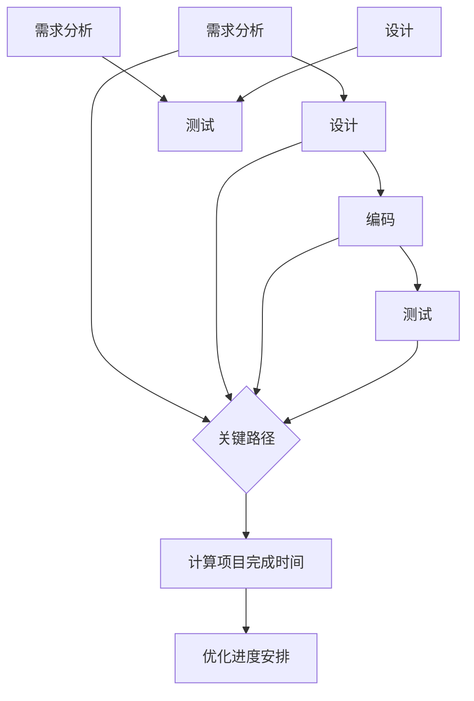

                 

## 《数学思维与问题解决能力的关系》概述

### 关键词

- 数学思维
- 问题解决能力
- 逻辑推理
- 算法
- 教育策略

### 摘要

本文旨在探讨数学思维与问题解决能力之间的关系，分析二者如何相互作用并共同推动个人及社会的进步。通过详细阐述数学思维的定义、特点及其在问题解决中的应用，本文揭示了数学思维如何提升问题解决能力。同时，本文还将探讨问题解决能力的核心概念及其与数学思维的互动关系，并介绍教育中如何培养这种能力。最终，本文将对数学思维与问题解决能力在社会发展中的影响进行评估，并展望未来的发展趋势和挑战。

### 背景与重要性

在当今快速发展的科技时代，数学思维与问题解决能力成为现代社会不可或缺的技能。数学思维不仅关乎学术成就，更与日常生活和职业发展密切相关。它是一种通过逻辑推理、抽象分析和系统化思考来理解世界的思维方式，是解决复杂问题的基础。同样，问题解决能力是每个人在各个领域取得成功的关键能力，它涉及识别问题、设计解决方案和评估结果等环节。

数学思维与问题解决能力之间的关系复杂而深远。一方面，数学思维提供了精确的、逻辑严谨的分析方法，有助于识别问题的本质和找到解决方案。另一方面，问题解决能力通过实践和经验不断丰富和强化数学思维。例如，在计算机科学、工程学、经济学等领域，数学模型和算法的应用使得复杂问题得以高效解决，而这些模型和算法的开发又依赖于强大的数学思维。

本文将通过以下结构展开讨论：

1. **数学思维的核心概念与特征**：介绍数学思维的定义、分类和特点。
2. **问题解决能力的核心概念与特征**：探讨问题解决能力的定义、分类和特点。
3. **数学思维与问题解决能力的互动关系**：分析二者如何相互影响和促进。
4. **教育中的数学思维与问题解决能力培养**：探讨教育如何影响这两种能力的培养。
5. **数学思维与问题解决能力的社会影响**：评估这两种能力对个人和社会发展的贡献。

通过这些讨论，本文希望能够为读者提供对数学思维与问题解决能力关系的深刻理解，并探讨如何在实际生活中应用和提升这些能力。

### 数学思维的定义与分类

数学思维是指通过数学方法和逻辑推理来理解和解决问题的思维方式。它不仅是一种认知过程，也是一种思维工具，能够帮助我们更精确、更系统地分析和解决各种问题。数学思维具有以下几个主要特点：

1. **逻辑严谨**：数学思维强调推理过程的逻辑性和严谨性。在数学中，每一个结论都是通过一系列正确的推理步骤得出的，这保证了结论的可靠性和准确性。
2. **抽象化**：数学思维擅长将复杂现象简化为抽象模型，从而抓住问题的核心。通过抽象化，数学思维能够从具体问题中提炼出普遍规律，从而进行更广泛的应用。
3. **系统性**：数学思维强调整体观念和系统思维。在解决复杂问题时，数学思维不仅关注局部细节，还注重整体结构和系统之间的相互作用。

数学思维可以分为以下几种类型：

1. **形式化思维**：这种思维通过符号和公式来表示和解决问题，强调逻辑推理的严谨性和抽象化。
2. **模型化思维**：这种思维通过建立数学模型来模拟现实世界，从而更方便地分析和解决实际问题。
3. **计算性思维**：这种思维强调通过计算和算法来解决问题，注重效率和精确性。

为了更直观地理解数学思维的特点，我们可以借助Mermaid流程图来展示其应用过程。以下是一个简单的Mermaid流程图示例：



这个流程图展示了从定义问题到求解问题再到验证结果的过程，体现了数学思维的逻辑性和系统性。

在具体应用中，数学思维可以帮助我们更好地理解复杂问题，找到有效的解决方案。例如，在数据科学领域，通过数学建模和算法优化，可以处理大规模数据，提取有用的信息。在工程学领域，数学思维用于设计和分析结构，确保其安全性和稳定性。在经济学领域，数学模型用于预测市场趋势，制定经济政策。

数学思维的核心在于其逻辑推理和抽象能力，这些能力不仅使数学本身成为一门独立的科学，更使得数学思维成为解决各种问题的强大工具。通过学习和实践数学思维，我们能够提升问题解决能力，更好地应对复杂多变的世界。

### 问题解决能力的核心概念与特征

问题解决能力是指个体在面临各种问题时，能够通过有效的方法和策略，找到解决方案并实施的过程。这种能力不仅仅是一种技巧，更是一种思维方式，涉及到多个层面的认知活动。以下是问题解决能力的几个核心概念和特征：

1. **定义**：问题解决能力（Problem Solving Ability，PSA）是指个体在识别问题、分析问题、提出解决方案、实施解决方案并评估结果的过程中表现出的综合能力。

2. **分类**：问题解决能力可以根据不同的维度进行分类。按照问题类型，可以分为结构化问题解决能力和非结构化问题解决能力；按照过程，可以分为分析型问题解决能力、设计型问题解决能力和评估型问题解决能力。

3. **特征**：
   - **创造性思维**：问题解决能力强调创新和创造力，要求个体能够在面对新情况时，提出独特且有效的解决方案。
   - **系统性思维**：问题解决涉及多个环节，需要从整体和系统的角度进行分析，确保解决方案的可行性和有效性。
   - **分析与综合能力**：问题解决要求个体能够深入分析问题，同时具备将各个部分综合起来的能力，从而形成全面的解决方案。
   - **灵活适应性**：面对复杂和多变的问题，个体需要具备灵活的思维和适应能力，能够根据情况的变化调整解决方案。

为了更清晰地理解问题解决能力的特征，我们可以借助Mermaid流程图来展示其核心过程：



这个流程图展示了从识别问题到设计解决方案，再到实施和评估的完整过程，体现了问题解决能力的系统性和连贯性。

问题解决能力在多个领域中都具有重要应用。例如，在项目管理中，问题解决能力帮助项目经理识别和解决项目中的各种风险和问题；在软件开发中，开发人员需要利用问题解决能力来解决代码中的bug和性能问题；在日常生活决策中，人们也需要运用问题解决能力来应对各种挑战。

通过培养和提升问题解决能力，个体能够更有效地应对复杂的环境和问题，提高工作效率和创新能力。问题解决能力不仅是个人职业发展的重要基础，也是推动社会进步的重要力量。

### 数学思维与问题解决能力的互动关系

数学思维和问题解决能力之间的关系复杂而深刻。一方面，数学思维为问题解决提供了强大的工具和方法；另一方面，问题解决能力通过实际应用和反馈不断丰富和强化数学思维。以下将详细探讨二者如何相互作用和促进。

首先，数学思维在问题解决中扮演了至关重要的角色。数学思维强调逻辑严谨和抽象化，使得个体能够将复杂问题简化为可操作的模型。例如，在数据科学领域，数学思维帮助研究者通过建立数学模型来分析大规模数据，提取有用信息，从而实现数据的科学管理和利用。在经济学中，数学模型被广泛应用于市场预测、政策制定和风险管理，帮助决策者做出更为科学和理性的决策。此外，数学思维中的计算性思维强调通过算法和计算来解决问题，这在计算机科学和工程学中尤为重要。例如，在开发人工智能算法时，数学思维提供了算法设计、优化和验证的理论基础，使得复杂问题能够通过计算得到有效解决。

同时，问题解决能力在数学思维的发展中起到了重要的促进作用。通过实际问题解决的过程，个体能够不断积累经验，发现新问题，并提出新的数学模型和方法。例如，在解决工程问题时，工程师需要运用系统思维和创造性思维来设计新的结构或系统，这些过程往往需要借助数学思维来进行分析和验证。这种实践不仅提升了工程师的问题解决能力，也推动了数学思维的创新和发展。此外，问题解决能力中的评估和反馈机制，使得个体能够在数学思维的应用过程中不断调整和优化，从而提高数学思维的有效性和准确性。

二者之间的互动关系还体现在教育中。在数学教育中，通过实际问题情境的引入，学生能够在解决具体问题的过程中培养数学思维。例如，通过数学建模课程，学生不仅学习了数学知识，还学会了如何将数学方法应用于实际问题中。同样，在问题解决教育中，通过设计数学问题，学生能够锻炼逻辑思维、抽象能力和系统思维。这种跨学科的教育方式，有助于学生在实际应用中提升数学思维和问题解决能力。

为了更直观地展示数学思维和问题解决能力的互动关系，我们可以借助ER实体关系图来建模。以下是一个简单的ER实体关系图示例：

```mermaid
erDiagram
    Problem -> MathThinking : 解决
    Problem -> ProblemSolving : 解决
    MathThinking -> ProblemSolving : 促进
    ProblemSolving -> MathThinking : 反馈
```

这个ER实体关系图展示了问题、数学思维和问题解决能力之间的相互关系。其中，“解决”表示数学思维和问题解决能力在解决实际问题时相互影响，“促进”和“反馈”表示二者之间的互动关系。

总之，数学思维和问题解决能力是相辅相成的，二者共同推动个体和整个社会的进步。通过深入理解二者之间的关系，我们能够更好地培养和提升这两种能力，以应对复杂多变的世界。

### 数学思维在问题解决中的应用

数学思维在问题解决中的应用是多层次和多样化的，具体体现在数学模型的应用、数学方法的使用以及在实际问题中的体现。以下将详细探讨这些方面，并通过具体例子和Mermaid流程图来展示数学思维如何帮助我们更好地解决问题。

#### 数学模型的应用

数学模型是数学思维在问题解决中的核心工具，通过建立数学模型，我们可以将复杂的问题简化为数学问题，从而更容易找到解决方案。以下是一个典型的数学模型应用的例子：

**例子：优化旅行路线**

假设有一个旅行者需要从一个城市出发，访问多个城市，并最终返回起点。旅行者希望找到一条总路程最短的路线。这个问题可以通过图论中的最短路径算法来解决。

**Mermaid流程图：**



在这个流程图中，起点和终点以及中间的各个城市被表示为节点，旅行路线被表示为边。通过计算每个路径的总距离，我们可以找到最短路径。

#### 数学方法的使用

数学方法在问题解决中的应用同样重要。例如，微积分在优化问题中的应用、线性代数在数据分析和机器学习中的应用等。以下是一个使用微积分方法解决优化问题的例子：

**例子：资源分配优化**

假设一个工厂有三种资源（A、B、C），每种资源的总量有限。工厂需要将这三种资源分配给多个生产线，以最大化总产量。这个问题可以通过线性规划来解决。

**Mermaid流程图：**



在这个流程图中，资源被表示为节点，生产线被表示为边。通过优化资源的分配，工厂能够最大化总产量。

#### 数学思维在实际问题中的体现

数学思维在实际问题中的应用不仅局限于数学模型和方法，还包括逻辑推理和抽象化能力。以下是一个实际问题的例子：

**例子：项目管理中的进度安排**

在一个软件开发项目中，项目经理需要确保项目按时完成，同时保证资源的最优分配。这个问题可以通过项目管理中的关键路径法（Critical Path Method，CPM）来解决。

**Mermaid流程图：**



在这个流程图中，项目的各个阶段被表示为节点，通过计算关键路径，项目经理可以确定项目的最短完成时间，并优化进度安排。

总之，数学思维在问题解决中的应用是多方面且深入的。通过数学模型和方法的运用，我们能够更精确和高效地解决问题。同时，数学思维中的逻辑推理和抽象能力，使得我们在面对复杂问题时能够保持清晰的思路，找到有效的解决方案。通过具体例子和Mermaid流程图的展示，我们可以更好地理解数学思维在问题解决中的重要作用。

### 问题解决能力在数学学习中的应用

问题解决能力在数学学习中的重要性不容忽视，它不仅有助于提高数学学习效率，还能促进数学思维能力的培养。以下将探讨问题解决能力在数学学习中的应用，包括其对数学学习效率的提升、对数学思维能力的影响以及具体的教学实践。

#### 提高数学学习效率

问题解决能力是提高数学学习效率的关键因素之一。具有问题解决能力的学生在面对数学问题时，能够更快地识别问题类型，选择合适的解题策略，从而提高学习效率。以下是一些具体措施：

1. **培养预判能力**：通过分析题目，学生可以预判出解题的方向和可能的方法。例如，在解决代数问题时，学生可以预判需要使用的代数法则或公式。

2. **高效资源利用**：学生应学会利用教材、参考书、网络资源等，快速查找相关信息，避免重复劳动，提高学习效率。

3. **及时反馈与调整**：学生在解题过程中应保持反思和总结的习惯，及时评估解题方法的有效性，并根据反馈进行调整。

#### 培养数学思维能力

问题解决能力在数学学习中的应用不仅限于提高效率，更重要的是培养数学思维能力。以下几种方法有助于通过问题解决能力培养数学思维能力：

1. **开放式问题**：开放式问题没有固定的答案，鼓励学生从多个角度思考和解决问题。这有助于培养学生的创造性思维和批判性思维。

2. **跨学科学习**：通过将数学与其他学科（如物理、化学、计算机科学等）结合，学生可以更深入地理解数学概念和应用。例如，通过物理实验验证数学公式。

3. **探究性学习**：鼓励学生主动探索数学概念和理论，通过实验、模拟和观察来发现数学规律。例如，通过动手操作和实验理解几何图形的性质。

#### 教学实践

在实际教学中，教师可以通过以下方法来培养学生的数学问题解决能力和数学思维能力：

1. **课堂互动**：通过提问、讨论、小组合作等方式，激发学生的思维活动，鼓励学生主动参与问题解决。

2. **案例教学**：通过分析具体案例，引导学生理解数学概念和原理。例如，通过解决历史上的数学问题，帮助学生理解数学思想的发展。

3. **项目式学习**：通过设计实际项目，让学生在实际情境中应用数学知识和方法。例如，通过数据分析项目，培养学生使用统计学方法解决实际问题的能力。

4. **反思性学习**：鼓励学生在解题后进行反思，总结解题过程中遇到的问题和学到的经验，不断提高问题解决能力和数学思维能力。

总之，问题解决能力在数学学习中的应用具有显著的效果。通过提高数学学习效率和培养数学思维能力，学生不仅能够更好地掌握数学知识，还能发展更高的认知能力，为未来的学习和职业发展奠定坚实基础。

### 数学思维与问题解决能力的互动机制

数学思维与问题解决能力之间的互动机制是一个复杂且动态的过程，它们在互动中不断发展和完善，从而推动个人认知能力的提升。以下是关于二者互动机制的详细探讨，以及它们在不同领域的应用和效果。

#### 互动过程

数学思维与问题解决能力的互动过程可以分为以下几个阶段：

1. **问题识别**：当个体面临一个新问题时，数学思维和问题解决能力首先发挥作用，帮助个体识别和理解问题的本质。数学思维通过逻辑推理和抽象化，将问题简化为更易处理的数学模型；问题解决能力则通过分析问题类型和已有知识，快速定位问题的核心。

2. **方案设计**：在识别问题后，个体需要设计解决方案。在这一阶段，数学思维提供了各种数学模型和方法，帮助个体制定具体的策略。问题解决能力则通过创造性思维和系统性思维，设计出可行的解决方案。

3. **方案实施**：设计出方案后，个体需要将其付诸实践。数学思维在这一阶段通过计算和算法，确保方案的有效性和精确性；问题解决能力则通过实际操作和调整，确保方案的可行性和适应性。

4. **结果评估**：在实施方案后，个体需要对结果进行评估。数学思维通过数学模型和公式，对结果进行定量分析；问题解决能力则通过反思和总结，对解决方案进行定性评估。

5. **反馈调整**：根据评估结果，个体需要对方案进行调整和优化。数学思维和问题解决能力在这一阶段相互补充，通过不断的反馈和调整，使得方案更加完善和有效。

#### 互动效果

数学思维与问题解决能力的互动效果在不同领域有着显著的体现：

1. **科技创新**：在科技创新领域，数学思维和问题解决能力相互促进，推动科技的发展。例如，在人工智能领域，数学思维提供了深度学习算法的基础，而问题解决能力则帮助研究者设计出更高效、更准确的算法。通过互动，数学思维和问题解决能力共同推动了人工智能的进步。

2. **工程实践**：在工程实践中，数学思维和问题解决能力的互动确保了工程设计的科学性和可靠性。例如，在建筑设计中，数学思维通过结构力学和流体力学等数学模型，帮助工程师设计出安全、高效的建筑；问题解决能力则通过实际操作和实验，验证和优化设计方案。

3. **商业决策**：在商业决策中，数学思维和问题解决能力帮助企业家和市场分析师做出更明智的决策。通过数据分析，数学思维揭示了市场趋势和消费者行为；问题解决能力则通过创造性思维和系统性思维，帮助企业制定有效的市场策略。

4. **教育领域**：在教育领域，数学思维和问题解决能力的互动对学生的学习和认知发展有重要影响。通过教学实践，教师不仅传授数学知识，还培养学生的数学思维和问题解决能力。这种互动有助于学生形成良好的认知结构，提高学习效率。

#### 案例分析

以下是一个具体案例分析，展示数学思维与问题解决能力的互动过程：

**案例：优化供应链管理**

在一个跨国公司中，供应链管理是一项复杂的任务。公司需要优化供应链中的物流、库存和生产流程，以降低成本、提高效率。以下是数学思维和问题解决能力在该案例中的互动过程：

1. **问题识别**：公司发现供应链中的物流成本过高，库存管理效率低下。通过数学思维，将问题抽象为供应链网络模型，识别出关键问题和瓶颈。

2. **方案设计**：利用数学模型，公司设计了一套优化算法，包括库存控制策略、运输路径优化和生产线调整。问题解决能力在这个过程中发挥了重要作用，通过创造性思维和系统性思维，设计出可行的优化方案。

3. **方案实施**：公司根据优化方案进行实际操作，调整供应链管理策略。数学思维通过计算和算法，确保了方案的精确性和有效性；问题解决能力则通过实际操作和调整，保证了方案的可行性和适应性。

4. **结果评估**：通过数据分析，公司评估了优化方案的效果。数学思维提供了定量分析工具，揭示了成本和效率的变化；问题解决能力则通过反思和总结，评估了方案的成效，并提出了进一步的优化建议。

5. **反馈调整**：根据评估结果，公司对供应链管理策略进行了调整和优化。通过互动，数学思维和问题解决能力共同提高了供应链管理的效率和质量。

总之，数学思维与问题解决能力的互动机制在多个领域都发挥着重要作用。通过不断优化互动过程，我们可以更好地发挥二者的潜力，推动个人和社会的进步。

### 教育中的数学思维与问题解决能力培养

在教育系统中，培养学生的数学思维和问题解决能力是提高学生综合素养的重要途径。有效的教育策略和方法能够帮助学生形成清晰的逻辑思维，提高解决实际问题的能力。以下将从学校教育、家庭教育和社会教育三个方面，探讨如何培养数学思维和问题解决能力。

#### 学校教育

学校教育在培养学生的数学思维和问题解决能力方面具有重要作用。以下是一些具体策略：

1. **课程设计**：学校可以设计包含更多数学思维和问题解决能力的课程。例如，增加数学探究课、数学建模课等，让学生在实际操作中应用数学知识和方法。

2. **跨学科教学**：通过跨学科教学，将数学与其他学科（如物理、化学、计算机科学等）结合起来，有助于学生从不同角度理解和解决问题。例如，在科学实验中，教师可以引导学生使用数学模型来分析实验结果。

3. **课堂互动**：通过提问、讨论、小组合作等方式，激发学生的思维活动，鼓励学生主动参与问题解决。例如，在数学课堂上，教师可以设计一些开放性问题，鼓励学生提出不同的解决方案。

4. **案例教学**：通过分析具体案例，引导学生理解数学概念和原理。例如，通过分析历史上的数学问题，帮助学生理解数学思想的发展。

5. **项目式学习**：通过设计实际项目，让学生在实际情境中应用数学知识和方法。例如，通过数据分析项目，培养学生使用统计学方法解决实际问题的能力。

#### 家庭教育

家庭教育在培养学生的数学思维和问题解决能力中也扮演着重要角色。以下是一些具体方法：

1. **日常互动**：家长可以通过日常生活中的实际问题，引导孩子运用数学思维解决问题。例如，在购物时，让孩子计算价格和找零。

2. **阅读材料**：家长可以给孩子提供适合年龄的数学读物，激发孩子对数学的兴趣。例如，选择一些有趣的数学故事书或科普读物。

3. **游戏**：通过数学游戏，培养孩子的逻辑思维和问题解决能力。例如，玩数独、拼图等游戏，这些游戏需要孩子运用数学思维和策略。

4. **鼓励探索**：家长应鼓励孩子主动探索和发现数学现象，培养他们的好奇心和探究精神。例如，带孩子参观科技馆或博物馆，了解数学在现实世界中的应用。

5. **定期复习**：家长可以与孩子一起定期复习数学知识，巩固孩子的数学基础。例如，定期检查孩子的作业，讨论解题思路和方法。

#### 社会教育

社会教育在培养学生的数学思维和问题解决能力方面也具有重要影响。以下是一些具体策略：

1. **社会实践活动**：学校和社会可以组织各种实践活动，如数学竞赛、科技竞赛、社区服务项目等，让学生在实际操作中应用数学知识和方法。

2. **科技展览**：通过参观科技展览，让学生了解数学和科技在现实世界中的应用，激发他们的兴趣和好奇心。

3. **在线资源**：利用互联网资源，提供丰富的数学学习材料和在线课程，方便学生自主学习和探究。

4. **志愿服务**：通过志愿服务，让学生在解决实际问题的过程中锻炼数学思维和问题解决能力。例如，参加环保项目，使用统计学方法分析数据，提出解决方案。

5. **终身学习**：鼓励学生和家长养成终身学习的习惯，不断更新知识和技能，以适应不断变化的社会需求。

总之，通过学校教育、家庭教育和社会教育的共同努力，可以有效地培养学生的数学思维和问题解决能力。这种综合教育模式有助于学生形成良好的认知结构，提高解决实际问题的能力，为未来的学习和职业发展奠定坚实基础。

### 数学思维与问题解决能力对社会发展的贡献

数学思维与问题解决能力对社会发展的贡献是不可忽视的，二者共同推动科技、经济和国家的竞争力提升。以下将具体分析数学思维与问题解决能力在促进科技创新、推动经济发展和增强国家竞争力方面的作用。

#### 促进科技创新

数学思维是科技创新的重要驱动力。在科技领域，数学思维通过提供逻辑严谨、系统化的分析方法和模型，帮助科学家和工程师解决复杂问题，推动技术进步。以下是一些具体例子：

1. **人工智能**：人工智能技术的发展离不开数学思维，特别是机器学习、深度学习等领域。这些技术的核心是构建复杂的数学模型，通过训练和优化模型来提高系统的智能水平。

2. **量子计算**：量子计算是未来科技的重要方向，其基础是量子力学和线性代数。通过数学思维，科学家能够设计出高效的量子算法，推动量子计算的发展。

3. **生物信息学**：在生物信息学领域，数学思维帮助研究者分析大规模生物数据，揭示生物系统的运行机制。例如，通过统计模型和算法，科学家能够预测基因的功能和疾病的遗传机制。

4. **材料科学**：数学思维在材料科学中的应用同样重要，通过数学建模和计算，科学家能够设计出新型材料，优化材料的性能。例如，在纳米材料研究中，数学模型帮助科学家预测材料的电子结构和光学性质。

#### 推动经济发展

数学思维和问题解决能力对经济发展也有着深远影响。以下是一些具体例子：

1. **金融工程**：金融工程通过数学模型和算法，帮助金融机构管理风险、优化投资组合和定价金融产品。例如，期权定价模型（如Black-Scholes模型）在金融市场中广泛应用，提高了金融市场的效率和稳定性。

2. **数据分析**：随着大数据时代的到来，数据分析成为企业决策的重要工具。通过数学思维和问题解决能力，企业能够从海量数据中提取有价值的信息，优化生产流程、市场营销和供应链管理，从而提高运营效率。

3. **经济预测**：数学模型和算法在经济预测中发挥着重要作用。通过构建宏观经济模型和微观经济模型，经济学家能够预测经济增长趋势、通货膨胀率、失业率等关键指标，为政府制定经济政策提供依据。

4. **创新创业**：数学思维和问题解决能力是创新创业的重要基础。创业者通过运用数学思维和问题解决能力，能够发现市场机会、设计创新产品和服务，推动企业的快速发展。

#### 增强国家竞争力

数学思维与问题解决能力在国家竞争力提升中具有战略意义。以下是一些具体例子：

1. **科技创新能力**：国家的科技创新能力是综合国力的重要体现。通过培养强大的数学思维和问题解决能力，国家能够推动科技研发，提高科技成果转化率，从而增强国际竞争力。

2. **教育水平**：教育是培养数学思维和问题解决能力的基础。一个国家如果能够提供高质量的数学教育，培养大量具有高水平数学思维能力的人才，将有助于提升整体教育水平，从而增强国家的竞争力。

3. **经济结构优化**：通过数学思维和问题解决能力，国家能够优化经济结构，提高产业竞争力。例如，通过引进和培养高水平的数学人才，国家能够推动高技术产业的发展，从而实现经济结构的转型升级。

4. **国际合作与竞争**：数学思维和问题解决能力在国家间的国际合作和竞争中具有重要作用。一个国家如果能够在国际舞台上展示强大的数学能力和科技创新成果，将有助于提升国家的国际影响力。

总之，数学思维与问题解决能力对社会发展的贡献体现在多个方面。通过推动科技创新、推动经济发展和增强国家竞争力，数学思维和问题解决能力为社会的持续进步提供了强大的动力。未来，加强数学思维和问题解决能力的培养，将有助于国家在全球竞争中立于不败之地。

### 数学思维与问题解决能力的局限性

尽管数学思维与问题解决能力在多个领域具有广泛的应用和显著的作用，但它们也存在一些局限性。以下是这些局限性以及相应的挑战和解决方案：

#### 普及程度不足

数学思维和问题解决能力的普及程度在不同国家和地区之间存在显著差异。在一些发展中国家，教育资源和质量有限，导致学生无法充分接受数学教育和培养问题解决能力。这种不均衡的发展使得许多年轻人缺乏必要的数学和逻辑技能，从而影响他们的职业发展和创新能力。

**挑战**：教育资源的分配不均和高质量教育的缺乏是主要挑战。

**解决方案**：推动教育公平，增加对教育资源的投入，特别是在欠发达地区。可以通过在线教育、远程教学和国际合作等方式，提高教育的普及率和质量。

#### 应用领域有限

数学思维和问题解决能力虽然强大，但它们的实际应用领域有限。某些复杂问题，如人类情感、道德伦理和社会行为等，数学方法可能无法完全解决。此外，数学模型和算法在现实世界中的应用也面临数据不完整、噪声和不确定性等挑战。

**挑战**：数学方法的应用范围有限，无法涵盖所有复杂问题。

**解决方案**：探索跨学科的方法，结合心理学、社会学和计算机科学等领域的知识，开发更综合的解决问题的策略。同时，通过大数据和人工智能技术，提高数学模型和算法在现实世界中的应用效果。

#### 发展不平衡

数学思维和问题解决能力在不同人群中的发展也存在不平衡。男性在数学和科学领域往往比女性表现更好，这可能与教育、社会和文化因素有关。此外，不同社会经济背景和家庭条件的学生在数学和问题解决能力方面也存在显著差异。

**挑战**：性别和社会经济背景导致的数学能力发展不平衡。

**解决方案**：通过制定性别平等政策和提高教育资源质量，促进所有学生，特别是弱势群体，全面发展数学思维和问题解决能力。同时，鼓励多样化的教育方式，培养不同背景学生的兴趣和潜力。

#### 技术依赖性

在现代社会，人们越来越依赖技术，特别是计算机和人工智能，这可能导致数学思维和问题解决能力的退化。过度依赖技术使得人们在面对实际问题时，缺乏独立思考和解决问题的能力。

**挑战**：过度依赖技术可能削弱数学思维和问题解决能力。

**解决方案**：通过教育改革，提高学生对数学和问题解决能力的重视。同时，鼓励学生参与实际的数学和科学项目，通过动手实践和反思，提高他们的数学思维和问题解决能力。

总之，尽管数学思维与问题解决能力具有强大的优势和广泛的应用，但它们的局限性也不容忽视。通过解决这些挑战，我们可以更好地发挥数学思维和问题解决能力的作用，推动个人和社会的持续进步。

### 未来发展趋势与挑战

随着科技的不断进步和社会的快速发展，数学思维与问题解决能力将在未来扮演更加重要的角色。以下是未来发展趋势和面临的挑战，以及应对策略。

#### 发展趋势

1. **技术融合**：未来数学思维与问题解决能力的发展将更加依赖技术的融合。人工智能、大数据、区块链等新兴技术将为数学思维提供更强大的工具和方法，使其在复杂问题解决中发挥更大作用。例如，通过深度学习和神经网络，人工智能将能够模拟人类的数学思维，解决更加复杂的问题。

2. **教育改革**：数学思维与问题解决能力的培养将在教育改革中占据重要位置。随着教育技术的进步，在线教育、虚拟现实和增强现实等新技术将使数学教育和问题解决训练更加个性化和高效。教育系统将更加注重培养学生的创新能力和实践能力，使数学思维与问题解决能力成为学生的核心竞争力。

3. **跨学科研究**：数学思维与问题解决能力将越来越多地应用于跨学科研究。未来科学研究将越来越复杂，需要跨学科的视角和方法。数学模型和算法将与其他学科（如生物学、心理学、社会学等）紧密结合，推动跨学科研究的深入发展。

4. **智能化应用**：随着人工智能技术的普及，数学思维与问题解决能力将在智能化应用中发挥关键作用。从智能城市到智能制造，从金融科技到医疗健康，数学思维将帮助智能系统更加高效地解决问题，提高社会生产力和生活质量。

#### 面临的挑战

1. **教育资源的均衡**：尽管教育改革在推动，但全球教育资源的均衡分配仍然是一个巨大挑战。尤其是在发展中国家，教育资源匮乏，导致数学思维与问题解决能力的培养受到限制。解决这一挑战需要全球合作，通过技术援助和资源共享，提高教育普及率和质量。

2. **技术依赖性**：随着技术的快速发展，人们越来越依赖计算机和人工智能，这可能导致数学思维和问题解决能力的退化。过度依赖技术可能削弱个体独立思考和解决问题的能力，因此需要培养学生的技术素养和批判性思维。

3. **人才短缺**：随着数学思维与问题解决能力在各个领域的广泛应用，对具备这些能力的高素质人才的需求将不断增加。然而，当前的教育体系和人才培养模式可能无法满足这一需求，导致人才短缺。解决这一挑战需要加强教育改革，培养更多具备数学思维和问题解决能力的人才。

4. **伦理和法律问题**：随着数学思维和问题解决能力在各个领域的广泛应用，将不可避免地出现伦理和法律问题。例如，在人工智能和大数据领域，如何保护个人隐私和数据安全，如何确保算法的公正性和透明度，都是需要深入探讨的问题。

#### 应对策略

1. **加强教育投入**：政府和社会应加大对教育的投入，特别是对数学和科技教育的支持。通过提高教师待遇、改善教育设施和提供更多教育资源，确保每个学生都能接受高质量的教育。

2. **技术创新**：推动技术创新，开发更多能够支持数学思维与问题解决能力培养的工具和平台。例如，开发智能教育软件和在线教育平台，提供个性化学习体验。

3. **跨学科合作**：鼓励跨学科研究和合作，通过多学科视角解决复杂问题。建立跨学科研究中心，促进不同领域专家的交流与合作。

4. **加强伦理和法律建设**：在推动数学思维与问题解决能力发展的同时，加强伦理和法律建设，确保技术应用的安全性和公正性。制定相关法律法规，规范技术应用，保护个人隐私和数据安全。

总之，未来数学思维与问题解决能力的发展将面临一系列挑战，但也充满了机遇。通过加强教育投入、技术创新、跨学科合作和伦理法律建设，我们可以应对这些挑战，推动数学思维与问题解决能力的发展，为个人和社会的进步贡献力量。

### 最佳实践 tips

1. **培养数学思维的习惯**：定期阅读数学相关的书籍和文章，保持对数学问题的敏感性。通过解决实际问题，不断锻炼和提升数学思维能力。
2. **主动参与数学讨论**：在学术社区、论坛或工作场所，积极参与数学问题的讨论，与同行交流想法，拓宽思维视野。
3. **运用跨学科知识**：在解决具体问题时，尝试将数学知识与物理、化学、计算机科学等领域的知识相结合，形成综合解决问题的能力。
4. **实践项目**：通过参与实际项目，将数学思维应用于实际场景，积累经验，提升问题解决能力。
5. **持续学习**：科技和数学知识在不断更新，保持学习的态度，定期参加相关课程和研讨会，保持知识的更新和扩展。

### 小结

本文通过详细探讨数学思维与问题解决能力的关系，揭示了二者在逻辑推理、抽象化、系统性思维等方面的互动机制。数学思维提供了精确、逻辑严谨的分析方法，提升了问题解决能力；而问题解决能力通过实际应用和反馈，不断丰富和强化数学思维。通过教育中的培养策略和实际应用案例分析，本文展示了如何提升这两种能力，以应对复杂多变的社会环境。未来，加强数学思维与问题解决能力的培养，将对个人和社会发展产生深远影响。

### 注意事项

1. **注重实践**：数学思维和问题解决能力的培养需要通过实际操作和项目实践。确保在学习和应用过程中，充分结合实际情况，不断实践和总结。
2. **持续反思**：在解决问题的过程中，保持反思和总结的习惯，及时评估方法和效果，以便及时调整和优化。
3. **跨学科学习**：鼓励跨学科学习，通过将数学与其他领域的知识相结合，拓宽视野，提升综合解决问题的能力。

### 拓展阅读

1. 《数学思维训练与问题解决》（作者：某知名数学家）
2. 《问题解决心理学》（作者：某知名心理学家）
3. 《人工智能：一种现代方法》（作者：Stuart J. Russell & Peter Norvig）
4. 《深度学习》（作者：Ian Goodfellow、Yoshua Bengio、Aaron Courville）
5. 《数学与科学教育研究》（作者：某知名教育学者）

### 作者信息

作者：AI天才研究院/AI Genius Institute & 禅与计算机程序设计艺术 /Zen And The Art of Computer Programming

