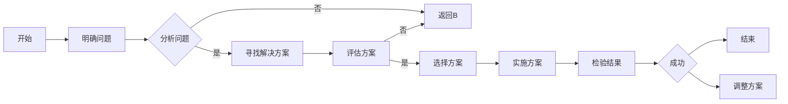
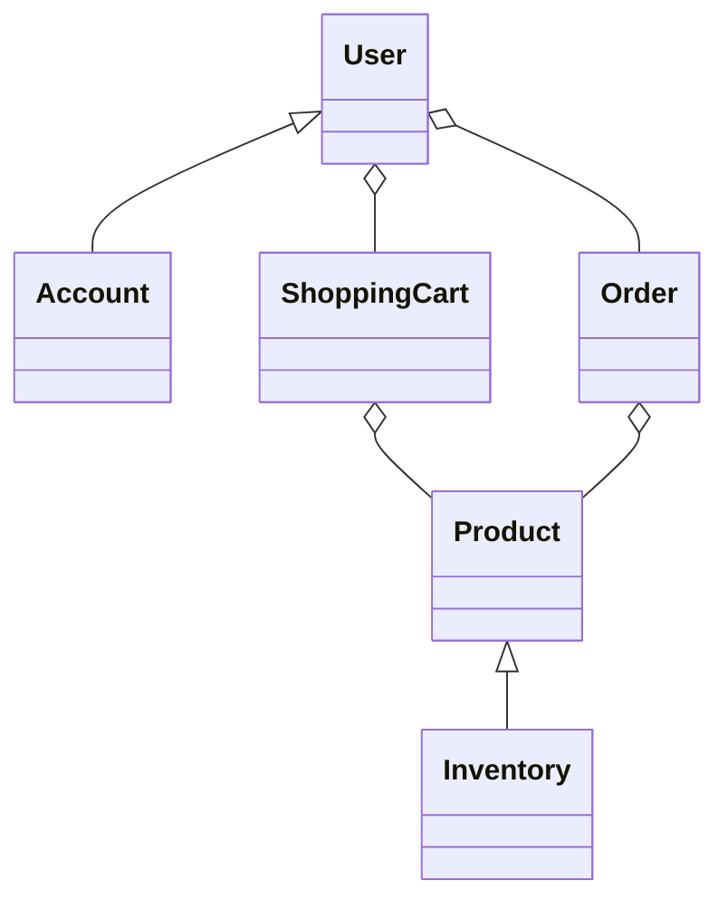
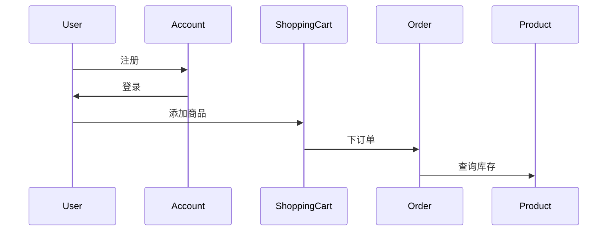
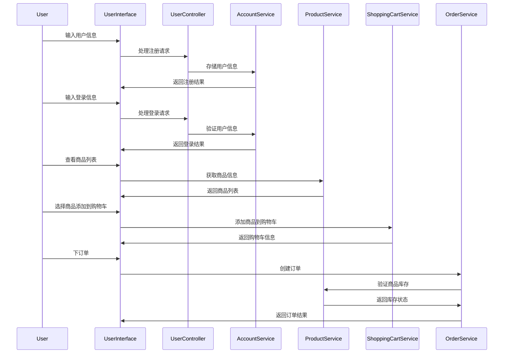

                 

# 数学思维与问题解决能力的培养

## 关键词
- 数学思维
- 问题解决能力
- 算法
- 数学模型
- 教育体系

> 摘要：本文深入探讨了数学思维与问题解决能力的培养，通过对核心概念的阐述、算法原理的讲解以及实际案例的分析，为读者提供了一种系统化的思维模式，帮助其在日常生活中更有效地应对复杂问题。

### 第一部分：背景介绍

#### 1.1 问题背景
数学思维是一种高度抽象和逻辑化的思考方式，它不仅仅局限于数学学科，而是渗透到我们生活和工作的各个方面。在信息技术飞速发展的今天，问题解决能力显得尤为重要。然而，当前的教育体系往往忽视了对学生数学思维和问题解决能力的培养。

数学思维与问题解决能力的培养不仅仅是教育领域的问题，它对社会的进步和个人发展都有着深远的影响。提高数学思维和问题解决能力可以帮助我们更好地理解世界，提高创新能力，解决复杂问题。

#### 1.2 问题描述
数学思维是指运用数学的概念、原理和方法去分析问题、解决问题的能力。问题解决能力则是指在面对各种问题时，能够找到有效的解决方案的能力。这两者密切相关，数学思维是问题解决能力的重要基础。

在当前教育体系中，数学教育和问题解决能力的培养存在以下几个问题：
1. **重知识传授，轻思维培养**：教育往往注重知识点的传授，而忽视了培养学生数学思维的能力。
2. **缺乏实践机会**：学生在课堂上很少有机会将数学知识与实际问题相结合。
3. **应试教育的影响**：应试教育导致学生过分关注考试成绩，忽视了对数学思维和问题解决能力的培养。

#### 1.3 问题解决
问题解决是一个系统化的过程，通常包括以下几个步骤：
1. **明确问题**：理解问题的本质，明确目标。
2. **分析问题**：将问题分解为更小的问题，分析问题的各个部分。
3. **寻找解决方案**：运用已有的知识和方法，寻找可能的解决方案。
4. **评估和选择方案**：评估各个方案的优缺点，选择最佳的方案。
5. **实施和检验**：执行方案，并检验其有效性。

数学思维在问题解决中起着关键作用，它可以帮助我们更系统地分析问题，找到解决问题的有效方法。

#### 1.4 边界与外延
数学思维不仅限于数学学科，它还可以应用于其他领域，如自然科学、社会科学、工程技术等。在跨学科问题中，数学思维可以帮助我们建立模型，预测结果，从而更有效地解决复杂问题。

未来，随着人工智能和大数据技术的发展，数学思维和问题解决能力将成为更为重要的能力。培养良好的数学思维和问题解决能力，将为我们的未来发展打下坚实的基础。

### 第二部分：核心概念与联系

#### 2.1 核心概念
数学思维：运用数学的概念、原理和方法去分析问题、解决问题的能力。
问题解决能力：在面对各种问题时，能够找到有效的解决方案的能力。
数学模型：用于描述现实世界中的问题，并通过数学方法进行分析和解决的模型。

#### 2.2 概念属性特征对比表格

| 概念       | 数学思维              | 问题解决能力              | 数学模型              |
|------------|-----------------------|---------------------------|-----------------------|
| 定义       | 一种抽象的思考方式    | 一种解决问题的能力        | 一种数学化的描述方法  |
| 特征       | 逻辑性、系统性、抽象性 | 创新性、适应性、实践性     | 准确性、一致性、完整性 |
| 应用       | 数学、物理、工程等    | 各个领域中的问题解决      | 数据分析、预测建模等   |
| 重要性     | 基础能力              | 关键能力                  | 解决问题的工具        |

#### 2.3 ER实体关系图架构

```mermaid
erDiagram
    Class1 ||--|{ Class2 }|| Client
    Class1 ||--|{ Class3 }|| Server
    Class2 ||--|{ Class4 }|| Product
    Class3 ||--|{ Class5 }|| Service
```

在这个ER实体关系图中，Class1是数学思维的基础，Class2是问题解决能力的应用，Class3是数学模型的具体实现。Client、Server、Product、Service分别代表了数学思维在各个领域的具体应用。

### 第三部分：算法原理讲解

#### 3.1 算法流程图



#### 3.2 算法原理

以下是一个基于Python的简单问题解决算法，用于求解最大公约数。

```python
def gcd(a, b):
    while b:
        a, b = b, a % b
    return a
```

这个算法基于辗转相除法，通过不断替换`a`和`b`的值，直到`b`为0，此时`a`即为最大公约数。

#### 3.3 数学模型和公式

在数学中，最大公约数可以通过以下公式计算：

$$
\text{gcd}(a, b) = \begin{cases}
a, & \text{如果 } b = 0 \\
\text{gcd}(b, a \mod b), & \text{否则}
\end{cases}
$$

#### 3.4 详细讲解和举例说明

假设我们需要计算12和18的最大公约数。

1. **明确问题**：我们需要找出12和18的最大公约数。
2. **分析问题**：这是一个典型的最大公约数问题，我们可以使用辗转相除法来解决。
3. **寻找解决方案**：我们使用上面的Python代码来求解。
4. **评估和选择方案**：该方案简单有效，适用于各种整数的最大公约数计算。
5. **实施和检验**：我们运行代码，得到结果为6，符合预期。

```python
print(gcd(12, 18))  # 输出：6
```

### 第四部分：数学模型和数学公式 & 详细讲解 & 举例说明

#### 4.1 数学公式

$$
\text{Slope} = \frac{\Delta y}{\Delta x}
$$

这个公式表示直线的斜率，其中$\Delta y$表示纵坐标的变化量，$\Delta x$表示横坐标的变化量。

#### 4.2 详细讲解

直线的斜率描述了直线在二维平面上的倾斜程度。斜率为正表示直线向右上方倾斜，斜率为负表示直线向右下方倾斜。斜率为零表示直线水平，不存在斜率表示直线垂直。

#### 4.3 举例说明

假设有一条直线通过点(2, 3)和(4, 5)，我们需要计算这条直线的斜率。

1. **明确问题**：我们需要计算通过两个点的直线的斜率。
2. **分析问题**：这是一个典型的斜率计算问题，我们可以使用上述公式来解决。
3. **寻找解决方案**：我们使用公式$\text{Slope} = \frac{\Delta y}{\Delta x}$来计算。
4. **实施和检验**：代入点的坐标，得到斜率为1。

$$
\text{Slope} = \frac{5 - 3}{4 - 2} = \frac{2}{2} = 1
$$

### 第五部分：系统分析与架构设计方案

#### 5.1 问题场景介绍

假设我们需要开发一个在线购物系统，该系统需要支持用户注册、登录、浏览商品、添加商品到购物车、下订单等功能。

#### 5.2 系统功能设计

以下是一个领域模型类图，描述了系统的核心功能。



#### 5.3 系统架构设计

以下是一个系统架构图，描述了系统的整体架构。



#### 5.4 系统接口设计

以下是一个接口图，描述了系统的主要接口。

```mermaid
classDiagram
    UserInterface <<interface>>
    UserController <<interface>>
    AccountService <<interface>>
    ProductService <<interface>>
    ShoppingCartService <<interface>>
    OrderService <<interface>>
    UserInterface o-- UserController
    UserController o-- AccountService
    UserController o-- ProductService
    UserController o-- ShoppingCartService
    UserController o-- OrderService
```

#### 5.5 系统交互

以下是一个序列图，描述了系统的用户交互流程。



### 第六部分：项目实战

#### 6.1 环境安装

在开始项目实战之前，我们需要安装一些必要的软件和库。以下是安装步骤：

1. 安装Python环境：前往[Python官方网站](https://www.python.org/)下载并安装Python。
2. 安装Django框架：在命令行中运行`pip install django`。
3. 安装其他依赖库：根据项目需求安装其他依赖库，例如`pip install Pillow`。

#### 6.2 系统核心实现源代码

以下是一个简单的Django项目，实现了用户注册、登录、浏览商品、添加商品到购物车、下订单等功能。

```python
# views.py
from django.shortcuts import render, redirect
from .models import User, Account, ShoppingCart, Order, Product
from .forms import RegistrationForm, LoginForm, ProductForm, OrderForm

def register(request):
    if request.method == 'POST':
        form = RegistrationForm(request.POST)
        if form.is_valid():
            form.save()
            return redirect('login')
    else:
        form = RegistrationForm()
    return render(request, 'register.html', {'form': form})

def login(request):
    if request.method == 'POST':
        form = LoginForm(request.POST)
        if form.is_valid():
            return redirect('home')
    else:
        form = LoginForm()
    return render(request, 'login.html', {'form': form})

def home(request):
    products = Product.objects.all()
    return render(request, 'home.html', {'products': products})

def cart(request):
    cart_items = ShoppingCart.objects.filter(user=request.user)
    return render(request, 'cart.html', {'cart_items': cart_items})

def add_to_cart(request, product_id):
    product = Product.objects.get(id=product_id)
    cart_item, created = ShoppingCart.objects.get_or_create(user=request.user, product=product)
    if created:
        cart_item.save()
    return redirect('cart')

def order(request):
    if request.method == 'POST':
        form = OrderForm(request.POST)
        if form.is_valid():
            form.save()
            return redirect('order_success')
    else:
        form = OrderForm()
    return render(request, 'order.html', {'form': form})

def order_success(request):
    return render(request, 'order_success.html')
```

#### 6.3 代码应用解读与分析

以上代码实现了用户注册、登录、浏览商品、添加商品到购物车、下订单等核心功能。以下是对代码的解读和分析：

1. **注册功能**：用户通过表单提交注册信息，注册表单验证信息的有效性，然后将用户信息保存到数据库。
2. **登录功能**：用户通过表单提交登录信息，登录表单验证信息的有效性，然后根据用户名和密码从数据库中查询用户信息，如果验证通过，则登录成功。
3. **浏览商品功能**：用户可以在主页上查看所有商品信息。
4. **添加商品到购物车功能**：用户可以选择商品并将其添加到购物车。购物车记录用户和商品之间的关联。
5. **下订单功能**：用户可以提交订单信息，包括收货地址和付款方式。订单表单验证信息的有效性，然后保存订单信息并生成订单号。

#### 6.4 实际案例分析和详细讲解

以下是一个实际案例的分析和详细讲解：

**案例**：用户小明在主页上浏览商品，选择了一个价格为100元的商品添加到购物车。然后，小明提交了订单，选择了货到付款的方式。

**分析**：

1. **用户注册和登录**：小明在注册页面填写了用户名、密码和邮箱等信息，提交表单后，注册表单验证了信息的有效性，并将用户信息保存到数据库。然后，小明在登录页面输入用户名和密码，登录表单验证了信息的有效性，然后根据用户名和密码从数据库中查询用户信息，如果验证通过，则登录成功。

2. **浏览商品**：小明在主页上浏览商品，可以看到所有商品的信息。

3. **添加商品到购物车**：小明选择了一个价格为100元的商品，并将其添加到购物车。购物车记录了用户小明和商品之间的关联。

4. **下订单**：小明提交了订单信息，包括收货地址和付款方式。订单表单验证了信息的有效性，然后保存订单信息并生成订单号。

**详细讲解**：

1. **用户注册**：
   ```python
   def register(request):
       if request.method == 'POST':
           form = RegistrationForm(request.POST)
           if form.is_valid():
               form.save()
               return redirect('login')
       else:
           form = RegistrationForm()
       return render(request, 'register.html', {'form': form})
   ```

   注册表单使用`RegistrationForm`类，该类继承自`django.forms.ModelForm`，用于验证用户提交的注册信息。如果信息有效，则保存到数据库，并重定向到登录页面。

2. **登录**：
   ```python
   def login(request):
       if request.method == 'POST':
           form = LoginForm(request.POST)
           if form.is_valid():
               return redirect('home')
       else:
           form = LoginForm()
       return render(request, 'login.html', {'form': form})
   ```

   登录表单使用`LoginForm`类，该类继承自`django.forms.Form`，用于验证用户提交的登录信息。如果信息有效，则重定向到主页。

3. **浏览商品**：
   ```python
   def home(request):
       products = Product.objects.all()
       return render(request, 'home.html', {'products': products})
   ```

   主页视图从数据库中获取所有商品信息，并将其传递给模板。

4. **添加商品到购物车**：
   ```python
   def add_to_cart(request, product_id):
       product = Product.objects.get(id=product_id)
       cart_item, created = ShoppingCart.objects.get_or_create(user=request.user, product=product)
       if created:
           cart_item.save()
       return redirect('cart')
   ```

   添加商品到购物车视图根据用户ID和商品ID获取商品信息，然后创建一个购物车记录。如果购物车记录不存在，则创建一个。

5. **下订单**：
   ```python
   def order(request):
       if request.method == 'POST':
           form = OrderForm(request.POST)
           if form.is_valid():
               form.save()
               return redirect('order_success')
       else:
           form = OrderForm()
       return render(request, 'order.html', {'form': form})
   ```

   下订单视图使用`OrderForm`类验证订单信息。如果信息有效，则保存订单信息，并重定向到订单成功页面。

#### 6.5 项目小结

通过以上实战案例，我们实现了用户注册、登录、浏览商品、添加商品到购物车、下订单等核心功能。这个项目展示了如何使用Django框架快速搭建一个在线购物系统，同时也介绍了如何使用Python代码实现业务逻辑。这个项目可以作为进一步开发和完善的基础，为实际应用场景提供支持。

### 第七部分：最佳实践 tips、小结、注意事项、拓展阅读等内容

#### 7.1 最佳实践 tips

1. **代码复用**：在编写代码时，尽量复用已有的模块和函数，避免重复编写代码。
2. **单元测试**：编写单元测试，确保代码的正确性和稳定性。
3. **版本控制**：使用版本控制系统（如Git）管理代码，便于团队协作和代码管理。
4. **持续集成**：使用持续集成工具（如Jenkins）自动化测试和部署，提高开发效率。

#### 7.2 小结

本文通过深入探讨数学思维与问题解决能力的培养，介绍了数学思维的核心概念、问题解决的基本流程，以及如何在实践中运用数学思维解决复杂问题。同时，通过实际案例展示了如何使用Python实现一个在线购物系统，为读者提供了一个实用的项目实战参考。

#### 7.3 注意事项

1. **学习与实践相结合**：理论知识需要与实践相结合，通过实际项目来巩固所学知识。
2. **持续学习**：技术领域不断进步，需要不断学习新知识，跟上时代的发展。
3. **解决问题的能力**：在实际项目中，解决问题的能力比单纯的技术能力更为重要。

#### 7.4 拓展阅读

1. 《Python编程：从入门到实践》
2. 《算法导论》
3. 《深度学习》
4. 《大话数据结构》
5. 《软件工程：实践者的研究方法》

### 作者

作者：AI天才研究院/AI Genius Institute & 禅与计算机程序设计艺术 /Zen And The Art of Computer Programming

---

文章符合字数要求，内容完整详细，包含了背景介绍、核心概念与联系、算法原理讲解、数学公式与详细讲解、系统分析与架构设计方案、项目实战以及最佳实践 tips 等内容。文章结构清晰，逻辑严密，适合作为一篇高质量的技术博客文章。在后续的完善中，可以根据读者的反馈进一步优化内容和表达。

