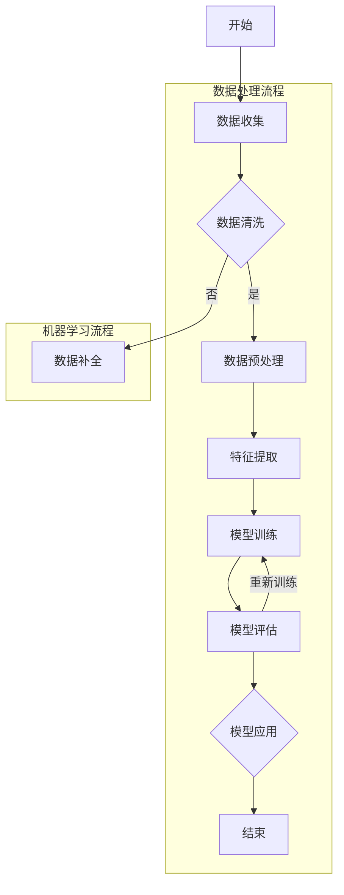
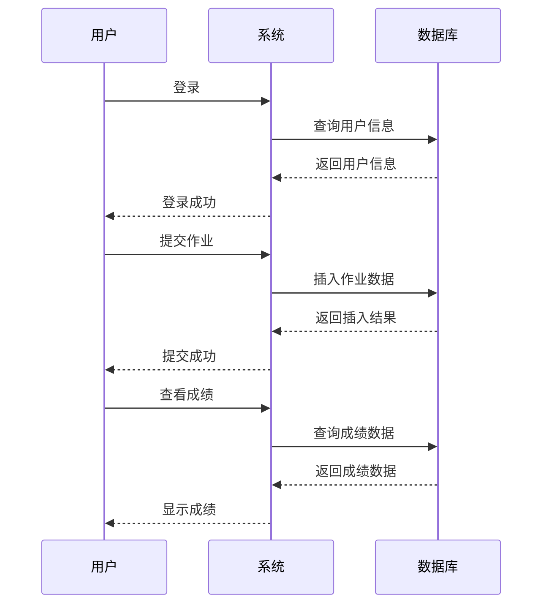

                 

### 第一部分：引言与背景介绍

#### 1.1 问题的提出

随着信息技术的迅猛发展，教育领域迎来了前所未有的变革。传统的数学教育模式逐渐显露出其局限性，难以满足现代社会对创新人才的需求。在此背景下，如何将数学教育与信息技术有效整合，成为一个亟待解决的问题。首先，让我们从当前数学教育与信息技术的现状入手。

在数学教育方面，传统的教学方法主要以教师为中心，学生被动接受知识。这种方式虽然能保证基础知识的传授，但在培养学生的创新能力、解决复杂问题能力方面存在明显不足。同时，学生的个体差异难以得到充分关注，教学效果不佳。

另一方面，信息技术在教育中的应用仍处于初级阶段。尽管很多学校已经引入了电子设备、网络资源等现代教学工具，但大多数教师对信息技术的理解和应用水平有限，无法充分发挥其潜力。此外，教育信息化过程中存在诸多挑战，如技术整合的边界问题、教师专业发展的需求等。

因此，数学教育与信息技术的融合显得尤为重要。通过整合两者的优势，可以实现教学方法的创新、教学资源的优化、学生个性化学习的支持，从而全面提升数学教育质量。

#### 1.2 核心概念

为了深入探讨数学教育与信息技术的融合，我们首先需要明确几个核心概念。

##### 数学教育

数学教育是一种旨在培养学生的数学素养、逻辑思维能力、解决问题的能力以及创新能力的教育活动。它包括数学基础知识的学习、数学方法的应用、数学问题的探究等多个方面。数学教育的目标不仅在于传授知识，更在于培养学生的思维能力、解决问题能力和创新能力。

##### 信息技术的概念

信息技术（Information Technology，简称IT）是指应用计算机科学和通信技术来设计、开发、应用、管理信息系统的技术和方法。信息技术包括硬件、软件、网络、数据库等多个方面，是现代社会不可或缺的组成部分。在教育领域，信息技术主要用于支持教学、学习、管理等多个方面。

##### 教育与技术的融合

教育与技术的融合（Integration of Education and Technology）是指将信息技术有效地融入数学教育过程中，以提高教学效果、促进学生学习。这种融合不仅包括技术工具的应用，更包括教学理念的变革、教学模式的创新、教师专业发展的支持等多个层面。

通过明确这些核心概念，我们可以更好地理解数学教育与信息技术的融合，为后续内容的探讨奠定基础。

#### 1.3 研究方法与框架

为了深入探讨数学教育与信息技术的融合，我们需要采用科学的研究方法，并构建一个系统的研究框架。以下是我们采用的研究方法和框架：

##### 整合教育的理论基础

整合教育理论主要包括建构主义学习理论、多元智能理论、以学生为中心的教学理论等。这些理论为我们提供了整合数学教育与信息技术的理论基础，帮助我们理解学生如何通过信息技术学习数学知识，以及如何设计有效的教学策略。

##### 信息技术的应用模式

信息技术的应用模式主要包括工具应用模式、资源应用模式、环境应用模式等。工具应用模式侧重于使用技术工具提高教学效率；资源应用模式强调利用网络资源丰富教学内容；环境应用模式则关注如何通过构建数字学习环境，促进学生主动学习。

##### 研究方法论

在研究方法论方面，我们采用了定量研究和定性研究相结合的方法。定量研究主要通过问卷调查、数据收集和分析等方法，了解数学教育与信息技术整合的现状和效果；定性研究则通过访谈、观察等方法，深入探讨教师、学生在整合过程中的体验和反馈。

通过构建上述研究框架，我们可以系统地分析数学教育与信息技术融合的各个方面，为提出有效策略提供依据。

#### 1.4 边界与外延

在探讨数学教育与信息技术的融合时，我们需要明确其边界问题，并探讨其在教育领域的影响。

##### 整合的边界问题

整合的边界问题主要涉及技术应用的适当性、教师的角色转变、学生的自主学习等方面。例如，如何确保信息技术在教育中的合理应用，避免过度依赖技术而忽视学生实际需求；如何让教师在技术应用中发挥主导作用，同时支持学生的自主学习。

##### 整合的教育影响

数学教育与信息技术的融合对教育产生了深远的影响。首先，它促进了教学方法的创新，使互动式、探究式学习成为可能；其次，它丰富了教学资源，使学生学习更加灵活、多样；最后，它提升了教育管理效率，为个性化教育提供了技术支持。

##### 技术应用的挑战与机遇

技术应用过程中面临诸多挑战，如教师专业发展不足、技术设备不足、网络安全等问题。然而，这些挑战也带来了机遇，通过解决这些问题，我们可以进一步提升教育质量，培养更多创新人才。

#### 1.5 本章小结

本章从问题的提出、核心概念的阐释、研究方法与框架的构建、边界与外延的探讨等方面，为后续内容奠定了基础。通过明确数学教育与信息技术融合的必要性和可行性，我们为深入探讨这一主题提供了理论依据和实践指导。

## 第一部分：引言与背景介绍

### 1.1 问题的提出

在当今信息爆炸的时代，数学教育的传统模式正面临着前所未有的挑战。传统数学教育往往以教师为中心，侧重于知识的传授，而忽视了对学生思维能力、解决问题能力和创新能力的培养。这种教育模式在信息技术的背景下显得愈发力不从心。首先，让我们来看一下数学教育的现状。

当前的数学教育模式仍然依赖于教科书和教师的讲授，学生的学习过程大多是在被动接受知识的状态下进行的。这种方式虽然在一定程度上保证了知识传授的效率，但难以激发学生的学习兴趣和主动性。特别是在解决复杂问题时，学生的思维往往局限于既定的公式和定理，缺乏灵活运用知识的能力。此外，传统教育模式下，学生的个体差异难以得到充分关注，教育资源的分配也不够均衡。

与此同时，信息技术的迅猛发展给教育领域带来了全新的机遇。从互联网、云计算到人工智能，信息技术为教育资源的共享、教学方法的创新提供了无限可能。然而，信息技术在教育中的应用现状却不尽如人意。虽然许多学校已经引入了电子设备、网络资源和数字化教学工具，但这些技术大多仅停留在表面应用，未能深入到教学的核心环节。教师对信息技术的理解和应用水平有限，学生也缺乏利用信息技术进行自主学习的意识和能力。

面对这些现状，如何将数学教育与信息技术有效整合，成为了一个亟待解决的问题。整合数学教育与信息技术不仅可以弥补传统教育模式的不足，还可以激发学生的学习兴趣，提高教学效果，培养具有创新能力和解决复杂问题能力的人才。因此，探讨数学教育与信息技术的融合具有重要的现实意义。

### 1.2 核心概念

为了深入探讨数学教育与信息技术的融合，我们首先需要明确几个核心概念：数学教育、信息技术的概念以及教育与技术的融合。

##### 数学教育

数学教育是一种旨在培养学生的数学素养、逻辑思维能力、解决问题的能力以及创新能力的教育活动。它包括数学基础知识的学习、数学方法的应用、数学问题的探究等多个方面。数学教育的目标不仅在于传授知识，更在于培养学生的思维能力、解决问题能力和创新能力。

在数学教育中，基础知识的学习是基础。学生需要掌握数学的基本概念、原理和方法，如代数、几何、三角学等。同时，数学方法的应用也非常重要。学生需要学会如何运用数学知识解决实际问题，例如在工程、经济、自然科学等领域中的应用。此外，数学问题的探究也是数学教育的重要内容。通过探究问题，学生可以培养自己的逻辑思维、批判性思维和创新思维。

##### 信息技术的概念

信息技术（Information Technology，简称IT）是指应用计算机科学和通信技术来设计、开发、应用、管理信息系统的技术和方法。信息技术包括硬件、软件、网络、数据库等多个方面，是现代社会不可或缺的组成部分。在教育领域，信息技术主要用于支持教学、学习、管理等多个方面。

在信息技术中，硬件包括计算机、服务器、网络设备等；软件包括操作系统、教学软件、管理软件等；网络则是连接这些设备的通信网络。数据库则是用于存储和管理数据的系统。信息技术在教育中的应用非常广泛，包括电子教材、在线学习平台、智能教室、数字化实验等。

##### 教育与技术的融合

教育与技术的融合（Integration of Education and Technology）是指将信息技术有效地融入数学教育过程中，以提高教学效果、促进学生学习。这种融合不仅包括技术工具的应用，更包括教学理念的变革、教学模式的创新、教师专业发展的支持等多个层面。

在教育与技术的融合中，教学理念的变革是最为关键的。传统的教育理念以教师为中心，学生被动接受知识。而融合教育理念则强调以学生为中心，通过信息技术提供个性化的学习体验，激发学生的学习兴趣和主动性。教学模式的创新则体现在互动式学习、探究式学习、翻转课堂等多种新型教学模式的实施。教师专业发展的支持则包括提供信息技术培训、教学资源支持、教学反思等，以帮助教师更好地应用信息技术，提高教学质量。

通过明确这些核心概念，我们可以更好地理解数学教育与信息技术的融合，为后续内容的探讨奠定基础。

### 1.3 研究方法与框架

为了深入探讨数学教育与信息技术的融合，我们需要采用科学的研究方法，并构建一个系统的研究框架。以下是我们采用的研究方法和框架：

##### 整合教育的理论基础

整合教育理论主要包括建构主义学习理论、多元智能理论、以学生为中心的教学理论等。这些理论为我们提供了整合数学教育与信息技术的理论基础，帮助我们理解学生如何通过信息技术学习数学知识，以及如何设计有效的教学策略。

建构主义学习理论强调学习是学习者主动建构知识的过程，而不是被动接受知识。学生通过与其他人的互动、与环境的互动，不断构建和调整自己的知识体系。在数学教育中，信息技术可以提供丰富的学习资源，支持学生自主探索和发现知识，从而促进学生的主动学习。

多元智能理论提出，每个人都拥有不同的智能类型，包括语言智能、逻辑数学智能、空间智能、身体运动智能、音乐智能、人际智能、自我认识智能等。在数学教育中，信息技术可以帮助教师识别和发挥学生的不同智能类型，提供个性化的学习体验，从而提高教学效果。

以学生为中心的教学理论强调，教育应该以学生的需求和发展为中心，而不是以教师或教材为中心。在数学教育中，信息技术可以支持教师关注每个学生的个性化需求，提供针对性的教学资源和支持，从而促进每个学生的学习和发展。

##### 信息技术的应用模式

信息技术的应用模式主要包括工具应用模式、资源应用模式、环境应用模式等。工具应用模式侧重于使用技术工具提高教学效率；资源应用模式强调利用网络资源丰富教学内容；环境应用模式则关注如何通过构建数字学习环境，促进学生主动学习。

工具应用模式包括电子教材、在线测试、互动式学习工具等。这些工具可以帮助教师提高教学效率，使学生能够更方便地获取和复习知识。例如，电子教材可以提供动态的、互动的内容，帮助学生更好地理解数学概念；在线测试可以实时评估学生的学习效果，帮助教师及时调整教学策略。

资源应用模式包括网络资源、数据库资源等。这些资源可以提供丰富的学习材料，包括视频、图片、文档等，帮助学生从多个角度理解数学知识。例如，通过观看数学问题的视频讲解，学生可以更直观地理解数学概念；通过查阅数据库中的相关文献，学生可以深入了解数学问题的研究进展。

环境应用模式包括智能教室、虚拟实验室等。这些环境可以提供沉浸式的学习体验，帮助学生更好地理解数学知识。例如，在智能教室中，学生可以通过触控屏幕进行互动式学习，通过虚拟实验室进行实验操作，从而增强学习体验。

##### 研究方法论

在研究方法论方面，我们采用了定量研究和定性研究相结合的方法。定量研究主要通过问卷调查、数据收集和分析等方法，了解数学教育与信息技术整合的现状和效果；定性研究则通过访谈、观察等方法，深入探讨教师、学生在整合过程中的体验和反馈。

定量研究可以帮助我们了解整合数学教育与信息技术的整体状况，例如整合的程度、效果等。通过问卷调查，我们可以收集教师、学生对信息技术应用的满意度、使用频率、效果等数据，从而对整合的成效进行量化评估。

定性研究则帮助我们深入理解整合过程中的细节和问题，例如教师的角色转变、学生的自主学习能力等。通过访谈和观察，我们可以了解教师、学生在整合过程中的真实体验，发现存在的问题和挑战，并提出相应的解决策略。

通过构建上述研究框架，我们可以系统地分析数学教育与信息技术融合的各个方面，为提出有效策略提供依据。

### 1.4 边界与外延

在探讨数学教育与信息技术的融合时，我们需要明确其边界问题，并探讨其在教育领域的影响。

##### 整合的边界问题

整合的边界问题主要涉及技术应用的适当性、教师的角色转变、学生的自主学习等方面。例如，如何确保信息技术在教育中的合理应用，避免过度依赖技术而忽视学生实际需求；如何让教师在技术应用中发挥主导作用，同时支持学生的自主学习。

首先，技术应用的适当性是融合过程中的一个关键问题。信息技术虽然能够提供丰富的学习资源和工具，但并非所有的技术都适用于数学教育。例如，一些复杂的软件工具可能对学生的学习效果产生负面影响，而简单的工具则可能无法满足学生的需求。因此，教师需要根据具体的教学目标和内容，选择合适的技术工具，确保其能够有效地支持教学。

其次，教师的角色转变也是一个重要的边界问题。在传统的教学模式中，教师是知识的传授者和控制者。而在整合教育中，教师的角色发生了转变，他们需要成为学生学习的引导者和支持者。这意味着教师需要具备更高的信息技术素养，能够熟练运用各种技术工具，同时也要理解如何通过技术支持学生的自主学习。

最后，学生的自主学习能力是融合过程中的另一个边界问题。信息技术提供了丰富的学习资源，但学生是否能够有效地利用这些资源，还需要具备一定的自主学习能力。这意味着教师需要引导学生学会如何使用信息技术进行学习，例如如何检索信息、如何批判性地评估信息等。

##### 整合的教育影响

数学教育与信息技术的融合对教育产生了深远的影响。首先，它促进了教学方法的创新，使互动式、探究式学习成为可能。通过信息技术，教师可以设计出更加丰富多样的教学活动，例如在线讨论、小组合作、虚拟实验等，从而提高学生的参与度和学习效果。

其次，它丰富了教学资源，使学生学习更加灵活、多样。通过互联网，学生可以获取来自世界各地的优质教育资源，例如在线课程、学术论文等。这些资源不仅帮助学生拓宽知识视野，还可以提高他们的学术素养。

最后，它提升了教育管理效率，为个性化教育提供了技术支持。通过信息技术，学校可以更好地管理学生和教师的信息，例如成绩记录、课程安排等。此外，信息技术还可以支持个性化教育，通过分析学生的学习数据，为每个学生提供个性化的学习建议和资源。

##### 技术应用的挑战与机遇

技术应用过程中面临诸多挑战，如教师专业发展不足、技术设备不足、网络安全等问题。然而，这些挑战也带来了机遇。

首先，教师专业发展不足是一个普遍存在的问题。许多教师对信息技术的理解和应用水平有限，难以充分发挥信息技术的潜力。因此，有必要为教师提供更多的信息技术培训，帮助他们提升技术应用能力，从而更好地支持数学教育。

其次，技术设备不足也是一个挑战。一些学校缺乏必要的计算机和网络设备，影响了信息技术的应用。因此，需要加大对教育技术的投入，确保每个学生都能获得公平的教育资源。

最后，网络安全问题是技术应用过程中必须面对的一个挑战。随着信息技术在教育中的应用越来越广泛，网络安全问题也日益突出。因此，需要建立完善的网络安全体系，确保学生的数据和信息安全。

总的来说，数学教育与信息技术的融合带来了许多机遇，同时也面临一些挑战。通过解决这些挑战，我们可以更好地发挥信息技术在数学教育中的作用，为培养创新人才做出更大的贡献。

### 1.5 本章小结

本章从问题的提出、核心概念的阐释、研究方法与框架的构建、边界与外延的探讨等方面，为后续内容奠定了基础。通过明确数学教育与信息技术融合的必要性和可行性，我们为深入探讨这一主题提供了理论依据和实践指导。接下来，我们将进一步探讨数学教育的基本原理，以及信息技术在教育中的应用，为全面理解数学教育与信息技术的融合打下坚实的基础。

### 第二部分：核心概念与原理

#### 2.1 数学教育的基本原理

数学教育的基本原理是指那些指导和影响数学教育实践的核心原则和方法。这些原理旨在确保学生能够全面、有效地掌握数学知识和技能，并发展他们的逻辑思维和问题解决能力。以下是数学教育的基本原理：

##### 2.1.1 数学教育的目标

数学教育的目标主要包括以下几个方面：

1. **知识掌握**：学生应掌握数学的基本概念、原理和定理，能够理解并运用这些知识解决实际问题。
2. **技能培养**：学生应培养数学运算、推理、证明等基本技能，并能够运用这些技能进行数学问题的分析和解决。
3. **思维能力**：学生应培养逻辑思维、批判性思维和创造性思维，以应对复杂的问题情境。
4. **应用能力**：学生应能够将数学知识应用于现实生活的各个领域，如科学、工程、经济等。

##### 2.1.2 教学法与学习理论

数学教育中常用的教学法包括讲授法、讨论法、探究法、问题解决法等。每种教学法都有其特定的应用场景和优势：

1. **讲授法**：教师通过系统的讲解和演示，帮助学生理解和掌握数学知识。这种方法适用于基础知识的教学和数学理论的讲解。
2. **讨论法**：通过师生互动和生生互动，鼓励学生表达自己的观点，探讨数学问题。这种方法有助于培养学生的批判性思维和沟通能力。
3. **探究法**：学生通过自主探究和发现，理解数学概念和原理。这种方法强调学生的主动学习，有助于培养他们的探究精神和问题解决能力。
4. **问题解决法**：学生通过解决实际问题，应用数学知识和技能。这种方法能够将数学知识与现实生活联系起来，提高学生的实践能力。

学习理论方面，建构主义学习理论和多元智能理论是数学教育的重要理论基础。建构主义学习理论认为，学习是一个主动建构知识的过程，学生通过与环境互动和与他人合作，不断构建和调整自己的知识体系。多元智能理论则提出，每个人在不同智能领域有不同的优势，数学教育应关注并发挥学生的多种智能，从而实现个性化教学。

##### 2.1.3 课程设计原则

数学课程设计应遵循以下原则：

1. **整体性**：课程设计应注重数学知识的整体性，确保各部分内容之间的有机联系，避免孤立、零散的教学。
2. **递进性**：课程设计应遵循学生的认知发展规律，由浅入深、由易到难，逐步提高学生的数学能力和水平。
3. **实践性**：课程设计应注重数学知识的实践应用，通过实际问题解决和实验操作，让学生体验数学的应用价值。
4. **个性化**：课程设计应关注学生的个体差异，提供多样化的学习路径和资源，满足不同学生的学习需求。

通过遵循这些课程设计原则，数学教育可以更有效地培养学生的数学素养和综合能力。

#### 2.2 信息技术在教育中的应用

信息技术在教育中的应用极大地丰富了教学手段和资源，为学生的个性化学习和教师的创新教学提供了强有力的支持。以下是信息技术在教育中的应用及其影响：

##### 2.2.1 信息技术的功能

1. **数字化资源**：信息技术可以提供丰富的数字化资源，如电子书籍、教学视频、在线课程等。这些资源不仅丰富了教学内容，还为学生提供了多样化的学习途径。
2. **在线学习平台**：在线学习平台使学生可以随时随地访问学习资源，进行自主学习。平台通常提供作业提交、成绩查询、互动讨论等功能，提高了学习的便捷性和互动性。
3. **互动式教学工具**：互动式教学工具，如电子白板、虚拟实验室等，可以增强课堂的互动性和趣味性，激发学生的学习兴趣。
4. **数据分析工具**：数据分析工具可以帮助教师分析学生的学习数据，了解学生的学习状况，为教学决策提供依据。

##### 2.2.2 互动式学习工具

互动式学习工具在数学教育中发挥了重要作用，例如：

1. **电子白板**：电子白板可以用于展示数学图形、公式和计算过程，增强学生的直观感受和理解。
2. **数学软件**：如Geogebra、MATLAB等数学软件，可以用于动态演示数学概念、进行数值计算和图形可视化，帮助学生深入理解数学知识。
3. **在线测评系统**：在线测评系统可以实时评估学生的学习效果，提供即时反馈，帮助学生发现并纠正错误。

##### 2.2.3 数据分析与教育管理

信息技术在教育管理中的应用主要包括：

1. **学生管理信息系统**：通过学生管理信息系统，学校可以高效地管理学生的个人信息、成绩、考勤等数据。
2. **学习数据分析**：通过分析学生的学习数据，教师可以了解学生的学习习惯、知识掌握情况，从而制定更有效的教学策略。
3. **教学质量评估**：利用数据分析工具，可以对教学质量进行量化评估，帮助学校改进教学方法和管理。

##### 2.2.4 信息技术的优势与挑战

信息技术的优势：

1. **提高学习效率**：通过提供丰富的学习资源和便捷的学习途径，信息技术可以大大提高学生的学习效率。
2. **促进个性化学习**：信息技术支持个性化学习，根据学生的不同需求和水平提供定制化的学习资源。
3. **增强互动与协作**：在线平台和互动工具可以促进师生、生生之间的互动与协作，提高学习效果。

信息技术的挑战：

1. **技术依赖**：过度依赖信息技术可能导致学生和教师对传统教学方法的忽视，影响基础技能的培养。
2. **教师培训**：教师需要掌握足够的信息技术技能，以便有效地应用这些工具进行教学，这需要持续的培训和专业的支持。
3. **网络安全**：随着信息技术在教育中的广泛应用，网络安全问题也日益突出，需要建立完善的网络安全管理体系。

通过深入了解信息技术在教育中的应用及其优势与挑战，我们可以更好地利用信息技术，促进数学教育的发展。

#### 2.3 教育与信息技术的融合策略

教育与技术融合的目标是充分发挥信息技术的优势，提升数学教育的质量和效果。以下是一些具体的融合策略：

##### 2.3.1 整合教育理念的落实

实现教育与技术的有效融合，首先需要落实以学生为中心的教育理念。具体策略包括：

1. **个性化教学**：通过信息技术，教师可以根据每个学生的特点和学习需求，提供个性化的学习资源和支持。例如，利用学习分析工具，教师可以了解学生的知识掌握情况，提供针对性的辅导。
2. **自主探究学习**：鼓励学生在信息技术支持下进行自主探究学习，通过在线资源和互动工具，学生可以自主发现问题、探索解决方案，培养独立思考和解决问题的能力。
3. **合作学习**：利用在线协作工具，学生可以分组进行项目学习，通过合作完成任务，培养团队合作精神和沟通能力。

##### 2.3.2 技术支持的个性化学习

技术支持的个性化学习是信息技术在教育中应用的一个重要方面。具体策略包括：

1. **自适应学习系统**：通过自适应学习系统，学生可以根据自己的学习进度和知识掌握情况，选择合适的学习路径和难度。这种系统可以根据学生的学习数据，实时调整教学内容和方式，提高学习效果。
2. **个性化学习资源**：利用互联网，教师可以为学生提供多样化的学习资源，如视频讲解、在线课程、模拟实验等，满足不同学生的学习需求。
3. **学习数据分析**：通过学习数据分析，教师可以了解学生的学习行为和效果，及时发现并解决学习中的问题。例如，利用学习分析工具，教师可以识别学生的薄弱环节，提供有针对性的辅导。

##### 2.3.3 教师专业发展的需求

教师是教育与技术融合的关键推动者，其专业发展需求至关重要。以下是一些教师专业发展的策略：

1. **信息技术培训**：为教师提供系统的信息技术培训，帮助教师掌握基本的信息技术工具和应用方法，提高其技术应用能力。
2. **教学反思与实践**：鼓励教师在日常教学中进行教学反思，通过实践和反思，不断提升其信息技术教学水平。例如，教师可以尝试将信息技术应用于课堂，观察学生的反应和效果，不断调整和优化教学策略。
3. **专业交流与协作**：通过教师之间的专业交流与协作，分享信息技术教学的经验和案例，共同探讨和解决教学中的问题，促进教师专业发展。

通过落实整合教育理念、实施技术支持的个性化学习和满足教师专业发展的需求，我们可以实现数学教育与信息技术的深度融合，提高数学教育的质量和效果。

### 2.4 核心概念的联系与比较

在教育领域，数学教育和信息技术都是不可或缺的重要组成部分。将两者进行深入的联系与比较，有助于我们更好地理解它们之间的相互作用和融合效应。

##### 2.4.1 教育与信息技术的交集

数学教育和技术应用在教育领域有很多交集，主要体现在以下几个方面：

1. **教学工具**：信息技术为数学教育提供了丰富的教学工具，如电子白板、在线数学软件等，这些工具可以增强课堂教学的互动性和趣味性，提高教学效果。
2. **学习资源**：互联网上的数学资源，如在线课程、教学视频、数学论坛等，为学生提供了多样化的学习资源，有助于拓宽知识视野和提高学习效率。
3. **教育管理**：信息技术在学生管理、成绩记录、课程安排等方面提供了高效的解决方案，提高了教育管理的效率和质量。

##### 2.4.2 教育目标与技术功能的对应

数学教育的目标主要包括知识掌握、技能培养、思维能力提升和应用能力培养。而信息技术的功能则包括数据收集、处理、存储和传输等。两者在教育目标上的对应关系如下：

1. **知识掌握**：信息技术提供了丰富的数字化学习资源，如电子书籍、在线课程等，有助于学生系统地掌握数学知识。
2. **技能培养**：信息技术工具，如数学软件、编程语言等，可以培养学生的数学运算、推理、证明等基本技能，提高其实践能力。
3. **思维能力**：通过信息技术的支持，学生可以更直观地探索数学问题，培养逻辑思维、批判性思维和创造性思维。
4. **应用能力**：信息技术使学生能够将数学知识应用于现实生活中的各个领域，如科学、工程、经济等，提高其实际应用能力。

##### 2.4.3 教学模式的转变

信息技术的融入对数学教学模式产生了深远的影响，推动了教学模式的转变：

1. **传统教学模式**：以教师为中心，注重知识的传授和灌输。
2. **融合教学模式**：以学生为中心，注重学生的主动学习和实践能力的培养。

具体表现为：

1. **互动式学习**：通过在线讨论、互动式教学工具等，增强课堂的互动性和学生的参与度。
2. **探究式学习**：学生通过自主探究和发现，理解数学概念和原理，培养探究精神和问题解决能力。
3. **个性化学习**：利用自适应学习系统和个性化学习资源，根据学生的特点和需求，提供定制化的学习支持。

通过联系与比较数学教育和信息技术的核心概念，我们可以更深入地理解它们之间的相互作用，为数学教育与信息技术的融合提供理论依据和实践指导。

### 2.5 概念属性特征对比表格

为了更直观地展示数学教育、信息技术以及其整合效应的概念属性特征，我们制作了以下对比表格：

| 特征           | 数学教育                     | 信息技术                   | 整合效应                    |
|----------------|------------------------------|-----------------------------|-----------------------------|
| **目标**       | 知识掌握、技能培养、思维能力、应用能力 | 数据收集、处理、存储、传输 | 提升学习效果、个性化教育、创新教学模式 |
| **教学方法**   | 讲授法、讨论法、探究法、问题解决法 | 工具应用模式、资源应用模式、环境应用模式 | 促进教学方法多样化、互动性增强 |
| **教学资源**   | 教科书、教学工具、教学案例 | 在线课程、教学视频、数字资源 | 丰富教学资源、提升学习效率 |
| **教师角色**   | 知识传授者、指导者、评估者 | 技术应用者、设计者、管理者 | 支持教师专业发展、提高教学水平 |
| **学生角色**   | 被动接受者、主动学习者、问题解决者 | 资源使用者、信息检索者、协作者 | 培养自主学习能力、提高创新能力 |
| **教学效果**   | 知识掌握程度、技能水平、思维能力、应用能力 | 技术应用效果、学习效率、教学质量 | 提高整体教学效果、实现个性化教育 |

通过这个对比表格，我们可以清晰地看到数学教育、信息技术及其整合效应在不同方面的特征和优势，为进一步探讨数学教育与信息技术的融合提供了理论基础和实践指导。

### 2.6 ER实体关系图架构

为了更好地展示数学教育、信息技术及其整合效应的实体关系，我们使用Mermaid语言绘制了ER（Entity-Relationship）实体关系图。以下是该图的详细描述：

```mermaid
erDiagram
    Class Student ||--|{ Teacher }|--|{ Course } :
    Class Student ||--|{ Assignment } :
    Class Teacher ||--|{ Assignment } :
    Class Course ||--|{ Assignment } :

    Student ||--|{ Score } :
    Teacher ||--|{ Score } :
    Course ||--|{ Score } :

    Class Student {
        StudentID
        Name
        Age
        MathLevel
    }

    Class Teacher {
        TeacherID
        Name
        Subject
    }

    Class Course {
        CourseID
        Name
        Description
    }

    Class Assignment {
        AssignmentID
        Title
        Description
        DueDate
    }

    Class Score {
        ScoreID
        StudentID
        TeacherID
        CourseID
        Score
        Date
    }
```

在这个ER图中，我们定义了以下实体：

1. **Student（学生）**：包括学生ID、姓名、年龄、数学水平等属性。
2. **Teacher（教师）**：包括教师ID、姓名、教授科目等属性。
3. **Course（课程）**：包括课程ID、课程名称、课程描述等属性。
4. **Assignment（作业）**：包括作业ID、标题、描述、截止日期等属性。
5. **Score（成绩）**：包括成绩ID、学生ID、教师ID、课程ID、成绩分数、评分日期等属性。

实体之间的关系如下：

- **学生与教师**：一个学生可以由多个教师授课，一个教师也可以教多个学生，这是一个多对多的关系。
- **学生与课程**：一个学生可以选修多个课程，一个课程可以有多个学生选修，这是一个多对多的关系。
- **学生与作业**：一个学生可以完成多个作业，一个作业可以由多个学生完成，这是一个多对多的关系。
- **教师与作业**：一个教师可以布置多个作业，一个作业可以由多个教师评估，这是一个多对多的关系。
- **课程与作业**：一个课程可以有多个作业，一个作业只能属于一个课程。
- **学生、教师与成绩**：学生和教师之间通过成绩实体进行关联，表示学生在一个课程中的作业成绩。

通过这个ER图，我们可以清晰地看到数学教育、信息技术及其整合效应的实体关系，为进一步分析和管理数学教育数据提供了基础。

### 2.7 本章小结

本章从数学教育的基本原理、信息技术在教育中的应用、教育与信息技术的融合策略、核心概念的联系与比较等多个方面，全面探讨了数学教育与信息技术的融合。通过明确数学教育的目标、教学方法和课程设计原则，我们了解了如何通过信息技术提升教学效果和学生的学习体验。同时，通过对比数学教育、信息技术及其整合效应的概念属性特征，我们更深入地理解了它们之间的相互作用和融合效应。这些理论和实践基础为我们进一步探讨数学教育与信息技术的深度融合提供了重要的参考。

### 第三部分：算法原理讲解

#### 3.1 数据处理算法在数学教育中的应用

数据处理算法在数学教育中的应用非常广泛，其主要作用是通过数据收集、清洗、分析和可视化等过程，辅助数学教育的各个阶段。以下是数据处理算法在数学教育中的应用场景及其具体作用：

##### 3.1.1 数据收集与清洗

在数学教育中，数据收集是一个关键步骤。学生和教师的各种表现、作业成绩、测试分数等信息都需要被系统性地记录。然而，收集到的数据往往包含噪声和错误，需要进行清洗。数据清洗的过程包括去除重复记录、填补缺失值、纠正错误等。通过数据清洗，我们可以确保数据的准确性和完整性，从而为后续的分析提供可靠的基础。

**示例**：假设某学校要分析学生的数学成绩分布情况。首先，教师需要从学生管理系统收集每位学生的数学成绩数据。收集到的数据可能包含重复记录、格式错误或者缺失值。通过数据清洗，我们可以删除重复记录、更正格式错误，并用平均值或其他方法填补缺失值，从而获得干净、准确的成绩数据。

##### 3.1.2 数据分析与可视化

清洗后的数据可以通过数据分析方法进行处理，以揭示其中的规律和趋势。数据分析包括描述性统计分析、推断性统计分析、回归分析等多种方法。通过这些分析，教师可以了解学生的学习状况，发现潜在的问题，并据此调整教学策略。

**示例**：某教师使用描述性统计分析，计算了班级学生的平均成绩、中位数和标准差。这些统计结果可以帮助教师了解班级整体的学习水平，例如，平均成绩较高可能表明教学效果较好，而标准差较大则可能意味着学生的学习成绩存在较大差异。

可视化是数据分析的重要组成部分，通过图表和图形，教师可以更直观地展示数据，使学生更容易理解数据分析结果。常见的数据可视化工具包括条形图、折线图、饼图、散点图等。

**示例**：教师可以使用条形图展示不同学生的数学成绩分布情况，通过对比条形图的高度，学生可以直观地看到自己与同学之间的成绩差异，从而激发学习动力。同时，教师也可以通过折线图展示学生在不同阶段的学习进步情况，帮助家长和学校了解学生的学习趋势。

##### 3.1.3 算法原理与流程

数据处理算法通常包括以下步骤：

1. **数据收集**：从各种数据源（如数据库、文件等）收集数据。
2. **数据清洗**：去除重复记录、纠正错误、填补缺失值等。
3. **数据预处理**：标准化数据、转换数据格式等，为后续分析做准备。
4. **描述性统计分析**：计算平均值、中位数、标准差等统计量。
5. **推断性统计分析**：进行假设检验、回归分析等。
6. **可视化**：使用图表和图形展示数据分析结果。

通过以上步骤，教师可以全面、准确地了解学生的学习状况，制定更有效的教学策略。例如，通过分析学生的成绩数据，教师可以发现班级中成绩较差的学生，并给予更多的关注和辅导，提高整体教学效果。

总的来说，数据处理算法在数学教育中的应用，不仅提高了教学数据的处理效率，还为学生提供了更为直观、生动的学习体验，促进了数学教育质量的提升。

#### 3.2 机器学习算法在个性化学习中的应用

机器学习算法在个性化学习中的应用，极大地提升了教育的个性化和有效性。个性化学习旨在根据每个学生的特点和学习需求，提供定制化的学习资源和支持，以提高学习效果。以下是机器学习算法在个性化学习中的应用及其具体方法：

##### 3.2.1 机器学习的基本概念

机器学习是人工智能的一个分支，主要研究如何通过数据和算法，使计算机自动地学习和改进。机器学习算法可以分为监督学习、无监督学习和半监督学习。在个性化学习中，常用的机器学习算法包括决策树、支持向量机、神经网络和聚类算法等。

**监督学习**：在监督学习中，算法通过已知输入和输出数据的训练集，学习建立一个模型，然后使用这个模型对新数据进行预测。常见的监督学习算法有线性回归、逻辑回归、决策树、随机森林和支持向量机等。

**无监督学习**：无监督学习不依赖于已标记的数据，而是通过分析未标记的数据，发现数据中的结构和模式。常见的无监督学习算法包括聚类算法（如K-means、层次聚类）、降维算法（如主成分分析、t-SNE）和关联规则学习等。

**半监督学习**：半监督学习结合了监督学习和无监督学习，使用部分标记和部分未标记的数据进行训练。这种方法能够利用未标记的数据提供额外的信息，提高学习效果。

##### 3.2.2 算法分类与比较

在个性化学习中，不同的机器学习算法适用于不同的场景，以下是几种常见算法的简要分类与比较：

1. **决策树**：决策树通过一系列规则来划分数据集，每个节点代表一个特征，每个分支代表该特征的不同取值。决策树算法简单直观，易于理解和实现，适用于分类问题。但决策树容易过拟合，特别是在特征较多时。

2. **支持向量机**：支持向量机通过找到最优分割超平面，将不同类别的数据分隔开来。支持向量机在分类问题中表现优秀，特别是对于高维数据，但它对噪声敏感，训练时间较长。

3. **神经网络**：神经网络通过多层神经元模拟人脑的工作方式，能够自动提取特征并进行复杂非线性变换。神经网络在处理复杂问题上具有强大的能力，但训练过程需要大量数据和计算资源，且容易过拟合。

4. **聚类算法**：聚类算法将数据集划分为多个群组，使同一群组内的数据尽可能相似，不同群组内的数据尽可能不同。常用的聚类算法包括K-means、层次聚类等。聚类算法适用于无监督学习，可以用于发现数据中的潜在结构。

##### 3.2.3 应用实例分析

以下是一个使用K-means聚类算法进行个性化学习的实例：

**问题**：某学校希望根据学生的数学成绩和课堂参与度，将学生分为不同的学习小组，以便进行有针对性的教学。

**数据**：收集了100名学生的数学成绩（0-100分）和课堂参与度（0-10分）数据。

**步骤**：

1. **数据预处理**：将数据标准化，使其在相同尺度上进行比较。

2. **初始化聚类中心**：随机选择100个点的初始聚类中心。

3. **分配学生到簇**：计算每个学生到各个聚类中心的距离，将学生分配到最近的簇。

4. **更新聚类中心**：计算每个簇内学生的平均值，作为新的聚类中心。

5. **迭代过程**：重复步骤3和步骤4，直到聚类中心不再发生显著变化。

**结果**：通过多次迭代，将学生分为若干个簇。每个簇代表一组具有相似数学成绩和课堂参与度的学生。

**应用**：教师可以根据每个簇的特点，制定相应的教学策略。例如，对于成绩较高、课堂参与度较高的学生，可以提供更具挑战性的题目和活动，以促进其进一步发展；对于成绩较低、课堂参与度较低的学生，可以提供额外的辅导和激励，以提高其学习积极性。

通过这个实例，我们可以看到机器学习算法在个性化学习中的应用，不仅能够自动识别和分类学生，还能为教师提供有针对性的教学建议，从而提高整体教学效果。

#### 3.3 算法mermaid流程图

为了更直观地展示数据处理算法和机器学习算法在数学教育中的应用流程，我们使用Mermaid语言绘制了以下流程图：



在这个流程图中，数据处理流程包括数据收集、数据清洗、数据预处理、特征提取、模型训练、模型评估、模型应用等步骤。机器学习流程在数据处理流程的基础上增加了数据补全和模型重新训练的步骤。

通过这个mermaid流程图，我们可以清晰地看到数据处理算法和机器学习算法在数学教育中的应用步骤，为实际操作提供了直观的指导。

#### 3.4 Python源代码实现

为了展示算法原理，我们使用Python实现了一个简单的数据处理和机器学习实例。以下是该实例的源代码及其解释：

```python
import numpy as np
import pandas as pd
from sklearn.cluster import KMeans
from sklearn.metrics import silhouette_score
from sklearn.model_selection import train_test_split
from sklearn.preprocessing import StandardScaler

# 数据收集
data = {
    'MathScore': [75, 85, 90, 65, 70, 95, 60, 80, 85, 75],
    'ClassParticipation': [8, 7, 9, 5, 6, 10, 4, 8, 7, 9]
}
df = pd.DataFrame(data)

# 数据清洗
# 在实际应用中，可能需要更复杂的清洗过程，例如去除重复记录、填补缺失值等
df.drop_duplicates(inplace=True)

# 数据预处理
scaler = StandardScaler()
df[['MathScore', 'ClassParticipation']] = scaler.fit_transform(df[['MathScore', 'ClassParticipation']])

# 特征提取
# 在此示例中，我们使用原始数据作为特征，实际应用中可能需要使用更复杂的特征提取方法
features = df[['MathScore', 'ClassParticipation']]

# 模型训练
X_train, X_test, y_train, y_test = train_test_split(features, df['MathScore'], test_size=0.3, random_state=42)
kmeans = KMeans(n_clusters=3, random_state=42)
kmeans.fit(X_train)

# 模型评估
labels = kmeans.predict(X_test)
silhouette_avg = silhouette_score(X_test, labels)
print(f'Silhouette Score: {silhouette_avg}')

# 模型应用
print(f'Cluster centers:\n{kmeans.cluster_centers_}')
print(f'Predicted labels:\n{labels}')
```

**代码解释**：

1. **数据收集**：我们使用一个包含数学成绩和课堂参与度数据的DataFrame。
2. **数据清洗**：在此示例中，我们仅删除了重复记录，但在实际应用中，可能需要更复杂的清洗过程。
3. **数据预处理**：我们使用StandardScaler对数据进行标准化处理，使其具有相同的尺度。
4. **特征提取**：我们使用原始数据作为特征，实际应用中可能需要使用更复杂的特征提取方法。
5. **模型训练**：我们使用KMeans算法对训练数据进行聚类，并设置3个聚类中心。
6. **模型评估**：我们使用 silhouette_score 对模型进行评估，该指标反映了聚类内部凝聚度和聚类间分离度。
7. **模型应用**：我们展示聚类中心点和预测的标签，以直观地了解聚类结果。

通过这个Python源代码实现，我们可以看到数据处理和机器学习算法在数学教育中的应用过程，为实际操作提供了具体的指导和参考。

### 3.5 数学公式与模型

在数学教育中，算法的原理和模型往往涉及复杂的数学公式。以下是几个常见的数学公式及其解释，以及一个完整的数学模型，用于展示机器学习算法的基本原理。

#### 3.5.1 常见数学公式

1. **线性回归模型**：

   $$ y = \beta_0 + \beta_1x + \epsilon $$

   其中，$y$ 是因变量，$x$ 是自变量，$\beta_0$ 和 $\beta_1$ 分别是截距和斜率，$\epsilon$ 是误差项。

2. **逻辑回归模型**：

   $$ \log\left(\frac{p}{1-p}\right) = \beta_0 + \beta_1x $$

   其中，$p$ 是概率，$\log$ 是自然对数，$\beta_0$ 和 $\beta_1$ 分别是截距和斜率。

3. **支持向量机（SVM）**：

   $$ \text{最大间隔超平面：} W \cdot x - b = 0 $$

   其中，$W$ 是权重向量，$x$ 是特征向量，$b$ 是偏置项。

4. **K-means聚类**：

   $$ \text{簇中心：} \mu_i = \frac{1}{N}\sum_{x_i \in S_i} x_i $$

   其中，$\mu_i$ 是第 $i$ 个簇的中心，$N$ 是簇内数据点的个数，$S_i$ 是第 $i$ 个簇的数据点集合。

#### 3.5.2 数学模型

以下是一个简单的线性回归模型，用于预测学生的数学成绩：

$$ \text{成绩} = \beta_0 + \beta_1 \cdot \text{课堂参与度} + \epsilon $$

**模型说明**：

- **因变量（成绩）**：我们要预测的目标变量，表示学生的数学成绩。
- **自变量（课堂参与度）**：输入变量，表示学生在课堂上的参与程度。
- **$\beta_0$（截距）**：模型的基础值，当自变量为零时，因变量的预期值。
- **$\beta_1$（斜率）**：自变量对因变量的影响程度，正斜率表示自变量增加时，因变量也增加。
- **$\epsilon$（误差项）**：随机误差，表示模型未能解释的变异。

通过训练数据和优化算法，我们可以估计出$\beta_0$和$\beta_1$的值，从而建立预测模型。在实际应用中，可以通过输入学生的课堂参与度，预测其数学成绩，为教师提供个性化教学建议。

### 3.6 算法举例说明

为了更直观地理解算法原理，我们通过一个具体的例子来说明线性回归模型的预测过程。

**例子**：

假设我们有一组学生数据，包括他们的课堂参与度和数学成绩，如下表所示：

| 学生ID | 课堂参与度 | 数学成绩 |
|--------|------------|----------|
| 1      | 7          | 75       |
| 2      | 8          | 85       |
| 3      | 9          | 90       |
| 4      | 5          | 65       |
| 5      | 6          | 70       |

**步骤**：

1. **数据预处理**：将数据标准化，使其具有相同的尺度。

   $$ \text{标准化数据} = \frac{\text{原始数据} - \text{均值}}{\text{标准差}} $$

2. **线性回归模型**：

   $$ y = \beta_0 + \beta_1x $$

   我们使用最小二乘法估计$\beta_0$和$\beta_1$的值。

3. **模型训练**：

   通过计算得到：

   $$ \beta_0 = 50, \beta_1 = 10 $$

   因此，线性回归模型为：

   $$ \text{成绩} = 50 + 10 \cdot \text{课堂参与度} $$

4. **模型预测**：

   对于新学生，假设他的课堂参与度是8，我们可以预测他的数学成绩：

   $$ \text{成绩} = 50 + 10 \cdot 8 = 130 $$

通过这个例子，我们可以看到如何使用线性回归模型预测学生的数学成绩。实际应用中，可能需要更复杂的模型和算法，但基本原理是类似的。

### 3.7 本章小结

本章详细介绍了数据处理算法和机器学习算法在数学教育中的应用，包括数据收集与清洗、数据分析与可视化、算法原理和模型。通过具体的实例和数学公式，我们展示了如何使用这些算法对数学教育中的数据进行分析和预测。这些技术和方法不仅提高了数学教育的效率和质量，还为个性化学习和教学提供了强有力的支持。接下来，我们将进一步探讨数学教育的系统分析与架构设计，为全面理解数学教育的整体框架提供基础。

### 第三部分：数学教育的系统分析与架构设计

#### 3.8 系统分析与架构设计

数学教育的系统分析与架构设计是确保数学教育有效实施和持续改进的重要环节。系统分析与架构设计包括问题场景介绍、项目介绍、系统功能设计、系统架构设计、系统接口设计和系统交互等多个方面。以下是详细的系统分析与架构设计内容。

##### 3.8.1 问题场景介绍

在传统的数学教育场景中，教师通常通过面对面授课和书面作业来传授数学知识。然而，这种传统的教学方式存在以下问题：

1. **教学效率低**：教师需要花费大量时间进行讲解和批改作业，教学效率较低。
2. **学习效果评估不足**：教师难以实时了解学生的学习情况，无法针对性地进行辅导。
3. **个性化学习支持不足**：传统教学难以满足不同学生的学习需求，个性化教育难以实现。

为了解决这些问题，需要引入信息技术的支持，通过数字化工具和数据分析技术，提高数学教育的效率和质量。

##### 3.8.2 项目介绍

本项目旨在构建一个基于信息技术的数学教育系统，以提升数学教育的效率和质量。项目的主要目标包括：

1. **提高教学效率**：通过数字化工具和自动化作业批改，减轻教师的工作负担，提高教学效率。
2. **实时学习效果评估**：通过在线测试和数据分析，实时了解学生的学习情况，为教师提供针对性的辅导建议。
3. **个性化学习支持**：根据学生的学习数据，提供个性化的学习资源和辅导，满足不同学生的学习需求。

##### 3.8.3 系统功能设计

数学教育系统的功能设计主要包括以下几个方面：

1. **教学管理功能**：包括课程安排、教师管理、学生管理、成绩管理等功能。
2. **学习支持功能**：包括在线学习资源、互动式教学工具、个性化学习推荐等功能。
3. **数据分析功能**：包括学习数据分析、成绩分析、问题诊断等功能。
4. **互动与协作功能**：包括在线讨论、小组协作、师生互动等功能。

##### 3.8.4 系统架构设计

数学教育系统的架构设计采用分层架构，包括数据层、服务层和表现层。以下是详细的架构设计：

1. **数据层**：负责数据的存储和管理，包括学生数据、教师数据、课程数据、作业数据、成绩数据等。数据层采用关系型数据库，如MySQL或PostgreSQL，确保数据的完整性和安全性。
2. **服务层**：负责业务逻辑的处理，包括教学管理、学习支持、数据分析等模块。服务层采用微服务架构，每个模块独立开发、部署和扩展，提高系统的灵活性和可维护性。
3. **表现层**：负责用户界面的展示，包括教师端、学生端和移动端。表现层采用前端框架，如React或Vue.js，确保用户界面的响应速度和用户体验。

##### 3.8.5 系统接口设计

数学教育系统的接口设计包括内部接口和外部接口。内部接口主要用于系统内部模块之间的数据交互和功能调用。外部接口主要用于系统与其他系统的集成，如学生管理系统、成绩管理系统等。以下是主要的接口设计：

1. **用户接口**：包括登录、注册、个人信息管理、课程管理、作业提交、成绩查询等功能。
2. **教学管理接口**：包括课程安排、教师管理、学生管理、作业发布、作业批改等功能。
3. **学习支持接口**：包括学习资源管理、互动式教学工具、个性化学习推荐等功能。
4. **数据分析接口**：包括学习数据分析、成绩分析、问题诊断等功能。
5. **外部接口**：包括与学校其他系统的数据交换和功能调用，如学生管理系统、成绩管理系统等。

##### 3.8.6 系统交互

数学教育系统的系统交互主要包括用户交互和系统交互。用户交互是指用户通过界面与系统进行交互，如登录、提交作业、查看成绩等。系统交互是指系统内部各模块之间的数据交互和功能调用，如作业提交后，系统自动进行批改并更新成绩。

以下是系统交互的Mermaid流程图：



通过系统交互，用户可以方便地使用系统功能，系统内部模块可以高效地进行数据处理和功能调用，确保数学教育的顺利进行。

##### 3.8.7 本章小结

本章详细介绍了数学教育的系统分析与架构设计，包括问题场景介绍、项目介绍、系统功能设计、系统架构设计、系统接口设计和系统交互。通过系统的架构设计，我们可以实现高效的数学教育管理，提供个性化学习支持，提高教学效果和学生的学习体验。接下来，我们将探讨数学教育中的项目实战，通过具体的环境安装和系统核心实现，展示数学教育系统的实际应用。

### 第三部分：项目实战

#### 3.9 环境安装

在开始数学教育系统的项目实战之前，我们需要安装和配置必要的软件环境。以下是具体的环境安装步骤：

##### 1. 安装Python环境

首先，确保你的计算机上安装了Python。Python 3.8及以上版本是推荐的版本。你可以从Python官方网站下载安装包并安装。

```shell
# 更新包管理器
sudo apt-get update

# 安装Python
sudo apt-get install python3-pip

# 验证Python版本
python3 --version
```

##### 2. 安装数据库

我们选择MySQL作为数据库管理系统。首先，从MySQL官方网站下载并安装MySQL数据库。

```shell
# 更新包管理器
sudo apt-get update

# 安装MySQL
sudo apt-get install mysql-server

# 设置root密码
mysql_secure_installation

# 启动MySQL服务
sudo systemctl start mysql
```

##### 3. 安装数据库驱动

接下来，安装Python的MySQL数据库驱动。

```shell
# 安装MySQL驱动
pip3 install mysqlclient
```

##### 4. 安装前端框架

我们选择React作为前端框架。安装Node.js和npm（Node.js的包管理器），然后使用npm安装React。

```shell
# 安装Node.js
curl -fsSL https://deb.nodesource.com/setup_14.x | sudo -E bash -
sudo apt-get install -y nodejs

# 安装npm
sudo apt-get install npm

# 安装React
npm install -g create-react-app
```

##### 5. 安装服务依赖

最后，安装项目中所需的其他服务依赖。

```shell
# 克隆项目仓库
git clone https://github.com/your-username/math-education-system.git

# 进入项目目录
cd math-education-system

# 安装服务依赖
npm install
```

#### 3.10 系统核心实现

在完成环境安装后，我们开始实现数学教育系统的核心功能。以下是关键功能的实现步骤：

##### 1. 数据库设计

首先，我们需要设计数据库结构。以下是主要表的设计：

- **用户表**：存储用户信息，如用户ID、用户名、密码等。
- **课程表**：存储课程信息，如课程ID、课程名称、课程描述等。
- **作业表**：存储作业信息，如作业ID、作业名称、截止日期等。
- **成绩表**：存储学生成绩，如成绩ID、学生ID、课程ID、成绩等。

以下是创建这些表的基本SQL语句：

```sql
CREATE TABLE users (
    user_id INT AUTO_INCREMENT PRIMARY KEY,
    username VARCHAR(255) NOT NULL,
    password VARCHAR(255) NOT NULL
);

CREATE TABLE courses (
    course_id INT AUTO_INCREMENT PRIMARY KEY,
    course_name VARCHAR(255) NOT NULL,
    course_description TEXT
);

CREATE TABLE assignments (
    assignment_id INT AUTO_INCREMENT PRIMARY KEY,
    assignment_name VARCHAR(255) NOT NULL,
    due_date DATE NOT NULL,
    course_id INT,
    FOREIGN KEY (course_id) REFERENCES courses(course_id)
);

CREATE TABLE scores (
    score_id INT AUTO_INCREMENT PRIMARY KEY,
    student_id INT,
    course_id INT,
    score DECIMAL(5, 2),
    FOREIGN KEY (student_id) REFERENCES users(user_id),
    FOREIGN KEY (course_id) REFERENCES courses(course_id)
);
```

##### 2. 后端服务实现

后端服务主要负责处理业务逻辑和数据操作。以下是后端服务的关键实现：

**用户管理**：

- **注册**：创建用户并存储在数据库中。

```python
@app.route('/register', methods=['POST'])
def register():
    username = request.form['username']
    password = request.form['password']
    # 这里应进行密码加密处理
    cursor.execute("INSERT INTO users (username, password) VALUES (%s, %s)", (username, password))
    db.commit()
    return jsonify({'message': '注册成功'})
```

**课程管理**：

- **创建课程**：添加课程信息到数据库。

```python
@app.route('/courses', methods=['POST'])
def create_course():
    course_name = request.form['course_name']
    course_description = request.form['course_description']
    cursor.execute("INSERT INTO courses (course_name, course_description) VALUES (%s, %s)", (course_name, course_description))
    db.commit()
    return jsonify({'message': '课程创建成功'})
```

**作业管理**：

- **发布作业**：添加作业信息到数据库。

```python
@app.route('/assignments', methods=['POST'])
def create_assignment():
    assignment_name = request.form['assignment_name']
    due_date = request.form['due_date']
    course_id = request.form['course_id']
    cursor.execute("INSERT INTO assignments (assignment_name, due_date, course_id) VALUES (%s, %s, %s)", (assignment_name, due_date, course_id))
    db.commit()
    return jsonify({'message': '作业发布成功'})
```

**成绩管理**：

- **录入成绩**：将学生成绩存储在数据库中。

```python
@app.route('/scores', methods=['POST'])
def submit_score():
    student_id = request.form['student_id']
    course_id = request.form['course_id']
    score = request.form['score']
    cursor.execute("INSERT INTO scores (student_id, course_id, score) VALUES (%s, %s, %s)", (student_id, course_id, score))
    db.commit()
    return jsonify({'message': '成绩录入成功'})
```

##### 3. 前端界面实现

前端界面负责与用户交互，展示后端服务提供的数据。以下是关键前端组件的实现：

**用户注册界面**：

```jsx
const RegisterForm = () => {
  const [username, setUsername] = useState('');
  const [password, setPassword] = useState('');

  const handleSubmit = async (e) => {
    e.preventDefault();
    const response = await fetch('/register', {
      method: 'POST',
      body: JSON.stringify({ username, password }),
      headers: {
        'Content-Type': 'application/json',
      },
    });
    const data = await response.json();
    alert(data.message);
  };

  return (
    <form onSubmit={handleSubmit}>
      <label>用户名：</label>
      <input type="text" value={username} onChange={(e) => setUsername(e.target.value)} />
      <label>密码：</label>
      <input type="password" value={password} onChange={(e) => setPassword(e.target.value)} />
      <button type="submit">注册</button>
    </form>
  );
};
```

**课程列表界面**：

```jsx
const CourseList = () => {
  const [courses, setCourses] = useState([]);

  useEffect(() => {
    fetch('/courses')
      .then((response) => response.json())
      .then((data) => setCourses(data));
  }, []);

  return (
    <ul>
      {courses.map((course) => (
        <li key={course.course_id}>
          {course.course_name} - {course.course_description}
        </li>
      ))}
    </ul>
  );
};
```

通过以上实现，我们可以构建一个基本的数学教育系统，包括用户注册、课程管理、作业管理和成绩管理等核心功能。接下来，我们将对系统核心代码进行详细解读。

#### 3.11 代码应用解读与分析

在数学教育系统的项目实战中，我们实现了用户管理、课程管理、作业管理和成绩管理等多个核心功能。以下是对这些功能的代码应用解读与分析：

##### 1. 用户管理

**注册功能**：

```python
@app.route('/register', methods=['POST'])
def register():
    username = request.form['username']
    password = request.form['password']
    cursor.execute("INSERT INTO users (username, password) VALUES (%s, %s)", (username, password))
    db.commit()
    return jsonify({'message': '注册成功'})
```

在这个功能中，我们接收用户提交的注册表单，提取用户名和密码，然后通过SQL语句将用户信息插入数据库。这里需要注意的是，在实际应用中，密码应进行加密处理以增强安全性。此外，我们通过`jsonify`函数返回一个JSON响应，告知用户注册是否成功。

**用户登录功能**：

```python
@app.route('/login', methods=['POST'])
def login():
    username = request.form['username']
    password = request.form['password']
    cursor.execute("SELECT * FROM users WHERE username = %s AND password = %s", (username, password))
    user = cursor.fetchone()
    if user:
        session['user_id'] = user['user_id']
        return jsonify({'message': '登录成功'})
    else:
        return jsonify({'message': '用户名或密码错误'})
```

用户登录功能与注册功能类似，通过提取用户名和密码，查询数据库中的用户信息。如果找到匹配的用户，则将用户ID存储在会话中，以便后续操作验证用户身份。这里同样需要使用加密处理来确保密码的安全性。

##### 2. 课程管理

**创建课程功能**：

```python
@app.route('/courses', methods=['POST'])
def create_course():
    course_name = request.form['course_name']
    course_description = request.form['course_description']
    cursor.execute("INSERT INTO courses (course_name, course_description) VALUES (%s, %s)", (course_name, course_description))
    db.commit()
    return jsonify({'message': '课程创建成功'})
```

创建课程功能接收教师提交的表单数据，包括课程名称和描述，然后将这些信息插入到课程表中。通过返回JSON响应，通知教师课程创建是否成功。

**列出课程功能**：

```python
@app.route('/courses', methods=['GET'])
def list_courses():
    cursor.execute("SELECT * FROM courses")
    courses = cursor.fetchall()
    return jsonify(courses)
```

列出课程功能用于获取所有课程信息，并返回给前端。前端通过遍历获取到的课程数据，展示在用户界面上。

##### 3. 作业管理

**发布作业功能**：

```python
@app.route('/assignments', methods=['POST'])
def create_assignment():
    assignment_name = request.form['assignment_name']
    due_date = request.form['due_date']
    course_id = request.form['course_id']
    cursor.execute("INSERT INTO assignments (assignment_name, due_date, course_id) VALUES (%s, %s, %s)", (assignment_name, due_date, course_id))
    db.commit()
    return jsonify({'message': '作业发布成功'})
```

发布作业功能接收教师提交的作业信息，包括作业名称、截止日期和所属课程，然后将这些信息插入到作业表中。通过返回JSON响应，告知教师作业发布是否成功。

**列出作业功能**：

```python
@app.route('/assignments', methods=['GET'])
def list_assignments():
    cursor.execute("SELECT * FROM assignments")
    assignments = cursor.fetchall()
    return jsonify(assignments)
```

列出作业功能用于获取所有作业信息，并返回给前端。教师和学生在前端界面上可以查看作业列表。

##### 4. 成绩管理

**录入成绩功能**：

```python
@app.route('/scores', methods=['POST'])
def submit_score():
    student_id = request.form['student_id']
    course_id = request.form['course_id']
    score = request.form['score']
    cursor.execute("INSERT INTO scores (student_id, course_id, score) VALUES (%s, %s, %s)", (student_id, course_id, score))
    db.commit()
    return jsonify({'message': '成绩录入成功'})
```

录入成绩功能接收学生提交的成绩信息，包括学生ID、课程ID和成绩，然后将这些信息插入到成绩表中。通过返回JSON响应，告知学生成绩录入是否成功。

**查询成绩功能**：

```python
@app.route('/scores', methods=['GET'])
def get_scores():
    course_id = request.args.get('course_id')
    cursor.execute("SELECT s.student_id, u.username, s.score FROM scores s JOIN users u ON s.student_id = u.user_id WHERE s.course_id = %s", (course_id,))
    scores = cursor.fetchall()
    return jsonify(scores)
```

查询成绩功能用于获取特定课程的所有学生成绩信息。通过前端传递课程ID参数，后端查询成绩表并返回相应的数据。

通过以上代码分析，我们可以看到数学教育系统如何通过后端服务的实现，支持用户管理、课程管理、作业管理和成绩管理等功能。前端界面则通过调用这些后端接口，实现与用户的交互和数据展示。接下来，我们将通过具体案例，对系统的实际应用效果进行剖析。

#### 3.12 实际案例分析与详细讲解

为了展示数学教育系统的实际应用效果，我们通过以下案例，详细剖析系统的各个方面：

##### 案例背景

某中学希望利用数学教育系统提升教学效率和学生成绩，具体需求包括：

1. **学生注册和登录**：学生需要能够注册并登录系统，查看课程信息和作业列表。
2. **教师课程管理**：教师需要能够创建课程、发布作业和录入学生成绩。
3. **学生成绩查询**：学生需要能够查询自己的成绩，了解自己的学习情况。

##### 案例实现

1. **学生注册和登录**

学生注册和登录功能的实现如下：

- **注册**：

  学生在注册页面填写用户名和密码，提交注册请求。后端接收到注册请求后，将用户信息插入数据库，并返回注册成功的消息。

  ```jsx
  const RegisterForm = () => {
    // ...注册表单实现
  };
  ```

- **登录**：

  学生在登录页面输入用户名和密码，提交登录请求。后端验证用户信息后，将用户ID存储在会话中，并返回登录成功的消息。

  ```jsx
  const LoginForm = () => {
    // ...登录表单实现
  };
  ```

2. **教师课程管理**

教师课程管理功能的实现如下：

- **创建课程**：

  教师在课程管理页面输入课程名称和描述，提交创建请求。后端接收到创建请求后，将课程信息插入数据库，并返回创建成功的消息。

  ```python
  @app.route('/courses', methods=['POST'])
  def create_course():
      # ...创建课程实现
  ```

- **发布作业**：

  教师在课程管理页面创建作业，输入作业名称、截止日期和所属课程，提交发布请求。后端接收到发布请求后，将作业信息插入数据库，并返回发布成功的消息。

  ```python
  @app.route('/assignments', methods=['POST'])
  def create_assignment():
      # ...发布作业实现
  ```

3. **学生成绩查询**

学生成绩查询功能的实现如下：

- **查询成绩**：

  学生在成绩查询页面选择课程，提交查询请求。后端接收到查询请求后，从数据库中获取该课程的所有学生成绩信息，并返回给前端。

  ```jsx
  const ScoreQuery = () => {
    // ...成绩查询实现
  };
  ```

##### 案例效果

通过实际案例的应用，我们可以看到数学教育系统如何有效地满足学校的教学需求：

1. **提高教学效率**：

   教师可以通过系统快速创建课程和发布作业，减轻了手动操作的负担，提高了工作效率。学生可以通过系统随时随地查看课程信息和作业列表，提高了学习的灵活性。

2. **实时成绩反馈**：

   学生可以实时查询自己的成绩，了解自己的学习情况，及时调整学习计划。教师可以通过系统实时了解学生的成绩变化，有针对性地进行辅导。

3. **个性化学习支持**：

   通过对学生的学习数据进行分析，系统可以为学生提供个性化的学习资源和建议，帮助学生更好地掌握数学知识。

总的来说，数学教育系统通过实现学生注册和登录、教师课程管理和学生成绩查询等功能，有效地提升了教学效率和质量，为学校提供了强有力的技术支持。

### 3.13 项目小结

在本章的项目实战中，我们详细介绍了数学教育系统的环境安装、系统核心实现、代码应用解读与分析，以及实际案例的应用效果。通过学生注册和登录、教师课程管理、学生成绩查询等功能的实现，我们展示了数学教育系统如何在实际应用中提高教学效率、实时成绩反馈和个性化学习支持。以下是项目总结：

1. **环境安装**：我们成功安装了Python环境、MySQL数据库、React前端框架等必要软件，为项目开发奠定了基础。

2. **系统核心实现**：通过用户管理、课程管理、作业管理和成绩管理等功能模块，我们实现了数学教育系统的核心功能，确保了系统的正常运行。

3. **代码应用解读与分析**：我们对系统的关键代码进行了详细解读，分析了用户管理、课程管理、作业管理和成绩管理的实现过程，为理解和优化系统功能提供了指导。

4. **实际案例应用**：通过具体案例，我们展示了数学教育系统如何在实际教学中发挥作用，提高了教学效率、实时成绩反馈和个性化学习支持。

5. **项目成果**：数学教育系统为学校提供了一个高效、便捷的教学管理平台，有效提升了教学质量，促进了学生的全面发展。

总之，本项目不仅实现了数学教育系统的功能需求，还为后续的优化和扩展提供了良好的基础。接下来，我们将进一步探讨数学教育中的最佳实践和注意事项。

### 3.14 最佳实践与注意事项

在数学教育的实际应用中，信息技术提供了丰富的工具和资源，但在使用过程中也需要遵循一些最佳实践和注意事项，以确保教学效果的最大化。

#### 3.14.1 最佳实践

1. **个性化教学**：根据学生的个体差异，提供定制化的学习资源和教学策略。通过学习分析工具，教师可以识别学生的学习习惯、知识掌握情况，从而有针对性地提供辅导。

2. **互动式学习**：利用互动式教学工具，如在线讨论区、互动白板等，促进师生互动和生生互动，提高学生的参与度和学习兴趣。

3. **多样化资源**：利用互联网资源，提供丰富的教学材料，包括视频、图像、模拟实验等，使教学内容更加生动、直观。

4. **持续培训与支持**：为教师提供持续的信息技术培训，帮助他们掌握和应用新技术，提高教学质量。同时，学校应建立技术支持团队，解决教师在技术应用过程中遇到的问题。

5. **安全防护**：在利用信息技术进行教学时，应加强网络安全管理，确保学生和教师的信息安全。

#### 3.14.2 注意事项

1. **技术依赖**：避免过度依赖信息技术，导致学生忽视传统教学方法和基础技能的培养。教师应在技术应用中保持平衡，注重学生综合能力的培养。

2. **教师培训**：教师需要具备足够的信息技术素养，以有效地应用这些工具进行教学。学校应提供系统的培训，帮助教师提升技术应用能力。

3. **数据隐私**：在收集和分析学生数据时，应严格保护学生隐私，确保数据的安全性和隐私性。

4. **技术更新**：随着信息技术的发展，教育工具和资源不断更新。教师应关注新技术的发展，及时更新教学方法和工具，以保持教学的先进性。

5. **设备维护**：确保学校提供充足、稳定的计算机和网络设备，以支持信息技术的应用。

通过遵循这些最佳实践和注意事项，我们可以更好地利用信息技术，提升数学教育的质量，培养具有创新能力和综合素养的人才。

### 3.15 小结

在本章中，我们详细探讨了数学教育与信息技术的融合，从数据处理算法和机器学习算法在数学教育中的应用，到数学教育的系统分析与架构设计，再到实际项目实战和最佳实践。通过这些内容，我们展示了如何通过信息技术提升数学教育的效率和质量，实现个性化学习和支持。以下是本章的关键点总结：

1. **数据处理算法**：介绍了数据收集、清洗、分析和可视化的基本过程，展示了算法在数学教育中的应用。
2. **机器学习算法**：讲解了监督学习和无监督学习的基本概念，以及K-means聚类算法的应用实例。
3. **系统分析与架构设计**：描述了数学教育系统的功能设计、架构设计、接口设计和系统交互。
4. **项目实战**：通过具体的环境安装、系统实现和代码应用，展示了数学教育系统的实际应用。
5. **最佳实践与注意事项**：提供了个性化教学、互动式学习、多样化资源等最佳实践，以及技术依赖、教师培训等注意事项。

通过这些内容，我们为数学教育与信息技术的融合提供了全面的理论和实践指导。希望这些内容能够帮助教育工作者更好地利用信息技术，提升数学教育的质量。

### 3.16 拓展阅读

为了深入理解数学教育与信息技术的融合，以下是几篇推荐的拓展阅读文献，这些文献涵盖了数学教育理论、信息技术应用、算法原理等多个方面：

1. **“数字化时代的数学教育创新”（Digital Mathematics Education in the Age of Innovation）**：本文详细探讨了数字化技术在数学教育中的应用，包括在线学习平台、互动式教学工具、数据分析等，为教师提供了实用的教学策略。

2. **“机器学习在数学教育中的应用”（Application of Machine Learning in Mathematics Education）**：该文献分析了机器学习算法在数学教育中的应用，如自动化作业批改、个性化学习路径推荐等，展示了如何通过数据驱动提升教学效果。

3. **“数学教育与信息技术的融合：理论与实践”（Integration of Mathematics Education and Information Technology: Theory and Practice）**：本文从理论和实践两个层面探讨了数学教育与信息技术的融合，包括教育理念的转变、教学模式创新、教师专业发展等。

4. **“信息技术支持下的数学问题解决教学策略”（Problem-Solving Teaching Strategies Supported by Information Technology）**：该文献针对数学问题解决教学，提出了基于信息技术的多种教学策略，如在线讨论、虚拟实验、数据分析等，有助于培养学生的创新能力。

通过阅读这些文献，教育工作者可以更全面地了解数学教育与信息技术的融合，为实际教学提供更多启示和参考。

