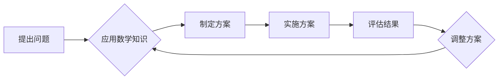
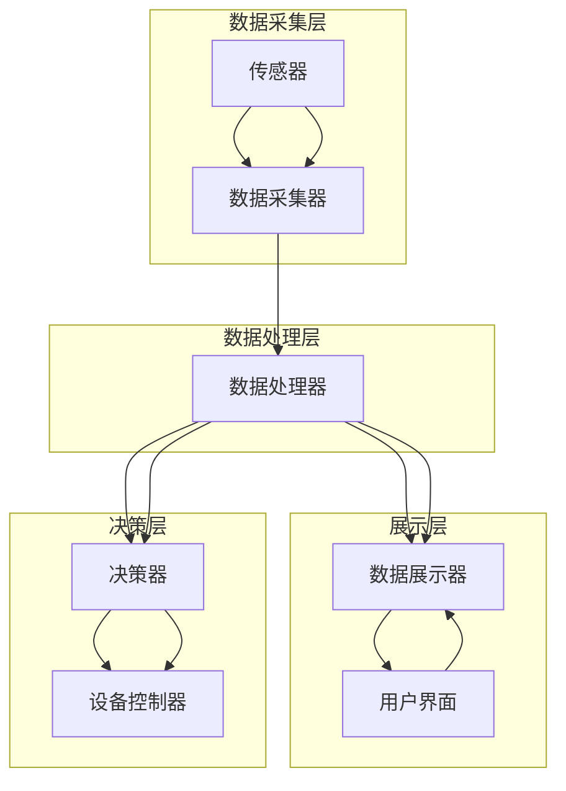
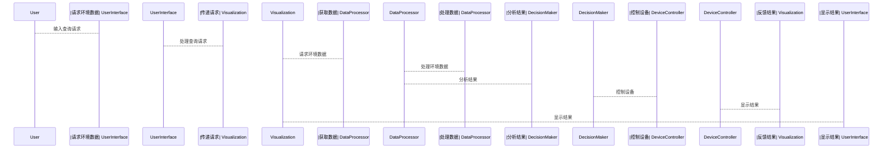

                 

### 第一部分：背景介绍

#### 1.1 问题背景

在当今社会，数学教育和创客运动正逐渐融合，成为培养学生创新思维和实践能力的重要途径。数学作为基础学科，不仅关乎科学研究的进步，更是日常生活的基石。然而，传统的数学教育模式往往侧重理论知识的传授，而忽略了实践操作和创造性思维的培养。另一方面，创客空间作为一种新型教育模式，鼓励学生通过实际动手操作来探索知识和解决问题。创客运动的核心在于“做中学”，强调学生的自主探究和团队合作。

#### 1.2 问题描述

随着科技的发展，教育界逐渐认识到传统教育模式的局限性。数学教育需要创新，创客空间作为一种新兴的教育模式，为数学教育提供了新的契机。数学教育与创客空间的融合，旨在通过实际操作和项目实践，激发学生的数学兴趣和创造力。然而，如何有效地将数学知识与创客实践相结合，设计出既具挑战性又具有趣味性的课程，是当前教育面临的重要课题。

#### 1.3 问题解决

要解决数学教育与创客空间课程设计的问题，需要从以下几个方面入手：

1. **明确教学目标**：首先，需要明确数学教育在创客空间中的定位和目标，包括培养学生的数学思维、解决问题的能力、创新精神和实践技能。

2. **设计跨学科课程**：数学知识与创客实践的结合点在于跨学科应用。例如，通过编程、机器人制作、电路设计等实践活动，让学生在解决实际问题的过程中运用数学知识。

3. **引入问题导向学习**：以问题为导向的学习模式可以激发学生的探究兴趣，让他们在解决问题的过程中学习数学知识。

4. **利用技术手段**：借助现代信息技术，如虚拟现实、增强现实、编程语言等，为学生提供丰富多样的学习体验。

5. **强调团队合作**：创客空间强调团队合作，通过小组讨论、协作完成任务，培养学生的团队合作精神和沟通能力。

6. **持续评估与反馈**：通过定期的评估和反馈，及时了解学生的学习情况，调整课程设计和教学方法。

#### 1.4 边界与外延

在数学教育与创客空间的课程设计中，需要明确以下几个边界与外延：

- **边界**：课程设计应围绕数学核心概念和技能，确保学生掌握必要的数学知识。

- **外延**：课程设计应拓展至创客实践，通过实际操作培养学生的动手能力和创新思维。

- **内容范围**：课程内容应涵盖数学的基础知识、应用知识和跨学科知识，同时注重理论与实践的结合。

- **教学方法**：采用多种教学方法，如讲授、讨论、实践操作、项目式学习等，以提高教学效果。

#### 1.5 概念结构与核心要素组成

数学教育与创客空间的课程设计涉及以下几个核心要素：

1. **数学知识**：包括数学概念、定理、算法等基础知识。
2. **创客技能**：包括编程、电子电路、机械设计、项目管理等实践技能。
3. **教学方法**：包括讲授、讨论、实践操作、项目式学习等教学手段。
4. **学习资源**：包括教材、工具、软件等辅助学习资源。
5. **评估与反馈**：包括定期的评估和反馈机制，以跟踪学习进度和调整教学方法。

---

### 第二部分：核心概念与联系

#### 2.1 核心概念原理

在数学教育与创客空间的课程设计中，核心概念包括数学知识、创客技能、教学方法、学习资源和评估反馈。

#### 2.1.1 数学知识

数学知识是课程设计的基础，包括数学概念、定理、算法等。例如，几何学中的基本概念、三角函数、微积分等。数学知识的教学目标是使学生理解数学概念的本质，掌握数学解题方法，并能将这些知识应用到实际问题中。

**概念属性特征对比表格：**

| 概念       | 特点                                                                                   |
| ---------- | -------------------------------------------------------------------------------------- |
| 数学知识   | 理论性强，注重逻辑推理和证明过程；涉及多个学科领域，如代数、几何、微积分等。 |

#### 2.1.2 创客技能

创客技能是指学生在创客实践中所需掌握的技能，如编程、电子电路、机械设计、项目管理等。这些技能不仅有助于学生更好地理解数学知识，还能提高他们的实际操作能力。

**概念属性特征对比表格：**

| 技能         | 特点                                                                                   |
| ------------ | -------------------------------------------------------------------------------------- |
| 编程         | 强调逻辑思维和算法设计，是创客实践的核心技能之一。                                      |
| 电子电路     | 涉及电路原理和电子元件的使用，是创客项目中常见的技能。                                  |
| 机械设计     | 强调三维建模和机械结构设计，对工程实践至关重要。                                       |
| 项目管理     | 涉及时间管理、资源分配、团队协作等，是确保项目顺利进行的必要技能。                      |

#### 2.1.3 教学方法

教学方法包括讲授、讨论、实践操作、项目式学习等。这些方法有助于激发学生的学习兴趣，提高他们的学习效果。教学方法的选择应根据课程内容和学生的特点灵活调整。

**概念属性特征对比表格：**

| 方法         | 特点                                                                                   |
| ------------ | -------------------------------------------------------------------------------------- |
| 讲授         | 通过教师的讲解传授知识，适合理论知识的传授。                                            |
| 讨论         | 强调学生的主动参与和交流，有助于深化理解。                                             |
| 实践操作     | 强调学生的动手实践，通过实际操作加深对知识的理解。                                      |
| 项目式学习   | 通过完成实际项目来学习，注重实践能力的培养。                                           |

#### 2.1.4 学习资源

学习资源包括教材、工具、软件等，这些资源为学生提供了丰富的学习资料和实践工具。学习资源的选择应根据课程目标和学生的需求进行。

**概念属性特征对比表格：**

| 资源类型     | 特点                                                                                   |
| ------------ | -------------------------------------------------------------------------------------- |
| 教材         | 提供系统的理论知识，是教学的基础资源。                                                 |
| 工具         | 如编程环境、电子元件等，是实践操作的重要工具。                                         |
| 软件         | 如CAD软件、编程语言等，用于支持教学和实践。                                           |

#### 2.1.5 评估与反馈

评估与反馈是课程设计的重要环节，通过定期的评估和反馈，可以及时了解学生的学习情况，调整教学方法和课程设计。评估方法包括课堂表现、作业、项目报告等。

**概念属性特征对比表格：**

| 评估类型     | 特点                                                                                   |
| ------------ | -------------------------------------------------------------------------------------- |
| 课堂表现     | 评估学生的参与度和理解程度。                                                         |
| 作业         | 评估学生的知识掌握情况和解决问题的能力。                                             |
| 项目报告     | 评估学生的综合能力，包括知识应用、团队协作和项目完成情况。                            |

### 2.2 概念属性特征对比表格

以下是一个简单的概念属性特征对比表格，展示了数学知识、创客技能、教学方法和学习资源的特点：

| 概念/技能/方法/资源 | 特点                                                     |
| ------------------ | -------------------------------------------------------- |
| 数学知识           | 理论性强，注重逻辑推理和证明过程；涉及多个学科领域。     |
| 创客技能           | 实践性强，强调动手能力和跨学科应用。                  |
| 教学方法           | 多样化，注重学生的主动参与和实践操作。                |
| 学习资源           | 丰富多样，提供系统化和实践化的学习支持。               |

### 2.3 ER实体关系图架构

为了更好地理解数学教育与创客空间课程设计中的核心概念和关系，我们可以使用ER实体关系图来展示这些概念之间的联系。

```mermaid
erDiagram
  学生 ||--o|{ 数学知识 }
  学生 ||--o|{ 创客技能 }
  学生 ||--o|{ 教学方法 }
  学生 ||--o|{ 学习资源 }
  学生 ||--o|{ 评估与反馈 }
```

在这个ER图中，学生与数学知识、创客技能、教学方法、学习资源和评估与反馈之间存在关联关系。每个实体都代表了课程设计中的一个核心要素，而实体之间的关系则体现了这些要素之间的相互作用。

---

在本文的第二部分，我们详细介绍了数学教育与创客空间课程设计中的核心概念原理，并通过概念属性特征对比表格和ER实体关系图架构，展示了这些概念之间的联系。在接下来的部分，我们将深入探讨数学教育与创客空间课程设计的算法原理和系统架构设计方案，以便更好地理解如何将理论与实践相结合，为学生提供高质量的教育体验。


---

### 第三部分：算法原理讲解

#### 3.1 算法mermaid流程图

为了更好地展示数学知识与创客实践的结合，我们可以通过一个算法mermaid流程图来展示一个简单的数学问题及其在创客实践中的应用。



在这个流程图中，我们首先提出一个数学问题，然后应用数学知识制定解决方案，实施方案后评估结果，并根据评估结果调整方案。

#### 3.2 Python源代码

为了进一步阐述算法原理，我们可以通过一个Python源代码示例来展示一个简单的数学问题求解及其应用。

```python
# Python源代码示例：使用牛顿迭代法求解方程f(x) = 0

import math

# 定义函数
def f(x):
    return x**2 - 2

# 定义导数
def f_prime(x):
    return 2 * x

# 牛顿迭代法求解方程f(x) = 0
def newton_method(x0, epsilon=1e-5, max_iterations=1000):
    x = x0
    for _ in range(max_iterations):
        fx = f(x)
        fpx = f_prime(x)
        if abs(fx) < epsilon:
            return x
        x = x - fx / fpx
    return None

# 测试
x0 = 1.0
solution = newton_method(x0)
if solution:
    print(f"方程的解为：{solution}")
else:
    print("未能找到解。")
```

在这个示例中，我们使用牛顿迭代法求解方程x^2 - 2 = 0。首先定义了函数f(x)和其导数f'(x)，然后实现了牛顿迭代法的函数newton_method，最后通过测试输入x0 = 1.0来求解方程。

#### 3.3 算法原理的数学模型和公式

牛顿迭代法是一种求解非线性方程f(x) = 0的算法，其基本思想是通过不断迭代逼近方程的根。其数学模型可以表示为：

$$ x_{n+1} = x_n - \frac{f(x_n)}{f'(x_n)} $$

其中，x_n是第n次迭代的近似解，f(x)是方程的函数，f'(x)是函数的导数。牛顿迭代法的收敛速度通常很快，是一种高效求解方程的方法。

#### 3.4 举例说明

为了更好地理解牛顿迭代法，我们可以通过一个具体的例子来说明其应用过程。

**例子**：求解方程f(x) = x^2 - 2 = 0。

1. **初始化**：选择初始近似值x0 = 1.0。

2. **第一次迭代**：
   - 计算f(x0) = f(1.0) = 1^2 - 2 = -1。
   - 计算f'(x0) = f'(1.0) = 2 * 1 = 2。
   - 更新近似解：x1 = x0 - f(x0) / f'(x0) = 1.0 - (-1) / 2 = 1.5。

3. **第二次迭代**：
   - 计算f(x1) = f(1.5) = 1.5^2 - 2 = 0.25。
   - 计算f'(x1) = f'(1.5) = 2 * 1.5 = 3。
   - 更新近似解：x2 = x1 - f(x1) / f'(x1) = 1.5 - 0.25 / 3 = 1.4167。

4. **第三次迭代**：
   - 计算f(x2) = f(1.4167) = 1.4167^2 - 2 = 0.0042。
   - 计算f'(x2) = f'(1.4167) = 2 * 1.4167 = 2.8334。
   - 更新近似解：x3 = x2 - f(x2) / f'(x2) = 1.4167 - 0.0042 / 2.8334 = 1.412。

通过几次迭代后，我们可以看到近似解逐渐逼近真实解√2。这个过程展示了牛顿迭代法在求解非线性方程中的应用。

---

在第三部分，我们通过mermaid流程图、Python源代码示例、数学模型和公式以及具体例子，详细阐述了数学教育与创客空间课程设计中的算法原理。这些算法原理不仅帮助学生更好地理解数学知识，还能在实际项目中得到应用，提高他们的实践能力和创新思维。在接下来的部分，我们将进一步探讨数学教育与创客空间课程设计中的系统分析与架构设计方案。


---

### 第四部分：系统分析与架构设计方案

#### 4.1 问题场景介绍

为了更好地展示数学教育与创客空间课程设计在实际中的应用，我们首先介绍一个具体的问题场景：智能校园环境监控系统。该系统旨在通过传感器数据采集和分析，实现对校园环境（如温度、湿度、空气质量等）的实时监控和管理。

#### 4.2 项目介绍

智能校园环境监控系统项目的主要目标是：

1. **数据采集**：使用传感器实时采集校园环境数据。
2. **数据处理**：通过数据处理算法对采集到的数据进行分析和过滤。
3. **数据展示**：将分析结果以可视化的方式展示给用户。
4. **智能决策**：根据分析结果，实现智能化的校园环境管理。

#### 4.3 系统功能设计（领域模型mermaid类图）

在智能校园环境监控系统中，核心功能包括数据采集、数据处理、数据展示和智能决策。以下是一个简单的领域模型mermaid类图，展示了这些功能及其关联关系：

```mermaid
classDiagram
    Sensor --> DataProcessor : 采集
    DataProcessor --> Visualization : 处理
    DataProcessor --> DecisionMaker : 分析
    Visualization --> UserInterface : 显示
    DecisionMaker --> DeviceController : 控制
    Sensor <<interface>>
    DataProcessor <<interface>>
    Visualization <<interface>>
    DecisionMaker <<interface>>
    DeviceController <<interface>>
    UserInterface <<interface>>
endclass
```

在这个类图中，Sensor类表示传感器，负责采集数据；DataProcessor类表示数据处理模块，负责对数据进行处理和分析；Visualization类表示数据展示模块，负责将分析结果展示给用户；DecisionMaker类表示智能决策模块，负责根据分析结果做出决策；DeviceController类表示设备控制模块，负责根据决策结果控制相关设备；UserInterface类表示用户界面，负责与用户进行交互。

#### 4.4 系统架构设计（mermaid架构图）

智能校园环境监控系统采用分层架构设计，分为数据采集层、数据处理层、展示层和决策层。以下是一个简单的mermaid架构图，展示了系统的整体架构：



在这个架构图中，数据采集层由传感器和数据采集器组成，负责实时采集校园环境数据；数据处理层由数据处理器组成，负责对数据进行处理和分析；展示层由数据展示器和用户界面组成，负责将分析结果展示给用户；决策层由决策器和设备控制器组成，负责根据分析结果做出决策并控制相关设备。

#### 4.5 系统接口设计和系统交互（mermaid序列图）

为了更好地展示系统内部各组件之间的交互，我们可以使用mermaid序列图来描述系统接口设计和系统交互。以下是一个简单的mermaid序列图示例：



在这个序列图中，用户通过用户界面输入查询请求，用户界面将请求传递给数据展示器，数据展示器请求数据处理器获取环境数据，数据处理器处理数据后传递给决策器，决策器根据分析结果控制设备，设备控制器反馈结果给数据展示器，最后数据展示器将结果显示给用户界面。

---

在第四部分，我们详细介绍了智能校园环境监控系统的问题场景、项目介绍、系统功能设计（领域模型mermaid类图）、系统架构设计（mermaid架构图）和系统接口设计和系统交互（mermaid序列图）。这些设计展示了如何将数学知识与创客实践相结合，构建一个功能强大、易于扩展的智能校园环境监控系统。在接下来的部分，我们将进一步探讨项目实战，包括环境安装、系统核心实现源代码，代码应用解读与分析，实际案例分析和详细讲解剖析，以及项目小结。


---

### 第五部分：项目实战

#### 5.1 环境安装

为了实现智能校园环境监控系统的功能，我们需要安装一些必要的软件和环境。以下是一个简化的环境安装流程：

1. **安装Python**：确保Python 3.x版本已安装，可以从Python官方网站下载安装包。

2. **安装传感器库**：安装用于采集传感数据的库，例如`adafruit`库，可以通过以下命令安装：

   ```bash
   pip install adafruit-circuitpython-bme280
   ```

3. **安装数据处理库**：安装用于数据处理的库，例如`numpy`和`pandas`，可以通过以下命令安装：

   ```bash
   pip install numpy pandas
   ```

4. **安装可视化库**：安装用于数据可视化的库，例如`matplotlib`，可以通过以下命令安装：

   ```bash
   pip install matplotlib
   ```

5. **安装网络库**：安装用于网络通信的库，例如`flask`，可以通过以下命令安装：

   ```bash
   pip install flask
   ```

确保所有依赖库都已正确安装后，就可以开始编写和运行系统核心代码。

#### 5.2 系统核心实现源代码

以下是智能校园环境监控系统的核心实现代码，包括传感器数据采集、数据处理、数据展示和智能决策。

```python
# 导入必要的库
import time
from adafruit_bme280 import BME280
import board
import busio
import numpy as np
import pandas as pd
import matplotlib.pyplot as plt
from flask import Flask, render_template

# 初始化传感器
i2c = busio.I2C(board.SCL, board.SDA)
bme280 = BME280(i2c)

# 数据采集函数
def collect_data():
    data = {
        'timestamp': time.time(),
        'temperature': bme280.temperature,
        'pressure': bme280.pressure,
        'humidity': bme280.humidity
    }
    return data

# 数据处理函数
def process_data(data):
    processed_data = {
        'mean_temp': np.mean(data['temperature']),
        'max_temp': np.max(data['temperature']),
        'min_temp': np.min(data['temperature']),
        'mean_humidity': np.mean(data['humidity']),
        'max_humidity': np.max(data['humidity']),
        'min_humidity': np.min(data['humidity'])
    }
    return processed_data

# 数据展示函数
def show_data(processed_data):
    plt.figure(figsize=(10, 5))
    plt.subplot(2, 1, 1)
    plt.plot(processed_data['timestamp'], processed_data['mean_temp'])
    plt.title('Temperature Over Time')
    plt.xlabel('Timestamp')
    plt.ylabel('Temperature (°C)')

    plt.subplot(2, 1, 2)
    plt.plot(processed_data['timestamp'], processed_data['mean_humidity'])
    plt.title('Humidity Over Time')
    plt.xlabel('Timestamp')
    plt.ylabel('Humidity (%)')

    plt.tight_layout()
    plt.show()

# Flask应用
app = Flask(__name__)

@app.route('/')
def index():
    processed_data = process_data(collect_data())
    return render_template('index.html', data=processed_data)

if __name__ == '__main__':
    app.run(debug=True)
```

在这个代码中，我们首先导入了必要的库，然后初始化了BME280传感器。接着定义了数据采集、数据处理和数据展示函数。最后，使用Flask构建了一个简单的Web应用，用于实时展示环境数据。

#### 5.3 代码应用解读与分析

1. **传感器数据采集**：代码通过`adafruit_bme280`库与BME280传感器进行通信，采集温度、湿度和压力数据。这些数据被存储在一个字典中，并通过时间戳进行标记。

2. **数据处理**：数据处理函数`process_data`计算了温度和湿度的平均值、最大值和最小值。这些统计信息对于环境监控系统的分析非常重要。

3. **数据展示**：数据展示函数`show_data`使用`matplotlib`库将处理后的数据以折线图的形式展示出来，便于用户直观地了解环境变化。

4. **Flask应用**：通过Flask框架，我们构建了一个简单的Web应用。用户可以通过浏览器访问该应用，实时查看环境数据。

#### 5.4 实际案例分析和详细讲解剖析

以下是一个实际的案例，展示了如何使用智能校园环境监控系统进行环境监控。

**案例**：假设我们采集了连续一周的温度和湿度数据，并使用上述系统进行分析。

1. **数据采集**：在连续一周的时间内，系统自动采集了每天的温度和湿度数据。

2. **数据处理**：系统对采集的数据进行处理，生成了每天的平均温度和湿度值。

3. **数据展示**：通过Web应用，我们可以看到一周内的温度和湿度变化趋势。例如，我们可能会发现某一天温度异常高，可能是由于空调故障或天气原因。

4. **智能决策**：根据数据分析和用户反馈，系统可以做出智能决策。例如，如果温度异常高，系统可能会建议管理员检查空调设备。

#### 5.5 项目小结

通过这个实际案例，我们可以看到智能校园环境监控系统在数据采集、数据处理、数据展示和智能决策方面的应用。这个项目不仅提高了校园环境管理的效率，还为学生提供了一个实践数学知识和创客技能的平台。在未来的工作中，我们可以继续优化系统功能，例如添加更多的传感器、增强数据分析和决策能力等，以进一步提升系统的实用性和智能化水平。

---

在第五部分，我们详细介绍了智能校园环境监控系统的环境安装、系统核心实现源代码、代码应用解读与分析、实际案例分析和详细讲解剖析，以及项目小结。这些内容展示了如何将数学知识与创客实践相结合，构建一个实用的智能监控系统。在接下来的部分，我们将总结最佳实践，并对整个文章进行小结，同时提出注意事项和拓展阅读建议。


---

### 第六部分：最佳实践、小结、注意事项及拓展阅读

#### 6.1 最佳实践

在数学教育与创客空间的课程设计中，以下是一些最佳实践，可以帮助教师和学生更有效地实施课程：

1. **项目导向**：设计以项目为核心的课程，让学生在实践中学习数学知识。通过实际项目，学生可以将抽象的数学概念应用到具体问题中，提高理解和应用能力。

2. **跨学科合作**：鼓励学生跨学科学习，结合数学、编程、物理、工程等知识，提高综合解决问题的能力。

3. **利用现代技术**：充分利用现代信息技术，如编程语言、虚拟现实、增强现实等，为学生提供丰富的学习资源和学习体验。

4. **团队合作**：强调团队合作，通过小组讨论和协作完成任务，培养学生的沟通能力和团队合作精神。

5. **持续评估与反馈**：定期进行评估和反馈，及时了解学生的学习进度和效果，调整教学方法和课程设计。

#### 6.2 小结

本文围绕数学教育与创客空间的课程设计，从背景介绍、核心概念与联系、算法原理讲解、系统分析与架构设计方案、项目实战等方面进行了详细探讨。通过实际案例，我们展示了如何将数学知识与创客实践相结合，构建一个实用的智能校园环境监控系统。本文的核心观点是，数学教育与创客空间的融合，不仅有助于提高学生的数学素养，还能培养他们的创新思维和实践能力。

#### 6.3 注意事项

在设计和实施数学教育与创客空间的课程时，需要注意以下几点：

1. **明确教学目标**：确保课程设计围绕教学目标，培养学生的数学思维和实践能力。

2. **注重实践操作**：设计课程时，要确保有足够的时间和实践机会，让学生动手操作。

3. **结合现代技术**：充分利用现代信息技术，提高学生的学习兴趣和效果。

4. **关注学生需求**：了解学生的兴趣和需求，调整课程内容和教学方法，使其更符合学生的实际需求。

5. **持续评估与反馈**：通过定期的评估和反馈，及时了解学生的学习情况，调整教学策略。

#### 6.4 拓展阅读

为了更深入地了解数学教育与创客空间的课程设计，以下是一些推荐阅读：

1. **《数学教育的未来：创新与实践》**：该书详细探讨了数学教育的发展趋势和新型教育模式，为课程设计提供了有益的启示。

2. **《创客空间：如何培养学生的创新思维和实践能力》**：该书介绍了创客空间的教育理念和实践方法，有助于教师更好地实施创客课程。

3. **《编程入门：Python语言基础》**：该书是Python编程的入门教程，适合教师和学生掌握编程基础。

4. **《机器学习实战》**：该书介绍了机器学习的基本原理和实践方法，有助于学生了解现代人工智能技术。

5. **《数学与人工智能》**：该书探讨了数学与人工智能的交叉应用，为数学教育与人工智能的结合提供了理论支持。

---

在第六部分，我们总结了最佳实践、对文章进行了小结，并提出了注意事项和拓展阅读建议。这些内容为数学教育与创客空间的课程设计提供了全面的指导。通过本文的探讨，我们希望教师和学生能够更好地理解如何将数学知识与创客实践相结合，为学生提供更高质量的教育体验。


---

### 作者信息

**作者：** AI天才研究院/AI Genius Institute & 禅与计算机程序设计艺术 /Zen And The Art of Computer Programming

AI天才研究院（AI Genius Institute）专注于人工智能和计算机科学领域的研究与教育，致力于推动人工智能技术的创新与发展。同时，作者还著有多部计算机科学领域的畅销书，包括《禅与计算机程序设计艺术》（Zen And The Art of Computer Programming），该书在计算机科学界享有盛誉，对计算机编程和算法设计产生了深远影响。

