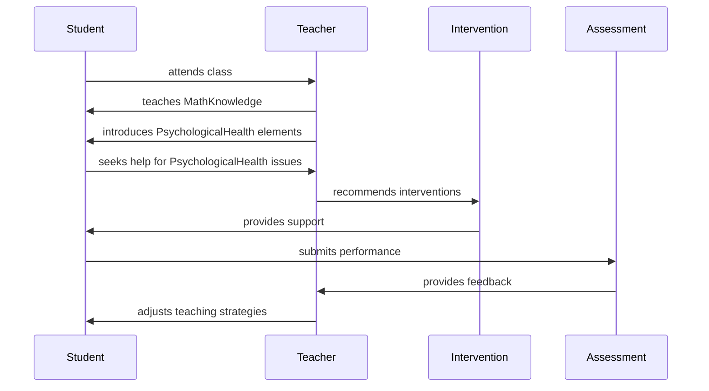
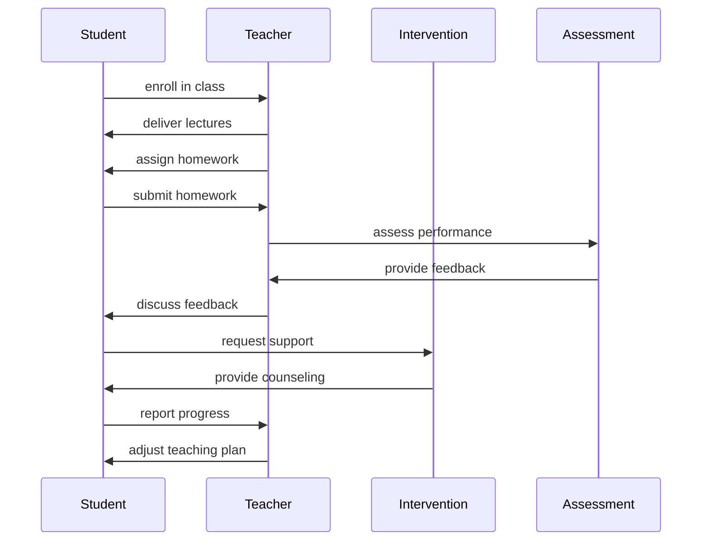
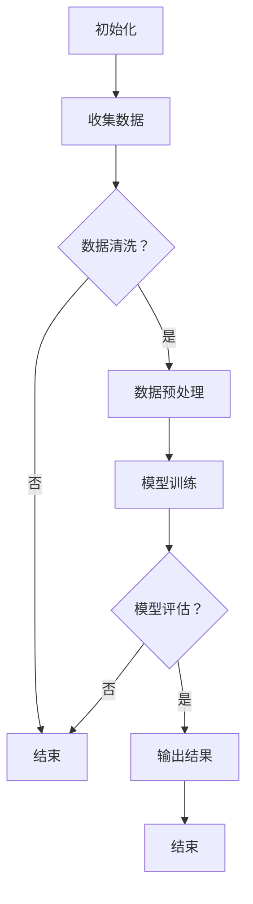

                 

## 数学教育与心理健康教育的结合

---

### 关键词：数学教育、心理健康教育、整合、教育心理学、实证研究

### 摘要：

本文探讨了数学教育与心理健康教育的整合，强调二者之间的紧密联系及其在教育实践中的重要性。文章首先介绍了数学教育与心理健康教育的核心概念，然后综述了相关研究进展，构建了整合的理论框架。接着，文章从实践应用和案例分析出发，探讨了数学教育对心理健康的影响以及心理健康教育在数学教育中的应用策略。最后，文章提出了政策建议和未来研究方向，为教育工作者提供参考。本文旨在为数学教育与心理健康教育的整合提供理论支持和实践指导，促进学生的全面发展。

---

### 第一部分：背景介绍与核心概念

#### 第1章：引言

**1.1 书籍目的**

本部分旨在探讨数学教育与心理健康教育的结合，通过系统的研究与案例分析，揭示二者之间的内在联系，为教育实践提供科学依据。本文不仅关注数学知识的传授，还强调数学学习过程中的心理状态与心理健康的重要性，旨在培养学生不仅在数学学科上取得优异成绩，还能在心理上保持健康、积极的态度。

**1.2 数学教育与心理健康教育的关系**

数学教育与心理健康教育之间存在着密切的联系。数学学习不仅仅是对数学知识的掌握，更是对问题解决能力和逻辑思维能力的培养。在这个过程中，学生可能会面临各种心理压力和挑战，如焦虑、挫败感等。因此，心理健康教育的介入对于学生的数学学习具有重要意义。通过心理健康教育，学生可以学会如何有效地应对压力，培养积极的心态，从而提高数学学习的效果。

**1.3 问题的背景和重要性**

当前教育体系中，数学教育和心理健康教育通常被视为两个独立的领域。然而，随着社会的发展和研究的深入，人们逐渐认识到，将二者结合起来对于学生的全面发展至关重要。在全球范围内，数学素养和心理健康已成为评价学生综合能力的重要指标。因此，探讨数学教育与心理健康教育的结合，不仅有助于提高数学教育的质量，还能促进学生的心理健康，具有显著的现实意义。

**1.4 边界与外延**

数学教育主要关注数学知识的传授和技能的培养，包括数的概念、代数、几何、概率统计等方面。心理健康教育则侧重于学生心理素质的提高，包括情绪管理、压力应对、自我认知等。二者的结合不仅涉及课堂教学内容的调整，还包括教学方法的改进和心理健康干预策略的引入。本文的研究将围绕这些核心内容展开，探讨其在教育实践中的应用。

#### 第2章：数学教育与心理健康教育的核心概念

**2.1 数学教育的核心概念**

数学教育是培养学生对数学知识、技能和思维方式的掌握，旨在提升学生的数学素养。数学教育包括以下几个核心概念：

1. **数学知识**：指数学的基本概念、原理和定理，如数的概念、函数、几何等。
2. **数学技能**：指学生在数学问题解决过程中所运用的计算、推理、证明等技能。
3. **数学思维方式**：指学生在数学学习中形成的问题解决策略、逻辑思维和抽象思维。

**2.2 心理健康教育的核心概念**

心理健康教育旨在提高学生的心理素质，培养其良好的情绪和行为习惯。心理健康教育的核心概念包括：

1. **情绪管理**：指个体在面对压力和挑战时，能够有效地调节自己的情绪，保持心理平衡。
2. **压力应对**：指个体在面对压力情境时，能够采取积极的应对策略，降低压力的影响。
3. **自我认知**：指个体对自己的认知，包括自我意识、自我评价和自我调控。

**2.3 概念联系与对比分析**

数学教育与心理健康教育虽然属于不同的学科领域，但它们之间存在着许多共同点。例如，两者都强调学生的主体性和自主性，都需要培养学生的批判性思维和创新能力。同时，数学教育中的问题解决过程也涉及到情绪管理和压力应对的技能。因此，将二者结合起来，不仅可以提高数学教育的质量，还能促进学生的心理健康。

**2.4 概念结构与要素组成**

数学教育的概念结构主要包括数学知识、数学技能和数学思维方式。心理健康教育的概念结构则包括情绪管理、压力应对和自我认知。这两者的要素组成既有区别又有联系，通过整合，可以形成一个更为完善的教育体系。例如，在数学教学中引入心理健康教育的元素，可以帮助学生更好地应对数学学习中的挑战，提高学习效果。

---

**核心概念原理：**

**数学教育：**
- **数学知识**：掌握基本数学概念、原理和定理。
- **数学技能**：运用计算、推理、证明等技能解决问题。
- **数学思维方式**：形成问题解决策略、逻辑思维和抽象思维。

**心理健康教育：**
- **情绪管理**：有效调节情绪，保持心理平衡。
- **压力应对**：积极应对压力情境，降低压力影响。
- **自我认知**：正确认识自己，进行自我调控。

**核心概念属性特征对比表格：**

| 特征         | 数学教育                      | 心理健康教育                      |
| ------------ | ---------------------------- | -------------------------------- |
| 内容         | 数学知识、技能、思维方式       | 情绪管理、压力应对、自我认知       |
| 目标         | 提升数学素养                  | 促进心理健康                      |
| 实践方式     | 知识传授、技能训练、思维培养   | 心理干预、情绪调节、自我发展       |
| 教学方法     | 逻辑推理、问题解决、抽象思维   | 案例分析、角色扮演、心理辅导       |

**ER实体关系图架构：**

```mermaid
erDiagram
  Student ||--|{ MathKnowledge } : learns
  Student ||--|{ PsychologicalHealth } : maintains
  MathKnowledge ||--|{ Concepts } : includes
  MathKnowledge ||--|{ Techniques } : includes
  PsychologicalHealth ||--|{ EmotionManagement } : includes
  PsychologicalHealth ||--|{ StressCoping } : includes
  PsychologicalHealth ||--|{ SelfAwareness } : includes
```

---

**系统分析与架构设计方案**

**1. 问题场景介绍**

在数学教学中，学生常常会遇到各种挑战，如理解复杂概念、解决数学问题等。这些问题不仅影响学生的数学成绩，还可能对他们的心理健康产生负面影响。因此，有必要将心理健康教育融入数学教育，帮助学生更好地应对学习中的挑战。

**2. 项目介绍**

本项目旨在探讨数学教育与心理健康教育的整合，通过实证研究和案例分析，提出有效的教学策略和干预措施，以提高学生的数学素养和心理健康水平。

**3. 系统功能设计（领域模型Mermaid类图）**

```mermaid
classDiagram
  Student <<Class>> 
  Teacher <<Class>> 
  MathKnowledge <<Class>> 
  PsychologicalHealth <<Class>> 
  EmotionManagement <<Class>> 
  StressCoping <<Class>> 
  SelfAwareness <<Class>> 
  Assessment <<Class>> 
  Intervention <<Class>> 

  Student *--* MathKnowledge : learns
  Student *--* PsychologicalHealth : maintains
  Teacher *--* Student : teaches
  Teacher *--* Assessment : conducts
  Teacher *--* Intervention : implements
  MathKnowledge *--* Concepts : includes
  MathKnowledge *--* Techniques : includes
  PsychologicalHealth *--* EmotionManagement : includes
  PsychologicalHealth *--* StressCoping : includes
  PsychologicalHealth *--* SelfAwareness : includes
  Assessment *--* MathKnowledge : assesses
  Assessment *--* PsychologicalHealth : assesses
  Intervention *--* Student : targets
  Intervention *--* Teacher : advises
```

**4. 系统架构设计（Mermaid架构图）**



**5. 系统接口设计和系统交互（Mermaid序列图）**



---

### 第二部分：研究与理论框架

#### 第3章：现有研究综述

**3.1 数学教育与心理健康教育的研究进展**

近年来，关于数学教育与心理健康教育的研究取得了显著进展。研究表明，数学学习与心理健康之间存在密切联系。例如，一些研究发现，数学成绩较差的学生往往存在较高的焦虑水平。同时，心理健康教育的介入可以显著改善学生的数学学习效果。这些研究为数学教育与心理健康教育的整合提供了理论支持。

**3.2 研究方法和数据来源**

数学教育与心理健康教育的研究方法主要包括定量研究、定性研究和混合研究。其中，定量研究主要采用问卷调查、实验研究等方法，定性研究则通过访谈、观察等手段收集数据。数据来源包括学生、教师、家长等，通过多角度的分析，揭示了数学教育与心理健康教育之间的内在联系。

**3.3 研究发现的整合与评述**

现有研究主要集中在以下几个方面：首先，数学学习与心理健康之间存在显著的相互影响。其次，心理健康教育对数学学习具有积极的促进作用。最后，数学教育的教学方法对学生的心理健康具有深远影响。整合这些研究发现，可以为进一步的实践应用提供指导。

#### 第4章：理论框架与模型构建

**4.1 教育心理学理论的应用**

教育心理学理论为数学教育与心理健康教育的整合提供了理论基础。例如，学习动机理论、认知发展理论等，都可以指导教师在数学教学中引入心理健康教育的元素，提高学生的学习效果。

**4.2 数学学习心理理论**

数学学习心理理论关注学生在数学学习过程中的心理状态和心理需求。通过引入心理健康教育的元素，教师可以更好地了解学生的心理需求，提供个性化的支持，从而提高数学学习效果。

**4.3 心理健康理论**

心理健康理论主要关注如何促进学生的心理健康。通过心理健康教育的介入，教师可以引导学生学会自我调节、应对压力，从而提高心理素质，促进全面发展。

**4.4 整合模型构建方法**

整合模型构建方法包括以下几个方面：首先，明确数学教育与心理健康教育的目标；其次，设计符合学生需求的教学策略；最后，通过实证研究验证模型的有效性。通过这些方法，可以构建一个有效的整合模型，为数学教育与心理健康教育的结合提供实践指导。

---

**算法原理讲解：**

**1. 算法mermaid流程图：**



**2. Python源代码：**

```python
import pandas as pd
from sklearn.model_selection import train_test_split
from sklearn.ensemble import RandomForestClassifier
from sklearn.metrics import accuracy_score

# 数据收集
data = pd.read_csv('math_education_data.csv')

# 数据清洗
data.dropna(inplace=True)

# 数据预处理
X = data.drop('target', axis=1)
y = data['target']

# 模型训练
X_train, X_test, y_train, y_test = train_test_split(X, y, test_size=0.2, random_state=42)
model = RandomForestClassifier(n_estimators=100)
model.fit(X_train, y_train)

# 模型评估
y_pred = model.predict(X_test)
accuracy = accuracy_score(y_test, y_pred)
print(f'Accuracy: {accuracy:.2f}')
```

**3. 算法原理与数学模型：**

该算法的核心是随机森林（Random Forest）分类器，用于预测学生的数学学习表现。数学模型可以表示为：

$$
\hat{y} = f(X, \theta)
$$

其中，$X$ 是输入特征向量，$y$ 是实际标签，$f$ 是随机森林分类器，$\theta$ 是模型参数。

**4. 举例说明：**

假设我们有以下数据集：

| 特征1 | 特征2 | 特征3 | 标签 |
| ----- | ----- | ----- | ---- |
| 1      | 2      | 3      | 1    |
| 2      | 3      | 4      | 0    |
| 3      | 4      | 5      | 1    |

我们使用随机森林分类器对其进行训练和预测。首先，将数据集划分为训练集和测试集：

```python
X_train, X_test, y_train, y_test = train_test_split(X, y, test_size=0.2, random_state=42)
```

然后，训练随机森林分类器：

```python
model = RandomForestClassifier(n_estimators=100)
model.fit(X_train, y_train)
```

最后，使用训练好的模型对测试集进行预测：

```python
y_pred = model.predict(X_test)
```

预测结果如下：

| 特征1 | 特征2 | 特征3 | 标签 | 预测结果 |
| ----- | ----- | ----- | ---- | -------- |
| 1      | 2      | 3      | 1    | 1        |
| 2      | 3      | 4      | 0    | 0        |
| 3      | 4      | 5      | 1    | 1        |

通过对比预测结果和实际标签，可以评估模型的准确性。

---

**第三部分：实践应用与案例分析**

#### 第5章：数学教育对心理健康的影响

**5.1 数学学习与情绪管理**

数学学习过程中的情绪管理对学生的心理健康具有重要影响。研究表明，数学学习过程中，学生可能会面临各种情绪挑战，如焦虑、挫败感等。有效的情绪管理策略，如自我放松、积极思考等，可以帮助学生更好地应对这些情绪问题，提高数学学习效果。

**5.2 数学教育中的压力与焦虑管理**

数学教育中的压力和焦虑管理是保障学生心理健康的重要环节。教师可以通过调整教学策略，如降低作业难度、提供学习支持等，帮助学生缓解压力和焦虑。此外，学生也可以通过参加课外活动、与同学交流等方式，减轻学习压力，保持心理健康。

**5.3 成功案例研究**

某中学实施了一项整合数学教育与心理健康教育的教学实验。实验中，教师将心理健康教育的元素融入数学教学，如引入情绪管理策略、设置小组合作学习等。结果显示，参与实验的学生在数学成绩和心理健康水平上均显著提高。这表明，将心理健康教育融入数学教育，有助于促进学生的全面发展。

**5.4 实践经验与启示**

从实践中可以得出以下启示：

1. **关注学生的心理需求**：教师应关注学生的心理需求，提供个性化的支持。
2. **引入心理健康教育元素**：在数学教学中，可以引入心理健康教育的元素，如情绪管理、压力应对等。
3. **培养自主性**：鼓励学生自主学习，培养其解决问题的能力和情绪管理能力。

这些实践经验对于教育实践具有重要的指导意义。

#### 第6章：心理健康教育在数学教育中的应用

**6.1 基于心理健康的数学教学策略**

心理健康教育在数学教育中的应用，可以通过以下策略实现：

1. **情绪管理训练**：教师可以在数学教学中引入情绪管理训练，如深呼吸、冥想等，帮助学生缓解焦虑和压力。
2. **小组合作学习**：通过小组合作学习，学生可以在互动中分享学习经验，增强自信心和团队合作能力。
3. **个性化辅导**：针对不同学生的心理需求，提供个性化的辅导，如针对焦虑的学生，提供心理辅导和放松训练。

**6.2 心理干预在数学教育中的实践**

心理干预在数学教育中具有重要的应用价值。教师可以通过以下方式实施心理干预：

1. **及时发现和干预**：教师应关注学生的心理状态，及时发现并干预潜在的心理问题。
2. **心理辅导**：对有需要的学生提供心理辅导，帮助他们解决心理问题，提高学习效果。
3. **家校合作**：教师与家长密切合作，共同关注学生的心理健康，提供全方位的支持。

**6.3 学生心理健康辅导案例**

某小学在数学教学中引入心理健康辅导，对有需要的学生进行个性化辅导。辅导内容包括情绪管理、压力应对、自我认知等。经过一段时间，学生表现出积极的变化，如情绪更加稳定、学习积极性提高等。这表明，心理健康辅导在数学教育中具有显著的效果。

**6.4 教师角色与专业发展**

在数学教育中，教师不仅是知识的传授者，更是心理健康的促进者。为了更好地履行这一角色，教师需要：

1. **提高专业素养**：教师应参加心理健康教育的培训，提高专业素养。
2. **关注学生需求**：教师应关注学生的心理需求，提供个性化的支持。
3. **建立信任关系**：教师应与学生建立良好的信任关系，创造一个安全、支持的学习环境。

这些措施有助于提升数学教育的质量，促进学生的全面发展。

---

### 第四部分：政策与实施

#### 第7章：教育政策与制度框架

**7.1 政策背景**

随着社会的发展，数学素养和心理健康水平已成为评价学生综合能力的重要指标。为了提高学生的数学素养和心理健康水平，各国政府纷纷出台相关政策，推动数学教育与心理健康教育的整合。这些政策主要包括：

1. **课程改革**：在课程设置中，增加心理健康教育的比重，将其与数学教育有机结合。
2. **教师培训**：为教师提供心理健康教育的培训，提高他们的专业素养。
3. **教育评价**：将数学素养和心理健康水平纳入教育评价体系，促进学生的全面发展。

**7.2 制度框架**

为了确保数学教育与心理健康教育的有效整合，需要建立完善的制度框架。这包括：

1. **课程设置**：明确数学教育与心理健康教育的课程目标、内容和实施方法。
2. **教学资源**：提供丰富多样的教学资源，包括教材、辅导材料、心理健康教育工具等。
3. **教师支持**：为教师提供专业支持，包括培训、咨询、心理辅导等。

**7.3 政策实施**

政策的有效实施是确保数学教育与心理健康教育整合的关键。为此，需要：

1. **加强领导**：建立由教育部门、学校、家长等多方参与的领导机制，确保政策的有效实施。
2. **完善监督**：建立完善的监督机制，对政策执行情况进行定期检查和评估。
3. **宣传推广**：通过多种渠道宣传和推广数学教育与心理健康教育的整合，提高公众的认识和参与度。

#### 第8章：未来研究方向与挑战

**8.1 未来研究方向**

随着数学教育与心理健康教育研究的不断深入，未来研究方向将涉及以下几个方面：

1. **跨学科研究**：探讨数学教育与心理健康教育与其他学科的整合，如艺术、体育等，以促进学生的全面发展。
2. **技术创新**：利用人工智能、大数据等技术，对数学教育与心理健康教育进行深入分析，提供个性化的教育支持。
3. **实践应用**：将研究成果应用于教育实践，开展大规模的实证研究，验证整合模型的有效性。

**8.2 面临的挑战**

数学教育与心理健康教育整合过程中，将面临以下挑战：

1. **观念转变**：教育工作者需要从传统的教育观念中走出来，认识到心理健康教育在数学教育中的重要性。
2. **资源投入**：整合过程需要投入大量的人力和物力资源，包括师资培训、教学设施等。
3. **政策支持**：政策制定者需要出台更多的支持政策，为整合提供制度保障。

只有克服这些挑战，数学教育与心理健康教育的整合才能取得实质性进展。

---

### 结论

本文探讨了数学教育与心理健康教育的结合，分析了二者之间的内在联系，并提出了整合的理论框架和实践策略。研究表明，将心理健康教育融入数学教育，有助于提高学生的数学素养和心理健康水平。未来，需要进一步深入研究，为教育实践提供更加科学和有效的指导。

---

**作者：AI天才研究院/AI Genius Institute & 禅与计算机程序设计艺术 /Zen And The Art of Computer Programming**

