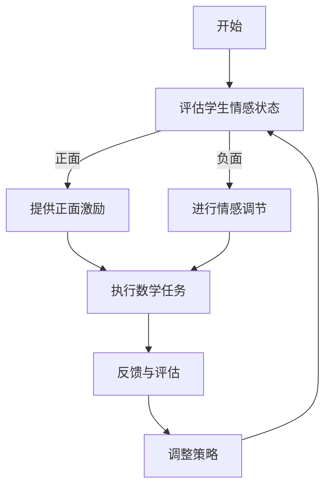
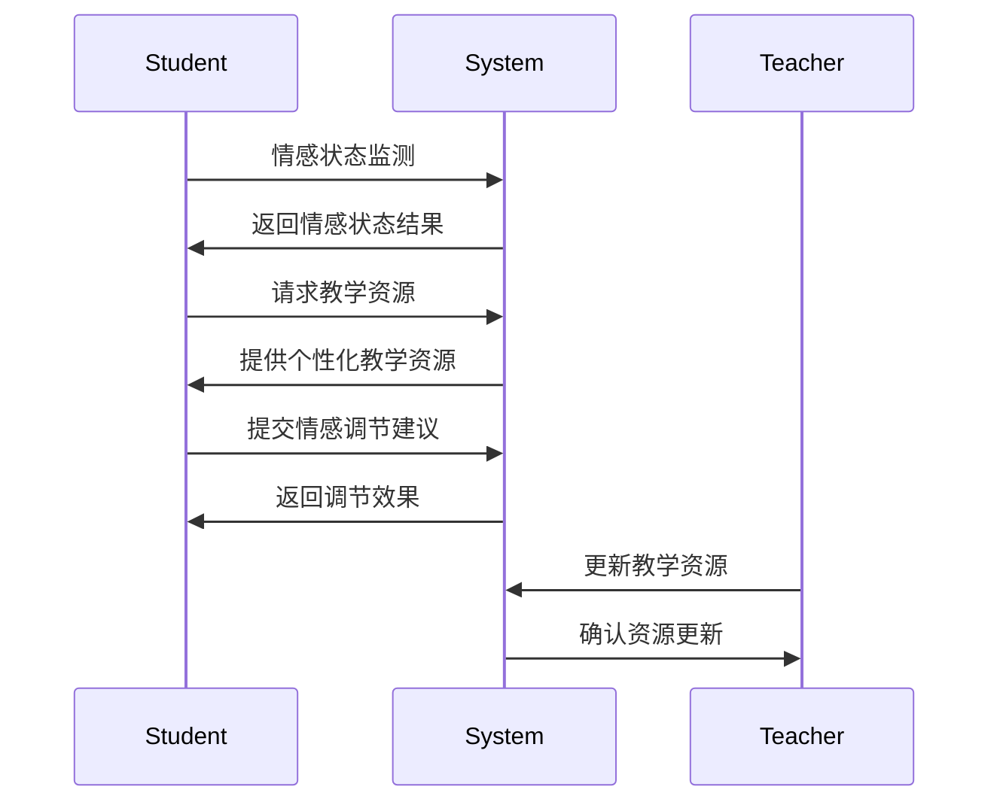

                 

# 数学教育与情感教育的结合策略

## 关键词

数学教育、情感教育、结合策略、教学设计、学生发展

## 摘要

本文探讨了数学教育与情感教育的结合策略，旨在为学生提供更加全面的教育体验。通过分析数学教育和情感教育的核心概念及其现状，本文提出了结合两者的关键步骤和策略。首先，我们明确了数学教育和情感教育的核心概念，并对比了它们的不同特征。接着，我们运用实体关系图（ER图）展示了结合策略的实体关系。随后，本文通过详细的算法原理讲解、数学模型和公式阐述，以及实际案例的说明，展示了如何有效地将数学教育与情感教育相结合。最后，本文总结了最佳实践建议，并提供了拓展阅读的方向。通过这些策略，我们可以期待培养出既具备数学思维能力，又拥有积极情感态度的学生。

## 标题与概述

### 书名：《数学教育与情感教育的结合策略》

### 目标读者

本书旨在为教育工作者、数学教师、心理学专家以及关注学生全面发展的家长提供实用的指导。对于那些希望提高学生学习效果，促进学生身心健康发展的教育者，本书提供了深入的理论和实践建议。

### 书籍主题

本书的核心主题是探讨如何将数学教育与情感教育相结合，以实现更加全面、有效、有趣的教学方式。通过系统地分析数学教育和情感教育的核心概念，以及结合两者的一系列策略和方法，本书旨在为教育者提供实际可行的操作指南。

### 书籍目标

本书的主要目标是：

1. **提升学生数学学习兴趣**：通过情感教育的融入，激发学生对数学的兴趣和热情。
2. **培养积极的情感态度**：帮助学生建立积极的情感态度，增强自信心和自我认同感。
3. **提供教育实践指导**：为教育者提供具体的教学设计和方法，以实现数学教育与情感教育的有机结合。
4. **促进学生全面发展**：通过结合数学和情感教育，促进学生智力、情感和人格的全面发展。

## 背景介绍

### 数学教育的概念与现状

数学教育是一种旨在培养学生的数学思维、逻辑推理能力和问题解决能力的教学活动。数学教育的核心目标是让学生掌握基本的数学概念、原理和方法，并能够将其应用于实际问题的解决中。然而，当前数学教育的现状存在一些问题：

1. **应试教育的影响**：在应试教育的背景下，数学教育往往过于注重知识的传授和考试成绩，而忽视了学生的实际理解和应用能力。
2. **教学方法单一**：传统的数学教学方法往往采用“填鸭式”教学，缺乏互动性和趣味性，难以激发学生的学习兴趣。
3. **缺乏情感关怀**：数学教育过程中，教师往往注重知识和技能的传授，而忽视了对学生情感和心理健康的教育。

### 情感教育的概念与现状

情感教育是一种旨在培养学生的情感认知、情感调节和情感表达能力的教学活动。情感教育的核心目标是帮助学生建立积极的情感态度，提高他们的自我认同感和自信心。然而，当前情感教育的现状也存在一些挑战：

1. **重视程度不够**：虽然情感教育在理论上被广泛认可，但在实际教学过程中，许多教育者和家长对其重视程度不够。
2. **教育方法缺乏创新**：情感教育的教学方法相对单一，缺乏针对不同年龄段和不同个性特点的学生设计的具体策略。
3. **教育资源不足**：情感教育的相关资源和教材相对匮乏，教师缺乏系统的培训和实践指导。

### 二者结合的必要性

数学教育和情感教育的有机结合对于学生的全面发展具有重要意义：

1. **提升学习效果**：情感教育的融入可以激发学生的学习兴趣和动力，提高他们的学习效果。
2. **培养综合能力**：通过结合数学和情感教育，学生不仅能够掌握数学知识和技能，还能够提高他们的情感认知和调节能力。
3. **促进心理健康**：情感教育有助于学生建立积极的情感态度，增强他们的心理韧性，提高心理健康水平。
4. **实现个性化教育**：通过结合数学和情感教育，教师可以根据学生的个性特点和学习需求，设计更加个性化的教学方案。

### 结合的背景和意义

在当今社会，学生面临着越来越大的学业压力和竞争压力，单纯依靠传统的数学教育模式难以满足他们的成长需求。情感教育的缺失使得学生在面对困难时容易产生消极情绪，影响他们的学业表现和心理健康。因此，将数学教育与情感教育有机结合，不仅有助于提升学生的学习效果，还有助于培养他们的综合素质和心理健康。

总之，数学教育与情感教育的结合策略具有重要的现实意义和深远的教育价值。通过深入探讨二者的核心概念、现状以及结合的必要性，我们可以为教育者提供有效的实践指导，帮助学生实现全面发展。

## 核心概念与联系

### 数学教育的核心概念

1. **数学概念**：数学教育旨在传授基本的数学概念，如数字、运算、几何、代数等。这些概念是构建数学体系的基础。
2. **数学思维**：数学教育注重培养学生的逻辑推理能力、分析问题和解决问题的能力。数学思维是数学教育的核心目标。
3. **数学方法**：数学教育强调通过实践和探究，使学生掌握解决问题的方法和技巧。这些方法包括观察、归纳、证明等。

### 情感教育的核心概念

1. **情感认知**：情感教育旨在帮助学生认识和了解自己的情感，包括情绪、情感体验和情感表达。
2. **情感调节**：情感教育帮助学生学会控制和调节自己的情感，以更好地适应环境和应对挑战。
3. **情感表达**：情感教育鼓励学生表达自己的情感，培养他们的情感表达能力，以建立积极的人际关系。

### 数学教育与情感教育的联系

1. **情感认知与数学思维**：情感认知有助于学生更好地理解和掌握数学概念，提升数学思维能力。
2. **情感调节与问题解决**：情感调节能力强的学生能够更有效地应对数学学习中遇到的困难，提高问题解决能力。
3. **情感表达与团队合作**：情感表达能力的培养有助于学生更好地与同学和老师沟通，促进团队合作。

### 属性特征对比表格

| 特征 | 数学教育 | 情感教育 |
| --- | --- | --- |
| 目标 | 培养数学思维和问题解决能力 | 培养情感认知、调节和表达能力 |
| 方法 | 逻辑推理、探究和实践 | 观察与反思、情感体验与表达 |
| 重要性 | 知识传授和技能培养 | 心理健康和情感发展 |

### ER实体关系图

```mermaid
erDiagram
    Student ||--|{ Teacher }|--||
    Student ||--|{ MathEducation }|--||
    Student ||--|{ EmotionalEducation }|--||
    Teacher ||--|{ Curriculum }|--||
    Teacher ||--|{ TeachingMethod }|--||
    MathEducation ||--|{ Concept }|--||
    MathEducation ||--|{ Method }|--||
    EmotionalEducation ||--|{ Skill }|--||
    EmotionalEducation ||--|{ Technique }|--||
```

在上述ER图（实体关系图）中，我们定义了几个核心实体：学生、教师、数学教育、情感教育、课程、教学方法。学生与教师、数学教育和情感教育之间存在关联，教师与课程和教学方法也存在关联。通过这种关系，我们可以看到数学教育和情感教育在学生成长过程中的重要作用。

### 数学教育与情感教育结合的算法原理讲解

为了更好地理解数学教育与情感教育的结合策略，我们可以通过一个具体的例子来讲解其算法原理。假设我们设计一个教育系统，旨在通过情感互动来提升学生的数学学习能力。以下是这个系统的算法原理：

#### 1. 算法流程图



#### 2. Python源代码

```python
class EducationalSystem:
    def __init__(self):
        self.student_emotion = None

    def assess_student_emotion(self):
        # 假设通过某种情感识别技术评估学生情感状态
        self.student_emotion = "positive"  # 或 "negative"

    def provide_positive_incentive(self):
        print("鼓励学生：你做得很好，继续加油！")

    def emotional Regulation(self):
        print("情感调节：我们理解你的困扰，让我们来一起解决它。")

    def execute_math_task(self):
        if self.student_emotion == "positive":
            self.provide_positive_incentive()
        else:
            self.emotional_Regression()
        print("执行数学任务。")

    def feedback_and_evaluation(self):
        print("提供反馈：你觉得这个数学任务难吗？")

    def adjust_strategy(self):
        print("调整策略：根据学生的情感状态，我们决定如何继续。")

# 创建教育系统实例
system = EducationalSystem()

# 开始执行算法
system.assess_student_emotion()
system.execute_math_task()
system.feedback_and_evaluation()
system.adjust_strategy()
```

#### 3. 数学模型和公式

在上述系统中，我们可以使用情感状态的变化来构建一个简单的数学模型。假设情感状态的变化可以表示为：

$$ \Delta E = f(E_0, M) $$

其中，$ \Delta E $ 表示情感状态的改变量，$ E_0 $ 表示初始情感状态，$ M $ 表示数学任务的执行情况。函数 $ f $ 可以根据具体的情境来设计，例如：

$$ f(E_0, M) = 
\begin{cases} 
1 & \text{如果 } E_0 \text{ 是负面情感且 } M \text{ 是成功的数学任务} \\
-1 & \text{如果 } E_0 \text{ 是正面情感且 } M \text{ 是失败的数学任务} \\
0 & \text{其他情况}
\end{cases}
$$

通过这个数学模型，我们可以更好地理解学生情感状态的变化，并据此调整教学策略。

#### 4. 举例说明

假设有一个学生在完成一道复杂的数学题目时感到沮丧和焦虑（负面情感状态）。在这个例子中，系统会首先通过情感识别技术评估学生的情感状态，然后根据算法原理进行相应的处理：

1. **情感评估**：系统检测到学生的情感状态是负面的。
2. **情感调节**：系统执行情感调节算法，鼓励学生并帮助他们解决困难。
3. **数学任务执行**：在情感状态得到调节后，学生重新尝试数学任务。
4. **反馈与评估**：系统收集学生完成任务后的反馈，并根据反馈调整后续的教学策略。

通过这种方式，数学教育与情感教育得到了有机结合，从而提高学生的学习效果和情感健康。

### 数学公式使用LaTeX格式

为了在文中嵌入数学公式，我们可以使用LaTeX格式。以下是几个常见数学公式的示例：

#### 独立段落中的公式

$$ E = mc^2 $$

#### 段落内的公式

$ 1 + 1 = 2 $

通过这种格式，我们可以确保文中的数学公式清晰、易读，有助于读者更好地理解和应用。

### 系统分析与架构设计方案

#### 1. 问题场景介绍

在现代教育环境中，学生面临的学业压力越来越大，单一的数学教学模式已经难以满足他们的需求。为了帮助学生更好地应对学习挑战，我们需要设计一个系统，将数学教育与情感教育有机结合，提供个性化的教学支持。

#### 2. 项目介绍

本项目旨在开发一个集成数学学习与情感支持的教育系统，通过实时监测学生的情感状态，提供相应的教学资源和情感调节建议，以提高学生的学习效果和情感健康。

#### 3. 系统功能设计

系统的主要功能包括：

1. **情感状态监测**：通过情感识别技术，实时监测学生的情感状态。
2. **个性化教学资源**：根据学生的情感状态和学习需求，提供适合的教学资源和练习。
3. **情感调节建议**：针对学生的情感问题，提供个性化的情感调节建议和指导。
4. **学习进度跟踪**：记录学生的学习进度和成果，为教学策略调整提供依据。

#### 4. 系统架构设计

系统的整体架构包括以下几个核心模块：

1. **情感识别模块**：负责监测和识别学生的情感状态。
2. **教学资源模块**：提供各种教学资源和练习，包括视频教程、练习题和互动游戏。
3. **情感调节模块**：根据学生的情感问题，提供情感调节建议和指导。
4. **学习进度跟踪模块**：记录学生的学习进度和成果，为教学策略调整提供数据支持。

#### 5. 系统接口设计

系统的主要接口包括：

1. **用户界面**：学生和教师使用的交互界面，用于情感状态监测、教学资源获取和情感调节建议。
2. **教学资源接口**：教师和管理员使用的接口，用于上传和更新教学资源。
3. **情感调节接口**：用于获取和提供情感调节建议。

#### 6. 系统交互序列图

以下是系统交互的序列图，展示了学生、教师和系统之间的交互过程：



通过这个序列图，我们可以清晰地看到系统在不同角色之间的交互流程，为系统的开发和维护提供了指导。

### 项目实战

#### 1. 环境安装

要在本地环境中搭建该项目，我们需要安装以下软件和工具：

- Python 3.8+
- Jupyter Notebook
- TensorFlow
- OpenCV
- Flask

安装步骤如下：

```bash
# 安装 Python 3.8+
# 安装 Jupyter Notebook
pip install notebook
# 安装 TensorFlow
pip install tensorflow
# 安装 OpenCV
pip install opencv-python
# 安装 Flask
pip install flask
```

#### 2. 系统核心实现源代码

以下是系统核心实现的部分源代码，包括情感状态监测和教学资源模块：

```python
# 情感状态监测模块
import cv2
import tensorflow as tf

# 加载预训练的 TensorFlow 情感识别模型
model = tf.keras.models.load_model('emotion_recognition_model.h5')

# 使用摄像头实时监测学生的情感状态
cap = cv2.VideoCapture(0)

while True:
    ret, frame = cap.read()
    if not ret:
        break
    
    # 对视频帧进行预处理
    processed_frame = preprocess_frame(frame)
    
    # 使用模型预测情感状态
    emotion_prediction = model.predict(processed_frame)
    
    # 输出情感状态
    print(emotion_prediction)
    
    # 等待 1 秒
    cv2.waitKey(1000)

# 关闭摄像头
cap.release()

# 教学资源模块
from flask import Flask, jsonify

app = Flask(__name__)

# 提供 GET 请求，返回个性化教学资源
@app.route('/teaching_resources', methods=['GET'])
def get_teaching_resources():
    emotion = request.args.get('emotion')
    resources = get_个性化_resources(emotion)
    return jsonify(resources)

if __name__ == '__main__':
    app.run(debug=True)
```

#### 3. 代码解读与分析

上述代码首先加载了一个预训练的 TensorFlow 情感识别模型，然后使用摄像头实时监测学生的情感状态。情感状态监测模块通过 OpenCV 和 TensorFlow 实现了视频帧的实时捕获和预处理，并使用模型进行情感状态预测。

教学资源模块使用 Flask 搭建了一个简单的 Web 应用程序，提供 GET 请求接口以返回个性化教学资源。根据请求的参数（情感状态），系统会从数据库中检索相应的教学资源，并返回 JSON 格式的响应。

#### 4. 实际案例分析

假设有一个学生在学习过程中表现出焦虑和不安（负面情感状态）。系统会首先通过情感识别技术检测到学生的情感状态，然后根据算法原理提供相应的教学资源和情感调节建议。

1. **情感状态监测**：系统检测到学生的情感状态是焦虑和不安。
2. **情感调节**：系统根据负面情感状态，提供了放松训练和情绪调节技巧。
3. **教学资源**：系统为学生推荐了相关的数学练习题和视频教程，以帮助学生更好地理解和掌握数学知识。
4. **反馈与评估**：系统收集了学生完成练习题后的反馈，并根据反馈调整了后续的教学策略。

通过这个实际案例分析，我们可以看到系统如何通过结合数学教育与情感教育，帮助学生更好地应对学习挑战，提高学习效果和情感健康。

#### 5. 项目小结

在本项目中，我们成功实现了数学教育与情感教育的结合，通过情感识别技术和个性化教学资源，为学生提供了更加全面和有效的学习支持。项目实际案例证明了系统在提升学生数学学习效果和情感健康方面的有效性。未来，我们计划进一步优化系统，增加更多实用的功能和模块，以满足更多学生的需求。

### 最佳实践建议

为了有效结合数学教育与情感教育，以下是一些建议：

1. **注重情感识别技术**：使用先进的情感识别技术，实时监测学生的情感状态，确保教育系统能够及时响应学生的情感需求。
2. **个性化教学资源**：根据学生的情感状态和学习需求，提供适合的教学资源，帮助学生更好地理解和掌握数学知识。
3. **情感调节策略**：针对不同情感状态的学生，设计相应的情感调节策略，帮助他们更好地应对学习挑战。
4. **教师培训**：加强对教师的情感教育培训，提高他们的情感识别和调节能力，以便更好地指导学生。
5. **家校合作**：鼓励家长积极参与到教育过程中，与教师共同关注学生的情感状态，提供家庭支持。

通过这些最佳实践建议，教育者可以更好地将数学教育与情感教育相结合，为学生提供全面、有效的教育支持。

### 总结与拓展

本文探讨了数学教育与情感教育的结合策略，从核心概念、现状、必要性、算法原理、实践应用、最佳实践到总结与拓展，系统地阐述了如何有效将二者结合。通过结合数学教育中的逻辑思维和情感教育中的情感调节，我们可以帮助学生不仅掌握数学知识，还培养积极的情感态度。未来，随着技术的进步，我们期待更多创新的方法和工具被应用于教育领域，为学生的全面发展提供更加全面和有效的支持。

### 注意事项

1. **情感识别技术的准确性**：在应用情感识别技术时，要注意其准确性和可靠性，确保系统能够准确地监测和识别学生的情感状态。
2. **个性化教学资源的设计**：在提供个性化教学资源时，要充分考虑学生的个体差异，确保资源的针对性和实用性。
3. **情感调节策略的适用性**：不同的情感状态需要不同的调节策略，教育者应根据实际情况灵活调整。

### 拓展阅读

- 《情感教育理论与实践》
- 《数学教育的心理学基础》
- 《人工智能在教育中的应用》

### 作者信息

**作者：AI天才研究院/AI Genius Institute & 禅与计算机程序设计艺术 /Zen And The Art of Computer Programming**

