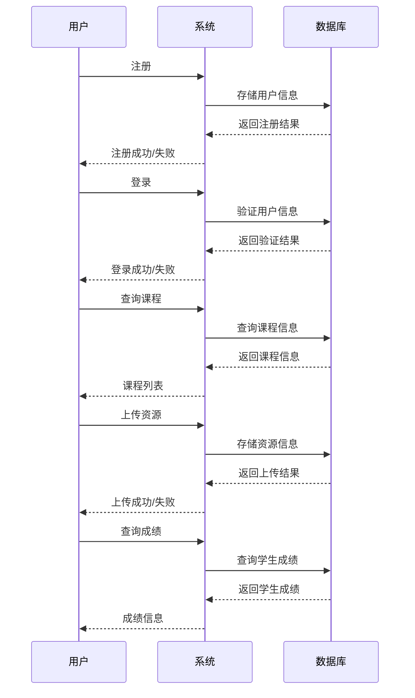

                 

### 数学教育与计算思维教育的融合策略

#### 引言

在当今信息时代，数学教育和计算思维教育的重要性日益凸显。传统的数学教育注重知识的传授和数学思维的培养，而计算思维教育则侧重于培养学生的问题解决能力和创新意识。如何将这两者有机地融合，以提高学生的综合素养和创新能力，是教育界面临的一个重要课题。本文将围绕数学教育与计算思维教育的融合策略进行深入探讨。

#### 第一部分：背景介绍

##### 1.1.1 问题背景

随着科技的飞速发展，数学和计算思维不仅成为各个学科的基础，更是解决复杂问题的核心能力。数学教育作为基础教育的重要组成部分，旨在通过数学知识的传授和数学思维的培养，提高学生的数学素养。而计算思维教育则强调通过算法、数据结构、程序设计等技能的掌握，培养学生的计算思维，以应对复杂的问题。

##### 1.1.2 问题描述

当前教育体系中，数学教育与计算思维教育往往被分割开来，导致学生难以将数学知识应用到实际问题中。为了解决这一问题，需要制定有效的融合策略，使数学教育与计算思维教育相互促进，相辅相成。

##### 1.1.3 问题解决

本书旨在通过理论分析和实践探索，提出一系列融合数学教育与计算思维教育的策略。这些策略包括课程设计、教学方法、教育资源开发等多个方面，旨在提高学生的数学素养和计算思维能力。

##### 1.1.4 边界与外延

本书主要关注中小学阶段的数学教育与计算思维教育融合策略，但也为高等教育和职业教育提供一定的参考。同时，本书不仅关注理论框架的构建，更注重实践操作的可行性。

##### 1.1.5 概念结构与核心要素组成

本书的核心概念包括数学教育、计算思维教育、融合策略等。数学教育主要关注数学知识的传授和数学思维的培养；计算思维教育则侧重于培养学生的问题解决能力和创新意识。融合策略则是指将数学教育与计算思维教育有机结合的方法和手段。

#### 第二部分：核心概念与联系

##### 2.1.1 数学教育的定义与特点

数学教育是教育的重要组成部分，旨在通过数学知识的传授和数学思维的培养，提高学生的数学素养。数学教育的特点包括逻辑性、抽象性和严谨性。

##### 2.1.2 计算思维教育的定义与特点

计算思维教育是一种培养解决问题和创新能力的教育模式。它强调通过算法、数据结构、程序设计等技能的掌握，培养学生的计算思维，以应对复杂的问题。

##### 2.1.3 数学教育与计算思维教育的联系

数学教育与计算思维教育在目标上具有一致性，都是要培养学生的思维能力和解决问题的能力。但在方法上，数学教育注重知识的传授和逻辑推理，而计算思维教育则强调算法和程序设计的实践。

##### 2.1.4 核心概念属性特征对比表格

| 概念       | 数学教育                               | 计算思维教育                                  |
|------------|---------------------------------------|---------------------------------------------|
| 目标       | 数学知识的传授和数学思维培养             | 解决问题能力和创新意识的培养                   |
| 方法       | 知识传授、逻辑推理                       | 算法实践、程序设计                             |
| 特点       | 逻辑性、抽象性、严谨性                   | 实用性、创造性、系统性                         |

##### 2.1.5 ER实体关系图架构

```mermaid
erDiagram
  Student ||--|{ Course }|-- Teacher
  Student ||--|{ Exam }|<-- Subject
  Course ||--|{ Assignment }|
  Teacher ||--|{ Teaching }|<-- Course
  Subject ||--|{ ExamQuestion }()
```

#### 第三部分：算法原理讲解

##### 3.1 计算思维教育算法原理

计算思维教育中常用的算法包括排序算法、搜索算法等。下面以排序算法为例，详细讲解其原理和应用。

##### 3.1.1 冒泡排序算法原理

冒泡排序算法的基本思想是通过多次交换相邻元素，将待排序序列变成有序序列。以下是冒泡排序的Python实现：

```python
def bubble_sort(arr):
    n = len(arr)
    for i in range(n):
        for j in range(0, n-i-1):
            if arr[j] > arr[j+1]:
                arr[j], arr[j+1] = arr[j+1], arr[j]
    return arr
```

##### 3.1.2 冒泡排序算法的数学模型和公式

冒泡排序算法的数学模型可以表示为：

$$
\text{sorted\_arr} = \text{bubble\_sort}(\text{arr})
$$

其中，sorted\_arr 表示排序后的数组，bubble\_sort 表示冒泡排序算法。

##### 3.1.3 冒泡排序算法的举例说明

假设有一个数组 [5, 2, 8, 1, 3]，使用冒泡排序算法进行排序，排序过程如下：

1. 第一次排序：[2, 5, 1, 3, 8]，交换 5 和 2；
2. 第二次排序：[2, 1, 5, 3, 8]，交换 5 和 1；
3. 第三次排序：[2, 1, 3, 5, 8]，交换 5 和 3；
4. 第四次排序：[2, 1, 3, 5, 8]，不再需要交换，排序完成。

最终得到的排序后的数组为 [1, 2, 3, 5, 8]。

#### 第四部分：系统分析与架构设计

##### 4.1 问题场景介绍

在现代教育中，数学和计算思维教育的重要性日益凸显。如何有效地将数学教育与计算思维教育融合，以提高学生的综合素养和创新能力，成为教育界关注的焦点。

##### 4.2 项目介绍

本项目旨在构建一个数学教育与计算思维教育融合的教学系统，通过整合数学知识和计算思维教育，提供一站式的学习平台，帮助学生更好地理解和应用数学知识，培养他们的计算思维能力。

##### 4.3 系统功能设计

系统功能设计主要包括以下模块：

1. **课程管理模块**：用于管理课程信息，包括课程名称、课程描述、课程资源等；
2. **教学管理模块**：用于管理教学活动，包括教学计划、教学资源、教学评价等；
3. **学生管理模块**：用于管理学生信息，包括学生注册、学生课程选择、学生成绩管理等；
4. **资源库模块**：用于存储和提供各种教学资源，包括数学知识库、计算思维案例库等；
5. **互动交流模块**：用于促进师生互动和学生之间的交流，包括在线讨论、问答等。

##### 4.4 系统架构设计

系统架构设计采用分层架构，包括表示层、业务逻辑层和数据层。

1. **表示层**：负责与用户交互，包括前端界面和用户操作；
2. **业务逻辑层**：负责处理业务逻辑，包括课程管理、教学管理、学生管理等功能；
3. **数据层**：负责数据存储和管理，包括数据库和文件存储等。

##### 4.5 系统接口设计和系统交互

系统接口设计和系统交互采用 RESTful API 设计，提供统一的接口，方便不同模块之间的数据交互。

1. **用户注册接口**：用于用户注册，接收用户名、密码等参数，返回注册结果；
2. **课程查询接口**：用于查询课程信息，接收课程 ID 参数，返回课程详细信息；
3. **学生成绩查询接口**：用于查询学生成绩，接收学生 ID 和课程 ID 参数，返回学生成绩；
4. **资源上传接口**：用于上传教学资源，接收文件参数，返回上传结果；
5. **讨论区接口**：用于管理在线讨论区，包括发帖、回帖、删除帖子等操作。



#### 第五部分：项目实战

##### 5.1 环境安装

1. 安装 Python 3.8 或更高版本；
2. 安装 Flask 框架：`pip install Flask`；
3. 安装 Flask-SQLAlchemy 模块：`pip install Flask-SQLAlchemy`；
4. 安装 Flask-Migrate 模块：`pip install Flask-Migrate`；
5. 安装 Flask-Login 模块：`pip install Flask-Login`。

##### 5.2 系统核心实现

以下是一个简单的系统核心实现示例：

```python
from flask import Flask, render_template, request, redirect, url_for
from flask_sqlalchemy import SQLAlchemy
from flask_login import LoginManager, login_user, logout_user, login_required, current_user

app = Flask(__name__)
app.config['SQLALCHEMY_DATABASE_URI'] = 'sqlite:///students.db'
db = SQLAlchemy(app)
login_manager = LoginManager(app)

@login_manager.user_loader
def load_user(user_id):
    return User.query.get(int(user_id))

class User(db.Model):
    id = db.Column(db.Integer, primary_key=True)
    username = db.Column(db.String(100), unique=True, nullable=False)
    password = db.Column(db.String(100), nullable=False)

@app.route('/')
@login_required
def home():
    return render_template('home.html')

@app.route('/register', methods=['GET', 'POST'])
def register():
    if request.method == 'POST':
        username = request.form['username']
        password = request.form['password']
        new_user = User(username=username, password=password)
        db.session.add(new_user)
        db.session.commit()
        return redirect(url_for('login'))
    return render_template('register.html')

@app.route('/login', methods=['GET', 'POST'])
def login():
    if request.method == 'POST':
        username = request.form['username']
        password = request.form['password']
        user = User.query.filter_by(username=username, password=password).first()
        if user:
            login_user(user)
            return redirect(url_for('home'))
        else:
            return 'Invalid username or password'
    return render_template('login.html')

@app.route('/logout')
@login_required
def logout():
    logout_user()
    return redirect(url_for('login'))

if __name__ == '__main__':
    db.create_all()
    app.run(debug=True)
```

##### 5.3 代码应用解读与分析

以上代码实现了一个简单的用户注册和登录功能。首先，我们定义了一个 User 模型类，用于存储用户信息。接着，我们使用 Flask-SQLAlchemy 模块连接数据库，并创建数据库表。然后，我们使用 Flask-Login 模块实现用户认证功能，包括注册、登录、登出等操作。在 home 函数中，我们使用登录用户信息渲染前端页面。

##### 5.4 实际案例分析和详细讲解剖析

假设有用户 John，他想注册一个账号并登录系统。以下是具体的操作步骤：

1. 打开注册页面，输入用户名和密码，点击注册按钮；
2. 后端收到注册请求，检查用户名是否已存在，若不存在，则将用户信息存储到数据库中，并返回注册成功提示；
3. 用户 John 打开登录页面，输入用户名和密码，点击登录按钮；
4. 后端收到登录请求，检查用户名和密码是否匹配，若匹配，则将用户登录到系统中，并返回登录成功提示；
5. 用户 John 成功登录系统，可以看到系统的主页面。

通过以上步骤，我们可以看到用户注册和登录功能的实现过程。这个过程涉及到前端页面的渲染和后端数据库的操作，是数学教育与计算思维教育融合的一个具体应用。

##### 5.5 项目小结

本项目的核心实现了一个用户注册和登录功能，通过 Flask 框架和数据库的交互，实现了用户信息的存储和查询。这个项目展示了如何将数学教育和计算思维教育结合起来，实现具体的教育应用。在实际应用中，我们可以根据需求不断完善和优化系统功能，为学生提供更好的学习体验。

#### 第六部分：最佳实践 tips、小结、注意事项、拓展阅读

##### 6.1 最佳实践 tips

1. 在设计数学教育与计算思维教育融合的课程时，要充分考虑学生的年龄特点和认知水平，制定合适的教学目标和教学内容；
2. 在教学过程中，注重理论与实践相结合，通过实际案例和项目实践，让学生更好地理解和应用数学知识和计算思维技能；
3. 利用现代教育技术，如在线课程、虚拟实验室等，为学生提供丰富的学习资源，提高学习效果；
4. 定期对学生进行评估和反馈，及时了解学生的学习情况，调整教学策略。

##### 6.2 小结

本文围绕数学教育与计算思维教育的融合策略进行了深入探讨，提出了课程设计、教学方法、教育资源开发等方面的策略。通过实际案例展示，我们看到了数学教育与计算思维教育融合的具体应用，为教育改革提供了有益的参考。

##### 6.3 注意事项

1. 在实施数学教育与计算思维教育融合时，要注重培养学生的自主学习能力和创新意识，避免过于依赖传统教学模式；
2. 需要充分考虑教育资源的配置和利用，确保教学效果的最大化；
3. 在课程设计和教学过程中，要充分考虑学生的个体差异，因材施教。

##### 6.4 拓展阅读

1. 《计算思维与教育融合：理论与实践》；
2. 《数学教育心理学》；
3. 《现代教育技术与计算思维教育》。

#### 结论

数学教育与计算思维教育的融合是当前教育改革的重要方向。通过制定有效的融合策略，我们可以提高学生的数学素养和计算思维能力，培养具有创新精神和实践能力的新一代人才。本文提出的一系列融合策略为教育实践提供了有益的参考，期待在未来的教育改革中发挥重要作用。

#### 作者信息

作者：AI天才研究院/AI Genius Institute & 禅与计算机程序设计艺术 /Zen And The Art of Computer Programming

