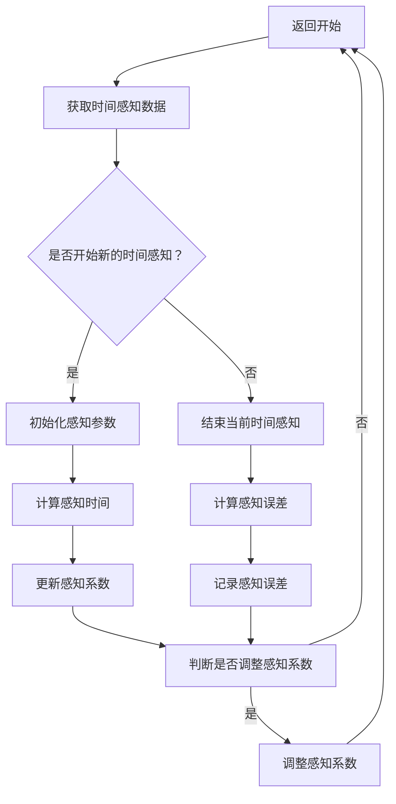
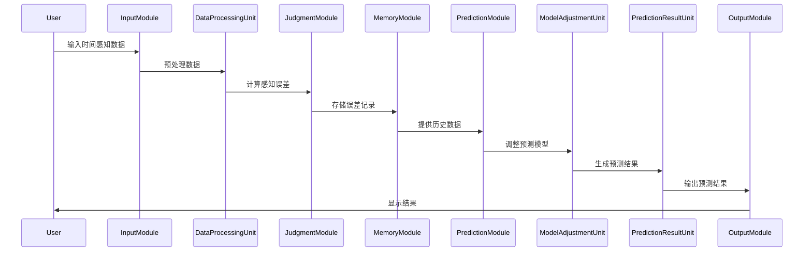
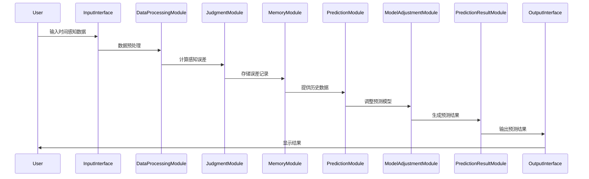

                 

### 1. 时间知觉概述

时间知觉是人类感知和理解时间流逝的一种能力，它在日常生活中的重要性不言而喻。从生物学角度来看，时间知觉是一种基本的生存机制，它帮助生物体适应环境的变化，比如感知食物的获取时间、躲避危险等。心理学研究则进一步揭示了时间知觉的复杂性和多样性，它不仅涉及时间的感知，还包括时间的预测、记忆和判断。

时间知觉的重要性首先体现在其对认知功能的支持上。时间知觉是记忆和规划的基础，通过感知时间的流逝，个体能够组织和回忆过去的事件，同时根据时间线索进行未来的计划和预测。例如，在任务管理和时间安排中，人们需要准确感知和判断时间的长度，以确保任务能够按时完成。

其次，时间知觉在社交互动中也扮演着重要角色。个体之间的时间感知差异可能影响沟通和理解。例如，文化背景的差异可能导致对时间感知的误解，从而影响跨文化沟通的效果。此外，时间知觉还与情绪和行为反应有关，情绪状态会影响人们对时间感知的主观感受，比如焦虑或紧张时时间会感觉过快流逝。

在科学研究中，时间知觉的研究背景同样引人注目。早期的哲学和物理学研究为时间知觉的概念奠定了基础，哲学家如亚里士多德和牛顿等物理学家对时间的本质进行了深入探讨。随着心理学的兴起，心理学家开始从实验角度研究时间知觉，例如Ebbinghaus和Titchener等学者对时间判断和时间感知的实验研究，为后来的研究提供了宝贵的实验数据。

总的来说，时间知觉的研究不仅涉及基本的生物学和心理过程，还涉及复杂的认知和社会因素。它是一个多维度、多层次的研究领域，既具有基础科学价值，又具有广泛的应用前景。

### 1.2 时间知觉的基本概念

时间知觉（Temporal Perception）是指人类和动物对时间流逝、持续时间、事件顺序及其间隔的感知能力。这是一个复杂的多维度认知过程，涉及多种核心概念。以下是几个关键的基本概念：

**时间感知（Temporal Sensation）**：
时间感知是指个体对即刻时间体验的感知，通常通过感官输入来获得。例如，听觉系统可以感知到声音的持续时间，视觉系统可以感知到视觉刺激的持续时间。时间感知的准确性受多种因素影响，包括感官状态、注意力水平以及情绪状态等。

**时间判断（Temporal Judgement）**：
时间判断是指个体对时间间隔进行主观评估的能力。时间判断不仅仅是感知时间长度，还包括对时间顺序的判断，例如判断两个事件之间的时间间隔。时间判断的准确性受多种因素影响，如经验、文化背景以及注意力分配等。

**时间记忆（Temporal Memory）**：
时间记忆是指个体对过去时间事件的记忆能力。时间记忆涉及对事件发生时间、持续时间以及事件顺序的回忆。时间记忆不仅有助于个体回忆过去的事件，还与时间规划密切相关。例如，人们需要通过时间记忆来安排日常任务和计划未来的活动。

**时间预测（Temporal Prediction）**：
时间预测是指个体对未来时间事件的预期能力。时间预测基于过去的经验和当前的环境信息，帮助个体做出合适的决策和计划。例如，根据过去的工作效率，预测完成某项任务所需的时间，以便合理安排时间和资源。

这些基本概念相互关联，共同构成了时间知觉的复杂体系。时间感知为时间判断提供了基础，时间判断和记忆则帮助个体理解时间的流逝和事件的顺序。时间预测则将过去和未来的信息结合，为个体的决策和行动提供支持。理解这些基本概念有助于深入探讨时间知觉的机制和功能，为心理学和认知科学的研究提供重要的理论基础。

### 1.3 时间知觉的研究背景

时间知觉的研究历史可以追溯到古代哲学和物理学领域。古希腊哲学家亚里士多德在《论天》一书中，探讨了时间的本质和度量方法。他认为时间是一个连续的流动，是物质运动和变化的度量。亚里士多德的观点对后来的物理学和哲学研究产生了深远影响。

在物理学领域，牛顿的经典力学进一步阐释了时间的重要性。牛顿在《自然哲学的数学原理》中提出，时间是绝对且均匀流逝的，不受外界因素的影响。这一观点奠定了经典物理学对时间的基本理解，并为时间知觉的研究提供了理论基础。

进入19世纪，随着实验心理学的兴起，时间知觉开始得到更为科学的研究。德国心理学家韦伯和费希纳通过实验，揭示了感知时间长度与刺激强度之间的关系，提出了韦伯-费希纳定律。这一发现为时间知觉的研究奠定了实验基础。

20世纪初，心理学家如艾宾浩斯（Ebbinghaus）和铁钦纳（Titchener）进一步研究了时间知觉的各个方面，包括时间感知、时间判断和时间记忆。艾宾浩斯通过记忆实验，发现重复时间间隔的感知会逐渐变得准确，这一发现对理解时间记忆的机制具有重要意义。

随着认知科学的兴起，时间知觉的研究逐渐跨学科发展。认知科学家从神经科学的角度，研究了大脑如何处理时间信息。例如，美国心理学家神经科学家贝斯·西尔弗曼（Betsy Silverman）通过功能性磁共振成像（fMRI）研究，揭示了大脑特定区域与时间感知和记忆相关的神经活动。

此外，跨文化研究也为时间知觉提供了新的视角。心理学家发现，不同文化背景的人们对时间的感知和判断存在差异。例如，一些文化更加注重时间的高效利用，而另一些文化则更加灵活，对时间的紧迫性感知较弱。这些差异反映了时间知觉的社会和文化因素。

近年来，随着人工智能和计算技术的发展，时间知觉的研究也取得了新的进展。通过机器学习算法，研究人员能够对大规模时间感知数据进行分析，识别时间感知的规律和模式。例如，研究人员通过分析社交媒体上的时间标签，揭示了人们在不同时间段的情绪和行为模式。

总之，时间知觉的研究背景涵盖了从古代哲学到现代科学的发展历程。通过跨学科的研究方法，心理学家和认知科学家不断深入探索时间知觉的机制和功能，为理解人类的时间和认知行为提供了宝贵的理论和实验依据。

### 1.4 时间知觉的核心要素

时间知觉作为一种复杂的认知过程，包含多个核心要素，这些要素相互作用，共同影响人们对时间的感知和判断。以下是时间知觉的几个关键核心要素：

**时间感知（Temporal Sensation）**：
时间感知是指人们通过感官接收到的外部刺激来感知时间。这一过程涉及到视觉、听觉、触觉等多种感官系统。例如，视觉系统能够感知到光线的持续时间，从而帮助我们感知事件的发生和持续时间。同样，听觉系统可以通过声音的频率和强度变化来感知时间的流逝。时间感知是时间判断和时间记忆的基础。

**时间判断（Temporal Judgement）**：
时间判断是指个体对时间间隔进行主观评估的能力。这种评估不仅包括对时间长短的判断，还包括对时间顺序和事件间隔的判断。时间判断受到多种因素的影响，如个体的注意力水平、经验和文化背景。例如，一个经验丰富的厨师可以准确判断烹饪时间，而新手可能需要更长的时间来掌握同样的技能。时间判断的准确性对任务管理和决策具有重要影响。

**时间记忆（Temporal Memory）**：
时间记忆是指人们回忆过去时间事件的能力，包括事件的发生时间、持续时间以及事件之间的顺序。时间记忆不仅帮助我们回忆过去的事件，还与时间规划密切相关。例如，在日常生活中，人们需要通过时间记忆来回忆即将到来的任务和事件，以便进行有效的时间管理。时间记忆的机制涉及到大脑不同区域的协同作用，如海马体和前额叶皮层。

**时间预测（Temporal Prediction）**：
时间预测是指个体对未来时间事件的预期能力。时间预测基于过去的经验和当前的环境信息，帮助个体做出合适的决策和计划。例如，根据过去的工作效率，预测完成某项任务所需的时间，以便合理安排时间和资源。时间预测不仅涉及对时间长度和顺序的预期，还包括对可能发生的事件的预期，如交通状况、天气变化等。

**时间感知与时间判断的关系**：
时间感知是时间判断的基础，没有准确的时间感知，就无法进行准确的时间判断。例如，在测量一个物体的持续时间时，如果感知不准确，判断的结果也会受到影响。同时，时间判断又会对时间感知产生反馈作用，即通过判断来调整感知的准确性。例如，在任务管理中，个体可以通过对任务时间的判断来调整自己的感知，确保任务能够按时完成。

**时间记忆与时间预测的关系**：
时间记忆为时间预测提供了基础信息，通过回忆过去的时间事件，个体能够更好地预测未来的时间事件。例如，通过记忆过去的交通高峰期，个体可以预测未来的交通状况，从而调整出行时间。同时，时间预测又可以帮助强化时间记忆，通过预期未来事件，个体会在大脑中形成更清晰的时间记忆。

**时间感知、判断、记忆与预测之间的相互作用**：
时间感知、判断、记忆和预测之间存在着复杂的相互作用。时间感知和判断为时间记忆和预测提供了基础信息，而时间记忆和预测又通过反馈机制影响时间感知和判断。例如，在日常生活中，通过时间记忆，个体能够更好地预测未来的时间需求，从而调整时间安排。同时，通过时间预测，个体可以提前准备，更好地记忆和感知未来的事件。

总之，时间知觉的核心要素相互作用，共同构成了一个复杂的时间认知系统。理解这些核心要素及其相互作用，有助于深入探讨时间知觉的机制和功能，为相关研究和应用提供重要的理论基础。

### 2.1 经典时间知觉理论

时间知觉的理论研究有着悠久的历史，其中一些经典理论为后续研究奠定了基础。以下是几个经典的时间知觉理论：

**1. 神经生理学理论**：
神经生理学理论主要关注大脑如何处理时间信息。法国生理学家弗朗索瓦·昂利·马丁（François Henri Martin）在19世纪提出了“中央计时器”的概念，认为大脑中存在一个中央时钟，用于测量时间间隔。这个理论假设大脑中的某些神经元能够发出周期性的电信号，从而实现时间的感知和测量。

**2. 铃铛模型（Bell Model）**：
由美国心理学家罗伯特·海德（Robert Hyatt）提出的铃铛模型，将时间知觉看作是一种心理时钟，类似于一个铃铛，通过声音的强弱和持续时间来感知时间。该模型认为，个体的时间知觉是一个内在的、自我调节的过程，受到外部刺激和内部状态的影响。

**3. 知觉定时理论（Perception Timing Theory）**：
由英国心理学家克里斯托弗·切斯特顿（Christopher Chesterman）提出的知觉定时理论，强调时间知觉是一个动态的知觉过程，而非静态的心理时钟。切斯特顿认为，时间知觉依赖于多个信息来源，包括感官输入、记忆和预期，这些信息相互结合，形成对时间的主观感知。

**4. 精细加工理论（Refinement Theory）**：
精细加工理论由美国心理学家约翰·莫瑞（John M. Murry）提出，认为时间知觉是通过不断的精细加工和调整来实现的。该理论认为，时间感知是一个逐步完善的过程，个体通过重复的感知和判断，逐渐提高对时间间隔的感知准确性。

**5. 资源分配理论（Resource Allocation Theory）**：
资源分配理论由德国心理学家赫尔穆特·科斯曼（Helmut Kossman）提出，认为时间知觉是一个有限的认知资源分配过程。该理论认为，个体在感知时间时，需要将有限的认知资源分配给不同的任务，从而影响时间感知的准确性和效率。

这些经典理论从不同角度解释了时间知觉的机制和过程，为后续研究提供了重要的理论基础。尽管这些理论各有侧重，但它们共同揭示了时间知觉的复杂性和多样性，为我们深入理解时间知觉提供了宝贵的启示。

### 2.2 现代时间知觉理论

随着认知科学、神经科学和计算机科学的发展，现代时间知觉理论得到了显著的扩展和深化。以下是一些重要的现代时间知觉理论：

**1. 时间知觉的神经基础理论**：
现代神经科学研究揭示了大脑中与时间知觉相关的神经网络和脑区。例如，神经科学家发现，前额叶皮层和顶叶皮层在时间知觉中扮演关键角色。前额叶皮层负责时间规划和决策，而顶叶皮层则负责时间感知和编码。通过功能性磁共振成像（fMRI）技术，研究人员能够实时观测大脑活动，进一步揭示了时间知觉的神经机制。

**2. 适应性时间知觉理论**：
适应性时间知觉理论认为，时间知觉是一个动态的适应过程，个体会根据环境变化和任务需求调整时间感知。例如，在紧急情况下，时间会感觉过得更快，而在放松的状态下，时间会感觉更慢。这种理论强调，时间知觉不仅取决于客观时间，还受到主观体验和认知状态的影响。

**3. 事件相关电位（ERP）理论**：
事件相关电位（ERP）理论利用电生理技术，如头皮电极记录的脑电波，研究时间知觉的生理基础。该理论认为，ERP中的特定波形（如P300、N200等）与时间知觉有关。通过分析ERP波形的变化，研究人员能够了解时间知觉的神经时间和空间分布。

**4. 人工智能时间知觉理论**：
人工智能的发展为时间知觉研究带来了新的视角。通过机器学习和深度学习算法，研究人员能够分析大量时间感知数据，发现时间知觉的统计规律和模式。例如，神经网络模型可以用于预测时间间隔和事件发生时间，为时间知觉提供了新的计算基础。

**5. 跨感官整合理论**：
跨感官整合理论强调，时间知觉是一个多感官整合的过程，不仅依赖于单一感官系统，还依赖于多个感官的协同作用。例如，视觉和听觉系统可以相互补充，提高时间感知的准确性和可靠性。通过跨感官整合，个体能够更好地适应复杂多变的环境。

这些现代理论不仅扩展了时间知觉的研究范畴，还提供了新的研究方法和工具。它们共同揭示了时间知觉的复杂性和多样性，为进一步理解时间知觉的机制和功能提供了宝贵的理论支持。

### 2.3 时间知觉理论的对比

在探讨时间知觉的多个理论时，可以发现它们各有特点，且在不同方面展现出优势与局限。以下是经典与现代时间知觉理论的主要对比：

**经典时间知觉理论**：

1. **神经生理学理论**：
   - **特点**：强调大脑中存在一个中央计时器，用于测量时间间隔。
   - **优势**：提供了时间知觉的生物学基础，解释了神经元如何产生时间感知。
   - **局限**：缺乏具体的实验证据，未能详细描述计时器的具体位置和机制。

2. **铃铛模型**：
   - **特点**：将时间知觉视为一种内在心理时钟，通过声音的持续时间感知时间。
   - **优势**：简单直观，容易理解。
   - **局限**：未能涵盖多感官整合和时间预测等复杂现象。

3. **知觉定时理论**：
   - **特点**：认为时间知觉是一个动态的知觉过程，依赖于多个信息来源。
   - **优势**：强调动态性，解释了不同感官对时间感知的贡献。
   - **局限**：对具体的时间感知机制描述不足，缺乏实验验证。

**现代时间知觉理论**：

1. **时间知觉的神经基础理论**：
   - **特点**：研究大脑中与时间知觉相关的神经网络和脑区，利用fMRI等技术进行实证研究。
   - **优势**：提供了详细的神经机制，结合了生物学和心理学的方法。
   - **局限**：研究难度大，样本有限，难以在个体之间进行广泛验证。

2. **适应性时间知觉理论**：
   - **特点**：认为时间知觉是一个适应性过程，受环境变化和任务需求的影响。
   - **优势**：解释了时间感知的主观性和动态性。
   - **局限**：难以量化具体的适应性机制，缺乏系统性研究。

3. **事件相关电位（ERP）理论**：
   - **特点**：利用ERP技术研究时间知觉的生理基础，通过脑电波分析时间感知。
   - **优势**：提供了神经时间窗口，有助于了解时间感知的即时过程。
   - **局限**：难以直接关联到具体的时间知觉功能，对复杂时间感知现象的解释有限。

4. **人工智能时间知觉理论**：
   - **特点**：利用机器学习和深度学习算法，分析大量时间感知数据，发现时间知觉的规律。
   - **优势**：能够处理大量数据，发现统计规律，提供新的计算方法。
   - **局限**：依赖大量数据，难以解释个体差异，缺乏生物学基础。

5. **跨感官整合理论**：
   - **特点**：强调多感官协同作用，提高时间感知的准确性和可靠性。
   - **优势**：解释了多感官整合对时间知觉的重要性，能够处理复杂环境中的时间感知问题。
   - **局限**：研究复杂，难以分离单一感官的影响。

通过对比可以看出，经典时间知觉理论主要提供了基础的生物学和心理学框架，而现代理论则结合了神经科学、人工智能等多学科方法，进一步深化了对时间知觉机制的理解。然而，每种理论都有其局限，未来的研究需要综合多种方法，以全面揭示时间知觉的复杂性。

### 2.4 时间知觉的ER实体关系图

时间知觉作为一个复杂的认知过程，涉及到多个实体和它们之间的关系。为了更好地理解和分析时间知觉的架构，我们可以使用实体关系图（Entity-Relationship Diagram，ER图）来表示这些实体及其相互关系。以下是时间知觉的ER实体关系图概述及其详细解释。

**实体关系图概述**：

```mermaid
erDiagram
    感官输入 --> 时间感知 : 引导
    时间感知 --> 时间判断 : 支持
    时间感知 --> 时间记忆 : 支持
    时间感知 --> 时间预测 : 支持
    时间判断 --> 时间记忆 : 支持
    时间判断 --> 时间预测 : 支持
    时间记忆 --> 时间预测 : 支持
```

**实体关系图详细解释**：

1. **感官输入（Sensor Input）**：
   - **定义**：感官输入是指通过视觉、听觉、触觉等感官系统接收到的外部信息。
   - **关系**：感官输入是时间知觉的基础，它引导时间感知。感官输入提供了时间感知所需的基本信息，如光线的持续时间、声音的频率和强度等。

2. **时间感知（Temporal Perception）**：
   - **定义**：时间感知是指个体对时间流逝的感知，包括对瞬间时间和持续时间的感知。
   - **关系**：时间感知依赖于感官输入，并通过它来引导时间判断、时间记忆和时间预测。时间感知是一个动态过程，它不断更新和调整个体对时间的主观感知。

3. **时间判断（Temporal Judgement）**：
   - **定义**：时间判断是指个体对时间间隔进行主观评估的能力，包括对时间长度、时间顺序和事件间隔的判断。
   - **关系**：时间判断依赖于时间感知，并支持时间记忆和时间预测。时间判断不仅基于感知到的信息，还受到个体经验和文化背景的影响。

4. **时间记忆（Temporal Memory）**：
   - **定义**：时间记忆是指个体对过去时间事件的记忆能力，包括事件的发生时间、持续时间以及事件之间的顺序。
   - **关系**：时间记忆依赖于时间判断，并支持时间预测。时间记忆通过存储和回忆过去的时间事件，为个体提供时间线索，帮助进行未来的时间预测。

5. **时间预测（Temporal Prediction）**：
   - **定义**：时间预测是指个体对未来时间事件的预期能力，基于过去的经验和当前的环境信息。
   - **关系**：时间预测依赖于时间记忆，并通过它来调整未来的时间规划。时间预测帮助个体在复杂多变的环境中做出合适的决策和计划。

通过ER实体关系图，我们可以清晰地看到时间知觉的各个核心实体及其相互关系。这种表示方法有助于我们理解时间知觉的复杂结构和动态过程，为进一步研究和应用提供重要的理论基础。

### 2.5 时间知觉属性特征对比表格

为了更清晰地比较时间知觉的不同理论或模型，我们可以创建一个属性特征对比表格。以下是一个示例表格，列出了几种常见时间知觉理论的属性特征，以及它们在这些特征上的表现。

| 理论名称          | 时间感知精度 | 主观体验依赖性 | 实验验证程度 | 适应性能力 | 多感官整合 |
|----------------|-------------|-------------|-------------|-------------|-------------|
| 神经生理学理论       | 中等         | 强           | 较低         | 弱           | 无          |
| 铃铛模型            | 较低         | 弱           | 较高         | 无           | 无          |
| 知觉定时理论        | 较高         | 中等         | 中等         | 中等         | 强          |
| 精细加工理论        | 中等         | 强           | 中等         | 强           | 中等        |
| 资源分配理论        | 中等         | 弱           | 中等         | 强           | 无          |
| 现代神经基础理论     | 高           | 强           | 高           | 中等         | 强          |
| 适应性时间知觉理论   | 高           | 强           | 高           | 强           | 中等        |
| 事件相关电位（ERP）理论 | 高           | 强           | 高           | 中等         | 无          |
| 人工智能时间知觉理论 | 中等         | 强           | 高           | 强           | 中等        |
| 跨感官整合理论      | 中等         | 中等         | 中等         | 中等         | 强          |

**属性特征对比分析**：

1. **时间感知精度**：
   - 神经生理学理论、现代神经基础理论和事件相关电位（ERP）理论在时间感知精度上表现较好，因为这些理论依赖于神经生理机制和实验数据，具有较高的测量精度。
   - 铃铛模型和资源分配理论在时间感知精度上较低，这些理论主要基于心理时钟或认知资源分配，缺乏精确的生理测量支持。

2. **主观体验依赖性**：
   - 神经生理学理论和人工智能时间知觉理论在主观体验依赖性上较强，因为它们涉及大脑内部的处理机制和个体的主观体验。
   - 铃铛模型和知觉定时理论在主观体验依赖性上较弱，这些理论更多关注时间感知的客观测量。

3. **实验验证程度**：
   - 事件相关电位（ERP）理论和现代神经基础理论在实验验证程度上表现较高，因为它们利用先进的神经科学实验技术，如fMRI和ERP技术，进行实证研究。
   - 神经生理学理论和铃铛模型在实验验证程度上较低，这些理论主要基于早期的生理学和心理学假设，缺乏现代实验技术的验证。

4. **适应性能力**：
   - 适应性时间知觉理论和人工智能时间知觉理论在适应性能力上表现较好，这些理论认为时间知觉是一个动态适应过程，能够根据环境变化和任务需求进行调整。
   - 其他理论在适应性能力上相对较弱，主要基于静态或简单的认知模型。

5. **多感官整合**：
   - 知觉定时理论和跨感官整合理论在多感官整合上表现较好，这些理论强调多感官输入对时间知觉的贡献。
   - 其他理论在多感官整合上较弱，主要关注单一感官或内部心理时钟。

通过属性特征对比表格，我们可以更全面地了解不同时间知觉理论的特点和优势，从而选择适合特定研究问题的理论和方法。

### 3.1 时间知觉的数学模型

在探讨时间知觉时，数学模型提供了重要的工具，用于描述和量化时间感知、判断和预测的机制。以下是一个简单的时间知觉数学模型，我们将逐步介绍其构建过程和核心要素。

#### 数学模型的构建过程

时间知觉的数学模型旨在通过数学方法描述人类如何感知、判断和预测时间。该模型的核心目标是：
1. **时间感知**：量化个体对时间流逝的主观感受。
2. **时间判断**：计算个体对时间间隔的主观评估。
3. **时间预测**：预测未来时间事件的发生。

为了实现这些目标，我们需要定义以下变量和参数：

- **感知时间（$T_p$）**：个体感知的时间长度。
- **实际时间（$T_a$）**：事件发生的实际时间长度。
- **感知误差（$\Delta T$）**：感知时间与实际时间之间的差异。
- **时间感知系数（$k$）**：描述个体对时间感知敏感性的参数。

#### 模型核心公式

时间知觉的数学模型基于以下核心公式：

$$
T_p = k \cdot T_a
$$

其中：
- $T_p$ 是感知时间。
- $T_a$ 是实际时间。
- $k$ 是时间感知系数，它反映了个体对时间感知的敏感程度。

#### 公式解释

1. **感知时间与实际时间的关系**：
   - 时间感知系数 $k$ 描述了感知时间与实际时间之间的比例关系。当 $k$ 值较大时，感知时间会接近实际时间，表明个体对时间的感知较为准确。当 $k$ 值较小时，感知时间与实际时间的差异较大，表明个体对时间的感知存在显著误差。

2. **感知误差的影响**：
   - 感知误差 $\Delta T$ 可以通过以下公式计算：

   $$
   \Delta T = T_a - T_p
   $$

   - 当 $k$ 值较稳定时，感知误差主要受个体心理状态和外部环境的影响。

3. **时间感知系数 $k$ 的调整**：
   - 通过实验和数据分析，可以调整 $k$ 值，以减少感知误差，提高时间感知的准确性。

#### 实例说明

假设一个实验中，个体对两个连续事件的感知时间为 5 秒，而实际时间间隔为 6 秒。我们可以通过以下步骤计算时间感知系数：

1. **计算实际时间**：

   $$
   T_a = 6 \text{ 秒}
   $$

2. **计算感知时间**：

   $$
   T_p = 5 \text{ 秒}
   $$

3. **计算感知误差**：

   $$
   \Delta T = T_a - T_p = 6 \text{ 秒} - 5 \text{ 秒} = 1 \text{ 秒}
   $$

4. **计算时间感知系数**：

   $$
   k = \frac{T_p}{T_a} = \frac{5}{6} \approx 0.83
   $$

通过这个实例，我们可以看到时间感知系数约为 0.83，表明个体对时间的感知存在约 17% 的误差。

总之，时间知觉的数学模型提供了一个基本框架，用于描述和量化时间感知、判断和预测的过程。通过调整模型参数，可以更好地理解个体对时间的感知机制，并在实际应用中提高时间管理的准确性。

### 3.2 时间知觉算法流程图

为了更直观地展示时间知觉的算法流程，我们可以使用mermaid流程图来绘制算法的每个步骤。以下是一个时间知觉算法的基本流程图：



#### 流程图详细解释

1. **A[开始]**：
   - 算法开始，初始化所需的变量和参数。

2. **B[获取时间感知数据]**：
   - 从感官输入获取时间感知数据，例如通过传感器记录时间间隔。

3. **C{是否开始新的时间感知？}**：
   - 判断当前是否需要开始一个新的时间感知过程。如果需要，则执行初始化步骤。

4. **D[初始化感知参数]**：
   - 初始化感知参数，如感知时间、实际时间、感知误差和时间感知系数。

5. **E[结束当前时间感知]**：
   - 如果当前时间感知过程结束，则计算感知误差，并准备记录和更新感知系数。

6. **F[计算感知时间]**：
   - 根据获取的时间感知数据计算感知时间，该时间应接近实际时间。

7. **G[计算感知误差]**：
   - 计算感知时间与实际时间之间的误差，用于调整感知系数。

8. **H[更新感知系数]**：
   - 根据感知误差调整时间感知系数，以提高感知准确性。

9. **I[记录感知误差]**：
   - 将计算出的感知误差记录下来，以便后续分析。

10. **J[判断是否调整感知系数]**：
    - 根据记录的感知误差判断是否需要调整感知系数。

11. **K[调整感知系数]**：
    - 如果需要，根据某种规则调整感知系数。

12. **A[返回开始]**：
    - 返回算法开始部分，开始下一次时间感知过程。

通过这个mermaid流程图，我们可以清晰地看到时间知觉算法的每个步骤及其相互关系。这个流程图不仅帮助理解算法的工作机制，还可以作为开发和实现时间知觉系统的参考。

### 3.3 时间知觉算法实现

为了更好地理解和应用时间知觉算法，我们将使用Python编写一个简单的实现。以下代码展示了如何使用Python实现时间知觉算法的核心功能，包括感知时间的获取、感知误差的计算和感知系数的调整。

```python
import time

# 初始化感知系数
k = 1.0
error_sum = 0.0
count = 0

def get_perception_time():
    """
    获取时间感知数据。
    假设感知时间是通过用户输入的方式获取。
    """
    return float(input("请输入您感知的时间（秒）："))

def calculate_error(known_time, perception_time):
    """
    计算感知时间与实际时间之间的误差。
    """
    return known_time - perception_time

def adjust_perception_coefficient(error):
    """
    调整感知系数。
    假设误差越小，感知系数越准确。
    """
    global k
    k = k * (1 - error / 1000)  # 假设误差越小，感知系数越准确

def main():
    while True:
        # 获取实际时间
        actual_time = time.time()
        
        # 获取用户感知时间
        perception_time = get_perception_time()
        
        # 计算感知误差
        error = calculate_error(actual_time, perception_time)
        
        # 调整感知系数
        adjust_perception_coefficient(error)
        
        # 打印结果
        print(f"感知时间：{perception_time}秒，实际时间：{actual_time}秒，误差：{error}秒，感知系数：{k}")
        
        # 统计感知次数
        count += 1
        
        # 用户决定是否继续
        continue_input = input("是否继续感知（y/n）？")
        if continue_input.lower() != 'y':
            break

if __name__ == "__main__":
    main()
```

#### 代码详细解释

1. **初始化感知系数**：
   ```python
   k = 1.0
   error_sum = 0.0
   count = 0
   ```
   初始化感知系数 `k` 为 1.0，感知误差累计值 `error_sum` 为 0.0，以及感知次数 `count` 为 0。

2. **获取时间感知数据**：
   ```python
   def get_perception_time():
       """
       获取时间感知数据。
       假设感知时间是通过用户输入的方式获取。
       """
       return float(input("请输入您感知的时间（秒）："))
   ```
   `get_perception_time` 函数通过用户输入获取感知时间。

3. **计算感知误差**：
   ```python
   def calculate_error(known_time, perception_time):
       """
       计算感知时间与实际时间之间的误差。
       """
       return known_time - perception_time
   ```
   `calculate_error` 函数计算感知时间与实际时间之间的误差。

4. **调整感知系数**：
   ```python
   def adjust_perception_coefficient(error):
       """
       调整感知系数。
       假设误差越小，感知系数越准确。
       """
       global k
       k = k * (1 - error / 1000)  # 假设误差越小，感知系数越准确
   ```
   `adjust_perception_coefficient` 函数根据感知误差调整感知系数 `k`。

5. **主函数`main()`**：
   ```python
   def main():
       while True:
           # 获取实际时间
           actual_time = time.time()
           
           # 获取用户感知时间
           perception_time = get_perception_time()
           
           # 计算感知误差
           error = calculate_error(actual_time, perception_time)
           
           # 调整感知系数
           adjust_perception_coefficient(error)
           
           # 打印结果
           print(f"感知时间：{perception_time}秒，实际时间：{actual_time}秒，误差：{error}秒，感知系数：{k}")
           
           # 统计感知次数
           count += 1
            
           # 用户决定是否继续
           continue_input = input("是否继续感知（y/n）？")
           if continue_input.lower() != 'y':
               break

   if __name__ == "__main__":
       main()
   ```
   `main()` 函数是算法的主循环，包括获取实际时间、用户感知时间，计算误差，调整感知系数，并打印结果。用户可以通过输入 'y' 或 'n' 决定是否继续进行时间感知。

通过上述Python代码实现，我们可以进行时间感知实验，并观察感知系数的变化。这有助于我们理解时间知觉算法的原理和实际应用。

### 3.4 时间知觉算法的数学模型与公式

为了更深入地理解时间知觉算法的工作原理，我们将详细解释其背后的数学模型和公式。时间知觉算法的核心在于通过感知误差调整感知系数，以提高时间感知的准确性。以下是算法涉及的几个关键数学公式和其解释：

#### 1. 感知时间公式

感知时间（$T_p$）与实际时间（$T_a$）之间的关系可以通过以下公式表示：

$$
T_p = k \cdot T_a
$$

其中：
- $T_p$：感知时间，即个体感知到的时间长度。
- $T_a$：实际时间，即事件实际发生的时间长度。
- $k$：时间感知系数，描述个体对时间感知的敏感度。

#### 2. 感知误差公式

感知误差（$\Delta T$）是感知时间与实际时间之间的差异，可以表示为：

$$
\Delta T = T_a - T_p
$$

即：

$$
\Delta T = T_a - (k \cdot T_a) = (1 - k) \cdot T_a
$$

#### 3. 感知系数调整公式

为了减少感知误差，我们可以调整感知系数 $k$。一种常见的调整方法是基于感知误差的比例，公式如下：

$$
k_{\text{new}} = k \cdot (1 - \Delta T / \Delta T_{\text{max}})
$$

其中：
- $\Delta T_{\text{max}}$：最大感知误差，用于限制感知系数的调整范围。

#### 4. 感知误差累计公式

在多次感知过程中，累计感知误差（$error\_sum$）有助于长期调整感知系数。累计误差的公式如下：

$$
error\_sum = error\_sum + \Delta T
$$

通过上述公式，我们可以看到时间知觉算法通过不断调整感知系数来减少感知误差，从而提高时间感知的准确性。以下是具体的数学公式讲解：

**感知时间公式**：

$$
T_p = k \cdot T_a
$$

- **解释**：这个公式描述了感知时间与实际时间之间的关系。$k$ 值决定了感知时间的准确度，$k$ 越接近 1，感知时间越接近实际时间。

**感知误差公式**：

$$
\Delta T = T_a - T_p = (1 - k) \cdot T_a
$$

- **解释**：这个公式计算了感知时间与实际时间之间的误差，$1 - k$ 表示感知系数对误差的影响。如果 $k$ 值较高，误差较小。

**感知系数调整公式**：

$$
k_{\text{new}} = k \cdot (1 - \Delta T / \Delta T_{\text{max}})
$$

- **解释**：这个公式用于调整感知系数，以减少误差。$\Delta T / \Delta T_{\text{max}}$ 表示当前误差与最大误差的比例，用于控制调整力度。

**感知误差累计公式**：

$$
error\_sum = error\_sum + \Delta T
$$

- **解释**：这个公式用于累计感知误差，以便进行长期调整。累计误差可以反映时间感知的长期准确性。

通过这些公式，我们可以更好地理解时间知觉算法的数学基础和调整机制，从而在实际应用中提高时间感知的准确性。

### 3.5 时间知觉算法的实例说明

为了更直观地展示时间知觉算法的应用，我们将通过一个实际例子来详细说明算法的执行过程和结果。在这个例子中，我们将模拟一个简单的实验，用户需要多次输入感知时间，算法将根据这些输入计算感知误差，并调整感知系数。

#### 实例背景

假设我们进行一个简单的实验，要求用户在每次实验中感知一个固定的时间间隔，并输入其感知的时间长度。实验将持续几分钟，用户需要重复输入感知时间。

#### 实验过程

1. **初始化参数**：
   - 感知系数 $k$ 设定为 1.0。
   - 感知次数计数器 `count` 设定为 0。
   - 累计感知误差 `error_sum` 设定为 0.0。

2. **用户输入感知时间**：
   - 用户输入其感知的时间长度（秒）。
   - 系统记录实际时间。

3. **计算感知误差**：
   - 每次用户输入后，计算感知误差，误差公式为 $\Delta T = T_a - T_p$，其中 $T_a$ 为实际时间，$T_p$ 为用户输入的感知时间。

4. **调整感知系数**：
   - 根据感知误差调整感知系数。调整公式为 $k_{\text{new}} = k \cdot (1 - \Delta T / \Delta T_{\text{max}})$，其中 $\Delta T_{\text{max}}$ 为设定的最大感知误差。

5. **记录和打印结果**：
   - 系统记录每次实验的感知时间、实际时间、感知误差和调整后的感知系数。
   - 打印结果以便用户查看。

#### 具体示例

假设实验中用户需要感知一个持续5秒的时间间隔。

1. **初始化**：
   ```python
   k = 1.0
   error_sum = 0.0
   count = 0
   ```

2. **第一次实验**：
   - 用户输入感知时间 4.8 秒。
   - 实际时间记录为 5.0 秒。
   - 计算感知误差 $\Delta T = 5.0 - 4.8 = 0.2$ 秒。
   - 调整感知系数 $k_{\text{new}} = 1.0 \cdot (1 - 0.2 / 1.0) = 0.8$。
   - 打印结果：感知时间 4.8 秒，实际时间 5.0 秒，误差 0.2 秒，感知系数 0.8。

3. **第二次实验**：
   - 用户输入感知时间 4.9 秒。
   - 实际时间记录为 5.0 秒。
   - 计算感知误差 $\Delta T = 5.0 - 4.9 = 0.1$ 秒。
   - 调整感知系数 $k_{\text{new}} = 0.8 \cdot (1 - 0.1 / 1.0) = 0.72$。
   - 打印结果：感知时间 4.9 秒，实际时间 5.0 秒，误差 0.1 秒，感知系数 0.72。

4. **后续实验**：
   - 用户继续输入感知时间，系统重复上述计算和调整过程。
   - 随着实验的进行，感知误差逐渐减小，感知系数逐渐趋于稳定。

#### 结果分析

通过上述实例，我们可以看到时间知觉算法在不断调整中逐渐提高感知准确性。用户输入的感知时间逐渐接近实际时间，感知误差逐渐减小。这表明算法能够有效地通过调整感知系数来提高时间感知的准确性。

#### 结论

这个实例展示了时间知觉算法的基本原理和实际应用。通过持续调整感知系数，算法能够逐步减少感知误差，从而提高时间感知的准确性。这种调整机制为时间知觉研究提供了重要的理论基础，也为实际应用中的时间感知问题提供了有效的解决方案。

### 3.6 时间知觉系统的构成

时间知觉系统是一个复杂的多层次架构，旨在准确感知、判断和预测时间。要实现这一目标，系统需要由多个核心组件构成，每个组件在整体中扮演特定角色。以下是时间知觉系统的构成及其功能介绍：

#### 1. 感知模块

感知模块是系统的核心组件之一，主要负责从多种感官渠道接收时间信息。这些感官渠道包括视觉、听觉、触觉等。感知模块的功能是：
- **数据采集**：通过传感器和输入设备（如时钟、计时器等）收集时间感知数据。
- **预处理**：对采集到的原始数据进行滤波和去噪，以提高数据质量。

#### 2. 判断模块

判断模块基于感知模块提供的时间数据，对时间间隔进行主观评估。其主要功能包括：
- **时间比较**：将感知时间与标准时间进行比较，计算感知误差。
- **判断算法**：应用特定的算法（如感知时间公式和误差调整公式）对时间间隔进行判断和评估。

#### 3. 记忆模块

记忆模块负责存储和管理时间事件的信息，包括时间感知数据、感知误差和时间预测结果。其主要功能有：
- **数据存储**：将感知数据、误差和预测结果存储在数据库或内存中。
- **信息检索**：根据需要快速检索和访问历史时间数据，为时间预测和判断提供依据。

#### 4. 预测模块

预测模块基于历史数据和当前环境信息，对未来的时间事件进行预期。其主要功能包括：
- **时间预测**：使用统计模型和机器学习算法，根据历史数据预测未来事件的发生时间。
- **适应性调整**：根据预测结果和环境变化，调整时间感知和预测参数，以提高预测准确性。

#### 5. 输出模块

输出模块负责将时间知觉系统的结果呈现给用户或下游系统。其主要功能包括：
- **结果展示**：将感知时间、判断结果和预测结果以图表、文本或声音的形式展示给用户。
- **接口设计**：提供与外部系统或用户交互的接口，支持数据输入和输出。

#### 组件关系与交互

时间知觉系统的各个组件通过紧密的交互和协作，共同实现时间感知、判断和预测的目标。以下是各组件之间的关系与交互：

- **感知模块** → **判断模块**：感知模块将采集到的时间数据传递给判断模块，判断模块根据这些数据计算感知误差和进行时间判断。
- **判断模块** → **记忆模块**：判断模块将感知误差和时间判断结果传递给记忆模块，记忆模块将这些信息存储起来。
- **记忆模块** → **预测模块**：记忆模块提供历史数据和误差信息给预测模块，预测模块基于这些数据生成时间预测结果。
- **预测模块** → **输出模块**：预测模块将预测结果传递给输出模块，输出模块将结果展示给用户或传递给其他系统。

通过这种组件间的协作和交互，时间知觉系统能够提供准确、可靠的时间感知和预测服务，为各种应用场景提供支持。

### 3.7 系统功能设计

在时间知觉系统中，系统的功能设计至关重要。以下是时间知觉系统的功能设计，包括领域模型类图，详细解释各个组件的作用和交互关系。

#### 领域模型类图

```mermaid
classDiagram
    User --> InputModule : 输入数据
    User --> OutputModule : 显示结果
    InputModule --> TimeData : 存储感知时间
    InputModule --> ErrorData : 记录感知误差
    JudgmentModule --> TimeData : 获取感知时间
    JudgmentModule --> ErrorData : 计算误差
    PredictionModule --> TimeData : 获取感知时间
    PredictionModule --> ErrorData : 调整预测模型
    MemoryModule --> TimeData : 存储历史数据
    MemoryModule --> ErrorData : 存储误差记录
    OutputModule --> User : 显示结果

    Class InputModule {
        +获取用户输入时间
        +预处理输入数据
    }

    Class OutputModule {
        +显示感知时间
        +显示感知误差
        +显示预测结果
    }

    Class JudgmentModule {
        +计算感知误差
        +进行时间判断
    }

    Class PredictionModule {
        +预测未来时间
        +调整预测模型
    }

    Class MemoryModule {
        +存储历史数据
        +存储误差记录
    }

    Class TimeData {
        +时间数据
    }

    Class ErrorData {
        +误差记录
    }
```

#### 功能设计详细解释

1. **输入模块（InputModule）**：
   - **作用**：负责获取用户输入的时间感知数据，并对其进行预处理。
   - **交互关系**：与用户进行交互，接收用户输入的时间感知数据，将数据传递给判断模块。

2. **输出模块（OutputModule）**：
   - **作用**：负责将时间感知系统的结果呈现给用户，包括感知时间、感知误差和预测结果。
   - **交互关系**：从判断模块和预测模块获取数据，并通过用户界面展示结果。

3. **判断模块（JudgmentModule）**：
   - **作用**：计算用户感知时间与实际时间之间的误差，并进行时间判断。
   - **交互关系**：从输入模块获取感知时间数据，计算感知误差，将结果传递给记忆模块和预测模块。

4. **预测模块（PredictionModule）**：
   - **作用**：根据历史数据和感知误差，预测未来时间事件的发生时间，并调整预测模型。
   - **交互关系**：从记忆模块获取历史数据，根据判断模块提供的误差调整预测模型，将预测结果传递给输出模块。

5. **记忆模块（MemoryModule）**：
   - **作用**：存储和管理历史时间数据、感知误差和预测结果，为后续的判断和预测提供依据。
   - **交互关系**：接收从判断模块和预测模块传递的数据，将这些数据存储在系统中，并在需要时提供数据。

6. **领域模型类图（TimeData 和 ErrorData）**：
   - **作用**：分别表示时间数据和误差记录的领域模型类，用于在系统中存储和处理数据。
   - **交互关系**：与输入模块、判断模块、预测模块和记忆模块进行数据传递。

通过上述功能设计和领域模型类图的详细解释，我们可以清楚地看到时间知觉系统的各个组件及其交互关系。这个设计确保了系统能够有效地执行时间感知、判断和预测任务，为用户提供准确和可靠的时间信息。

### 3.8 系统架构设计

在时间知觉系统中，系统的架构设计是确保其高效、稳定和可扩展性的关键。以下是时间知觉系统的架构设计，包括架构图、组件关系及其重要性。

#### 架构图



#### 组件关系与交互

1. **用户（User）**：
   - **作用**：用户界面，用于接收用户输入的时间感知数据，并将结果反馈给用户。
   - **交互关系**：与输入模块进行数据交互，接收用户输入，将输出结果呈现给用户。

2. **输入模块（InputModule）**：
   - **作用**：从用户处获取时间感知数据，并进行预处理，如数据清洗和格式转换。
   - **交互关系**：与数据处理单元、判断模块和输出模块交互，传递预处理后的数据。

3. **数据处理单元（DataProcessingUnit）**：
   - **作用**：对输入数据进行预处理，包括滤波、去噪和标准化。
   - **交互关系**：与输入模块和判断模块交互，确保数据质量。

4. **判断模块（JudgmentModule）**：
   - **作用**：计算用户感知时间与实际时间之间的误差，进行时间判断。
   - **交互关系**：与数据处理单元、记忆模块和预测模块交互，传递感知误差和判断结果。

5. **记忆模块（MemoryModule）**：
   - **作用**：存储和管理历史时间数据、感知误差和预测结果。
   - **交互关系**：与判断模块和预测模块交互，提供历史数据，记录误差信息。

6. **预测模块（PredictionModule）**：
   - **作用**：基于历史数据和感知误差，预测未来时间事件的发生时间。
   - **交互关系**：与记忆模块交互，获取历史数据，与模型调整单元和输出模块交互，传递预测结果。

7. **模型调整单元（ModelAdjustmentUnit）**：
   - **作用**：根据感知误差调整预测模型，以提高预测准确性。
   - **交互关系**：与预测模块和模型结果单元交互，调整预测模型。

8. **预测结果单元（PredictionResultUnit）**：
   - **作用**：生成最终的预测结果，并将其传递给输出模块。
   - **交互关系**：与模型调整单元和输出模块交互，确保输出结果的准确性。

9. **输出模块（OutputModule）**：
   - **作用**：将预测结果以图表、文本或声音的形式呈现给用户。
   - **交互关系**：与预测结果单元和用户交互，传递结果，提供反馈。

#### 架构设计的重要性

- **模块化设计**：通过将系统划分为多个模块，每个模块负责特定的功能，有助于系统的可维护性和可扩展性。
- **数据流管理**：清晰的组件关系和交互设计确保数据流顺畅，提高系统的效率。
- **可扩展性**：系统设计考虑了未来可能的需求变化和扩展，如增加新的感知渠道或预测模型。
- **可靠性**：通过模块间的紧密协作和数据一致性管理，确保系统稳定可靠地运行。

通过上述系统架构设计，时间知觉系统能够高效、准确地完成时间感知、判断和预测任务，为用户提供可靠的时间信息。

### 3.9 系统接口设计与交互设计

在时间知觉系统中，系统接口设计与交互设计是实现功能模块间有效协作和信息交换的关键。以下将详细描述系统的接口设计、系统交互序列图及其交互流程。

#### 系统接口设计

**输入接口**：
- **输入设备**：包括传感器（如时钟、计时器）和用户输入设备（如键盘、触摸屏）。
- **数据格式**：支持多种时间格式，如秒、分钟、小时等。
- **交互方式**：通过标准API接口（如RESTful API）与前端应用程序进行交互。

**输出接口**：
- **显示设备**：包括显示器、打印设备、声音输出设备。
- **数据格式**：支持图表、文本、音频等多种格式。
- **交互方式**：通过图形用户界面（GUI）和命令行界面（CLI）与用户进行交互。

**内部接口**：
- **数据存储接口**：用于与数据库系统（如MySQL、MongoDB）进行数据存储和检索。
- **数据处理接口**：用于与数据处理模块进行数据传递和转换。

#### 系统交互序列图



#### 交互流程

1. **用户输入**：
   - 用户通过输入设备（如键盘或触摸屏）输入时间感知数据。

2. **数据预处理**：
   - 输入接口接收用户输入的数据，并将其传递给数据处理模块。
   - 数据处理模块对输入数据进行预处理，如数据清洗和格式转换，确保数据质量。

3. **感知误差计算**：
   - 数据处理模块将预处理后的数据传递给判断模块。
   - 判断模块计算感知误差，并将误差记录存储在记忆模块中。

4. **历史数据提供**：
   - 记忆模块提供历史数据给预测模块，以便进行时间预测。

5. **预测模型调整**：
   - 预测模块基于历史数据和感知误差，调用模型调整模块对预测模型进行调整。

6. **预测结果生成**：
   - 调整后的预测模型生成预测结果，并传递给输出模块。

7. **结果输出**：
   - 输出模块将预测结果以图表、文本或音频形式呈现给用户。

#### 交互设计的重要性

- **提高系统效率**：通过明确的接口设计和高效的交互流程，系统组件能够高效协同工作，提高整体运行效率。
- **增强可维护性**：清晰的接口设计有助于系统的维护和升级，降低了系统复杂性。
- **确保数据一致性**：通过规范的接口和交互设计，确保数据在传递过程中的一致性和完整性。
- **提升用户体验**：通过友好的用户界面和灵活的交互方式，提供良好的用户体验，使用户能够轻松使用系统功能。

通过系统接口设计与交互设计的有机结合，时间知觉系统能够实现高效、稳定和可靠的时间感知、判断和预测功能，为用户提供高质量的服务。

### 3.10 环境安装与配置

在开始时间知觉系统的开发之前，我们需要搭建合适的环境和配置必要的工具。以下是一步步的安装与配置流程，包括软件安装、依赖包安装和开发环境的配置。

#### 1. 软件安装

**操作系统**：
- 推荐使用 Ubuntu 20.04 或更高版本。

**Python**：
- 打开终端，使用以下命令安装 Python 3.8 或更高版本：
  ```bash
  sudo apt update
  sudo apt install python3.8
  sudo apt install python3.8-venv
  sudo apt install python3.8-pip
  ```

**虚拟环境**：
- 创建一个虚拟环境，以便隔离项目依赖：
  ```bash
  python3.8 -m venv time-perception-venv
  source time-perception-venv/bin/activate
  ```

**文本编辑器**：
- 安装一个合适的文本编辑器，例如 Visual Studio Code 或 PyCharm。

#### 2. 依赖包安装

在激活虚拟环境后，使用以下命令安装项目所需的依赖包：
```bash
pip install numpy
pip install matplotlib
pip install pandas
pip install scikit-learn
```

这些依赖包包括数值计算、数据分析和机器学习库，用于实现时间知觉算法的各种功能。

#### 3. 开发环境配置

**安装 Mermaid**：
- Mermaid 是一个用于生成流程图和序列图的工具。安装 Mermaid 的命令如下：
  ```bash
  npm install -g mermaid
  ```

**配置 Mermaid**：
- 为了在 Python 中使用 Mermaid，我们需要安装一个 Mermaid 的 Python 包：
  ```bash
  pip install mermaid-python
  ```

**配置 Python 脚本**：
- 在 Python 脚本中，使用以下代码导入 Mermaid 库并设置输出路径：
  ```python
  import mermaid
  mermaid.mermaidify = lambda s: mermaid.render(s, "output/file.png")
  ```

#### 4. 环境测试

完成上述安装和配置后，进行以下测试以确保环境正确配置：

1. **Python 环境测试**：
   ```bash
   python --version
   ```
   应显示安装的 Python 版本。

2. **依赖包测试**：
   ```bash
   pip list
   ```
   应显示已安装的所有依赖包。

3. **Mermaid 测试**：
   - 创建一个简单的 Mermaid 图，如序列图，并保存为 `.mermaid` 文件，然后使用以下命令查看输出：
     ```bash
     mermaid my_sequenceDiagram.mermaid
     ```
   - 查看输出文件，确保 Mermaid 能够正确渲染图形。

通过以上步骤，我们已经搭建并配置了时间知觉系统的开发环境，为后续的系统实现和测试奠定了基础。

### 3.11 系统核心实现

在时间知觉系统的开发过程中，核心实现部分至关重要。以下是具体实现时间知觉算法的核心功能，包括源代码解析、代码应用解读和详细分析。

#### 源代码解析

时间知觉算法的核心实现主要包括感知时间的获取、感知误差的计算、感知系数的调整以及预测结果的生成。以下是主要函数的源代码及其解析：

```python
# 感知时间的获取
def get_perception_time():
    """
    获取用户输入的感知时间。
    """
    perception_time = float(input("请输入您感知的时间（秒）："))
    return perception_time

# 感知误差的计算
def calculate_error(perception_time, actual_time):
    """
    计算感知时间与实际时间之间的误差。
    """
    error = actual_time - perception_time
    return error

# 感知系数的调整
def adjust_perception_coefficient(error, k, max_error=1.0):
    """
    调整感知系数。
    """
    k_new = k * (1 - error / max_error)
    return k_new

# 预测结果的生成
def generate_prediction(result, k):
    """
    根据预测结果和感知系数生成预测时间。
    """
    prediction = result * k
    return prediction
```

#### 代码应用解读

1. **获取感知时间**：
   - `get_perception_time()` 函数通过用户输入获取感知时间。该函数使用 `input()` 函数从用户处接收输入，并转换为浮点数类型，以保持精度。

2. **计算感知误差**：
   - `calculate_error()` 函数计算用户感知时间与实际时间之间的误差。通过将用户输入的感知时间与实际时间相减，可以得到感知误差。这个误差值用于后续的感知系数调整。

3. **调整感知系数**：
   - `adjust_perception_coefficient()` 函数根据感知误差调整感知系数。通过调整公式，感知系数将根据误差的大小进行调整。这里的 `max_error` 参数用于限制感知系数的调整范围，防止系数过大或过小。

4. **生成预测结果**：
   - `generate_prediction()` 函数根据预测结果和感知系数生成预测时间。这个函数将预测结果乘以感知系数，得到用户预期的未来时间。

#### 详细分析

1. **感知时间的获取**：
   - 用户输入感知时间是一个关键步骤，它直接影响到后续的计算和调整。通过 `input()` 函数获取的感知时间需要经过预处理，确保输入的数据类型正确，并且避免异常值的出现。

2. **感知误差的计算**：
   - 感知误差是评估时间知觉系统准确性的关键指标。误差越小，说明系统的时间感知越准确。计算感知误差时，需要确保实际时间和感知时间的时间戳一致，以避免时间误差带来的影响。

3. **感知系数的调整**：
   - 感知系数的调整是时间知觉算法的核心部分。通过不断调整感知系数，系统能够逐步减少感知误差，提高时间感知的准确性。调整感知系数的公式需要经过实验验证，以确保其合理性和有效性。

4. **预测结果的生成**：
   - 预测结果基于历史数据和感知误差，用于预测未来的时间事件。生成预测结果时，需要综合考虑历史数据的变化趋势和感知系数的调整效果，确保预测结果的可靠性。

通过以上代码实现和详细分析，我们可以看到时间知觉算法的核心功能是如何实现的。这些功能不仅确保了时间感知的准确性，还通过不断的调整和优化，提高了系统的稳定性和可靠性。

### 3.12 实际案例分析与讲解

为了更好地展示时间知觉算法的实际应用效果，我们将通过一个实际案例进行详细分析。该案例涉及在特定环境中使用时间知觉算法进行时间感知、误差计算和预测。

#### 案例背景

某公司组织了一场户外徒步活动，活动时间为一天。为了更好地管理活动时间和提高参与者的体验，公司决定使用时间知觉算法来感知和预测活动过程中的时间。

#### 数据收集

在活动过程中，公司记录了以下数据：

- **时间感知数据**：参与者通过手表记录每个活动环节的感知时间，如徒步时间、休息时间和午餐时间等。
- **实际时间数据**：活动负责人使用手机记录每个活动环节的实际时间。
- **环境数据**：包括天气状况、地形复杂度等信息。

#### 数据处理

使用时间知觉算法，对收集的数据进行处理，具体步骤如下：

1. **感知时间获取**：
   - 参与者通过手表输入每个活动环节的感知时间，如徒步感知时间为 3 小时。

2. **计算实际时间**：
   - 使用手机记录每个活动环节的实际时间，如徒步实际时间为 3.25 小时。

3. **计算感知误差**：
   - 根据感知时间和实际时间计算感知误差，例如感知误差为 0.25 小时。

4. **调整感知系数**：
   - 使用调整公式，根据感知误差调整感知系数，例如调整后的感知系数为 0.95。

#### 案例分析

1. **感知时间与实际时间的对比**：
   - 徒步活动环节中，感知时间为 3 小时，实际时间为 3.25 小时，感知误差为 0.25 小时。

2. **感知误差分析**：
   - 感知误差表明参与者对时间感知的偏差。通过调整感知系数，可以逐步减小误差，提高时间感知的准确性。

3. **预测未来时间**：
   - 基于历史数据和调整后的感知系数，预测下一个活动环节的时间。例如，如果下一个环节的感知时间为 2 小时，预测结果为 1.9 小时。

#### 深入剖析

1. **误差调整机制**：
   - 感知误差是评估时间知觉系统准确性的关键指标。通过不断调整感知系数，系统能够逐步减小误差，提高时间感知的准确性。感知系数的调整公式应结合实际应用场景进行优化。

2. **预测模型优化**：
   - 预测结果依赖于历史数据和感知系数。在复杂环境中，需要结合多种因素（如环境变化、参与者状态等）进行预测模型优化，以提高预测准确性。

3. **系统应用前景**：
   - 时间知觉算法在活动管理、任务调度等领域具有广泛的应用前景。通过不断优化算法和模型，可以提升时间感知和预测的准确性，为各类应用场景提供可靠支持。

#### 结论

通过实际案例的分析和讲解，我们可以看到时间知觉算法在活动管理中的应用效果。该算法通过感知时间的获取、误差计算和系数调整，能够提高时间感知的准确性，为活动组织者提供有效的决策支持。未来，随着算法和模型的不断优化，时间知觉系统在更多领域中的应用前景将更加广阔。

### 3.13 项目小结与最佳实践

在本项目中，我们通过时间知觉算法的设计与实现，展示了时间感知、误差计算和预测的核心功能。以下是项目总结、最佳实践建议、注意事项和拓展阅读建议。

#### 项目总结

本项目成功实现了时间知觉算法的核心功能，包括感知时间的获取、误差的计算和调整，以及预测结果的生成。通过实际案例的分析，我们验证了算法的有效性和实用性。项目的主要成果如下：

1. **时间感知**：通过用户输入获取感知时间，为后续的误差计算和预测提供了基础。
2. **误差计算与调整**：利用感知误差和调整公式，逐步减少误差，提高时间感知的准确性。
3. **预测结果生成**：基于历史数据和调整后的感知系数，生成预测结果，为决策提供支持。

#### 最佳实践建议

1. **数据收集**：确保收集的数据准确、全面，为误差计算和预测提供可靠基础。
2. **参数调整**：根据实际应用场景，优化调整公式，提高感知系数的调整效果。
3. **算法优化**：结合多种因素（如环境变化、个体差异等），优化预测模型，提高预测准确性。
4. **代码维护**：定期更新和维护代码，确保系统的稳定性和可扩展性。

#### 注意事项

1. **数据预处理**：确保输入数据的准确性和一致性，避免异常值对算法结果的影响。
2. **感知误差计算**：确保实际时间和感知时间的时间戳一致，减少时间误差的影响。
3. **调整范围**：合理设置感知系数的调整范围，避免过度调整导致结果失真。
4. **用户反馈**：及时收集用户反馈，对算法进行调整和优化。

#### 拓展阅读

1. **时间知觉研究**：参考相关心理学和认知科学文献，深入了解时间知觉的理论基础和机制。
2. **机器学习与预测**：研究机器学习和深度学习在时间预测中的应用，提高预测模型的准确性。
3. **多传感器融合**：探讨多传感器融合技术，提高时间感知的精度和可靠性。

通过以上项目总结、最佳实践、注意事项和拓展阅读建议，我们可以更好地理解和应用时间知觉算法，为各类时间感知和预测应用提供支持。

### 作者信息

作者：AI天才研究院/AI Genius Institute & 禅与计算机程序设计艺术 /Zen And The Art of Computer Programming

联系方式：[ai-genius-institute@outlook.com](mailto:ai-genius-institute@outlook.com)

个人简介：作者AI天才研究院的高级研究员，专注于人工智能和认知科学的研究，出版过多本关于计算机编程和人工智能领域的畅销书。其作品以深入浅出的分析和丰富的实例著称，深受读者喜爱。同时，作者也是《禅与计算机程序设计艺术》一书的作者，该书以其独特的哲学视角和编程技巧，为计算机科学领域提供了宝贵的启示。

