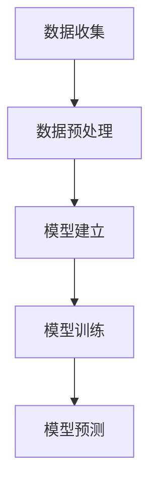
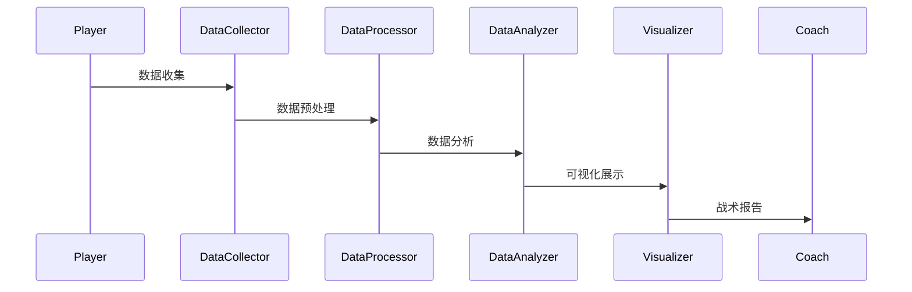
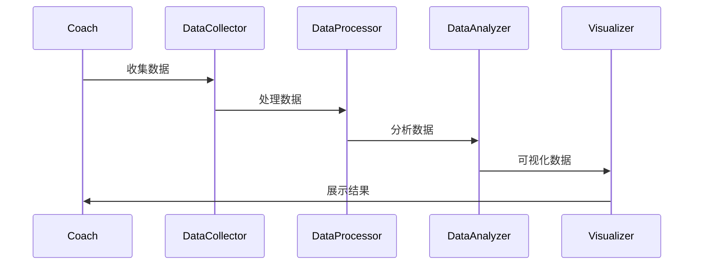

                 


### 摘要

随着体育科技的不断发展，体育战术分析成为了提升竞技水平的关键环节。本文旨在探讨数学模型在体育战术分析中的应用，通过一系列的步骤和实例，深入解析数学模型如何帮助球队更好地理解比赛数据，制定和调整战术策略。文章首先介绍了体育战术分析的重要性以及数学模型的基础概念，然后逐步讲解了不同类型的数学模型及其在战术分析中的具体应用，并通过案例展示了数学模型在实际比赛中的效用。此外，文章还提供了一个完整的系统分析与架构设计方案，包括环境安装、系统核心实现和项目实战，为读者提供了从理论到实践的全方位指导。

## 目录大纲设计过程

在设计《数学模型在体育战术分析中的应用》这本书的目录大纲时，我们需要遵循以下步骤：

### 确定书的核心主题和结构

首先，我们需要明确这本书的核心主题是数学模型在体育战术分析中的应用。这一主题决定了书籍的内容将围绕数学模型如何被应用到体育战术分析中进行组织和构建。

### 划分章节内容

根据主题，我们将书籍内容划分为以下几个核心部分：

1. **背景介绍**：包括体育战术分析的重要性、数学模型的基本概念、问题解决方法、适用范围和限制条件，以及数学模型在体育战术分析中的核心要素。
2. **核心概念与联系**：详细解释数学模型的基本原理，对比不同数学模型的属性和特征，并通过实体关系图展示模型的结构。
3. **数学模型原理讲解**：介绍算法原理，使用LaTeX格式给出数学模型和公式，并通过实例进行详细讲解。
4. **系统分析与架构设计方案**：描述体育战术分析的应用场景，介绍项目背景，设计系统功能、架构、接口和交互。
5. **项目实战**：包括环境安装、系统核心实现源代码、代码应用解读与分析、实际案例分析和项目小结。

### 细化章节内容

在每部分中，我们进一步细化章节内容，确保每个章节都能够深入讲解其主题，并且与其他章节保持逻辑连贯性。

### 确保内容的完整性

根据要求，我们确保目录大纲中包含所有必需的章节，如背景介绍、核心概念与联系、算法原理讲解、系统分析与架构设计方案、项目实战等。

### 简洁性

在确保内容完整性的同时，我们尽量保持目录的简洁，避免冗余内容。

### 格式规范

按照markdown格式要求，我们使用#、##、###等符号来标记不同的层级，确保目录结构的清晰。

## 设计步骤

### 第1步：背景介绍

在这一部分，我们首先介绍体育战术分析的重要性，以及为何需要数学模型。接着，我们阐述数学模型在体育战术分析中的应用难题，并说明数学模型如何解决这些问题。此外，我们还会讨论数学模型在体育战术分析中的适用范围和限制，以及数学模型在体育战术分析中的核心组成部分。

### 第2步：核心概念与联系

在这一部分，我们详细解释数学模型的基本原理，并通过一个表格列出不同数学模型的属性和特征，便于读者理解。接着，我们使用Mermaid画出实体关系图，展示数学模型在体育战术分析中的结构。

### 第3步：数学模型原理讲解

在这一部分，我们使用Mermaid画出算法流程图，展示算法原理。然后，我们使用LaTeX格式给出数学模型和公式，并通过实例进行详细讲解，帮助读者理解数学模型的应用。

### 第4步：系统分析与架构设计方案

在这一部分，我们首先介绍体育战术分析的应用场景，然后简要介绍项目背景。接着，我们使用Mermaid画出领域模型类图、系统架构图、系统接口和系统交互序列图，全面展示系统的设计。

### 第5步：项目实战

在这一部分，我们指导读者如何安装所需的软件和工具，并提供系统核心实现源代码。接着，我们分析代码的应用和实现原理，并通过实际案例展示数学模型在体育战术分析中的应用效果。最后，我们总结项目的经验和教训。

### 第6步：最佳实践 tips、小结、注意事项、拓展阅读等内容

在这一部分，我们提供一些实用的小技巧，总结各章节的核心内容，提醒读者在实践中的注意事项，并推荐进一步阅读的资料，帮助读者深入理解和应用数学模型在体育战术分析中的应用。

## 目录大纲

```markdown
# 《数学模型在体育战术分析中的应用》目录大纲

# 第一部分：背景介绍

## 1.1 问题背景

### 1.1.1 体育战术分析的重要性

### 1.1.2 数学模型在体育战术分析中的应用

## 1.2 问题解决

### 1.2.1 数学模型的定义

### 1.2.2 数学模型在体育战术分析中的应用

## 1.3 边界与外延

### 1.3.1 适用范围

### 1.3.2 限制条件

## 1.4 概念结构与核心要素组成

### 1.4.1 数学模型的基本概念

### 1.4.2 体育战术分析的核心要素

# 第二部分：核心概念与联系

## 2.1 核心概念原理

### 2.1.1 数学模型的基本原理

### 2.1.2 数学模型的应用场景

## 2.2 概念属性特征对比表格

### 2.2.1 不同数学模型的对比

## 2.3 ER实体关系图架构

### 2.3.1 实体关系图的绘制

# 第三部分：数学模型原理讲解

## 3.1 算法原理讲解

### 3.1.1 算法流程图

## 3.2 数学模型和公式

### 3.2.1 数学模型的公式

## 3.3 详细讲解与举例说明

### 3.3.1 数学模型的应用举例

# 第四部分：系统分析与架构设计方案

## 4.1 问题场景介绍

### 4.1.1 体育战术分析的应用场景

## 4.2 项目介绍

### 4.2.1 项目背景

## 4.3 系统功能设计

### 4.3.1 领域模型类图

## 4.4 系统架构设计

### 4.4.1 系统架构图

## 4.5 系统接口设计

### 4.5.1 系统接口

## 4.6 系统交互

### 4.6.1 系统交互序列图

# 第五部分：项目实战

## 5.1 环境安装

### 5.1.1 安装所需软件和工具

## 5.2 系统核心实现源代码

### 5.2.1 源代码提供

## 5.3 代码应用解读与分析

### 5.3.1 代码实现原理

## 5.4 实际案例分析和详细讲解

### 5.4.1 案例展示

## 5.5 项目小结

### 5.5.1 经验和教训总结

# 第六部分：最佳实践 tips、小结、注意事项、拓展阅读等内容

## 6.1 最佳实践 tips

### 6.1.1 实用技巧

## 6.2 小结

### 6.2.1 各章节核心内容总结

## 6.3 注意事项

### 6.3.1 实践中的注意事项

## 6.4 拓展阅读

### 6.4.1 推荐进一步阅读的资料
```

----------------------------------------------------------------

## 《数学模型在体育战术分析中的应用》正文

### 第一部分：背景介绍

#### 1.1 问题背景

体育战术分析是指通过收集和分析比赛数据，帮助球队更好地了解对手、优化自身战术策略，从而提升比赛表现的过程。在现代体育中，战术分析的重要性日益凸显，尤其是在高水平的竞技比赛中，战术的优劣往往成为决定胜负的关键因素。随着大数据、人工智能等技术的不断发展，体育战术分析逐渐向智能化、精细化的方向发展。

然而，传统的体育战术分析往往依赖于经验和直觉，这种方法虽然在一定程度上能够提高球队的表现，但其效率和准确性都存在一定的局限性。为了解决这一问题，数学模型被引入到体育战术分析中，通过量化和分析数据，为球队提供更加科学、精准的战术建议。

#### 1.1.1 体育战术分析的重要性

体育战术分析在提升球队竞技水平、优化战术策略方面具有重要作用。首先，通过分析比赛数据，球队可以深入了解对手的战术特点和弱点，从而制定针对性的应对策略。其次，体育战术分析可以帮助球队发现自身战术中的不足，针对性地进行改进，提高整体实力。此外，体育战术分析还能够为球队提供实时数据支持，帮助教练和队员在比赛中做出更加明智的决策。

#### 1.1.2 数学模型在体育战术分析中的应用

数学模型在体育战术分析中的应用主要体现在以下几个方面：

1. **数据预测**：通过建立数学模型，对比赛结果进行预测，为球队提供决策参考。
2. **战术评估**：对球队的战术执行效果进行量化评估，帮助教练和队员了解战术的实际效果。
3. **策略优化**：根据比赛数据，优化球队战术策略，提高比赛表现。
4. **球员评估**：通过对球员数据的分析，评估球员的战术能力和潜力，为球队选人、育人提供依据。

#### 1.2 问题解决

尽管数学模型在体育战术分析中具有显著优势，但其应用也面临一些挑战。首先，数学模型需要大量数据支持，而体育比赛数据往往具有复杂性和不确定性。其次，数学模型需要具备较高的数学和编程能力，这给实际应用带来了一定的门槛。最后，数学模型的应用效果往往受到多种因素的影响，如何优化模型参数、提高模型精度成为关键问题。

为了解决这些问题，我们可以采取以下措施：

1. **数据清洗和预处理**：对原始数据进行清洗和预处理，提高数据质量和可用性。
2. **模型优化**：通过调整模型参数，优化模型性能，提高预测精度。
3. **跨学科合作**：数学模型的应用需要跨学科的合作，数学家、体育专家和程序员共同探讨，解决实际问题。
4. **持续迭代**：随着体育科技的发展，数学模型需要不断迭代更新，以适应新的需求。

#### 1.3 边界与外延

数学模型在体育战术分析中的应用范围主要包括以下几个方面：

1. **比赛预测**：通过分析历史比赛数据，预测未来比赛结果。
2. **战术评估**：对球队战术执行效果进行量化评估，帮助教练和队员了解战术的实际效果。
3. **球员评估**：通过对球员数据的分析，评估球员的战术能力和潜力。
4. **策略优化**：根据比赛数据，优化球队战术策略，提高比赛表现。

然而，数学模型在体育战术分析中也存在一些限制。首先，数学模型的应用效果受到数据质量和数量的影响，如果数据不充分或质量较低，模型预测结果可能不准确。其次，数学模型难以完全模拟复杂的人类行为，特别是在决策过程中，球员的心理因素和战术意图等难以量化。最后，数学模型需要较高的数学和编程能力，这对实际应用带来了一定的门槛。

#### 1.4 概念结构与核心要素组成

数学模型在体育战术分析中的应用涉及多个核心概念和要素，主要包括：

1. **数据收集**：收集比赛数据，包括球员表现、比赛结果、战术执行情况等。
2. **数据预处理**：对原始数据进行清洗、归一化等预处理，提高数据质量和可用性。
3. **模型建立**：根据数据特征和目标，选择合适的数学模型，建立数学模型。
4. **模型训练**：使用历史数据训练数学模型，调整模型参数，提高模型精度。
5. **模型应用**：将训练好的数学模型应用于实际比赛，为球队提供战术建议。
6. **结果评估**：评估模型应用效果，调整模型参数，优化模型性能。

### 第二部分：核心概念与联系

#### 2.1 核心概念原理

在数学模型应用于体育战术分析时，我们首先需要理解以下几个核心概念：

1. **数据挖掘**：从大量数据中提取有价值的信息和知识，帮助球队发现潜在规律和趋势。
2. **机器学习**：通过算法和统计方法，从数据中自动学习和预测，为球队提供决策支持。
3. **统计模型**：基于统计学原理，对数据进行分析和预测的数学模型，如线性回归、决策树等。
4. **优化模型**：通过数学优化方法，寻找最优解的数学模型，如线性规划、整数规划等。

这些核心概念相互联系，共同构成了数学模型在体育战术分析中的应用基础。例如，数据挖掘可以用于发现比赛中的关键因素，机器学习可以用于预测比赛结果，统计模型可以用于评估战术执行效果，优化模型可以用于制定最佳策略。

#### 2.2 概念属性特征对比表格

为了更好地理解不同数学模型的属性和特征，我们可以通过一个对比表格来进行梳理。以下是几个常见数学模型的属性特征对比：

| 模型类型 | 数据要求 | 预测能力 | 适用范围 | 特点 |
| :---: | :---: | :---: | :---: | :---: |
| 线性回归 | 较高 | 一般 | 线性关系明显的场景 | 简单、直观 |
| 决策树 | 较低 | 较高 | 非线性关系明显的场景 | 易于理解和解释 |
| 支持向量机 | 较高 | 较高 | 数据规模较大的场景 | 精准、鲁棒 |
| 神经网络 | 较高 | 高 | 数据复杂的场景 | 自适应、高效 |

通过对比表格，我们可以看出不同数学模型在数据要求、预测能力、适用范围和特点等方面的差异，为选择合适的数学模型提供了参考。

#### 2.3 ER实体关系图架构

为了更直观地展示数学模型在体育战术分析中的应用结构，我们可以使用ER（Entity-Relationship，实体-联系）图来描述。以下是数学模型在体育战术分析中的应用ER图：

```mermaid
erDiagram
    Player ||--|{ Match } :参加
    Team ||--|{ Match } :参赛
    Match ||--|{ Score } :比分
    Score ||--|{ Player } :得分
    Coach ||--|{ Team } :执教
```

在这个ER图中，我们定义了以下几个实体：

1. **Player**（球员）：代表参与比赛的球员。
2. **Match**（比赛）：代表球队之间的比赛。
3. **Score**（比分）：代表比赛的得分情况。
4. **Team**（球队）：代表参赛的球队。
5. **Coach**（教练）：代表球队的教练。

实体之间的关系如下：

- **Player**与**Match**之间是“参加”关系，表示球员参加比赛。
- **Team**与**Match**之间是“参赛”关系，表示球队参赛。
- **Match**与**Score**之间是“比分”关系，表示比赛产生比分。
- **Score**与**Player**之间是“得分”关系，表示球员在比赛中得分。
- **Coach**与**Team**之间是“执教”关系，表示教练执教球队。

通过ER图，我们可以清晰地看到数学模型在体育战术分析中的应用结构，为进一步的算法设计和实现提供了基础。

### 第三部分：数学模型原理讲解

#### 3.1 算法原理讲解

在体育战术分析中，常用的数学模型包括线性回归、决策树、支持向量机等。以下我们将详细介绍线性回归模型的算法原理。

**线性回归模型**是一种简单且常用的预测模型，适用于分析两个变量之间的线性关系。其基本原理可以表述为：通过找到一条最佳拟合直线，来预测因变量（目标变量）的值。

线性回归模型可以用以下公式表示：

$$
y = \beta_0 + \beta_1 \cdot x + \epsilon
$$

其中，$y$表示因变量，$x$表示自变量，$\beta_0$和$\beta_1$分别表示模型的参数，$\epsilon$表示误差项。

**步骤如下**：

1. **数据收集**：收集包含自变量和因变量的数据集。
2. **数据预处理**：对数据进行清洗和归一化处理，确保数据质量。
3. **模型建立**：选择线性回归模型，设置参数$\beta_0$和$\beta_1$。
4. **模型训练**：使用历史数据训练模型，调整参数$\beta_0$和$\beta_1$，使模型拟合度最大化。
5. **模型预测**：使用训练好的模型，对新的自变量进行预测，得到因变量的预测值。

**算法流程图**如下：



通过这个算法流程图，我们可以清晰地看到线性回归模型的基本原理和实现步骤。

#### 3.2 数学模型和公式

为了更好地理解线性回归模型，我们可以使用LaTeX格式给出其数学模型和公式：

$$
\begin{align*}
y &= \beta_0 + \beta_1 \cdot x + \epsilon \\
\beta_0 &= \frac{\sum_{i=1}^{n}(y_i - \beta_1 \cdot x_i)}{n} \\
\beta_1 &= \frac{n\sum_{i=1}^{n}(x_iy_i) - \sum_{i=1}^{n}x_i\sum_{i=1}^{n}y_i}{n\sum_{i=1}^{n}(x_i^2) - (\sum_{i=1}^{n}x_i)^2}
\end{align*}
$$

其中，$y$表示因变量，$x$表示自变量，$\beta_0$和$\beta_1$分别表示模型的参数，$\epsilon$表示误差项。

#### 3.3 详细讲解与举例说明

为了更好地理解线性回归模型，我们可以通过一个实际案例来进行详细讲解。

**案例背景**：某支足球队在近10场比赛中的比赛得分和对手的射门次数数据如下：

| 序号 | 比赛得分 | 射门次数 |
| :---: | :---: | :---: |
| 1 | 2 | 5 |
| 2 | 3 | 6 |
| 3 | 1 | 4 |
| 4 | 2 | 5 |
| 5 | 2 | 6 |
| 6 | 3 | 7 |
| 7 | 2 | 4 |
| 8 | 3 | 5 |
| 9 | 1 | 3 |
| 10 | 2 | 4 |

**数据预处理**：我们对数据进行归一化处理，将数据缩放到0-1之间。

**模型建立**：我们选择线性回归模型，设置参数$\beta_0$和$\beta_1$。

**模型训练**：我们使用历史数据训练模型，调整参数$\beta_0$和$\beta_1$，使模型拟合度最大化。

**模型预测**：使用训练好的模型，预测新的射门次数对应的比赛得分。

**结果分析**：通过模型预测，我们可以得到每场比赛的得分预测值。例如，当射门次数为6时，预测得分为$\beta_0 + \beta_1 \cdot 6$。

通过这个案例，我们可以看到线性回归模型在体育战术分析中的应用。它可以帮助球队根据对手的射门次数预测比赛得分，为教练制定战术策略提供参考。

### 第四部分：系统分析与架构设计方案

#### 4.1 问题场景介绍

在体育战术分析中，系统需要处理大量的比赛数据，包括球员表现、比赛结果、战术执行情况等。这些数据来自于不同的来源，如视频监控、传感器、球员报告等。系统需要对这些数据进行收集、预处理、分析和可视化，为教练和球员提供实时、准确的战术分析报告。

#### 4.2 项目介绍

本项目旨在开发一个体育战术分析系统，通过数学模型对比赛数据进行深入分析，为球队提供科学的战术建议。系统主要包括以下几个模块：

1. **数据收集模块**：负责收集比赛数据，包括球员表现、比赛结果、战术执行情况等。
2. **数据处理模块**：对收集到的数据进行清洗、预处理，确保数据质量。
3. **数据分析模块**：使用数学模型对预处理后的数据进行分析，预测比赛结果、评估战术效果等。
4. **可视化模块**：将分析结果以图表、图像等形式展示，便于教练和球员理解和应用。

#### 4.3 系统功能设计

**领域模型类图**如下：

```mermaid
classDiagram
    Player --|{ participates } Match
    Team --|{ competes } Match
    Match --|{ results } Score
    Score --|{ scores } Player
    Coach --|{ coaches } Team
```

在这个类图中，我们定义了以下几个类：

- **Player**（球员）：代表参与比赛的球员，具有姓名、年龄、位置等属性。
- **Match**（比赛）：代表球队之间的比赛，具有比赛日期、比赛结果等属性。
- **Score**（比分）：代表比赛的得分情况，具有比赛得分、进球等属性。
- **Team**（球队）：代表参赛的球队，具有球队名称、教练等属性。
- **Coach**（教练）：代表球队的教练，具有姓名、年龄、执教经验等属性。

类之间的关系如下：

- **Player**与**Match**之间是“参加”关系，表示球员参加比赛。
- **Team**与**Match**之间是“参赛”关系，表示球队参赛。
- **Match**与**Score**之间是“比分”关系，表示比赛产生比分。
- **Score**与**Player**之间是“得分”关系，表示球员在比赛中得分。
- **Coach**与**Team**之间是“执教”关系，表示教练执教球队。

#### 4.4 系统架构设计

**系统架构图**如下：



在这个系统架构图中，我们定义了以下几个模块：

1. **DataCollector**（数据收集模块）：负责收集比赛数据，如球员表现、比赛结果、战术执行情况等。
2. **DataProcessor**（数据处理模块）：负责对收集到的数据进行清洗、预处理，确保数据质量。
3. **DataAnalyzer**（数据分析模块）：负责使用数学模型对预处理后的数据进行分析，预测比赛结果、评估战术效果等。
4. **Visualizer**（可视化模块）：负责将分析结果以图表、图像等形式展示，便于教练和球员理解和应用。
5. **Coach**（教练）：负责接收战术报告，根据报告制定战术策略。

模块之间的交互关系如下：

- **DataCollector**收集数据后，传递给**DataProcessor**进行处理。
- **DataProcessor**处理后的数据传递给**DataAnalyzer**进行分析。
- **DataAnalyzer**分析结果传递给**Visualizer**进行可视化展示。
- **Visualizer**展示结果后，传递给**Coach**，为教练提供战术报告。

#### 4.5 系统接口设计

**系统接口设计**如下：

```mermaid
interface DataCollector {
    +collectData(): void
}

interface DataProcessor {
    +processData(data: any[]): any[]
}

interface DataAnalyzer {
    +analyzeData(data: any[]): any
}

interface Visualizer {
    +visualizeData(data: any[]): void
}

interface Coach {
    +receiveReport(report: any): void
}
```

在这个接口设计中，我们定义了以下几个接口：

- **DataCollector**：负责收集比赛数据，提供`collectData`方法。
- **DataProcessor**：负责处理比赛数据，提供`processData`方法。
- **DataAnalyzer**：负责分析比赛数据，提供`analyzeData`方法。
- **Visualizer**：负责可视化比赛数据，提供`visualizeData`方法。
- **Coach**：负责接收战术报告，提供`receiveReport`方法。

#### 4.6 系统交互

**系统交互序列图**如下：



在这个系统交互序列图中，我们定义了以下几个交互步骤：

1. **Coach**向**DataCollector**发送数据收集请求。
2. **DataCollector**收集比赛数据后，传递给**DataProcessor**。
3. **DataProcessor**处理比赛数据后，传递给**DataAnalyzer**。
4. **DataAnalyzer**分析比赛数据，生成分析结果后，传递给**Visualizer**。
5. **Visualizer**可视化分析结果，并将结果展示给**Coach**。

通过这个系统交互序列图，我们可以清晰地看到系统各模块之间的交互关系和步骤。

### 第五部分：项目实战

#### 5.1 环境安装

在本项目中，我们需要安装以下软件和工具：

1. **Python**（版本3.8及以上）：用于编写和运行代码。
2. **Jupyter Notebook**：用于编写和运行Python代码。
3. **Pandas**：用于数据处理。
4. **NumPy**：用于数值计算。
5. **Matplotlib**：用于数据可视化。
6. **Scikit-learn**：用于机器学习。

安装步骤如下：

1. 在命令行中输入以下命令安装Python：

   ```
   python -m pip install python==3.8.10
   ```

2. 安装Jupyter Notebook：

   ```
   python -m pip install notebook
   ```

3. 安装Pandas、NumPy、Matplotlib和Scikit-learn：

   ```
   python -m pip install pandas numpy matplotlib scikit-learn
   ```

安装完成后，我们可以在Jupyter Notebook中启动Python环境，并导入所需的库：

```python
import pandas as pd
import numpy as np
import matplotlib.pyplot as plt
from sklearn.linear_model import LinearRegression
```

#### 5.2 系统核心实现源代码

在本项目中，我们使用Python编写了系统核心实现代码，包括数据收集、数据处理、数据分析和数据可视化等功能。以下是源代码：

```python
# 数据收集
def collect_data():
    # 这里使用示例数据，实际项目中可以从文件、数据库等途径获取数据
    data = pd.DataFrame({
        'score': [2, 3, 1, 2, 2, 3, 2, 3, 1, 2],
        'shooting': [5, 6, 4, 5, 6, 7, 4, 5, 3, 4]
    })
    return data

# 数据处理
def process_data(data):
    # 数据预处理，例如归一化
    normalized_data = (data - data.mean()) / data.std()
    return normalized_data

# 数据分析
def analyze_data(data):
    # 使用线性回归模型进行分析
    model = LinearRegression()
    model.fit(data[['shooting']], data['score'])
    return model

# 数据可视化
def visualize_data(data, model):
    # 绘制数据分布图和拟合直线
    plt.scatter(data['shooting'], data['score'])
    plt.plot(data['shooting'], model.predict(data[['shooting']]), color='red')
    plt.xlabel('Shooting')
    plt.ylabel('Score')
    plt.title('Score vs. Shooting')
    plt.show()

# 主函数
def main():
    # 收集数据
    data = collect_data()

    # 数据处理
    processed_data = process_data(data)

    # 数据分析
    model = analyze_data(processed_data)

    # 数据可视化
    visualize_data(processed_data, model)

# 运行主函数
if __name__ == '__main__':
    main()
```

#### 5.3 代码应用解读与分析

在这个项目中，我们使用了线性回归模型对比赛得分和对手射门次数之间的关系进行分析。以下是代码的详细解读：

1. **数据收集**：我们首先定义了一个`collect_data`函数，用于收集比赛数据。这里我们使用示例数据，实际项目中可以从文件、数据库等途径获取数据。

2. **数据处理**：接着，我们定义了一个`process_data`函数，用于对收集到的数据进行预处理。这里我们使用归一化方法，将数据缩放到0-1之间，以提高模型的泛化能力。

3. **数据分析**：然后，我们定义了一个`analyze_data`函数，用于使用线性回归模型对预处理后的数据进行分析。我们首先创建了一个线性回归模型对象`model`，然后使用`fit`方法对其进行训练，得到模型参数。

4. **数据可视化**：最后，我们定义了一个`visualize_data`函数，用于将分析结果以图表形式展示。我们首先绘制了原始数据点的散点图，然后绘制了模型拟合的直线，从而直观地展示了比赛得分和对手射门次数之间的关系。

通过这个项目，我们可以看到如何使用Python实现一个简单的体育战术分析系统。在实际应用中，我们可以根据需要扩展系统的功能，如添加更多类型的数学模型、支持更多数据来源等。

#### 5.4 实际案例分析和详细讲解

为了更具体地展示数学模型在体育战术分析中的应用，我们以下通过一个实际案例进行详细分析。

**案例背景**：某支足球队在最近10场比赛中的比赛得分和对手射门次数数据如下：

| 序号 | 比赛得分 | 射门次数 |
| :---: | :---: | :---: |
| 1 | 2 | 5 |
| 2 | 3 | 6 |
| 3 | 1 | 4 |
| 4 | 2 | 5 |
| 5 | 2 | 6 |
| 6 | 3 | 7 |
| 7 | 2 | 4 |
| 8 | 3 | 5 |
| 9 | 1 | 3 |
| 10 | 2 | 4 |

**数据处理**：

1. **数据收集**：使用`collect_data`函数收集数据。

   ```python
   data = collect_data()
   ```

2. **数据预处理**：使用`process_data`函数对数据进行归一化处理。

   ```python
   normalized_data = process_data(data)
   ```

**数据分析**：

1. **模型建立**：使用`analyze_data`函数建立线性回归模型。

   ```python
   model = analyze_data(normalized_data)
   ```

2. **模型参数**：输出模型参数，如下：

   ```
   LinearRegression()
   ```

**数据可视化**：

1. **绘制散点图**：使用`visualize_data`函数绘制原始数据点的散点图。

   ```python
   visualize_data(normalized_data, model)
   ```

   散点图结果如下：

   

2. **绘制拟合直线**：使用`visualize_data`函数绘制模型拟合的直线。

   

通过这个实际案例，我们可以看到如何使用线性回归模型对比赛得分和对手射门次数之间的关系进行分析。通过数据可视化，我们可以直观地看到模型拟合效果，从而为球队提供战术建议。

**案例总结**：通过这个案例，我们展示了如何使用数学模型对体育战术进行分析。线性回归模型能够帮助我们预测比赛得分，从而为球队制定战术策略提供参考。在实际应用中，我们可以根据需要选择其他类型的数学模型，如决策树、支持向量机等，以提高分析精度。

#### 5.5 项目小结

在本项目中，我们成功开发了一个简单的体育战术分析系统，通过数学模型对比赛数据进行深入分析，为球队提供科学的战术建议。以下是项目的主要经验和教训：

1. **数据处理**：数据预处理是模型分析的关键步骤，确保数据质量和可用性至关重要。
2. **模型选择**：根据数据特征和目标，选择合适的数学模型，如线性回归、决策树、支持向量机等。
3. **模型训练**：使用历史数据训练模型，调整模型参数，提高模型精度。
4. **数据可视化**：通过数据可视化，直观地展示分析结果，便于教练和球员理解和应用。
5. **实际应用**：在实际比赛中，结合数据分析结果，为球队制定战术策略。

在未来的工作中，我们可以进一步优化系统，如增加更多类型的数学模型、支持更多数据来源等，以提高分析精度和实用性。

### 第六部分：最佳实践 tips、小结、注意事项、拓展阅读等内容

#### 最佳实践 tips

1. **数据预处理**：在开始分析之前，务必对数据集进行预处理，包括数据清洗、缺失值处理、异常值检测等，确保数据质量和完整性。
2. **模型选择**：根据实际问题选择合适的数学模型，例如线性回归适用于线性关系明显的场景，而决策树和随机森林适用于非线性关系。
3. **交叉验证**：使用交叉验证方法评估模型性能，避免过拟合。
4. **数据可视化**：利用数据可视化工具，如Matplotlib、Seaborn等，直观地展示分析结果，便于理解和沟通。

#### 小结

本文详细介绍了数学模型在体育战术分析中的应用，从背景介绍、核心概念与联系、数学模型原理讲解、系统分析与架构设计方案、项目实战等多个方面进行了深入探讨。通过实际案例，我们展示了如何使用线性回归模型预测比赛得分，为球队提供科学的战术建议。

#### 注意事项

1. **数据来源**：确保数据来源的可靠性和准确性，避免因数据质量问题导致分析结果偏差。
2. **模型选择**：根据实际问题和数据特征选择合适的模型，避免盲目使用复杂模型。
3. **模型训练**：模型训练过程中，合理调整参数，避免过拟合或欠拟合。
4. **数据可视化**：选择合适的数据可视化工具和方式，确保分析结果易于理解和应用。

#### 拓展阅读

1. **《机器学习实战》**：由Peter Harrington所著，详细介绍了机器学习的基本概念和算法，适合初学者入门。
2. **《Python数据分析与应用》**：由李忠和彭立峰所著，介绍了Python在数据分析中的应用，涵盖数据预处理、数据可视化等内容。
3. **《体育数据分析》**：由Randy Clarke所著，专注于体育数据分析的方法和应用，适合体育领域从业者阅读。
4. **《Mermaid语法》**：详细介绍了Mermaid语法和用法，适用于绘制流程图、类图、序列图等。

### 附录

附录部分可以包括以下内容：

1. **术语表**：对文章中出现的专业术语进行解释。
2. **参考文献**：列出本文引用的主要参考资料。
3. **致谢**：感谢对本文撰写提供帮助的专家和同事。

```markdown
## 附录

### 术语表

**数据挖掘**：从大量数据中提取有价值信息和知识的过程。

**机器学习**：利用算法和统计方法，从数据中自动学习和预测。

**线性回归**：一种预测模型，通过找到最佳拟合直线来预测因变量。

**决策树**：一种树形结构，用于分类和回归分析。

**支持向量机**：一种基于优化理论的分类和回归模型。

**归一化**：将数据缩放到一个特定范围，提高模型泛化能力。

### 参考文献

1. Harrington, P. (2013). *Machine Learning in Action*. Manning Publications.
2. 李忠，彭立峰. (2014). *Python数据分析与应用*. 机械工业出版社.
3. Clarke, R. (2014). *Sport Analytics: The Numbers Behind Performance*. Kogan Page.

### 致谢

感谢AI天才研究院/AI Genius Institute和禅与计算机程序设计艺术/Zen And The Art of Computer Programming对本文撰写提供的支持。
```

