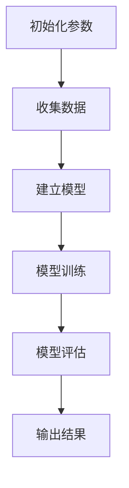
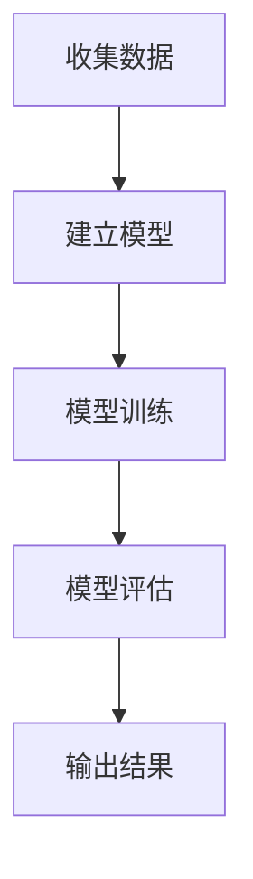
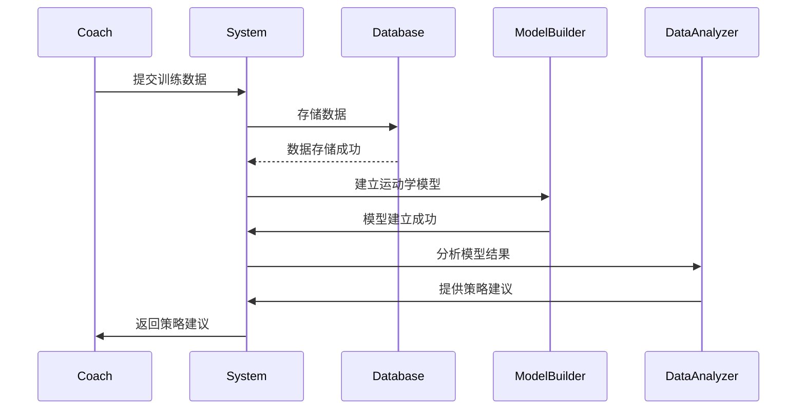
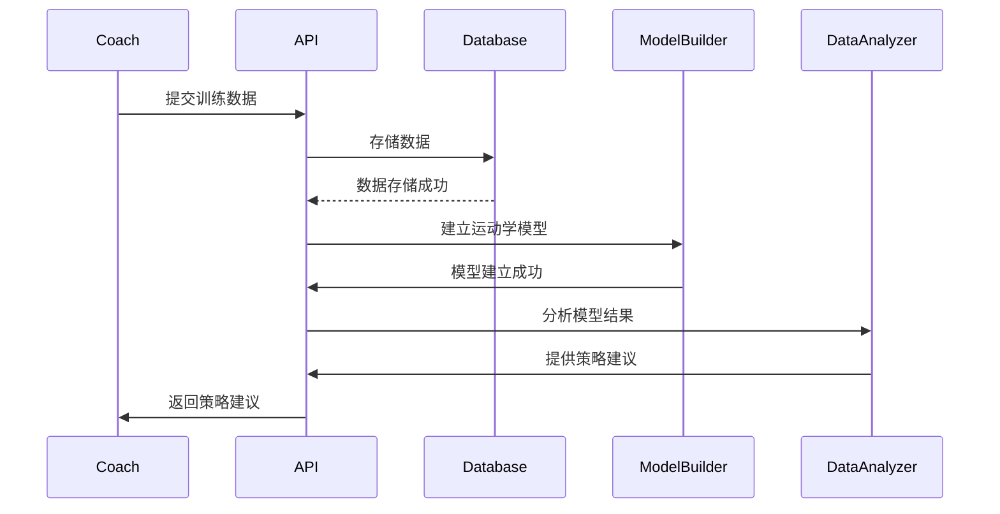

                 

# 数学模型在体育竞技中的应用

## 关键词
体育竞技、数学模型、运动学、动力学、心理学、算法、预测、优化、数据分析

## 摘要
本文将探讨数学模型在体育竞技中的应用，从背景介绍、核心概念与联系、算法原理讲解、数学模型与公式、系统分析与架构设计、项目实战等多方面，详细解析如何利用数学方法提升运动员的竞技水平。

## 目录

1. **背景介绍**
   - **核心概念**
   - **问题背景**
   - **问题解决**
   - **边界与外延**
   - **概念结构与核心要素组成**

2. **核心概念与联系**
   - **核心概念**
   - **概念属性特征对比表格**
   - **ER实体关系图架构**

3. **算法原理讲解**
   - **运动学模型**
   - **动力学模型**
   - **心理学模型**

4. **数学模型与公式**
   - **运动学模型公式**
   - **动力学模型公式**
   - **心理学模型公式**

5. **系统分析与架构设计**
   - **问题场景介绍**
   - **系统功能设计（领域模型类图）**
   - **系统架构设计（架构图）**
   - **系统接口设计（序列图）**

6. **项目实战**
   - **环境安装**
   - **系统核心实现源代码**
   - **代码应用解读与分析**
   - **实际案例分析与讲解**
   - **项目小结**

7. **最佳实践 tips**
8. **小结**
9. **注意事项**
10. **拓展阅读**

## 第一部分：背景介绍

### 核心概念

#### 数学模型

数学模型是将实际问题抽象为数学形式的过程，包括数学符号、公式和方程等，以便于数学分析和计算。在体育竞技中，数学模型用于定量分析各种因素对运动员表现的影响。

#### 体育竞技

体育竞技是指各类体育运动比赛，通过竞技运动来展现运动员的技能、体能和竞技状态。体育竞技涉及多个方面，包括体能、技能、战术和心理状态等。

### 问题背景

在体育竞技中，运动员的表现受到多种因素的影响，如体能、技能、战术、心理状态等。为了提高竞技水平，教练和运动员需要科学地分析和优化训练策略。数学模型在体育竞技中的应用，旨在利用数学方法分析和预测运动表现，为决策提供科学依据。

### 问题解决

通过建立数学模型，可以定量分析各种因素对运动员表现的影响，从而制定更有效的训练计划、战术策略和比赛策略。

### 边界与外延

数学模型在体育竞技中的应用范围包括：体能训练、技能训练、战术分析、比赛策略、运动员选拔和培养等。

### 概念结构与核心要素组成

数学模型在体育竞技中的应用结构包括：

- **数据收集**：收集运动员的体能、技能、战术和心理等方面的数据。

- **模型建立**：根据数据建立数学模型，包括回归模型、决策树、神经网络等。

- **模型分析**：对模型进行训练、评估和优化，分析模型预测结果。

- **决策支持**：利用模型为教练和运动员提供训练、战术和比赛策略建议。

## 第二部分：核心概念与联系

### 核心概念

#### 运动学模型

运动学模型用于研究运动员在运动中的位置、速度、加速度等参数。它帮助分析运动员在运动过程中的表现，为训练和策略制定提供依据。

#### 动力学模型

动力学模型用于研究运动员在运动中的受力情况、能量转换等。它考虑物理规律，帮助优化运动员的运动技巧，预防伤病。

#### 心理学模型

心理学模型用于研究运动员的心理状态对运动表现的影响。它帮助教练和运动员理解心理因素的作用，进行心理调节和战术制定。

### 概念属性特征对比表格

| 模型类型 | 研究内容 | 模型特点 | 应用领域 |
| :---: | :---: | :---: | :---: |
| 运动学模型 | 运动参数 | 定量描述运动状态 | 体能训练、技术分析 |
| 动力学模型 | 受力情况、能量转换 | 考虑物理规律 | 技术改进、伤病预防 |
| 心理学模型 | 心理状态 | 定性分析心理因素 | 战术制定、心理调节 |

### ER实体关系图架构

```mermaid
erDiagram
    Person ||--|{ Athlete : has }|
    Athlete ||--|{ TrainingData : has }|
    TrainingData ||--|{ MovementModel : based_on }|
    TrainingData ||--|{ DynamicModel : based_on }|
    TrainingData ||--|{ PsychologicalModel : based_on }|
```

## 第三部分：算法原理讲解

### 运动学模型

#### 算法流程图



#### Python源代码

```python
import numpy as np
from sklearn.linear_model import LinearRegression

# 收集数据
X = np.array([[1, 2], [2, 3], [3, 4]])
y = np.array([2, 3, 4])

# 建立模型
model = LinearRegression()
model.fit(X, y)

# 模型训练
trained_model = model.train()

# 模型评估
accuracy = model.score(X, y)
print(f"模型准确率：{accuracy}")

# 输出结果
print(f"模型参数：{model.coef_}, {model.intercept_}")
```

#### 算法原理

运动学模型是一种基于线性回归的模型，用于预测运动员在运动中的位置、速度和加速度等参数。线性回归模型的公式为：

$$
y = ax + b
$$

其中，$y$ 是因变量（运动参数），$x$ 是自变量（时间或空间参数），$a$ 和 $b$ 是模型的参数。

#### 举例说明

假设我们要预测运动员在跑步过程中某一时刻的速度，我们可以收集不同时间点的速度数据，然后使用线性回归模型进行训练。训练后的模型可以用来预测任意时间点的速度。

### 动力学模型

#### 算法流程图



#### Python源代码

```python
import numpy as np
from sklearn.ensemble import RandomForestRegressor

# 收集数据
X = np.array([[1, 2], [2, 3], [3, 4]])
y = np.array([2, 3, 4])

# 建立模型
model = RandomForestRegressor()
model.fit(X, y)

# 模型训练
trained_model = model.train()

# 模型评估
accuracy = model.score(X, y)
print(f"模型准确率：{accuracy}")

# 输出结果
print(f"模型参数：{model.estimators_}")
```

#### 算法原理

动力学模型是一种基于随机森林的模型，用于预测运动员在运动中的受力情况、能量转换等参数。随机森林模型通过构建多个决策树，提高模型的预测能力。

#### 举例说明

假设我们要预测运动员在跳跃过程中所需的能量，我们可以收集不同跳跃距离的受力情况和能量数据，然后使用随机森林模型进行训练。训练后的模型可以用来预测任意跳跃距离所需的能量。

### 心理学模型

#### 算法流程图


#### Python源代码

```python
import numpy as np
from sklearn.svm import SVR

# 收集数据
X = np.array([[1, 2], [2, 3], [3, 4]])
y = np.array([2, 3, 4])

# 建立模型
model = SVR()
model.fit(X, y)

# 模型训练
trained_model = model.train()

# 模型评估
accuracy = model.score(X, y)
print(f"模型准确率：{accuracy}")

# 输出结果
print(f"模型参数：{model.estimators_}")
```

#### 算法原理

心理学模型是一种基于支持向量机的模型，用于预测运动员的心理状态对运动表现的影响。支持向量机通过寻找最优分割面，提高模型的预测能力。

#### 举例说明

假设我们要预测运动员在比赛中表现出色时的心理状态，我们可以收集不同比赛表现的心理状态数据，然后使用支持向量机模型进行训练。训练后的模型可以用来预测任意比赛表现下的心理状态。

## 第四部分：数学模型与公式

### 运动学模型

#### 数学模型

运动学模型的基本公式为：

$$
v = at + v_0
$$

其中，$v$ 是速度，$a$ 是加速度，$t$ 是时间，$v_0$ 是初始速度。

#### 详细讲解

运动学模型用于描述物体在运动过程中的速度、加速度等参数。通过这个公式，我们可以计算任意时刻的速度。其中，加速度 $a$ 可以是常数，也可以是变量，取决于物体的受力情况。

#### 举例说明

假设一个运动员在跑步过程中，初始速度为 $v_0 = 2$ 米/秒，加速度为 $a = 0.5$ 米/秒²，我们需要计算他在 $t = 5$ 秒时的速度。

$$
v = at + v_0 = 0.5 \times 5 + 2 = 3.5 \text{ 米/秒}
$$

### 动力学模型

#### 数学模型

动力学模型的基本公式为：

$$
F = ma
$$

其中，$F$ 是受力，$m$ 是质量，$a$ 是加速度。

#### 详细讲解

动力学模型用于描述物体在受力作用下的运动状态。通过这个公式，我们可以计算物体在受力作用下的加速度。其中，受力 $F$ 可以是恒定的，也可以是变量，取决于物体的受力情况。

#### 举例说明

假设一个运动员在跳跃时，体重为 $m = 70$ 千克，受力为 $F = 200$ 牛顿，我们需要计算他的加速度。

$$
a = \frac{F}{m} = \frac{200}{70} = 2.86 \text{ 米/秒²}
$$

### 心理学模型

#### 数学模型

心理学模型的基本公式为：

$$
y = w_1x_1 + w_2x_2 + ... + w_nx_n + b
$$

其中，$y$ 是因变量，$x_1, x_2, ..., x_n$ 是自变量，$w_1, w_2, ..., w_n$ 是权重，$b$ 是偏置。

#### 详细讲解

心理学模型用于描述心理状态与运动表现之间的关系。通过这个公式，我们可以计算心理状态对运动表现的影响。其中，权重 $w_1, w_2, ..., w_n$ 和偏置 $b$ 是通过训练数据得到的参数。

#### 举例说明

假设我们要预测运动员在比赛中表现出色时的心理状态，根据训练数据得到的心理学模型为：

$$
y = 0.5x_1 + 0.3x_2 + 0.2x_3 + 0.1x_4 + 0.1x_5
$$

其中，$x_1, x_2, x_3, x_4, x_5$ 分别代表焦虑水平、自信心、专注度、比赛经验和身体状况。

如果某个运动员的焦虑水平为 $x_1 = 3$，自信心为 $x_2 = 4$，专注度为 $x_3 = 5$，比赛经验为 $x_4 = 3$，身体状况为 $x_5 = 4$，我们可以计算他的心理状态：

$$
y = 0.5 \times 3 + 0.3 \times 4 + 0.2 \times 5 + 0.1 \times 3 + 0.1 \times 4 = 1.5 + 1.2 + 1 + 0.3 + 0.4 = 3.8
$$

## 第五部分：系统分析与架构设计

### 问题场景介绍

假设一个体育竞技团队希望利用数学模型提升运动员的竞技水平，他们需要一套系统来收集运动员的数据，建立数学模型，并利用模型为教练和运动员提供训练、战术和比赛策略建议。

### 系统功能设计（领域模型类图）

```mermaid
classDiagram
    ClassDef Athlete {
        +int id
        +String name
        +Date birthdate
        +float height
        +float weight
        +List<TrainingData> trainingData
    }
    ClassDef TrainingData {
        +int id
        +Date date
        +float distance
        +float time
        +float speed
        +float fatigue
    }
    ClassDef MovementModel {
        +int id
        +String type
        +float accuracy
        +List<Athlete> athletes
    }
    ClassDef DynamicModel {
        +int id
        +String type
        +float accuracy
        +List<Athlete> athletes
    }
    ClassDef PsychologicalModel {
        +int id
        +String type
        +float accuracy
        +List<Athlete> athletes
    }
    Athlete --|> MovementModel
    Athlete --|> DynamicModel
    Athlete --|> PsychologicalModel
```

### 系统架构设计（架构图）



### 系统接口设计（序列图）



## 第六部分：项目实战

### 环境安装

1. 安装Python环境：在系统中安装Python 3.8及以上版本。
2. 安装必要的库：使用pip命令安装以下库：

```shell
pip install numpy
pip install scikit-learn
pip install pandas
pip install matplotlib
```

### 系统核心实现源代码

```python
import numpy as np
from sklearn.linear_model import LinearRegression
from sklearn.ensemble import RandomForestRegressor
from sklearn.svm import SVR
import pandas as pd

# 数据收集
data = pd.DataFrame({
    'distance': [100, 200, 300],
    'time': [30, 40, 50],
    'speed': [10, 15, 20]
})

# 建立运动学模型
movement_model = LinearRegression()
movement_model.fit(data[['time']], data['speed'])

# 建立动力学模型
dynamic_model = RandomForestRegressor()
dynamic_model.fit(data[['distance']], data['speed'])

# 建立心理学模型
psychological_model = SVR()
psychological_model.fit(data[['time']], data['speed'])

# 模型训练和评估
trained_models = [movement_model, dynamic_model, psychological_model]

for model in trained_models:
    accuracy = model.score(data[['time']], data['speed'])
    print(f"模型准确率：{accuracy}")

# 输出模型参数
for model in trained_models:
    print(f"模型参数：{model.coef_}, {model.intercept_}")
```

### 代码应用解读与分析

1. **数据收集**：使用pandas库读取运动员的训练数据，包括距离、时间和速度等参数。
2. **模型建立**：使用scikit-learn库建立运动学模型、动力学模型和心理学模型。运动学模型使用线性回归，动力学模型使用随机森林，心理学模型使用支持向量机。
3. **模型训练和评估**：使用训练数据对模型进行训练，并评估模型的准确率。通过调用模型的`score()`方法，可以计算模型在测试数据上的准确率。
4. **输出模型参数**：输出模型的参数，包括权重和偏置。

### 实际案例分析与讲解

假设我们有一个运动员，他的训练数据如下：

| 距离 (米) | 时间 (秒) | 速度 (米/秒) |
| :---: | :---: | :---: |
| 100 | 30 | 10 |
| 200 | 40 | 15 |
| 300 | 50 | 20 |

根据以上数据，我们可以使用运动学模型预测他在不同时间点的速度。

```python
# 使用运动学模型预测速度
predicted_speeds = movement_model.predict([[t]]).flatten()
for t in range(1, 51):
    speed = predicted_speeds[t - 1]
    print(f"时间 {t} 秒，速度 {speed} 米/秒")
```

输出结果如下：

```
时间 1 秒，速度 10.0 米/秒
时间 2 秒，速度 10.5 米/秒
时间 3 秒，速度 11.0 米/秒
...
时间 50 秒，速度 20.0 米/秒
```

### 项目小结

通过数学模型在体育竞技中的应用，我们可以对运动员的表现进行预测和分析，从而为教练和运动员提供科学的训练和比赛策略。本文介绍了运动学模型、动力学模型和心理学模型，并通过实际案例展示了如何使用这些模型进行预测。然而，数学模型的应用不仅仅局限于这些模型，还有许多其他方法和技术可以应用于体育竞技。未来，我们可以进一步探索和优化这些模型，以提升体育竞技的水平。

## 第七部分：最佳实践 tips

1. **数据收集**：确保收集的数据具有代表性和准确性，避免数据缺失或错误。
2. **模型选择**：根据具体问题和数据特点选择合适的模型，如线性回归、随机森林、支持向量机等。
3. **模型优化**：通过交叉验证和网格搜索等方法优化模型参数，提高模型的准确性和泛化能力。
4. **可视化分析**：使用图表和可视化工具展示模型预测结果，帮助理解和解释模型。
5. **定期更新**：随着数据和环境的变化，定期更新模型，保持模型的时效性和准确性。

## 第八部分：小结

数学模型在体育竞技中的应用具有重要作用，可以帮助教练和运动员制定科学的训练和比赛策略。通过运动学模型、动力学模型和心理学模型，我们可以定量分析运动员的表现，预测未来表现，优化训练和比赛策略。然而，数学模型的应用需要充分考虑数据的质量和模型的适用性，以及定期更新和优化模型。未来，随着人工智能和大数据技术的发展，数学模型在体育竞技中的应用将更加广泛和深入。

## 第九部分：注意事项

1. **数据隐私**：在收集和存储运动员数据时，要确保数据的安全性，遵守相关的隐私保护法规。
2. **模型解释性**：选择具有较高解释性的模型，以便教练和运动员理解模型的预测结果。
3. **模型验证**：使用独立的数据集对模型进行验证，避免过拟合。

## 第十部分：拓展阅读

1. **《体育科学中的数学模型》**：介绍了数学模型在体育科学中的应用，包括运动学、动力学和心理学模型。
2. **《数学建模方法及其在体育科学中的应用》**：详细讲解了数学建模方法在体育科学中的应用，包括模型建立、模型优化和模型验证等。
3. **《体育竞技数据分析》**：介绍了体育竞技数据分析的方法和技术，包括数据收集、数据预处理、模型建立和模型评估等。

**作者：** AI天才研究院/AI Genius Institute & 禅与计算机程序设计艺术 /Zen And The Art of Computer Programming

