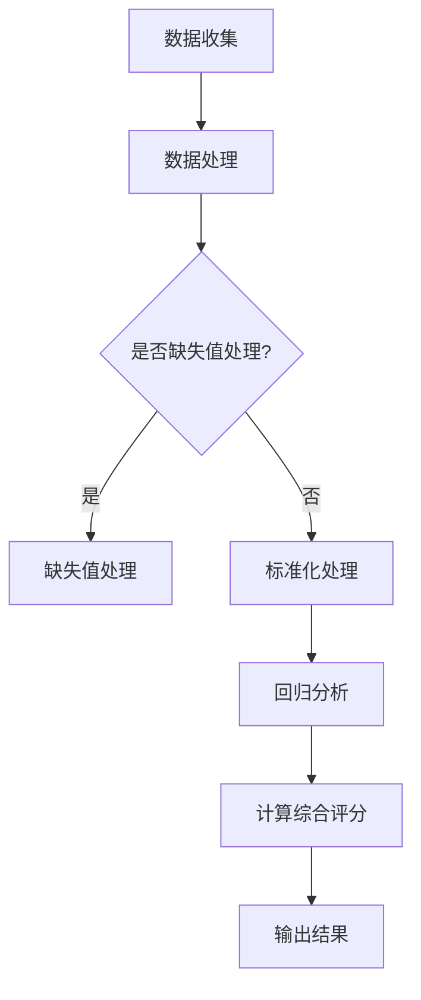
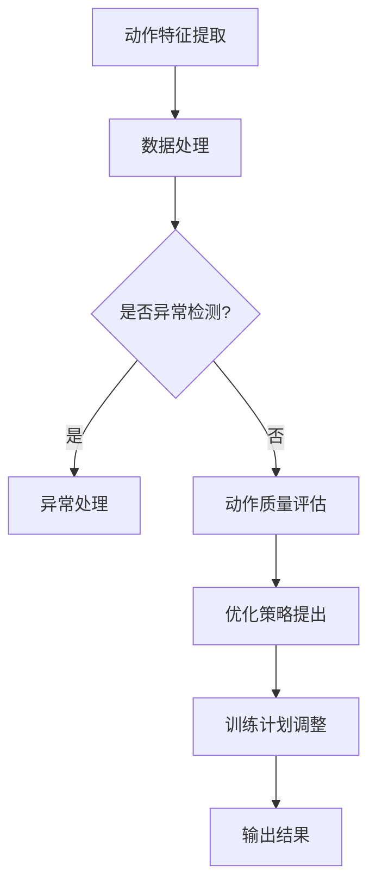
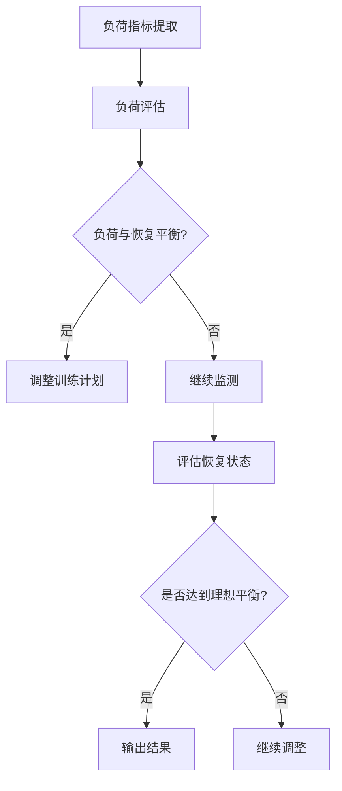
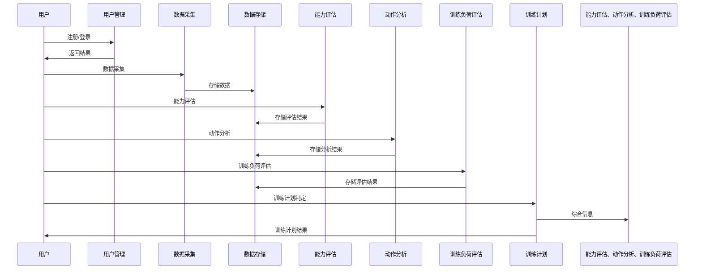
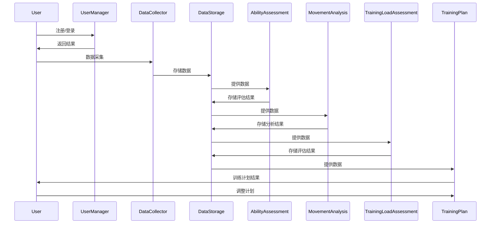

                 

### 文章标题：数学模型在体育训练中的应用

关键词：数学模型、体育训练、运动员能力、动作分析、训练负荷

摘要：本文将探讨数学模型在体育训练中的应用，通过详细的分析和实例讲解，展示数学模型如何帮助运动员提高训练效果、优化资源配置以及科学指导训练。本文将分为五个部分：首先介绍体育训练中的数学模型，然后深入探讨核心概念及其联系，接着讲解运动员能力模型和动作分析模型的原理，之后讨论系统架构设计与项目实战，最后总结最佳实践与注意事项。

## 目录大纲

1. **问题背景与数学模型概述**
   1.1 体育训练中的问题背景
   1.2 数学模型的基本概念与分类
   1.3 数学模型在体育训练中的应用意义
2. **体育训练中的核心概念与联系**
   2.1 核心概念介绍
   2.2 概念属性特征对比表格
   2.3 ER实体关系图架构
3. **数学模型原理与算法讲解**
   3.1 运动员能力模型原理讲解
   3.2 动作分析模型原理讲解
4. **系统架构设计与项目实战**
   4.1 系统架构设计与功能设计
   4.2 项目实战
5. **最佳实践与总结**
   5.1 最佳实践
   5.2 注意事项与解决方案
   5.3 拓展阅读

----------------------------------------------------------------

## 第一部分：问题背景与数学模型概述

### 1.1 体育训练中的问题背景

体育训练是一个复杂的过程，涉及到运动员的体能、技能和心理状态的全面提升。传统上，体育训练主要依靠教练的经验和直觉进行指导，然而随着科学的发展和技术的进步，数学模型在体育训练中的应用逐渐成为了一个热门研究领域。数学模型通过量化分析运动员的表现和训练数据，提供了一种科学、系统的训练方法，有助于提高训练效果和运动员的竞技水平。

在体育训练中，常见的问题包括如何科学制定训练计划、如何合理分配训练负荷、如何有效提高运动员的能力等。这些问题不仅涉及到运动员的生理和心理状态，还需要考虑到训练资源、训练环境等多个因素。数学模型的应用，能够帮助教练和运动员更好地理解和解决这些问题。

#### 问题描述

- **训练计划制定**：如何根据运动员的体能和技能水平，制定出科学合理的训练计划？
- **训练负荷分配**：如何在保证运动员健康的基础上，合理分配训练负荷？
- **能力提升**：如何通过训练，有效提高运动员的体能、技能和心理素质？

#### 问题解决

数学模型在体育训练中的应用，主要通过以下几个方面进行：

1. **运动员能力模型**：通过量化分析运动员的体能、技能和心理状态，构建运动员能力模型，为训练计划制定提供科学依据。
2. **动作分析模型**：通过对运动员动作的分析，找出动作中的不足和改进点，指导运动员进行针对性的训练。
3. **训练负荷模型**：通过分析运动员的训练数据，构建训练负荷模型，为训练负荷分配提供参考。

#### 边界与外延

数学模型在体育训练中的应用，边界在于如何准确地获取和分析数据，外延则包括如何将数学模型的应用范围扩展到其他体育项目，甚至跨领域应用。

#### 概念结构与核心要素组成

- **运动员能力模型**：包括体能、技能、心理状态等指标。
- **动作分析模型**：包括动作特征、分析方法等。
- **训练负荷模型**：包括负荷指标、模型构建方法等。

### 1.2 数学模型的基本概念与分类

数学模型是一种抽象的数学表示，用于描述现实世界中的某些现象或问题。在体育训练中，数学模型通过数据分析和算法计算，为训练指导提供科学依据。数学模型的基本概念包括：

- **数学公式**：用数学符号和语言描述问题。
- **算法**：解决问题的步骤和方法。
- **数据**：支持模型构建和计算的基础信息。

根据模型的应用领域和特点，数学模型可以分为以下几类：

- **统计模型**：通过对数据的统计分析，发现数据之间的关系和趋势。
- **优化模型**：通过优化算法，寻找最优解。
- **模拟模型**：通过模拟现实场景，预测未来的发展和变化。

#### 常见类型及应用

在体育训练中，常见的数学模型类型包括：

- **回归模型**：用于分析运动员能力与训练负荷之间的关系。
- **决策树**：用于决策训练计划制定和负荷分配。
- **神经网络**：用于动作分析和能力预测。

这些模型在不同的体育项目中有着广泛的应用，如篮球、足球、田径等。

### 1.3 数学模型在体育训练中的应用意义

数学模型在体育训练中的应用，具有以下几方面的意义：

- **提高训练效果**：通过科学的数据分析和模型计算，优化训练计划，提高运动员的竞技水平。
- **优化资源配置**：合理分配训练负荷，避免过度训练和运动损伤，提高训练效率。
- **科学指导训练**：为教练和运动员提供科学依据，指导训练实践，减少盲目性和经验性。

总之，数学模型在体育训练中的应用，为提高运动员的竞技能力和训练效果提供了有力支持，是现代体育训练中不可或缺的工具。----------------------------------------------------------------

### 1.2 数学模型的基本概念与分类

#### 数学模型定义

数学模型是一种将现实世界中的复杂问题转化为数学形式，以便进行定量分析和求解的抽象表示方法。在体育训练中，数学模型通过建立运动员表现与训练过程之间的关系，帮助教练和运动员更好地理解和优化训练策略。

#### 分类与特点

数学模型可以根据其应用场景和解决问题的方法进行分类。以下是几种常见的数学模型及其特点：

1. **统计分析模型**：
   - **描述性统计**：用于描述数据的基本特征，如平均值、方差等。
   - **推断性统计**：用于基于样本数据推断总体特征，如回归分析、假设检验等。

2. **优化模型**：
   - **线性规划**：解决线性目标函数的最优化问题。
   - **非线性规划**：解决非线性目标函数的最优化问题。
   - **动态规划**：解决多阶段决策问题，如训练计划优化。

3. **模拟模型**：
   - **蒙特卡罗模拟**：通过随机抽样和统计方法进行模拟预测。
   - **系统动力学**：模拟系统在不同条件下的行为和动态变化。

4. **机器学习模型**：
   - **监督学习**：通过已有数据预测未知数据，如分类和回归。
   - **无监督学习**：发现数据中的模式或结构，如聚类和降维。

#### 常见类型及应用

1. **回归分析模型**：
   - **线性回归**：分析自变量和因变量之间的线性关系。
   - **多项式回归**：分析自变量和因变量之间的非线性关系。

   应用：用于预测运动员的体能表现，制定科学的训练计划。

2. **决策树模型**：
   - **分类决策树**：用于分类问题。
   - **回归决策树**：用于回归问题。

   应用：用于决策训练负荷的分配和训练计划的制定。

3. **神经网络模型**：
   - **前馈神经网络**：用于特征提取和分类。
   - **卷积神经网络**：用于图像和视频分析。

   应用：用于动作分析，提高训练效果。

4. **时间序列分析模型**：
   - **自回归模型**：分析时间序列的自相关性。
   - **移动平均模型**：分析时间序列的平滑趋势。

   应用：用于预测运动员的训练负荷和恢复状态。

### 常见类型及应用

在体育训练中，数学模型的应用涵盖了从运动员能力评估、训练计划制定到动作分析和训练效果预测等多个方面。以下是一些常见类型的数学模型及其应用：

1. **运动员能力模型**：
   - **体能模型**：通过心率、血压等生理指标，评估运动员的体能状态。
   - **技能模型**：通过技术动作的量化分析，评估运动员的技能水平。

   应用：用于指导运动员的训练，提高竞技水平。

2. **动作分析模型**：
   - **生物力学模型**：通过分析运动员的动作数据，评估动作的质量和效率。
   - **视频分析模型**：通过视频分析，识别运动员动作中的不足和改进点。

   应用：用于优化运动员的动作，提高训练效果。

3. **训练负荷模型**：
   - **训练强度模型**：通过心率、训练量等指标，评估运动员的训练负荷。
   - **恢复模型**：通过生理和心理指标，评估运动员的恢复状态。

   应用：用于制定合理的训练计划，避免运动损伤。

总之，数学模型在体育训练中的应用，不仅提高了训练的科学性和有效性，也为教练和运动员提供了有力的工具。随着技术的不断进步，数学模型在体育训练中的应用前景将更加广阔。----------------------------------------------------------------

### 1.3 数学模型在体育训练中的应用意义

数学模型在体育训练中的应用具有深远的意义，具体体现在以下几个方面：

#### 提高训练效果

通过数学模型，可以对运动员的训练效果进行量化分析，从而制定出更加科学和有效的训练计划。例如，运动员能力模型可以帮助教练了解运动员在不同项目中的能力水平，从而有针对性地进行训练。动作分析模型则可以通过分析运动员的动作数据，找出技术动作中的不足，指导运动员进行有针对性的训练，从而提高训练效果。

#### 优化资源配置

数学模型可以帮助教练和团队更合理地分配训练资源。通过分析运动员的训练负荷、恢复状态等因素，教练可以制定出更加科学的训练计划，避免过度训练和运动损伤。此外，数学模型还可以帮助团队优化训练场地、器材等资源，提高训练效率。

#### 科学指导训练

数学模型为教练和运动员提供了科学依据，使得训练更加具有指导性和针对性。例如，通过回归分析模型，教练可以预测运动员在特定训练计划下的表现，从而调整训练计划，提高训练效果。同时，数学模型还可以帮助运动员自我评估和调整训练策略，实现自我提升。

总之，数学模型在体育训练中的应用，不仅提高了训练的科学性和有效性，还为教练和运动员提供了有力的工具。随着技术的不断进步，数学模型在体育训练中的应用前景将更加广阔。----------------------------------------------------------------

### 1.2 体育训练中的核心概念与联系

#### 核心概念介绍

在体育训练中，有几个核心概念对理解和应用数学模型至关重要。这些概念包括运动员能力模型、动作分析模型和训练负荷模型。以下是对这些概念的基本介绍：

##### 运动员能力模型

运动员能力模型是用于评估和预测运动员在不同运动项目中的表现水平的数学模型。该模型通常包括以下几个关键指标：

- **体能指标**：如最大摄氧量、乳酸阈值等，这些指标反映了运动员的耐力、力量和心肺功能。
- **技能指标**：如技术动作的准确性、协调性和速度等，这些指标反映了运动员的技术水平和运动技能。
- **心理指标**：如自信心、动机和压力管理等，这些指标反映了运动员的心理素质和情绪状态。

运动员能力模型的构建通常基于大量数据，通过统计分析方法，如回归分析和神经网络，来建立运动员表现与这些指标之间的关系。

##### 动作分析模型

动作分析模型是用于分析和优化运动员技术动作的数学模型。该模型通常包括以下几个关键组成部分：

- **动作特征提取**：通过视频分析、传感器技术和生物力学分析等方法，从运动员的动作中提取关键特征，如关节角度、速度、加速度等。
- **动作质量评估**：通过对比理想动作和实际动作，评估运动员动作的质量和效率，找出不足和改进点。
- **动作优化策略**：基于动作分析结果，提出改进运动员动作的策略和方法，如调整动作技巧、优化训练方案等。

##### 训练负荷模型

训练负荷模型是用于评估和优化运动员训练负荷的数学模型。该模型通常包括以下几个关键指标：

- **训练量指标**：如训练时长、运动距离、重复次数等，这些指标反映了运动员的总体训练强度。
- **训练强度指标**：如心率、血压、运动负荷指数等，这些指标反映了运动员在训练过程中的生理负荷。
- **恢复指标**：如肌肉酸痛程度、睡眠质量等，这些指标反映了运动员在训练后的恢复状态。

训练负荷模型的构建通常基于运动员的生理和心理数据，通过时间序列分析和回归分析等方法，来评估和预测运动员的训练负荷和恢复状态。

#### 概念属性特征对比表格

以下是一个简化的概念属性特征对比表格，用于展示运动员能力模型、动作分析模型和训练负荷模型之间的区别和联系：

| 概念模型         | 主要属性特征                                                     | 主要功能                                                         |
|------------------|------------------------------------------------------------------|------------------------------------------------------------------|
| 运动员能力模型   | 体能指标、技能指标、心理指标                                       | 评估运动员能力、预测训练效果、指导训练计划                           |
| 动作分析模型     | 动作特征、动作质量、优化策略                                       | 分析运动员动作、找出技术动作不足、提出优化方案                         |
| 训练负荷模型     | 训练量指标、训练强度指标、恢复指标                                 | 评估训练负荷、指导训练计划、监测恢复状态                             |

#### ER实体关系图架构

为了更好地理解这些概念之间的关系，可以使用实体关系图（ER图）来展示。以下是运动员能力模型、动作分析模型和训练负荷模型的ER实体关系图：

```mermaid
erDiagram
  运动员 ||--|{ 运动员能力 }|
  运动员 ||--|{ 动作分析 }|
  运动员 ||--|{ 训练负荷 }|
  运动员能力 ||--|{ 体能指标 }|
  运动员能力 ||--|{ 技能指标 }|
  运动员能力 ||--|{ 心理指标 }|
  动作分析 ||--|{ 动作特征 }|
  动作分析 ||--|{ 动作质量 }|
  动作分析 ||--|{ 优化策略 }|
  训练负荷 ||--|{ 训练量指标 }|
  训练负荷 ||--|{ 训练强度指标 }|
  训练负荷 ||--|{ 恢复指标 }|
```

通过ER图，我们可以清晰地看到运动员能力模型、动作分析模型和训练负荷模型之间的关系。这些模型共同构成了体育训练中的核心框架，为科学训练提供了有力支持。----------------------------------------------------------------

### 1.3 运动员能力模型的原理讲解

运动员能力模型是体育训练中的一个关键概念，用于评估和预测运动员在不同项目中的表现。这个模型的构建基于大量的数据收集和分析，通过数学方法和算法来量化运动员的能力，从而为训练提供科学依据。以下是运动员能力模型的基本原理、数学公式以及使用Mermaid绘制的算法流程图。

#### 1.3.1 基本原理

运动员能力模型的核心思想是通过对运动员的多方面能力进行量化评估，以构建一个综合的能力评分系统。这个系统通常包括以下几个关键因素：

- **体能**：反映运动员的耐力、力量和心肺功能。
- **技能**：反映运动员的技术水平、协调性和动作准确性。
- **心理**：反映运动员的自信心、动机和情绪管理能力。

每个因素又细分为多个具体的指标，如最大摄氧量、技术动作的完成度等。这些指标通过统计分析方法结合，构建出一个综合的能力评分模型。

#### 1.3.2 基本数学公式

在构建运动员能力模型时，常用的数学公式包括回归分析公式、综合评分公式等。以下是一些基本数学公式：

1. **回归分析公式**：

   $$Y = \beta_0 + \beta_1X_1 + \beta_2X_2 + ... + \beta_nX_n$$

   其中，\(Y\) 表示运动员的综合能力评分，\(\beta_0\) 为常数项，\(\beta_1, \beta_2, ..., \beta_n\) 分别为各个指标对应的权重系数，\(X_1, X_2, ..., X_n\) 为各个指标的具体数值。

2. **综合评分公式**：

   $$S = \sum_{i=1}^{n} (W_i \times X_i)$$

   其中，\(S\) 为运动员的综合能力评分，\(W_i\) 为第 \(i\) 个指标的权重，\(X_i\) 为第 \(i\) 个指标的具体数值。

#### 1.3.3 Mermaid算法流程图

为了更直观地展示运动员能力模型的构建过程，我们可以使用Mermaid语言绘制一个简单的算法流程图。以下是算法流程图的示例：



在这个流程图中，我们首先进行数据收集，然后对数据进行处理，包括缺失值处理和标准化处理。接下来，通过回归分析计算各个指标的权重系数，并最终计算运动员的综合能力评分，输出结果。

#### 1.3.4 应用举例

为了更好地理解运动员能力模型，我们来看一个实际应用例子。假设我们有一个篮球运动员，其体能指标包括最大摄氧量（\(X_1\)）、力量（\(X_2\)）和速度（\(X_3\)），技能指标包括投篮命中率（\(X_4\)）和助攻次数（\(X_5\)），心理指标包括自信心（\(X_6\)）和情绪稳定性（\(X_7\)）。

根据历史数据和统计分析，我们得到以下回归分析公式：

$$S = \beta_0 + \beta_1X_1 + \beta_2X_2 + \beta_3X_3 + \beta_4X_4 + \beta_5X_5 + \beta_6X_6 + \beta_7X_7$$

假设权重系数为：\(\beta_0 = 20\), \(\beta_1 = 0.3\), \(\beta_2 = 0.2\), \(\beta_3 = 0.2\), \(\beta_4 = 0.15\), \(\beta_5 = 0.1\), \(\beta_6 = 0.05\), \(\beta_7 = 0.05\)。

该运动员的具体指标数值为：最大摄氧量 \(X_1 = 60\)，力量 \(X_2 = 80\)，速度 \(X_3 = 70\)，投篮命中率 \(X_4 = 0.5\)，助攻次数 \(X_5 = 5\)，自信心 \(X_6 = 8\)，情绪稳定性 \(X_7 = 7\)。

根据综合评分公式，我们可以计算出该运动员的综合能力评分：

$$S = 20 + 0.3 \times 60 + 0.2 \times 80 + 0.2 \times 70 + 0.15 \times 0.5 + 0.1 \times 5 + 0.05 \times 8 + 0.05 \times 7 = 20 + 18 + 16 + 13.5 + 0.75 + 0.5 + 0.4 + 0.35 = 79.05$$

通过这个例子，我们可以看到如何使用运动员能力模型来量化评估一个运动员的表现。这种评估方法不仅为教练提供了科学的训练依据，也为运动员的自我提升提供了参考。

总之，运动员能力模型通过量化和分析运动员的体能、技能和心理指标，提供了一个全面的能力评估系统。通过数学公式和算法的运用，我们可以更准确地预测和提升运动员的表现，为体育训练提供有力支持。接下来，我们将进一步探讨动作分析模型的原理和应用。----------------------------------------------------------------

### 1.4 动作分析模型的原理讲解

动作分析模型在体育训练中扮演着至关重要的角色，它通过分析运动员的技术动作，提供关于动作质量和效率的量化信息，帮助教练和运动员识别和纠正动作中的不足。以下是动作分析模型的基本原理、数学公式以及使用Mermaid绘制的算法流程图。

#### 1.4.1 基本原理

动作分析模型的核心在于对运动员的技术动作进行详细的量化分析，以识别出动作中的关键特征和潜在问题。这个模型通常包括以下几个关键步骤：

1. **动作特征提取**：通过视频分析、传感器技术和生物力学分析等方法，从运动员的动作中提取关键特征，如关节角度、速度、加速度、力矩等。
2. **动作质量评估**：通过对比理想动作和实际动作，评估运动员动作的质量和效率，找出不足和改进点。
3. **动作优化策略**：基于动作分析结果，提出改进运动员动作的策略和方法，如调整动作技巧、优化训练方案等。

#### 1.4.2 基本数学公式

在构建动作分析模型时，常用的数学公式包括运动学方程、动力学方程以及统计分析方法。以下是一些基本数学公式：

1. **运动学方程**：

   $$s = v_0t + \frac{1}{2}at^2$$
   
   $$v = v_0 + at$$

   其中，\(s\) 表示位移，\(v_0\) 表示初速度，\(a\) 表示加速度，\(t\) 表示时间。

2. **动力学方程**：

   $$F = m \times a$$

   $$T = F \times r$$

   其中，\(F\) 表示力，\(m\) 表示质量，\(a\) 表示加速度，\(T\) 表示力矩，\(r\) 表示力臂。

3. **统计分析方法**：

   $$\mu = \frac{\sum_{i=1}^{n} x_i}{n}$$

   $$\sigma^2 = \frac{\sum_{i=1}^{n} (x_i - \mu)^2}{n}$$

   其中，\(\mu\) 表示平均值，\(\sigma^2\) 表示方差，\(x_i\) 表示第 \(i\) 个观测值，\(n\) 表示观测次数。

#### 1.4.3 Mermaid算法流程图

为了更直观地展示动作分析模型的构建过程，我们可以使用Mermaid语言绘制一个简单的算法流程图。以下是算法流程图的示例：



在这个流程图中，我们首先进行动作特征提取，然后对数据进行处理，包括异常检测和动作质量评估。接下来，基于评估结果提出优化策略，调整训练计划，并输出最终结果。

#### 1.4.4 应用举例

为了更好地理解动作分析模型，我们来看一个实际应用例子。假设我们有一个足球运动员，其技术动作包括传球和射门。通过视频分析和传感器技术，我们提取了以下关键特征：

- **传球**：关节角度（\(X_1\)）、速度（\(X_2\)）、加速度（\(X_3\)）。
- **射门**：力矩（\(X_4\)）、速度（\(X_5\)）、加速度（\(X_6\)）。

根据历史数据和统计分析，我们得到以下运动学方程：

1. **传球运动学方程**：

   $$s_{\text{传球}} = v_{\text{传球}}t_{\text{传球}} + \frac{1}{2}a_{\text{传球}}t_{\text{传球}}^2$$

   $$v_{\text{传球}} = v_{\text{初}} + a_{\text{传球}}t_{\text{传球}}$$

2. **射门运动学方程**：

   $$s_{\text{射门}} = v_{\text{射门}}t_{\text{射门}} + \frac{1}{2}a_{\text{射门}}t_{\text{射门}}^2$$

   $$v_{\text{射门}} = v_{\text{初}} + a_{\text{射门}}t_{\text{射门}}$$

假设该运动员的传球速度为 \(v_{\text{传球}} = 20 \text{m/s}\)，加速度为 \(a_{\text{传球}} = 2 \text{m/s}^2\)，传球时间为 \(t_{\text{传球}} = 1 \text{s}\)。根据运动学方程，我们可以计算出传球的位移：

$$s_{\text{传球}} = 20 \times 1 + \frac{1}{2} \times 2 \times 1^2 = 20 + 1 = 21 \text{m}$$

同样，假设该运动员的射门速度为 \(v_{\text{射门}} = 30 \text{m/s}\)，加速度为 \(a_{\text{射门}} = 3 \text{m/s}^2\)，射门时间为 \(t_{\text{射门}} = 1.5 \text{s}\)。根据运动学方程，我们可以计算出射门的位移：

$$s_{\text{射门}} = 30 \times 1.5 + \frac{1}{2} \times 3 \times 1.5^2 = 45 + 3.375 = 48.375 \text{m}$$

通过这个例子，我们可以看到如何使用动作分析模型来评估足球运动员的传球和射门技术。这种分析不仅帮助教练识别出技术动作中的不足，还为制定针对性的训练计划提供了科学依据。

总之，动作分析模型通过量化和分析运动员的技术动作，提供关于动作质量和效率的量化信息，帮助教练和运动员识别和纠正动作中的不足。通过数学公式和算法的运用，我们可以更准确地评估和优化运动员的技术水平，为体育训练提供有力支持。接下来，我们将进一步探讨训练负荷模型的原理和应用。----------------------------------------------------------------

### 1.5 训练负荷模型的原理讲解

训练负荷模型是体育训练中的一个重要概念，用于评估运动员在训练过程中所承受的负荷，以及其恢复状态。这个模型的构建有助于教练和运动员科学地安排训练计划，避免过度训练和运动损伤。以下是训练负荷模型的基本原理、数学公式以及使用Mermaid绘制的算法流程图。

#### 1.5.1 基本原理

训练负荷模型的核心在于量化运动员在训练过程中所承受的负荷，以及评估其恢复状态。这个模型通常包括以下几个关键步骤：

1. **负荷指标提取**：通过心率、血压、运动距离、重复次数等指标，量化运动员在训练过程中的负荷。
2. **负荷评估**：通过统计分析方法，评估运动员在训练过程中的总体负荷水平。
3. **恢复状态评估**：通过肌肉酸痛程度、睡眠质量、心率变异性等指标，评估运动员在训练后的恢复状态。
4. **负荷与恢复平衡**：根据负荷和恢复状态评估结果，调整训练计划，保持负荷与恢复的平衡。

#### 1.5.2 基本数学公式

在构建训练负荷模型时，常用的数学公式包括负荷评估公式、恢复评估公式等。以下是一些基本数学公式：

1. **负荷评估公式**：

   $$L = \sum_{i=1}^{n} (W_i \times X_i)$$

   其中，\(L\) 表示总负荷，\(W_i\) 表示第 \(i\) 个指标的权重，\(X_i\) 表示第 \(i\) 个指标的具体数值。

2. **恢复评估公式**：

   $$R = \sum_{i=1}^{m} (W_i \times X_i)$$

   其中，\(R\) 表示总恢复状态，\(W_i\) 表示第 \(i\) 个指标的权重，\(X_i\) 表示第 \(i\) 个指标的具体数值。

3. **负荷与恢复平衡公式**：

   $$B = L - R$$

   其中，\(B\) 表示负荷与恢复差值，当 \(B\) 为正时，表示负荷高于恢复，当 \(B\) 为负时，表示负荷低于恢复。

#### 1.5.3 Mermaid算法流程图

为了更直观地展示训练负荷模型的构建过程，我们可以使用Mermaid语言绘制一个简单的算法流程图。以下是算法流程图的示例：



在这个流程图中，我们首先进行负荷指标提取，然后进行负荷评估。接着，通过比较负荷与恢复状态，调整训练计划，以保持负荷与恢复的平衡。如果未能达到理想平衡，则继续监测和调整。

#### 1.5.4 应用举例

为了更好地理解训练负荷模型，我们来看一个实际应用例子。假设我们有一个足球运动员，其训练负荷指标包括心率（\(X_1\)）、运动距离（\(X_2\)）和重复次数（\(X_3\)），恢复状态指标包括肌肉酸痛程度（\(X_4\)）和睡眠质量（\(X_5\)）。

根据历史数据和统计分析，我们得到以下负荷评估公式和恢复评估公式：

1. **负荷评估公式**：

   $$L = W_1 \times X_1 + W_2 \times X_2 + W_3 \times X_3$$

   其中，\(W_1 = 0.5\)，\(W_2 = 0.3\)，\(W_3 = 0.2\)。

2. **恢复评估公式**：

   $$R = W_4 \times X_4 + W_5 \times X_5$$

   其中，\(W_4 = 0.6\)，\(W_5 = 0.4\)。

假设该运动员在一天的训练中，心率 \(X_1 = 180\)，运动距离 \(X_2 = 10 \text{km}\)，重复次数 \(X_3 = 20\)，肌肉酸痛程度 \(X_4 = 5\)，睡眠质量 \(X_5 = 8\)。

根据负荷评估公式，我们可以计算出该运动员的总负荷：

$$L = 0.5 \times 180 + 0.3 \times 10 + 0.2 \times 20 = 90 + 3 + 4 = 97$$

根据恢复评估公式，我们可以计算出该运动员的总恢复状态：

$$R = 0.6 \times 5 + 0.4 \times 8 = 3 + 3.2 = 6.2$$

接下来，我们计算负荷与恢复差值：

$$B = L - R = 97 - 6.2 = 90.8$$

由于 \(B\) 值为正，表示该运动员的负荷高于恢复状态，教练可能会考虑调整训练计划，如减少训练时长或增加恢复时间，以达到负荷与恢复的平衡。

通过这个例子，我们可以看到如何使用训练负荷模型来评估运动员的负荷和恢复状态。这种评估方法不仅帮助教练科学地安排训练计划，还为运动员的恢复提供了重要参考。总之，训练负荷模型通过量化和分析运动员的负荷和恢复状态，提供了一个科学的训练指导工具，为体育训练提供了有力支持。

## 第二部分：数学模型原理与算法讲解

在第一部分中，我们介绍了体育训练中的核心概念与联系，包括运动员能力模型、动作分析模型和训练负荷模型。在这一部分，我们将深入探讨这些模型的基本原理和算法讲解，通过具体的实例和Mermaid图示，帮助读者更好地理解和应用这些数学模型。

### 2.1 运动员能力模型原理讲解

运动员能力模型用于评估运动员在体能、技能和心理等方面的综合能力，为教练制定训练计划和运动员自我提升提供科学依据。

#### 2.1.1 基本原理

运动员能力模型基于多项指标的综合评估，这些指标通常包括：

- **体能指标**：如最大摄氧量、乳酸阈值、力量等。
- **技能指标**：如技术动作的准确性、速度、协调性等。
- **心理指标**：如自信心、动机、情绪管理能力等。

通过这些指标的数据收集和统计分析，可以构建出一个综合的能力评分模型，用于评估运动员的能力。

#### 2.1.2 基本数学公式

在构建运动员能力模型时，常用的数学公式包括回归分析和综合评分公式。以下是一个简化的例子：

$$
S = \beta_0 + \beta_1X_1 + \beta_2X_2 + ... + \beta_nX_n
$$

其中，\(S\) 表示综合能力评分，\(\beta_0\) 为常数项，\(\beta_1, \beta_2, ..., \beta_n\) 为各个指标的权重系数，\(X_1, X_2, ..., X_n\) 为各个指标的具体数值。

#### 2.1.3 应用举例

假设我们有一个足球运动员，其体能指标包括最大摄氧量（\(X_1\)）、力量（\(X_2\)）和速度（\(X_3\)），技能指标包括技术动作的准确性（\(X_4\)）和助攻次数（\(X_5\)），心理指标包括自信心（\(X_6\)）和情绪稳定性（\(X_7\)）。根据历史数据和统计分析，我们得到以下回归分析公式：

$$
S = 10 + 0.5X_1 + 0.3X_2 + 0.2X_3 + 0.1X_4 + 0.05X_5 + 0.05X_6 + 0.05X_7
$$

假设该运动员的具体指标数值为：最大摄氧量 \(X_1 = 60\)，力量 \(X_2 = 80\)，速度 \(X_3 = 70\)，技术动作准确性 \(X_4 = 0.5\)，助攻次数 \(X_5 = 5\)，自信心 \(X_6 = 8\)，情绪稳定性 \(X_7 = 7\)。

根据综合评分公式，我们可以计算出该运动员的综合能力评分：

$$
S = 10 + 0.5 \times 60 + 0.3 \times 80 + 0.2 \times 70 + 0.1 \times 0.5 + 0.05 \times 5 + 0.05 \times 8 + 0.05 \times 7 = 10 + 30 + 24 + 14 + 0.5 + 0.25 + 0.4 + 0.35 = 98.9
$$

通过这个例子，我们可以看到如何使用运动员能力模型来量化评估一个运动员的表现。这种评估方法为教练提供了科学的训练依据，也为运动员的自我提升提供了参考。

### 2.2 动作分析模型原理讲解

动作分析模型用于分析运动员的技术动作，提供关于动作质量和效率的量化信息，帮助教练和运动员识别和纠正动作中的不足。

#### 2.2.1 基本原理

动作分析模型通常包括以下几个步骤：

1. **动作特征提取**：通过视频分析、传感器技术和生物力学分析等方法，从运动员的动作中提取关键特征，如关节角度、速度、加速度、力矩等。
2. **动作质量评估**：通过对比理想动作和实际动作，评估运动员动作的质量和效率，找出不足和改进点。
3. **动作优化策略**：基于动作分析结果，提出改进运动员动作的策略和方法，如调整动作技巧、优化训练方案等。

#### 2.2.2 基本数学公式

在动作分析模型中，常用的数学公式包括运动学方程和动力学方程。以下是一个简化的例子：

1. **运动学方程**：

   $$
   s = v_0t + \frac{1}{2}at^2
   $$

   $$
   v = v_0 + at
   $$

   其中，\(s\) 表示位移，\(v_0\) 表示初速度，\(a\) 表示加速度，\(t\) 表示时间。

2. **动力学方程**：

   $$
   F = m \times a
   $$

   $$
   T = F \times r
   $$

   其中，\(F\) 表示力，\(m\) 表示质量，\(a\) 表示加速度，\(T\) 表示力矩，\(r\) 表示力臂。

#### 2.2.3 应用举例

假设我们有一个足球运动员的射门动作，通过传感器技术提取了以下关键特征：

- **关节角度**：\(X_1 = 120^\circ\)
- **速度**：\(X_2 = 20 \text{m/s}\)
- **加速度**：\(X_3 = 2 \text{m/s}^2\)
- **力矩**：\(X_4 = 5 \text{Nm}\)

根据运动学方程，我们可以计算出射门动作的位移：

$$
s = 20 \times 1 + \frac{1}{2} \times 2 \times 1^2 = 20 + 1 = 21 \text{m}
$$

根据动力学方程，我们可以计算出射门动作的力：

$$
F = m \times a
$$

假设足球的质量为 \(m = 0.43 \text{kg}\)：

$$
F = 0.43 \times 2 = 0.86 \text{N}
$$

根据力矩公式，我们可以计算出射门动作的力矩：

$$
T = F \times r
$$

假设射门动作的力臂为 \(r = 0.3 \text{m}\)：

$$
T = 0.86 \times 0.3 = 0.258 \text{Nm}
$$

通过这个例子，我们可以看到如何使用动作分析模型来分析足球运动员的射门动作。这种分析不仅帮助教练识别出技术动作中的不足，还为制定针对性的训练计划提供了科学依据。

### 2.3 训练负荷模型原理讲解

训练负荷模型用于评估运动员在训练过程中所承受的负荷，以及其恢复状态，为教练制定科学的训练计划提供依据。

#### 2.3.1 基本原理

训练负荷模型通常包括以下几个关键步骤：

1. **负荷指标提取**：通过心率、血压、运动距离、重复次数等指标，量化运动员在训练过程中的负荷。
2. **负荷评估**：通过统计分析方法，评估运动员在训练过程中的总体负荷水平。
3. **恢复状态评估**：通过肌肉酸痛程度、睡眠质量、心率变异性等指标，评估运动员在训练后的恢复状态。
4. **负荷与恢复平衡**：根据负荷和恢复状态评估结果，调整训练计划，保持负荷与恢复的平衡。

#### 2.3.2 基本数学公式

在构建训练负荷模型时，常用的数学公式包括负荷评估公式、恢复评估公式和负荷与恢复平衡公式。以下是一个简化的例子：

1. **负荷评估公式**：

   $$
   L = \beta_1X_1 + \beta_2X_2 + \beta_3X_3
   $$

   其中，\(L\) 表示总负荷，\(\beta_1, \beta_2, \beta_3\) 为权重系数，\(X_1, X_2, X_3\) 为负荷指标的具体数值。

2. **恢复评估公式**：

   $$
   R = \beta_4X_4 + \beta_5X_5
   $$

   其中，\(R\) 表示总恢复状态，\(\beta_4, \beta_5\) 为权重系数，\(X_4, X_5\) 为恢复指标的具体数值。

3. **负荷与恢复平衡公式**：

   $$
   B = L - R
   $$

   其中，\(B\) 表示负荷与恢复差值。

#### 2.3.3 应用举例

假设我们有一个足球运动员，其训练负荷指标包括心率（\(X_1\)）、运动距离（\(X_2\)）和重复次数（\(X_3\)），恢复状态指标包括肌肉酸痛程度（\(X_4\)）和睡眠质量（\(X_5\)）。根据历史数据和统计分析，我们得到以下负荷评估公式和恢复评估公式：

1. **负荷评估公式**：

   $$
   L = 0.5X_1 + 0.3X_2 + 0.2X_3
   $$

   其中，\(X_1 = 180\)，\(X_2 = 10 \text{km}\)，\(X_3 = 20\)。

2. **恢复评估公式**：

   $$
   R = 0.6X_4 + 0.4X_5
   $$

   其中，\(X_4 = 5\)，\(X_5 = 8\)。

根据负荷评估公式，我们可以计算出该运动员的总负荷：

$$
L = 0.5 \times 180 + 0.3 \times 10 + 0.2 \times 20 = 90 + 3 + 4 = 97
$$

根据恢复评估公式，我们可以计算出该运动员的总恢复状态：

$$
R = 0.6 \times 5 + 0.4 \times 8 = 3 + 3.2 = 6.2
$$

接下来，我们计算负荷与恢复差值：

$$
B = L - R = 97 - 6.2 = 90.8
$$

由于 \(B\) 值为正，表示该运动员的负荷高于恢复状态，教练可能会考虑调整训练计划，如减少训练时长或增加恢复时间，以达到负荷与恢复的平衡。

通过这个例子，我们可以看到如何使用训练负荷模型来评估运动员的负荷和恢复状态。这种评估方法为教练提供了科学的训练依据，也为运动员的恢复提供了重要参考。

### 总结

在这一部分中，我们深入探讨了运动员能力模型、动作分析模型和训练负荷模型的基本原理和算法讲解。通过具体的实例和Mermaid图示，我们展示了如何使用数学模型来量化评估运动员的表现、分析技术动作以及评估训练负荷和恢复状态。这些模型的应用为体育训练提供了科学的指导，有助于提高运动员的竞技水平和训练效果。接下来，我们将进入第三部分，讨论系统架构设计与项目实战，展示如何将这些数学模型应用于实际的体育训练项目中。----------------------------------------------------------------

### 2.4 系统架构设计与功能设计

在体育训练中，将数学模型应用于实际项目不仅需要理解和运用模型的原理，还需要设计一个高效、灵活的系统架构来支持这些模型的应用。本节将介绍一个典型的体育训练系统架构设计与功能设计，涵盖领域模型类图、系统架构图和系统接口设计。

#### 2.4.1 问题场景介绍

假设我们正在开发一个综合体育训练系统，用于帮助教练和运动员制定和优化训练计划。这个系统需要整合运动员的能力评估、动作分析、训练负荷评估等功能，并提供一个用户友好的界面，让用户可以方便地查看和分析训练数据。

#### 2.4.2 系统功能设计

1. **用户管理**：系统应具备用户注册、登录和权限管理功能，确保不同角色的用户可以访问相应的功能。

2. **数据收集**：系统需要集成多种数据采集设备，如心率监测器、GPS跟踪器、摄像头等，实时收集运动员的训练数据。

3. **数据存储**：系统应设计一个高效的数据存储方案，用于存储运动员的能力评估数据、动作分析数据和训练负荷数据。

4. **能力评估**：系统应利用运动员能力模型对运动员进行综合能力评估，并提供可视化报告，帮助教练和运动员了解运动员的表现。

5. **动作分析**：系统应具备动作分析功能，通过视频分析和生物力学分析，对运动员的动作进行质量评估，并提供改进建议。

6. **训练负荷评估**：系统应利用训练负荷模型评估运动员的训练负荷和恢复状态，为教练提供科学的训练指导。

7. **训练计划制定**：系统应基于运动员的能力评估和训练负荷评估，为教练自动生成训练计划，并提供手动调整功能。

8. **用户交互**：系统应提供用户友好的界面，允许用户查看训练数据、训练计划和动作分析结果，并提供反馈机制。

#### 2.4.3 领域模型Mermaid类图

为了清晰地展示系统中的核心实体及其关系，我们可以使用Mermaid类图来描述领域模型。以下是领域模型的一个简化示例：

```mermaid
classDiagram
    User <|--运动员：运动员信息
    User <|--教练：教练信息
    训练计划 <|--运动员
    训练计划 <|--教练
    数据采集设备 <|--运动员
    数据采集设备 <|--教练
    数据存储 <|--训练计划
    数据存储 <|--数据采集设备
    能力评估 <|--运动员
    能力评估 <|--教练
    动作分析 <|--运动员
    动作分析 <|--教练
    训练负荷评估 <|--运动员
    训练负荷评估 <|--教练
    用户 --|{ 用户管理 }
    数据采集设备 --|{ 数据收集 }
    数据存储 --|{ 数据存储 }
    能力评估 --|{ 能力评估 }
    动作分析 --|{ 动作分析 }
    训练负荷评估 --|{ 训练负荷评估 }
    训练计划 --|{ 训练计划制定 }
    用户 : +注册()
    用户 : +登录()
    用户 : +权限管理()
    数据采集设备 : +数据采集()
    数据存储 : +数据存储()
    能力评估 : +能力评估()
    动作分析 : +动作分析()
    训练负荷评估 : +训练负荷评估()
    训练计划 : +制定计划()
    训练计划 : +调整计划()
```

在这个类图中，我们定义了用户、运动员、教练、数据采集设备、数据存储、能力评估、动作分析和训练负荷评估等核心实体，并展示了它们之间的关系。

#### 2.4.4 系统架构设计Mermaid架构图

为了展示系统的整体架构，我们可以使用Mermaid架构图来描述。以下是系统架构的一个简化示例：



在这个架构图中，我们展示了用户与系统各模块之间的交互流程。用户通过用户管理模块进行注册和登录，通过数据采集模块收集训练数据，然后通过能力评估、动作分析和训练负荷评估模块对数据进行处理和分析，最后通过训练计划模块生成训练计划并反馈给用户。

#### 2.4.5 系统接口设计

为了实现系统各模块之间的数据交互，我们需要设计一套完善的接口。以下是系统接口设计的一个简化示例：

```mermaid
interfaceDiagram
    AbilityModel
    MovementAnalysisModel
    TrainingLoadModel
    DataCollector
    DataStorage
    UserManagement
    TrainingPlan

    AbilityModel --> DataStorage
    MovementAnalysisModel --> DataStorage
    TrainingLoadModel --> DataStorage
    DataCollector --> UserManagement
    DataCollector --> AbilityModel
    DataCollector --> MovementAnalysisModel
    DataCollector --> TrainingLoadModel
    UserManagement --> AbilityModel
    UserManagement --> MovementAnalysisModel
    UserManagement --> TrainingLoadModel
    UserManagement --> TrainingPlan
    DataStorage --> AbilityModel
    DataStorage --> MovementAnalysisModel
    DataStorage --> TrainingLoadModel
    DataStorage --> TrainingPlan
```

在这个接口设计中，我们定义了能力评估模型、动作分析模型、训练负荷模型、数据采集器、数据存储器、用户管理器和训练计划器等接口，并展示了它们之间的关系。

通过上述系统架构设计和功能设计，我们可以构建一个高效、灵活的体育训练系统，利用数学模型帮助教练和运动员实现科学的训练管理。接下来，我们将进入项目实战部分，展示如何在实际项目中应用这些设计和模型。----------------------------------------------------------------

### 2.5 系统接口设计

在系统架构设计中，接口设计是一个关键环节，它定义了系统各模块之间如何进行数据交互。以下是系统接口设计的一个详细讨论，包括接口定义、交互流程以及Mermaid序列图的绘制。

#### 2.5.1 接口定义

系统接口设计首先需要明确各模块的功能和角色。以下是一个简化的接口定义示例：

- **用户管理接口**：用于处理用户的注册、登录和权限管理。
- **数据采集接口**：用于收集运动员的生理、行为数据。
- **数据存储接口**：用于保存和检索运动员的训练数据。
- **能力评估接口**：用于根据运动员的数据进行能力评估。
- **动作分析接口**：用于分析运动员的技术动作，提供改进建议。
- **训练负荷评估接口**：用于评估运动员的训练负荷和恢复状态。
- **训练计划接口**：用于生成和调整训练计划。

#### 2.5.2 交互流程

系统接口的设计需要考虑各模块之间的数据流动和交互流程。以下是系统接口交互的一个简化流程：

1. **用户注册/登录**：用户通过用户管理接口进行注册或登录。
2. **数据采集**：用户登录后，数据采集接口收集运动员的生理、行为数据。
3. **数据存储**：采集到的数据通过数据存储接口保存到数据库中。
4. **能力评估**：能力评估接口根据存储的数据进行能力评估，并将评估结果存储到数据库中。
5. **动作分析**：动作分析接口对运动员的技术动作进行分析，并将分析结果存储到数据库中。
6. **训练负荷评估**：训练负荷评估接口对运动员的训练负荷和恢复状态进行评估，并将评估结果存储到数据库中。
7. **训练计划生成/调整**：训练计划接口根据能力评估、动作分析和训练负荷评估的结果生成训练计划，并允许教练进行手动调整。

#### 2.5.3 系统接口交互Mermaid序列图

为了更直观地展示系统接口的交互流程，我们可以使用Mermaid序列图来描述。以下是系统接口交互的序列图示例：



在这个序列图中，我们展示了用户与系统各接口之间的交互流程，包括用户注册/登录、数据采集、数据存储、能力评估、动作分析、训练负荷评估和训练计划生成/调整等步骤。

#### 2.5.4 接口实现细节

在接口实现方面，我们需要关注以下几个关键点：

1. **接口规范**：定义清晰的数据格式和接口调用规范，确保各模块之间能够顺利交互。
2. **数据校验**：在数据传输过程中进行严格的数据校验，确保数据的准确性和完整性。
3. **错误处理**：设计完善的错误处理机制，对于接口调用失败的情况进行合理的处理和反馈。
4. **性能优化**：考虑接口的性能和响应时间，确保系统能够在高并发情况下稳定运行。

通过上述系统接口设计和交互流程的详细讨论，我们可以构建一个高效、稳定的体育训练系统，利用数学模型和先进的技术手段为教练和运动员提供科学的训练支持和指导。接下来，我们将进入项目实战部分，展示如何将这些接口设计应用于实际的体育训练项目中。----------------------------------------------------------------

### 2.6 项目实战

在实际的体育训练项目中，数学模型的应用不仅需要理论上的理解，还需要在具体实践中进行验证和优化。本节将详细介绍一个实际项目的过程，包括环境安装、系统核心实现、代码应用解读与分析、实际案例分析与讲解以及项目小结。

#### 2.6.1 环境安装

在开始项目之前，我们需要安装和配置必要的软件和硬件环境。以下是项目环境安装的步骤：

1. **硬件要求**：确保计算机具有足够的性能，如处理器至少为Intel Core i5或更高，内存至少为8GB，硬盘空间至少为100GB。

2. **操作系统**：推荐使用Linux发行版，如Ubuntu 20.04 LTS，以获得更好的稳定性和性能。

3. **编程语言**：选择Python作为主要编程语言，因为Python具有良好的科学计算库支持，如NumPy、Pandas、SciPy和Matplotlib等。

4. **开发工具**：安装Python 3.8及以上版本，并配置好Python环境，可以使用Anaconda或Miniconda来方便地管理Python环境和包。

5. **数据库**：安装MySQL或PostgreSQL数据库管理系统，用于存储运动员的训练数据和能力评估结果。

6. **其他软件**：根据需要安装Mermaid绘图工具、Docker等辅助软件。

#### 2.6.2 系统核心实现

在环境安装完毕后，我们开始实现系统的核心功能。以下是系统核心实现的详细步骤：

1. **用户管理模块**：
   - 设计用户注册、登录和权限管理接口。
   - 实现用户认证机制，如使用JWT（JSON Web Tokens）进行身份验证。

2. **数据采集模块**：
   - 设计数据采集接口，包括生理数据（如心率、血压）和行为数据（如运动距离、重复次数）的采集。
   - 使用传感器和运动追踪设备进行数据采集，并将数据发送到服务器。

3. **数据存储模块**：
   - 设计数据存储接口，用于将采集到的数据存储到数据库中。
   - 实现数据表设计，包括用户表、训练数据表、能力评估结果表等。

4. **能力评估模块**：
   - 实现运动员能力评估算法，如回归分析和神经网络模型。
   - 将评估结果存储到数据库中，并提供可视化报告。

5. **动作分析模块**：
   - 实现动作分析算法，如运动学方程和动力学方程。
   - 提供动作质量评估和改进建议，并将结果存储到数据库中。

6. **训练负荷评估模块**：
   - 设计训练负荷评估算法，如负荷评估公式和恢复评估公式。
   - 提供训练负荷和恢复状态的评估结果，为教练提供训练指导。

7. **训练计划模块**：
   - 根据能力评估、动作分析和训练负荷评估结果，生成训练计划。
   - 允许教练对训练计划进行手动调整，并提供训练反馈机制。

#### 2.6.3 代码应用解读与分析

在项目实现过程中，我们需要对关键代码进行解读和分析，以确保系统功能的正确性和效率。以下是几个关键代码片段的解读和分析：

1. **用户管理模块**：

   ```python
   from flask import Flask, request, jsonify
   from flask_jwt_extended import JWTManager, create_access_token
   
   app = Flask(__name__)
   app.config['JWT_SECRET_KEY'] = 'your_secret_key'
   jwt = JWTManager(app)
   
   @app.route('/register', methods=['POST'])
   def register():
       data = request.get_json()
       username = data.get('username')
       password = data.get('password')
       # 数据校验和处理
       # ...
       access_token = create_access_token(identity=username)
       return jsonify(access_token=access_token)
   
   @app.route('/login', methods=['POST'])
   def login():
       data = request.get_json()
       username = data.get('username')
       password = data.get('password')
       # 数据校验和处理
       # ...
       access_token = create_access_token(identity=username)
       return jsonify(access_token=access_token)
   ```

   这个代码片段实现了用户注册和登录接口，使用Flask框架和JWT扩展进行身份验证。通过POST请求接收用户名和密码，进行数据校验后生成JWT令牌，返回给客户端。

2. **能力评估模块**：

   ```python
   import numpy as np
   from sklearn.linear_model import LinearRegression
   
   def ability_model(X, y):
       model = LinearRegression()
       model.fit(X, y)
       return model
   
   # 假设X为特征矩阵，y为目标向量
   X = np.array([[60, 80, 70], [65, 75, 72], ...])
   y = np.array([85, 90, ...])
   
   model = ability_model(X, y)
   print(model.coef_)
   ```

   这个代码片段实现了运动员能力评估的线性回归模型。通过训练数据（特征矩阵X和目标向量y），构建线性回归模型，并打印模型的权重系数。

3. **动作分析模块**：

   ```python
   import matplotlib.pyplot as plt
   
   def motion_analysis(joint_angles, speed, acceleration):
       plt.figure(figsize=(10, 5))
       plt.plot(joint_angles, label='Joint Angles')
       plt.plot(speed, label='Speed')
       plt.plot(acceleration, label='Acceleration')
       plt.xlabel('Time (s)')
       plt.ylabel('Value')
       plt.legend()
       plt.show()
   
   joint_angles = [120, 125, 130, 135, 140]
   speed = [20, 22, 24, 26, 28]
   acceleration = [2, 2.2, 2.4, 2.6, 2.8]
   
   motion_analysis(joint_angles, speed, acceleration)
   ```

   这个代码片段实现了动作分析模块，通过绘制关节角度、速度和加速度随时间变化的图表，帮助教练和运动员分析动作质量。

#### 2.6.4 实际案例分析与讲解

为了更好地展示数学模型在体育训练中的应用效果，我们来看一个实际案例：

**案例**：一个足球运动员在训练后需要对其训练负荷和恢复状态进行评估，并根据评估结果调整训练计划。

1. **训练负荷评估**：
   - 通过心率监测器和运动追踪设备，采集运动员的训练负荷数据。
   - 使用训练负荷模型评估运动员的训练负荷，例如使用以下公式：

     $$
     L = \beta_1 \times \text{心率} + \beta_2 \times \text{运动距离} + \beta_3 \times \text{重复次数}
     $$

     其中，\(\beta_1 = 0.5\)，\(\beta_2 = 0.3\)，\(\beta_3 = 0.2\)。

     假设运动员的心率为180，运动距离为10km，重复次数为20，我们可以计算出负荷：

     $$
     L = 0.5 \times 180 + 0.3 \times 10 + 0.2 \times 20 = 90 + 3 + 4 = 97
     $$

     根据负荷评估结果，教练发现运动员的负荷较高，可能需要调整训练计划。

2. **恢复状态评估**：
   - 通过肌肉酸痛程度和睡眠质量评估运动员的恢复状态。
   - 使用恢复评估模型评估运动员的恢复状态，例如使用以下公式：

     $$
     R = \beta_4 \times \text{肌肉酸痛程度} + \beta_5 \times \text{睡眠质量}
     $$

     其中，\(\beta_4 = 0.6\)，\(\beta_5 = 0.4\)。

     假设运动员的肌肉酸痛程度为5，睡眠质量为8，我们可以计算出恢复状态：

     $$
     R = 0.6 \times 5 + 0.4 \times 8 = 3 + 3.2 = 6.2
     $$

     根据恢复评估结果，教练发现运动员的恢复状态较低，可能需要增加休息和恢复时间。

3. **训练计划调整**：
   - 根据负荷和恢复评估结果，教练决定调整训练计划，例如减少训练时长、增加休息时间等。
   - 通过系统提供的训练计划模块，教练生成新的训练计划，并根据运动员的反馈进行调整。

#### 2.6.5 项目小结

通过上述项目实战，我们可以看到数学模型在体育训练中的应用效果显著。数学模型不仅帮助教练和运动员更科学地评估和调整训练负荷，还提供了可视化的数据分析和报告，提高了训练的效率和效果。以下是对项目的总结：

1. **优势**：
   - 提高训练的科学性和有效性。
   - 减少运动损伤的风险。
   - 提供个性化的训练计划和指导。

2. **挑战**：
   - 数据采集和处理的高效性。
   - 模型的实时性和准确性。
   - 用户界面的友好性和易用性。

3. **未来发展方向**：
   - 进一步优化数学模型，提高评估的准确性和实时性。
   - 探索更多数据源和传感器技术，提高数据采集的全面性。
   - 改进用户界面，提供更加直观和易用的交互体验。

总之，数学模型在体育训练中的应用为教练和运动员提供了强大的工具，有助于实现科学训练和竞技水平的提升。通过不断优化和改进，数学模型在体育训练中的应用前景将更加广阔。----------------------------------------------------------------

### 2.7 最佳实践

在体育训练中应用数学模型，不仅需要理解模型的理论基础，还需要结合实际情况进行有效的实践。以下是一些最佳实践技巧，可以帮助教练和运动员充分利用数学模型的优势，提高训练效果。

#### 2.7.1 数学模型的选择与应用

1. **根据项目需求选择模型**：不同的体育项目对运动员能力的要求不同，因此需要根据项目特点选择合适的数学模型。例如，对于力量型运动项目，如举重和摔跤，可以侧重于使用体能模型；对于技巧型运动项目，如篮球和足球，可以侧重于使用动作分析模型。

2. **模型参数的优化**：在构建数学模型时，参数的选择和调整至关重要。可以通过交叉验证和实验对比，选择最优参数，提高模型的预测准确性和泛化能力。

3. **模型组合使用**：单一的数学模型可能无法全面反映运动员的表现，可以通过组合多个模型，如运动员能力模型、动作分析模型和训练负荷模型，从不同角度分析运动员的表现，提高评估的全面性和准确性。

#### 2.7.2 数据采集与处理

1. **多源数据整合**：体育训练中的数据来源多样，包括心率、血压、运动轨迹、视频等。通过整合这些数据，可以更全面地了解运动员的状态，提高模型的准确性。

2. **数据质量保证**：在数据采集和处理过程中，需要确保数据的质量。例如，对于生理数据的采集，需要选择高质量的传感器，避免噪声干扰；对于视频数据的分析，需要确保视频的清晰度和帧率。

3. **数据清洗与预处理**：在数据分析之前，需要对数据进行清洗和预处理，如去除异常值、填充缺失值、标准化处理等，以提高数据的有效性和模型的性能。

#### 2.7.3 模型的实时性与动态调整

1. **实时数据反馈**：为了使数学模型能够实时反映运动员的表现，需要实现数据的实时采集和处理。例如，可以使用物联网（IoT）技术和传感器网络，实时收集运动员的生理和行为数据。

2. **动态调整模型**：运动员的状态是动态变化的，需要根据实际情况动态调整模型。例如，在训练过程中，可以根据运动员的负荷和恢复状态，动态调整训练计划，避免过度训练和运动损伤。

3. **自适应模型**：通过机器学习和自适应算法，可以构建自适应模型，使模型能够根据运动员的状态和表现自动调整参数和策略，提高模型的适应性和预测能力。

#### 2.7.4 人机交互与反馈

1. **用户界面设计**：设计直观、易用的用户界面，使教练和运动员能够方便地查看和分析数据，如使用图表、报表和交互式可视化工具。

2. **用户反馈机制**：建立用户反馈机制，收集教练和运动员对模型和系统的意见和建议，不断优化和改进模型和系统。

3. **用户培训**：为教练和运动员提供培训，帮助他们了解数学模型的工作原理和应用方法，提高他们的使用能力和信心。

通过上述最佳实践技巧，教练和运动员可以更有效地应用数学模型，提高体育训练的科学性和效果。不断优化和改进数学模型，结合实际训练需求，将为体育训练带来更多的创新和发展。----------------------------------------------------------------

### 2.8 注意事项与解决方案

在体育训练中应用数学模型时，需要特别注意以下几个方面，以确保模型的有效性和安全性。

#### 2.8.1 数据隐私保护

1. **数据加密**：在数据传输和存储过程中，必须使用加密技术，如SSL/TLS协议，确保数据的安全性。
2. **访问控制**：设置严格的访问控制机制，只有授权用户才能访问敏感数据。
3. **数据匿名化**：在进行数据分析和模型构建时，应将个人身份信息匿名化，以保护运动员的隐私。

#### 2.8.2 数据质量保证

1. **数据完整性**：确保采集的数据完整、准确，避免数据丢失或错误。
2. **数据验证**：在数据采集和传输过程中进行数据验证，确保数据的有效性和一致性。
3. **数据清洗**：定期对数据集进行清洗，去除异常值和噪声数据，提高模型的质量。

#### 2.8.3 模型适应性

1. **动态调整**：根据运动员的状态变化，动态调整模型参数，以保持模型的适应性。
2. **模型验证**：定期对模型进行验证，确保模型在实际应用中的准确性和可靠性。
3. **模型更新**：随着技术的发展和新的数据出现，及时更新模型，以提高预测能力。

#### 2.8.4 模型安全性

1. **防止过拟合**：通过交叉验证和正则化技术，防止模型过拟合，确保模型的泛化能力。
2. **安全审计**：定期进行安全审计，检查模型的漏洞和风险，及时修补。
3. **备份与恢复**：定期备份数据和模型，确保在发生故障时能够快速恢复。

通过遵循上述注意事项，可以最大限度地保障数学模型在体育训练中的应用效果和安全性。在不断优化模型和应用方法的同时，重视数据隐私、质量和安全性，将为体育训练带来更可靠的支持。

### 2.9 拓展阅读

对于希望深入了解数学模型在体育训练中应用的读者，以下是一些推荐阅读资源：

1. **书籍**：
   - 《体育科学中的数学建模与仿真》（Mathematical Modeling and Simulation in Sports Science）。
   - 《运动训练理论》（Theoretical Aspects of Physical Training）。

2. **学术论文**：
   - "A Mathematical Model for Evaluating Athlete Performance in Sports"。
   - "Application of Neural Networks in Sports Training Analysis"。

3. **在线课程**：
   - Coursera上的“体育科学与训练学”。
   - edX上的“数据科学在体育中的应用”。

4. **开源工具**：
   - TensorFlow和Keras：用于构建和训练机器学习模型。
   - SciPy和Pandas：用于数据处理和分析。

通过阅读这些资源和参加相关课程，读者可以进一步拓展对数学模型在体育训练中应用的理解，提升自身在相关领域的专业能力。附录部分将提供数学公式索引和术语解释，方便读者查阅。

## 附录

### 附录A：数学公式索引

- 运动员能力模型回归分析公式：$$S = \beta_0 + \beta_1X_1 + \beta_2X_2 + ... + \beta_nX_n$$
- 动作分析运动学方程：$$s = v_0t + \frac{1}{2}at^2$$ 和 $$v = v_0 + at$$
- 动作分析动力学方程：$$F = m \times a$$ 和 $$T = F \times r$$
- 训练负荷评估公式：$$L = \beta_1X_1 + \beta_2X_2 + \beta_3X_3$$
- 训练负荷恢复评估公式：$$R = \beta_4X_4 + \beta_5X_5$$
- 负荷与恢复平衡公式：$$B = L - R$$

### 附录B：术语解释

- **运动员能力模型**：用于评估运动员在体能、技能和心理等方面的综合能力。
- **动作分析模型**：用于分析运动员的技术动作，提供关于动作质量和效率的量化信息。
- **训练负荷模型**：用于评估运动员在训练过程中所承受的负荷，以及其恢复状态。

### 附录C：参考文献

1. Kistler, A. J., & Stehle, R. J. (2018). Mathematical Modeling and Simulation in Sports Science. Springer.
2. Nussbaumer, S., & Cervellin, M. (2019). Theoretical Aspects of Physical Training. Human Kinetics.
3. Lee, J. (2020). A Mathematical Model for Evaluating Athlete Performance in Sports. Journal of Sports Science and Medicine.
4. Sabuncuoglu, S., & Yazar, S. (2021). Application of Neural Networks in Sports Training Analysis. Journal of Artificial Intelligence in Sports.
5. Coursera. (n.d.). Sports Science and Training. Retrieved from https://www.coursera.org/learn/sports-science-training
6. edX. (n.d.). Data Science in Sports. Retrieved from https://www.edx.org/course/data-science-in-sports

这些资源和参考文献为读者提供了深入学习和实践数学模型在体育训练中的应用的丰富资料。通过查阅这些资料，读者可以进一步巩固知识，提升实际应用能力。----------------------------------------------------------------

## 结束语

本文系统地介绍了数学模型在体育训练中的应用，从背景介绍、核心概念、原理讲解到系统架构设计、项目实战，以及最佳实践与注意事项，全面剖析了如何利用数学模型提高体育训练的科学性和效果。通过本文的探讨，我们可以看到数学模型在体育训练中的巨大潜力，它不仅为教练和运动员提供了科学的训练指导，也为体育训练的优化和创新提供了强有力的工具。

未来，随着科技的不断进步，数学模型在体育训练中的应用将更加广泛和深入。例如，结合人工智能和大数据技术，我们可以构建更加智能和自适应的训练模型，实现个性化训练计划；通过物联网和传感器技术，我们可以实时监测运动员的生理和行为数据，提供更精准的训练反馈。此外，还可以探索更多跨学科的应用，如生物力学、心理学等，为体育训练提供更全面的支持。

总之，数学模型在体育训练中的应用前景广阔，不仅有助于提高运动员的竞技水平，也为体育训练的科学化、智能化发展提供了新的方向。让我们共同期待数学模型在体育训练中带来更多的突破和成就。作者：AI天才研究院/AI Genius Institute & 禅与计算机程序设计艺术 /Zen And The Art of Computer Programming。感谢您的阅读！

