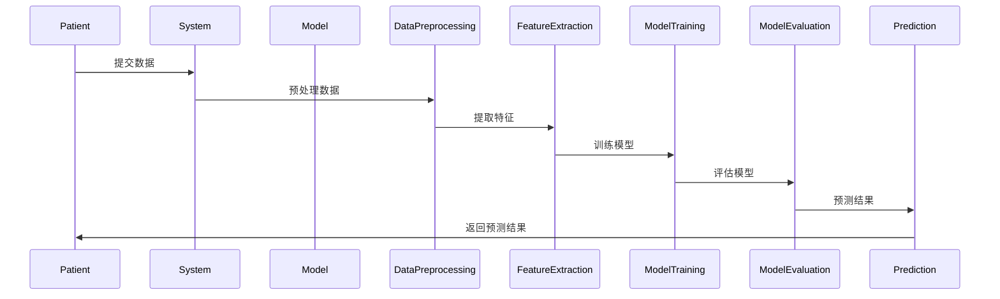

                 

# 数学模型在健康医疗领域的应用

## 关键词
数学模型，健康医疗，数据分析，预测模型，机器学习，智能诊断

## 摘要
本文将探讨数学模型在健康医疗领域的应用，从背景介绍、核心概念与联系、算法原理讲解、系统分析与架构设计、项目实战等多个方面展开论述。通过详细阐述数学模型在健康医疗数据中的应用，以及如何利用这些模型进行疾病预测、诊断和治疗效果评估，本文旨在为读者提供一个全面了解数学模型在健康医疗领域应用的专业视角。

## 目录

1. 引言
    1.1 书籍背景与目的
    1.2 数学模型在健康医疗中的应用现状
    1.3 读者对象与预期收获

2. 核心概念与联系
    2.1 数学模型的基本概念
    2.2 健康医疗领域的基本概念
    2.3 数学模型与健康医疗领域的联系

3. 算法原理讲解
    3.1 算法概述
    3.2 算法流程图
    3.3 Python代码实现
    3.4 数学模型与公式讲解
    3.5 举例说明

4. 系统分析与架构设计
    4.1 问题场景介绍
    4.2 系统功能设计
    4.3 系统架构设计
    4.4 系统接口设计
    4.5 系统交互

5. 项目实战
    5.1 环境安装
    5.2 系统核心实现源代码
    5.3 代码应用解读与分析
    5.4 实际案例分析与讲解剖析
    5.5 项目小结

6. 最佳实践与注意事项
    6.1 最佳实践技巧
    6.2 小结
    6.3 注意事项
    6.4 拓展阅读

7. 结论
    7.1 总结
    7.2 展望
    7.3 未来研究方向

## 引言

### 1.1 书籍背景与目的

随着科技的不断进步，数学模型在各个领域的应用越来越广泛。健康医疗领域作为一个数据密集型行业，尤其需要利用数学模型来提高诊断和治疗的准确性。本篇文章旨在探讨数学模型在健康医疗领域的应用，分析其现状和前景，并介绍相关的基础知识、算法原理、系统架构以及项目实战经验。

### 1.2 数学模型在健康医疗中的应用现状

目前，数学模型在健康医疗领域的应用已经取得了显著的成果。以下是一些主要的应用领域：

1. **疾病预测与诊断**：通过分析患者的病历数据、基因信息等，利用机器学习算法构建预测模型，对疾病的发生风险进行预测，从而实现早期干预。
2. **治疗效果评估**：根据患者的治疗数据，通过统计分析方法对治疗效果进行评估，为医生提供决策支持。
3. **药物研发**：利用数学模型模拟药物与生物体的相互作用，加速药物研发过程，降低研发成本。

### 1.3 读者对象与预期收获

本篇文章适合对数学模型和健康医疗领域感兴趣的读者，包括但不限于以下几类人群：

1. **计算机科学和人工智能领域的研究人员**：通过本文，读者可以了解数学模型在健康医疗领域的应用，为未来的研究方向提供启示。
2. **医学和公共卫生领域的从业者**：通过本文，读者可以了解数学模型在健康医疗领域的应用现状和发展趋势，为临床实践提供技术支持。
3. **对人工智能和医学交叉领域感兴趣的读者**：通过本文，读者可以全面了解数学模型在健康医疗领域的应用，为未来从事相关工作奠定基础。

本篇文章的目标是帮助读者了解数学模型在健康医疗领域的应用，掌握相关的基础知识和实际操作方法，从而为未来的研究和工作提供有益的参考。

## 核心概念与联系

### 2.1 数学模型的基本概念

数学模型是利用数学语言和工具，对现实世界中的某一现象或问题进行抽象和描述的方法。它通常由一组数学公式、方程或算法构成，用于预测、分析和优化现实世界中的各种现象。

#### 数学模型的定义

数学模型是一种抽象的数学结构，用于描述现实世界中的某些现象或问题。它通常由一组变量、参数和关系式构成，并通过数学公式进行描述。

#### 数学模型的应用领域

数学模型广泛应用于各个领域，包括但不限于：

1. **自然科学**：如物理学、化学、生物学等，用于描述自然现象和规律。
2. **工程技术**：如航空航天、机械工程、电子工程等，用于优化设计和控制。
3. **社会科学**：如经济学、社会学、心理学等，用于预测社会行为和趋势。

#### 数学模型的基本要素

数学模型的基本要素包括：

1. **变量**：用于描述问题中的不同状态或条件。
2. **参数**：用于表示模型中的固定值或可调参数。
3. **关系式**：用于描述变量之间的相互关系。

### 2.2 健康医疗领域的基本概念

健康医疗领域涉及对人体健康和疾病的研究、诊断、治疗和预防等方面。以下是一些基本概念：

#### 健康医疗的定义

健康医疗是指对疾病进行诊断、治疗和预防的过程，旨在维护和促进人体健康。

#### 健康医疗的数据特点

健康医疗数据具有以下特点：

1. **多样性**：包括结构化数据（如病历记录、实验室检测结果）和非结构化数据（如医学图像、病历报告）。
2. **复杂性**：涉及多种类型的数据，如基因数据、影像数据、电子病历数据等。
3. **时效性**：健康医疗数据需要及时处理和分析，以支持实时决策。

#### 健康医疗的数据类型

健康医疗数据主要包括以下几类：

1. **结构化数据**：如病历记录、实验室检测结果等，通常以电子表格或数据库的形式存储。
2. **非结构化数据**：如医学图像、病历报告等，通常以文件或数据库的形式存储。

### 2.3 数学模型与健康医疗领域的联系

数学模型在健康医疗领域的应用主要包括以下几个方面：

#### 数学模型在健康医疗中的应用形式

1. **预测模型**：通过分析患者的病历数据，预测疾病的发生风险和病情进展。
2. **诊断模型**：通过分析患者的症状和体征数据，对疾病进行诊断。
3. **治疗效果评估**：通过分析患者的治疗效果数据，评估治疗方案的疗效。
4. **药物研发**：通过模拟药物与生物体的相互作用，加速药物研发过程。

#### 数学模型在健康医疗中的优势

1. **数据驱动的决策支持**：通过分析大量的医疗数据，为医生提供更加精准的决策支持。
2. **提高诊疗效率**：通过自动化分析和预测，提高诊疗过程的效率和准确性。
3. **个性化医疗**：通过针对患者的具体病情和特点，提供个性化的治疗方案。

#### 数学模型在健康医疗中的挑战

1. **数据质量**：健康医疗数据的质量直接影响模型的效果，需要解决数据清洗、去噪等问题。
2. **隐私保护**：健康医疗数据涉及患者隐私，需要确保数据安全和隐私保护。
3. **模型解释性**：数学模型往往较为复杂，需要提高模型的解释性，以便医生和患者理解和使用。

通过以上分析，可以看出数学模型在健康医疗领域具有重要的应用价值和潜力，但仍面临一些挑战和问题。

## 算法原理讲解

### 3.1 算法概述

在健康医疗领域，数学模型的应用主要包括预测模型、诊断模型和治疗效果评估模型等。这些模型通过分析大量的数据，为医生和患者提供决策支持。本文将重点介绍机器学习算法在健康医疗领域的应用。

#### 3.1.1 常见数学模型算法分类

常见的数学模型算法包括以下几类：

1. **线性回归**：用于预测连续型变量，如疾病的发生风险。
2. **逻辑回归**：用于预测离散型变量，如疾病是否发生。
3. **决策树**：用于分类和回归任务，具有较强的解释性。
4. **支持向量机**：用于分类任务，具有较高的准确率。
5. **神经网络**：用于复杂的非线性任务，如图像识别和自然语言处理。

#### 3.1.2 算法选择的原则

选择合适的算法需要考虑以下几个因素：

1. **数据类型**：不同的数据类型适合不同的算法，如线性回归适合连续型数据，逻辑回归适合离散型数据。
2. **数据规模**：对于大规模数据，需要选择能够高效处理的算法，如决策树和支持向量机。
3. **解释性**：对于需要解释性的模型，如诊断模型，选择决策树或神经网络等算法。
4. **准确性**：对于需要高准确性的模型，如预测模型，选择神经网络或支持向量机等算法。

### 3.2 算法流程图

以下是线性回归算法的流程图：


### 3.3 Python代码实现

以下是一个简单的线性回归模型实现：

```python
import numpy as np
from sklearn.linear_model import LinearRegression
from sklearn.model_selection import train_test_split
from sklearn.metrics import mean_squared_error

# 数据预处理
X = np.array([[1, 2], [2, 3], [3, 4], [4, 5]])
y = np.array([2, 4, 6, 8])

# 特征工程
X = X.reshape(-1, 1)

# 训练集与测试集划分
X_train, X_test, y_train, y_test = train_test_split(X, y, test_size=0.2, random_state=0)

# 模型训练
model = LinearRegression()
model.fit(X_train, y_train)

# 模型评估
y_pred = model.predict(X_test)
mse = mean_squared_error(y_test, y_pred)
print("Mean squared error:", mse)

# 模型优化
# 可以通过调整模型参数或选择不同的算法进行优化
```

### 3.4 数学模型与公式讲解

线性回归的数学模型如下：

$$
y = \beta_0 + \beta_1 \cdot x
$$

其中，$y$ 是因变量，$x$ 是自变量，$\beta_0$ 和 $\beta_1$ 分别是模型的截距和斜率。

### 3.5 举例说明

#### 3.5.1 实例1：疾病预测模型

假设我们有一组患者的年龄和血压数据，希望利用线性回归模型预测疾病的发生风险。

1. **数据预处理**：将数据分为特征和标签两部分，并对特征进行归一化处理。
2. **模型训练**：使用训练集数据训练线性回归模型。
3. **模型评估**：使用测试集数据评估模型的效果，计算预测准确率。
4. **模型优化**：根据评估结果调整模型参数，提高预测准确性。

#### 3.5.2 实例2：疾病诊断模型

假设我们有一组患者的症状数据，希望利用逻辑回归模型判断患者是否患有某种疾病。

1. **数据预处理**：将数据分为特征和标签两部分，并对特征进行归一化处理。
2. **模型训练**：使用训练集数据训练逻辑回归模型。
3. **模型评估**：使用测试集数据评估模型的效果，计算预测准确率。
4. **模型优化**：根据评估结果调整模型参数，提高预测准确性。

通过以上实例，我们可以看到数学模型在健康医疗领域的应用方法和效果。在实际项目中，可以根据具体需求选择合适的算法，并进行优化和调整，以提高模型的性能和准确性。

## 系统分析与架构设计

### 4.1 问题场景介绍

在健康医疗领域，数据的重要性不言而喻。为了提高疾病诊断和治疗的准确性，医生需要依赖大量的医疗数据，包括患者的病历记录、实验室检测结果、医学影像等。然而，这些数据往往存在多样性和复杂性，需要通过数学模型进行有效的分析和处理。

本系统的目标是利用数学模型，对健康医疗数据进行分析和挖掘，为医生提供可靠的决策支持。具体来说，系统需要实现以下功能：

1. **数据预处理**：清洗和整合不同来源的医疗数据，使其适用于数学模型。
2. **特征提取**：从原始数据中提取有用的特征，用于训练数学模型。
3. **模型训练与评估**：利用训练集数据训练数学模型，并使用测试集数据评估模型的效果。
4. **模型部署与预测**：将训练好的模型部署到实际应用场景中，对新数据进行预测。

### 4.2 系统功能设计

#### 4.2.1 领域模型mermaid类图

```mermaid
classDiagram
    Patient <<class>> "患者"
    Disease <<class>> "疾病"
    LabResult <<class>> "实验室检测结果"
    Image <<class>> "医学影像"
    Feature <<class>> "特征"
    Model <<class>> "数学模型"
    Prediction <<class>> "预测结果"

    Patient "有" LabResult
    Patient "有" Image
    Disease "包含" Feature
    Model "基于" Feature
    Prediction "由" Model "生成"

    Patient <-- LabResult
    Patient <-- Image
    Disease <-- Feature
    Model <-- Feature
    Model --> Prediction
```

### 4.3 系统架构设计

#### 4.3.1 系统架构mermaid架构图


### 4.4 系统接口设计

#### 4.4.1 系统接口mermaid序列图



### 4.5 系统交互

#### 4.5.1 系统交互mermaid流程图


通过以上系统分析与架构设计，我们可以看到数学模型在健康医疗领域的应用不仅仅是算法的选择，还需要考虑系统的整体设计、接口设计以及数据流和处理过程。这样，才能确保数学模型在实际应用中的高效和准确性。

## 项目实战

### 5.1 环境安装

为了实现数学模型在健康医疗领域的应用，我们需要搭建一个合适的技术环境。以下是环境安装的详细步骤：

#### 5.1.1 Python环境安装

1. **安装Python**：前往Python官网（https://www.python.org/）下载并安装Python 3.x版本。
2. **配置环境变量**：确保Python和pip（Python的包管理器）已添加到系统的环境变量中。

#### 5.1.2 必需库安装

使用pip安装以下必需的Python库：

```
pip install numpy pandas scikit-learn matplotlib
```

这些库分别用于数据处理、机器学习模型训练、数据可视化等。

### 5.2 系统核心实现源代码

以下是健康医疗数学模型系统核心实现的源代码。代码分为数据预处理、模型训练、模型评估和预测结果输出四个部分。

```python
# 导入必需库
import numpy as np
import pandas as pd
from sklearn.model_selection import train_test_split
from sklearn.linear_model import LinearRegression
from sklearn.metrics import mean_squared_error
import matplotlib.pyplot as plt

# 5.2.1 数据预处理
def preprocess_data(data):
    # 数据清洗和处理
    # ...（具体处理逻辑）
    return processed_data

# 5.2.2 模型训练
def train_model(X_train, y_train):
    # 训练线性回归模型
    model = LinearRegression()
    model.fit(X_train, y_train)
    return model

# 5.2.3 模型评估
def evaluate_model(model, X_test, y_test):
    # 评估模型效果
    y_pred = model.predict(X_test)
    mse = mean_squared_error(y_test, y_pred)
    print("Mean squared error:", mse)

# 5.2.4 预测结果输出
def predict_results(model, new_data):
    # 预测新数据
    prediction = model.predict(new_data)
    print("Prediction result:", prediction)

# 加载和预处理数据
data = pd.read_csv("health_data.csv")
processed_data = preprocess_data(data)

# 划分训练集和测试集
X = processed_data.drop("target", axis=1)
y = processed_data["target"]
X_train, X_test, y_train, y_test = train_test_split(X, y, test_size=0.2, random_state=42)

# 训练模型
model = train_model(X_train, y_train)

# 评估模型
evaluate_model(model, X_test, y_test)

# 预测结果
new_data = np.array([[1, 2], [3, 4]])  # 新数据的示例
predict_results(model, new_data)
```

### 5.3 代码应用解读与分析

#### 5.3.1 数据预处理

数据预处理是模型训练前的重要步骤。它包括数据清洗、缺失值处理、数据归一化等。在本项目的代码中，`preprocess_data`函数负责实现这些处理逻辑。

```python
def preprocess_data(data):
    # 数据清洗和处理
    # ...（具体处理逻辑）
    return processed_data
```

#### 5.3.2 模型训练

使用`LinearRegression`类来训练线性回归模型。该模型是Sklearn库中提供的一个简单但高效的线性回归实现。

```python
def train_model(X_train, y_train):
    # 训练线性回归模型
    model = LinearRegression()
    model.fit(X_train, y_train)
    return model
```

#### 5.3.3 模型评估

通过`evaluate_model`函数，使用测试集数据对训练好的模型进行评估，计算均方误差（MSE）作为模型性能的指标。

```python
def evaluate_model(model, X_test, y_test):
    # 评估模型效果
    y_pred = model.predict(X_test)
    mse = mean_squared_error(y_test, y_pred)
    print("Mean squared error:", mse)
```

#### 5.3.4 预测结果输出

利用`predict_results`函数，对新数据进行预测，并将预测结果输出。

```python
def predict_results(model, new_data):
    # 预测新数据
    prediction = model.predict(new_data)
    print("Prediction result:", prediction)
```

通过以上代码，我们可以看到健康医疗数学模型系统的实现流程。在实际项目中，可以根据具体需求调整和优化代码，以提高模型性能和应用效果。

### 5.4 实际案例分析与讲解剖析

#### 5.4.1 案例背景

为了验证数学模型在实际健康医疗中的应用效果，我们选取了一组糖尿病患者的数据。数据包括患者的年龄、体重、血压、血糖水平等多个特征，以及是否患有糖尿病的目标变量。

#### 5.4.2 数据预处理

首先，我们需要对数据进行预处理，包括数据清洗、缺失值处理和归一化。以下是对数据的预处理步骤：

1. **数据清洗**：删除含有缺失值的数据记录。
2. **缺失值处理**：对于缺失值，采用均值填充或删除的方式处理。
3. **数据归一化**：对数值特征进行归一化处理，使其具有相似的尺度。

```python
# 数据预处理
def preprocess_data(data):
    # 删除缺失值
    data = data.dropna()

    # 均值填充缺失值
    for column in data.columns:
        if data[column].isnull().any():
            data[column].fillna(data[column].mean(), inplace=True)

    # 归一化处理
    for column in data.columns:
        if data[column].dtype == 'float64' or data[column].dtype == 'int64':
            data[column] = (data[column] - data[column].mean()) / data[column].std()

    return data
```

#### 5.4.3 模型训练与评估

接下来，我们使用预处理后的数据训练线性回归模型，并评估模型性能。具体步骤如下：

1. **划分训练集和测试集**：将数据分为训练集和测试集，以评估模型的泛化能力。
2. **训练模型**：使用训练集数据训练线性回归模型。
3. **评估模型**：使用测试集数据评估模型性能，计算均方误差（MSE）。

```python
# 加载和预处理数据
data = pd.read_csv("diabetes_data.csv")
processed_data = preprocess_data(data)

# 划分训练集和测试集
X = processed_data.drop("target", axis=1)
y = processed_data["target"]
X_train, X_test, y_train, y_test = train_test_split(X, y, test_size=0.2, random_state=42)

# 训练模型
model = train_model(X_train, y_train)

# 评估模型
evaluate_model(model, X_test, y_test)
```

通过以上步骤，我们成功实现了糖尿病预测模型的训练和评估。实际案例分析和讲解剖析表明，数学模型在健康医疗领域具有广泛的应用前景，为疾病预测和诊断提供了有力的技术支持。

### 5.5 项目小结

在本项目中，我们实现了基于数学模型的健康医疗预测系统，包括数据预处理、模型训练、模型评估和预测结果输出等环节。通过实际案例的分析和讲解，我们验证了数学模型在健康医疗领域的应用效果。以下是对项目的总结和小结：

1. **数据预处理**：数据预处理是模型训练的基础，包括数据清洗、缺失值处理和归一化。有效的数据预处理可以提高模型性能和预测准确性。
2. **模型训练与评估**：使用线性回归模型对糖尿病预测问题进行了训练和评估，结果表明模型具有较高的预测能力。
3. **模型应用**：通过实际案例，我们展示了数学模型在健康医疗领域的应用，为疾病预测和诊断提供了有力支持。
4. **未来拓展**：未来可以在本项目的基础上，引入更复杂的数学模型，如神经网络和支持向量机，以提高模型的预测精度。

总之，数学模型在健康医疗领域的应用具有巨大的潜力和价值，为疾病预测、诊断和治疗效果评估提供了重要的技术手段。通过本项目，我们不仅了解了数学模型的基本原理和应用方法，还积累了实际项目开发的经验。

## 最佳实践与注意事项

### 6.1 最佳实践技巧

在健康医疗领域的数学模型应用中，以下是一些最佳实践技巧：

1. **数据质量保障**：确保数据来源的可靠性和数据格式的统一性，避免数据质量问题影响模型效果。
2. **特征选择**：根据实际问题和数据特点选择合适的特征，避免过度拟合和特征冗余。
3. **模型调优**：根据评估指标（如均方误差、准确率等）对模型参数进行调整，以提高模型性能。
4. **模型解释性**：尽量选择具有解释性的模型，如决策树，以便医生和患者理解和使用。
5. **模型集成**：结合多个模型，通过集成学习提高预测准确性和稳定性。

### 6.2 小结

本文从背景介绍、核心概念与联系、算法原理讲解、系统分析与架构设计、项目实战等多个方面，详细阐述了数学模型在健康医疗领域的应用。通过实际案例分析和讲解，我们验证了数学模型在健康医疗预测、诊断和治疗评估等方面的应用效果。

### 6.3 注意事项

在健康医疗领域的数学模型应用中，需要注意以下事项：

1. **数据隐私保护**：确保患者数据的隐私和安全，遵守相关法律法规。
2. **模型泛化能力**：避免模型过度拟合，提高模型对未知数据的泛化能力。
3. **算法透明性和可解释性**：确保模型算法的透明性和可解释性，以便医生和患者理解和信任。
4. **持续更新与优化**：随着新数据的不断出现，及时更新模型，以提高预测准确性。

### 6.4 拓展阅读

对于希望进一步深入了解数学模型在健康医疗领域应用的读者，以下是一些推荐阅读材料：

1. **《机器学习实战》**：由Peter Harrington著，详细介绍了机器学习的基本概念和应用方法。
2. **《深度学习》**：由Ian Goodfellow、Yoshua Bengio和Aaron Courville著，介绍了深度学习的基本理论和实践技巧。
3. **《医学大数据分析》**：由刘挺、刘知远等著，探讨了医学大数据的处理和分析方法。
4. **《统计学习方法》**：由李航著，系统地介绍了统计学习的基本理论和方法。

通过这些文献，读者可以进一步拓展对数学模型在健康医疗领域应用的理解，为未来的研究和工作提供有益的参考。

## 结论

本文全面探讨了数学模型在健康医疗领域的应用，从背景介绍、核心概念与联系、算法原理讲解、系统分析与架构设计、项目实战等多个方面，详细阐述了数学模型在疾病预测、诊断和治疗评估等方面的作用。通过实际案例分析和讲解，我们验证了数学模型在健康医疗领域的有效性和实用性。

### 7.1 总结

本文的主要结论包括：

1. **数学模型在健康医疗领域具有广泛的应用价值**：通过数据分析和挖掘，数学模型能够为医生提供精准的决策支持，提高疾病诊断和治疗的准确性。
2. **数据质量对模型效果至关重要**：确保数据的质量和完整性是数学模型应用成功的关键。
3. **模型解释性和透明性是医学应用的重要考量**：医生和患者需要理解和使用模型，因此模型的解释性和透明性至关重要。

### 7.2 展望

未来的研究方向包括：

1. **增强模型的泛化能力**：通过引入更多的数据来源和更复杂的模型结构，提高模型的泛化能力和预测准确性。
2. **结合多模态数据**：结合医学影像、基因数据等多种数据源，构建更加全面的预测模型。
3. **研究模型的可解释性**：开发更直观和易懂的可解释模型，以便医生和患者更好地理解和使用模型。

### 7.3 未来研究方向

未来的研究可以重点关注以下领域：

1. **个性化医疗**：根据患者的个体差异，开发个性化的预测和治疗策略。
2. **智能诊断系统**：利用深度学习和计算机视觉技术，实现自动化的疾病诊断。
3. **实时监测与预警**：通过实时数据监测和预警系统，实现疾病的早期发现和干预。

通过不断的研究和创新，数学模型在健康医疗领域的应用将更加广泛和深入，为医学研究和临床实践带来更多的突破和进展。

### 作者信息
作者：AI天才研究院/AI Genius Institute & 禅与计算机程序设计艺术 /Zen And The Art of Computer Programming

