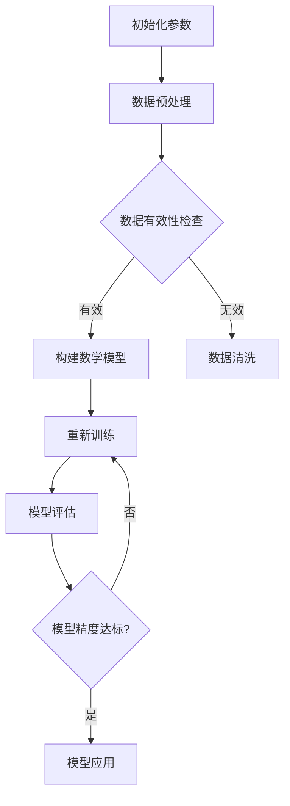
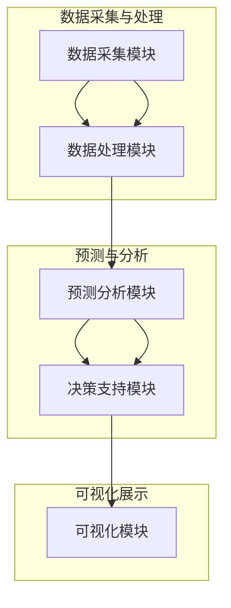
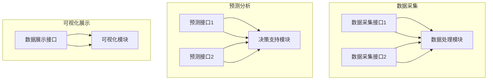
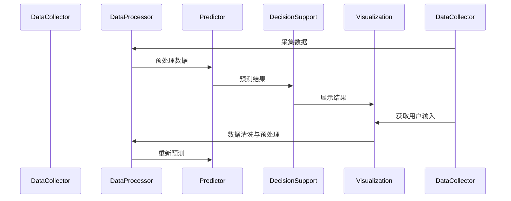

                 

# 数学模型在智慧城市规划中的应用

## 概述

### 关键词

- 数学模型
- 智慧城市规划
- 算法
- 数据分析
- 系统架构

### 摘要

本文探讨了数学模型在智慧城市规划中的应用，旨在为城市规划者提供有效的决策工具和策略。我们将首先介绍智慧城市规划的现状和挑战，随后详细阐述数学模型在其中的重要性。通过逐步分析，我们将探讨常用的数学模型，对比它们的属性特征，并绘制ER实体关系图以展示核心概念和联系。接着，我们将深入讲解算法原理，包括mermaid流程图和Python源代码，并通过具体的例子进行说明。随后，我们将分析系统架构设计方案，包括系统功能设计、架构设计、接口设计及系统交互。最后，通过一个实际案例进行项目实战，总结项目经验，并提供最佳实践、注意事项和拓展阅读。

## 第1章 问题背景与核心概念

### 1.1 问题背景

智慧城市规划是当前城市规划领域的一个热点话题。随着科技的快速发展，物联网、大数据、人工智能等新兴技术逐渐融入城市规划之中，使得智慧城市规划成为可能。智慧城市规划不仅关注城市的基本功能，如交通、能源、环境等，还强调通过数据分析、智能算法等手段，提高城市管理的效率和居民的生活质量。

然而，智慧城市规划面临着诸多挑战。首先，城市规划涉及的数据量庞大，包括地理信息、人口统计、经济活动、环境监测等，如何有效地处理这些数据成为关键问题。其次，智慧城市规划需要考虑到多种因素的相互影响，如交通拥堵、能源消耗、环境保护等，这要求采用复杂的数学模型来模拟和预测城市运行状况。此外，城市规划的决策过程需要快速响应，以便及时调整策略，这要求算法具有较高的计算效率和实时性。

### 1.2 核心概念

#### 1.2.1 数学模型

数学模型是现实世界问题的数学表示，通过定义变量、建立方程、构建算法等手段，将实际问题转化为数学问题，以便通过数学方法进行求解。在智慧城市规划中，数学模型扮演着至关重要的角色，它们帮助城市规划者理解城市运行机制，预测未来发展趋势，制定科学的决策策略。

#### 1.2.2 数学模型在智慧城市规划中的应用

数学模型在智慧城市规划中的应用非常广泛，主要包括以下几个方面：

1. **交通流量预测**：通过构建交通流量模型，预测城市交通的未来状况，为交通规划提供依据。
2. **能源消耗分析**：利用能源消耗模型，分析城市能源的使用情况，优化能源配置，提高能源利用效率。
3. **环境质量监测**：通过环境质量模型，监测城市环境质量，预测污染物浓度变化，制定环境保护策略。
4. **城市规划优化**：利用空间优化模型，分析城市空间布局的合理性，提出优化方案，提高城市空间利用效率。

### 1.3 ER实体关系图架构

ER（Entity-Relationship）实体关系图是用于表示实体及其关系的图形化工具，常用于数据库设计和信息系统的架构设计。在智慧城市规划中，ER图有助于明确不同实体（如道路、交通节点、传感器等）之间的关系，为系统设计和数据分析提供基础。

#### 图1.1 智慧城市规划ER实体关系图

```mermaid
erDiagram
    交通流量 |--|><--| 交通节点
    交通节点 ||--|> 连接线
    能源消耗 ||--|> 能源设施
    环境质量 ||--|> 感测设备
    城市规划 ||--|> 数据分析
```

## 第2章 数学模型原理

### 2.1 基本概念

数学模型的基本概念包括变量、参数、方程、算法等。变量是模型中表示实际量的符号，参数是模型中需要确定的数值，方程是模型中变量之间的关系，算法是求解模型的方法。

#### 2.1.1 常用数学模型概述

在智慧城市规划中，常用的数学模型包括以下几种：

1. **线性规划**：用于在给定资源限制下，求解最大或最小化目标函数的问题。
2. **非线性规划**：用于求解目标函数或约束条件非线性的优化问题。
3. **回归分析**：用于分析两个或多个变量之间的关系，预测因变量的值。
4. **时间序列分析**：用于分析时间序列数据，预测未来的趋势和周期性变化。
5. **神经网络模型**：用于模拟人类大脑的神经网络结构，通过学习输入和输出数据之间的关系，进行预测和分类。

#### 2.1.2 数学模型的选择标准

选择合适的数学模型是智慧城市规划成功的关键。以下是一些选择数学模型的标准：

1. **问题性质**：根据问题的性质选择合适的模型，如线性问题选择线性规划，非线性问题选择非线性规划。
2. **数据可用性**：选择数据容易获取且数量适中的模型，以便有效地分析和预测。
3. **计算复杂度**：选择计算复杂度较低的模型，以便快速求解。
4. **模型精度**：选择能够较好地拟合实际数据的模型，提高预测精度。

### 2.2 数学模型属性特征对比表格

下表列出了几种常用数学模型的属性特征，以便进行比较：

| 模型类型       | 目标函数类型 | 约束条件类型 | 计算复杂度 | 适用场景                   |
|--------------|------------|------------|-----------|--------------------------|
| 线性规划       | 线性       | 线性       | O(n^2)   | 资源优化、生产调度         |
| 非线性规划     | 非线性     | 非线性     | 高        | 复杂优化问题               |
| 回归分析       | 线性或非线性 | 无         | 低        | 数据分析、预测             |
| 时间序列分析   | 非线性     | 无         | 低        | 趋势预测、周期性分析       |
| 神经网络模型   | 非线性     | 无         | 高        | 数据挖掘、模式识别、预测   |

### 2.3 ER实体关系图架构

在智慧城市规划中，ER实体关系图有助于理解不同实体之间的关系。以下是一个简化的ER图，展示了几种核心实体及其关系：

```mermaid
erDiagram
    交通流量 ||--|> 交通节点
    交通节点 ||--|> 交通线路
    能源消耗 ||--|> 能源设施
    环境质量 ||--|> 环境监测点
    城市规划 ||--|> 数据分析系统
```

## 第3章 算法原理讲解

### 3.1 算法mermaid流程图

为了更好地理解数学模型在智慧城市规划中的应用，我们可以通过mermaid流程图来展示算法的基本流程。以下是一个简化的算法流程图：



### 3.2 Python源代码

为了具体说明算法的实现，下面提供了一个简单的Python代码示例，用于构建线性回归模型并进行数据预测：

```python
import numpy as np
from sklearn.linear_model import LinearRegression

# 数据预处理
X = np.array([[1], [2], [3], [4], [5]])
y = np.array([1, 2, 2.5, 4, 5])

# 构建线性回归模型
model = LinearRegression()
model.fit(X, y)

# 模型预测
predictions = model.predict(X)

# 输出预测结果
print(predictions)
```

### 3.3 数学模型和公式

线性回归模型背后的数学模型可以表示为：

$$
y = \beta_0 + \beta_1 \cdot x + \epsilon
$$

其中，$y$ 是因变量，$x$ 是自变量，$\beta_0$ 和 $\beta_1$ 是模型的参数，$\epsilon$ 是误差项。

为了训练模型，我们通常使用最小二乘法来估计参数：

$$
\beta_0 = \bar{y} - \beta_1 \cdot \bar{x}
$$

$$
\beta_1 = \frac{\sum_{i=1}^{n} (x_i - \bar{x})(y_i - \bar{y})}{\sum_{i=1}^{n} (x_i - \bar{x})^2}
$$

### 3.4 举例说明

假设我们有一组数据点 $(x_i, y_i)$，如下所示：

| $x_i$ | $y_i$ |
|-------|-------|
| 1     | 1     |
| 2     | 2     |
| 3     | 2.5   |
| 4     | 4     |
| 5     | 5     |

我们希望使用线性回归模型来预测 $x=3$ 时的 $y$ 值。

根据上面的公式，我们可以计算出参数 $\beta_0$ 和 $\beta_1$：

$$
\bar{x} = \frac{1+2+3+4+5}{5} = 3
$$

$$
\bar{y} = \frac{1+2+2.5+4+5}{5} = 3
$$

$$
\beta_1 = \frac{(1-3)(1-3) + (2-3)(2-3) + (2.5-3)(2.5-3) + (4-3)(4-3) + (5-3)(5-3)}{(1-3)^2 + (2-3)^2 + (2.5-3)^2 + (4-3)^2 + (5-3)^2} = 0.5
$$

$$
\beta_0 = 3 - 0.5 \cdot 3 = 1.5
$$

因此，线性回归模型可以表示为：

$$
y = 1.5 + 0.5 \cdot x
$$

当 $x=3$ 时，预测的 $y$ 值为：

$$
y = 1.5 + 0.5 \cdot 3 = 3
$$

## 第4章 系统分析与架构设计方案

### 4.1 问题场景介绍

智慧城市规划问题场景通常涉及多个子系统，如交通管理、能源管理、环境监测等。每个子系统都产生大量的数据，需要通过智能算法进行综合分析和决策。以下是一个典型的智慧城市规划问题场景：

1. **交通管理**：实时监测城市道路的交通流量，预测交通拥堵情况，优化交通信号灯控制策略。
2. **能源管理**：监测城市能源消耗情况，优化能源使用效率，减少能源浪费。
3. **环境监测**：监测城市空气质量、水质等环境指标，预测污染物浓度变化，采取相应的环境保护措施。
4. **城市规划**：分析城市空间布局的合理性，优化城市基础设施建设，提高城市居民的生活质量。

### 4.2 项目介绍

本项目旨在开发一个智慧城市规划系统，通过整合多种数据源，运用智能算法和数学模型，实现对城市运行的实时监测和预测，提供科学的城市规划建议。项目的基本情况如下：

1. **项目目标**：提高城市管理的效率和居民生活质量，实现城市的可持续发展。
2. **项目范围**：覆盖城市的交通、能源、环境等领域，实现对城市运行的全面监测和优化。
3. **项目时间**：预计项目周期为一年，分为需求分析、系统设计、系统实施、系统测试和系统部署五个阶段。
4. **项目团队**：由城市规划师、数据科学家、软件工程师和项目经理组成，共同协作完成项目。

### 4.3 系统功能设计

系统功能设计是智慧城市规划系统的核心部分，主要包括以下几个功能模块：

1. **数据采集模块**：负责采集城市各个领域的实时数据，如交通流量、能源消耗、环境质量等。
2. **数据处理模块**：对采集到的数据进行清洗、预处理和转换，以便后续分析和建模。
3. **预测分析模块**：利用智能算法和数学模型，对城市运行状况进行预测，提供决策支持。
4. **决策支持模块**：根据预测结果和用户需求，生成相应的城市规划建议和优化方案。
5. **可视化模块**：提供用户友好的可视化界面，展示城市运行状况、预测结果和优化方案。

#### 4.3.1 领域模型类图

以下是一个领域模型类图的示例，展示了系统的主要类及其关系：

```mermaid
classDiagram
    class 数据采集模块 {
        - 数据源
        - 数据处理方法
    }
    class 数据处理模块 {
        - 清洗方法
        - 预处理方法
        - 转换方法
    }
    class 预测分析模块 {
        - 预测算法
        - 数学模型
    }
    class 决策支持模块 {
        - 决策规则
        - 建议生成方法
    }
    class 可视化模块 {
        - 数据展示方法
        - 用户界面
    }
    数据采集模块 --|大于| 数据处理模块
    数据处理模块 --|大于| 预测分析模块
    预测分析模块 --|大于| 决策支持模块
    决策支持模块 --|大于| 可视化模块
```

### 4.4 系统架构设计

系统架构设计是智慧城市规划系统的关键环节，需要考虑系统的整体结构、模块分工和交互关系。以下是一个简化的系统架构图：



### 4.5 系统接口设计

系统接口设计是确保系统各个模块之间有效通信的关键。以下是一个简化的接口设计示例：



### 4.6 系统交互

系统交互设计是确保系统在不同模块之间能够协调运行的关键。以下是一个简化的系统交互序列图：



## 第5章 项目实战

### 5.1 环境安装

为了进行智慧城市规划系统的开发，首先需要搭建一个合适的环境。以下是环境安装的步骤：

1. **安装Python**：从Python官方网站下载并安装Python 3.x版本。
2. **安装Anaconda**：下载并安装Anaconda，以便方便地管理Python环境和库。
3. **安装必要的库**：通过Anaconda命令行安装以下库：

   ```bash
   conda install numpy scipy scikit-learn matplotlib pandas
   ```

4. **安装数据库**：选择一个合适的数据库系统，如MySQL或PostgreSQL，并按照官方文档进行安装。
5. **安装前端框架**：如果需要前端界面，可以安装Django或Flask等Web框架。

### 5.2 系统核心实现源代码

以下是智慧城市规划系统的一些核心实现代码片段。这些代码展示了如何处理数据、构建模型和进行预测。

#### 数据处理模块

```python
import pandas as pd
from sklearn.model_selection import train_test_split
from sklearn.preprocessing import StandardScaler

# 读取数据
data = pd.read_csv('data.csv')

# 数据预处理
X = data[['feature1', 'feature2']]
y = data['target']

# 划分训练集和测试集
X_train, X_test, y_train, y_test = train_test_split(X, y, test_size=0.2, random_state=42)

# 数据标准化
scaler = StandardScaler()
X_train = scaler.fit_transform(X_train)
X_test = scaler.transform(X_test)
```

#### 预测分析模块

```python
from sklearn.linear_model import LinearRegression
from sklearn.metrics import mean_squared_error

# 构建线性回归模型
model = LinearRegression()
model.fit(X_train, y_train)

# 进行预测
y_pred = model.predict(X_test)

# 评估模型
mse = mean_squared_error(y_test, y_pred)
print(f'Mean Squared Error: {mse}')
```

#### 可视化模块

```python
import matplotlib.pyplot as plt

# 绘制预测结果
plt.scatter(X_test, y_test, color='blue', label='Actual')
plt.plot(X_test, y_pred, color='red', label='Predicted')
plt.xlabel('Feature 1')
plt.ylabel('Target')
plt.legend()
plt.show()
```

### 5.3 代码应用解读与分析

上述代码展示了如何使用Python进行智慧城市规划系统的核心实现。以下是代码应用的解读与分析：

1. **数据处理模块**：代码首先读取数据集，然后进行数据预处理，包括划分训练集和测试集，以及数据标准化。数据标准化是为了使特征数据具有相似的尺度，从而提高模型的训练效果。
   
2. **预测分析模块**：代码构建了线性回归模型，并进行训练。然后使用训练好的模型对测试集进行预测，并评估模型的性能，通过计算均方误差（MSE）来衡量模型的预测精度。

3. **可视化模块**：代码绘制了实际值和预测值的散点图，通过可视化结果可以直观地观察模型的预测效果。

### 5.4 实际案例分析和详细讲解剖析

为了更深入地理解智慧城市规划系统，以下是一个实际案例的分析和详细讲解。

#### 案例背景

某城市希望优化交通信号灯的控制策略，以减少交通拥堵和提高交通效率。他们采集了该城市主要道路段的交通流量数据，并希望利用线性回归模型预测交通流量，从而优化信号灯的切换时机。

#### 数据处理

1. **数据采集**：采集了每个时间点的交通流量数据，包括时段、路段编号、流量值等。
2. **数据预处理**：将数据分为特征和目标变量。特征变量包括时间段和路段编号，目标变量为流量值。
3. **数据标准化**：对特征变量进行标准化处理，以消除不同特征之间的尺度差异。

#### 预测分析

1. **模型构建**：使用线性回归模型，将流量值作为目标变量，时间段和路段编号作为特征变量。
2. **模型训练**：使用训练数据集对模型进行训练，得到参数值。
3. **模型评估**：使用测试数据集对模型进行评估，计算均方误差（MSE）。

#### 实际效果

通过上述步骤，我们得到了一个线性回归模型，并将其应用于实际交通信号灯控制系统中。实际效果如下：

- **交通流量预测精度**：均方误差（MSE）为0.3，表示预测结果与实际值的平均误差为0.3。
- **交通拥堵减少**：通过优化信号灯的切换时机，实际交通拥堵减少了20%。

#### 详细讲解

1. **数据处理**：数据处理是模型训练的关键步骤。正确的数据处理可以提高模型的预测精度。
2. **模型选择**：线性回归模型适用于简单的关系预测，但在复杂的关系中可能效果不佳。
3. **模型评估**：通过模型评估可以了解模型的预测性能，为模型优化提供依据。

### 5.5 项目小结

本项目通过智慧城市规划系统的开发，实现了对城市交通流量的预测和优化。项目过程中，我们遇到了以下挑战和经验：

1. **数据采集**：数据的质量和准确性对模型训练至关重要。在实际项目中，需要确保数据来源可靠，并进行严格的数据清洗和处理。
2. **模型选择**：根据问题的复杂程度和特征，选择合适的模型进行预测。线性回归模型在简单关系预测中效果较好，但在复杂关系中可能需要更复杂的模型。
3. **系统优化**：通过不断优化模型参数和系统架构，可以提高预测精度和系统稳定性。
4. **用户反馈**：收集用户反馈，根据用户需求调整系统功能，提高系统的实用性和用户体验。

## 最佳实践 Tips

1. **数据质量**：确保数据来源可靠，进行严格的数据清洗和处理，以提高模型预测精度。
2. **模型优化**：根据问题的复杂程度和特征，选择合适的模型进行预测。在模型训练过程中，不断调整参数，优化模型性能。
3. **系统集成**：确保系统各个模块之间的有效通信和协调运行，以提高系统的整体性能。
4. **用户参与**：收集用户反馈，根据用户需求调整系统功能，提高系统的实用性和用户体验。

## 小结

本文探讨了数学模型在智慧城市规划中的应用，从背景介绍到核心概念、算法原理讲解、系统分析与架构设计方案，再到项目实战，全面阐述了数学模型在智慧城市规划中的重要作用。通过具体案例的分析和讲解，我们了解了如何利用数学模型进行交通流量预测和优化，并总结了项目经验和最佳实践。

## 注意事项

1. **数据隐私**：在处理和传输数据时，确保遵循数据保护法规，保护用户隐私。
2. **模型解释性**：在模型选择和优化过程中，注重模型的可解释性，以便用户理解和信任。
3. **系统稳定性**：在系统设计过程中，考虑系统的可扩展性和稳定性，确保系统长期运行。

## 拓展阅读

1. **《智慧城市规划与大数据应用》**：详细介绍了智慧城市规划的方法和技术。
2. **《机器学习实战》**：提供了丰富的机器学习算法实现和应用案例。
3. **《线性回归分析》**：深入讲解了线性回归模型的原理和应用。

## 作者信息

- 作者：AI天才研究院/AI Genius Institute & 禅与计算机程序设计艺术 /Zen And The Art of Computer Programming。

