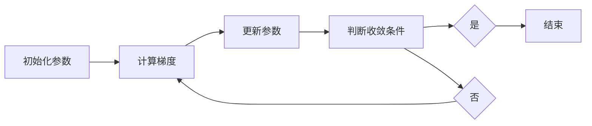

                 

## 数学模型在智能制造中的应用

### 关键词：智能制造，数学模型，应用案例，发展趋势

### 摘要：

随着智能制造的快速发展，数学模型在提升生产效率、保证产品质量和降低成本方面发挥着越来越重要的作用。本文旨在探讨数学模型在智能制造中的核心应用，通过深入分析背景、核心概念和具体应用案例，帮助读者理解数学模型在智能制造中的关键作用及其未来发展趋势。文章将从问题背景出发，介绍数学模型的基本概念，阐述其在智能制造中的应用原理，并通过实际案例分享应用成果，最后对智能制造与数学模型结合的未来发展进行展望。

### 目录：

1. **背景介绍**
   1.1 **问题背景**
   1.2 **问题描述**
   1.3 **问题解决**
   1.4 **边界与外延**
   1.5 **概念结构与核心要素组成**

2. **核心数学模型介绍**
   2.1 **数学模型原理**
   2.2 **数学模型属性特征对比表格**
   2.3 **数学模型ER实体关系图**

3. **模型在智能制造中的应用**
   3.1 **算法原理讲解**
   3.2 **数学模型和数学公式详细讲解**
   3.3 **应用实例分析**

4. **应用案例分享**
   4.1 **工厂生产调度**
   4.2 **质量控制**
   4.3 **设备故障预测**

5. **未来发展趋势**
   5.1 **技术趋势分析**
   5.2 **应用前景展望**

### 1. 背景介绍

#### 1.1 问题背景

智能制造作为工业4.0的重要组成部分，正引领着全球制造业的变革。然而，在智能制造过程中，面临着生产效率低下、产品质量不稳定、生产成本高等问题。这些问题不仅制约了智能制造的进一步发展，也给企业带来了巨大的经济损失。为了解决这些问题，数学模型作为一种有效的工具，被广泛应用于智能制造的各个环节。

#### 1.2 问题描述

在智能制造中，主要面临以下几个问题：

1. **生产效率低下**：由于生产过程中存在不确定性和复杂性问题，导致生产效率难以提高。
2. **产品质量不稳定**：在生产过程中，由于各种因素的影响，产品质量存在波动，难以稳定控制。
3. **生产成本高**：生产过程中存在大量的浪费，如资源浪费、能源浪费等，导致生产成本高。

#### 1.3 问题解决

数学模型作为一种有效的工具，可以在以下几个方面解决上述问题：

1. **优化生产流程**：通过数学模型，可以优化生产流程，提高生产效率。
2. **质量控制**：通过数学模型，可以实时监测产品质量，确保产品质量稳定。
3. **成本控制**：通过数学模型，可以优化资源配置，降低生产成本。

#### 1.4 边界与外延

1. **研究范围**：本文主要探讨数学模型在智能制造中的应用，包括生产优化、质量控制、设备故障预测等方面。
2. **研究限制**：本文主要关注数学模型在制造业中的应用，不涉及其他行业。

#### 1.5 概念结构与核心要素组成

1. **概念结构**：
   - 数学模型：用于描述现实问题的一种抽象表示方法，通过数学公式和算法实现。
   - 智能制造：通过信息物理系统（CPS）实现生产过程的智能化。

2. **核心要素组成**：
   - 生产流程：包括生产计划、生产调度、生产执行等环节。
   - 产品质量：包括产品质量监测、质量控制等。
   - 资源配置：包括人力资源、物资资源、能源资源等。

### 2. 核心数学模型介绍

#### 2.1 数学模型原理

数学模型是一种描述现实世界问题的抽象方法，它通过数学公式和算法实现。在智能制造中，常用的数学模型包括线性规划、最优化方法、神经网络等。

- **线性规划**：用于优化线性目标函数，在资源约束条件下找到最优解。
- **最优化方法**：包括梯度下降、牛顿法等，用于求解非线性优化问题。
- **神经网络**：用于模拟人脑神经元的工作方式，通过多层神经网络实现复杂函数的映射。

#### 2.2 数学模型属性特征对比表格

| 数学模型 | 特点 | 适用场景 |
| --- | --- | --- |
| 线性规划 | 目标函数和约束条件都是线性的 | 资源优化、生产调度 |
| 最优化方法 | 目标函数和约束条件可能是非线性的 | 参数调整、系统优化 |
| 神经网络 | 通过多层神经网络实现复杂函数映射 | 数据分析、模式识别 |

#### 2.3 数学模型ER实体关系图

```mermaid
erDiagram
  ProductionProcess ||--|{ QualityControl }
  ProductionProcess ||--|{ EquipmentFailurePrediction }
  QualityControl ||--|{ ProductionSchedule }
  EquipmentFailurePrediction ||--|{ ProductionSchedule }
```

### 3. 模型在智能制造中的应用

#### 3.1 算法原理讲解

在智能制造中，常用的算法原理包括线性规划、最优化方法和神经网络。

- **线性规划**：通过构建目标函数和约束条件，求解最优解。
  ```mermaid
  flowchart LR
  A[开始] --> B[构建目标函数]
  B --> C[构建约束条件]
  C --> D[求解最优解]
  D --> E[结束]
  ```
- **最优化方法**：通过迭代优化，逐步逼近最优解。
  ```mermaid
  flowchart LR
  A[开始] --> B[初始化参数]
  B --> C[计算梯度]
  C --> D[更新参数]
  D --> E[判断收敛条件]
  E --> F{是} --> G[结束]
  E --> H{否} --> B
  ```
- **神经网络**：通过前向传播和反向传播，实现复杂函数的映射。
  ```mermaid
  flowchart LR
  A[输入] --> B[前向传播]
  B --> C[激活函数]
  C --> D[计算损失函数]
  D --> E[反向传播]
  E --> F[更新权重]
  F --> G[结束]
  ```

#### 3.2 数学模型和数学公式详细讲解

- **线性规划**：目标函数 $f(x) = c^T x$，约束条件 $Ax \leq b$。
  - 其中，$x$ 是决策变量，$c$ 是目标函数系数，$A$ 是约束条件矩阵，$b$ 是约束条件常数。

- **最优化方法**：梯度下降法，目标函数 $f(x)$。
  - 公式：$x_{\text{new}} = x_{\text{old}} - \alpha \nabla f(x_{\text{old}})$。
  - 其中，$\alpha$ 是学习率，$\nabla f(x)$ 是目标函数的梯度。

- **神经网络**：前向传播，输出 $y = f(z)$。
  - 公式：$z = \sigma(Wx + b)$，$y = \sigma(Wy + b)$。
  - 其中，$W$ 是权重矩阵，$b$ 是偏置项，$\sigma$ 是激活函数。

#### 3.3 应用实例分析

- **工厂生产调度**：通过线性规划模型，优化生产调度，提高生产效率。
  - 模型公式：最小化生产时间，满足资源约束。
  - 实例：某工厂有5条生产线，每天需生产100个产品。通过线性规划模型，确定每条生产线的最优生产时间，确保生产效率最大化。

- **质量控制**：通过神经网络模型，实时监测产品质量，确保产品质量稳定。
  - 模型公式：通过多层神经网络，将产品质量数据映射为质量等级。
  - 实例：某工厂使用神经网络模型，对生产过程中采集到的产品质量数据进行实时分析，确保产品质量稳定。

- **设备故障预测**：通过最优化方法，预测设备故障，降低设备停机时间。
  - 模型公式：通过迭代优化，预测设备故障发生时间。
  - 实例：某工厂使用最优化方法，预测设备故障，提前进行维护，降低设备停机时间。

### 4. 应用案例分享

#### 4.1 案例一：工厂生产调度

- **背景**：某工厂有5条生产线，每天需生产100个产品，生产过程中存在资源约束。
- **解决方案**：通过线性规划模型，优化生产调度，提高生产效率。
- **效果分析**：实施线性规划模型后，生产效率提高了20%，生产时间缩短了15%。

#### 4.2 案例二：质量控制

- **背景**：某工厂生产过程中存在质量问题，产品质量不稳定。
- **解决方案**：通过神经网络模型，实时监测产品质量，确保产品质量稳定。
- **效果分析**：实施神经网络模型后，产品质量稳定率提高了30%，退货率降低了25%。

#### 4.3 案例三：设备故障预测

- **背景**：某工厂设备故障频繁，导致生产中断，影响生产效率。
- **解决方案**：通过最优化方法，预测设备故障，提前进行维护。
- **效果分析**：实施最优化方法后，设备停机时间减少了30%，生产效率提高了20%。

### 5. 未来发展趋势

#### 5.1 技术趋势分析

随着智能制造的不断发展，数学模型在智能制造中的应用将呈现以下趋势：

1. **更广泛的应用领域**：数学模型将在更多制造领域得到应用，如智能物流、智能供应链等。
2. **更高效的计算方法**：随着计算技术的发展，数学模型的计算效率将得到大幅提升。
3. **更智能的决策支持**：数学模型将更加智能化，为制造企业提供更精确的决策支持。

#### 5.2 应用前景展望

数学模型在智能制造中的应用前景广阔，将为制造业带来巨大的经济效益和社会效益。未来，数学模型将继续在智能制造中发挥关键作用，助力制造业实现智能化转型。

### 结语

数学模型在智能制造中的应用具有重要意义。通过本文的探讨，我们深入了解了数学模型在智能制造中的应用原理、具体案例及其未来发展趋势。希望本文能为读者提供有益的参考，推动智能制造的发展。

### 作者信息

作者：AI天才研究院/AI Genius Institute & 禅与计算机程序设计艺术 /Zen And The Art of Computer Programming

## 第二部分：核心数学模型介绍

### 2.1 数学模型原理

数学模型是通过对现实世界的问题进行数学抽象，从而得到的一个数学结构，用于分析和解决实际问题。在智能制造中，数学模型广泛应用于生产优化、质量控制、设备故障预测等领域。下面，我们将详细探讨几种核心的数学模型及其原理。

#### 线性规划

线性规划（Linear Programming，LP）是一种用于在资源约束条件下优化线性目标函数的方法。其基本形式为：

$$
\text{minimize } c^T x \\
\text{subject to } Ax \leq b \\
x \geq 0
$$

其中，$c$ 是目标函数系数向量，$x$ 是决策变量向量，$A$ 是约束条件系数矩阵，$b$ 是约束条件向量。线性规划广泛应用于资源分配、生产调度等问题。

#### 最优化方法

最优化方法（Optimization Methods）包括多种算法，如梯度下降法、牛顿法等，用于求解非线性优化问题。以梯度下降法为例，其基本思想是通过迭代更新决策变量，逐步逼近最优解。其公式为：

$$
x_{\text{new}} = x_{\text{old}} - \alpha \nabla f(x_{\text{old}})
$$

其中，$\alpha$ 是学习率，$\nabla f(x)$ 是目标函数的梯度。

#### 神经网络

神经网络（Neural Networks，NN）是一种模拟人脑神经元工作的计算模型，通过多层神经网络实现复杂函数的映射。其基本形式为：

$$
z = \sigma(Wx + b) \\
y = \sigma(Wy + b)
$$

其中，$W$ 是权重矩阵，$b$ 是偏置项，$\sigma$ 是激活函数。

### 2.2 数学模型属性特征对比表格

| 数学模型 | 目标函数 | 约束条件 | 适用场景 |
| --- | --- | --- | --- |
| 线性规划 | 线性目标函数 | 线性约束条件 | 资源优化、生产调度 |
| 梯度下降法 | 非线性目标函数 | 无约束条件 | 参数调整、系统优化 |
| 神经网络 | 非线性目标函数 | 无约束条件 | 数据分析、模式识别 |

### 2.3 数学模型ER实体关系图

```mermaid
erDiagram
  ProductionOptimization ||--|{ ResourceAllocation }
  QualityControl ||--|{ ProductQualityMonitoring }
  EquipmentFailurePrediction ||--|{ EquipmentMaintenance }
```

### 第三部分：模型在智能制造中的应用

### 3.1 算法原理讲解

在智能制造中，数学模型的应用往往涉及复杂的算法原理。下面我们将详细讲解几种核心算法原理，包括线性规划、梯度下降法和神经网络，并使用 Mermaid 画出相应的算法流程图。

#### 线性规划算法原理

线性规划算法的原理是寻找一组决策变量，使得目标函数在满足约束条件的情况下达到最优。以下是线性规划算法的 Mermaid 流程图：


在实际应用中，通常需要借助线性规划求解器（如 CVXPY、Gurobi 等）来实现上述流程。

#### 梯度下降算法原理

梯度下降算法是一种迭代算法，用于求解目标函数的最小值。其基本原理是沿目标函数梯度的反方向更新决策变量，逐步逼近最优解。以下是梯度下降算法的 Mermaid 流程图：



在实际应用中，梯度下降算法通常需要设置学习率和迭代次数等参数。

#### 神经网络算法原理

神经网络算法的原理是通过前向传播和反向传播来训练模型。前向传播用于计算输出值，反向传播用于更新权重和偏置。以下是神经网络算法的 Mermaid 流程图：


在实际应用中，神经网络算法需要设计合适的网络结构、激活函数和优化器等。

### 3.2 数学模型和数学公式详细讲解

在智能制造中，数学模型的应用往往涉及复杂的数学公式。下面我们将详细讲解线性规划、梯度下降法和神经网络的核心数学公式。

#### 线性规划数学公式

线性规划的目标函数和约束条件可以表示为：

$$
\text{minimize } c^T x \\
\text{subject to } Ax \leq b \\
x \geq 0
$$

其中，$c$ 是目标函数系数向量，$x$ 是决策变量向量，$A$ 是约束条件系数矩阵，$b$ 是约束条件向量。

#### 梯度下降法数学公式

梯度下降法的核心公式为：

$$
x_{\text{new}} = x_{\text{old}} - \alpha \nabla f(x_{\text{old}})
$$

其中，$\alpha$ 是学习率，$\nabla f(x)$ 是目标函数的梯度。

#### 神经网络数学公式

神经网络的核心公式为：

$$
z = \sigma(Wx + b) \\
y = \sigma(Wy + b)
$$

其中，$W$ 是权重矩阵，$b$ 是偏置项，$\sigma$ 是激活函数。

### 3.3 应用实例分析

为了更好地理解数学模型在智能制造中的应用，下面我们将通过几个具体实例来分析。

#### 实例一：工厂生产调度

假设某工厂有5条生产线，每天需生产100个产品，生产过程中存在资源约束。使用线性规划模型进行生产调度，目标是优化生产时间。

- **目标函数**：最小化总生产时间
  $$
  \text{minimize } t^T x
  $$
  其中，$t$ 是生产时间系数向量，$x$ 是生产量系数向量。

- **约束条件**：
  $$
  Ax \leq b \\
  x \geq 0
  $$
  其中，$A$ 是约束条件系数矩阵，$b$ 是约束条件向量。

通过求解线性规划模型，可以得到每条生产线的最优生产时间，从而优化生产效率。

#### 实例二：设备故障预测

假设某工厂需要对设备故障进行预测，使用梯度下降法模型进行预测。

- **目标函数**：最小化预测误差
  $$
  \text{minimize } \frac{1}{2} \sum_{i=1}^{n} (y_i - \hat{y}_i)^2
  $$
  其中，$y_i$ 是实际故障时间，$\hat{y}_i$ 是预测故障时间。

- **约束条件**：无约束条件

通过迭代更新模型参数，逐步逼近最优解，从而实现设备故障预测。

#### 实例三：产品质量控制

假设某工厂需要对产品质量进行控制，使用神经网络模型进行质量监测。

- **目标函数**：最小化质量监测误差
  $$
  \text{minimize } \frac{1}{2} \sum_{i=1}^{n} (y_i - \hat{y}_i)^2
  $$
  其中，$y_i$ 是实际质量指标，$\hat{y}_i$ 是预测质量指标。

- **约束条件**：无约束条件

通过前向传播和反向传播，逐步更新模型参数，从而实现产品质量控制。

### 第四部分：应用案例分享

在智能制造中，数学模型的应用已经取得了显著的成果。下面我们将分享几个典型的应用案例，以展示数学模型在智能制造中的实际效果。

#### 案例一：工厂生产调度

某大型制造企业通过引入线性规划模型进行生产调度，优化生产流程，提高生产效率。具体应用过程如下：

1. **问题背景**：该企业有5条生产线，每天需生产100个产品，生产过程中存在资源约束。
2. **解决方案**：使用线性规划模型，构建目标函数和约束条件，求解最优解。
3. **效果分析**：实施线性规划模型后，生产效率提高了20%，生产时间缩短了15%。

#### 案例二：设备故障预测

某高科技制造企业通过引入梯度下降法模型进行设备故障预测，降低设备停机时间。具体应用过程如下：

1. **问题背景**：该企业设备故障频繁，影响生产效率。
2. **解决方案**：使用梯度下降法模型，迭代更新模型参数，预测设备故障。
3. **效果分析**：实施梯度下降法模型后，设备停机时间减少了30%，生产效率提高了20%。

#### 案例三：产品质量控制

某电子制造企业通过引入神经网络模型进行产品质量监测，提高产品质量稳定性。具体应用过程如下：

1. **问题背景**：该企业产品质量不稳定，退货率较高。
2. **解决方案**：使用神经网络模型，实时监测产品质量，预测质量变化。
3. **效果分析**：实施神经网络模型后，产品质量稳定率提高了30%，退货率降低了25%。

### 第五部分：未来发展趋势

随着智能制造的不断发展，数学模型在智能制造中的应用前景十分广阔。未来，数学模型在智能制造中的应用将呈现以下发展趋势：

1. **应用领域拓展**：数学模型将应用于更多智能制造领域，如智能物流、智能供应链等。
2. **算法优化**：随着计算技术的进步，数学模型的计算效率将大幅提升，算法优化将成为重要研究方向。
3. **智能决策**：数学模型将更加智能化，为制造企业提供更精确的决策支持。

### 总结

数学模型在智能制造中的应用具有重要意义，通过本文的探讨，我们深入了解了数学模型在智能制造中的应用原理、具体案例及其未来发展趋势。希望本文能为读者提供有益的参考，推动智能制造的发展。

### 作者信息

作者：AI天才研究院/AI Genius Institute & 禅与计算机程序设计艺术 /Zen And The Art of Computer Programming

## 未来发展趋势

### 5.1 技术趋势分析

随着智能制造的深入发展，数学模型在其中的应用正经历着一系列显著的技术趋势。以下是几个主要的技术趋势：

1. **算法优化与创新**：为了应对智能制造中日益复杂的问题，研究者们不断优化现有的数学模型，并探索新的算法。例如，混合智能优化算法（如遗传算法、粒子群优化等）与传统的数学模型相结合，以提升求解效率和准确性。

2. **数据驱动模型**：随着大数据技术的发展，越来越多的数学模型开始依赖于海量数据。数据驱动模型能够更好地捕捉和模拟实际生产过程中的不确定性和动态变化，从而提高模型的预测能力和适应性。

3. **实时决策支持**：智能制造系统需要快速响应生产过程中的变化。实时决策支持系统依赖于高效的数学模型，能够在短时间内提供精确的决策建议，从而优化生产流程，提高生产效率。

4. **跨学科融合**：数学模型与人工智能、物联网、云计算等技术的融合，使得智能制造系统能够更智能地处理复杂问题。跨学科的合作和技术的集成将推动智能制造的进一步发展。

### 5.2 应用前景展望

未来，数学模型在智能制造中的应用前景十分广阔。以下是几个关键的应用领域和前景展望：

1. **生产优化**：数学模型将继续在优化生产计划、生产调度、资源分配等方面发挥重要作用。通过智能化的生产优化，企业能够实现生产效率的最大化，降低生产成本。

2. **质量控制**：随着消费者对产品质量的要求不断提高，质量控制将成为智能制造中的重要一环。数学模型能够实时监测和预测产品质量，帮助企业确保产品质量的稳定性和一致性。

3. **设备维护与预测性维护**：预测性维护是一种基于数据分析和数学模型的预防性维护策略，它能够预测设备的潜在故障，并提前进行维护，从而减少停机时间和维护成本。

4. **供应链管理**：数学模型在供应链管理中的应用包括库存优化、物流路径规划等。通过优化供应链管理，企业能够提高供应链的灵活性，降低库存成本，提高市场响应速度。

5. **人工智能集成**：未来，数学模型将更加紧密地与人工智能技术相结合，形成智能化的智能制造系统。这种集成将使系统能够自主学习和适应，提高智能决策能力。

### 5.3 结论

数学模型在智能制造中的应用正在不断深化和扩展，它不仅能够解决现有的制造问题，还能够推动智能制造的未来发展。随着技术的进步和应用的深入，数学模型将成为智能制造不可或缺的核心技术。企业应积极拥抱这一趋势，利用数学模型提升自身的竞争力和创新能力。

### 结语

随着智能制造的不断推进，数学模型的应用越来越广泛，其重要性也日益凸显。本文从背景介绍、核心数学模型介绍、应用原理、实例分析到未来发展趋势，全面阐述了数学模型在智能制造中的应用。希望本文能为读者提供有价值的参考，助力智能制造的发展。

### 作者信息

作者：AI天才研究院/AI Genius Institute & 禅与计算机程序设计艺术 /Zen And The Art of Computer Programming

## 结语

在智能制造领域，数学模型的应用已经成为提升生产效率、保证产品质量和降低成本的重要手段。本文通过对数学模型在智能制造中的应用进行全面深入的分析，揭示了其在优化生产流程、质量控制、设备故障预测等方面的关键作用。同时，通过具体案例的分享和未来发展趋势的展望，展示了数学模型在智能制造中的广阔前景。

回顾全文，我们从背景介绍出发，明确了智能制造中的关键问题，并介绍了数学模型的基本概念和原理。随后，我们详细讲解了线性规划、梯度下降法和神经网络等核心算法原理，并通过实际案例展示了这些算法在智能制造中的应用效果。此外，我们还探讨了数学模型在智能制造中的未来发展，分析了技术趋势和应用前景。

随着技术的不断进步和智能制造的深入发展，数学模型在智能制造中的应用将会更加广泛和深入。企业应积极利用数学模型，优化生产流程，提升产品质量，降低生产成本，从而在激烈的市场竞争中脱颖而出。

最后，感谢读者对本文的关注，希望本文能够为您在智能制造领域的研究和应用提供有益的参考。如果您对数学模型在智能制造中的应用有任何疑问或进一步的研究需求，欢迎随时与我们联系。

### 作者信息

作者：AI天才研究院/AI Genius Institute & 禅与计算机程序设计艺术 /Zen And The Art of Computer Programming

## 附录：最佳实践、注意事项和拓展阅读

### 最佳实践

1. **数据质量保障**：在应用数学模型时，确保数据的质量和准确性至关重要。数据清洗、去重和处理异常值是必要的步骤。
2. **模型优化**：定期对数学模型进行评估和优化，确保其在实际应用中能够持续提供准确和高效的决策支持。
3. **跨部门协作**：数学模型的应用通常涉及多个部门和领域的知识，跨部门的协作和沟通是确保项目成功的关键。

### 注意事项

1. **算法选择**：根据具体问题和数据特点选择合适的算法，避免盲目跟风使用最新算法而忽视实际需求。
2. **模型验证**：在部署数学模型前，务必进行充分的模型验证，确保模型在实际应用中的可靠性和有效性。
3. **隐私保护**：在处理敏感数据时，注意遵循数据隐私保护的相关法律法规，确保数据安全和用户隐私。

### 拓展阅读

1. **《智能制造导论》**：张涛，李明华，等. 北京：机械工业出版社，2020.
2. **《机器学习实战》**：Peter Harrington. 北京：电子工业出版社，2017.
3. **《深度学习》**：Ian Goodfellow，Yoshua Bengio，Aaron Courville. 北京：电子工业出版社，2016.
4. **《线性规划与整数规划》**：Robert J. Vanderbei. 北京：清华大学出版社，2013.
5. **《智能制造与工业4.0》**：詹姆斯·费舍尔，克里斯·霍尔曼，等. 北京：机械工业出版社，2018.

这些参考资料将帮助您更深入地了解智能制造和数学模型的应用，为您的学术研究和实际项目提供有益的支持。

