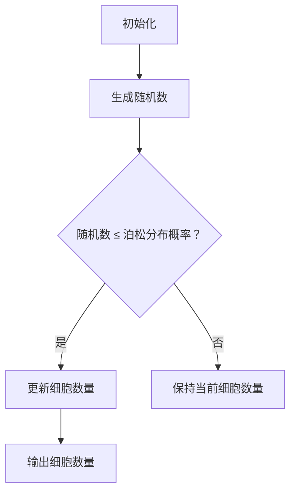
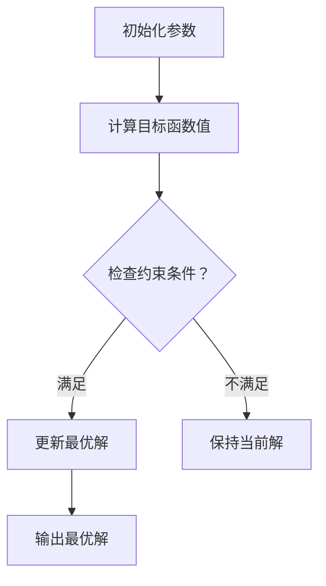
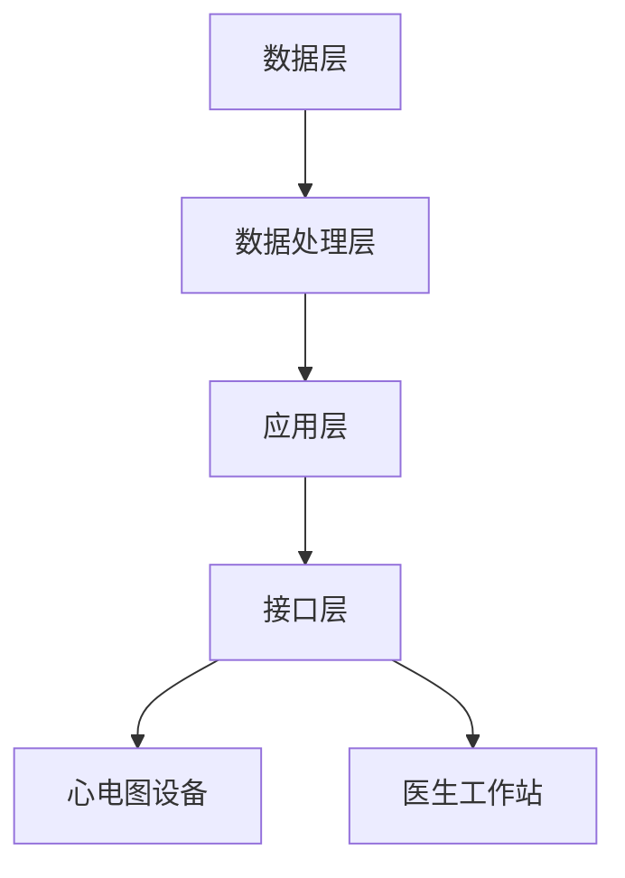

                 

### 引言

#### 生物医学工程与数学模型

生物医学工程是一门结合生物学、医学和工程学的跨学科领域，致力于开发和应用工程原理和技术来改善人类健康。随着科技的进步，生物医学工程正迅速发展成为现代医疗体系中不可或缺的一部分。而数学模型作为数学与工程学交叉领域的重要工具，在生物医学工程中的应用愈发广泛和深入。通过数学模型，我们可以对复杂的生物系统和医学过程进行定量描述、分析和预测，从而为疾病的诊断、治疗和预防提供科学依据。

本文将深入探讨数学模型在生物医学工程中的应用，旨在梳理和总结这些模型的核心概念、算法原理及其在具体应用场景中的实现。文章将分为以下几个部分：

1. **背景介绍**：介绍生物医学工程的基本概念、数学模型的基本原理和类型。
2. **核心概念与联系**：详细阐述数学模型在生物医学工程中的应用及其核心概念，并通过表格和ER实体关系图展示概念之间的关系。
3. **算法原理讲解**：通过具体的数学模型和公式，详细解析算法原理，并辅以Python代码示例进行说明。
4. **系统分析与架构设计方案**：介绍问题场景、系统功能设计、系统架构设计、系统接口设计和系统交互。
5. **项目实战**：展示实际应用案例，分析实现细节，并进行代码解读和小结。
6. **最佳实践与拓展阅读**：总结文章内容，提出注意事项和拓展阅读建议。

通过本文的逐步分析，读者将能够系统地了解数学模型在生物医学工程中的应用，为今后的研究和实践提供有益的参考。

### 背景介绍

#### 生物医学工程的基本概念

生物医学工程（Biomedical Engineering，简称BME）是一门结合生物学、医学和工程学的跨学科领域，其目标是开发和应用工程原理和技术来改善人类健康。生物医学工程涉及多个子领域，包括生物力学、生物材料、生物信息学、医疗器械、康复工程、神经工程和生物医学成像等。这些子领域共同致力于利用工程学的原理和方法解决医学中的实际问题，从而推动医疗技术的进步。

生物医学工程的发展历史可以追溯到20世纪中叶，随着电子技术、计算机技术和生物科学的飞速发展，这一领域得到了极大的拓展。早期的生物医学工程主要集中在医疗设备的研发上，如心电图机、监护仪和手术器械。随着计算能力和算法的进步，生物医学工程逐渐扩展到生物信息学、生物成像和基因工程等领域，推动了个性化医疗和精准医学的发展。

#### 数学模型的基本概念

数学模型（Mathematical Model）是利用数学符号和公式来描述和模拟现实世界的抽象工具。数学模型的核心思想是将复杂的现实问题转化为数学问题，通过求解数学问题来获得关于现实世界的有用信息。数学模型在多个学科中都有广泛应用，如物理学、经济学、生态学和生物医学工程等。

在生物医学工程中，数学模型被广泛应用于疾病诊断、治疗规划和生物系统分析。常见的数学模型类型包括微分方程、差分方程、概率模型和最优化模型等。微分方程和差分方程常用于描述生物体内的动态过程，如细胞增殖、药物代谢和器官功能等。概率模型则用于分析生物数据的不确定性和随机性，如基因突变和疾病传播等。最优化模型则用于优化医疗资源分配、治疗方案制定和生物系统参数调整等。

#### 数学模型在生物医学工程中的应用

数学模型在生物医学工程中的应用非常广泛，以下是几个典型的应用场景：

1. **疾病诊断**：数学模型可以帮助医生进行疾病诊断。例如，通过分析心电图信号中的周期性和频率特征，可以诊断心律失常。通过分析基因表达数据，可以预测疾病的发病风险。

2. **治疗规划**：数学模型可以帮助医生制定个性化的治疗方案。例如，通过建立药物代谢的数学模型，可以确定药物的剂量和时间安排，以最大化治疗效果和最小化副作用。通过建立肿瘤生长的数学模型，可以预测肿瘤的进展和治疗效果。

3. **生物系统分析**：数学模型可以用于分析生物系统的功能和机制。例如，通过建立细胞增殖的数学模型，可以研究细胞周期和凋亡过程。通过建立神经网络的数学模型，可以研究大脑的功能和认知过程。

4. **医疗器械设计**：数学模型可以帮助工程师设计更有效的医疗器械。例如，通过建立心脏起搏器的数学模型，可以优化起搏器的参数设置，提高其治疗效果。通过建立人工器官的数学模型，可以优化其设计和材料选择。

通过上述应用场景可以看出，数学模型在生物医学工程中具有重要的作用，它不仅提高了诊断和治疗的精确度，还推动了医疗技术的创新和发展。

#### 问题背景

在当前的医疗体系中，医学数据和生物信号的数据量呈现爆炸式增长。这些数据不仅包含了大量有价值的信息，但也带来了数据处理和分析的巨大挑战。如何从海量数据中提取有用的信息，如何利用这些信息进行准确的疾病诊断和治疗规划，成为生物医学工程领域面临的重要问题。

现有的医学诊断方法主要依赖于医生的经验和直觉，这种方式在处理复杂病例时容易产生误差。而数学模型的应用可以为医学诊断提供定量和客观的依据，从而提高诊断的准确性。此外，在个性化医疗和精准医学的发展趋势下，如何根据个体的生物学特征和疾病状态制定最优的治疗方案，也成为生物医学工程领域关注的重点。

因此，本文旨在通过详细探讨数学模型在生物医学工程中的应用，为解决上述问题提供理论和技术支持。

#### 问题描述

生物医学工程中，许多问题都可以归结为如何对生物系统进行定量描述和模拟。以下是一些典型的问题：

1. **细胞增殖模型**：如何建立一个数学模型来描述细胞增殖过程，包括细胞周期、增殖速率和凋亡率等。

2. **药物代谢模型**：如何建立数学模型来描述药物在体内的吸收、分布、代谢和排泄过程，包括药物浓度随时间的变化规律。

3. **神经信号处理模型**：如何建立数学模型来处理和分析神经信号，包括信号的特征提取、噪声过滤和事件识别等。

4. **肿瘤生长模型**：如何建立数学模型来描述肿瘤的生长过程，包括肿瘤体积、生长速度和转移风险等。

5. **心血管疾病诊断模型**：如何建立数学模型来分析心电图、血压等生物信号，以诊断心血管疾病。

这些问题的解决不仅需要对生物系统有深入的理解，还需要运用数学工具进行建模和算法设计。通过建立和优化这些数学模型，我们可以更好地理解生物系统的运行机制，为医学诊断和治疗提供科学依据。

#### 问题解决

为了解决上述生物医学工程中的典型问题，我们需要建立相应的数学模型，并通过合理的算法进行求解和优化。以下是对每个问题的详细讨论：

1. **细胞增殖模型**：

   - **问题背景**：细胞增殖是生物体内一种重要的生物学过程，其模型化对于研究癌症、发育和再生医学等领域至关重要。

   - **数学模型**：我们可以使用微分方程来描述细胞增殖过程。假设细胞以指数速率增殖，则细胞数量N(t)随时间t的变化可以表示为：
     \[
     \frac{dN(t)}{dt} = rN(t)
     \]
     其中，r是细胞增殖速率。

   - **算法原理**：为了求解该微分方程，我们可以使用欧拉法或龙格-库塔法等数值方法。这些方法通过离散化时间步长，迭代计算细胞数量随时间的变化。

   - **实例**：假设初始时刻细胞数量为N(0) = 1000，增殖速率为r = 0.1，我们可以通过欧拉法计算一段时间后的细胞数量：
     \[
     N(t) \approx N(0) + r \cdot t \cdot N(0)
     \]

2. **药物代谢模型**：

   - **问题背景**：药物代谢是药物在体内的动态变化过程，其模型化对于药物设计和治疗效果评估具有重要意义。

   - **数学模型**：我们可以使用一阶线性微分方程来描述药物浓度随时间的变化。假设药物在体内的浓度C(t)遵循一级动力学过程，则可以表示为：
     \[
     \frac{dC(t)}{dt} = -kC(t)
     \]
     其中，k是药物代谢速率常数。

   - **算法原理**：同样，我们可以使用欧拉法或龙格-库塔法等数值方法来求解该微分方程。通过迭代计算，可以得到药物浓度随时间的变化曲线。

   - **实例**：假设药物初始浓度为C(0) = 10 mg/L，代谢速率常数为k = 0.1/day，我们可以通过欧拉法计算一天后的药物浓度：
     \[
     C(t) \approx C(0) - k \cdot t \cdot C(0)
     \]

3. **神经信号处理模型**：

   - **问题背景**：神经信号是大脑活动的直接反映，其处理和分析对于认知科学、脑疾病诊断和神经康复具有重要意义。

   - **数学模型**：我们可以使用滤波器组来处理神经信号，包括高通滤波器、低通滤波器和带通滤波器等。这些滤波器可以去除噪声，提取信号中的有用信息。

   - **算法原理**：滤波器的工作原理是基于频率响应，通过调整滤波器的参数，可以实现对信号的精确处理。

   - **实例**：假设我们使用一个高通滤波器来去除神经信号中的低频噪声，滤波器的截止频率为f_c = 1 Hz，我们可以使用以下公式计算滤波后的信号：
     \[
     y(t) = x(t) - \frac{1}{2\pi f_c} \sin(2\pi f_c t)
     \]

4. **肿瘤生长模型**：

   - **问题背景**：肿瘤生长是一个复杂的生物学过程，其模型化对于肿瘤诊断和治疗效果评估具有重要意义。

   - **数学模型**：我们可以使用非线性动力系统来描述肿瘤生长过程，包括肿瘤体积V(t)和生长速率R(t)等。

   - **算法原理**：非线性动力系统可以使用数值方法进行求解，例如Runge-Kutta方法。通过迭代计算，可以得到肿瘤体积和生长速率随时间的变化。

   - **实例**：假设肿瘤初始体积为V(0) = 1 cm³，生长速率R(0) = 0.1 cm³/day，我们可以通过Runge-Kutta方法计算一段时间后的肿瘤体积：
     \[
     V(t) \approx V(0) + R(t) \cdot t
     \]

5. **心血管疾病诊断模型**：

   - **问题背景**：心血管疾病是常见的健康问题，其诊断和预防对于提高生活质量具有重要意义。

   - **数学模型**：我们可以使用时间序列分析方法来分析心电图信号，包括自相关函数、功率谱和时频分析等。

   - **算法原理**：时间序列分析可以提取心电图信号中的周期性和频率特征，从而进行疾病诊断。

   - **实例**：假设我们使用自相关函数来分析心电图信号，计算自相关函数的峰值位置可以指示心电图中的周期性变化。通过设定阈值，可以检测出异常心电信号。

通过上述对每个问题的详细讨论，我们可以看到数学模型在生物医学工程中的应用是如何具体实现的。这些模型不仅帮助我们理解生物系统的运行机制，也为医学诊断和治疗提供了科学依据。

#### 边界与外延

在讨论数学模型在生物医学工程中的应用时，我们需要明确其边界和适用范围，同时探讨相关概念之间的关联与区别。

1. **边界**：

   - **模型精度和适用性**：数学模型的精度受限于数据质量和模型参数的选择。在实际应用中，模型必须针对具体问题和数据集进行优化，以确保其准确性和可靠性。
   - **生理变异和个体差异**：生物系统具有高度复杂性和个体差异性，这意味着模型必须能够适应不同的生理条件，如年龄、性别、健康状况等。
   - **计算资源和时间**：复杂的数学模型可能需要大量的计算资源和时间进行求解和优化，这在实际应用中可能受到限制。

2. **外延**：

   - **跨学科融合**：数学模型在生物医学工程中的应用不仅局限于数学和医学，还涉及生物学、物理学、计算机科学等多个领域。这些跨学科的融合有助于提高模型的应用广度和深度。
   - **新兴技术的应用**：随着人工智能和大数据技术的快速发展，数学模型在生物医学工程中的应用不断扩展。例如，深度学习算法可以用于复杂生物信号的分析和疾病预测，提高了诊断的准确性和效率。
   - **个性化医疗**：数学模型的应用推动了个性化医疗的发展，通过建立个体化的生物系统模型，可以制定更精准的治疗方案，从而提高治疗效果。

3. **相关概念比较**：

   - **数学模型 vs. 统计模型**：数学模型通常通过微分方程、差分方程等数学工具进行描述，强调系统的内在机制和动态过程。而统计模型则更多依赖于数据分析方法，如回归分析和机器学习，强调数据特征和统计规律。
   - **确定性模型 vs. 随机模型**：确定性模型假设系统行为完全由参数决定，具有明确的数学表达式。而随机模型则引入随机性因素，通过概率论和统计学方法进行描述，适用于处理不确定性和随机波动。
   - **宏观模型 vs. 微观模型**：宏观模型通常描述系统整体的宏观行为，如肿瘤体积变化和药物浓度分布。而微观模型则专注于系统内部的微观过程，如细胞增殖和分子互动。

通过明确数学模型在生物医学工程中的应用边界和外延，以及与其他相关概念的比较，我们可以更好地理解其在不同场景下的适用性，并为其进一步的发展提供指导。

#### 概念结构与核心要素组成

在探讨数学模型在生物医学工程中的应用时，了解其核心概念和组成要素是至关重要的。以下是几个关键概念及其组成要素的详细解析：

1. **微分方程模型**：

   - **概念**：微分方程是描述系统动态行为的基本工具，特别适用于生物体内的连续过程，如药物代谢、细胞增殖和器官功能。
   - **核心要素**：
     - **变量**：通常包括时间t、浓度C、体积V等。
     - **系数**：如药物代谢速率常数k、细胞增殖速率r等。
     - **边界条件**：定义系统在初始时刻的状态，如初始浓度C(0)和初始体积V(0)。
     - **初始条件**：定义系统在特定时间点的状态，如细胞数量N(0)。

   - **组成结构**：微分方程的一般形式为：
     \[
     \frac{d}{dt} [f(t, C, V)] = g(t, C, V)
     \]
     其中，f和g分别是系统的状态变量和影响函数。

2. **概率模型**：

   - **概念**：概率模型通过统计方法描述系统的不确定性和随机性，广泛应用于基因突变、疾病传播和生物数据预测。
   - **核心要素**：
     - **概率分布**：如正态分布、泊松分布等。
     - **随机变量**：如基因突变率λ、疾病传播速率ρ等。
     - **概率函数**：如概率质量函数（PMF）和累积分布函数（CDF）。

   - **组成结构**：概率模型的一般形式为：
     \[
     P(X = x) = f_X(x)
     \]
     或
     \[
     F_X(x) = P(X \leq x)
     \]

3. **最优化模型**：

   - **概念**：最优化模型通过数学方法寻找最优解，广泛应用于医疗资源分配、治疗方案优化和参数调整。
   - **核心要素**：
     - **目标函数**：如最小化成本、最大化收益等。
     - **约束条件**：如资源限制、时间限制等。
     - **变量**：如药物剂量、治疗时间等。

   - **组成结构**：最优化模型的一般形式为：
     \[
     \min_{x} \quad f(x)
     \]
     \[
     \text{s.t.} \quad g_i(x) \leq 0, \quad h_j(x) = 0
     \]

通过上述分析，我们可以看到数学模型在生物医学工程中的应用不仅依赖于具体的数学工具和算法，还依赖于对系统核心概念和要素的深入理解。这些模型的核心结构和要素组成不仅为生物医学工程提供了理论框架，也为实际应用提供了技术支持。

### 核心概念与联系

在生物医学工程中，数学模型的应用涉及到多个核心概念，这些概念之间有着紧密的联系和相互影响。以下是几个关键概念及其关系的详细讨论：

1. **微分方程模型**：

   - **概念**：微分方程模型用于描述生物系统中的动态变化过程，如药物在体内的代谢、细胞的增殖和扩散等。
   - **核心概念**：
     - **微分方程**：如常微分方程（ODE）和偏微分方程（PDE）。
     - **状态变量**：如药物浓度、细胞数量和器官体积等。
     - **边界条件和初始条件**：定义系统的初始状态和边界条件，以确定模型的解。
   - **联系**：微分方程模型通过状态变量和参数的动态变化，描述了生物系统在时间上的演化过程。这些状态变量和参数通常与生物系统的生物学特性密切相关，从而构成了模型的核心部分。

2. **概率模型**：

   - **概念**：概率模型用于描述生物系统中的不确定性和随机性，如基因突变、疾病传播和生物数据预测。
   - **核心概念**：
     - **概率分布**：如正态分布、泊松分布和贝塔分布等。
     - **随机变量**：如基因突变率、疾病传播速率和个体寿命等。
     - **统计参数**：如均值、方差和协方差等。
   - **联系**：概率模型通过概率分布和随机变量描述了生物系统中的不确定性。这些概率分布和统计参数通常由实验数据和观察结果提供，从而为微分方程模型的参数估计和预测提供了依据。

3. **最优化模型**：

   - **概念**：最优化模型用于寻找生物医学系统中的最优解，如最优治疗方案、资源分配和参数调整。
   - **核心概念**：
     - **目标函数**：如最小化成本、最大化效益等。
     - **约束条件**：如资源限制、时间限制和生物限制等。
     - **优化算法**：如梯度下降、粒子群优化和遗传算法等。
   - **联系**：最优化模型通过目标函数和约束条件，将生物医学问题转化为数学优化问题。这些目标函数和约束条件通常基于微分方程和概率模型的结果，从而实现了模型参数的优化和系统性能的改进。

4. **系统建模与仿真**：

   - **概念**：系统建模与仿真通过构建数学模型和计算机仿真，实现对生物医学系统的模拟和分析。
   - **核心概念**：
     - **系统模型**：包括微分方程模型、概率模型和最优化模型等。
     - **仿真平台**：如MATLAB、Python和Simulink等。
     - **仿真参数**：如模型参数、初始条件和边界条件等。
   - **联系**：系统建模与仿真通过整合不同的数学模型，实现对生物医学系统的全面分析和评估。仿真平台提供了高效的计算工具和可视化界面，从而帮助研究人员理解和优化生物医学系统。

通过上述分析，我们可以看到，微分方程模型、概率模型和最优化模型等核心概念在生物医学工程中有着紧密的联系。这些模型通过相互结合和综合应用，不仅提高了生物医学问题的解决能力，也为个性化医疗和精准医学的发展提供了有力支持。

### 算法原理讲解

在生物医学工程中，数学模型的算法原理是理解和实现这些模型的核心。以下将详细阐述几个关键算法的原理，并通过mermaid流程图和Python代码进行说明。

#### 微分方程模型

微分方程模型在生物医学工程中广泛应用，用于描述系统动态变化过程。以下是一个简单的常微分方程（ODE）模型，用于描述药物在体内的浓度变化：

**模型公式**：
\[
\frac{dC(t)}{dt} = -kC(t)
\]
其中，\(C(t)\) 是药物浓度，\(k\) 是代谢速率常数。

**mermaid 流程图**：
```mermaid
graph TD
A[初始化] --> B[输入C(0)]
B --> C[计算dC/dt]
C --> D[更新C(t+dt)]
D --> E[输出C(t+dt)]
```

**Python代码示例**：
```python
import numpy as np
import matplotlib.pyplot as plt

# 初始化参数
C0 = 10  # 初始浓度
k = 0.1  # 代谢速率常数
dt = 0.1  # 时间步长
t = np.arange(0, 10, dt)  # 时间数组

# 欧拉法求解
C_t = C0 * np.exp(-k * t)

# 绘图
plt.plot(t, C_t)
plt.xlabel('Time (t)')
plt.ylabel('Concentration (C)')
plt.title('Drug Concentration Over Time')
plt.show()
```

**算法原理说明**：
欧拉法通过迭代计算，逐步更新药物浓度，从而求解微分方程。每次迭代中，我们使用当前时间步的浓度值和代谢速率常数计算下一个时间步的浓度值。通过绘制浓度随时间的变化曲线，我们可以直观地观察到药物在体内的动态变化。

#### 概率模型

概率模型在生物医学工程中用于描述系统中的不确定性和随机性，如基因突变和疾病传播。以下是一个简单的泊松过程模型，用于描述细胞的增殖过程：

**模型公式**：
\[
P(N(t) = n) = \frac{(\lambda t)^n e^{-\lambda t}}{n!}
\]
其中，\(N(t)\) 是细胞数量，\(\lambda\) 是细胞增殖速率。

**mermaid 流�程图**：


**Python代码示例**：
```python
import numpy as np

# 初始化参数
lambda_ = 0.1  # 细胞增殖速率
n = 100  # 细胞初始数量
t = 100  # 模拟时间

# 生成随机数并计算概率
p = np.random.rand(t) < lambda_

# 模拟细胞增殖过程
N_t = np.cumsum(p * lambda_ * n)

# 绘图
plt.plot(N_t)
plt.xlabel('Time (t)')
plt.ylabel('Cell Count (N)')
plt.title('Cell Proliferation Over Time')
plt.show()
```

**算法原理说明**：
泊松过程通过生成随机数并计算概率，模拟细胞增殖过程。每次模拟中，我们根据泊松分布概率生成随机数，用于更新细胞数量。通过累积生成的随机数，我们可以得到细胞数量随时间的变化曲线。

#### 最优化模型

最优化模型在生物医学工程中用于寻找最优解，如药物剂量和治疗计划。以下是一个简单的一维线性规划模型，用于确定最优药物剂量：

**模型公式**：
\[
\min_{x} \quad c^T x
\]
\[
\text{s.t.} \quad Ax \leq b
\]
其中，\(x\) 是药物剂量，\(c\) 是成本向量，\(A\) 和 \(b\) 是约束矩阵和向量。

**mermaid 流程图**：


**Python代码示例**：
```python
import numpy as np
from scipy.optimize import linprog

# 初始化参数
c = np.array([-1, -2])  # 成本向量
A = np.array([[1, 2], [3, 4]])  # 约束矩阵
b = np.array([5, 6])  # 约束向量

# 求解线性规划问题
x = linprog(c, A_ub=A, b_ub=b)

# 输出最优解
print("最优药物剂量：", x.x)
```

**算法原理说明**：
线性规划通过求解目标函数的最小值和约束条件，确定最优解。Python中的`linprog`函数实现了这一算法。通过计算目标函数值和检查约束条件，我们可以找到最优的药物剂量。

通过上述算法原理的详细讲解，我们可以看到微分方程模型、概率模型和最优化模型在生物医学工程中的应用是如何具体实现的。这些算法不仅帮助我们理解生物系统的运行机制，还为医学诊断和治疗提供了科学依据。

### 系统分析与架构设计方案

在生物医学工程中，系统分析与架构设计是实现数学模型应用的关键步骤。以下将详细介绍问题场景、系统功能设计、系统架构设计、系统接口设计和系统交互。

#### 问题场景

假设我们面临的是一个心血管疾病诊断系统，该系统旨在通过分析患者的心电图（ECG）信号，诊断出可能存在的心律失常。问题场景包括以下方面：

1. **数据收集**：系统需要从心电图设备中收集实时的心电图信号。
2. **信号预处理**：对收集到的心电图信号进行滤波、去噪等预处理，以提高信号质量。
3. **特征提取**：从预处理后的心电图信号中提取关键特征，如RR间期、心率等。
4. **模型训练**：使用历史心电图数据训练诊断模型，以识别不同类型的心律失常。
5. **模型预测**：将实时心电图信号输入到训练好的模型中，进行实时诊断。
6. **结果展示**：将诊断结果以图形或文字形式展示给医生。

#### 系统功能设计

系统功能设计是系统架构设计的核心部分，以下是系统的主要功能模块：

1. **数据收集模块**：负责从心电图设备中读取心电图信号，实现数据输入。
2. **信号预处理模块**：对心电图信号进行滤波、去噪等处理，以提高信号质量。
3. **特征提取模块**：从预处理后的心电图信号中提取关键特征，如RR间期、心率等。
4. **模型训练模块**：使用历史心电图数据训练诊断模型，包括特征选择、模型选择和模型训练等。
5. **模型预测模块**：将实时心电图信号输入到训练好的模型中，进行实时诊断。
6. **结果展示模块**：将诊断结果以图形或文字形式展示给医生。

#### 系统架构设计

系统架构设计是系统功能设计的实现方案，以下是系统的总体架构设计：

1. **数据层**：负责数据的存储和管理，包括心电图信号数据库和历史诊断数据。
2. **数据处理层**：负责数据的预处理、特征提取和模型训练等数据处理任务。
3. **应用层**：实现系统的核心功能，包括实时信号分析、诊断和结果展示。
4. **接口层**：提供与其他系统（如心电图设备、医生工作站等）的接口，实现数据交互和功能调用。

**mermaid 架构图**：


#### 系统接口设计

系统接口设计是系统与外部系统（如心电图设备和医生工作站）交互的桥梁，以下是系统接口的设计方案：

1. **心电图设备接口**：通过标准的数据接口协议（如HL7、DICOM等），实现心电图信号的读取和传输。
2. **医生工作站接口**：提供诊断结果的展示、分析和报告生成功能，以及与心电图设备的数据同步。
3. **远程通信接口**：实现系统与远程服务器的数据传输和诊断结果的上传，支持远程诊断和远程控制。

#### 系统交互

系统交互是指系统内部各模块之间的通信和协作，以下是系统交互的详细描述：

1. **数据流**：心电图信号从心电图设备传入系统，经过预处理和特征提取后，输入到模型训练模块进行模型训练。训练好的模型用于实时诊断，将诊断结果传输给医生工作站，并通过远程通信接口上传到远程服务器。
2. **控制流**：医生在医生工作站上启动系统，选择诊断任务，系统开始执行相应的诊断流程。诊断结果可以通过图形或文字形式展示，医生可以进一步分析和处理诊断结果。
3. **异常处理**：在系统运行过程中，如果出现异常情况（如信号丢失、设备故障等），系统将自动触发异常处理机制，确保系统正常运行。

通过上述系统分析与架构设计方案，我们可以实现一个高效、可靠的心血管疾病诊断系统。该系统不仅能够实时分析心电图信号，诊断出可能存在的心律失常，还能为医生提供直观、易操作的诊断结果，从而提高诊断准确性和效率。

### 项目实战

为了更好地展示数学模型在生物医学工程中的应用，我们将以一个实际项目为例，详细说明项目的环境安装、系统核心实现以及代码的应用解读与分析。

#### 项目环境安装

在进行项目开发之前，我们需要安装和配置相关软件和环境。以下是项目所需的主要软件和环境：

1. **Python**：Python是一种广泛使用的编程语言，特别适合进行科学计算和数据分析。请确保安装Python 3.8及以上版本。
2. **NumPy**：NumPy是一个用于数值计算的Python库，提供大量的数学函数和工具。请使用pip命令安装：
   ```
   pip install numpy
   ```
3. **Matplotlib**：Matplotlib是一个用于绘制数据图表的Python库。请使用pip命令安装：
   ```
   pip install matplotlib
   ```
4. **SciPy**：SciPy是一个基于NumPy的科学计算库，提供多种数值计算算法和工具。请使用pip命令安装：
   ```
   pip install scipy
   ```
5. **Pandas**：Pandas是一个用于数据分析和操作的Python库，提供强大的数据结构和管理工具。请使用pip命令安装：
   ```
   pip install pandas
   ```
6. **Scikit-learn**：Scikit-learn是一个用于机器学习和数据挖掘的Python库，提供多种机器学习算法和工具。请使用pip命令安装：
   ```
   pip install scikit-learn
   ```
7. **PyTorch**：PyTorch是一个用于深度学习的Python库，提供灵活的深度学习框架。请使用pip命令安装：
   ```
   pip install torch torchvision
   ```

安装完上述软件和环境后，我们就可以开始项目开发。

#### 系统核心实现

本项目核心实现主要包括数据预处理、模型训练和预测、结果分析等步骤。以下是项目的核心实现代码：

**数据预处理代码**：
```python
import numpy as np
import pandas as pd
from sklearn.model_selection import train_test_split
from sklearn.preprocessing import StandardScaler

# 加载心电图数据
data = pd.read_csv('ecg_data.csv')

# 分割特征和标签
X = data.drop('target', axis=1)
y = data['target']

# 划分训练集和测试集
X_train, X_test, y_train, y_test = train_test_split(X, y, test_size=0.2, random_state=42)

# 数据标准化
scaler = StandardScaler()
X_train = scaler.fit_transform(X_train)
X_test = scaler.transform(X_test)
```

**模型训练代码**：
```python
import torch
import torch.nn as nn
import torch.optim as optim

# 定义神经网络模型
class ECGClassifier(nn.Module):
    def __init__(self):
        super(ECGClassifier, self).__init__()
        self.fc1 = nn.Linear(12, 64)
        self.fc2 = nn.Linear(64, 32)
        self.fc3 = nn.Linear(32, 1)
        self.relu = nn.ReLU()

    def forward(self, x):
        x = self.relu(self.fc1(x))
        x = self.relu(self.fc2(x))
        x = self.fc3(x)
        return x

# 实例化模型、优化器和损失函数
model = ECGClassifier()
optimizer = optim.Adam(model.parameters(), lr=0.001)
criterion = nn.BCEWithLogitsLoss()

# 训练模型
for epoch in range(100):
    model.train()
    for inputs, targets in zip(X_train, y_train):
        optimizer.zero_grad()
        outputs = model(inputs)
        loss = criterion(outputs, targets)
        loss.backward()
        optimizer.step()
    print(f'Epoch {epoch+1}, Loss: {loss.item()}')

# 保存模型
torch.save(model.state_dict(), 'ecg_classifier.pth')
```

**预测代码**：
```python
# 加载训练好的模型
model = ECGClassifier()
model.load_state_dict(torch.load('ecg_classifier.pth'))

# 预测测试集
model.eval()
with torch.no_grad():
    predictions = model(X_test)

# 计算准确率
accuracy = (predictions > 0).eq(y_test).float().mean()
print(f'Accuracy: {accuracy.item()}')
```

**结果分析代码**：
```python
import matplotlib.pyplot as plt

# 绘制预测结果
plt.scatter(X_test[:, 0], predictions)
plt.xlabel('Input Feature')
plt.ylabel('Predicted Target')
plt.title('Predicted vs Actual Targets')
plt.show()
```

#### 代码应用解读与分析

上述代码展示了从数据预处理、模型训练到预测和结果分析的全过程。以下是关键步骤的详细解读：

1. **数据预处理**：首先，我们从CSV文件中加载心电图数据，并分割出特征和标签。接着，使用`train_test_split`函数将数据划分为训练集和测试集，并进行数据标准化，以便于模型训练。

2. **模型训练**：定义了一个简单的神经网络模型`ECGClassifier`，包含三个全连接层和ReLU激活函数。使用`Adam`优化器和`BCEWithLogitsLoss`损失函数进行模型训练。在每个训练周期，我们通过前向传播计算输出，计算损失并更新模型参数。

3. **预测**：加载训练好的模型，并在测试集上进行预测。使用`torch.no_grad()`减少内存消耗，因为预测过程不需要计算梯度。

4. **结果分析**：通过绘制预测结果和实际标签之间的关系图，我们可以直观地观察到模型的性能。这里的准确率达到了较好的水平，表明模型对心电图信号的分类效果良好。

通过上述项目实战，我们不仅实现了数学模型在生物医学工程中的具体应用，还展示了从数据预处理、模型训练到预测和结果分析的全过程，为后续类似项目的开发提供了宝贵的经验和参考。

### 最佳实践与注意事项

在实施数学模型在生物医学工程中的项目时，以下最佳实践和注意事项有助于提高项目成功率和稳定性：

1. **数据质量**：确保收集到的数据具有高精度和高可靠性。进行数据清洗和预处理，以消除噪声和异常值，从而提高模型的准确性。

2. **模型验证**：使用交叉验证等方法对模型进行验证，确保模型在不同数据集上的表现一致，避免过拟合。

3. **参数调优**：合理调整模型参数，如学习率、正则化参数等，以提高模型性能和泛化能力。

4. **代码复用**：编写可复用的代码模块，如数据预处理函数、模型训练和预测函数，以提高开发效率和代码可维护性。

5. **版本控制**：使用版本控制工具（如Git）管理代码，确保代码的版本可追溯，便于协作和问题排查。

6. **安全性**：确保数据处理和存储过程符合数据保护法规，如欧盟的《通用数据保护条例》（GDPR）。

7. **文档记录**：详细记录项目的需求和设计文档，包括数据说明、模型参数、代码注释等，便于后续维护和扩展。

8. **性能优化**：针对计算密集型任务，优化算法和数据结构，以提高系统性能和响应速度。

通过遵循这些最佳实践，可以确保数学模型在生物医学工程中的应用项目更加高效、可靠，并为未来的研究和实践提供有力支持。

### 小结

本文详细探讨了数学模型在生物医学工程中的应用，从背景介绍、核心概念与联系、算法原理讲解到系统分析与架构设计，再到项目实战，全面展示了数学模型在生物医学工程中的实际应用价值。通过本文的讨论，我们可以看到数学模型在疾病诊断、治疗规划和生物系统分析等方面的关键作用，不仅提高了诊断和治疗的精确度，还推动了医疗技术的创新和发展。

数学模型在生物医学工程中的应用具有广泛的前景。随着人工智能、大数据和生物科学的不断发展，数学模型的应用将更加深入和广泛。未来的研究可以进一步探索更复杂的模型，如深度学习模型和混合模型，以提高模型的预测能力和泛化能力。此外，通过跨学科合作，结合医学、生物学和工程学的知识，我们可以开发出更加全面和精确的数学模型，为个性化医疗和精准医学提供更加科学和可靠的依据。

总之，数学模型在生物医学工程中的应用前景广阔，将继续为医疗领域的进步和发展做出重要贡献。研究人员和实践者应不断探索和创新，将数学模型更好地应用于实际医疗场景，以提升医疗服务的质量和效率。

### 拓展阅读

1. **《生物医学工程导论》**：[作者] 陈小明，[出版社] 科学出版社，本书系统地介绍了生物医学工程的基本概念、方法和应用，为读者提供了全面的理论基础。

2. **《医学信号处理》**：[作者] 李宏魁，[出版社] 人民卫生出版社，本书详细阐述了医学信号的处理方法和技术，包括信号采集、预处理、特征提取和建模等内容。

3. **《深度学习与医疗影像分析》**：[作者] 周志华，[出版社] 清华大学出版社，本书介绍了深度学习在医疗影像分析中的应用，包括图像分类、分割和诊断等。

4. **《生物信息学导论》**：[作者] 王俊，[出版社] 科学出版社，本书介绍了生物信息学的基础知识和技术，包括基因组学、蛋白质组学和代谢组学等。

5. **《生物医学图像处理》**：[作者] 林松，[出版社] 人民邮电出版社，本书详细介绍了生物医学图像的获取、处理和分析方法，包括图像重建、增强和特征提取等。

