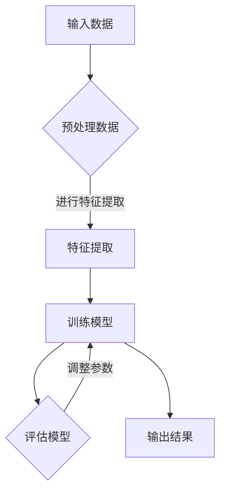
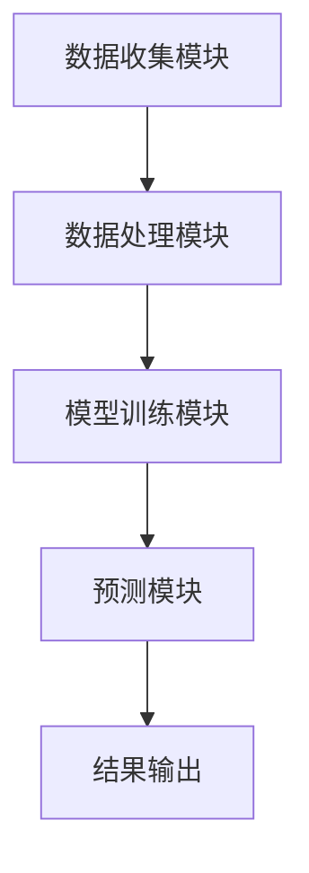
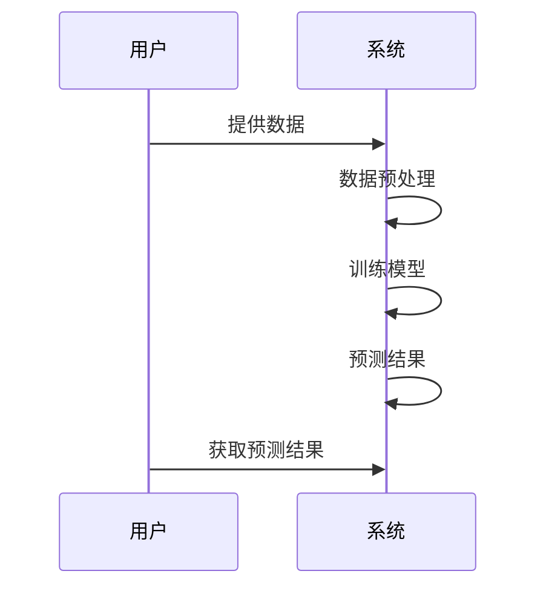

                 


### 背景介绍

**数学模型在生物医学中的重要性**

数学模型是生物医学领域研究和应用中的重要工具。随着生物医学技术的快速发展，海量数据生成和复杂生物系统的研究成为挑战。数学模型能够将这些复杂的生物过程转化为可计算的形式，从而为科学研究提供有力的支持。

**生物医学领域的挑战**

生物医学领域面临着许多挑战，如数据复杂性、生物多样性、疾病机理的复杂性等。这些挑战使得传统的实验方法难以应对，而数学模型可以提供新的研究方法，如系统生物学、计算生物学等。

**数学模型的应用场景**

数学模型在生物医学中的应用非常广泛，包括但不限于以下几个方面：

1. **疾病预测和诊断**：利用数学模型预测疾病的发生和发展趋势，辅助临床诊断。
2. **药物设计**：通过模拟生物分子之间的相互作用，帮助设计新的药物。
3. **基因组学**：利用数学模型分析基因组数据，发现基因之间的关系和功能。
4. **神经科学**：模拟神经元的工作机制，研究大脑功能和疾病机理。

### 核心概念与联系

**数学模型的基本概念**

数学模型是指用数学语言描述的客观系统的运动规律或数学结构。它通常包括变量、参数、方程等元素。

**生物医学领域的关键概念**

生物医学领域涉及许多关键概念，如基因、蛋白质、细胞、分子、器官、系统等。

**概念属性特征对比表格**

| 概念   | 属性   | 特征   |
| ------ | ------ | ------ |
| 基因   | 信息   | 控制蛋白质合成 |
| 蛋白质 | 结构   | 执行生物功能 |
| 细胞   | 结构   | 生物基本单位 |
| 分子   | 化学性质 | 参与生物过程 |
| 器官   | 功能   | 维持生命活动 |
| 系统   | 结构   | 分工协作 |

**ER实体关系图**

实体关系图（ER图）用于描述实体和它们之间的关系。在生物医学领域，ER图可以用于表示基因、蛋白质、细胞、器官等实体及其相互关系。

### 算法原理讲解

**常用算法介绍**

在生物医学领域，常用的算法包括机器学习算法、优化算法、模拟算法等。

**算法流程图**

（使用Mermaid绘制算法流程图）



**Python源代码与解释**

```python
import numpy as np
from sklearn.ensemble import RandomForestClassifier
from sklearn.model_selection import train_test_split

# 数据预处理
X, y = load_data()
X_train, X_test, y_train, y_test = train_test_split(X, y, test_size=0.2, random_state=42)

# 特征提取
X_train = feature_extraction(X_train)
X_test = feature_extraction(X_test)

# 训练模型
model = RandomForestClassifier()
model.fit(X_train, y_train)

# 评估模型
accuracy = model.score(X_test, y_test)
print(f"模型准确率：{accuracy:.2f}")
```

**数学模型与公式讲解**

（使用LaTeX格式嵌入数学公式）

```latex
\begin{equation}
P(Y|X) = \prod_{i=1}^{n} p(y_i|x_i)
\end{equation}
```

这是一个简单的概率模型，表示在给定特征\(X\)的情况下，标签\(Y\)的概率分布。

**举例说明**

假设我们有一个关于疾病的预测问题，特征包括体温、血压、咳嗽等。我们可以使用上述概率模型来预测疾病发生的概率。

### 数学模型与数学公式

**常用数学模型介绍**

1. **线性回归模型**：用于分析自变量和因变量之间的线性关系。
2. **逻辑回归模型**：用于分类问题，计算类别概率。
3. **神经网络模型**：用于复杂函数的近似和学习。

**数学公式与解释**

1. **线性回归模型**：

   $$Y = \beta_0 + \beta_1X + \epsilon$$

   其中，\(Y\) 是因变量，\(X\) 是自变量，\(\beta_0\) 和 \(\beta_1\) 是参数，\(\epsilon\) 是误差项。

2. **逻辑回归模型**：

   $$P(Y=1|X) = \frac{1}{1 + e^{-(\beta_0 + \beta_1X)}}$$

   其中，\(P(Y=1|X)\) 是在给定特征\(X\)的情况下，标签为1的概率。

3. **神经网络模型**：

   $$Z = \sigma(\beta_0 + \beta_1X)$$

   其中，\(\sigma\) 是激活函数，用于将线性组合转换为非线性输出。

**案例分析**

以线性回归模型为例，我们使用Python实现一个简单的线性回归模型，并分析一个实际案例。

```python
import numpy as np
from sklearn.linear_model import LinearRegression

# 数据
X = np.array([[1], [2], [3], [4], [5]])
y = np.array([1, 2, 2.5, 4, 5])

# 训练模型
model = LinearRegression()
model.fit(X, y)

# 预测
y_pred = model.predict(X)

# 分析结果
print("参数：", model.coef_)
print("截距：", model.intercept_)
print("均方误差：", np.mean((y - y_pred) ** 2))
```

### 系统分析与架构设计方案

**问题场景介绍**

假设我们有一个生物医学研究项目，目标是预测某种疾病的发病率。我们需要设计一个系统来收集数据、处理数据并生成预测结果。

**系统功能设计**

1. **数据收集模块**：负责收集各种生物医学数据，如基因表达数据、患者病历数据等。
2. **数据处理模块**：对收集到的数据进行清洗、转换和预处理，为后续建模做准备。
3. **模型训练模块**：使用预处理后的数据训练预测模型。
4. **预测模块**：使用训练好的模型对新的数据进行预测。

**系统架构设计**

（使用Mermaid绘制系统架构图）



**系统接口设计**

1. **数据输入接口**：接受各种生物医学数据。
2. **模型输出接口**：输出预测结果。

**系统交互**

（使用Mermaid绘制系统交互图）



### 项目实战

**环境安装**

1. 安装Python环境
2. 安装必要的库，如scikit-learn、numpy、matplotlib等

```bash
pip install scikit-learn numpy matplotlib
```

**系统核心实现**

```python
import numpy as np
from sklearn.ensemble import RandomForestClassifier
from sklearn.model_selection import train_test_split
from sklearn.metrics import accuracy_score

# 加载数据
X, y = load_data()

# 数据预处理
X_train, X_test, y_train, y_test = train_test_split(X, y, test_size=0.2, random_state=42)

# 特征提取
# ...（省略具体代码）

# 训练模型
model = RandomForestClassifier()
model.fit(X_train, y_train)

# 预测
y_pred = model.predict(X_test)

# 分析结果
accuracy = accuracy_score(y_test, y_pred)
print(f"模型准确率：{accuracy:.2f}")
```

**代码应用解读**

1. **数据加载**：使用`load_data()`函数加载数据。
2. **数据预处理**：使用`train_test_split()`函数将数据分为训练集和测试集。
3. **特征提取**：根据具体需求进行特征提取。
4. **模型训练**：使用`RandomForestClassifier()`训练随机森林模型。
5. **预测**：使用训练好的模型对测试集进行预测。
6. **结果分析**：计算模型准确率。

**实际案例分析**

以某疾病的预测为例，我们使用上述系统对实际数据进行预测。

```python
# 加载数据
X, y = load_heart_disease_data()

# 数据预处理
# ...（省略具体代码）

# 训练模型
model = RandomForestClassifier()
model.fit(X_train, y_train)

# 预测
y_pred = model.predict(X_test)

# 分析结果
accuracy = accuracy_score(y_test, y_pred)
print(f"模型准确率：{accuracy:.2f}")
```

**项目小结**

通过实际案例，我们展示了如何使用数学模型进行生物医学领域的预测。本项目实现了从数据加载、预处理、模型训练到结果分析的完整流程，为生物医学研究提供了有力的工具。

### 最佳实践 tips

1. **数据质量**：确保数据质量，进行充分的清洗和预处理，避免噪声和异常值对模型的影响。
2. **模型选择**：根据具体问题和数据特性选择合适的模型，避免过度拟合和欠拟合。
3. **参数调优**：使用交叉验证等方法对模型参数进行调优，提高模型性能。
4. **可解释性**：重视模型的可解释性，确保研究人员和临床医生能够理解和使用模型。
5. **合规性**：确保数据处理和模型应用符合相关法律法规和伦理要求。

### 小结

本文介绍了数学模型在生物医学领域的应用，包括背景介绍、核心概念与联系、算法原理讲解、数学模型与数学公式、系统分析与架构设计方案、项目实战以及最佳实践 tips。通过本文，读者可以了解到数学模型在生物医学研究中的重要性和应用方法。

### 拓展阅读

1. **《生物医学数据挖掘》**：详细介绍了生物医学数据挖掘的方法和技术。
2. **《机器学习在生物医学中的应用》**：探讨了机器学习在生物医学领域的应用案例和前景。
3. **《计算生物学导论》**：提供了计算生物学的基本概念和方法。```

### 文章标题

# 数学模型在生物医学领域的应用

### 关键词

- 生物医学
- 数学模型
- 数据分析
- 机器学习
- 算法设计

### 摘要

本文深入探讨了数学模型在生物医学领域的广泛应用。首先，我们介绍了数学模型在生物医学研究中的重要性，以及该领域所面临的挑战。接着，我们详细讲解了核心概念，包括数学模型和生物医学领域的关键概念，并通过属性特征对比表格和ER实体关系图进行了深入分析。随后，我们介绍了常用的算法原理，包括算法流程图、Python源代码和数学公式，并通过举例说明了算法的应用。此外，我们还讨论了数学模型与数学公式，以及系统分析与架构设计方案。最后，通过一个实际项目，我们展示了如何使用数学模型进行生物医学预测，并给出了最佳实践 tips。本文旨在为读者提供一个全面、系统的数学模型在生物医学领域的应用指南。```

