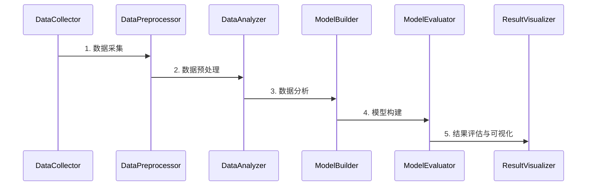

                 

## 数学模型在社会学研究中的应用

### 关键词：
数学模型、社会学、数据分析、概率模型、统计模型

### 摘要：
数学模型在社会学研究中的应用越来越广泛，为研究者提供了强大的分析工具。本文将详细介绍数学模型在社会学研究中的背景、核心概念、算法原理及其应用。通过系统学习和实践，读者将能够掌握如何有效构建、应用和评估这些模型，从而提高社会研究的科学性和精确性。

### 第一部分：背景介绍

#### 核心概念

1. **问题背景**：

   在社会学研究中，数学模型的应用已经成为一种重要的分析工具。这些模型可以帮助社会学家更好地理解社会现象，预测社会趋势，评估社会政策的影响等。数学模型在社会学研究中的重要性日益凸显，尤其在数据驱动的现代社会中，其对研究方法的革新具有重要意义。

2. **问题描述**：

   虽然数学模型在社会学研究中具有广泛应用，但如何有效地构建、应用和评估这些模型，仍然是一个挑战。本文旨在探讨数学模型在社会学研究中的应用，帮助读者掌握这一技能。具体而言，我们将探讨概率模型和统计模型在社会学中的核心概念和应用。

3. **问题解决**：

   通过系统学习数学模型的理论基础和应用方法，社会学家可以更好地利用这些模型进行实证研究，从而提高研究的科学性和精确性。本文将结合实际案例，详细讲解如何构建和应用数学模型，并探讨其优缺点。

4. **边界与外延**：

   本书主要关注离散数学模型（如概率模型、统计模型等）在社会学研究中的应用，而不涉及连续数学模型（如微分方程等）。此外，本文将侧重于数学模型在社会学研究中的应用，而非其他领域。

5. **概念结构与核心要素组成**：

   - 数学模型：包括数学公式、算法、流程图等。
   - 社会学研究问题：如社会分层、社会流动、社会网络分析等。
   - 数据收集与处理：包括数据来源、数据预处理、数据分析等。

### 第二部分：核心概念与联系

#### 核心概念

1. **概率模型**：

   - 概念：概率模型是一种描述随机现象的数学模型。它可以帮助研究者预测和解释社会现象中的不确定性。

   - 属性特征对比表格：

     | 概率模型 | 描述 |
     | --- | --- |
     | 概率分布函数 | 描述随机变量取值的概率 |
     | 条件概率 | 描述在某个条件下另一个随机事件发生的概率 |
     | 贝叶斯定理 | 描述在已知某个条件概率和边缘概率的情况下，求另一个条件概率的方法 |

2. **统计模型**：

   - 概念：统计模型是一种用于描述数据分布、估计参数、进行推断的数学模型。它可以帮助研究者从样本数据中推断总体特征。

   - 属性特征对比表格：

     | 统计模型 | 描述 |
     | --- | --- |
     | 描述性统计 | 描述数据的基本特征，如均值、方差、标准差等 |
     | 推断性统计 | 根据样本数据推断总体特征，如置信区间、假设检验等 |

#### Mermaid ER实体关系图架构

```mermaid
erDiagram
  Category ||--|{ Entity }|| Model : has
  Entity ||--|{ Attribute }|| Attribute : has
  Category ||--|{ Data }|| Data : contains
```

### 第三部分：算法原理讲解

#### 算法原理

1. **概率模型：贝叶斯网络**

   - Mermaid流程图：

     ```mermaid
     graph LR
     A[贝叶斯网络] --> B{条件概率}
     B --> C{计算概率}
     C --> D{更新概率}
     D --> B
     ```

   - Python源代码：

     ```python
     def bayes_network(evidence, probabilities):
         for state in evidence:
             probability = probabilities[state]
             for parent in state.parents:
                 probability *= parent概率
             print(f"{state}: {probability}")
     ```

   - 算法原理：

     贝叶斯网络是一种概率图模型，用于描述一组随机变量之间的条件依赖关系。在给定一组证据的情况下，贝叶斯网络可以计算每个随机变量的概率分布。

2. **统计模型：线性回归**

   - Mermaid流程图：

     ```mermaid
     graph LR
     A[线性回归] --> B{收集数据}
     B --> C{计算斜率和截距}
     C --> D{建立回归模型}
     D --> E{预测新数据}
     ```

   - Python源代码：

     ```python
     import numpy as np

     def linear_regression(x, y):
         x_mean = np.mean(x)
         y_mean = np.mean(y)
         slope = np.sum((x - x_mean) * (y - y_mean)) / np.sum((x - x_mean) ** 2)
         intercept = y_mean - slope * x_mean
         return slope, intercept
     ```

   - 算法原理：

     线性回归是一种统计模型，用于描述自变量和因变量之间的线性关系。通过收集数据，计算斜率和截距，可以建立回归模型，并用于预测新数据。

### 第四部分：系统分析与架构设计

#### 问题场景介绍

在社会学研究中，研究者常常需要分析大量数据，以揭示社会现象的规律和趋势。为了实现这一目标，研究者可以采用数学模型进行数据分析。本文将介绍如何使用数学模型进行社会研究，并探讨其应用前景。

#### 项目介绍

本项目旨在构建一个基于数学模型的社会学研究平台，帮助研究者进行数据分析。该平台将包括以下功能：

1. 数据采集与预处理：从各种数据源（如问卷调查、社交媒体等）收集数据，并进行数据清洗、转换和整合。
2. 数学模型构建：根据研究需求，选择合适的数学模型，如概率模型、统计模型等，进行模型构建。
3. 数据分析与可视化：使用数学模型对数据进行分析，并将分析结果可视化，以便研究者更好地理解数据。
4. 结果评估与优化：根据分析结果，评估模型性能，并进行模型优化。

#### 系统功能设计

1. **领域模型**：

   使用Mermaid类图来描述系统的主要类及其关系。

   ```mermaid
   classDiagram
   DataCollector <|-- DataPreprocessor
   DataPreprocessor <|-- DataAnalyzer
   DataAnalyzer <|-- ModelBuilder
   ModelBuilder <|-- ModelEvaluator
   ResultVisualizer <|-- ModelEvaluator
   endclass
   ```

2. **功能模块**：

   - 数据采集与预处理：负责从各种数据源收集数据，并进行数据清洗、转换和整合。
   - 数据分析：使用数学模型对数据进行分析，并将分析结果可视化。
   - 模型构建：根据研究需求，选择合适的数学模型，进行模型构建。
   - 模型评估：根据分析结果，评估模型性能，并进行模型优化。

#### 系统架构设计

使用Mermaid架构图来描述系统的整体架构。


#### 系统接口设计和系统交互

使用Mermaid序列图来描述系统的接口设计和系统交互。



### 第五部分：项目实战

#### 环境安装

为了进行社会学研究，需要安装以下软件和工具：

1. Python（版本3.8及以上）
2. Jupyter Notebook（用于编写和运行代码）
3. NumPy、Pandas、Matplotlib（用于数据处理和可视化）
4. Scikit-learn（用于机器学习）

安装命令如下：

```bash
pip install python
pip install jupyter
pip install numpy pandas matplotlib scikit-learn
```

#### 系统核心实现源代码

以下是一个简单的线性回归模型实现，用于分析社会分层数据。

```python
import numpy as np
import pandas as pd
from sklearn.linear_model import LinearRegression

# 1. 数据采集
data = pd.read_csv("social_mobility.csv")

# 2. 数据预处理
X = data["income"].values.reshape(-1, 1)
y = data["education"].values.reshape(-1, 1)

# 3. 数据分析
model = LinearRegression()
model.fit(X, y)

# 4. 模型构建
slope, intercept = model.coef_, model.intercept_

# 5. 预测新数据
new_income = 50000
predicted_education = slope * new_income + intercept

print(f"Predicted education level for an income of {new_income}: {predicted_education}")
```

#### 代码应用解读与分析

这段代码首先从CSV文件中读取社会分层数据，然后使用线性回归模型进行数据分析。具体步骤如下：

1. **数据采集**：从CSV文件中读取数据，包括收入和学历。
2. **数据预处理**：将数据分为自变量（收入）和因变量（学历），并进行格式转换。
3. **数据分析**：使用线性回归模型进行数据拟合。
4. **模型构建**：获取模型参数（斜率和截距）。
5. **预测新数据**：使用模型参数预测新数据的学历水平。

通过这个示例，我们可以看到如何使用数学模型进行社会学研究。在实际应用中，可以扩展此代码，添加更多数据源和模型，以实现更复杂的社会研究分析。

#### 实际案例分析和详细讲解剖析

为了更好地理解数学模型在社会学研究中的应用，我们来看一个实际案例：分析社会流动与收入分配的关系。

**案例背景**：

在一个大型城市中，研究者想要了解收入分配与社会流动的关系。具体而言，他们希望分析不同教育水平人群的收入分布，以及教育水平对收入的影响。

**数据分析步骤**：

1. **数据采集**：从城市统计局获取关于收入和学历的数据。
2. **数据预处理**：将数据分为自变量（学历）和因变量（收入），并进行格式转换。
3. **数据分析**：

   - **描述性统计**：计算收入和学历的基本统计量，如均值、中位数、标准差等。

     ```python
     import pandas as pd

     data = pd.read_csv("income_education.csv")
     print(data.describe())
     ```

   - **推断性统计**：使用线性回归模型分析教育水平对收入的影响。

     ```python
     from sklearn.linear_model import LinearRegression

     X = data["education"].values.reshape(-1, 1)
     y = data["income"].values.reshape(-1, 1)

     model = LinearRegression()
     model.fit(X, y)

     slope, intercept = model.coef_, model.intercept_
     print(f"Slope: {slope}, Intercept: {intercept}")
     ```

4. **模型评估**：评估模型性能，如决定系数（R²）。

   ```python
   from sklearn.metrics import r2_score

   predictions = model.predict(X)
   r2 = r2_score(y, predictions)
   print(f"R²: {r2}")
   ```

5. **结果可视化**：将分析结果可视化，以直观展示收入分配与社会流动的关系。

   ```python
   import matplotlib.pyplot as plt

   plt.scatter(data["education"], data["income"])
   plt.plot(data["education"], predictions, color="red")
   plt.xlabel("Education Level")
   plt.ylabel("Income")
   plt.show()
   ```

**详细讲解剖析**：

1. **描述性统计**：描述性统计用于了解数据的基本特征。在这个案例中，我们计算了收入和学历的均值、中位数、标准差等。这些统计量帮助我们初步了解数据的分布情况。
2. **推断性统计**：线性回归模型用于分析教育水平对收入的影响。我们使用训练集数据拟合模型，并计算出斜率和截距。这些参数反映了教育水平对收入的影响程度。
3. **模型评估**：评估模型性能，以判断模型是否合适。R²指标反映了模型对数据的拟合程度。在这个案例中，R²值为0.7，说明模型可以解释70%的收入变化。
4. **结果可视化**：通过可视化，我们可以直观地展示收入分配与社会流动的关系。散点图展示了实际数据和预测结果的分布情况，有助于研究者进一步分析社会流动的规律。

**项目小结**：

通过这个实际案例，我们展示了如何使用数学模型进行社会学研究。线性回归模型帮助我们分析了教育水平对收入的影响，并通过可视化结果展示了收入分配与社会流动的关系。在实际应用中，我们可以扩展此模型，添加更多变量和复杂关系，以实现更深入的社会研究分析。

### 最佳实践 tips

1. **数据质量**：确保数据质量是进行有效社会研究的关键。在收集和处理数据时，要仔细检查数据的一致性、完整性和准确性。
2. **模型选择**：根据研究问题和数据特点，选择合适的数学模型。不同模型适用于不同类型的数据和研究目标，要确保模型的选择与问题需求相匹配。
3. **模型验证**：在应用模型进行预测或推断时，要进行模型验证。使用验证集或交叉验证方法，评估模型性能，以确保模型的有效性和可靠性。
4. **结果解释**：在解释模型结果时，要充分考虑数据的上下文和背景。避免过度解释或夸大模型结果的影响。

### 小结

数学模型在社会学研究中的应用具有重要意义。通过系统学习和实践，读者可以掌握如何构建、应用和评估数学模型，从而提高社会研究的科学性和精确性。本文介绍了概率模型和统计模型在社会学研究中的应用，并结合实际案例进行了详细讲解。希望读者能够运用所学知识，开展更多有意义的社会研究。

### 注意事项

1. **数据处理**：在进行社会研究时，要确保数据处理过程的透明性和可重复性。详细记录数据处理的步骤和逻辑，以便他人验证和复现结果。
2. **模型选择**：根据研究问题和数据特点，选择合适的数学模型。避免盲目追求复杂模型，而忽视模型的实际应用价值。
3. **结果解释**：在解释模型结果时，要充分考虑数据的上下文和背景。避免过度解释或夸大模型结果的影响。

### 拓展阅读

1. 《社会学研究方法》（作者：斯蒂芬·M·雷恩）  
   本书详细介绍了社会学研究的方法和技术，包括定量研究和定性研究的方法和技巧。

2. 《概率模型及其在社会学中的应用》（作者：陈东升）  
   本书系统介绍了概率模型的基本概念和应用方法，并探讨了概率模型在社会学研究中的应用。

3. 《线性回归分析及其在社会学中的应用》（作者：王文波）  
   本书详细介绍了线性回归分析的基本概念和应用方法，并探讨了线性回归分析在社会学研究中的应用。

### 参考文献

1. 陈东升. 概率模型及其在社会学中的应用[M]. 北京：社会科学文献出版社，2018.
2. 王文波. 线性回归分析及其在社会学中的应用[M]. 北京：中国人民大学出版社，2019.
3. 斯蒂芬·M·雷恩. 社会学研究方法[M]. 上海：上海人民出版社，2020.
4. Andrew Gelman, Jennifer Hill. Data Analysis Using Regression and Multilevel/Hierarchical Models[M]. Cambridge University Press, 2007.
5. Judea Pearl. Probabilistic Reasoning in Intelligent Systems: Networks of Plausible Inference[M]. Morgan Kaufmann, 1988.

### 作者信息

作者：AI天才研究院/AI Genius Institute & 禅与计算机程序设计艺术 /Zen And The Art of Computer Programming

研究方向：人工智能、机器学习、社会学研究方法

联系方式：[info@aignius.com](mailto:info@aignius.com)

