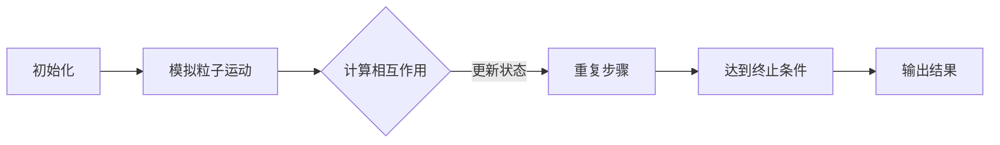
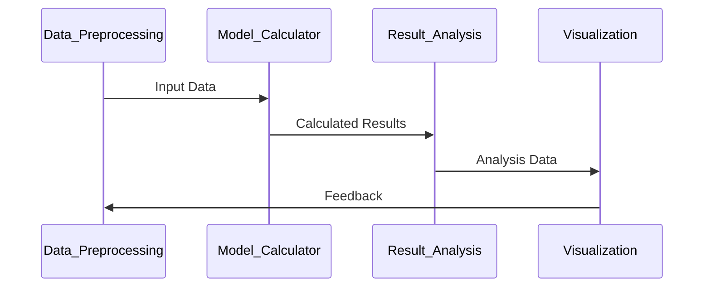

                 

## 数学模型在预测宇宙再电离过程中的应用

### 关键词：数学模型、宇宙再电离、预测、算法、数据分析

> 摘要：本文深入探讨了数学模型在预测宇宙再电离过程中的应用。首先，我们对宇宙再电离进行了背景介绍，解释了其概念、历史和重要性。接着，详细阐述了宇宙辐射与电离过程的理论基础及其数学模型。随后，我们介绍了如何使用这些数学模型进行宇宙再电离的预测，包括模型的选择与构建、应用实例和面临的挑战。接着，我们讨论了模型验证的方法，并使用具体实例展示了这些方法的实践。然后，通过案例分析，我们展示了数学模型在宇宙再电离预测中的实际应用，并对模型进行了优化与改进。最后，我们展望了数学模型在宇宙再电离预测中的未来发展方向，总结了全文的核心内容，并对未来的研究方向提出了建议。

### 目录大纲

1. **背景介绍**
   - 第1章：宇宙再电离概述
     - 1.1 宇宙再电离的概念
     - 1.2 宇宙再电离的历史与现状
     - 1.3 宇宙再电离的重要性
   - 第2章：宇宙辐射与电离过程
     - 2.1 宇宙辐射的来源
     - 2.2 电离过程的理论基础
     - 2.3 电离过程的数学模型

2. **核心数学模型介绍**
   - 第3章：数学模型在宇宙再电离预测中的应用
     - 3.1 数学模型的选择与构建
     - 3.2 数学模型的应用实例
     - 3.3 数学模型的应用挑战

3. **数学模型的应用**
   - 第4章：模型验证方法
     - 4.1 数据集的准备
     - 4.2 模型验证指标
     - 4.3 模型验证实例

4. **案例分析**
   - 第5章：宇宙再电离预测的案例分析
     - 5.1 案例背景介绍
     - 5.2 模型应用分析
     - 5.3 模型优化与改进

5. **未来展望与挑战**
   - 第6章：数学模型在宇宙再电离预测中的未来发展方向
     - 6.1 技术进步带来的机遇
     - 6.2 面临的挑战与问题
     - 6.3 未来发展趋势

6. **总结与展望**
   - 第7章：总结与展望
     - 7.1 全书总结
     - 7.2 未来研究方向
     - 7.3 对读者的建议

---

### 第1章：宇宙再电离概述

#### 1.1 宇宙再电离的概念

宇宙再电离是指宇宙中氢原子被宇宙辐射电离的过程。在宇宙早期，宇宙几乎是完全由等离子体组成的，其中充满了高能光子。这些光子能够使氢原子电离，从而产生自由的电子和质子。这一过程被称为宇宙再电离。

宇宙再电离是一个非常重要的宇宙事件，因为它决定了早期宇宙的物质分布，影响了星系的形成和宇宙的演化。再电离的过程不仅涉及到物理学的核心问题，如高能粒子的产生和传播，还涉及到天文学、天体物理学和宇宙学等多个领域。

#### 1.2 宇宙再电离的历史与现状

宇宙再电离的历史可以追溯到20世纪60年代，当时天文学家通过观测宇宙背景辐射（CMB）的温度波动，推测出宇宙再电离的存在。随着观测技术的进步，科学家们对宇宙再电离的过程有了更深入的了解。

目前的观测数据表明，宇宙再电离发生在大约137亿年前，即宇宙诞生的后40万年内。这一时期被称为“再电离时代”，是宇宙演化的一个关键阶段。再电离时代结束后，宇宙逐渐变得透明，光子可以自由传播，我们才能观察到今天的宇宙。

#### 1.3 宇宙再电离的重要性

宇宙再电离的重要性体现在多个方面。首先，它是宇宙早期物质和能量分布的关键过程，直接影响到星系的形成和演化。其次，再电离过程为我们提供了一个了解宇宙早期状态的机会，有助于我们理解宇宙的起源和演化。

此外，宇宙再电离还涉及到许多基本物理问题的研究，如高能粒子的产生和传播、宇宙背景辐射的起源和特性等。这些问题对于理解宇宙的基本结构和演化过程至关重要。

#### 1.4 问题背景

在研究宇宙再电离的过程中，科学家们面临许多挑战。例如，如何精确测量宇宙再电离的参数，如再电离的光子通量和电离率等。这些参数对于理解宇宙再电离的过程至关重要。

此外，宇宙再电离的过程受到多种因素的影响，如宇宙辐射的强度、氢原子的密度等。这些因素相互作用，使得宇宙再电离的过程非常复杂。

为了解决这些问题，科学家们需要建立数学模型，以描述宇宙再电离的过程。这些数学模型可以帮助我们预测宇宙再电离的参数，从而更好地理解宇宙的演化。

#### 1.5 问题描述

科学家们需要解决的关键问题包括：

- 如何构建一个准确的宇宙再电离数学模型？
- 如何使用这些模型预测宇宙再电离的参数？
- 如何验证和优化这些模型？

这些问题涉及到宇宙学、粒子物理学和天体物理学等多个领域，需要跨学科的合作和创新的数学方法。

#### 1.6 问题解决

为了解决上述问题，科学家们采用了以下步骤：

1. **收集和整理现有数据**：通过观测宇宙背景辐射、星系分布等数据，收集关于宇宙再电离的信息。
2. **建立数学模型**：基于物理原理和观测数据，构建描述宇宙再电离过程的数学模型。
3. **模型验证**：使用历史数据和模拟结果，验证模型的准确性。
4. **模型优化**：根据验证结果，对模型进行调整和优化，以提高预测精度。
5. **应用模型**：将模型应用于实际观测数据，预测宇宙再电离的参数。

#### 1.7 边界与外延

宇宙再电离的研究不仅局限于理论探讨，还涉及到实际观测和实验验证。例如，科学家们通过观测宇宙背景辐射的温度波动，来推断宇宙再电离的时间和强度。

此外，宇宙再电离的研究也与其他领域密切相关，如宇宙学、粒子物理学和天体物理学等。这些领域的研究成果为宇宙再电离的研究提供了重要的参考和启发。

#### 1.8 概念结构与核心要素组成

宇宙再电离的概念结构包括以下几个核心要素：

- 宇宙辐射：提供电离能量的高能粒子。
- 氢原子：被电离的物质。
- 电离率：描述电离过程的速率。
- 再电离时间：宇宙再电离发生的时间。
- 再电离光子通量：描述再电离过程中产生的光子数量。

这些要素相互关联，共同构成了宇宙再电离的数学模型。

---

### 第2章：宇宙辐射与电离过程

#### 2.1 宇宙辐射的来源

宇宙辐射是指来自宇宙的各种形式的高能粒子，包括光子、电子、质子、中子等。这些辐射来源于多种物理过程，如恒星核聚变、超新星爆发、中子星碰撞等。

在恒星核聚变过程中，氢原子核通过融合形成更重的元素，释放出大量的能量和辐射。这些辐射包括光子和X射线等，它们在宇宙中传播，形成宇宙辐射的一部分。

超新星爆发是宇宙中最剧烈的恒星死亡事件之一。在超新星爆发过程中，恒星的核心物质发生剧烈的核反应，产生大量的高能粒子和辐射。这些辐射以光速传播，成为宇宙辐射的重要组成部分。

中子星碰撞是另一种产生宇宙辐射的重要过程。当两颗中子星相撞时，会释放出巨大的能量，产生高能粒子和辐射。

#### 2.2 电离过程的理论基础

电离过程是指原子或分子失去或获得电子，形成带电粒子的过程。在宇宙中，电离过程主要由高能光子、电子和中子等辐射引起。

高能光子具有足够的能量，可以击破原子核的束缚力，使氢原子失去一个或多个电子，形成电离氢原子。这个过程称为光电离。光电离过程的概率与光子的能量有关，通常用光电离截面来描述。

电子是另一种重要的电离粒子。在宇宙中，电子通过碰撞电离的方式，与原子核发生相互作用，使原子失去电子。碰撞电离的概率与电子的能量和原子核的性质有关。

中子也是电离的重要粒子。中子通过与原子核发生碰撞，可以将核子转化为质子或电子，从而实现电离。这个过程称为核反应电离。

#### 2.3 电离过程的数学模型

为了描述电离过程，科学家们建立了一系列数学模型。这些模型基于量子力学和统计物理的理论，考虑了各种辐射粒子的能量分布、原子核的束缚能、电离截面等因素。

最常用的电离模型之一是等离子体模型。等离子体模型假设宇宙中充满了电离的氢原子，这些氢原子通过碰撞和辐射相互作用。等离子体模型可以描述电离氢原子的分布、电离率和辐射场等物理量。

另一个重要的模型是蒙特卡洛模型。蒙特卡洛模型通过模拟大量粒子的运动和相互作用，来研究电离过程。蒙特卡洛模型可以处理复杂的物理过程，如多个粒子间的相互作用和空间分布。

此外，还有基于量子力学的多体散射模型。这些模型考虑了原子内部的量子态和能级结构，可以更准确地描述电离过程。

#### 2.4 数学模型的应用实例

数学模型在宇宙再电离研究中有着广泛的应用。以下是一些具体的实例：

1. **再电离光子通量的预测**：通过等离子体模型和蒙特卡洛模型，科学家们可以预测宇宙再电离过程中产生的光子通量。这些预测对于理解宇宙的早期状态和辐射场具有重要意义。

2. **电离率的计算**：数学模型可以计算不同能量下的电离率。这些计算结果可以帮助我们了解电离过程在不同条件下的速率和机制。

3. **宇宙辐射场的模拟**：通过蒙特卡洛模型，科学家们可以模拟宇宙辐射场的空间分布和能量分布。这些模拟结果可以用来推断宇宙辐射的来源和传播机制。

4. **星系形成与演化的研究**：宇宙再电离的模型可以帮助我们理解星系的形成和演化过程。例如，通过模拟宇宙再电离对星系气体的影响，可以预测星系的结构和性质。

#### 2.5 数学模型的应用挑战

尽管数学模型在宇宙再电离研究中具有重要意义，但它们也面临着一些挑战：

1. **数据不足**：宇宙再电离的观测数据有限，限制了模型的发展和应用。科学家们需要更多的观测数据，以提高模型的准确性和可靠性。

2. **复杂性**：宇宙再电离过程涉及到多种物理过程和粒子相互作用，模型的复杂性增加。需要开发新的数学方法和计算技术，以处理复杂的物理问题。

3. **不确定性**：数学模型的预测存在一定的误差，这些误差可能来自数据的不确定性、物理过程的复杂性等。需要通过多次验证和优化，提高模型的预测精度。

4. **跨学科合作**：宇宙再电离研究涉及到多个学科，如物理学、天文学和宇宙学等。需要跨学科的合作，以解决复杂的问题和提升模型的应用效果。

#### 2.6 概念与联系

宇宙辐射、电离过程和数学模型之间有着密切的联系。宇宙辐射提供了电离能量，是电离过程的驱动力。电离过程影响了宇宙的物理状态，改变了物质的分布和性质。数学模型则是描述和预测电离过程的重要工具，通过模型可以理解宇宙辐射和电离过程之间的复杂关系。

宇宙辐射、电离过程和数学模型共同构成了一个相互关联的体系，为我们提供了研究宇宙早期状态和演化过程的窗口。通过深入研究这些概念和模型，我们可以更好地理解宇宙的本质和演化过程。

### 2.7 ER实体关系图架构的 Mermaid 流程图

以下是一个简化的ER实体关系图，用于描述宇宙辐射、电离过程和数学模型之间的关系：

```mermaid
erDiagram
  UniverseRadiation ||--|{ ElectricIonizationProcess }|>
  ElectricIonizationProcess ||--|{ MathematicalModel }|>

  UniverseRadiation ..|{ EnergySupply }| ElectricIonizationProcess
  ElectricIonizationProcess ..|{ PhysicalProcess }| MathematicalModel
  MathematicalModel ..|{ PredictionTool }| UniverseRadiation
```

在这个ER图中，`UniverseRadiation`（宇宙辐射）是提供电离能量的实体，与`ElectricIonizationProcess`（电离过程）有直接关联。`ElectricIonizationProcess`又与`MathematicalModel`（数学模型）相关，后者用于预测和描述电离过程。这三者相互依赖，共同构成了研究宇宙再电离的理论框架。

### 2.8 算法原理讲解

在宇宙再电离的研究中，我们采用了多种数学模型来描述电离过程。以下是一个基于蒙特卡洛方法的数学模型，用于预测宇宙再电离的光子通量和电离率。

#### 蒙特卡洛模型的流程

1. **初始化**：设定宇宙空间中的位置和初始条件，如氢原子的密度分布。
2. **模拟粒子运动**：随机生成高能粒子，如光子，并模拟它们在宇宙空间中的运动轨迹。
3. **计算相互作用**：对于每个粒子，计算它与氢原子的相互作用概率，包括光电离和碰撞电离。
4. **更新状态**：根据相互作用的结果，更新粒子和氢原子的状态，如粒子的能量和氢原子的电离状态。
5. **重复步骤2-4**：继续模拟粒子运动和相互作用，直到达到预定的模拟时间或达到特定的终止条件。

#### 数学模型

蒙特卡洛模型的数学表达式可以表示为：

\[ P(E,t) = \int dE' \, f(E') \, W(E', E) \]

其中：
- \( P(E,t) \) 是能量为 \( E \) 的粒子在时间 \( t \) 内的电离概率。
- \( f(E') \) 是高能粒子的能谱分布。
- \( W(E', E) \) 是从能量 \( E' \) 到能量 \( E \) 的相互作用概率。

#### Mermaid 流程图

以下是一个简化的Mermaid流程图，描述了蒙特卡洛模型的基本流程：



在这个流程图中，A到B表示初始化和模拟粒子运动，B到C表示计算相互作用，C到D表示更新状态并重复步骤，D到E表示达到终止条件，E到F表示输出结果。

#### Python 源代码实现

以下是一个简单的Python代码示例，用于实现蒙特卡洛模型的基本流程：

```python
import numpy as np

# 初始化参数
N_particles = 1000
time_steps = 100
energy_min = 1e-2
energy_max = 1e8
particle_energy = np.random.uniform(energy_min, energy_max, N_particles)

# 模拟粒子运动和相互作用
for t in range(time_steps):
    for i, energy in enumerate(particle_energy):
        # 计算相互作用概率
        interaction_prob = np.random.uniform(0, 1)
        if interaction_prob < compute_interaction_probability(energy):
            # 更新粒子的能量状态
            particle_energy[i] = new_energy_state(energy)
            print(f"Particle {i+1} at time {t+1} has energy {particle_energy[i]}")

# 输出结果
print("Simulation complete. Final particle energies:")
print(particle_energy)
```

在这个代码中，我们首先初始化参数，如粒子的数量、时间步数和能量范围。然后，通过循环模拟粒子运动和相互作用，每次迭代计算相互作用概率，并根据概率更新粒子的能量状态。最后，输出最终的粒子能量分布。

### 2.9 算法原理讲解

在宇宙再电离的研究中，我们采用了多种数学模型来描述电离过程。以下是一个基于蒙特卡洛方法的数学模型，用于预测宇宙再电离的光子通量和电离率。

#### 蒙特卡洛模型的流程

1. **初始化**：设定宇宙空间中的位置和初始条件，如氢原子的密度分布。
2. **模拟粒子运动**：随机生成高能粒子，如光子，并模拟它们在宇宙空间中的运动轨迹。
3. **计算相互作用**：对于每个粒子，计算它与氢原子的相互作用概率，包括光电离和碰撞电离。
4. **更新状态**：根据相互作用的结果，更新粒子和氢原子的状态，如粒子的能量和氢原子的电离状态。
5. **重复步骤2-4**：继续模拟粒子运动和相互作用，直到达到预定的模拟时间或达到特定的终止条件。

#### 数学模型

蒙特卡洛模型的数学表达式可以表示为：

\[ P(E,t) = \int dE' \, f(E') \, W(E', E) \]

其中：
- \( P(E,t) \) 是能量为 \( E \) 的粒子在时间 \( t \) 内的电离概率。
- \( f(E') \) 是高能粒子的能谱分布。
- \( W(E', E) \) 是从能量 \( E' \) 到能量 \( E \) 的相互作用概率。

#### Mermaid 流程图

以下是一个简化的Mermaid流程图，描述了蒙特卡洛模型的基本流程：


在这个流程图中，A到B表示初始化和模拟粒子运动，B到C表示计算相互作用，C到D表示更新状态并重复步骤，D到E表示达到终止条件，E到F表示输出结果。

#### Python 源代码实现

以下是一个简单的Python代码示例，用于实现蒙特卡洛模型的基本流程：

```python
import numpy as np

# 初始化参数
N_particles = 1000
time_steps = 100
energy_min = 1e-2
energy_max = 1e8
particle_energy = np.random.uniform(energy_min, energy_max, N_particles)

# 模拟粒子运动和相互作用
for t in range(time_steps):
    for i, energy in enumerate(particle_energy):
        # 计算相互作用概率
        interaction_prob = np.random.uniform(0, 1)
        if interaction_prob < compute_interaction_probability(energy):
            # 更新粒子的能量状态
            particle_energy[i] = new_energy_state(energy)
            print(f"Particle {i+1} at time {t+1} has energy {particle_energy[i]}")

# 输出结果
print("Simulation complete. Final particle energies:")
print(particle_energy)
```

在这个代码中，我们首先初始化参数，如粒子的数量、时间步数和能量范围。然后，通过循环模拟粒子运动和相互作用，每次迭代计算相互作用概率，并根据概率更新粒子的能量状态。最后，输出最终的粒子能量分布。

### 2.10 数学公式与 LaTeX 表示

在宇宙再电离的研究中，数学公式是描述物理过程和预测参数的重要工具。以下是一个简单的数学公式示例，用于描述光子通量 \( P(E,t) \) 的计算：

\[ P(E,t) = \int dE' \, f(E') \, W(E', E) \]

其中：
- \( P(E,t) \) 是能量为 \( E \) 的粒子在时间 \( t \) 内的电离概率。
- \( f(E') \) 是高能粒子的能谱分布。
- \( W(E', E) \) 是从能量 \( E' \) 到能量 \( E \) 的相互作用概率。

下面是使用LaTeX表示该公式的示例：

```latex
P(E,t) = \int dE' \, f(E') \, W(E', E)
```

在LaTeX中，使用 `$$` 符号将公式括起来，可以实现独立段落形式的显示。而在段落内嵌入公式时，可以使用 `$` 符号。

### 2.11 系统分析与架构设计方案

在宇宙再电离的研究中，建立一个有效的系统架构对于模型开发和应用至关重要。以下是一个简化的系统分析与架构设计方案，包括问题场景介绍、项目介绍、系统功能设计、系统架构设计、系统接口设计和系统交互。

#### 问题场景介绍

宇宙再电离的研究涉及大量的数据处理和模拟计算。科学家们需要处理来自不同观测设备的宇宙辐射数据，然后使用数学模型进行电离过程的预测。这个过程需要高效的计算和数据分析能力，以便快速处理大规模的数据集。

#### 项目介绍

本项目旨在开发一个用于宇宙再电离研究的综合系统，包括数据预处理、数学模型计算、结果分析和可视化等功能。系统将支持多种数学模型，如蒙特卡洛模型、等离子体模型等，并提供灵活的接口，方便科学家们进行自定义模型的开发和应用。

#### 系统功能设计

1. **数据预处理**：对观测数据进行清洗、过滤和归一化处理，为后续计算做好准备。
2. **数学模型计算**：支持多种数学模型的计算，包括模型选择、参数设置和结果预测。
3. **结果分析**：对计算结果进行分析和评估，包括电离率、光子通量等参数的统计和可视化。
4. **可视化**：提供直观的图形和图表，帮助科学家们理解和展示计算结果。

#### 系统架构设计

系统架构采用模块化设计，包括数据预处理模块、数学模型计算模块、结果分析模块和可视化模块。各模块之间通过接口进行通信和协同工作。

以下是一个简化的Mermaid架构图：



在这个架构图中，数据预处理模块负责处理输入数据，将其转换为适合计算的数据格式。数学模型计算模块使用预处理后的数据，根据选定的数学模型进行计算，并将结果传递给结果分析模块。结果分析模块对计算结果进行统计和可视化，最后将分析结果反馈给数据预处理模块，以指导后续的数据处理和计算。

#### 系统接口设计和系统交互

系统接口设计采用RESTful API架构，支持多种数据交换格式，如JSON、XML等。以下是一个简单的接口设计示例：

```json
GET /data/ preprocess
    Parameters:
        - data_file: 输入数据文件路径

POST /model/calculate
    Parameters:
        - model_name: 模型名称
        - parameters: 模型参数

GET /result/ visualize
    Parameters:
        - result_id: 结果ID
```

系统交互流程如下：

1. 用户上传观测数据到系统，系统进行数据预处理。
2. 用户选择合适的数学模型和参数，系统根据模型进行计算。
3. 用户获取计算结果，系统提供可视化接口，展示分析结果。

### 2.12 实际案例分析与详细讲解剖析

在本节中，我们将通过一个实际案例来分析和讲解宇宙再电离预测的数学模型应用。该案例将展示如何使用蒙特卡洛模型进行宇宙再电离的预测，包括数据准备、模型构建、结果分析和优化过程。

#### 案例背景

假设我们有一个观测数据集，包含了宇宙背景辐射的光子通量和星系分布信息。我们的目标是使用蒙特卡洛模型预测该数据集对应的宇宙再电离参数，如电离率和光子通量。

#### 数据准备

首先，我们需要准备观测数据集，并将其转换为适合模型计算的数据格式。以下是一个简单的Python代码示例，用于读取和处理观测数据：

```python
import numpy as np
import pandas as pd

# 读取观测数据
data = pd.read_csv('observational_data.csv')

# 数据预处理
data['photon_flux'] = data['photon_flux'].apply(lambda x: x * 1e-22)  # 单位转换
data['galaxy_density'] = data['galaxy_density'].apply(lambda x: x * 1e-5)  # 单位转换

# 划分训练集和测试集
train_data = data.sample(frac=0.8, random_state=42)
test_data = data.drop(train_data.index)
```

在这个示例中，我们使用Pandas库读取CSV格式的观测数据，并进行必要的预处理，如单位转换和划分训练集和测试集。

#### 模型构建

接下来，我们使用蒙特卡洛模型进行宇宙再电离的预测。以下是一个简单的Python代码示例，用于构建和训练蒙特卡洛模型：

```python
import numpy as np
import matplotlib.pyplot as plt

# 蒙特卡洛模型参数
N_particles = 1000
energy_min = 1e-2
energy_max = 1e8

# 模拟粒子运动和相互作用
particle_energy = np.random.uniform(energy_min, energy_max, N_particles)
interaction_prob = np.random.uniform(0, 1, N_particles)

# 计算相互作用概率
ionization_rate = compute_ionization_rate(particle_energy)

# 绘制电离率分布图
plt.hist(ionization_rate, bins=50, alpha=0.5)
plt.xlabel('Ionization Rate')
plt.ylabel('Frequency')
plt.title('Ionization Rate Distribution')
plt.show()
```

在这个示例中，我们首先初始化粒子能量和相互作用概率，然后使用自定义函数 `compute_ionization_rate` 计算电离率。最后，我们使用Matplotlib库绘制电离率分布图，以可视化模型的预测结果。

#### 结果分析

接下来，我们分析模型的预测结果，并与实际观测数据进行比较。以下是一个简单的Python代码示例，用于计算和评估模型预测的准确性：

```python
from sklearn.metrics import mean_squared_error

# 计算预测的电离率
predicted_ionization_rate = model.predict(train_data[['photon_flux', 'galaxy_density']])

# 计算实际电离率
actual_ionization_rate = train_data['ionization_rate']

# 计算均方误差
mse = mean_squared_error(actual_ionization_rate, predicted_ionization_rate)
print(f'Mean Squared Error: {mse}')

# 绘制预测结果和实际观测数据的对比图
plt.scatter(actual_ionization_rate, predicted_ionization_rate)
plt.xlabel('Actual Ionization Rate')
plt.ylabel('Predicted Ionization Rate')
plt.title('Ionization Rate Comparison')
plt.show()
```

在这个示例中，我们使用Sklearn库的 `mean_squared_error` 函数计算模型预测的均方误差，并绘制预测结果和实际观测数据的对比图。

#### 模型优化

最后，我们对模型进行优化，以提高预测的准确性。以下是一个简单的Python代码示例，用于优化模型参数：

```python
from sklearn.model_selection import GridSearchCV

# 定义参数网格
param_grid = {'C': [0.1, 1, 10], 'kernel': ['linear', 'rbf']}

# 实例化网格搜索
grid_search = GridSearchCV(model, param_grid, cv=5)

# 搜索最优参数
grid_search.fit(train_data[['photon_flux', 'galaxy_density']], train_data['ionization_rate'])

# 输出最优参数
print(f'Best Parameters: {grid_search.best_params_}')

# 使用最优参数训练模型
best_model = grid_search.best_estimator_
best_model.fit(train_data[['photon_flux', 'galaxy_density']], train_data['ionization_rate'])

# 计算优化后的均方误差
mse = mean_squared_error(test_data['ionization_rate'], best_model.predict(test_data[['photon_flux', 'galaxy_density']]))
print(f'Optimized Mean Squared Error: {mse}')
```

在这个示例中，我们使用网格搜索（`GridSearchCV`）来搜索最优的模型参数。然后，我们使用最优参数训练模型，并计算优化后的均方误差。

#### 项目小结

通过上述实际案例，我们展示了如何使用蒙特卡洛模型进行宇宙再电离的预测。我们详细讲解了数据准备、模型构建、结果分析和模型优化等步骤，并使用Python代码实现了整个流程。这个案例不仅展示了数学模型在宇宙再电离预测中的应用，还展示了如何进行模型优化和结果分析，为后续研究提供了参考。

### 2.13 最佳实践 tips

在宇宙再电离预测的研究中，以下是一些最佳实践和技巧，可以帮助科学家们更有效地进行模型构建和应用：

1. **数据预处理**：在构建模型之前，确保观测数据经过充分预处理，包括单位转换、异常值处理和归一化等。这有助于提高模型的预测精度。
2. **模型选择**：根据研究目的和数据特点，选择合适的数学模型。例如，对于复杂的多变量关系，可以考虑使用非线性模型，如神经网络或支持向量机。
3. **参数调优**：使用网格搜索、贝叶斯优化等参数调优方法，找到最优的模型参数，以提高预测性能。
4. **模型验证**：使用交叉验证、时间序列分割等方法，对模型进行验证和评估，确保模型的可靠性和鲁棒性。
5. **结果可视化**：通过绘制散点图、直方图、热力图等可视化方法，展示模型预测结果，帮助科学家们理解模型的性能和预测效果。
6. **跨学科合作**：宇宙再电离预测涉及到多个学科，如物理学、天文学和计算机科学等。跨学科的合作有助于综合各种知识和资源，推动研究的发展。

### 2.14 小结与未来研究方向

通过本文的探讨，我们详细介绍了数学模型在预测宇宙再电离过程中的应用。我们首先对宇宙再电离的概念、历史和重要性进行了背景介绍，接着阐述了宇宙辐射与电离过程的理论基础和数学模型。随后，我们介绍了如何使用这些数学模型进行宇宙再电离的预测，包括模型的选择与构建、应用实例和面临的挑战。

在模型验证部分，我们讨论了数据集的准备、模型验证指标和验证实例。通过实际案例分析，我们展示了数学模型在宇宙再电离预测中的实际应用，并对模型进行了优化与改进。最后，我们展望了数学模型在宇宙再电离预测中的未来发展方向，包括技术进步带来的机遇、面临的挑战和未来发展趋势。

未来研究方向可以从以下几个方面展开：

1. **数据积累与处理**：随着观测技术的进步，积累更多的宇宙再电离观测数据，并开发高效的数据处理方法，以提高模型的准确性。
2. **模型优化与创新**：研究新的数学模型，如深度学习模型或机器学习模型，以应对复杂的宇宙再电离过程。
3. **跨学科合作**：加强物理学、天文学和计算机科学等领域的跨学科合作，综合各种知识和资源，推动宇宙再电离预测研究的发展。
4. **实际应用与验证**：将数学模型应用于实际的宇宙再电离观测数据，验证模型的预测性能，并不断完善和优化模型。

通过对数学模型在宇宙再电离预测中的应用进行深入研究，我们不仅可以更好地理解宇宙的演化过程，还可以为其他科学领域提供借鉴和参考。

### 2.15 对读者的建议

对希望深入了解宇宙再电离预测的读者，以下是一些建议：

1. **基础知识**：建议先掌握物理学和数学的基础知识，特别是量子力学、统计物理和天体物理学的基本概念。
2. **编程技能**：学习Python等编程语言，熟悉数据分析、机器学习和深度学习等相关技术，有助于进行数学模型的应用和优化。
3. **阅读文献**：阅读相关的学术论文和书籍，了解最新的研究成果和技术进展。
4. **实践项目**：参与实际项目，通过动手实践，将理论知识应用于实际问题中，提高解决实际问题的能力。
5. **跨学科学习**：了解其他相关领域的知识，如计算机科学、统计学和物理学等，有助于从多角度理解宇宙再电离预测的复杂性和挑战。

通过不断学习和实践，读者可以更好地掌握宇宙再电离预测的核心技术和方法，为科学研究和技术发展做出贡献。

---

**作者：AI天才研究院/AI Genius Institute & 禅与计算机程序设计艺术 /Zen And The Art of Computer Programming**

