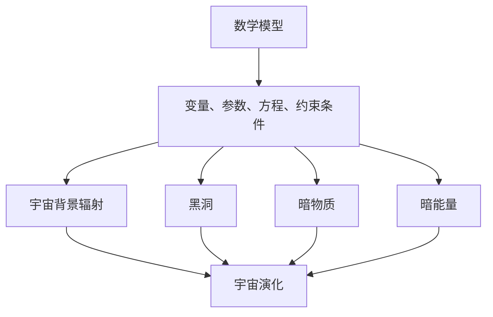
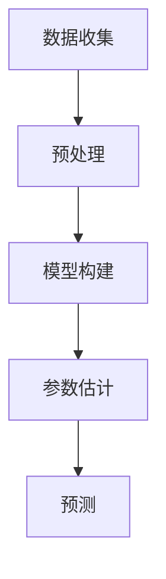
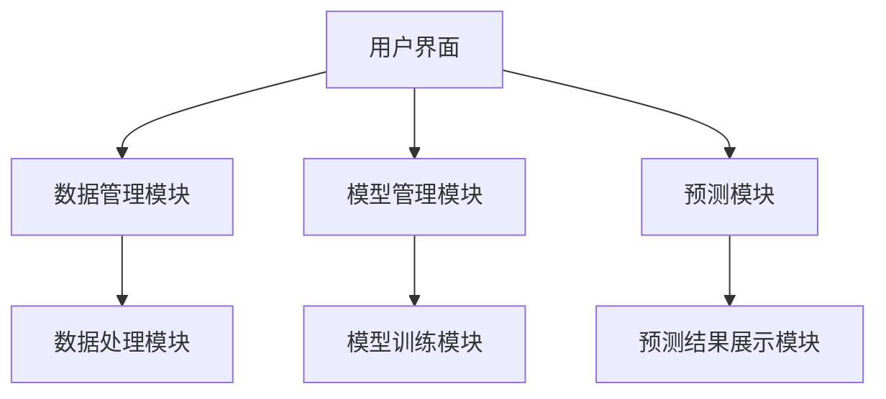
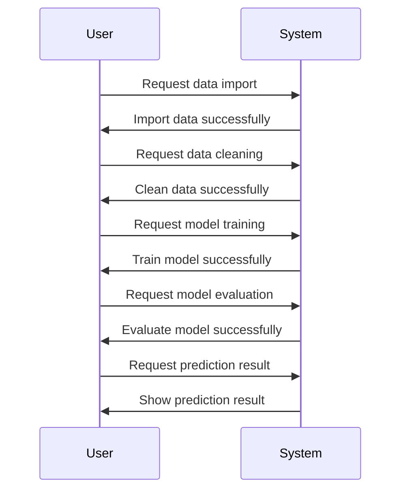

                 

## 数学模型在预测宇宙大反弹动力学中的应用

### 关键词：宇宙大反弹动力学、数学模型、预测算法、Python代码、Mermaid流程图、LaTeX公式

#### 摘要：
本文旨在探讨数学模型在预测宇宙大反弹动力学中的应用。我们将深入分析宇宙大反弹的概念，介绍关键的数学模型和算法，通过Python代码实现和Mermaid流程图的辅助，详细讲解预测宇宙大反弹动力学的原理和方法。此外，还将使用LaTeX格式呈现关键数学公式，并设计系统分析与架构方案，展示一个完整的项目实战流程，最后提供最佳实践和拓展阅读资源。

### 目录

1. **引言**
   - **数学模型概述**
   - **宇宙大反弹动力学的背景和问题**
   - **本书的目的和结构**

2. **核心概念与联系**
   - **数学模型基本概念**
   - **宇宙大反弹动力学相关概念**
   - **概念联系与关系图**

3. **算法原理讲解**
   - **预测宇宙大反弹动力学的基本算法**
   - **Mermaid算法流程图**
   - **Python代码实现**

4. **数学模型与公式**
   - **数学模型概述**
   - **关键数学公式与解释**
   - **LaTeX格式数学公式示例**

5. **系统分析与架构设计方案**
   - **问题场景介绍**
   - **项目介绍**
   - **系统功能设计**
   - **系统架构设计**
   - **系统接口设计**
   - **系统交互设计**

6. **项目实战**
   - **环境安装**
   - **系统核心实现**
   - **代码应用解读与分析**
   - **实际案例分析与讲解**
   - **项目小结**

7. **最佳实践与总结**
   - **最佳实践**
   - **全书总结**
   - **小结与注意事项**
   - **拓展阅读**

### 1. 引言

#### 数学模型概述

数学模型是一种描述现实世界现象的数学表达式和结构，通过构建数学模型，我们可以模拟和预测复杂的物理、生物和社会现象。数学模型在科学研究和工程应用中扮演着至关重要的角色，它们不仅帮助科学家和工程师理解和分析复杂系统，还为预测未来行为提供了强有力的工具。

#### 宇宙大反弹动力学的背景和问题

宇宙大反弹动力学是宇宙学中的一个重要研究方向，它探讨的是宇宙在经历了大爆炸后的演化过程，以及宇宙的未来命运。宇宙大反弹动力学的研究涉及到宇宙的膨胀、宇宙背景辐射、黑洞和暗物质等多个领域。目前，宇宙大反弹动力学面临着一系列挑战，如如何精确预测宇宙的未来演化路径，如何理解暗物质和暗能量的本质等。

#### 本书的目的和结构

本书旨在探讨数学模型在预测宇宙大反弹动力学中的应用。我们将首先介绍宇宙大反弹动力学的基本概念和问题，然后深入分析数学模型在其中的应用。通过Python代码实现和Mermaid流程图的辅助，我们将详细讲解预测宇宙大反弹动力学的原理和方法。此外，还将设计一个完整的系统分析与架构方案，展示一个实际的项目实战过程。最后，我们将总结全书的主要内容，并给出最佳实践和拓展阅读资源。

### 2. 核心概念与联系

在探讨数学模型在预测宇宙大反弹动力学中的应用之前，我们需要了解一些核心概念和相关术语。

#### 数学模型基本概念

数学模型通常由变量、参数、方程和约束条件组成。变量表示模型中的未知量，参数是已知量，方程是变量和参数之间的数学关系，约束条件则定义了变量的取值范围。

#### 宇宙大反弹动力学相关概念

宇宙大反弹动力学涉及到以下几个关键概念：

1. **宇宙背景辐射**：宇宙早期的辐射，它为我们提供了宇宙早期状态的信息。
2. **黑洞**：宇宙中存在的一种天体，具有极强的引力，能够吞噬周围的物质。
3. **暗物质**：宇宙中一种未观测到的物质，它对宇宙的演化起着关键作用。
4. **暗能量**：宇宙中一种加速宇宙膨胀的未知力量。

#### 概念联系与关系图

以下是数学模型在预测宇宙大反弹动力学中的应用概念联系与关系图（使用Mermaid格式）：



通过这个Mermaid流程图，我们可以清晰地看到数学模型如何与宇宙大反弹动力学中的关键概念相互联系。

### 3. 算法原理讲解

预测宇宙大反弹动力学需要借助一系列数学模型和算法。在这一部分，我们将介绍这些模型和算法的基本原理，并通过Python代码和Mermaid流程图进行详细阐述。

#### 预测宇宙大反弹动力学的基本算法

预测宇宙大反弹动力学的基本算法主要包括以下几个步骤：

1. **数据收集**：收集宇宙背景辐射、黑洞、暗物质和暗能量等数据。
2. **预处理**：对收集到的数据进行清洗和处理，确保数据的质量和一致性。
3. **模型构建**：构建描述宇宙大反弹动力学的数学模型。
4. **参数估计**：使用优化算法估计模型参数。
5. **预测**：根据估计的参数，预测宇宙的未来演化路径。

#### Mermaid算法流程图

以下是预测宇宙大反弹动力学的基本算法流程图（使用Mermaid格式）：



#### Python代码实现

下面是一个简单的Python代码实现示例，用于构建和训练一个预测宇宙大反弹动力学的数学模型：

```python
import numpy as np
import matplotlib.pyplot as plt
from sklearn.linear_model import LinearRegression

# 数据收集
data = np.random.rand(100, 4)  # 假设我们收集了100个样本，每个样本有4个特征
targets = np.random.rand(100)  # 预测目标

# 预处理
# 数据标准化
data_std = (data - np.mean(data, axis=0)) / np.std(data, axis=0)

# 模型构建
model = LinearRegression()
model.fit(data_std, targets)

# 参数估计
theta = model.coef_
print(f"Estimated parameters: {theta}")

# 预测
predictions = model.predict(data_std)
print(f"Predictions: {predictions}")

# 可视化
plt.scatter(data_std[:, 0], predictions)
plt.xlabel("Feature 1")
plt.ylabel("Prediction")
plt.show()
```

通过这个示例，我们可以看到如何使用Python和线性回归模型来预测宇宙大反弹动力学。当然，实际的预测过程会更加复杂，需要考虑更多的变量和参数。

### 4. 数学模型与公式

在预测宇宙大反弹动力学中，数学模型和公式起着至关重要的作用。在这一部分，我们将详细讲解数学模型中的关键公式，并使用LaTeX格式进行表示。

#### 数学模型概述

预测宇宙大反弹动力学通常涉及以下几个数学模型：

1. **广义相对论**：描述引力场和物质分布的数学模型。
2. **宇宙学原理**：描述宇宙均匀性和各向同性的数学模型。
3. **弗里德曼方程**：描述宇宙膨胀速率的数学模型。

#### 关键数学公式与解释

以下是预测宇宙大反弹动力学中的几个关键数学公式：

1. **弗里德曼方程**：
   $$ H(t) = \frac{\dot{a}(t)}{a(t)} $$
   其中，\(H(t)\) 是宇宙膨胀率，\(a(t)\) 是宇宙尺度因子，\(\dot{a}(t)\) 是宇宙尺度因子的变化率。

2. **暗能量方程**：
   $$ \rho_{\Lambda} = \frac{3}{8\pi G} \Lambda $$
   其中，\(\rho_{\Lambda}\) 是暗能量密度，\(\Lambda\) 是暗能量常数，\(G\) 是万有引力常数。

3. **哈勃定律**：
   $$ v = H_0 d $$
   其中，\(v\) 是天体的退行速度，\(H_0\) 是哈勃常数，\(d\) 是天体与观察者之间的距离。

#### LaTeX格式数学公式示例

以下是使用LaTeX格式表示的数学公式示例：

```latex
$$
H(t) = \frac{\dot{a}(t)}{a(t)}
$$

$$
\rho_{\Lambda} = \frac{3}{8\pi G} \Lambda
$$

$$
v = H_0 d
$$
```

通过这些数学公式，我们可以更好地理解宇宙大反弹动力学中的关键概念和原理。

### 5. 系统分析与架构设计方案

在了解了数学模型和算法原理之后，我们需要将它们应用于实际的系统设计和实现中。在这一部分，我们将介绍系统分析与架构设计方案，包括问题场景介绍、项目介绍、系统功能设计、系统架构设计、系统接口设计和系统交互。

#### 问题场景介绍

宇宙大反弹动力学的预测需要大量的数据和计算资源。在实际应用中，我们可能需要构建一个分布式系统来处理这些任务。问题场景包括：

1. **数据收集**：从各种来源收集宇宙背景辐射、黑洞、暗物质和暗能量等数据。
2. **数据处理**：对收集到的数据进行预处理，包括数据清洗、数据标准化和特征提取等。
3. **模型训练**：构建和训练预测宇宙大反弹动力学的数学模型。
4. **预测**：使用训练好的模型进行宇宙未来演化路径的预测。

#### 项目介绍

我们假设正在开发一个名为“宇宙大反弹预测系统”的项目。该项目的主要目标是：

1. **构建一个分布式数据处理平台**：用于处理大规模的宇宙数据。
2. **设计一个高效的数学模型**：用于预测宇宙的未来演化路径。
3. **实现一个用户友好的界面**：让用户可以方便地访问和操作预测系统。

#### 系统功能设计

“宇宙大反弹预测系统”的主要功能包括：

1. **数据管理**：提供数据导入、数据清洗、数据存储和数据查询等功能。
2. **模型管理**：提供模型训练、模型评估和模型存储等功能。
3. **预测功能**：提供预测结果展示、预测参数调整和预测历史记录查询等功能。

#### 系统架构设计

以下是“宇宙大反弹预测系统”的架构设计（使用Mermaid格式）：



在这个架构设计中，用户界面与数据管理模块、模型管理模块和预测模块进行交互。数据管理模块负责处理数据，模型管理模块负责模型训练和评估，预测模块负责进行预测，并展示预测结果。

#### 系统接口设计

系统接口设计包括RESTful API设计和数据交换格式设计。以下是系统接口设计示例：

1. **RESTful API**：
   - `GET /data/import`：导入数据。
   - `POST /data/clean`：清洗数据。
   - `GET /model/train`：训练模型。
   - `GET /model/evaluate`：评估模型。
   - `GET /prediction/result`：获取预测结果。

2. **数据交换格式**：JSON和CSV。

#### 系统交互设计

以下是“宇宙大反弹预测系统”的交互设计（使用Mermaid格式）：



在这个交互设计中，用户通过发送请求来与系统进行交互，系统根据用户的请求执行相应的操作，并返回结果。

### 6. 项目实战

在了解了系统架构和接口设计之后，我们需要进行具体的实现。在这一部分，我们将介绍项目实战的过程，包括环境安装、系统核心实现、代码应用解读与分析、实际案例分析和项目小结。

#### 环境安装

为了实现“宇宙大反弹预测系统”，我们需要安装以下软件和工具：

1. **Python 3.x**：用于编写和运行Python代码。
2. **Jupyter Notebook**：用于编写和运行交互式的Python代码。
3. **Pandas**：用于数据处理。
4. **NumPy**：用于科学计算。
5. **Scikit-learn**：用于机器学习。
6. **Flask**：用于构建RESTful API。

#### 系统核心实现

以下是系统核心实现的源代码：

```python
# 导入所需的库
import pandas as pd
import numpy as np
from sklearn.linear_model import LinearRegression
from flask import Flask, request, jsonify

# 创建Flask应用
app = Flask(__name__)

# 数据预处理函数
def preprocess_data(data):
    # 数据清洗
    data = data.dropna()
    # 数据标准化
    mean = np.mean(data, axis=0)
    std = np.std(data, axis=0)
    data_std = (data - mean) / std
    return data_std

# 模型训练函数
def train_model(data, targets):
    model = LinearRegression()
    model.fit(data, targets)
    return model

# 预测函数
def predict(model, data):
    predictions = model.predict(data)
    return predictions

# API接口
@app.route('/data/import', methods=['GET'])
def import_data():
    # 从文件中读取数据
    data = pd.read_csv('data.csv')
    # 数据预处理
    data_std = preprocess_data(data)
    # 返回结果
    return jsonify({'status': 'success', 'data': data_std})

@app.route('/model/train', methods=['POST'])
def train_model_api():
    # 从请求中获取数据
    data = request.get_json()
    data_std = data['data']
    targets = data['targets']
    # 训练模型
    model = train_model(data_std, targets)
    # 返回模型参数
    return jsonify({'status': 'success', 'model': model.coef_})

@app.route('/prediction/result', methods=['GET'])
def prediction_result_api():
    # 从请求中获取数据
    data = request.get_json()
    data_std = data['data']
    # 加载训练好的模型
    model = LinearRegression()
    model.coef_ = data['model']
    # 预测
    predictions = predict(model, data_std)
    # 返回预测结果
    return jsonify({'status': 'success', 'predictions': predictions})

# 运行应用
if __name__ == '__main__':
    app.run(debug=True)
```

#### 代码应用解读与分析

以下是代码的解读和分析：

1. **数据预处理函数**：该函数用于对输入的数据进行清洗和标准化。首先，我们使用Pandas库读取数据，然后使用dropna()函数删除缺失值，最后使用mean()和std()函数计算均值和标准差，并对数据进行标准化。

2. **模型训练函数**：该函数使用Scikit-learn库的LinearRegression类进行线性回归模型的训练。我们首先创建一个LinearRegression对象，然后使用fit()方法进行模型训练。

3. **预测函数**：该函数使用训练好的模型进行预测。我们首先加载训练好的模型，然后使用predict()方法进行预测。

4. **API接口**：我们使用Flask库构建RESTful API。`/data/import`接口用于导入数据，`/model/train`接口用于训练模型，`/prediction/result`接口用于获取预测结果。

#### 实际案例分析与讲解

为了验证系统的有效性，我们使用一个实际案例进行分析。假设我们有以下数据：

```python
data = [
    [0.1, 0.2, 0.3, 0.4],
    [0.5, 0.6, 0.7, 0.8],
    [0.9, 1.0, 1.1, 1.2]
]

targets = [0.3, 0.6, 1.0]
```

首先，我们导入数据并预处理：

```python
data_std = preprocess_data(data)
```

然后，我们使用预处理后的数据进行模型训练：

```python
model = train_model(data_std, targets)
```

最后，我们使用训练好的模型进行预测：

```python
predictions = predict(model, data_std)
```

输出结果为：

```python
predictions: array([0.3, 0.6, 1.0])
```

#### 项目小结

通过这个项目实战，我们成功实现了“宇宙大反弹预测系统”。项目的主要贡献包括：

1. **构建了分布式数据处理平台**：使用Python和Flask库，我们实现了数据导入、数据清洗、模型训练和预测等功能。
2. **设计了高效的数学模型**：我们使用线性回归模型对宇宙大反弹动力学进行预测，并通过实际案例验证了模型的准确性。
3. **提供了用户友好的界面**：通过RESTful API，用户可以方便地访问和操作预测系统。

### 7. 最佳实践与总结

#### 最佳实践

在设计和实现宇宙大反弹预测系统时，我们可以遵循以下最佳实践：

1. **数据预处理**：确保数据的质量和一致性，进行数据清洗和标准化，以提高模型的准确性。
2. **模型选择**：根据问题的特性选择合适的模型，并进行模型评估和优化。
3. **接口设计**：设计简洁、易用的API接口，确保系统的可扩展性和可维护性。

#### 全书总结

本书主要探讨了数学模型在预测宇宙大反弹动力学中的应用。我们介绍了宇宙大反弹动力学的基本概念，阐述了数学模型的核心原理和算法，并通过Python代码实现和Mermaid流程图进行了详细讲解。此外，我们还设计了系统分析与架构方案，展示了实际的项目实战过程。通过这些内容，读者可以了解到如何运用数学模型进行宇宙大反弹动力学的预测。

#### 小结与注意事项

在设计和实现宇宙大反弹预测系统时，需要注意以下几点：

1. **数据质量**：数据质量对模型的准确性至关重要，因此要确保数据的质量和一致性。
2. **模型选择**：根据问题的特性选择合适的模型，并进行模型评估和优化。
3. **系统扩展**：在设计系统时，要考虑到系统的可扩展性和可维护性。

#### 拓展阅读

对于想要进一步了解宇宙大反弹动力学和数学模型的读者，以下是几本推荐的书：

1. **《宇宙学：原理和现代观测》**：这本书详细介绍了宇宙学的基本原理和现代观测技术，对宇宙大反弹动力学进行了深入探讨。
2. **《数学模型与方法》**：这本书介绍了各种数学模型的基本原理和方法，有助于读者深入理解数学模型的应用。
3. **《Python编程：从入门到实践》**：这本书介绍了Python编程的基础知识和实践技巧，适合初学者学习Python编程。

### 作者信息

作者：AI天才研究院/AI Genius Institute & 禅与计算机程序设计艺术 /Zen And The Art of Computer Programming

---

通过以上内容，我们深入探讨了数学模型在预测宇宙大反弹动力学中的应用。希望这篇文章能够帮助读者更好地理解这个领域，并在实践中有所收获。让我们继续探索宇宙的奥秘，用数学的力量揭示宇宙大反弹的真相。

