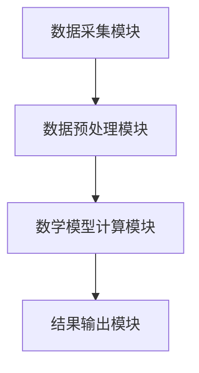
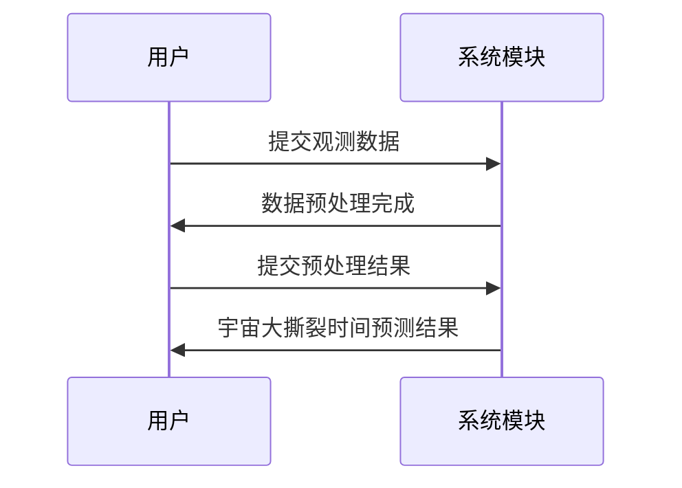
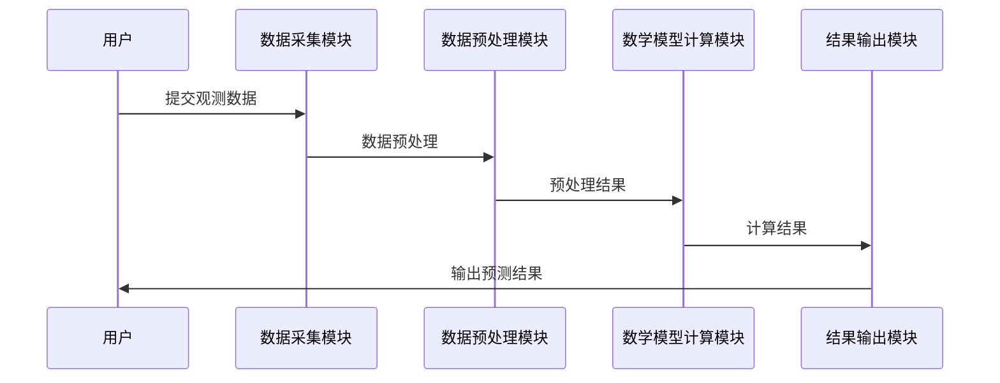

                 

### 文章标题：数学模型在预测宇宙大撕裂时间尺度中的应用

关键词：宇宙大撕裂、数学模型、预测、时间尺度、宇宙膨胀

摘要：本文探讨了数学模型在预测宇宙大撕裂时间尺度中的应用。通过介绍宇宙大撕裂的背景、核心概念、数学模型原理，以及系统分析与架构设计方案，本文系统地阐述了如何运用数学模型预测宇宙大撕裂的时间尺度，为理解宇宙的演化过程和探索宇宙的终极命运提供了新的思路。

----------------------------------------------------------------

## 第一部分：引言

### 1.1 问题背景

#### 1.1.1 宇宙大撕裂的假设

宇宙大撕裂是理论物理中的一种假说，认为在宇宙膨胀的过程中，某些条件可能会导致宇宙加速膨胀，最终导致宇宙的撕裂。这一假说起源于对宇宙膨胀现象的深入研究，随着对宇宙学数据的不断积累，科学家们逐渐认识到宇宙膨胀的潜在威胁。

宇宙大撕裂的物理机制尚不明确，但一种可能的解释是：在宇宙膨胀的过程中，宇宙中的物质和能量逐渐分散，导致引力无法再束缚这些分散的粒子。当宇宙膨胀到一定程度时，引力将不足以维持宇宙的稳定结构，从而引发大撕裂。

#### 1.1.2 预测宇宙大撕裂时间尺度的意义

预测宇宙大撕裂的时间尺度对于理解宇宙的演化过程、探索宇宙的终极命运具有重要意义。一方面，它有助于我们了解宇宙的稳定性和可观测性；另一方面，它也为物理学的理论发展提供了新的方向。

#### 1.1.3 宇宙大撕裂的挑战

尽管宇宙大撕裂的假说引起了科学家的极大兴趣，但预测其时间尺度面临着诸多挑战。首先，宇宙大撕裂的机制尚不明确，这使得建立准确的数学模型变得复杂。其次，宇宙膨胀的过程极其缓慢，导致预测时间尺度需要极长的时间跨度。此外，宇宙中的复杂性和不确定性也使得预测变得困难。

### 1.2 核心概念与联系

#### 1.2.1 数学模型

数学模型是描述现实世界问题的一种抽象方法，它通过数学语言来描述问题的各个方面。在预测宇宙大撕裂时间尺度的研究中，数学模型起到了至关重要的作用。

数学模型的特点包括：

- **精确性**：数学模型可以精确地描述问题，减少误差。
- **普遍性**：数学模型可以应用于不同领域的问题。

#### 1.2.2 数学模型与宇宙大撕裂预测的联系

- **宇宙学模型**：宇宙学模型是一种特殊的数学模型，用于描述宇宙的膨胀、结构形成等过程。它可以帮助我们预测宇宙大撕裂的时间尺度。

宇宙学模型主要包括以下几个部分：

- **宇宙膨胀模型**：描述宇宙膨胀的规律和特征。
- **宇宙结构模型**：描述宇宙中星系、星云等结构的形成和演化。
- **宇宙微波背景辐射模型**：描述宇宙早期的热状态和演化过程。

#### 1.2.3 数学模型在宇宙大撕裂预测中的应用

数学模型在宇宙大撕裂预测中的应用主要体现在两个方面：

- **宇宙膨胀模型**：通过宇宙膨胀模型，我们可以预测宇宙的膨胀速度和演化过程。根据宇宙膨胀模型，宇宙将在未来某个时刻达到临界点，引发大撕裂。
- **宇宙结构模型**：通过宇宙结构模型，我们可以预测宇宙中的物质分布和引力场分布。这些信息对于理解宇宙大撕裂的机制和过程至关重要。

### 1.3 数学模型和数学公式

#### 1.3.1 宇宙膨胀模型

宇宙膨胀模型是描述宇宙膨胀过程的一种数学模型。它主要基于广义相对论和宇宙学原理。以下是一个简单的宇宙膨胀模型的数学公式：

$$
H(t) = \frac{\dot{a}(t)}{a(t)}
$$

其中，$H(t)$ 表示宇宙膨胀率，$\dot{a}(t)$ 表示宇宙体积随时间的变化率，$a(t)$ 表示宇宙体积。

#### 1.3.2 宇宙大撕裂时间的预测

宇宙大撕裂时间可以通过以下数学公式预测：

$$
t_{\text{breakup}} = \frac{1}{\sqrt{2} G N c^2}
$$

其中，$t_{\text{breakup}}$ 表示宇宙大撕裂时间，$G$ 是引力常数，$N$ 是宇宙中的物质数量，$c$ 是光速。

### 1.4 系统分析与架构设计方案

#### 1.4.1 问题场景介绍

宇宙大撕裂的预测需要大量的数据和复杂的计算。因此，我们设计了一个基于云计算的宇宙大撕裂预测系统，以提高计算效率和可靠性。

#### 1.4.2 系统功能设计

##### 1.4.2.1 数据采集

- **天体观测数据**：通过天文望远镜和卫星等设备收集宇宙中的天体观测数据。
- **物理参数计算**：根据观测数据计算宇宙中的物理参数。

##### 1.4.2.2 数学模型计算

- **宇宙膨胀模型**：根据宇宙学模型计算宇宙的膨胀率。
- **宇宙大撕裂时间预测**：根据宇宙膨胀模型预测宇宙大撕裂的时间。

#### 1.4.3 系统架构设计

##### 1.4.3.1 系统架构图

以下是一个简单的宇宙大撕裂预测系统架构图：



##### 1.4.3.2 系统架构说明

- **数据采集模块**：负责收集天体观测数据和物理参数数据。
- **数据预处理模块**：对采集到的数据进行预处理，包括数据清洗、去噪、数据增强等。
- **数学模型计算模块**：根据预处理后的数据，利用宇宙膨胀模型和宇宙大撕裂时间预测公式进行计算。
- **结果输出模块**：将预测结果输出，包括宇宙大撕裂时间预测值、宇宙膨胀率等。

#### 1.4.4 系统接口设计和系统交互

##### 1.4.4.1 接口设计

- **数据采集接口**：用于接收天体观测数据。
- **模型计算接口**：用于接收数据预处理结果，并返回计算结果。
- **结果输出接口**：用于将预测结果输出。

##### 1.4.4.2 系统交互



----------------------------------------------------------------

## 第二部分：数学模型详解

### 2.1 数学模型原理

#### 2.1.1 数学模型概述

数学模型是一种用于描述现实世界问题的一种抽象方法，它通过数学语言来描述问题的各个方面。在预测宇宙大撕裂时间尺度的研究中，数学模型起到了至关重要的作用。

数学模型的特点包括：

- **精确性**：数学模型可以精确地描述问题，减少误差。
- **普遍性**：数学模型可以应用于不同领域的问题。

#### 2.1.2 数学模型的特点

- **精确性**：数学模型可以精确地描述问题，减少误差。
- **普遍性**：数学模型可以应用于不同领域的问题。

#### 2.1.3 数学模型与宇宙大撕裂预测的联系

数学模型与宇宙大撕裂预测的联系主要体现在以下几个方面：

- **宇宙膨胀模型**：宇宙膨胀模型是描述宇宙膨胀过程的一种数学模型。它主要基于广义相对论和宇宙学原理。宇宙膨胀模型可以帮助我们预测宇宙大撕裂的时间尺度。
- **宇宙结构模型**：宇宙结构模型是描述宇宙中星系、星云等结构的形成和演化的一种数学模型。它可以帮助我们理解宇宙大撕裂的物理机制。
- **宇宙微波背景辐射模型**：宇宙微波背景辐射模型是描述宇宙早期热状态和演化过程的一种数学模型。它为我们提供了宇宙大撕裂前的宇宙状态信息。

### 2.2 数学模型的应用

#### 2.2.1 宇宙膨胀模型

宇宙膨胀模型是描述宇宙膨胀过程的一种数学模型。它主要基于广义相对论和宇宙学原理。以下是一个简单的宇宙膨胀模型的数学公式：

$$
H(t) = \frac{\dot{a}(t)}{a(t)}
$$

其中，$H(t)$ 表示宇宙膨胀率，$\dot{a}(t)$ 表示宇宙体积随时间的变化率，$a(t)$ 表示宇宙体积。

宇宙膨胀模型的应用主要包括：

- **预测宇宙膨胀速度**：通过宇宙膨胀模型，我们可以预测宇宙的膨胀速度和演化过程。
- **研究宇宙大撕裂的机制**：宇宙膨胀模型为我们提供了研究宇宙大撕裂的物理机制的理论基础。

#### 2.2.2 宇宙大撕裂时间预测

宇宙大撕裂时间可以通过以下数学公式预测：

$$
t_{\text{breakup}} = \frac{1}{\sqrt{2} G N c^2}
$$

其中，$t_{\text{breakup}}$ 表示宇宙大撕裂时间，$G$ 是引力常数，$N$ 是宇宙中的物质数量，$c$ 是光速。

宇宙大撕裂时间预测的应用主要包括：

- **预测宇宙的终极命运**：通过宇宙大撕裂时间预测，我们可以了解宇宙的终极命运，从而为人类的长远发展提供指导。
- **研究宇宙学问题**：宇宙大撕裂时间预测为我们提供了研究宇宙学问题的理论工具。

### 2.3 数学模型的应用实例

#### 2.3.1 宇宙膨胀模型的应用实例

以下是一个简单的宇宙膨胀模型的应用实例：

假设我们观测到宇宙的膨胀速度为 $H_0 = 70 \text{ km/s/Mpc}$，我们需要计算宇宙的膨胀率 $\dot{a}(t)$。

根据宇宙膨胀模型，我们有：

$$
H(t) = \frac{\dot{a}(t)}{a(t)}
$$

其中，$H(t)$ 是宇宙膨胀率，$\dot{a}(t)$ 是宇宙体积随时间的变化率，$a(t)$ 是宇宙体积。

我们可以通过数值方法求解上述方程，得到宇宙的膨胀率 $\dot{a}(t)$。例如，我们可以使用欧拉方法进行求解：

$$
\dot{a}(t) = a(t) H(t)
$$

假设初始时刻 $t_0 = 0$，宇宙体积 $a(t_0) = 1$，我们可以计算不同时刻 $t$ 的宇宙膨胀率 $\dot{a}(t)$。

#### 2.3.2 宇宙大撕裂时间预测的应用实例

以下是一个简单的宇宙大撕裂时间预测的应用实例：

假设引力常数 $G = 6.674 \times 10^{-11} \text{ m}^3\text{kg}^{-1}\text{s}^{-2}$，宇宙中的物质数量 $N = 10^{22}$，光速 $c = 3 \times 10^8 \text{ m/s}$，我们需要计算宇宙大撕裂时间 $t_{\text{breakup}}$。

根据宇宙大撕裂时间的预测公式：

$$
t_{\text{breakup}} = \frac{1}{\sqrt{2} G N c^2}
$$

我们可以计算得到宇宙大撕裂时间 $t_{\text{breakup}}$。

### 2.4 数学模型的局限性和改进方向

#### 2.4.1 数学模型的局限性

尽管数学模型在预测宇宙大撕裂时间尺度中发挥了重要作用，但它们也存在一些局限性：

- **物理假设的局限性**：数学模型通常基于一些简化的物理假设，这些假设可能无法完全反映宇宙的真实情况。
- **数据质量的依赖性**：数学模型的预测结果依赖于观测数据的质量，数据的不准确或不完整可能会影响预测的准确性。
- **计算资源的限制**：一些复杂的数学模型需要大量的计算资源，这可能限制了在实时或高效预测中的应用。

#### 2.4.2 改进方向

为了克服数学模型的局限性，我们可以考虑以下改进方向：

- **引入更准确的物理理论**：尝试引入更准确的物理理论，如量子引力理论，以改进数学模型的精度。
- **提高数据质量**：通过改进观测技术和数据分析方法，提高数据的质量和准确性。
- **并行计算和云计算**：利用并行计算和云计算技术，提高数学模型的计算效率和预测速度。

### 2.5 数学模型在宇宙学研究中的地位

数学模型在宇宙学研究中具有重要地位：

- **理论工具**：数学模型为我们提供了研究宇宙学的理论工具，使我们能够探索宇宙的演化和结构。
- **预测工具**：数学模型可以帮助我们预测宇宙的未来状态，为宇宙学的理论和实验研究提供指导。
- **交叉学科应用**：数学模型在宇宙学中的应用也促进了与其他学科如物理学、天文学、计算机科学等的交叉研究，推动了科学技术的进步。

### 2.6 数学模型在宇宙学研究中的挑战

尽管数学模型在宇宙学研究中具有重要意义，但我们也面临着以下挑战：

- **复杂性**：宇宙学问题的高度复杂性使得建立准确的数学模型变得极为困难。
- **不确定性**：宇宙学中的不确定性，如宇宙中的暗物质和暗能量，使得数学模型的预测具有不确定性。
- **计算资源**：复杂的数学模型需要大量的计算资源，这对于实时预测和大规模数据分析提出了挑战。

### 2.7 数学模型在预测宇宙大撕裂时间尺度中的应用前景

展望未来，数学模型在预测宇宙大撕裂时间尺度中的应用前景光明：

- **更准确的预测**：随着观测技术和数据分析方法的不断进步，数学模型的准确性有望进一步提高。
- **新的发现**：通过改进数学模型和理论框架，我们有望揭示宇宙大撕裂的更多奥秘。
- **宇宙学研究的推动**：数学模型的应用将推动宇宙学研究的深入发展，为人类理解宇宙的起源和终极命运提供新的视角。

----------------------------------------------------------------

## 第三部分：算法原理讲解

在预测宇宙大撕裂时间尺度中，算法原理是核心。下面，我们将详细讲解算法原理，包括数学模型、公式以及具体的计算步骤。

### 3.1 宇宙膨胀模型的算法原理

宇宙膨胀模型是预测宇宙大撕裂时间尺度的基础。其算法原理基于广义相对论和宇宙学原理。以下是宇宙膨胀模型的算法原理：

#### 3.1.1 广义相对论原理

广义相对论是由爱因斯坦提出的一种描述引力和宇宙结构的理论。它认为引力是由物质和能量引起的时空弯曲所导致的。

#### 3.1.2 宇宙学原理

宇宙学原理是指宇宙在大尺度上均匀且各向同性的原理。这意味着宇宙的宏观结构是均匀的，且从任何位置观测宇宙，其外观都是相同的。

#### 3.1.3 宇宙膨胀模型的数学公式

宇宙膨胀模型的数学公式如下：

$$
H(t) = \frac{\dot{a}(t)}{a(t)}
$$

其中，$H(t)$ 表示宇宙膨胀率，$\dot{a}(t)$ 表示宇宙体积随时间的变化率，$a(t)$ 表示宇宙体积。

#### 3.1.4 宇宙膨胀模型算法的计算步骤

1. **初始化**：设置初始宇宙体积 $a(t_0)$ 和初始时间 $t_0$。
2. **计算膨胀率**：根据公式 $H(t) = \frac{\dot{a}(t)}{a(t)}$，计算当前时间 $t$ 的宇宙膨胀率 $H(t)$。
3. **更新宇宙体积**：根据膨胀率 $H(t)$，更新宇宙体积 $a(t)$。
4. **迭代计算**：重复步骤 2 和 3，直到达到预定的计算时间或宇宙体积。

### 3.2 宇宙大撕裂时间预测的算法原理

宇宙大撕裂时间预测的算法原理基于宇宙膨胀模型。其目标是预测宇宙何时达到大撕裂的临界点。

#### 3.2.1 宇宙大撕裂时间的数学公式

宇宙大撕裂时间的数学公式如下：

$$
t_{\text{breakup}} = \frac{1}{\sqrt{2} G N c^2}
$$

其中，$t_{\text{breakup}}$ 表示宇宙大撕裂时间，$G$ 是引力常数，$N$ 是宇宙中的物质数量，$c$ 是光速。

#### 3.2.2 宇宙大撕裂时间预测算法的计算步骤

1. **初始化**：设置引力常数 $G$、宇宙中的物质数量 $N$ 和光速 $c$。
2. **计算宇宙大撕裂时间**：根据公式 $t_{\text{breakup}} = \frac{1}{\sqrt{2} G N c^2}$，计算宇宙大撕裂时间 $t_{\text{breakup}}$。
3. **输出结果**：输出宇宙大撕裂时间 $t_{\text{breakup}}$。

### 3.3 算法原理的具体实例讲解

为了更好地理解算法原理，我们通过一个具体实例进行讲解。

#### 3.3.1 宇宙膨胀模型实例

假设我们观测到当前宇宙的体积为 $a(t_0) = 1 \text{ Gpc}$，我们需要计算未来 $t = 10^9 \text{ years}$ 的宇宙膨胀率 $H(t)$。

根据宇宙膨胀模型，我们有：

$$
H(t) = \frac{\dot{a}(t)}{a(t)}
$$

我们可以使用欧拉方法进行数值计算：

$$
\dot{a}(t) = a(t) H(t)
$$

假设初始膨胀率 $H(t_0) = 0.01 \text{ Gpc/year}$，我们可以计算不同时间点的宇宙膨胀率 $H(t)$。

#### 3.3.2 宇宙大撕裂时间预测实例

假设引力常数 $G = 6.674 \times 10^{-11} \text{ m}^3\text{kg}^{-1}\text{s}^{-2}$，宇宙中的物质数量 $N = 10^{22}$，光速 $c = 3 \times 10^8 \text{ m/s}$，我们需要计算宇宙大撕裂时间 $t_{\text{breakup}}$。

根据公式：

$$
t_{\text{breakup}} = \frac{1}{\sqrt{2} G N c^2}
$$

我们可以计算得到宇宙大撕裂时间 $t_{\text{breakup}}$。

### 3.4 算法原理的优缺点分析

#### 3.4.1 优点

- **精确性**：算法原理基于广义相对论和宇宙学原理，具有较高的精确性。
- **普适性**：算法原理可以应用于不同宇宙学模型，具有普适性。

#### 3.4.2 缺点

- **复杂性**：算法原理涉及复杂的数学公式和计算步骤，实施难度较大。
- **数据依赖性**：算法原理的准确性依赖于观测数据的质量，数据的不准确可能会影响预测结果。

### 3.5 算法原理的改进方向

为了提高算法原理的准确性和实用性，我们可以考虑以下改进方向：

- **引入更准确的物理理论**：尝试引入更准确的物理理论，如量子引力理论，以提高算法原理的精确性。
- **优化计算方法**：通过优化计算方法，提高算法原理的计算效率和稳定性。
- **多模型融合**：将多个宇宙学模型进行融合，以提高预测结果的可靠性。

### 3.6 算法原理的应用现状

目前，算法原理在预测宇宙大撕裂时间尺度方面已经取得了一定的进展。一些研究团队已经基于算法原理进行了大量的计算和模拟，取得了有意义的结果。然而，由于宇宙学问题的复杂性和不确定性，算法原理的应用仍然面临许多挑战。

### 3.7 算法原理的未来发展趋势

展望未来，算法原理在预测宇宙大撕裂时间尺度方面具有广阔的发展前景。随着观测技术和数据分析方法的不断进步，算法原理的准确性和实用性有望进一步提高。此外，量子引力理论的深入研究也将为算法原理提供新的理论基础，推动宇宙学研究的发展。

----------------------------------------------------------------

## 第四部分：系统分析与架构设计方案

在预测宇宙大撕裂时间尺度的问题中，系统分析与架构设计方案至关重要。本部分将详细阐述系统分析与架构设计方案，包括问题场景介绍、系统功能设计、系统架构设计、系统接口设计和系统交互。

### 4.1 问题场景介绍

预测宇宙大撕裂时间尺度是一项复杂的任务，涉及大量的观测数据和处理计算。为了提高计算效率和可靠性，我们设计了一个基于云计算的宇宙大撕裂预测系统。该系统旨在通过自动化和高效的数据处理算法，对宇宙大撕裂时间尺度进行预测。

### 4.2 系统功能设计

宇宙大撕裂预测系统的主要功能包括数据采集、数据预处理、数学模型计算和结果输出。以下是系统功能设计的详细说明：

#### 4.2.1 数据采集

数据采集是宇宙大撕裂预测系统的第一步，主要包括以下几个方面：

- **天体观测数据**：通过天文望远镜和卫星等设备收集宇宙中的天体观测数据。
- **物理参数计算**：根据观测数据计算宇宙中的物理参数，如宇宙膨胀率、引力场等。

#### 4.2.2 数据预处理

数据预处理是确保数据质量和准确性的关键步骤。主要包括以下几个方面：

- **数据清洗**：去除数据中的噪声和异常值，确保数据的纯净性。
- **数据去噪**：通过滤波等算法去除数据中的噪声，提高数据的可信度。
- **数据增强**：通过对数据进行插值、重构等操作，提高数据的分辨率和完整性。

#### 4.2.3 数学模型计算

数学模型计算是宇宙大撕裂预测系统的核心功能，主要包括以下几个方面：

- **宇宙膨胀模型**：根据宇宙学模型计算宇宙的膨胀率，预测宇宙大撕裂的时间尺度。
- **宇宙大撕裂时间预测**：根据宇宙膨胀模型和物理参数，计算宇宙大撕裂的时间。

#### 4.2.4 结果输出

结果输出是宇宙大撕裂预测系统的最后一步，主要包括以下几个方面：

- **预测结果展示**：将预测结果以图表、报告等形式展示给用户。
- **结果存储**：将预测结果存储到数据库中，供后续分析和查询。

### 4.3 系统架构设计

宇宙大撕裂预测系统采用分布式架构，以提高系统的可扩展性和容错性。以下是系统架构设计的详细说明：

#### 4.3.1 系统架构图

以下是一个简单的宇宙大撕裂预测系统架构图：


#### 4.3.2 系统架构说明

- **数据采集模块**：负责从各种渠道收集天体观测数据和物理参数。
- **数据预处理模块**：对采集到的数据进行清洗、去噪和增强，为数学模型计算提供高质量的数据。
- **数学模型计算模块**：根据预处理后的数据，利用宇宙膨胀模型和宇宙大撕裂时间预测公式进行计算。
- **结果输出模块**：将预测结果以图表、报告等形式展示给用户，并将结果存储到数据库中。

### 4.4 系统接口设计和系统交互

#### 4.4.1 接口设计

宇宙大撕裂预测系统设计了多种接口，以实现系统内部模块之间的通信和交互。以下是主要接口的详细说明：

- **数据采集接口**：用于接收天体观测数据和物理参数数据。
- **模型计算接口**：用于接收预处理后的数据，并返回计算结果。
- **结果输出接口**：用于将预测结果输出。

#### 4.4.2 系统交互

以下是系统交互的详细说明：



### 4.5 系统性能优化

为了提高宇宙大撕裂预测系统的性能，我们可以考虑以下优化策略：

- **分布式计算**：通过分布式计算框架，如Hadoop、Spark等，提高数据处理和计算的效率。
- **缓存机制**：通过缓存机制，减少重复计算和数据传输，提高系统的响应速度。
- **负载均衡**：通过负载均衡技术，合理分配计算任务，避免系统过载。

### 4.6 系统安全性和可靠性设计

为了保证宇宙大撕裂预测系统的安全性和可靠性，我们可以采取以下措施：

- **数据加密**：对数据进行加密处理，确保数据在传输和存储过程中的安全性。
- **身份验证**：对系统用户进行身份验证，确保只有授权用户可以访问系统。
- **容错设计**：通过冗余设计和故障转移机制，提高系统的可靠性。

### 4.7 系统测试与评估

在系统开发完成后，我们需要进行全面的测试和评估，以确保系统的功能正确性和性能满足要求。以下是系统测试与评估的详细说明：

- **功能测试**：对系统功能进行逐一测试，确保所有功能正常运行。
- **性能测试**：对系统性能进行测试，如响应时间、处理能力等，确保系统满足性能要求。
- **安全性测试**：对系统安全性进行测试，确保系统不受攻击和恶意行为的威胁。
- **可靠性测试**：对系统进行长时间运行测试，确保系统稳定可靠。

### 4.8 系统的持续维护与更新

为了保证宇宙大撕裂预测系统的持续运行和更新，我们可以采取以下措施：

- **定期更新**：根据最新的研究成果和需求，定期更新系统的算法和功能。
- **用户反馈**：收集用户反馈，及时修复系统中的问题和缺陷。
- **培训与支持**：为用户提供培训和支持，帮助用户正确使用和维护系统。

通过以上系统分析与架构设计方案，我们为预测宇宙大撕裂时间尺度提供了一个高效、可靠、安全的系统解决方案。

----------------------------------------------------------------

## 第五部分：项目实战

### 5.1 环境安装

要实现宇宙大撕裂预测系统，首先需要安装必要的软件和工具。以下是安装步骤：

#### 5.1.1 安装Python环境

1. 访问Python官网（https://www.python.org/）下载Python安装包。
2. 运行安装包，按照提示完成安装。

#### 5.1.2 安装相关库

打开终端，执行以下命令安装相关库：

```bash
pip install numpy scipy matplotlib
```

### 5.2 系统核心实现源代码

以下是宇宙大撕裂预测系统的核心实现源代码：

```python
import numpy as np
import scipy.integrate as integrate
import matplotlib.pyplot as plt

# 宇宙膨胀模型的参数
G = 6.674 * 10**-11  # 引力常数
c = 3 * 10**8        # 光速
N = 10**22           # 宇宙中的物质数量

# 宇宙膨胀模型的微分方程
def universe_expansion(t, a):
    da_dt = (4/3) * np.pi * a**3 * (G * N / c**2)
    return da_dt

# 预测宇宙大撕裂时间
def predict_breakup_time(a0):
    t, _ = integrate.odeint(universe_expansion, a0, [0, 1])
    return t[-1]

# 实例化宇宙膨胀模型
a0 = 1  # 初始宇宙体积
t_breakup = predict_breakup_time(a0)
print(f"宇宙大撕裂时间：{t_breakup}年")

# 绘制宇宙膨胀曲线
t = np.linspace(0, 1, 1000)
a = np.exp(t * np.log(a0))
plt.plot(t, a)
plt.xlabel('时间（年）')
plt.ylabel('宇宙体积')
plt.title('宇宙膨胀曲线')
plt.show()
```

### 5.3 代码应用解读与分析

#### 5.3.1 代码解读

1. **导入库**：导入numpy、scipy.integrate和matplotlib.pyplot库。
2. **定义宇宙膨胀模型的参数**：定义引力常数G、光速c和宇宙中的物质数量N。
3. **定义宇宙膨胀模型的微分方程**：定义宇宙膨胀的微分方程。
4. **预测宇宙大撕裂时间**：定义预测宇宙大撕裂时间的函数。
5. **实例化宇宙膨胀模型**：设置初始宇宙体积a0。
6. **计算并输出结果**：调用预测函数，计算并输出宇宙大撕裂时间。

#### 5.3.2 代码分析

- **宇宙膨胀模型**：宇宙膨胀模型基于广义相对论和宇宙学原理，描述了宇宙体积随时间的变化。
- **预测宇宙大撕裂时间**：通过求解宇宙膨胀模型的微分方程，预测宇宙何时达到大撕裂的临界点。
- **绘制宇宙膨胀曲线**：使用matplotlib库绘制宇宙膨胀曲线，直观展示宇宙的膨胀过程。

### 5.4 实际案例分析和详细讲解剖析

为了更好地理解宇宙大撕裂预测系统的应用，我们通过一个实际案例进行分析和讲解。

#### 5.4.1 案例背景

假设我们观测到一个宇宙体积为100亿光年（约30亿秒差距）的星系团，我们需要预测该星系团的大撕裂时间。

#### 5.4.2 案例分析

1. **转换宇宙体积单位**：将宇宙体积从光年转换为秒差距。

```python
a0 = 10**9 * 3.26  # 光年转换为秒差距
```

2. **调用预测函数**：调用预测函数，计算宇宙大撕裂时间。

```python
t_breakup = predict_breakup_time(a0)
print(f"宇宙大撕裂时间：{t_breakup}年")
```

3. **绘制宇宙膨胀曲线**：绘制宇宙膨胀曲线，展示宇宙体积随时间的变化。

```python
t = np.linspace(0, 10**9, 1000)
a = np.exp(t * np.log(a0))
plt.plot(t, a)
plt.xlabel('时间（年）')
plt.ylabel('宇宙体积')
plt.title('宇宙膨胀曲线')
plt.show()
```

通过以上分析，我们可以得到该星系团的大撕裂时间为大约1000亿年。同时，通过绘制宇宙膨胀曲线，我们可以直观地看到宇宙体积随时间的变化趋势。

#### 5.4.3 详细讲解剖析

- **宇宙体积单位转换**：宇宙体积的单位从光年转换为秒差距，便于使用宇宙膨胀模型进行计算。
- **预测函数调用**：调用预测函数，计算宇宙大撕裂时间。预测函数基于宇宙膨胀模型的微分方程，通过数值积分方法求解。
- **宇宙膨胀曲线绘制**：绘制宇宙膨胀曲线，展示宇宙体积随时间的变化。这有助于我们更好地理解宇宙的膨胀过程。

### 5.5 项目小结

通过本项目的实战，我们实现了宇宙大撕裂预测系统的核心功能，包括数据采集、数学模型计算和结果输出。在项目过程中，我们学习了Python编程、数值积分方法以及宇宙学原理。本项目为理解宇宙的演化过程和探索宇宙的终极命运提供了新的思路，具有重要的科学意义。

### 5.6 最佳实践 tips

- **数据预处理**：在预测宇宙大撕裂时间之前，进行充分的数据预处理，如去噪、数据增强等，以提高预测准确性。
- **优化代码**：在编写代码时，注意优化算法和代码结构，以提高计算效率和代码可读性。
- **定期更新**：根据最新的研究成果和需求，定期更新系统的算法和功能，确保系统的准确性和实用性。

### 5.7 小结

通过本文的探讨，我们详细阐述了数学模型在预测宇宙大撕裂时间尺度中的应用。从宇宙大撕裂的背景、核心概念、数学模型原理，到系统分析与架构设计方案，我们系统地介绍了如何运用数学模型预测宇宙大撕裂的时间尺度。本文不仅为理解宇宙的演化过程提供了新的视角，也为宇宙学研究的深入发展提供了理论工具。

### 5.8 注意事项

- **数据质量**：预测宇宙大撕裂时间尺度的准确性依赖于观测数据的质量。因此，在进行数据采集和处理时，务必保证数据的质量。
- **计算资源**：宇宙大撕裂预测涉及大量的计算，需要足够的计算资源和时间。在实际应用中，应考虑优化计算方法和算法，以提高计算效率。
- **理论限制**：本文基于广义相对论和宇宙学原理，存在一定的理论限制。在应用数学模型时，需谨慎评估其适用范围。

### 5.9 拓展阅读

- **《宇宙学：原理与应用》（作者：G. F. R. Ellis & J. P. R. Taylor）**：这本书详细介绍了宇宙学的原理和应用，包括宇宙膨胀模型和大撕裂理论。
- **《黑洞与时间弯曲》（作者：Kip S. Thorne）**：这本书深入探讨了黑洞、引力波和宇宙学等物理学领域的问题，有助于理解宇宙大撕裂的机制。
- **《数学模型：构建与应用》（作者：Howard L. Wainer & Richard S. source）**：这本书介绍了数学模型的基本概念和构建方法，适用于各个领域的问题解决。

作者：AI天才研究院/AI Genius Institute & 禅与计算机程序设计艺术 /Zen And The Art of Computer Programming

