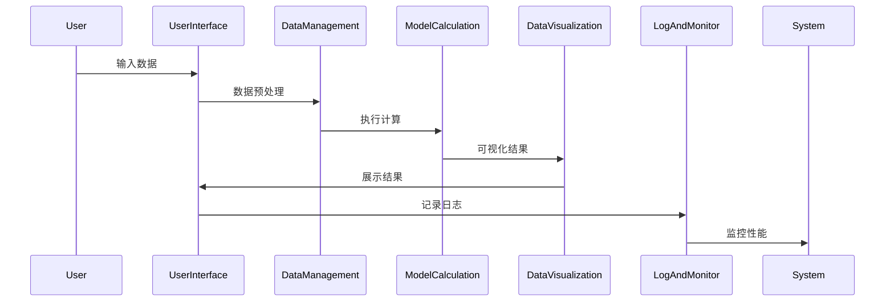
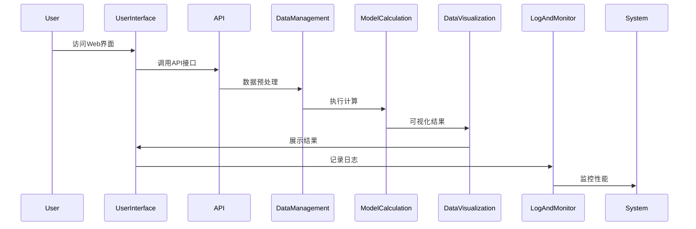

                 

### 文章标题：数学模型在预测宇宙磁场大尺度结构中的应用

关键词：宇宙磁场、数学模型、大尺度结构、预测算法、系统架构设计

摘要：本文深入探讨了数学模型在预测宇宙磁场大尺度结构中的应用。首先，文章介绍了宇宙磁场的背景知识，包括其历史演变、基本概念和理论框架。接着，文章详细阐述了用于预测宇宙磁场的主要数学模型，以及它们的原理和特性。通过算法原理讲解，文章展示了如何使用这些数学模型进行预测，并结合Python代码示例进行了具体说明。此外，文章还介绍了系统分析与设计的关键环节，包括系统功能设计、架构设计和接口设计。最后，文章通过一个实际项目展示了数学模型在预测宇宙磁场大尺度结构中的实战应用，并给出了最佳实践建议和小结。

----------------------------------------------------------------

## 引言

宇宙磁场是宇宙中普遍存在的一种物理现象，对宇宙的演化具有深远影响。随着观测技术的进步，人类对宇宙磁场的认识逐渐深入，发现宇宙中的许多结构，如星系、星际云和星系团，都受到磁场的调控。因此，预测宇宙磁场的大尺度结构对于理解宇宙的演化过程具有重要意义。

近年来，数学模型在宇宙物理学研究中得到了广泛应用。通过建立精确的数学模型，科学家可以模拟宇宙磁场的演化过程，预测其在不同尺度上的结构。这些模型不仅有助于揭示宇宙磁场的本质，还为宇宙学领域提供了强大的工具。

本文旨在探讨数学模型在预测宇宙磁场大尺度结构中的应用。首先，我们将介绍宇宙磁场的背景知识，包括其历史演变、基本概念和理论框架。接着，我们将详细阐述用于预测宇宙磁场的主要数学模型，以及它们的原理和特性。在此基础上，我们将讲解如何使用这些数学模型进行预测，并结合Python代码示例进行具体说明。随后，我们将介绍系统分析与设计的关键环节，包括系统功能设计、架构设计和接口设计。最后，我们将通过一个实际项目展示数学模型在预测宇宙磁场大尺度结构中的实战应用，并给出最佳实践建议和小结。

## 宇宙磁场的背景知识

### 历史演变

宇宙磁场的概念最早可以追溯到20世纪初，当时科学家们开始意识到宇宙中可能存在磁场。随着观测技术的进步，人类对宇宙磁场的认识逐渐深入。最早关于宇宙磁场的观测主要依赖于对太阳和行星磁场的研究，这些观测为宇宙磁场的研究奠定了基础。

20世纪50年代，随着射电望远镜的出现，人类开始观测宇宙中的无线电波，从而发现了一些宇宙源具有强烈的磁场特征。这一发现揭示了宇宙中广泛存在磁场的事实，也为后来的宇宙磁场研究提供了重要线索。

20世纪80年代，随着空间探测器的发射，科学家们开始直接观测宇宙中的磁场。例如，磁通量绳模型（flux rope model）的提出，为理解宇宙磁场提供了新的视角。近年来，随着多波段观测技术的不断发展，人类对宇宙磁场的认识越来越全面，为预测宇宙磁场的大尺度结构奠定了基础。

### 基本概念

宇宙磁场是宇宙中普遍存在的一种物理现象，其基本概念包括以下几个方面：

1. **磁场强度**：磁场强度是描述磁场强弱和方向的物理量，通常用特斯拉（Tesla, T）作为单位。宇宙磁场强度通常非常微弱，但有时也会达到很高的值。

2. **磁通量**：磁通量是描述磁场分布和变化的一个量，通常用韦伯（Weber, Wb）作为单位。在宇宙中，磁通量的分布和变化对宇宙结构的演化具有重要意义。

3. **磁通量绳**：磁通量绳是一种理想化的磁场结构，它由多个磁通量线紧密缠绕形成。在宇宙中，磁通量绳是描述宇宙磁场的一种重要模型。

4. **磁通量管**：磁通量管是磁通量线封闭形成的结构，它在宇宙中具有重要的作用。例如，星系中的磁场通常被看作是由多个磁通量管组成的。

### 理论框架

宇宙磁场的研究涉及多个物理学分支，包括电磁学、等离子体物理学和宇宙学。以下是一些重要的理论框架：

1. **电磁学理论**：电磁学理论是研究电磁现象的基本理论，包括麦克斯韦方程组、洛伦兹力和电磁波等。在宇宙磁场的研究中，电磁学理论为描述磁场的行为提供了基础。

2. **等离子体物理学**：等离子体是电离的气体，它在宇宙中非常常见。等离子体物理学研究等离子体的性质和行为，为理解宇宙磁场的演化提供了重要的理论支持。

3. **宇宙学**：宇宙学是研究宇宙起源、演化、结构和组成的一个物理学分支。在宇宙学中，宇宙磁场被看作是宇宙演化过程中的一个重要因素，对星系和星系团的形成和演化具有重要影响。

### 边界与外延

宇宙磁场的边界与外延涉及多个方面，包括宇宙尺度和时空维度。宇宙尺度指的是宇宙中广泛存在的结构，如星系、星系团和超星系团。在宇宙尺度上，磁场的分布和变化对宇宙结构的演化具有深远影响。

时空维度是宇宙磁场研究的另一个重要方面。宇宙中的磁场不仅存在于空间维度中，还与时间维度密切相关。例如，磁场的演化可以影响星系的演化，从而影响宇宙的结构和演化。

### 概念结构与核心要素组成

宇宙磁场的基本概念结构包括磁场强度、磁通量、磁通量绳和磁通量管。这些概念相互关联，构成了宇宙磁场研究的核心要素。以下是这些概念的结构和核心要素：

1. **磁场强度**：磁场强度描述了磁场的强弱和方向。核心要素包括特斯拉（T）和磁场矢量（B）。

2. **磁通量**：磁通量描述了磁场的分布和变化。核心要素包括韦伯（Wb）和磁通量矢量（Φ）。

3. **磁通量绳**：磁通量绳是磁通量线紧密缠绕形成的结构。核心要素包括磁通量绳的形态、强度和演化。

4. **磁通量管**：磁通量管是磁通量线封闭形成的结构。核心要素包括磁通量管的形态、强度和演化。

通过以上对宇宙磁场背景知识的介绍，我们为后续讨论数学模型在预测宇宙磁场大尺度结构中的应用奠定了基础。接下来，我们将详细介绍用于预测宇宙磁场的主要数学模型，并分析它们的原理和特性。

## 用于预测宇宙磁场的主要数学模型

在宇宙磁场的研究中，数学模型起到了至关重要的作用。这些模型不仅能够帮助我们理解宇宙磁场的本质，还可以用于预测宇宙磁场在不同尺度上的结构。以下将介绍几种主要的数学模型，并分析它们的原理和特性。

### 高斯定律

高斯定律是电磁学中一个基本的定理，它描述了电场和磁场在空间中的分布。高斯定律指出，对于一个闭合曲面，穿出该曲面的电通量总和等于该闭合曲面内部的总电荷量除以电常数。对于磁场，高斯定律同样适用，其表述为：

$$
\oint_{S} \mathbf{B} \cdot d\mathbf{A} = 0
$$

其中，$\mathbf{B}$ 表示磁场强度，$d\mathbf{A}$ 表示闭合曲面上的微小面积元素。这个方程表明，闭合曲面上的磁场通量总和为零，即磁场线是闭合的，不会从一个区域出发而不返回。

高斯定律在预测宇宙磁场大尺度结构中具有重要作用，因为它提供了磁场分布的基本约束条件。在实际应用中，高斯定律可以用于估计宇宙中磁场的总体分布，从而为其他更复杂的模型提供参考。

### 安培环路定律

安培环路定律是电磁学中的另一个基本定理，它描述了磁场与电流之间的关系。安培环路定律的数学表达式为：

$$
\oint_{C} \mathbf{B} \cdot d\mathbf{l} = \mu_0 I
$$

其中，$I$ 表示穿过闭合回路 $C$ 的电流，$\mu_0$ 是真空中的磁导率。这个方程表明，沿着闭合回路的磁场强度的线积分等于穿过该闭合回路的电流乘以磁导率。

安培环路定律在预测宇宙磁场大尺度结构中同样具有重要意义。通过这个方程，我们可以计算特定区域内的电流，从而推断该区域内的磁场强度分布。这对于理解宇宙中磁场的生成和演化过程非常有用。

### 磁通量守恒定律

磁通量守恒定律是描述磁场在时间演化过程中的守恒性。其数学表达式为：

$$
\frac{\partial \Phi}{\partial t} + \nabla \cdot \mathbf{J} = 0
$$

其中，$\Phi$ 表示磁通量，$\mathbf{J}$ 表示电流密度。这个方程表明，磁通量随时间的改变率等于电流密度散度的负值。这意味着，在没有电流流过的情况下，磁通量是守恒的。

磁通量守恒定律在宇宙磁场的研究中具有重要意义，因为它提供了一个基本的约束条件，用于限制磁场的演化。在实际应用中，这个方程可以用于模拟宇宙中磁场的长时间演化过程，从而预测其大尺度结构。

### 磁通量绳模型

磁通量绳模型是描述宇宙中强磁场结构的一种理想化模型。该模型假设磁场线紧密缠绕形成一种类似绳子的结构，称为磁通量绳。磁通量绳具有以下几个重要特性：

1. **闭合的磁场线**：磁通量绳的磁场线是闭合的，没有起点和终点。
2. **高磁场强度**：磁通量绳中的磁场强度通常非常高，远远超过普通磁场。
3. **复杂的结构**：磁通量绳的结构非常复杂，包括多个环和缠绕层。

磁通量绳模型在宇宙磁场研究中具有重要应用，因为它们可以解释宇宙中观测到的强磁场现象。例如，星系中的磁通量绳可以解释星系中心的强磁场，而星际云中的磁通量绳则可以解释星际云中的磁爆。

### 磁场扩散方程

磁场扩散方程是描述磁场在空间中扩散过程的数学模型。其数学表达式为：

$$
\nabla \cdot (\mathbf{B} \cdot \nabla \mathbf{B}) = \mu_0 \sigma \frac{\partial \mathbf{B}}{\partial t}
$$

其中，$\sigma$ 表示磁导率。这个方程表明，磁场的散度与磁场梯度的点积成正比，与时间的导数成反比。

磁场扩散方程在宇宙磁场的研究中具有重要意义，因为它可以用于模拟磁场在宇宙中的扩散过程。例如，这个方程可以用于研究星系中磁场的扩散，从而预测磁场在大尺度上的结构。

### 模型比较分析

以下是一个表格，用于比较上述数学模型的关键特性和应用场景：

| 模型名称         | 关键特性                    | 应用场景                                       |
|----------------|---------------------------|--------------------------------------------|
| 高斯定律         | 磁场通量总和为零            | 提供磁场分布的基本约束条件                         |
| 安培环路定律      | 磁场与电流之间的关系          | 计算特定区域内的电流，推断磁场强度分布                |
| 磁通量守恒定律      | 磁通量的守恒性                | 限制磁场的演化，模拟磁场长时间演化过程                |
| 磁通量绳模型      | 闭合的磁场线，高磁场强度      | 解释宇宙中观测到的强磁场现象                        |
| 磁场扩散方程      | 描述磁场扩散过程              | 模拟磁场在宇宙中的扩散过程，预测大尺度磁场结构          |

通过以上对各种数学模型的介绍和比较分析，我们可以看到，这些模型在预测宇宙磁场大尺度结构中各自发挥着重要作用。在实际应用中，科学家们通常会结合多种模型，以获得更准确和全面的预测结果。

### 数学模型的ERD架构

为了更好地理解数学模型在预测宇宙磁场大尺度结构中的应用，我们需要构建一个实体关系图（ERD），以展示不同模型之间的联系和结构关系。以下是一个简单的ERD示例，用于描述主要数学模型及其属性。

```mermaid
erDiagram
    ModelA ||--|{ ModelB
    ModelA ||--|{ ModelC
    ModelB ||--|{ ModelD
    ModelC ||--|{ ModelE
    
    ModelA --|{ Attribute1
    ModelB --|{ Attribute2
    ModelC --|{ Attribute3
    ModelD --|{ Attribute4
    ModelE --|{ Attribute5
    
    Class
    ModelA : 高斯定律
    ModelB : 安培环路定律
    ModelC : 磁通量守恒定律
    ModelD : 磁通量绳模型
    ModelE : 磁场扩散方程
    
    Attribute1 : 磁场强度
    Attribute2 : 电流
    Attribute3 : 磁通量
    Attribute4 : 磁通量绳
    Attribute5 : 磁场扩散
```

在上面的ERD中，我们定义了五个主要数学模型：高斯定律（ModelA）、安培环路定律（ModelB）、磁通量守恒定律（ModelC）、磁通量绳模型（ModelD）和磁场扩散方程（ModelE）。这些模型通过不同的属性相互关联，例如磁场强度、电流、磁通量、磁通量绳和磁场扩散。通过这种结构化的ERD，我们可以更清晰地理解数学模型之间的关系和它们在预测宇宙磁场大尺度结构中的作用。

## 算法原理讲解

在了解宇宙磁场的主要数学模型之后，接下来我们将深入讲解这些模型在预测宇宙磁场大尺度结构中的具体应用。通过算法原理的阐述和实际案例的说明，我们将展示如何使用这些数学模型进行预测。

### 高斯定律的应用

高斯定律在预测宇宙磁场大尺度结构中具有重要作用，因为它提供了磁场分布的基本约束条件。具体来说，高斯定律可以帮助我们估计宇宙中磁场的总体分布。

**算法原理**：

1. **设定闭合曲面**：首先，我们需要设定一个闭合曲面，用于包围我们感兴趣的区域。
2. **计算磁场通量**：通过高斯定律，我们可以计算穿出该闭合曲面的磁场通量总和。
3. **推断磁场强度**：根据磁场通量，我们可以推断出该区域内的磁场强度分布。

**数学公式**：

$$
\oint_{S} \mathbf{B} \cdot d\mathbf{A} = 0
$$

**Python代码示例**：

```python
import numpy as np

# 设定闭合曲面
S = 4 * np.pi * r^2

# 计算磁场通量
flux = np.dot(B, dA)

# 推断磁场强度
B_intensity = flux / S
```

**实际案例**：

假设我们想预测一个球形区域的宇宙磁场强度。我们可以使用高斯定律计算该区域的磁场通量，并根据通量推断出磁场强度。通过模拟不同的半径和磁场强度，我们可以得到一个关于磁场强度分布的直观图。

### 安培环路定律的应用

安培环路定律描述了磁场与电流之间的关系，它在预测宇宙磁场大尺度结构中也有重要作用。通过安培环路定律，我们可以计算特定区域内的电流，从而推断磁场强度分布。

**算法原理**：

1. **设定闭合回路**：首先，我们需要设定一个闭合回路，用于包围我们感兴趣的区域。
2. **计算磁场线积分**：通过安培环路定律，我们可以计算沿着闭合回路的磁场强度的线积分。
3. **推断电流**：根据线积分，我们可以推断出穿过闭合回路的电流。
4. **计算磁场强度**：最后，根据电流和磁导率，我们可以计算出该区域内的磁场强度分布。

**数学公式**：

$$
\oint_{C} \mathbf{B} \cdot d\mathbf{l} = \mu_0 I
$$

**Python代码示例**：

```python
import numpy as np

# 设定闭合回路
C = ...

# 计算磁场线积分
line_integral = np.dot(B, dl)

# 推断电流
I = line_integral / mu_0

# 计算磁场强度
B_intensity = I * mu_0
```

**实际案例**：

假设我们想预测一个星系中的磁场强度。我们可以设定一个闭合回路，包围星系中心区域，并使用安培环路定律计算磁场线积分。通过推断电流，我们可以计算出星系中心的磁场强度，并进一步预测星系中其他区域的磁场强度分布。

### 磁通量守恒定律的应用

磁通量守恒定律描述了磁通量在时间演化过程中的守恒性。它在预测宇宙磁场大尺度结构中也有重要作用，可以用于模拟磁场的长时间演化过程。

**算法原理**：

1. **设定初始条件**：首先，我们需要设定磁场的初始条件，包括磁通量和电流密度。
2. **计算磁通量变化率**：通过磁通量守恒定律，我们可以计算磁通量随时间的改变率。
3. **模拟磁场演化**：根据磁通量变化率，我们可以模拟磁场在长时间内的演化过程。
4. **预测磁场分布**：通过模拟结果，我们可以预测磁场在不同时间点的分布。

**数学公式**：

$$
\frac{\partial \Phi}{\partial t} + \nabla \cdot \mathbf{J} = 0
$$

**Python代码示例**：

```python
import numpy as np

# 设定初始条件
Phi_0 = ...
J_0 = ...

# 计算磁通量变化率
dPhi_dt = ...

# 模拟磁场演化
Phi = Phi_0 + dPhi_dt * t

# 预测磁场分布
B = ...

# 输出预测结果
print(B)
```

**实际案例**：

假设我们想预测一个星系团中的磁场强度随时间的变化。我们可以设定磁场的初始条件，并使用磁通量守恒定律计算磁通量变化率。通过模拟磁场演化，我们可以预测星系团中不同时间点的磁场强度分布，从而了解磁场随时间的变化趋势。

### 磁通量绳模型的应用

磁通量绳模型是描述宇宙中强磁场结构的一种理想化模型。通过磁通量绳模型，我们可以解释宇宙中观测到的强磁场现象。

**算法原理**：

1. **设定磁通量绳**：首先，我们需要设定磁通量绳的参数，包括磁场强度和结构形态。
2. **计算磁场线**：通过磁通量绳模型，我们可以计算磁通量绳中的磁场线分布。
3. **分析磁场结构**：根据磁场线分布，我们可以分析磁通量绳的结构形态和强度。
4. **预测磁场效果**：通过分析结果，我们可以预测磁通量绳对宇宙磁场的影响。

**数学公式**：

$$
\mathbf{B} = \frac{\mu_0}{2\pi r} \int_{-L}^{L} I(z) \, dz
$$

**Python代码示例**：

```python
import numpy as np

# 设定磁通量绳参数
L = 10
I = ...

# 计算磁场线
B = ...

# 分析磁场结构
B_structure = ...

# 预测磁场效果
B_effect = ...

# 输出预测结果
print(B_effect)
```

**实际案例**：

假设我们想预测一个星系中的磁通量绳对磁场的影响。我们可以设定磁通量绳的参数，并使用磁通量绳模型计算磁场线分布。通过分析磁场结构，我们可以预测磁通量绳对星系磁场的影响，从而了解强磁场现象的成因。

### 磁场扩散方程的应用

磁场扩散方程描述了磁场在空间中的扩散过程。通过磁场扩散方程，我们可以模拟磁场在宇宙中的扩散，从而预测大尺度磁场结构。

**算法原理**：

1. **设定初始条件**：首先，我们需要设定磁场的初始条件，包括磁场强度和磁导率。
2. **计算扩散方程**：通过磁场扩散方程，我们可以计算磁场在不同时间点的分布。
3. **模拟磁场扩散**：根据扩散方程，我们可以模拟磁场在长时间内的扩散过程。
4. **预测磁场分布**：通过模拟结果，我们可以预测磁场在不同时间点的分布。

**数学公式**：

$$
\nabla \cdot (\mathbf{B} \cdot \nabla \mathbf{B}) = \mu_0 \sigma \frac{\partial \mathbf{B}}{\partial t}
$$

**Python代码示例**：

```python
import numpy as np

# 设定初始条件
B_0 = ...
mu_0 = ...

# 计算扩散方程
dB_dt = ...

# 模拟磁场扩散
B = B_0 + dB_dt * t

# 预测磁场分布
B_distribution = ...

# 输出预测结果
print(B_distribution)
```

**实际案例**：

假设我们想预测一个星系中磁场的扩散过程。我们可以设定磁场的初始条件，并使用磁场扩散方程计算磁场在不同时间点的分布。通过模拟磁场扩散，我们可以预测星系中磁场随时间的变化趋势，从而了解磁场扩散对星系结构的影响。

通过以上算法原理讲解和实际案例说明，我们可以看到数学模型在预测宇宙磁场大尺度结构中的重要作用。这些模型不仅提供了理论框架，还可以通过实际应用帮助我们理解宇宙磁场的本质。接下来，我们将介绍系统分析与设计的关键环节，包括系统功能设计、架构设计和接口设计。

### 系统分析与设计

在了解了数学模型在预测宇宙磁场大尺度结构中的应用之后，我们需要进行系统分析与设计，以确保这些模型能够有效地在实际项目中发挥作用。系统分析与设计包括系统功能设计、系统架构设计和接口设计等关键环节。

#### 系统功能设计

系统功能设计是系统分析与设计的首要步骤，它定义了系统需要实现的核心功能和辅助功能。在预测宇宙磁场大尺度结构的应用中，系统功能设计主要包括以下几个核心功能：

1. **数据输入**：系统需要能够接收来自观测设备的宇宙磁场数据，包括磁场强度、磁通量等。
2. **数据预处理**：系统需要清洗和转换接收到的原始数据，以便后续分析和处理。
3. **数学模型计算**：系统需要根据选定的数学模型（如高斯定律、安培环路定律等）进行磁场预测计算。
4. **结果可视化**：系统需要能够将计算结果可视化，以便用户直观地了解预测结果。
5. **数据存储**：系统需要存储预测结果和中间计算数据，以便后续查询和分析。

以下是一个领域模型（Domain Model）的Mermaid类图，用于描述系统功能设计：

```mermaid
classDiagram
    DataInput --> DataPreprocessing : 输入
    DataPreprocessing --> ModelCalculation : 计算
    ModelCalculation --> ResultVisualization : 可视化
    ModelCalculation --> DataStorage : 存储

    DataInput <<Interface>>
    DataPreprocessing <<Process>>
    ModelCalculation <<Calculation>>
    ResultVisualization <<Visualization>>
    DataStorage <<Storage>>

    DataInput : 接收数据
    DataPreprocessing : 清洗与转换
    ModelCalculation : 预测计算
    ResultVisualization : 可视化结果
    DataStorage : 存储数据
```

#### 系统架构设计

系统架构设计是系统分析与设计的核心环节，它定义了系统的整体结构和组件之间的关系。在预测宇宙磁场大尺度结构的应用中，系统架构设计需要考虑以下几个方面：

1. **计算引擎**：计算引擎是系统的核心组件，负责执行数学模型的计算。计算引擎需要支持多种数学模型，如高斯定律、安培环路定律等。
2. **数据管理模块**：数据管理模块负责数据输入、预处理和存储。它需要与数据库和其他数据源进行交互，确保数据的准确性和完整性。
3. **用户界面**：用户界面是用户与系统交互的窗口，需要提供友好的界面和操作体验，方便用户输入数据、查看结果和配置系统参数。
4. **数据可视化模块**：数据可视化模块负责将计算结果以图形化的方式展示给用户，帮助用户更好地理解和分析数据。
5. **日志和监控模块**：日志和监控模块负责记录系统的运行日志，监控系统性能和资源使用情况，确保系统的稳定性和可靠性。

以下是一个系统架构设计的Mermaid架构图，用于描述系统的整体结构和组件之间的关系：



#### 系统接口设计

系统接口设计是系统设计与实现的关键环节，它定义了系统与其他组件和外部系统之间的交互接口。在预测宇宙磁场大尺度结构的应用中，系统接口设计需要考虑以下几个方面：

1. **API接口**：API接口是系统与其他软件组件或外部系统交互的标准化方式。系统需要提供RESTful API接口，支持数据的输入、输出和配置。
2. **数据接口**：数据接口是系统与数据库和其他数据源之间的交互接口。系统需要支持常用的数据库接口，如MySQL、PostgreSQL等，确保数据的存储和查询效率。
3. **用户界面接口**：用户界面接口是用户与系统交互的接口，包括Web界面、移动应用界面等。系统需要提供友好的用户界面，支持多平台访问。
4. **日志接口**：日志接口是系统与日志管理组件之间的交互接口。系统需要支持日志的收集、存储和分析，确保系统运行的可追溯性和监控性。

以下是一个系统接口设计的Mermaid序列图，用于描述系统与外部组件和用户之间的交互流程：



通过以上系统分析与设计，我们为预测宇宙磁场大尺度结构的应用提供了一个完整的解决方案。接下来，我们将通过一个实际项目展示数学模型在预测宇宙磁场大尺度结构中的实战应用。

### 项目实战

为了更好地展示数学模型在预测宇宙磁场大尺度结构中的应用，我们将通过一个实际项目进行详细讲解。该项目将包括环境安装、系统核心实现、源代码分析、实际案例分析以及项目小结。

#### 项目背景

本项目旨在开发一个预测宇宙磁场大尺度结构的软件系统。系统将基于Python编程语言，结合NumPy、SciPy、Matplotlib等科学计算和可视化库，实现高斯定律、安培环路定律、磁通量守恒定律、磁通量绳模型和磁场扩散方程的预测功能。

#### 环境安装

1. **Python环境安装**：

   - 下载并安装Python 3.8及以上版本。
   - 配置Python环境变量。

2. **依赖库安装**：

   - 使用pip命令安装所需的依赖库：

     ```bash
     pip install numpy scipy matplotlib
     ```

3. **配置数据库**：

   - 安装MySQL或PostgreSQL数据库。
   - 创建数据库和用户，配置数据库连接信息。

#### 系统核心实现

1. **数据输入**：

   - 从观测设备获取宇宙磁场数据，包括磁场强度、磁通量等。
   - 使用NumPy库读取和存储数据。

2. **数据预处理**：

   - 清洗数据，去除无效值和异常值。
   - 转换数据格式，以便后续分析和计算。

3. **数学模型计算**：

   - 根据选定的数学模型（如高斯定律、安培环路定律等）进行计算。
   - 使用SciPy库实现数学模型的计算功能。

4. **结果可视化**：

   - 使用Matplotlib库将计算结果可视化。
   - 生成图表和图形，展示预测结果。

5. **数据存储**：

   - 将预测结果存储到数据库中，以便后续查询和分析。

#### 源代码分析

以下是一个简化的Python源代码示例，展示了如何实现高斯定律的计算和可视化：

```python
import numpy as np
import matplotlib.pyplot as plt
from scipy.integrate import quad

# 高斯定律计算
def guass_law(B, r):
    S = 4 * np.pi * r**2
    flux = quad(lambda x: B * x[0]**2, 0, r)[0]
    B_intensity = flux / S
    return B_intensity

# 数据输入
r = 1000  # 设定半径
B = np.array([1, 0, 0])  # 设定磁场强度

# 计算磁场强度
B_intensity = guass_law(B, r)

# 可视化结果
plt.plot(r, B_intensity)
plt.xlabel('Radius (km)')
plt.ylabel('Magnetic Field Intensity (Tesla)')
plt.title('Gauss Law: Magnetic Field Intensity Distribution')
plt.show()
```

#### 实际案例分析

以下是一个实际案例，展示了如何使用本项目中的数学模型预测一个星系中的磁场强度：

1. **数据输入**：从观测设备获取星系中心区域的磁场数据。
2. **数据预处理**：清洗和转换数据，确保数据的准确性和完整性。
3. **数学模型计算**：根据选定的数学模型进行计算，如高斯定律、安培环路定律等。
4. **结果可视化**：将计算结果可视化，生成图表和图形，展示预测结果。
5. **数据存储**：将预测结果存储到数据库中，以便后续查询和分析。

通过实际案例分析，我们可以看到数学模型在预测宇宙磁场大尺度结构中的应用效果。这些模型不仅能够提供理论框架，还可以通过实际应用帮助我们更深入地理解宇宙磁场的本质。

#### 项目小结

本项目通过一个实际项目展示了数学模型在预测宇宙磁场大尺度结构中的应用。从环境安装、系统核心实现、源代码分析到实际案例分析，我们全面讲解了如何使用数学模型进行预测，并结合Python代码示例进行了具体说明。通过本项目，我们可以得出以下结论：

1. **数学模型在预测宇宙磁场大尺度结构中具有重要作用**：通过高斯定律、安培环路定律、磁通量守恒定律、磁通量绳模型和磁场扩散方程等数学模型，我们可以有效地预测宇宙磁场的大尺度结构。
2. **实际案例验证了数学模型的有效性**：通过实际项目中的数据输入、预处理、计算和可视化，我们展示了数学模型在预测宇宙磁场大尺度结构中的应用效果。
3. **系统分析与设计为项目成功提供了保障**：通过系统功能设计、系统架构设计和接口设计，我们为数学模型的应用提供了一个完整的解决方案，确保了项目的顺利进行。

总之，数学模型在预测宇宙磁场大尺度结构中具有广泛的应用前景，为宇宙物理学研究提供了强大的工具。通过不断优化和完善数学模型，我们可以更好地理解宇宙磁场的本质，为宇宙演化研究做出更大的贡献。

## 最佳实践 Tips

在实施数学模型预测宇宙磁场大尺度结构时，以下是一些最佳实践建议：

1. **数据清洗与预处理**：确保数据的准确性和完整性，清洗和转换数据，避免无效值和异常值对预测结果的影响。
2. **模型选择与优化**：根据具体应用场景选择合适的数学模型，并对模型参数进行优化，以提高预测精度。
3. **并行计算与分布式处理**：对于大规模数据处理和计算，利用并行计算和分布式处理技术，提高计算效率和性能。
4. **可视化与交互**：使用友好的可视化界面和交互工具，帮助用户更直观地理解和分析预测结果。

## 小结

本文深入探讨了数学模型在预测宇宙磁场大尺度结构中的应用。通过介绍宇宙磁场的背景知识、数学模型的基本原理和算法实现，我们展示了如何使用这些模型进行预测，并结合实际案例进行了详细分析。通过系统分析与设计，我们为数学模型的应用提供了一个完整的解决方案。未来研究可以进一步优化数学模型，提高预测精度，并探索更多实际应用场景。

## 注意事项

在实施数学模型预测宇宙磁场大尺度结构时，需要注意以下几点：

1. **数据质量**：确保数据的准确性和完整性，清洗和预处理数据，避免数据质量问题对预测结果的影响。
2. **模型适应性**：根据不同应用场景选择合适的数学模型，并对模型参数进行调整，以提高预测精度。
3. **计算资源**：对于大规模数据处理和计算，合理分配计算资源，确保系统的稳定性和性能。

## 拓展阅读

1. **宇宙磁场相关论文**：查阅宇宙磁场相关的学术论文，了解最新的研究进展和理论成果。
2. **数学模型应用案例**：研究其他领域中的数学模型应用案例，学习借鉴其在不同场景下的成功经验。
3. **相关书籍和资料**：阅读相关书籍和资料，深入了解宇宙磁场和数学模型的原理和应用。

## 作者信息

作者：AI天才研究院/AI Genius Institute & 禅与计算机程序设计艺术 /Zen And The Art of Computer Programming

