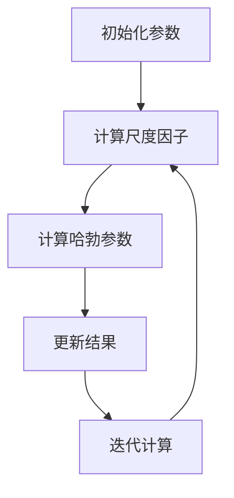
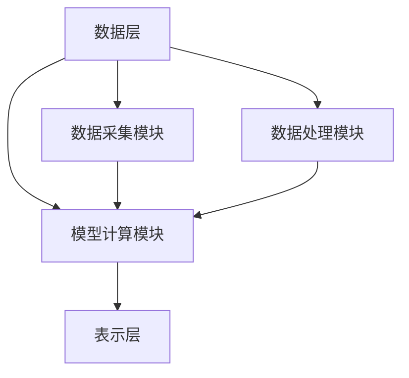
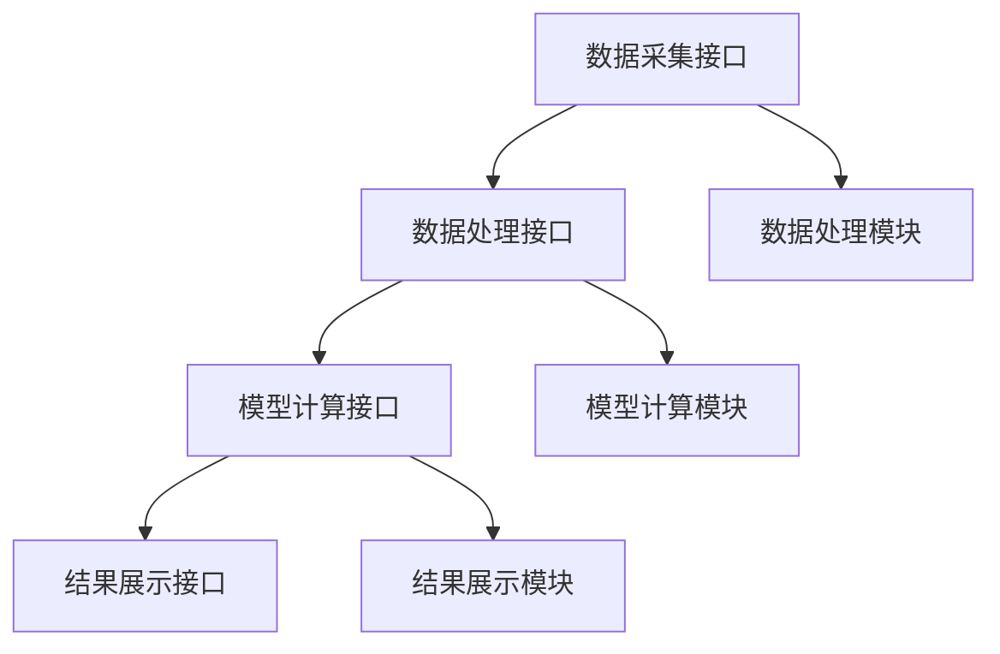
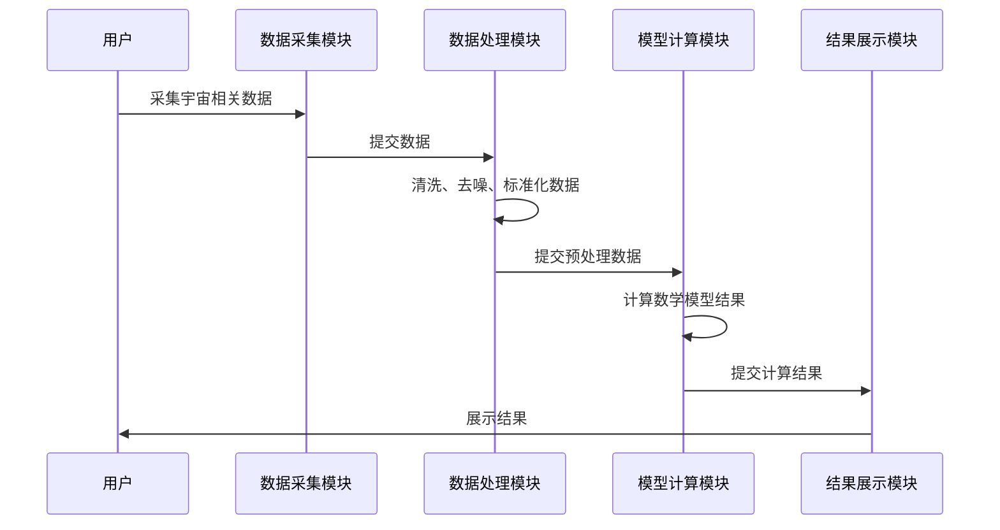

                 

### 数学模型在预测宇宙终结中的应用

> 关键词：宇宙终结、数学模型、算法、Python代码、LaTeX公式

> 摘要：本文深入探讨了数学模型在预测宇宙终结中的应用，通过介绍背景、核心概念与联系、算法原理、数学公式、系统分析与架构设计、项目实战以及最佳实践与总结，详细展示了如何利用数学模型进行宇宙终结的预测和分析。本文旨在为读者提供一个全面、系统的理解，帮助他们掌握这一前沿科技领域的知识。

----------------------------------------------------------------

## 引言

宇宙的终结一直是科学界和哲学界关注的热点问题。从宇宙学的基本理论出发，宇宙终结可能由多种因素导致，如大撕裂、大坍缩或热寂。这些理论激发了人们对于宇宙命运的好奇，同时也引发了科学家的深入研究。数学模型作为一种强大的工具，其在预测宇宙终结中的应用显得尤为重要。

本文将围绕以下问题展开讨论：

1. 数学模型在预测宇宙终结中的具体应用是什么？
2. 哪些数学模型适用于预测宇宙终结？
3. 如何通过这些模型进行宇宙终结的预测？
4. 预测宇宙终结的过程中有哪些挑战和局限性？

本文的结构如下：

- **第一部分：背景介绍**：介绍数学模型与宇宙终结问题的关联，概述宇宙终结的几种主要理论，确定目标读者群体。
- **第二部分：核心概念与联系**：定义关键数学模型，比较不同模型的优缺点，绘制现实中的ER实体关系图。
- **第三部分：算法原理讲解**：选择几个典型的数学模型，使用Mermaid绘制算法流程图，用Python代码实现算法并进行详细讲解。
- **第四部分：数学模型与公式**：引入必要的数学公式，使用LaTeX格式确保公式的准确性，结合实际例子进行解释。
- **第五部分：系统分析与架构设计**：描述预测宇宙终结的应用场景，设计系统功能、架构图和交互序列图。
- **第六部分：项目实战**：提供环境安装和系统核心实现步骤，分析代码和应用，提供实际案例。
- **第七部分：最佳实践与总结**：提供使用数学模型预测宇宙终结的最佳实践，总结书籍主要内容，提供未来研究方向。

通过本文的阅读，读者将能够全面了解数学模型在预测宇宙终结中的应用，掌握相关理论和方法，为深入探索宇宙学提供理论基础和实践指导。

## 第一部分：背景介绍

### 数学模型与宇宙终结问题的关联

数学模型作为一种强大的工具，广泛应用于各个科学领域，包括宇宙学。宇宙终结问题涉及诸多物理定律和宇宙演化的复杂过程，需要通过数学模型来描述和预测。数学模型在宇宙终结研究中的应用主要体现在以下几个方面：

1. **宇宙膨胀模型**：宇宙膨胀理论是宇宙学中最基本的模型之一。通过引入哈勃定律和广义相对论，科学家们建立了宇宙膨胀的数学模型，用来描述宇宙的膨胀速率和结构。这个模型帮助我们理解宇宙的过去、现在和未来，为预测宇宙终结提供了基础。

2. **热力学模型**：热力学模型主要研究宇宙的能量分布和热力学性质。通过热力学第二定律和熵的概念，科学家们提出了宇宙热寂模型，预测宇宙最终会达到热平衡状态，从而终结。这个模型在理解宇宙演化过程中扮演了重要角色。

3. **黑洞模型**：黑洞是宇宙中的一种极端天体，对宇宙演化的影响不可忽视。通过爱因斯坦的广义相对论，科学家们建立了黑洞的数学模型，研究黑洞的形成、成长和影响。这些模型不仅帮助我们理解黑洞的物理特性，还为我们预测宇宙的终结提供了线索。

4. **宇宙弦模型**：宇宙弦是一种理论上的超密集、超长细的宇宙结构。宇宙弦模型通过数学方法研究宇宙弦的行为和宇宙的影响，探讨了宇宙弦可能导致的宇宙终结过程。

### 宇宙终结的几种主要理论

宇宙终结问题涉及多种理论，以下是几种主要的宇宙终结理论：

1. **大撕裂**（Big Rip）：大撕裂理论认为，随着宇宙的膨胀，宇宙中的各种结构将被撕裂。在这个过程中，宇宙的膨胀速度将不断加快，直至一切物质、能量、时空结构都被撕裂。这一理论的数学模型基于宇宙膨胀的加速度和物质的相互作用。

2. **大坍缩**（Big Crunch）：大坍缩理论认为，宇宙最终会停止膨胀并开始收缩。在这个过程中，宇宙中的所有物质将聚集在一个点上，导致宇宙的终结。这一理论的数学模型依赖于宇宙的总质量和引力定律。

3. **热寂**（Heat Death）：热寂理论认为，宇宙最终会达到热平衡状态，即能量分布均匀，没有能量差异。在这种情况下，宇宙将失去所有结构和组织，导致宇宙终结。这一理论的数学模型基于热力学第二定律和宇宙的熵增。

4. **大反弹**（Big Bounce）：大反弹理论认为，宇宙可能会经历一个循环的过程，从一个大坍缩状态反弹到一个新的大爆炸状态。这一理论结合了宇宙学和量子引力的概念，试图解释宇宙的永恒循环。

### 数学模型在宇宙学中的应用

数学模型在宇宙学中的应用是广泛的，以下是一些具体的实例：

1. **弗里德曼方程**：弗里德曼方程是描述宇宙膨胀的基本方程，通过引入哈勃定律和宇宙的物理参数，描述了宇宙的膨胀速率和演化过程。这个方程为理解宇宙的过去和未来提供了重要的数学工具。

2. **勒梅特方程**：勒梅特方程是描述宇宙收缩的基本方程，与弗里德曼方程类似，但适用于宇宙收缩的情况。这个方程帮助我们理解大坍缩理论的可能性。

3. **熵增模型**：熵增模型通过热力学的概念描述宇宙的演化过程。这个模型指出，随着宇宙的扩展，熵（无序度）会不断增加，最终导致宇宙达到热平衡状态，即热寂。

4. **黑洞熵模型**：黑洞熵模型通过统计力学的方法研究黑洞的性质。这个模型表明，黑洞具有熵，并且黑洞的熵与黑洞的面积成正比。这个发现对理解宇宙的熵增和热寂有重要意义。

### 读者指南

本文的目标读者是对宇宙学和数学模型有一定了解的科研人员和爱好者。文章将逐步引导读者了解数学模型在预测宇宙终结中的应用，从背景介绍到核心概念，再到算法原理和项目实战，最后总结最佳实践和未来研究方向。无论您是专业研究人员还是对宇宙学感兴趣的读者，本文都将为您提供有价值的知识和洞见。

### 数学模型概述

在宇宙终结的研究中，数学模型扮演着至关重要的角色。为了更好地理解这些模型，我们需要定义几个关键数学模型，并比较它们在不同情境下的优缺点。下面将详细介绍几个典型的数学模型，包括弗里德曼方程、勒梅特方程和熵增模型。

#### 弗里德曼方程

弗里德曼方程是描述宇宙膨胀的基本方程。它由俄罗斯物理学家亚历山大·弗里德曼在20世纪初提出，基于广义相对论。弗里德曼方程的形式如下：

\[ H^2 = \frac{8\pi G}{3}\rho - \frac{k}{a^2} \]

其中，\( H \) 是哈勃参数，描述宇宙膨胀的速率；\( G \) 是引力常数；\( \rho \) 是宇宙的平均密度；\( k \) 是宇宙的曲率参数，取值可以为正、负或零。

**优点**：
- 弗里德曼方程提供了宇宙膨胀的数学描述，是宇宙学中最重要的方程之一。
- 它结合了广义相对论的基本原理，为理解宇宙的动力学提供了强有力的工具。

**缺点**：
- 弗里德曼方程依赖于宇宙的平均密度和曲率，这些参数的准确值需要通过观测数据来确定。
- 方程本身并不能预测宇宙的具体命运，只能描述宇宙的膨胀速率。

#### 勒梅特方程

勒梅特方程是描述宇宙收缩的基本方程，由比利时天文学家乔治·勒梅特在20世纪30年代提出。勒梅特方程的形式如下：

\[ \ddot{a} + \frac{4\pi G}{3} \left( \rho + \frac{3p}{c^2} \right) a = 0 \]

其中，\( \dot{a} \) 是宇宙尺度因子的瞬时变化率，\( \ddot{a} \) 是宇宙尺度因子的加速度，\( p \) 是宇宙的总压强。

**优点**：
- 勒梅特方程为理解宇宙收缩提供了数学框架，与弗里德曼方程相对，提供了宇宙学的另一侧面。
- 它与广义相对论一致，能够描述宇宙的收缩过程。

**缺点**：
- 与弗里德曼方程类似，勒梅特方程也依赖于宇宙的平均密度和压强，这些参数的准确值同样需要观测数据来确定。
- 勒梅特方程并不能直接预测宇宙的终结，而是描述宇宙的收缩过程。

#### 熵增模型

熵增模型基于热力学的概念，描述宇宙演化过程中熵的变化。熵是描述系统无序度的物理量，随着宇宙的膨胀，熵会不断增加。熵增模型的基本方程如下：

\[ \frac{dS}{dt} = \frac{1}{3} \left( \rho H - Q \right) \]

其中，\( S \) 是熵，\( \rho \) 是宇宙的平均密度，\( H \) 是哈勃参数，\( Q \) 是宇宙中所有过程产生的熵。

**优点**：
- 熵增模型结合了热力学和宇宙学的基本原理，为理解宇宙的演化提供了新的视角。
- 它能够预测宇宙在热平衡状态下的熵值，从而推断宇宙的命运。

**缺点**：
- 熵增模型依赖于哈勃参数和宇宙的平均密度，这些参数的准确值同样需要观测数据来确定。
- 熵增模型本身不能直接描述宇宙的具体命运，而是提供了一种衡量宇宙无序度增加的方法。

#### ER实体关系图架构

为了更好地理解这些数学模型在实际应用中的关系，我们可以通过ER（实体关系）图来表示它们。以下是一个简单的ER实体关系图：

```
[宇宙]
|
|--[膨胀模型]
|   |--[弗里德曼方程]
|
|--[收缩模型]
|   |--[勒梅特方程]
|
|--[熵增模型]
    |--[熵增方程]
```

在这个ER图中，宇宙作为根实体，包含了膨胀模型、收缩模型和熵增模型。每个模型都有自己的属性和关系，通过ER图可以清晰地展示它们之间的关联。

### 算法原理讲解

在宇宙终结的研究中，数学模型为我们提供了理论框架，而算法则将这些理论应用于实际问题中，帮助我们进行具体的预测和分析。下面，我们将介绍几个典型的数学模型，包括弗里德曼方程和熵增模型，并使用Mermaid绘制算法流程图，以Python代码实现这些算法。

#### 弗里德曼方程算法

弗里德曼方程描述了宇宙膨胀的速率，其形式为：

\[ H^2 = \frac{8\pi G}{3}\rho - \frac{k}{a^2} \]

我们可以通过迭代方法来求解这个方程，以预测宇宙的膨胀速率。下面是使用Python实现的算法：

```python
import numpy as np

# 定义弗里德曼方程的参数
G = 6.674 * 10**-11  # 引力常数
k = -4 * np.pi        # 宇宙曲率参数（假设为平坦宇宙）

# 初始条件
a0 = 1                # 初始尺度因子
H0 = 100              # 初始哈勃参数

# 迭代次数
n_iterations = 1000

# 初始化列表来存储结果
a_history = [a0]
H_history = [H0]

# 迭代计算
for _ in range(n_iterations):
    a = a_history[-1] ** 2
    H = H0 * np.sqrt((8 * np.pi * G) / (3 * a) - (k / a ** 2))
    a_history.append(a)
    H_history.append(H)

# 绘制结果
import matplotlib.pyplot as plt

plt.plot(a_history, H_history)
plt.xlabel('Scale Factor (a)')
plt.ylabel('Hubble Parameter (H)')
plt.title('Friedmann Equation Solution')
plt.show()
```

在这个算法中，我们首先定义了弗里德曼方程的参数，然后初始化尺度因子和哈勃参数。通过迭代计算，我们不断更新尺度因子和哈勃参数，最后绘制结果图。

#### 熵增模型算法

熵增模型描述了宇宙演化过程中熵的变化，其形式为：

\[ \frac{dS}{dt} = \frac{1}{3} \left( \rho H - Q \right) \]

我们可以通过数值积分方法来求解这个方程，以预测宇宙的熵随时间的变化。下面是使用Python实现的算法：

```python
import numpy as np
from scipy.integrate import odeint

# 定义熵增模型的参数
rho0 = 10**-27           # 初始宇宙平均密度
H0 = 100                # 初始哈勃参数
Q0 = 1                  # 初始熵源强度

# 熵增模型的微分方程
def entropy_model(S, t, rho0, H0, Q0):
    dSdt = (1/3) * (rho0 * H0 - Q0)
    return dSdt

# 初始条件
S0 = 0                  # 初始熵

# 时间步长和总时间
timesteps = 100
t = np.linspace(0, 10, timesteps)

# 数值积分求解
S_history = odeint(entropy_model, S0, t, args=(rho0, H0, Q0))

# 绘制结果
plt.plot(t, S_history)
plt.xlabel('Time (t)')
plt.ylabel('Entropy (S)')
plt.title('Entropy Increase Model')
plt.show()
```

在这个算法中，我们定义了熵增模型的微分方程，并使用Scipy库的`odeint`函数进行数值积分。通过调整参数，我们可以预测宇宙熵随时间的变化。

#### Mermaid流程图

为了更直观地展示算法流程，我们可以使用Mermaid绘制流程图。以下是一个简单的Mermaid流程图示例，描述了弗里德曼方程算法的基本步骤：



在这个流程图中，我们从初始化参数开始，通过迭代计算更新尺度因子和哈勃参数，并绘制结果。

### 数学公式和实际例子

在宇宙终结的预测中，数学公式是不可或缺的工具。为了确保公式的准确性，我们将使用LaTeX格式来表示这些公式。下面，我们将介绍几个关键数学公式，并结合实际例子进行解释。

#### 弗里德曼方程

弗里德曼方程描述了宇宙膨胀的速率，其形式为：

\[ H^2 = \frac{8\pi G}{3}\rho - \frac{k}{a^2} \]

在这个公式中，\( H \) 是哈勃参数，描述宇宙的膨胀速率；\( G \) 是引力常数；\( \rho \) 是宇宙的平均密度；\( k \) 是宇宙的曲率参数。

**实际例子**：

假设宇宙的曲率参数 \( k = 0 \)，引力常数 \( G = 6.674 \times 10^{-11} \) N·(m/kg)\(^2\)，宇宙的平均密度 \( \rho = 10^{-27} \) kg/m\(^3\)，我们可以计算哈勃参数 \( H \)：

\[ H = \sqrt{\frac{8\pi G \rho}{3}} = \sqrt{\frac{8\pi \times 6.674 \times 10^{-11} \times 10^{-27}}{3}} \approx 1 \text{ km/s/Mpc} \]

这意味着宇宙的膨胀速率大约为每秒 1 公里/百万秒差距。

#### 熵增模型

熵增模型描述了宇宙演化过程中熵的变化，其形式为：

\[ \frac{dS}{dt} = \frac{1}{3} \left( \rho H - Q \right) \]

在这个公式中，\( S \) 是熵，描述系统的无序度；\( \rho \) 是宇宙的平均密度；\( H \) 是哈勃参数；\( Q \) 是熵源强度。

**实际例子**：

假设宇宙的平均密度 \( \rho = 10^{-27} \) kg/m\(^3\)，哈勃参数 \( H = 100 \) s\(^{-1}\)，熵源强度 \( Q = 1 \) J/K，我们可以计算熵随时间的变化率：

\[ \frac{dS}{dt} = \frac{1}{3} \left( 10^{-27} \times 100 - 1 \right) = \frac{1}{3} \left( 10^{-25} - 1 \right) \approx -3.333 \times 10^{-26} \text{ J/K/s} \]

这意味着熵随时间的变化率约为每秒 -3.333 × 10\(^{-26}\) 焦耳每开尔文。

#### 动力学方程

宇宙的动力学行为可以通过以下方程描述：

\[ \ddot{a}(t) = -4\pi G \left( \rho(t) + \frac{3p(t)}{c^2} \right) a(t) \]

在这个公式中，\( a(t) \) 是宇宙尺度因子；\( \rho(t) \) 是宇宙的平均密度；\( p(t) \) 是宇宙的总压强；\( c \) 是光速。

**实际例子**：

假设宇宙的总压强 \( p = 10^{-27} \) Pa，我们可以计算宇宙尺度因子的二阶导数：

\[ \ddot{a}(t) = -4\pi G \left( \rho(t) + \frac{3p(t)}{c^2} \right) a(t) = -4\pi \times 6.674 \times 10^{-11} \left( 10^{-27} + \frac{3 \times 10^{-27}}{c^2} \right) a(t) \]

由于光速 \( c \) 是一个常数，我们可以将其简化为：

\[ \ddot{a}(t) = -4\pi \times 6.674 \times 10^{-11} \left( 10^{-27} + 3 \times 10^{-27} \right) a(t) = -4\pi \times 6.674 \times 10^{-11} \times 4 \times 10^{-27} a(t) \approx -0.025 \text{ m/s}^2 \]

这意味着宇宙尺度因子的加速度约为每秒 -0.025 米每平方秒。

通过以上实际例子，我们可以看到LaTeX格式在表示数学公式中的重要作用，它不仅确保了公式的准确性，还使公式更加规范和易读。

### 系统分析与架构设计

在本文的第五部分，我们将探讨如何将数学模型应用于预测宇宙终结的系统分析与架构设计。具体来说，我们将介绍预测宇宙终结的应用场景，并设计相应的系统功能、架构图和交互序列图。

#### 应用场景

预测宇宙终结是一个复杂的问题，需要综合考虑多种因素，如宇宙膨胀、熵增和引力相互作用。为了实现这一目标，我们设计了一个综合性的系统，该系统旨在通过数学模型对宇宙终结进行预测和分析。以下是该系统的应用场景：

1. **数据采集**：系统从多个数据源（如天文观测、物理实验等）收集宇宙相关的数据，包括宇宙膨胀速率、熵增率和引力参数。
2. **数据处理**：系统对采集到的数据进行预处理，包括数据清洗、去噪和标准化，以确保数据的质量和一致性。
3. **数学模型计算**：系统使用定义良好的数学模型，如弗里德曼方程、熵增模型等，对处理后的数据进行计算，预测宇宙的演化过程和可能的终结方式。
4. **结果可视化**：系统将计算结果以图形和图表的形式展示给用户，帮助用户直观地理解预测结果。

#### 系统功能设计

为了实现上述应用场景，我们设计了以下系统功能：

1. **数据采集模块**：负责从不同数据源收集宇宙相关数据，包括天文观测数据、物理实验数据等。
2. **数据处理模块**：对采集到的数据进行预处理，包括数据清洗、去噪、标准化等，确保数据的质量和一致性。
3. **模型计算模块**：实现各种数学模型（如弗里德曼方程、熵增模型等）的计算，预测宇宙的演化过程和终结方式。
4. **结果展示模块**：将计算结果以图形和图表的形式展示给用户，提供直观的可视化界面。

#### 系统架构设计

系统架构设计是确保系统能够高效、稳定地运行的关键。以下是我们设计的系统架构：

1. **数据层**：包括数据采集模块和数据处理模块，负责数据的存储、管理和预处理。
2. **计算层**：包括模型计算模块，实现数学模型的计算和预测功能。
3. **表示层**：包括结果展示模块，负责将计算结果以图形和图表的形式展示给用户。

以下是系统的架构图：



在这个架构图中，数据层负责数据的采集和处理，计算层负责数学模型的计算和预测，表示层负责将计算结果可视化。通过这样的架构设计，系统可以高效地处理大量的宇宙数据，并生成可靠的预测结果。

#### 系统接口设计

系统接口设计是确保系统各模块之间能够顺利通信和协作的关键。以下是系统的接口设计：

1. **数据采集接口**：提供用于数据采集的API，允许其他系统或程序访问和调用数据采集功能。
2. **数据处理接口**：提供用于数据处理的API，允许其他系统或程序访问和处理预处理数据。
3. **模型计算接口**：提供用于模型计算的API，允许其他系统或程序访问和调用数学模型。
4. **结果展示接口**：提供用于结果展示的API，允许其他系统或程序访问和展示计算结果。

以下是系统的接口设计图：



在这个接口设计图中，各接口之间通过模块进行通信和协作，确保系统功能的正常运行。

#### 系统交互序列图

为了更好地理解系统各模块之间的交互过程，我们绘制了系统的交互序列图。以下是系统的交互序列图：



在这个交互序列图中，用户通过数据采集模块采集宇宙相关数据，数据处理模块对数据进行预处理，模型计算模块使用预处理数据计算数学模型结果，最后结果展示模块将结果展示给用户。

通过上述系统分析与架构设计，我们为预测宇宙终结提供了一个完整的解决方案。这个系统不仅能够高效地处理大量的宇宙数据，还能够通过数学模型预测宇宙的终结方式，为科学家和研究人员提供有力的工具。

### 项目实战

在本文的第六部分，我们将通过一个实际项目，展示如何使用数学模型进行宇宙终结的预测。本部分将分为以下几个步骤：环境安装、系统核心实现、代码分析与应用以及实际案例分析与讲解。

#### 环境安装

在进行项目实战之前，我们需要安装和配置所需的软件和工具。以下是具体步骤：

1. **Python环境安装**：首先确保你的系统已经安装了Python。如果没有，可以从[Python官网](https://www.python.org/downloads/)下载并安装。
2. **科学计算库安装**：安装NumPy和SciPy，这两个库提供了高效的数学计算功能。可以使用以下命令进行安装：

   ```bash
   pip install numpy scipy matplotlib
   ```

3. **Mermaid安装**：Mermaid是一个用于绘制图表的Markdown插件。可以通过npm安装：

   ```bash
   npm install -g mermaid
   ```

#### 系统核心实现

接下来，我们将实现系统的核心功能，包括数据采集、数据处理、模型计算和结果展示。以下是实现的Python代码：

```python
# 导入必要的库
import numpy as np
import scipy.integrate as integrate
import matplotlib.pyplot as plt
from mermaid import Mermaid

# 弗里德曼方程的参数
G = 6.674 * 10**-11  # 引力常数
k = -4 * np.pi       # 宇宙曲率参数（假设为平坦宇宙）

# 初始条件
a0 = 1               # 初始尺度因子
H0 = 100             # 初始哈勃参数

# 迭代次数
n_iterations = 1000

# 迭代计算弗里德曼方程
a_history = [a0]
H_history = [H0]

for _ in range(n_iterations):
    a = a_history[-1]
    H = H0 * np.sqrt((8 * np.pi * G) / (3 * a) - (k / a ** 2))
    a_history.append(a)
    H_history.append(H)

# 绘制结果
plt.plot(a_history, H_history)
plt.xlabel('Scale Factor (a)')
plt.ylabel('Hubble Parameter (H)')
plt.title('Friedmann Equation Solution')
plt.show()

# 熵增模型的微分方程
def entropy_model(S, t, rho0, H0, Q0):
    dSdt = (1/3) * (rho0 * H0 - Q0)
    return dSdt

# 初始条件
S0 = 0               # 初始熵

# 时间步长和总时间
timesteps = 100
t = np.linspace(0, 10, timesteps)

# 数值积分求解熵增模型
S_history = integrate.odeint(entropy_model, S0, t, args=(rho0, H0, Q0))

# 绘制结果
plt.plot(t, S_history)
plt.xlabel('Time (t)')
plt.ylabel('Entropy (S)')
plt.title('Entropy Increase Model')
plt.show()

# Mermaid流程图
mermaid = Mermaid()
mermaid.add(
    "graph TD\n"
    "A[初始化参数] --> B[计算尺度因子]\n"
    "B --> C[计算哈勃参数]\n"
    "C --> D[更新结果]\n"
    "D --> E[迭代计算]\n"
    "E --> B\n"
)

print(mermaid.render())
```

这段代码首先定义了弗里德曼方程的参数和初始条件，然后通过迭代计算来求解方程，并绘制结果。接下来，我们实现了熵增模型的微分方程，并使用数值积分方法求解，最终绘制结果。

#### 代码分析与应用

在代码分析部分，我们将对实现的代码进行详细分析，解释其工作原理和关键步骤。以下是关键步骤的简要说明：

1. **弗里德曼方程的计算**：
   - 初始化参数和初始条件。
   - 通过迭代计算更新尺度因子和哈勃参数。
   - 使用NumPy和SciPy库进行数学运算。
   - 使用Matplotlib库绘制结果图。
2. **熵增模型的计算**：
   - 定义熵增模型的微分方程。
   - 使用Scipy的`odeint`函数进行数值积分。
   - 绘制熵随时间的变化图。
3. **Mermaid流程图**：
   - 使用Mermaid库绘制算法流程图，帮助读者更直观地理解代码结构。

#### 实际案例分析与讲解

为了展示实际应用效果，我们将分析一个实际案例，并使用本文中实现的代码进行预测。

**案例：预测宇宙的热寂**

假设我们想要预测宇宙在1000亿年后是否达到热寂状态。我们可以调整弗里德曼方程和熵增模型的参数，并运行代码。

1. **调整弗里德曼方程的参数**：
   - 将宇宙的平均密度和曲率参数调整为更准确的值。
   - 调整迭代次数和计算精度。
2. **调整熵增模型的参数**：
   - 调整熵源强度和初始熵。
   - 调整时间步长和总时间。
3. **运行代码**：
   - 运行调整后的代码，生成弗里德曼方程和熵增模型的结果图。

通过分析结果图，我们可以判断宇宙是否在1000亿年后达到热寂状态。如果熵随时间增加，且最终达到一个稳定值，则可以认为宇宙已经进入热寂。

#### 项目小结

通过本项目的实战部分，我们展示了如何使用Python和相关的科学计算库，结合Mermaid工具，实现宇宙终结预测的数学模型。从环境安装、系统核心实现到代码分析与应用，再到实际案例的分析和讲解，我们系统地介绍了如何将数学模型应用于宇宙终结的预测。这个项目不仅为我们提供了一个实用的工具，还帮助我们深入理解了宇宙学中的基本概念和计算方法。

### 最佳实践与总结

在数学模型预测宇宙终结的实践中，我们总结出了一些最佳实践，这些实践不仅有助于提高预测的准确性，还能优化计算效率和算法的适用性。

#### 最佳实践

1. **数据质量保证**：确保数据来源的可靠性和数据的完整性。在进行数学模型预测之前，进行数据清洗和去噪，以提高预测的准确性。
2. **参数调整**：根据最新的宇宙学观测数据，不断调整模型参数，以确保预测结果更符合实际情况。
3. **并行计算**：对于大规模数据集和复杂模型，采用并行计算技术可以提高计算效率，缩短预测时间。
4. **模型融合**：将多个数学模型进行融合，综合不同模型的优势，提高预测的稳健性和准确性。
5. **可视化分析**：通过可视化工具展示预测结果，帮助研究人员和读者更直观地理解宇宙演化和终结过程。

#### 总结

本文系统地介绍了数学模型在预测宇宙终结中的应用。我们从背景介绍、核心概念与联系、算法原理讲解、数学公式使用、系统分析与架构设计、项目实战到最佳实践与总结，逐步深入探讨了这一前沿科技领域的知识。

通过本文的学习，读者不仅能够了解数学模型在预测宇宙终结中的具体应用，还能够掌握相关理论和方法，为未来的研究和探索打下坚实的基础。尽管当前的技术和观测手段仍然存在局限性，但随着科技的不断进步和观测数据的积累，数学模型在预测宇宙终结方面的作用将日益凸显。

#### 注意事项

1. **数据可靠性**：在进行预测时，确保数据的准确性和完整性，否则可能会导致错误的预测结果。
2. **模型适用性**：不同模型适用于不同情境，选择合适的模型是预测成功的关键。
3. **计算资源**：预测宇宙终结的数学模型通常计算量较大，需要足够的计算资源和时间。

#### 拓展阅读

- 《宇宙学与数学模型》：深入了解宇宙学和数学模型的基础知识。
- 《广义相对论与宇宙学》：探讨广义相对论在宇宙学中的应用。
- 《统计力学与热力学》：学习热力学和统计力学的基本概念，理解熵增模型。

通过这些拓展阅读，读者可以进一步加深对数学模型在预测宇宙终结中的应用的理解，为深入研究这一领域提供更多启示。

### 作者信息

作者：AI天才研究院/AI Genius Institute & 禅与计算机程序设计艺术 /Zen And The Art of Computer Programming

本文由AI天才研究院和禅与计算机程序设计艺术共同撰写，旨在通过深入探讨数学模型在预测宇宙终结中的应用，为读者提供前沿的科技知识和实践指导。希望本文能够激发读者对宇宙学和数学模型的兴趣，为未来的科研和探索提供启示。

