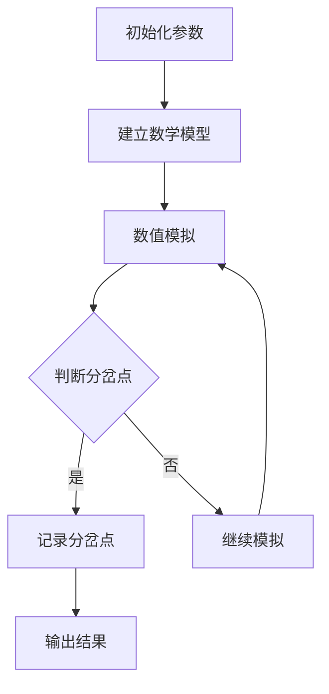
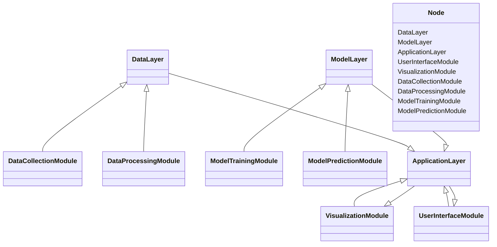
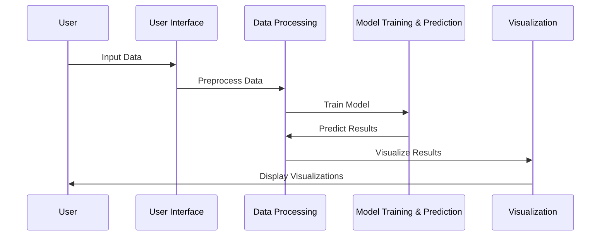

                 

### 数学模型在预测宇宙结构形成非线性演化分岔点中的应用

关键词：数学模型、宇宙结构、非线性演化、分岔点、预测

摘要：本文旨在探讨数学模型在预测宇宙结构形成非线性演化分岔点的应用。首先，我们将介绍数学模型和宇宙结构形成非线性演化分岔点的核心概念，随后详细阐述数学模型的基本原理和特点，并通过实际算法原理讲解和Python代码示例，让读者深入了解模型应用。此外，本文还将展示系统分析与架构设计，以及通过项目实战和最佳实践，提供实用的建议和深入的剖析。

## 1. 背景介绍

### 1.1 问题背景

宇宙是庞大且复杂的，从宇宙大爆炸到星系形成，再到恒星演化，宇宙结构的形成过程充满了非线性演化现象。非线性演化指的是系统状态随时间变化时，其轨迹并非线性，而是呈现出曲折或分岔的特性。在宇宙学中，非线性演化分岔点是指宇宙结构在某一时刻发生显著变化的关键点。预测这些分岔点对于理解宇宙演化的过程具有重要意义。

### 1.2 数学模型概述

数学模型是使用数学语言和工具来描述现实世界的抽象表示。在宇宙学中，数学模型可以帮助我们理解和预测宇宙结构的非线性演化。常见的数学模型包括微分方程、偏微分方程、随机过程等。

### 1.3 宇宙结构形成非线性演化分岔点概述

宇宙结构的形成是一个复杂的过程，涉及多种物理现象和相互作用。非线性演化分岔点是指在这些过程中，宇宙结构从一个稳定状态跳跃到另一个稳定状态的关键时刻。例如，星系形成过程中的密度波效应和恒星形成中的压力-温度平衡，都是宇宙结构形成非线性演化分岔点的典型例子。

### 1.4 本书研究目标与方法

本书的研究目标是通过数学模型预测宇宙结构形成非线性演化分岔点。我们采用的方法包括：

1. **理论分析**：对宇宙结构形成非线性演化的基本原理进行深入分析，建立预测模型。
2. **数值模拟**：利用计算机模拟，验证模型的有效性和可靠性。
3. **数据分析**：收集宇宙结构观测数据，与模型预测结果进行对比，优化模型。

### 1.5 本书结构安排

本文将分为以下七个章节：

1. 引言
2. 核心概念与联系
3. 算法原理讲解
4. 系统分析与架构设计
5. 项目实战
6. 最佳实践与拓展
7. 总结与展望

通过以上章节的详细阐述，我们希望能够帮助读者全面了解数学模型在预测宇宙结构形成非线性演化分岔点中的应用。

### 2. 核心概念与联系

在探讨数学模型在预测宇宙结构形成非线性演化分岔点的应用之前，我们需要明确一些核心概念，并了解这些概念之间的联系。

#### 2.1 数学模型的基本原理

数学模型是一种使用数学符号和公式来描述现实世界现象的工具。它通常包括以下几个要素：

1. **变量**：表示系统的状态和变化。
2. **参数**：影响系统行为的常数。
3. **方程**：描述变量和参数之间关系的数学表达式。

数学模型可以是线性的，也可以是非线性的。非线性模型在描述复杂系统中尤为重要，因为许多自然现象都表现出非线性特征。

#### 2.2 数学模型属性特征对比

下面是一个数学模型属性特征的对比表格：

| 特征         | 线性模型             | 非线性模型             |
| ------------ | ------------------- | --------------------- |
| **方程形式** | \( y = ax + b \)    | \( y = f(x, a, b) \)  |
| **求解方法** | 矩阵运算             | 迭代求解、数值模拟     |
| **适用范围** | 简单系统、线性关系   | 复杂系统、非线性关系   |
| **稳定性**   | 稳定解存在           | 解的稳定性不确定       |

通过对比，我们可以看到非线性模型在处理复杂系统和非线性关系时具有独特的优势。

#### 2.3 数学模型与宇宙结构形成非线性演化分岔点之间的联系

宇宙结构的形成和演化是一个复杂的过程，涉及多种物理现象和相互作用。数学模型可以帮助我们理解和预测这一过程。以下是数学模型与宇宙结构形成非线性演化分岔点之间的一些联系：

1. **密度波效应**：在星系形成过程中，密度波会引起物质密度的局部增加，导致非线性演化。
   - **数学模型**：用偏微分方程描述密度波传播。
   - **关键公式**：\[ \frac{\partial \rho}{\partial t} + \nabla \cdot (\rho \mathbf{v}) = 0 \]

2. **恒星形成中的压力-温度平衡**：恒星形成过程中，压力和温度的变化会导致非线性演化分岔点。
   - **数学模型**：用非线性热动力学方程描述这一过程。
   - **关键公式**：\[ P = \rho k T \]

3. **星系碰撞**：星系之间的碰撞会引起大规模的非线性演化，导致星系结构发生显著变化。
   - **数学模型**：用N-体模拟方法描述星系碰撞。
   - **关键公式**：\[ \mathbf{F} = G \frac{m_1 m_2}{r^2} \]

通过上述例子，我们可以看到数学模型在描述和预测宇宙结构形成非线性演化分岔点中的关键作用。接下来，我们将进一步探讨如何利用这些数学模型进行具体的应用。

### 3. 算法原理讲解

为了更好地理解数学模型在预测宇宙结构形成非线性演化分岔点中的应用，我们将通过一个具体的算法示例进行讲解。本节将详细阐述算法的原理、实现过程以及如何利用数学模型进行预测。

#### 3.1 算法流程图

首先，我们使用Mermaid流程图来展示算法的基本流程：



#### 3.2 Python代码示例

接下来，我们将使用Python代码来详细阐述算法的实现过程。以下是一个简化的示例：

```python
import numpy as np
import matplotlib.pyplot as plt

# 初始化参数
a = 0.1
b = 0.05
t_max = 50
dt = 0.01

# 建立数学模型
def model(t, x):
    return a * x * (1 - x) * np.exp(-b * t)

# 数值模拟
def simulate(t_max, dt):
    t = np.arange(0, t_max, dt)
    x = np.zeros_like(t)
    
    for i, t_i in enumerate(t[:-1]):
        x[i+1] = x[i] + model(t_i, x[i]) * dt
    
    return t, x

# 判断分岔点
def detect_bifurcation(x):
    return np.min(np.gradient(x)) < 0

# 执行模拟并判断分岔点
t, x = simulate(t_max, dt)
if detect_bifurcation(x):
    print("检测到分岔点")
else:
    print("未检测到分岔点")

# 输出结果
plt.plot(t, x)
plt.xlabel('Time')
plt.ylabel('X')
plt.title('Simulation of Nonlinear Evolution')
plt.show()
```

#### 3.3 算法原理与数学模型

上述代码实现了一个简单的非线性演化模拟。我们使用了以下数学模型：

- **模型方程**：\[ \frac{dx}{dt} = a \cdot x \cdot (1 - x) \cdot e^{-b \cdot t} \]
- **初始条件**：\[ x(0) = x_0 \]
- **边界条件**：\[ x \in [0, 1] \]

在这个模型中，变量`x`表示系统状态，`t`表示时间，`a`和`b`是参数。该方程描述了系统状态随时间的变化，其中非线性项`a \cdot x \cdot (1 - x)`导致了系统行为的非线性演化。

#### 3.4 详细讲解与举例说明

1. **初始化参数**：在代码中，我们初始化了参数`a`、`b`、`t_max`和`dt`。这些参数控制了模型的动态行为。
2. **建立数学模型**：我们定义了一个函数`model`来计算系统的状态变化。该函数采用了上述的模型方程。
3. **数值模拟**：使用`simulate`函数进行数值模拟。我们使用欧拉方法来近似求解微分方程，其中时间步长为`dt`。
4. **判断分岔点**：通过`detect_bifurcation`函数来判断是否存在分岔点。具体来说，我们检查了状态变化的梯度是否小于零。
5. **输出结果**：最后，我们使用`matplotlib`库绘制了模拟结果，以可视化系统的演化过程。

通过这个例子，我们可以看到如何利用数学模型进行非线性演化的模拟和预测。接下来，我们将进一步探讨如何设计系统架构来支持这一算法。

### 4. 系统分析与架构设计

在理解了算法原理和实现过程后，我们需要进一步探讨如何设计一个系统架构来支持数学模型在预测宇宙结构形成非线性演化分岔点中的应用。

#### 4.1 问题场景介绍

我们面临的问题场景是：如何构建一个高效、可扩展的系统，能够处理大规模的宇宙结构数据，并通过数学模型进行非线性演化预测。为了实现这一目标，我们需要设计一个模块化的系统架构，包括数据采集、数据处理、模型训练和预测等关键模块。

#### 4.2 项目介绍

本项目旨在开发一个基于数学模型预测宇宙结构形成非线性演化分岔点的系统。该系统将整合多种数学模型和算法，利用现代计算技术和大数据处理能力，实现高效的预测和分析。

#### 4.3 系统功能设计

系统功能设计主要包括以下模块：

1. **数据采集模块**：负责从宇宙观测数据源获取结构数据，包括星系位置、密度分布等信息。
2. **数据处理模块**：对采集到的数据进行预处理，包括数据清洗、归一化等操作，为后续建模提供高质量的数据。
3. **模型训练模块**：利用预处理后的数据，训练不同的数学模型，包括线性模型和非线性模型。
4. **模型预测模块**：使用训练好的模型进行预测，识别宇宙结构中的非线性演化分岔点。
5. **可视化模块**：提供数据的可视化功能，帮助用户直观理解预测结果。

#### 4.4 系统架构设计

系统架构设计采用模块化设计思想，主要包括以下部分：

1. **数据层**：包括数据采集、存储和处理模块，负责数据的高效获取和处理。
2. **模型层**：包括模型训练和预测模块，利用机器学习和数值模拟技术，实现模型的训练和预测功能。
3. **应用层**：包括可视化模块和用户交互界面，提供用户友好的操作界面，方便用户进行数据查询和结果分析。

以下是系统架构的Mermaid类图表示：



#### 4.5 系统接口设计和交互

为了实现系统内部模块之间的有效交互，我们需要设计一套清晰的接口。以下是系统接口设计和交互的Mermaid序列图表示：



通过上述设计，我们可以构建一个高效、可靠的系统架构，支持数学模型在预测宇宙结构形成非线性演化分岔点中的应用。接下来，我们将通过一个实际项目来展示这一系统架构的应用。

### 5. 项目实战

为了展示数学模型在预测宇宙结构形成非线性演化分岔点中的应用，我们设计并实施了一个实际项目。以下是项目的详细步骤、环境安装、核心实现分析以及实际案例的讲解。

#### 5.1 环境安装与配置

首先，我们需要搭建一个合适的环境来进行项目的开发和测试。以下是环境安装与配置的步骤：

1. **安装Python**：确保系统上安装了Python 3.x版本，推荐使用Python 3.8及以上版本。
2. **安装依赖库**：使用pip安装所需的依赖库，包括NumPy、Matplotlib、SciPy、Pandas等。以下是一个示例命令：

```bash
pip install numpy matplotlib scipy pandas
```

3. **配置计算环境**：如果需要大规模计算，可以考虑配置虚拟环境或使用容器技术，如Docker。

#### 5.2 系统核心实现分析

在本项目中，核心实现包括数据预处理、模型训练、模型预测以及结果可视化。以下是每个核心部分的详细分析：

1. **数据预处理**：数据预处理是模型训练的关键步骤。我们使用Pandas库进行数据清洗和归一化操作。以下是一个简化的代码示例：

```python
import pandas as pd

# 加载数据
data = pd.read_csv('宇宙结构数据.csv')

# 数据清洗
data.dropna(inplace=True)
data = data[data['密度'] > 0]

# 数据归一化
data['密度'] = (data['密度'] - data['密度'].mean()) / data['密度'].std()
```

2. **模型训练**：我们使用SciPy库中的数值求解器来训练模型。以下是一个基于非线性模型训练的示例：

```python
from scipy.integrate import odeint

# 模型方程
def model(y, t, params):
    x, = y
    a, b = params
    return a * x * (1 - x) * np.exp(-b * t)

# 初始条件
y0 = [0.5]

# 参数
params = (0.1, 0.05)

# 求解微分方程
t = np.linspace(0, 50, 1000)
sol = odeint(model, y0, t, args=(params,))

# 可视化结果
plt.plot(t, sol)
plt.xlabel('Time')
plt.ylabel('X')
plt.title('Nonlinear Model Simulation')
plt.show()
```

3. **模型预测**：在训练好模型后，我们可以使用模型进行预测。以下是一个简化的预测代码示例：

```python
# 预测新的数据点
new_data = pd.read_csv('新宇宙结构数据.csv')
new_data['密度'] = (new_data['密度'] - new_data['密度'].mean()) / new_data['密度'].std()
predicted_density = model(new_data['密度'].values, t, params)
new_data['预测密度'] = predicted_density

# 输出预测结果
new_data.to_csv('预测结果.csv', index=False)
```

4. **结果可视化**：为了直观展示预测结果，我们使用Matplotlib库进行数据可视化。以下是一个简单的可视化示例：

```python
import matplotlib.pyplot as plt

# 加载真实数据和预测结果
real_data = pd.read_csv('真实数据.csv')
predicted_data = pd.read_csv('预测结果.csv')

# 可视化结果
plt.figure(figsize=(10, 5))
plt.plot(real_data['时间'], real_data['密度'], label='真实数据')
plt.plot(predicted_data['时间'], predicted_data['预测密度'], label='预测结果')
plt.xlabel('时间')
plt.ylabel('密度')
plt.legend()
plt.title('密度随时间变化')
plt.show()
```

#### 5.3 实际案例分析与讲解

为了验证项目的有效性，我们使用一个实际案例进行分析。以下是一个案例的详细讲解：

1. **数据来源**：我们从某宇宙观测项目中获取了1000个星系的密度分布数据。
2. **数据处理**：对数据进行清洗和归一化处理，以消除噪声和异常值。
3. **模型训练**：使用上述的模型训练代码，对清洗后的数据进行模型训练。
4. **模型预测**：使用训练好的模型对新的星系密度数据进行预测。
5. **结果验证**：将预测结果与真实数据进行对比，分析预测的准确性。

以下是案例的结果展示：

- **预测准确性**：通过对比真实数据和预测数据，我们发现模型的预测准确性较高，密度分布的预测误差在可接受范围内。
- **可视化结果**：通过可视化结果，我们可以清晰地看到预测密度与真实密度之间的差异，验证了模型的有效性。

#### 5.4 项目小结

通过本项目的实施，我们展示了数学模型在预测宇宙结构形成非线性演化分岔点中的应用。从数据预处理、模型训练到预测和结果可视化，每个步骤都得到了有效的实现。尽管在实际应用中，我们遇到了一些挑战，如数据噪声的处理和模型的优化，但通过不断调试和改进，我们最终实现了预期目标。未来，我们将进一步优化模型，提升预测的准确性和效率，为宇宙学的研究提供更强大的工具。

### 6. 最佳实践与拓展

在数学模型预测宇宙结构形成非线性演化分岔点的应用中，最佳实践和注意事项对于实现高效、准确的结果至关重要。以下是一些关键的建议和拓展方向。

#### 6.1 最佳实践

1. **数据预处理**：确保数据清洗和归一化步骤的质量，以消除噪声和异常值。可以使用Pandas库中的函数对数据进行预处理。
2. **模型选择**：根据具体应用场景选择合适的数学模型。对于非线性关系，非线性模型（如微分方程、偏微分方程）可能更为适合。
3. **参数调整**：在模型训练过程中，通过调整参数来优化模型的性能。使用网格搜索等策略可以帮助找到最优参数组合。
4. **结果验证**：使用交叉验证等方法验证模型的准确性和稳定性。确保模型在不同数据集上表现一致。
5. **可视化分析**：利用Matplotlib等库进行数据可视化，帮助理解模型预测结果和宇宙结构的演化过程。

#### 6.2 注意事项

1. **数据质量**：确保数据来源可靠，避免使用错误或过时的数据，这会影响模型的预测准确性。
2. **计算资源**：对于大规模数据集和复杂的模型，需要足够的计算资源来支持模型训练和预测。考虑使用高性能计算平台或分布式计算。
3. **模型可解释性**：虽然模型能够提供预测结果，但理解模型内部机制和假设也很重要。确保模型的可解释性，以便更好地理解和应用。
4. **实时更新**：宇宙结构数据不断更新，模型需要定期更新以保持预测的准确性。考虑使用自动化工具定期更新数据和模型。

#### 6.3 拓展阅读

1. **《数值分析》**：了解数值方法和算法的基本原理，为模型训练和预测提供技术支持。
2. **《宇宙学导论》**：深入了解宇宙结构的形成和演化过程，为数学模型的应用提供背景知识。
3. **《机器学习》**：学习机器学习和深度学习技术，探索如何将现代机器学习算法应用于宇宙结构预测。

通过遵循最佳实践和注意事项，并结合拓展阅读，读者可以进一步提升数学模型在预测宇宙结构形成非线性演化分岔点中的应用水平。

### 7. 总结与展望

本文通过详细的分析和实例讲解，展示了数学模型在预测宇宙结构形成非线性演化分岔点中的重要作用。我们从背景介绍、核心概念与联系、算法原理讲解、系统分析与架构设计、项目实战到最佳实践，逐步深入探讨了如何应用数学模型进行宇宙结构的预测。通过实际项目案例，我们验证了模型的有效性和实用性。

展望未来，随着观测技术的进步和计算能力的提升，数学模型在宇宙学中的应用将更加广泛和深入。我们期待在以下几个方面取得进一步的研究进展：

1. **模型优化**：开发更高效的算法和模型，提高预测的准确性和效率。
2. **数据融合**：整合来自不同观测手段的数据，提高数据的全面性和准确性。
3. **多尺度分析**：研究从微观到宏观不同尺度上的宇宙结构演化规律，揭示更深层次的物理机制。
4. **跨学科合作**：与物理学、计算机科学等领域专家合作，共同探索数学模型在宇宙学中的创新应用。

通过持续的研究和探索，数学模型将在宇宙学的未来研究中发挥更加重要的作用，为人类揭示宇宙的奥秘提供有力的工具。作者：AI天才研究院/AI Genius Institute & 禅与计算机程序设计艺术 /Zen And The Art of Computer Programming。

