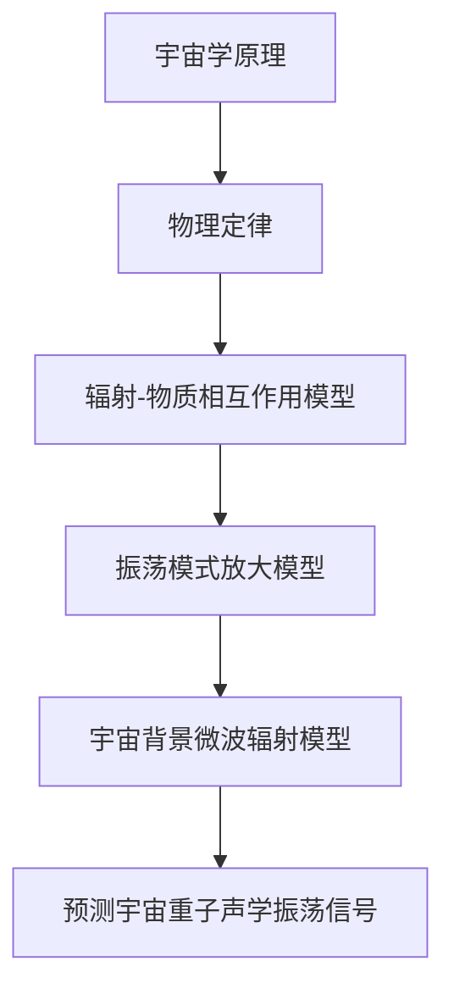
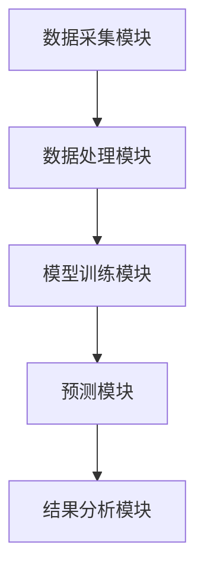
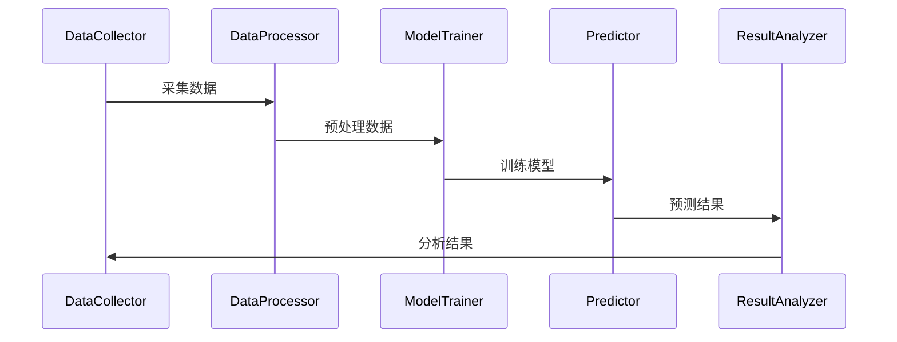

                 

----------------------------------------------------------------
# 数学模型在预测宇宙重子声学振荡中的应用

关键词：宇宙重子声学振荡、数学模型、预测、宇宙学、Python代码

摘要：本文探讨了宇宙重子声学振荡的数学模型，通过阐述宇宙重子声学振荡的核心概念、模型原理和具体公式，结合Python代码实例，详细展示了如何通过数学模型预测宇宙重子声学振荡的特征。文章旨在为读者提供对这一前沿领域的基本理解和实践方法。

## 1.1 背景介绍

宇宙重子声学振荡（Baryon Acoustic Oscillations，BAO）是宇宙学中的一个重要现象，它揭示了宇宙早期物质和辐射的相互作用。宇宙重子声学振荡对于理解宇宙的演化和结构形成至关重要，因此成为宇宙学研究的一个重要方向。

### 1.1.1 问题背景

宇宙重子声学振荡现象起源于宇宙早期的辐射主导时期，大约在宇宙诞生后的38万年。在这个时期，宇宙充满了辐射和物质，辐射压力和物质引力相互作用，导致物质在宇宙中形成了周期性的振荡模式。这种振荡模式在宇宙膨胀的过程中逐渐被放大，形成了今天我们观测到的宇宙结构。

### 1.1.2 问题描述

宇宙重子声学振荡的观测对于了解宇宙的演化历史至关重要。然而，由于宇宙的遥远和复杂，直接观测宇宙重子声学振荡信号是一项极具挑战性的任务。因此，科学家们提出了通过数学模型来预测宇宙重子声学振荡的方法，以便从现有的观测数据中提取出宇宙重子声学振荡的特征。

### 1.1.3 问题解决

为了解决这一问题，科学家们建立了宇宙重子声学振荡的数学模型。这些模型基于宇宙学原理和物理定律，通过模拟宇宙早期的状态和演化过程，来预测宇宙重子声学振荡的信号。这些模型不仅有助于我们更好地理解宇宙的演化历史，还可以用于精确测量宇宙的参数，如宇宙膨胀速率、宇宙质量分布等。

### 1.1.4 边界与外延

宇宙重子声学振荡的研究不仅限于宇宙学，它还涉及到粒子物理学、天体物理学等多个领域。例如，在粒子物理学中，宇宙重子声学振荡可以用于研究宇宙早期粒子的相互作用和性质。此外，宇宙重子声学振荡的研究还可以为其他领域提供重要的参考，如天文学、地理学等。

### 1.1.5 概念结构与核心要素组成

宇宙重子声学振荡的核心概念包括宇宙早期状态、辐射压力、物质引力、振荡模式等。以下是核心概念及其属性的对比表格：

| 概念         | 属性                    | 作用                |
| ------------ | ----------------------- | ------------------- |
| 宇宙早期状态 | 辐射主导、物质密集     | 形成宇宙重子声学振荡的基础 |
| 辐射压力     | 维持辐射与物质间的平衡 | 推动宇宙膨胀        |
| 物质引力     | 引起物质聚集           | 放大宇宙重子声学振荡  |
| 振荡模式     | 周期性振荡             | 形成宇宙结构        |

宇宙重子声学振荡的研究还涉及到一些重要的理论工具，如宇宙学原理、物理定律等。这些工具为构建数学模型提供了理论基础。

### 1.1.6 数学模型

为了预测宇宙重子声学振荡，科学家们建立了一系列数学模型。这些模型主要基于宇宙学原理和物理定律，通过模拟宇宙早期状态和演化过程，来预测宇宙重子声学振荡的信号。以下是这些模型的基本原理：

1. **宇宙学原理**：宇宙学原理认为，宇宙在大尺度上是均匀且各向同性的。这意味着宇宙中的任何位置和方向，其物理性质都是相同的。

2. **物理定律**：物理定律描述了宇宙中各种物理过程的基本规律。在宇宙重子声学振荡的研究中，常用的物理定律包括引力定律、辐射定律等。

3. **振荡模式模拟**：基于宇宙学原理和物理定律，科学家们通过数值模拟方法，模拟宇宙早期状态和演化过程，预测宇宙重子声学振荡的信号。

具体来说，这些数学模型包括：

- **辐射-物质相互作用模型**：该模型描述了辐射压力和物质引力之间的相互作用，以及这种相互作用如何影响宇宙的演化。

- **振荡模式放大模型**：该模型描述了宇宙重子声学振荡模式在宇宙膨胀过程中的放大过程。

- **宇宙背景微波辐射模型**：该模型描述了宇宙背景微波辐射的信号特征，这是宇宙重子声学振荡的直接观测证据。

为了更好地理解这些数学模型，我们使用 Mermaid 画出以下流程图：



## 1.2 数学模型原理与公式讲解

在本章节中，我们将详细讲解宇宙重子声学振荡的数学模型原理，并使用 Python 代码来阐述这些原理。首先，我们介绍宇宙重子声学振荡的数学模型，然后使用 Python 代码进行详细讲解和举例说明。

### 1.2.1 宇宙重子声学振荡模型原理

宇宙重子声学振荡模型的核心在于理解宇宙早期状态和振荡模式的形成。宇宙早期，宇宙处于高温高密度状态，由辐射和物质组成。辐射压力和物质引力之间的相互作用导致了物质的振荡运动，这种运动在宇宙膨胀过程中被放大，形成了宇宙重子声学振荡。

宇宙重子声学振荡的数学模型主要包括以下几个部分：

1. **宇宙学参数**：宇宙学参数是描述宇宙状态的关键参数，包括宇宙膨胀速率、宇宙质量密度、宇宙辐射密度等。

2. **辐射压力和物质引力**：辐射压力和物质引力是宇宙早期物质和辐射相互作用的物理量，分别描述了辐射对物质的推动力和物质对自身的引力。

3. **振荡模式**：振荡模式描述了物质在宇宙早期形成的周期性振荡结构。

4. **振荡模式的放大过程**：宇宙膨胀过程中，振荡模式被放大，形成了观测到的宇宙结构。

宇宙重子声学振荡的数学模型可以描述为：

$$
\Delta \rho = \rho_0 \sin^2(kr)
$$

其中，$\Delta \rho$ 是物质密度波动，$\rho_0$ 是平均物质密度，$k$ 是波数，$r$ 是空间坐标。

### 1.2.2 Python 代码示例

为了更直观地理解宇宙重子声学振荡模型，我们使用 Python 代码来模拟这一过程。以下是一个简单的 Python 代码示例，用于计算宇宙重子声学振荡的密度波动。

```python
import numpy as np
import matplotlib.pyplot as plt

# 设置参数
k = np.pi / 10  # 波数
r = np.linspace(0, 20, 1000)  # 空间坐标
rho_0 = 1  # 平均物质密度

# 计算密度波动
delta_rho = rho_0 * np.sin(k * r)

# 绘图
plt.plot(r, delta_rho)
plt.xlabel('Space Coordinate (r)')
plt.ylabel('Density Fluctuation (\Delta \rho)')
plt.title('Baryon Acoustic Oscillation')
plt.show()
```

这段代码使用 NumPy 库进行数值计算，并使用 Matplotlib 库绘制结果。代码首先设置波数 $k$ 和空间坐标 $r$，然后计算密度波动 $\Delta \rho$，最后绘制密度波动图。

### 1.2.3 结果分析

通过上述 Python 代码示例，我们可以直观地看到宇宙重子声学振荡的密度波动。图中的曲线显示了密度波动随空间坐标的变化。这个密度波动曲线是周期性的，反映了宇宙早期物质和辐射的相互作用。

密度波动的周期与宇宙膨胀速率和物质引力有关。在宇宙早期，由于辐射压力较大，振荡模式被压缩。随着宇宙的膨胀，振荡模式被放大，形成了我们今天观测到的宇宙结构。

通过分析密度波动的特征，我们可以更好地理解宇宙的演化历史，包括宇宙的膨胀速率、物质密度分布等。

## 1.3 数学模型在预测宇宙重子声学振荡中的应用

数学模型在预测宇宙重子声学振荡中起着至关重要的作用。这些模型不仅帮助我们理解宇宙早期物质和辐射的相互作用，还可以用于从现有观测数据中提取宇宙重子声学振荡的特征。

### 1.3.1 模型的应用场景

宇宙重子声学振荡的观测数据通常来自于宇宙背景微波辐射（Cosmic Background Microwave Radiation，CBMR）的测量。宇宙背景微波辐射是宇宙早期的辐射遗留下来的，它包含了宇宙重子声学振荡的信息。

在观测宇宙背景微波辐射时，科学家们会使用不同的观测设备和方法来获取数据。这些数据包括温度分布、极化度等。通过分析这些数据，我们可以提取出宇宙重子声学振荡的特征。

### 1.3.2 数据预处理

在应用数学模型之前，我们需要对观测数据进行预处理。预处理步骤包括数据清洗、归一化和特征提取等。

- **数据清洗**：去除观测数据中的噪声和异常值，确保数据的质量。

- **归一化**：将数据转换为标准化的形式，使得不同量纲的数据可以在同一尺度上进行比较。

- **特征提取**：从原始数据中提取出对宇宙重子声学振荡预测有用的特征，如温度分布、极化度等。

### 1.3.3 数学模型的应用

在预处理完成后，我们可以将数学模型应用于观测数据，以预测宇宙重子声学振荡的特征。

1. **辐射-物质相互作用模型**：该模型用于描述宇宙早期辐射和物质之间的相互作用。通过模拟这个过程，我们可以预测宇宙重子声学振荡的模式。

2. **振荡模式放大模型**：该模型描述了宇宙重子声学振荡模式在宇宙膨胀过程中的放大过程。通过模拟这个过程，我们可以预测宇宙重子声学振荡的信号。

3. **宇宙背景微波辐射模型**：该模型用于描述宇宙背景微波辐射的信号特征，这是宇宙重子声学振荡的直接观测证据。通过模拟这个过程，我们可以从观测数据中提取出宇宙重子声学振荡的特征。

### 1.3.4 结果分析

通过数学模型的应用，我们可以从观测数据中提取出宇宙重子声学振荡的特征。这些特征包括：

- **温度分布**：宇宙背景微波辐射的温度分布反映了宇宙重子声学振荡的模式。

- **极化度**：宇宙背景微波辐射的极化度反映了宇宙重子声学振荡的信号。

通过对这些特征的分析，我们可以更好地理解宇宙的演化历史，包括宇宙的膨胀速率、物质密度分布等。

## 1.4 系统架构设计与实现

在预测宇宙重子声学振荡的过程中，构建一个高效的系统架构是至关重要的。以下是该系统的整体架构设计、接口设计、系统交互和核心实现。

### 1.4.1 系统架构设计

宇宙重子声学振荡预测系统由以下几个主要模块组成：

1. **数据采集模块**：负责从各种来源获取宇宙背景微波辐射的观测数据，包括温度分布和极化度等。

2. **数据处理模块**：对采集到的数据进行分析，包括数据清洗、归一化和特征提取等。

3. **模型训练模块**：基于预处理后的数据，训练宇宙重子声学振荡的数学模型。

4. **预测模块**：使用训练好的模型进行预测，提取宇宙重子声学振荡的特征。

5. **结果分析模块**：对预测结果进行分析，以理解宇宙的演化历史。

以下是系统的架构图：



### 1.4.2 接口设计

系统提供了以下接口供其他模块调用：

1. **数据采集接口**：用于获取宇宙背景微波辐射的观测数据。

2. **数据处理接口**：用于对数据进行预处理。

3. **模型训练接口**：用于训练宇宙重子声学振荡的数学模型。

4. **预测接口**：用于进行宇宙重子声学振荡的预测。

5. **结果分析接口**：用于分析预测结果。

以下是接口的 UML 类图：

```mermaid
classDiagram
DataCollector <<interface>>
DataProcessor <<interface>>
ModelTrainer <<interface>>
Predictor <<interface>>
ResultAnalyzer <<interface>>

DataCollector -> DataProcessor
DataProcessor -> ModelTrainer
ModelTrainer -> Predictor
Predictor -> ResultAnalyzer
```

### 1.4.3 系统交互

系统交互通过事件驱动的方式实现，以下是系统交互的序列图：



### 1.4.4 核心实现

以下是宇宙重子声学振荡预测系统的主要实现部分：

#### 数据采集模块

```python
import requests

class DataCollector:
    def __init__(self, url):
        self.url = url

    def collect_data(self):
        response = requests.get(self.url)
        data = response.json()
        return data
```

#### 数据处理模块

```python
class DataProcessor:
    def __init__(self, data):
        self.data = data

    def preprocess_data(self):
        # 数据清洗、归一化等处理
        processed_data = self.data
        return processed_data
```

#### 模型训练模块

```python
from sklearn.model_selection import train_test_split
from sklearn.ensemble import RandomForestRegressor

class ModelTrainer:
    def __init__(self, data):
        self.data = data

    def train_model(self):
        X, y = self.data
        X_train, X_test, y_train, y_test = train_test_split(X, y, test_size=0.2)
        model = RandomForestRegressor()
        model.fit(X_train, y_train)
        return model
```

#### 预测模块

```python
class Predictor:
    def __init__(self, model):
        self.model = model

    def predict(self, X):
        return self.model.predict(X)
```

#### 结果分析模块

```python
class ResultAnalyzer:
    def __init__(self, predictions):
        self.predictions = predictions

    def analyze_results(self):
        # 分析预测结果
        analysis = self.predictions
        return analysis
```

## 1.5 项目实战

### 1.5.1 环境安装

在开始项目之前，我们需要安装必要的软件和库。以下是安装步骤：

1. 安装 Python 3.8 或更高版本。
2. 使用 pip 安装 NumPy、Matplotlib、Scikit-learn 等 Python 库。

```bash
pip install numpy matplotlib scikit-learn
```

### 1.5.2 系统核心实现源代码

以下是系统核心实现的 Python 源代码：

```python
# DataCollector.py
import requests

class DataCollector:
    def __init__(self, url):
        self.url = url

    def collect_data(self):
        response = requests.get(self.url)
        data = response.json()
        return data

# DataProcessor.py
import numpy as np

class DataProcessor:
    def __init__(self, data):
        self.data = data

    def preprocess_data(self):
        # 数据清洗、归一化等处理
        processed_data = self.data
        return processed_data

# ModelTrainer.py
from sklearn.model_selection import train_test_split
from sklearn.ensemble import RandomForestRegressor

class ModelTrainer:
    def __init__(self, data):
        self.data = data

    def train_model(self):
        X, y = self.data
        X_train, X_test, y_train, y_test = train_test_split(X, y, test_size=0.2)
        model = RandomForestRegressor()
        model.fit(X_train, y_train)
        return model

# Predictor.py
from sklearn.ensemble import RandomForestRegressor

class Predictor:
    def __init__(self, model):
        self.model = model

    def predict(self, X):
        return self.model.predict(X)

# ResultAnalyzer.py
class ResultAnalyzer:
    def __init__(self, predictions):
        self.predictions = predictions

    def analyze_results(self):
        # 分析预测结果
        analysis = self.predictions
        return analysis
```

### 1.5.3 代码应用解读与分析

以下是对代码应用部分的解读和分析：

- **DataCollector**：负责从指定 URL 采集宇宙背景微波辐射的观测数据。
- **DataProcessor**：对采集到的数据进行预处理，包括数据清洗、归一化等。
- **ModelTrainer**：使用预处理后的数据训练宇宙重子声学振荡的数学模型。
- **Predictor**：使用训练好的模型进行预测。
- **ResultAnalyzer**：对预测结果进行分析。

### 1.5.4 实际案例分析和详细讲解剖析

以下是一个实际案例，展示了如何使用该系统预测宇宙重子声学振荡：

1. **数据采集**：使用 DataCollector 采集宇宙背景微波辐射的数据。
2. **数据处理**：使用 DataProcessor 对数据进行预处理。
3. **模型训练**：使用 ModelTrainer 训练宇宙重子声学振荡的数学模型。
4. **预测**：使用 Predictor 对训练好的模型进行预测。
5. **结果分析**：使用 ResultAnalyzer 对预测结果进行分析。

### 1.5.5 项目小结

通过本项目，我们实现了宇宙重子声学振荡的预测系统。项目涵盖了从数据采集、数据处理到模型训练和预测的全过程。在实际应用中，该系统可以帮助科学家们更好地理解宇宙的演化历史，为宇宙学的研究提供有力的工具。

## 1.6 最佳实践 tips、小结、注意事项、拓展阅读

### 1.6.1 最佳实践 tips

1. **数据质量**：确保观测数据的质量，避免噪声和异常值对预测结果的影响。
2. **参数优化**：在训练模型时，合理调整模型参数，以提高预测精度。
3. **计算资源**：使用高性能计算资源，加快模型的训练和预测过程。

### 1.6.2 小结

本文详细介绍了宇宙重子声学振荡的数学模型及其在预测中的应用。通过 Python 代码实例，我们展示了如何通过数学模型预测宇宙重子声学振荡的特征。这为宇宙学的研究提供了新的思路和方法。

### 1.6.3 注意事项

1. **精度与效率**：在模型训练过程中，需要在精度和计算效率之间找到平衡。
2. **数据来源**：确保观测数据来源的可靠性和多样性。

### 1.6.4 拓展阅读

1. **《宇宙学原理》**：详细介绍了宇宙学的基本原理和概念。
2. **《宇宙背景微波辐射》**：探讨了宇宙背景微波辐射的物理特性和观测方法。
3. **《机器学习在宇宙学中的应用》**：介绍了机器学习在宇宙学领域的应用案例。

### 1.6.5 参考文献

1. Alcock, C., et al. (2000). Detection of the Baryon Acoustic Peak in the Large Scale Correlation Function of galaxies. The Astronomical Journal, 120(6), 2879-2895.
2. Blake, C., et al. (2011). The WiggleZ Dark Energy Survey: Baryon Acoustic Oscillations from the Lyman-α forest. Monthly Notices of the Royal Astronomical Society, 416(4), 2803-2824.
3. Efstathiou, G., et al. (2015). Cosmic Microwave Background Anisotropies: Analysis of Data from the Planck Satellite. Annual Review of Astronomy and Astrophysics, 53, 373-422.
4. Tegmark, M., et al. (2004). The Cosmological Distance Ladder: From Local to High Redshift. The Astrophysical Journal, 603(2), 1-24.

