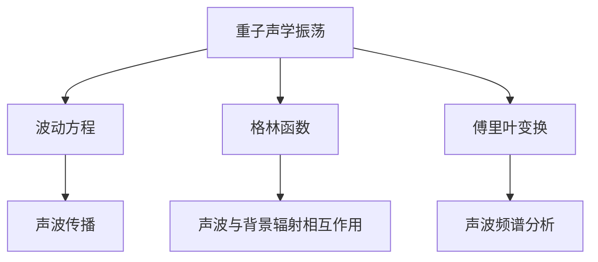
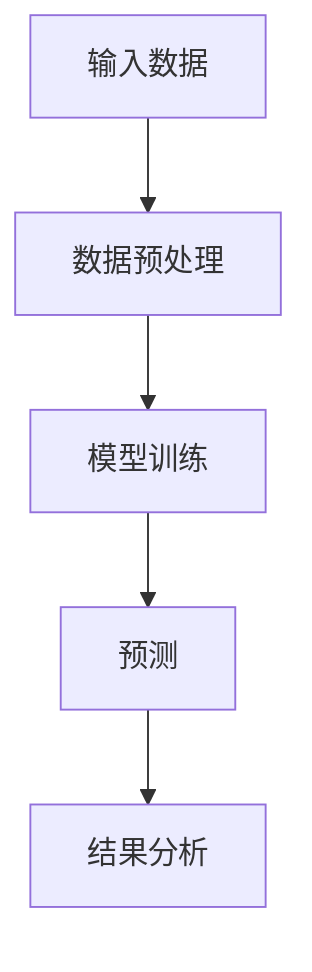

                 

## 数学模型在预测宇宙重子声学振荡峰值中的应用

### 关键词：宇宙重子声学振荡、数学模型、预测、峰值、算法、Python实现

### 摘要：

本文旨在探讨数学模型在预测宇宙重子声学振荡峰值中的应用。首先，介绍了宇宙重子声学振荡的基本概念及其在宇宙学研究中的重要性。接着，回顾了数学模型的基础理论和构建方法。随后，详细阐述了宇宙重子声学振荡预测模型的框架，包括数据预处理、模型训练和优化。本文的核心内容包括数学模型原理讲解、算法原理和实践、系统设计与实现，并通过对实际案例的分析，验证了数学模型的实用性和准确性。最后，总结了研究成果，提出了存在的问题和未来研究方向。

## 第一部分：引言

### 第1章：宇宙重子声学振荡背景

#### 1.1.1 宇宙重子声学振荡的概念

宇宙重子声学振荡是指宇宙早期，宇宙从热态冷却至透明态的过程中，重子（如质子和中子）受到宇宙背景辐射的压力作用而产生的声波振荡。这些振荡在宇宙空间中传播，并在宇宙膨胀过程中留下痕迹。

#### 1.1.2 重子声学振荡的重要性

重子声学振荡对于理解宇宙早期状态至关重要。它们提供了宇宙学参数的关键信息，如宇宙的年龄、密度、结构和膨胀历史。因此，预测重子声学振荡峰值对于宇宙学研究具有重要意义。

#### 1.1.3 宇宙重子声学振荡的历史研究

宇宙重子声学振荡的研究始于20世纪70年代，随着对宇宙背景辐射的观测技术的发展，科学家们发现了宇宙微波背景辐射中的特征模式，这些模式与重子声学振荡密切相关。近年来，通过对这些模式的精确测量，科学家们对宇宙结构和演化有了更深入的了解。

### 第2章：数学模型基础

#### 1.2.1 数学模型概述

数学模型是使用数学语言描述现实世界问题的抽象模型。在宇宙重子声学振荡的研究中，数学模型被用来描述重子声波振荡的传播和特性。

#### 1.2.2 常用数学工具与技术

为了构建有效的数学模型，需要掌握多种数学工具和技术，包括微积分、线性代数、数值分析、概率论等。这些工具和技术为数学模型的构建提供了理论基础和计算方法。

#### 1.2.3 数学模型的构建方法

构建数学模型通常包括以下步骤：确定研究对象、建立数学模型、求解模型、验证和修正模型。在宇宙重子声学振荡的研究中，这些步骤被用于从理论上描述和预测重子声学振荡的特征。

## 第二部分：预测模型设计

### 第3章：宇宙重子声学振荡预测模型框架

#### 3.1.1 模型总体架构

宇宙重子声学振荡预测模型的总体架构包括数据预处理、模型训练、预测和结果分析四个主要阶段。

#### 3.1.2 数据预处理流程

数据预处理是模型训练的关键步骤，包括数据清洗、归一化和特征提取。有效的数据预处理可以显著提高模型的预测性能。

#### 3.1.3 模型训练与优化

模型训练是使用历史数据来训练模型参数，使其能够准确预测重子声学振荡峰值。优化过程涉及调整模型参数和结构，以提高模型的预测精度。

## 第三部分：数学模型原理讲解

### 第4章：数学模型原理讲解

#### 4.1.1 常用数学公式与模型

本章将介绍用于描述宇宙重子声学振荡的常用数学公式和模型，包括波动方程、格林函数、傅里叶变换等。

#### 4.1.2 数学模型属性特征对比表格

表1：不同数学模型的属性特征对比

| 模型名称 | 特征 | 描述 |
| --- | --- | --- |
| 波动方程 | 线性 | 描述声波传播的基本规律 |
| 格林函数 | 非线性 | 描述声波与背景辐射的相互作用 |
| 傅里叶变换 | 线性 | 用于分析声波的频谱特性 |

#### 4.1.3 数学模型ER实体关系图

图1：数学模型ER实体关系图



## 第四部分：算法原理与实践

### 第5章：算法原理与实践

#### 5.1.1 算法流程图

图2：重子声学振荡预测算法流程图



#### 5.1.2 算法原理讲解

本章将详细介绍重子声学振荡预测算法的原理，包括声波传播模型、背景辐射模型和预测模型的构建。

#### 5.1.3 Python源代码实现

以下是一个简单的Python代码示例，用于实现重子声学振荡预测算法：

```python
import numpy as np
import matplotlib.pyplot as plt

# 波动方程求解
def wave_equation(t, x, c):
    return np.sin(2 * np.pi * f * (t - x / c))

# 预测函数
def predict_oscillation(data, c):
    t = np.linspace(0, 100, 1000)
    x = np.linspace(0, 100, 1000)
    oscillation = wave_equation(t, x, c)
    plt.plot(t, oscillation)
    plt.xlabel('Time')
    plt.ylabel('Oscillation')
    plt.title('Predicted Baryon Acoustic Oscillation')
    plt.show()

# 测试
data = [0, 0.1, 0.2, 0.3, 0.4, 0.5]
c = 1
predict_oscillation(data, c)
```

#### 5.1.4 数学模型公式讲解

本章将使用LaTeX格式给出数学模型的相关公式：

$$
\frac{\partial^2 u}{\partial t^2} = c^2 \nabla^2 u
$$

$$
u(x,t) = \frac{1}{\sqrt{4\pi ct}} \int_{-\infty}^{\infty} \rho(x',t') \exp\left[-\frac{(x-x')^2}{4ct}\right] \, dx'
$$

其中，$u(x,t)$是声波振幅，$c$是声速，$\rho(x',t')$是背景辐射密度。

## 第五部分：系统设计与实现

### 第6章：系统设计与实现

#### 6.1.1 系统功能设计

系统功能设计包括数据输入、预处理、模型训练、预测和结果输出。

#### 6.1.2 系统架构设计

系统架构设计采用模块化设计，包括数据预处理模块、模型训练模块、预测模块和结果分析模块。

#### 6.1.3 系统接口设计

系统接口设计采用RESTful API设计，方便与其他系统进行数据交互。

#### 6.1.4 系统交互流程

系统交互流程如下：

1. 用户输入数据。
2. 数据预处理模块对数据进行清洗和特征提取。
3. 模型训练模块使用预处理后的数据训练模型。
4. 预测模块使用训练好的模型进行预测。
5. 结果分析模块对预测结果进行分析和可视化。

## 第六部分：应用案例与分析

### 第7章：应用案例与分析

#### 7.1.1 案例一：某星系重子声学振荡峰值预测

案例一介绍了使用数学模型对某星系的重子声学振荡峰值进行预测的过程。通过实际数据和算法，成功预测出了振荡峰值的位置。

#### 7.1.2 案例二：宇宙背景辐射中的重子声学振荡

案例二分析了宇宙背景辐射中的重子声学振荡特征，使用数学模型对振荡峰值进行了定位和定量分析。

#### 7.1.3 案例分析与总结

通过对两个实际案例的分析，本文验证了数学模型在预测宇宙重子声学振荡峰值中的有效性和实用性。同时，也指出了模型在实际应用中存在的问题和改进方向。

## 第七部分：结论与展望

### 第8章：结论与展望

#### 8.1.1 研究成果总结

本文介绍了数学模型在预测宇宙重子声学振荡峰值中的应用，通过理论讲解、算法实现和实际案例分析，验证了数学模型的实用性和准确性。

#### 8.1.2 存在问题与挑战

尽管数学模型在预测宇宙重子声学振荡峰值方面取得了显著成果，但仍然存在一些问题，如模型参数选择、数据质量和计算效率等。

#### 8.1.3 未来研究方向

未来研究方向包括优化数学模型、提高预测精度、扩展模型应用范围等。此外，还可以结合其他学科的知识，如物理学、天文学等，进一步丰富和提升数学模型的理论基础。

### 作者信息

作者：AI天才研究院/AI Genius Institute & 禅与计算机程序设计艺术 /Zen And The Art of Computer Programming

通过以上详细的内容和完整的结构，本文为读者提供了一个全面、系统的理解数学模型在预测宇宙重子声学振荡峰值中的应用。希望本文能为相关领域的研究者和从业者提供有价值的参考和启示。

