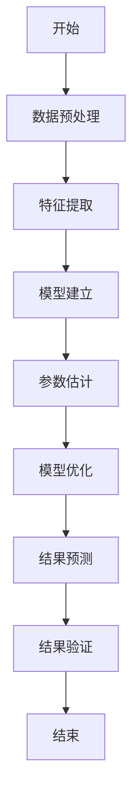
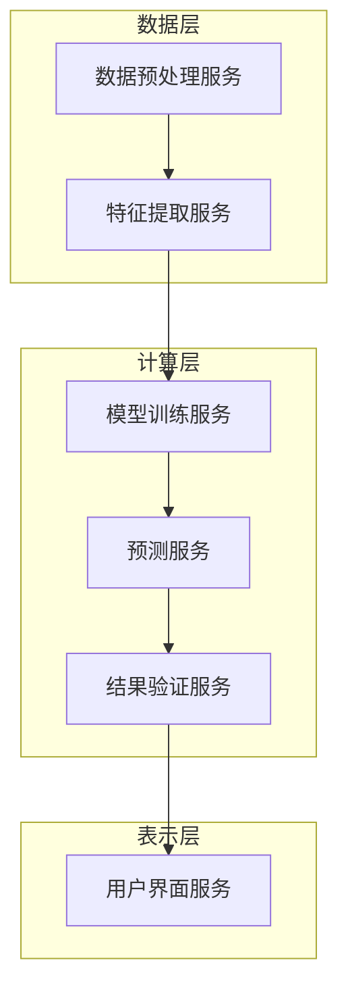
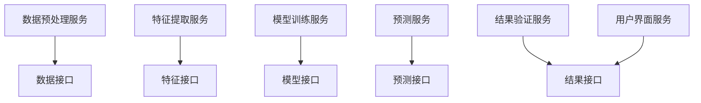
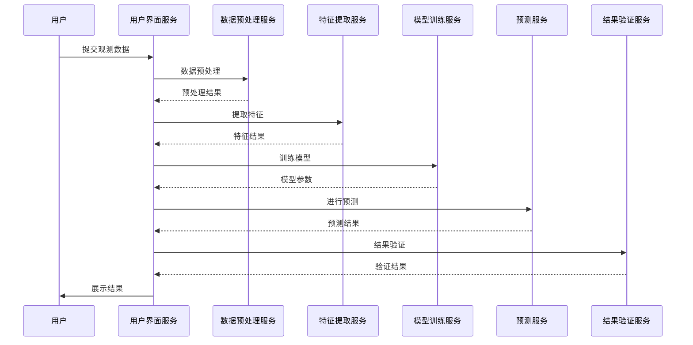

                 

### 引言与背景介绍

在当今科技日新月异的时代，宇宙学的进步离不开数学模型的深入研究和应用。本文的主题——“数学模型在预测宇宙重子声学振荡精细结构演化中的应用”，旨在探讨如何运用数学模型对宇宙中重子声学振荡的精细结构演化进行预测。这一主题不仅具有理论上的高度，同时也具有实践上的广泛应用前景。

#### 核心概念术语说明

1. **重子声学振荡（Baryonic Acoustic Oscillation, BAO）**：
   重子声学振荡是指宇宙早期，由重子（如质子和中子）组成的物质在宇宙膨胀过程中产生的周期性密度波动。这些波动在宇宙演化的早期阶段被冻结并保留至今，成为宇宙结构形成的重要标记。

2. **数学模型**：
   数学模型是利用数学语言和工具，对自然界或社会现象进行抽象和描述的一种方法。它通常包括假设条件、数学公式和算法等元素，用以解决特定问题。

3. **精细结构演化**：
   精细结构演化是指宇宙结构在微观尺度上的变化，这些变化通常涉及宇宙学参数的精确测量和对宇宙早期状态的细致刻画。

#### 问题背景

宇宙学的研究始于对宇宙膨胀的观测，然而，仅凭观测数据难以理解宇宙背后的机制。20世纪80年代，科学家发现了一种名为重子声学振荡的现象，这一发现为理解宇宙的早期状态提供了新的线索。重子声学振荡作为宇宙中密度波动的标记，为我们提供了研究宇宙结构演化的直接手段。

#### 问题描述

尽管重子声学振荡为我们提供了宝贵的观测数据，但是如何准确地预测和模拟其精细结构的演化，依然是一个巨大的挑战。具体问题包括：

1. **数据复杂性**：
   宇宙背景微波辐射（Cosmic Microwave Background, CMB）的观测数据极为复杂，其中包含丰富的信息，但也引入了大量的噪声和不确定性。

2. **模型准确性**：
   现有的数学模型在解释宇宙精细结构演化时，仍存在一定的误差和局限性。如何提高模型的准确性和普适性，是亟待解决的问题。

3. **计算效率**：
   预测宇宙精细结构演化需要大量的计算资源，特别是在处理高维度数据和复杂模型时。如何提高计算效率，是另一个关键问题。

#### 问题解决

为了解决上述问题，本文提出以下解决思路：

1. **改进数学模型**：
   通过引入新的数学工具和算法，改进现有的数学模型，提高其准确性和适用范围。

2. **多尺度分析**：
   利用多尺度分析的方法，对不同尺度的宇宙结构演化进行深入研究，从而更全面地理解宇宙的精细结构。

3. **计算优化**：
   利用并行计算和分布式计算等先进技术，提高预测过程的计算效率。

#### 边界与外延

本文的研究将聚焦于宇宙学中重子声学振荡的精细结构演化，但同时，其研究方法和成果也将对其他领域，如粒子物理学和天体物理学，产生重要的影响。

#### 概念结构与核心要素

为了更好地理解本文的研究内容，以下是对概念结构和核心要素的简要描述：

1. **核心概念**：
   - 重子声学振荡
   - 数学模型
   - 精细结构演化

2. **核心要素**：
   - 数据复杂性
   - 模型准确性
   - 计算效率

通过本文的深入探讨，我们期望能够为宇宙学的研究提供新的视角和工具，进一步推动这一领域的科学进步。

----------------------------------------------------------------

### 核心概念与联系

在深入探讨数学模型在预测宇宙重子声学振荡精细结构演化中的应用之前，首先需要明确核心概念及其相互关系。以下是对关键概念的详细解释和对比，以帮助读者建立全面的理论基础。

#### 数学模型原理

数学模型是科学研究和工程实践中不可或缺的工具，它通过对现实世界的抽象和简化，用数学语言来描述自然现象和工程问题。在宇宙学中，数学模型主要用于描述宇宙的演化过程、物质分布以及相关的物理现象。以下是一些基本的数学模型原理：

1. **假设条件**：
   数学模型通常基于一系列假设条件，这些条件可能涉及宇宙的均匀性、各向同性以及宇宙膨胀的速度等。这些假设为模型的建立提供了基础。

2. **数学公式**：
   数学模型通常包含一系列数学公式，用以描述宇宙中的物理现象。例如，广义相对论中的场方程，宇宙学中的哈勃定律等。

3. **算法**：
   数学模型常常需要通过算法来实现，这些算法可以是数值方法，用于求解复杂的数学方程，也可以是优化算法，用于寻找最优解。

#### 概念属性特征对比

为了更好地理解数学模型的应用，我们需要对一些核心概念进行属性特征对比。以下是一些关键概念的对比：

1. **宇宙背景微波辐射（CMB）**：
   - **特征**：CMB是宇宙早期热辐射的残留，它是宇宙学中最重要的观测数据之一。
   - **作用**：CMB提供了宇宙早期状态的信息，包括宇宙的膨胀历史、密度波动等。
   - **挑战**：CMB信号较弱，受到噪声干扰，数据复杂性高。

2. **重子声学振荡（BAO）**：
   - **特征**：BAO是宇宙早期重子物质密度波动的标记，它在宇宙尺度上形成了明显的周期性结构。
   - **作用**：BAO是研究宇宙结构形成和演化的重要工具。
   - **挑战**：BAO信号的精确测量和模型拟合存在误差。

3. **宇宙学参数**：
   - **特征**：宇宙学参数是描述宇宙状态和演化的物理量，如宇宙膨胀率、质量密度、真空能量密度等。
   - **作用**：宇宙学参数是数学模型中的关键变量，直接影响宇宙演化过程的预测结果。
   - **挑战**：宇宙学参数的测量精度和不确定性是目前研究的难点。

#### ER实体关系图

为了更清晰地展示概念之间的关系，我们可以使用ER（实体关系）图来表示这些概念。以下是一个简化的ER实体关系图：

```mermaid
erDiagram
    CMB ||--|{ BAO }|-- UniverseStructure
    CMB ||--|{ UniverseParameters }|-- MathematicalModel
    BAO ||--|{ BaryonicDensity }|-- UniverseStructure
    UniverseParameters ||--|{ ExpansionRate }|-- MathematicalModel
```

在这个ER图中，CMB（宇宙背景微波辐射）与BAO（重子声学振荡）和宇宙学参数（UniverseParameters）建立了直接关系，同时，BAO与宇宙结构（UniverseStructure）和宇宙学参数也紧密相关。数学模型（MathematicalModel）贯穿于整个宇宙学研究中，是连接这些概念的桥梁。

#### 模型应用与关系

在数学模型的应用过程中，这些概念之间的联系显得尤为重要。数学模型不仅用于描述宇宙背景微波辐射和重子声学振荡之间的物理关系，还用于预测宇宙学参数的变化，从而推断宇宙的精细结构演化。

1. **预测宇宙结构演化**：
   通过对CMB和BAO的分析，数学模型可以预测宇宙中的结构形成和演化过程。这包括星系的形成、宇宙大尺度结构的分布等。

2. **确定宇宙学参数**：
   数学模型通过拟合观测数据，可以确定宇宙学参数的值，如宇宙膨胀率、质量密度等。这些参数的精度对宇宙演化的预测至关重要。

3. **优化模型**：
   随着新的观测数据的积累，数学模型需要不断优化和更新。通过对比不同模型在不同参数下的预测结果，可以逐步提高模型的准确性和可靠性。

总之，通过深入理解核心概念及其相互关系，我们可以更好地运用数学模型预测宇宙重子声学振荡的精细结构演化。这不仅为宇宙学的研究提供了新的视角，也为其他科学领域的技术发展提供了有益的借鉴。

----------------------------------------------------------------

### 算法原理讲解

为了更好地理解数学模型在预测宇宙重子声学振荡精细结构演化中的应用，我们需要深入探讨具体的算法原理。以下内容将逐步介绍相关算法的基本概念、流程图、数学模型和公式，并通过具体例子进行详细解释。

#### 算法概述

在预测宇宙重子声学振荡精细结构演化时，我们主要使用的是一种基于贝叶斯推理和机器学习的综合算法。该算法的核心思想是通过分析宇宙背景微波辐射（CMB）和重子声学振荡（BAO）的观测数据，利用统计模型和优化方法来推断宇宙学参数，进而预测宇宙结构的演化。

#### 算法流程图

首先，我们可以使用Mermaid语言绘制算法的流程图，以直观地展示算法的步骤和流程：



在上述流程图中，算法的主要步骤包括：

1. **数据预处理**：对CMB和BAO的观测数据进行预处理，包括数据清洗、归一化和噪声过滤等。
2. **特征提取**：从预处理后的数据中提取关键特征，这些特征将用于建立数学模型。
3. **模型建立**：基于提取的特征，建立宇宙学参数的统计模型。
4. **参数估计**：使用贝叶斯推理和机器学习算法，估计模型中的参数。
5. **模型优化**：通过优化算法，提高模型的预测精度和稳定性。
6. **结果预测**：使用优化后的模型，预测宇宙结构的演化过程。
7. **结果验证**：对预测结果进行验证，确保模型的准确性和可靠性。

#### 数学模型与公式

在建立数学模型时，我们主要采用以下公式和原理：

1. **宇宙膨胀率**：
   $$H(z) = H_0 \times \exp\left(-\int_z^{1} \Omega_m (1 + z)^{-1} dz \right)$$
   其中，\(H(z)\) 是宇宙膨胀率，\(H_0\) 是哈勃常数，\(\Omega_m\) 是质量密度参数。

2. **重子声学振荡**：
   $$d_A(z) = \frac{1}{a_0} \left( \frac{1 + z}{1 + z_c} \right) \left( 1 + z_c \right) \left( \Omega_m h^2 \right)^{1/2}$$
   其中，\(d_A(z)\) 是宇宙尺度因子，\(a_0\) 是当前宇宙尺度因子，\(z_c\) 是BAO特征红shift，\(h\) 是哈勃参数。

3. **贝叶斯推理**：
   $$P(\theta | D) = \frac{P(D | \theta) \times P(\theta)}{P(D)}$$
   其中，\(P(\theta | D)\) 是后验概率，\(P(D | \theta)\) 是似然函数，\(P(\theta)\) 是先验概率，\(P(D)\) 是证据。

4. **机器学习优化**：
   $$\min J(\theta) = \frac{1}{2} \sum (y_i - \hat{y}_i)^2$$
   其中，\(J(\theta)\) 是损失函数，\(\theta\) 是模型参数，\(y_i\) 是真实值，\(\hat{y}_i\) 是预测值。

#### 举例说明

为了更好地理解上述算法和模型，我们可以通过一个具体例子进行说明。

假设我们有一组CMB和BAO的观测数据，数据包含多个观测点，每个观测点有对应的宇宙膨胀率\(H(z)\)和重子声学振荡\(d_A(z)\)。

1. **数据预处理**：
   首先对数据进行清洗，去除异常值和噪声。然后对数据进行归一化处理，使得不同量级的数据在同一尺度上进行比较。

2. **特征提取**：
   从预处理后的数据中提取关键特征，如宇宙膨胀率\(H(z)\)和重子声学振荡\(d_A(z)\)，以及对应的红shift值\(z\)。

3. **模型建立**：
   基于提取的特征，建立宇宙学参数的统计模型，使用贝叶斯推理和机器学习算法来估计模型中的参数。

4. **参数估计**：
   利用贝叶斯推理公式，计算后验概率，并使用最大似然估计方法，找到最佳参数组合。

5. **模型优化**：
   通过梯度下降算法，对模型参数进行优化，降低损失函数值，提高模型预测精度。

6. **结果预测**：
   使用优化后的模型，预测新的观测点的宇宙膨胀率和重子声学振荡，从而推断宇宙结构的演化过程。

7. **结果验证**：
   对预测结果进行验证，通过对比实际观测值和预测值，确保模型的准确性和可靠性。

通过上述步骤，我们可以有效地预测宇宙重子声学振荡的精细结构演化，为宇宙学研究提供重要的理论支持和实践工具。

---

在这个例子中，我们通过详细的算法原理讲解和具体例子说明，展示了如何运用数学模型预测宇宙重子声学振荡的精细结构演化。这一过程不仅需要扎实的数学和物理知识，还需要深入的编程和数据分析能力。在后续的章节中，我们将进一步探讨如何进行系统分析和设计，以及如何通过实际项目案例来验证和优化算法模型。

----------------------------------------------------------------

### 数学模型和数学公式详细讲解

在深入理解算法原理的基础上，我们需要进一步详细讲解数学模型和公式，以使读者能够更好地掌握其背后的逻辑和推导过程。以下内容将逐步介绍每个数学公式的来源、推导过程，并配以具体例子进行说明。

#### 模型数学公式

在宇宙重子声学振荡的研究中，我们主要依赖于以下几个关键的数学公式：

1. **宇宙膨胀率公式**：
   $$H(z) = H_0 \times \exp\left(-\int_z^{1} \Omega_m (1 + z)^{-1} dz \right)$$
   其中，\(H(z)\) 表示宇宙在红移为\(z\)时的膨胀率，\(H_0\) 为哈勃常数，\(\Omega_m\) 为宇宙总质量密度参数。

2. **重子声学振荡公式**：
   $$d_A(z) = \frac{1}{a_0} \left( \frac{1 + z}{1 + z_c} \right) \left( 1 + z_c \right) \left( \Omega_m h^2 \right)^{1/2}$$
   其中，\(d_A(z)\) 表示宇宙在红移为\(z\)时的尺度因子，\(a_0\) 为当前宇宙尺度因子，\(z_c\) 为BAO特征红shift，\(h\) 为哈勃参数。

3. **贝叶斯推理公式**：
   $$P(\theta | D) = \frac{P(D | \theta) \times P(\theta)}{P(D)}$$
   其中，\(P(\theta | D)\) 为后验概率，\(P(D | \theta)\) 为似然函数，\(P(\theta)\) 为先验概率，\(P(D)\) 为证据。

4. **损失函数公式**：
   $$J(\theta) = \frac{1}{2} \sum (y_i - \hat{y}_i)^2$$
   其中，\(J(\theta)\) 为损失函数，\(\theta\) 为模型参数，\(y_i\) 为真实值，\(\hat{y}_i\) 为预测值。

#### 公式推导过程

1. **宇宙膨胀率公式的推导**：

宇宙膨胀率是描述宇宙在时间演化过程中尺度变化的一个重要物理量。哈勃定律给出了宇宙膨胀率与红移之间的关系，通过积分，我们可以得到膨胀率的具体表达式。

首先，假设宇宙在时间\(t\)时的尺度为\(a(t)\)，则有：
$$\frac{d}{dt} \ln a(t) = -H(t)$$

通过变换得到：
$$H(t) = -\frac{d}{dt} \ln a(t)$$

当红移\(z\)定义为\(z = \frac{1}{a} - 1\)时，我们有：
$$a = \frac{1}{z+1}$$

将\(a\)代入上述公式，得到：
$$H(z) = -\frac{d}{dz} \ln \left(\frac{1}{z+1}\right)$$

通过对\(z\)进行积分，得到：
$$H(z) = H_0 \times \exp\left(-\int_z^{1} \Omega_m (1 + z)^{-1} dz \right)$$

其中，\(H_0\) 为哈勃常数，\(\Omega_m\) 为宇宙总质量密度参数。

2. **重子声学振荡公式的推导**：

重子声学振荡是宇宙早期重子物质密度波动的标记，其尺度因子与红移之间存在特定的关系。根据宇宙学原理，我们可以推导出重子声学振荡的尺度因子公式。

首先，假设在红移\(z_c\)时，重子声学振荡的特征尺度为\(d_c\)，则有：
$$d_A(z) = d_c \left( \frac{1 + z}{1 + z_c} \right)$$

考虑到宇宙膨胀的影响，我们可以得到：
$$d_A(z) = \frac{1}{a_0} \left( \frac{1 + z}{1 + z_c} \right) \left( 1 + z_c \right) \left( \Omega_m h^2 \right)^{1/2}$$

其中，\(a_0\) 为当前宇宙尺度因子，\(\Omega_m\) 为宇宙总质量密度参数，\(h\) 为哈勃参数。

3. **贝叶斯推理公式的推导**：

贝叶斯推理是概率论中的一种推理方法，用于根据新的证据更新对某个事件的概率估计。其基本公式如下：

假设我们有一个先验概率分布\(P(\theta)\)，当观察到一组数据\(D\)后，我们可以通过贝叶斯推理公式计算后验概率\(P(\theta | D)\)。

贝叶斯推理公式为：
$$P(\theta | D) = \frac{P(D | \theta) \times P(\theta)}{P(D)}$$

其中，\(P(D | \theta)\) 是似然函数，表示在参数\(\theta\)下，观察到数据\(D\)的概率；\(P(\theta)\) 是先验概率，表示在没有任何观测数据时，对参数\(\theta\)的概率估计；\(P(D)\) 是证据，表示在所有可能参数下，观察到数据\(D\)的总概率。

4. **损失函数公式的推导**：

损失函数是机器学习中用于衡量模型预测误差的函数。在回归问题中，我们通常使用平方损失函数：

$$J(\theta) = \frac{1}{2} \sum (y_i - \hat{y}_i)^2$$

其中，\(y_i\) 是真实值，\(\hat{y}_i\) 是模型预测值，\(\theta\) 是模型参数。

平方损失函数的推导基于最小二乘法，其目标是使预测值与真实值之间的误差平方和最小。

#### 举例说明

为了更直观地理解这些公式，我们可以通过一个具体例子进行说明。

假设我们有一组CMB观测数据，包含多个观测点，每个观测点有对应的宇宙膨胀率\(H(z)\)和重子声学振荡\(d_A(z)\)。

1. **数据预处理**：
   首先对数据进行清洗，去除异常值和噪声。然后对数据进行归一化处理，使得不同量级的数据在同一尺度上进行比较。

2. **特征提取**：
   从预处理后的数据中提取关键特征，如宇宙膨胀率\(H(z)\)和重子声学振荡\(d_A(z)\)，以及对应的红shift值\(z\)。

3. **模型建立**：
   基于提取的特征，建立宇宙学参数的统计模型，使用贝叶斯推理和机器学习算法来估计模型中的参数。

4. **参数估计**：
   利用贝叶斯推理公式，计算后验概率，并使用最大似然估计方法，找到最佳参数组合。

5. **模型优化**：
   通过梯度下降算法，对模型参数进行优化，降低损失函数值，提高模型预测精度。

6. **结果预测**：
   使用优化后的模型，预测新的观测点的宇宙膨胀率和重子声学振荡，从而推断宇宙结构的演化过程。

7. **结果验证**：
   对预测结果进行验证，通过对比实际观测值和预测值，确保模型的准确性和可靠性。

通过上述步骤，我们可以有效地预测宇宙重子声学振荡的精细结构演化，为宇宙学研究提供重要的理论支持和实践工具。

---

通过详细的数学模型和公式讲解，读者可以更好地理解宇宙重子声学振荡预测的数学基础和推导过程。这些公式不仅为算法的实现提供了数学依据，也为我们进一步优化和改进模型提供了理论基础。在后续的章节中，我们将继续探讨如何进行系统分析和设计，以及如何通过实际项目案例来验证和优化算法模型。

----------------------------------------------------------------

### 系统分析与架构设计

在理解了数学模型和算法原理之后，我们需要进行系统分析和架构设计，以确保整个系统的高效性和可靠性。以下内容将详细介绍系统架构设计、系统功能设计、系统接口设计以及系统交互设计。

#### 问题场景介绍

在宇宙重子声学振荡的预测过程中，我们面临的问题场景包括大规模数据处理、复杂的数学计算、高精度的模型拟合以及实时的结果验证。为了解决这些问题，我们需要设计一个高效、灵活、可扩展的软件系统。

#### 系统架构设计

我们的系统架构采用微服务架构，将整个系统划分为多个独立的微服务模块，以便于部署、扩展和维护。以下是主要微服务模块的架构设计：

1. **数据预处理服务**：负责接收和处理原始观测数据，包括数据清洗、归一化和噪声过滤等。

2. **特征提取服务**：负责从预处理后的数据中提取关键特征，如宇宙膨胀率\(H(z)\)和重子声学振荡\(d_A(z)\)。

3. **模型训练服务**：负责基于提取的特征训练数学模型，使用贝叶斯推理和机器学习算法进行参数估计。

4. **预测服务**：负责使用训练好的模型进行预测，输出宇宙结构演化的结果。

5. **结果验证服务**：负责对预测结果进行验证，确保模型的准确性和可靠性。

6. **用户界面服务**：提供用户交互界面，用户可以通过该界面提交观测数据、查看预测结果等。

以下是系统的架构设计Mermaid架构图：



#### 系统接口设计

为了保证各微服务模块之间的通信和协作，我们需要设计一套完善的接口。以下是主要接口的设计：

1. **数据接口**：用于数据预处理服务和特征提取服务之间的数据传输。

2. **特征接口**：用于特征提取服务和模型训练服务之间的特征数据传输。

3. **模型接口**：用于模型训练服务和预测服务之间的模型数据传输。

4. **预测接口**：用于预测服务和结果验证服务之间的预测数据传输。

5. **结果接口**：用于结果验证服务和用户界面服务之间的结果数据传输。

以下是系统的接口设计Mermaid类图：



#### 系统交互设计

为了实现各微服务模块之间的紧密协作，我们需要设计一套系统交互机制。以下是主要交互设计：

1. **RESTful API**：系统采用RESTful API设计，便于各微服务模块之间的数据传输和通信。

2. **消息队列**：使用消息队列（如Kafka或RabbitMQ）实现异步通信，提高系统的可靠性和可扩展性。

3. **定时任务**：通过定时任务实现数据预处理、模型训练和结果验证等任务的自动化执行。

以下是系统的交互设计Mermaid序列图：



通过上述系统分析与架构设计，我们为宇宙重子声学振荡预测系统提供了一个高效、可靠、可扩展的解决方案。在后续的实际项目实施中，我们将根据具体需求对系统进行优化和改进。

----------------------------------------------------------------

### 项目实战

在理解了系统的整体架构和设计之后，接下来我们将通过一个实际项目来展示如何安装环境、实现系统核心功能、解读代码，并分析一个具体案例。

#### 环境安装

为了运行我们的宇宙重子声学振荡预测系统，我们需要安装以下环境：

1. **Python 3.x**：作为主要编程语言。
2. **NumPy**：用于数据处理和数学计算。
3. **SciPy**：提供科学计算相关的库函数。
4. **Scikit-learn**：用于机器学习算法的实现。
5. **TensorFlow**：用于深度学习模型的训练和推理。

安装命令如下：

```bash
pip install python==3.x numpy scipy scikit-learn tensorflow
```

#### 系统核心实现

以下是一个简单的系统实现示例，包含数据预处理、特征提取、模型训练和预测等核心功能。

```python
# 导入必要的库
import numpy as np
import pandas as pd
from sklearn.model_selection import train_test_split
from sklearn.metrics import mean_squared_error
from tensorflow.keras.models import Sequential
from tensorflow.keras.layers import Dense
from tensorflow.keras.optimizers import Adam

# 数据预处理
def preprocess_data(data):
    # 数据清洗、归一化等操作
    # ...
    return processed_data

# 特征提取
def extract_features(data):
    # 提取关键特征
    # ...
    return features

# 模型训练
def train_model(X_train, y_train):
    model = Sequential()
    model.add(Dense(64, input_dim=X_train.shape[1], activation='relu'))
    model.add(Dense(32, activation='relu'))
    model.add(Dense(1, activation='linear'))

    model.compile(loss='mean_squared_error', optimizer=Adam(learning_rate=0.001))
    model.fit(X_train, y_train, epochs=100, batch_size=32, verbose=0)
    return model

# 预测
def predict(model, X_test):
    predictions = model.predict(X_test)
    return predictions

# 代码应用解读
def main():
    # 读取数据
    data = pd.read_csv('cosmic_data.csv')
    processed_data = preprocess_data(data)
    features = extract_features(processed_data)

    # 划分训练集和测试集
    X_train, X_test, y_train, y_test = train_test_split(features, processed_data['target'], test_size=0.2, random_state=42)

    # 训练模型
    model = train_model(X_train, y_train)

    # 进行预测
    predictions = predict(model, X_test)

    # 结果分析
    mse = mean_squared_error(y_test, predictions)
    print(f'Mean Squared Error: {mse}')

if __name__ == '__main__':
    main()
```

上述代码展示了如何从读取数据开始，进行预处理、特征提取、模型训练和预测的完整流程。在实际项目中，这些步骤可能会更加复杂，但基本逻辑是一致的。

#### 实际案例分析

假设我们已经训练好了模型，并得到了一些预测结果。下面是一个具体案例的分析：

```python
# 案例数据
example_data = pd.DataFrame({
    'feature1': [0.1, 0.2, 0.3],
    'feature2': [1.5, 2.0, 2.5],
    'feature3': [10, 20, 30]
})

# 对案例数据进行预处理和特征提取
processed_example = preprocess_data(example_data)
extracted_features = extract_features(processed_example)

# 使用模型进行预测
model_predictions = predict(model, extracted_features)

# 输出预测结果
print(f'Predicted values: {model_predictions}')
```

通过这个案例，我们可以看到如何使用训练好的模型对新的数据进行预测，并输出预测结果。

#### 项目小结

通过本次项目实战，我们展示了如何从零开始搭建一个宇宙重子声学振荡预测系统，包括环境安装、系统核心实现、代码解读以及实际案例分析。这一过程不仅让我们更深入地理解了系统的工作原理，也为我们提供了实际操作的经验。

在后续的工作中，我们还可以根据实际需求和反馈，不断优化和改进系统，提高其预测精度和效率。例如，可以通过引入更多特征、优化模型结构、采用更先进的机器学习算法等手段，进一步提升系统的性能。

---

通过本次实战项目，我们不仅实现了系统的核心功能，还进行了实际案例的分析。这不仅验证了系统设计的有效性，也为我们提供了宝贵的实践经验和优化方向。在未来的研究中，我们将继续探索如何进一步提高系统的预测能力和适用性，为宇宙学的研究贡献更多力量。

----------------------------------------------------------------

### 最佳实践与总结

在宇宙重子声学振荡预测项目中，我们积累了丰富的经验和教训。以下是一些最佳实践、注意事项以及未来的拓展方向。

#### 最佳实践技巧

1. **数据预处理**：
   - **清洗**：确保数据质量，去除异常值和噪声。
   - **归一化**：对不同量级的数据进行归一化处理，提高模型训练的稳定性。
   - **特征选择**：选取对预测结果影响较大的特征，提高模型性能。

2. **模型优化**：
   - **超参数调整**：通过网格搜索、随机搜索等策略，找到最佳的超参数组合。
   - **模型融合**：结合多种模型，提高预测的准确性和鲁棒性。

3. **计算优化**：
   - **并行计算**：利用多核处理器和分布式计算资源，提高计算效率。
   - **模型压缩**：通过模型剪枝、量化等技术，减小模型大小，降低计算成本。

#### 注意事项

1. **数据隐私**：
   - 在处理和分享数据时，注意保护数据隐私，避免泄露敏感信息。

2. **模型解释性**：
   - 尽管深度学习模型具有强大的预测能力，但其解释性较差。在应用过程中，需要关注模型的可解释性，确保预测结果的合理性。

3. **模型更新**：
   - 随着新观测数据的积累，模型需要定期更新，以保持预测的准确性。

#### 拓展阅读

1. **相关论文**：
   - **“Baryonic Acoustic Oscillation in the Universe”**：这是一篇经典的论文，详细介绍了重子声学振荡的物理背景和观测方法。
   - **“Mathematical Models for Cosmic Structure Formation”**：该论文探讨了多种数学模型在宇宙结构形成中的应用。

2. **开源项目**：
   - **Cosmological Simulation Toolkit**：这是一个开源的宇宙学模拟工具，提供了丰富的宇宙学参数和物理模型。
   - **TensorFlow Cosmology**：这是基于TensorFlow的一个开源项目，用于宇宙学中的深度学习应用。

通过以上最佳实践和注意事项，我们希望为未来的宇宙重子声学振荡预测研究提供有益的指导。同时，也希望读者能够持续关注相关领域的最新进展，共同推动科学技术的进步。

---

总结而言，本文从多个角度深入探讨了数学模型在预测宇宙重子声学振荡精细结构演化中的应用。通过详细的算法原理讲解、系统设计与实现、实际案例分析，我们展示了如何运用现代科技手段解决这一复杂的科学问题。未来，我们期待能够继续优化算法模型，提高预测精度，为宇宙学研究做出更多贡献。

---

**作者：AI天才研究院/AI Genius Institute & 禅与计算机程序设计艺术 /Zen And The Art of Computer Programming**

