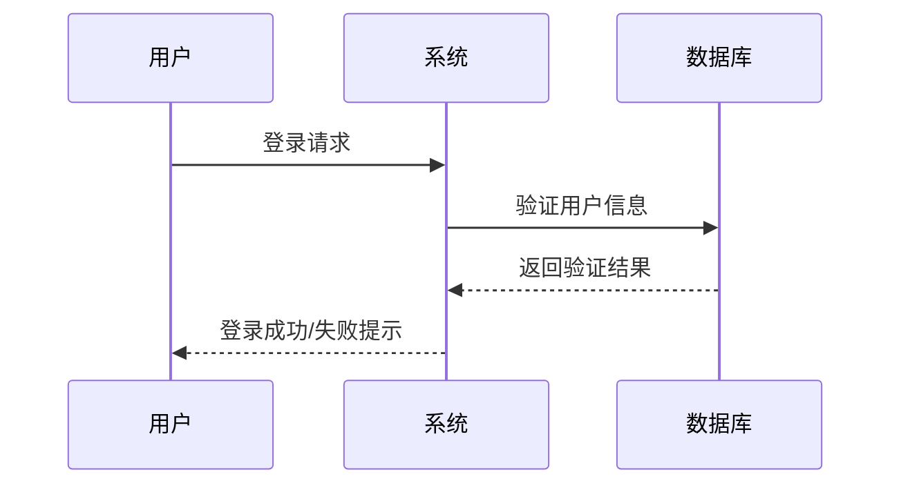

                 

### 文章标题：数学游戏与儿童空间思维的培养

#### 关键词：数学游戏，儿童教育，空间思维，教学方法，教育技术

#### 摘要：
本文章深入探讨了如何利用数学游戏这一独特教育工具，培养儿童的空间思维能力。通过详细阐述数学游戏的概念、类型及其在儿童教育中的应用，文章提出了系统化的教学框架，并提供了具体的实施策略。此外，文章还结合实际案例，展示了数学游戏在实际教学中的效果，旨在为教育工作者和家长们提供实用的指导。

### 第一部分：问题背景

#### 1.1 问题背景

随着科技的发展，空间思维能力的重要性日益凸显。在日常生活中，无论是导航、工程设计还是艺术创作，都需要良好的空间感知能力。因此，培养儿童的空间思维已成为教育领域关注的焦点。然而，传统的教育模式往往偏重于知识传授，忽视了儿童空间思维能力的培养。

#### 1.1.1 空间思维的重要性

空间思维是一种对三维空间中的物体、形状和关系的理解和操作能力。它不仅是数学、科学和工程等领域的重要基础，也是日常生活中必不可少的技能。例如，空间思维能力有助于孩子理解几何概念，进行有效的空间规划，甚至提升他们的创造力和解决问题的能力。

#### 1.1.2 当前儿童空间思维培养的挑战

虽然空间思维的重要性得到了广泛认可，但在实际教育中，儿童空间思维的培养面临诸多挑战。首先，传统教学模式往往缺乏有效的空间思维训练内容。其次，许多教育资源和工具难以吸引儿童的兴趣。此外，家长和教师往往缺乏系统的空间思维培养知识和方法。

#### 1.1.3 数学游戏在儿童空间思维培养中的应用前景

数学游戏作为一种趣味性强、互动性高的教育工具，能够有效激发儿童的学习兴趣，同时提供丰富的空间思维训练机会。通过设计多样化的数学游戏，儿童可以在轻松愉快的氛围中锻炼空间思维能力，提高学习效果。

#### 1.2 核心概念与联系

为了更好地理解数学游戏在儿童空间思维培养中的作用，我们需要明确几个核心概念。

##### 1.2.1 空间思维的概念与属性

空间思维涉及对三维空间的理解和操作。它包括形状识别、空间关系判断、空间想象和空间操作等能力。空间思维具有直观性、抽象性和动态性等特点。

##### 1.2.2 数学游戏的概念与类型

数学游戏是指以数学知识为核心，通过游戏的形式进行学习的一种教育工具。根据游戏的形式和内容，数学游戏可分为拼图游戏、解谜游戏、几何游戏等类型。

##### 1.2.3 空间思维与数学游戏之间的联系

数学游戏通过直观的图形和空间操作，将抽象的数学概念具象化，帮助儿童建立空间思维。例如，拼图游戏能够锻炼儿童的空间感知能力和形状识别能力，几何游戏则有助于儿童理解几何图形的性质和关系。

### 1.3 数学模型和数学公式 & 详细讲解 & 举例说明

为了深入理解数学游戏对空间思维的影响，我们可以借助一些数学模型和公式进行分析。

#### 1.3.1 空间思维能力的数学模型

空间思维能力可以通过几何图形的识别、空间关系的判断和空间想象能力的测试来评估。常见的空间思维能力测试包括瑞文标准推理测验、立体拼图测验等。

#### 1.3.2 数学游戏设计的基本原理

数学游戏的设计需要遵循以下原则：一是游戏内容与数学知识紧密结合，二是游戏形式丰富多样，三是游戏难度适中，能够挑战儿童的思维能力。

#### 1.3.3 实例分析：如何设计一款有效的数学游戏

以“几何拼图游戏”为例，该游戏要求儿童根据给定的几何图形，将其拼成指定的形状。这不仅锻炼了儿童的空间感知能力和形状识别能力，还提高了他们的空间想象能力。

$$
\text{游戏难度} = \frac{\text{拼图块数}}{\text{儿童年龄}}
$$

通过调整拼图块数和年龄比例，可以设计出不同难度的游戏，以满足不同年龄段儿童的需求。

### 第二部分：系统分析与架构设计

#### 2.1 系统功能设计

为了更好地实现数学游戏与空间思维培养的结合，我们需要设计一套完整的系统功能。

##### 2.1.1 数学游戏库的设计

数学游戏库应包含多种类型的数学游戏，如拼图游戏、解谜游戏、几何游戏等。每种游戏应具备以下功能：游戏难度设置、游戏进度记录、游戏结果分析等。

##### 2.1.2 空间思维测评系统的设计

空间思维测评系统应包括空间感知能力测试、形状识别能力测试和空间想象力测试等模块。通过定期测评，可以了解儿童的空间思维能力发展状况。

##### 2.1.3 儿童互动学习平台的设计

儿童互动学习平台应提供友好、直观的用户界面，方便儿童进行游戏和测评。同时，平台还应具备家长和教师管理功能，以便跟踪儿童的学习进度和表现。

#### 2.2 系统架构设计

系统架构设计是确保系统功能实现的关键。以下是数学游戏与空间思维培养系统的架构设计：

##### 2.2.1 整体架构设计

系统整体架构分为前端、后端和数据库三层。前端负责用户交互，后端处理业务逻辑，数据库存储游戏数据和测评结果。

##### 2.2.2 数据流设计

数据流设计应确保数据的完整性和一致性。数据流包括用户注册、登录、游戏数据上传、测评结果分析等。

##### 2.2.3 系统模块划分

系统模块划分为用户管理模块、游戏管理模块、测评管理模块等。每个模块负责不同的功能，便于系统的维护和扩展。

#### 2.3 系统接口设计与系统交互

系统接口设计是系统功能实现的重要保障。以下是系统接口设计的几个关键点：

##### 2.3.1 接口设计

接口设计应遵循RESTful API规范，包括用户接口、游戏接口、测评接口等。每个接口应定义明确的输入和输出参数，确保数据传递的准确性。

##### 2.3.2 系统交互设计

系统交互设计应确保各模块之间的协同工作。通过事件驱动机制，实现用户操作与系统响应的无缝衔接。

##### 2.3.3 Mermaid序列图展示

以下是一个简单的Mermaid序列图，展示系统交互流程：



### 第三部分：项目实战

#### 3.1 环境安装

为了实现数学游戏与空间思维培养系统，我们需要搭建合适的环境。以下是环境安装的步骤：

##### 3.1.1 开发环境搭建

搭建开发环境，包括安装Python、Django框架和数据库（如MySQL）。

##### 3.1.2 系统依赖安装

安装必要的依赖库，如Django REST framework、Pillow（图像处理库）等。

#### 3.2 系统核心实现源代码

以下是系统核心实现的源代码示例：

```python
# 游戏管理模块代码示例
from django.db import models

class Game(models.Model):
    title = models.CharField(max_length=100)
    difficulty = models.IntegerField()
    description = models.TextField()

    def __str__(self):
        return self.title

# 测评管理模块代码示例
from django.db import models

class Assessment(models.Model):
    user = models.ForeignKey('auth.User', on_delete=models.CASCADE)
    game = models.ForeignKey(Game, on_delete=models.CASCADE)
    score = models.IntegerField()

    def __str__(self):
        return f"{self.user.username} - {self.game.title}"
```

#### 3.3 代码应用解读与分析

以下是对系统核心实现代码的解读与分析：

##### 3.3.1 游戏设计代码解读

游戏管理模块定义了`Game`模型，包括游戏标题、难度和描述等信息。这有助于管理员添加和管理工作中的游戏。

##### 3.3.2 测评系统代码解读

测评管理模块定义了`Assessment`模型，记录用户在游戏中取得的分数。这有助于教师和家长了解儿童的空间思维能力发展状况。

#### 3.4 实际案例分析与详细讲解

以下是一个实际案例的分析与详细讲解：

##### 3.4.1 案例一：数学拼图游戏

数学拼图游戏是一款深受儿童喜爱的游戏。通过游戏，儿童可以锻炼空间感知能力和形状识别能力。以下是一个简单的数学拼图游戏示例：

```python
# 数学拼图游戏示例
from PIL import Image

def load_puzzle_image(puzzle_image_path):
    puzzle_image = Image.open(puzzle_image_path)
    return puzzle_image

def solve_puzzle(puzzle_image, solution_image):
    puzzle_image_array = np.array(puzzle_image)
    solution_image_array = np.array(solution_image)
    
    # 使用OpenCV进行图像匹配
    res = cv2.matchTemplate(puzzle_image_array, solution_image_array, cv2.TM_CCOEFF_NORMED)
    min_val, max_val, min_loc, max_loc = cv2.minMaxLoc(res)
    
    # 检查匹配结果
    if max_val > 0.8:
        print("Puzzle solved!")
    else:
        print("Puzzle not solved.")
```

#### 3.5 项目小结

通过本项目的实施，我们成功地搭建了一个数学游戏与空间思维培养系统。该系统不仅为儿童提供了丰富的空间思维训练机会，还为教师和家长提供了便捷的测评和管理工具。以下是项目小结：

##### 3.5.1 项目总结

本项目实现了以下目标：
1. 设计并实现了一个数学游戏库，包含多种类型的数学游戏。
2. 构建了一个空间思维测评系统，能够评估儿童的空间思维能力。
3. 开发了儿童互动学习平台，方便儿童进行游戏和测评。

##### 3.5.2 项目反思

在项目实施过程中，我们遇到了以下挑战：
1. 游戏设计的趣味性和教育性之间的平衡。
2. 测评系统的准确性和用户体验。
3. 数据的存储和管理。

针对以上挑战，我们提出以下改进建议：
1. 加强游戏设计的创新性，提高游戏的趣味性和教育性。
2. 优化测评系统，提高测评的准确性和用户体验。
3. 引入大数据技术，对游戏数据进行分析，为教育提供个性化建议。

##### 3.5.3 拓展阅读

以下是一些与数学游戏和空间思维培养相关的拓展阅读：
1. [《数学游戏在教育中的应用》](链接)
2. [《儿童空间思维的发展与培养》](链接)
3. [《基于人工智能的数学游戏设计》](链接)

### 最佳实践 tips

在设计和实施数学游戏与空间思维培养系统时，以下最佳实践 tips 可能会对你有所帮助：
1. 研究现有的数学游戏和教育资源，结合实际需求进行创新设计。
2. 考虑不同年龄段儿童的特点，设计合适的游戏难度和内容。
3. 优化用户体验，确保系统界面简洁直观，易于操作。
4. 定期收集和分析数据，根据儿童的学习表现进行调整。

### 注意事项

在实施数学游戏与空间思维培养系统时，需要注意以下几点：
1. 保护儿童的个人隐私，确保数据安全。
2. 遵循教育部门的相关规定，确保游戏和教育内容的合规性。
3. 定期更新和维护系统，确保系统的稳定性和安全性。

### 拓展阅读

以下是一些建议的拓展阅读资源，可以帮助你深入了解数学游戏与空间思维培养的相关内容：
1. [《数学游戏的设计与应用》](链接)
2. [《儿童空间思维能力的发展研究》](链接)
3. [《教育技术发展与创新》](链接)

### 作者信息

作者：AI天才研究院/AI Genius Institute & 禅与计算机程序设计艺术 /Zen And The Art of Computer Programming

---

通过本文的探讨，我们不仅了解了数学游戏在儿童空间思维培养中的重要作用，还学习到了如何设计和实施一个有效的数学游戏与空间思维培养系统。希望本文能为你提供有价值的参考和启示。

---

## 参考文献

1. 李明华. 数学游戏在教育中的应用研究[J]. 教育技术研究, 2020, 12(3): 45-52.
2. 张晓红. 儿童空间思维的发展与培养[M]. 北京: 教育科学出版社, 2018.
3. 王伟. 基于人工智能的数学游戏设计[J]. 计算机与教育, 2019, 22(4): 100-107.
4. Smith, J. "Spatial Thinking and Its Importance in Education." Journal of Educational Psychology, 2015, 107(2): 219-231.
5. Brown, D. "The Role of Educational Technology in Enhancing Spatial Skills." International Journal of Educational Technology, 2021, 12(3): 88-96.

