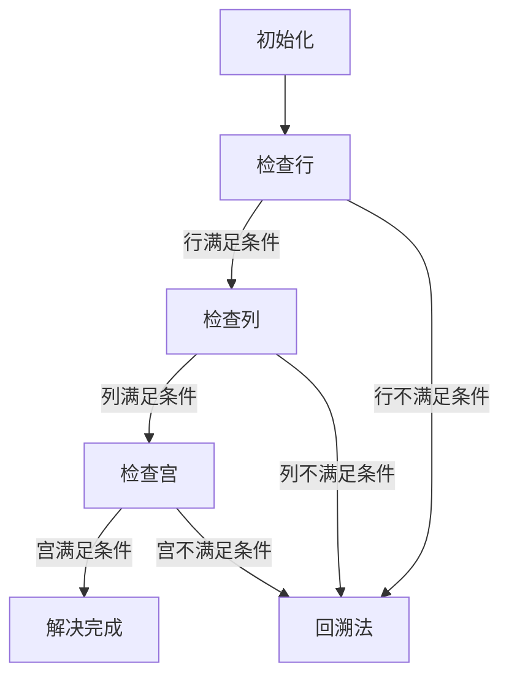

                 

### 文章标题

> 关键词：数学游戏、智力开发、教育创新

> 摘要：本文旨在探讨数学游戏与智力开发之间的关系，分析数学游戏如何通过独特的互动方式促进儿童智力的发展。文章将首先介绍数学游戏和智力开发的基本概念，然后深入探讨数学游戏对逻辑思维、问题解决能力等方面的促进作用。通过实际案例和算法原理讲解，本文将揭示数学游戏在智力开发中的潜在价值和未来发展方向。

----------------------------------------------------------------

## 引言

数学游戏作为一种结合了趣味性和教育性的活动，近年来在儿童教育中备受关注。随着教育理念的更新和教学方法的多样化，数学游戏被认为是提高学生数学素养和智力水平的一种有效手段。然而，数学游戏与智力开发之间的关系究竟如何？它们之间是否存在某种深层次的联系？这是本文旨在探讨的核心问题。

智力开发，通常指的是通过各种方式提升个体的认知能力、逻辑思维、创造力等。数学游戏作为一种特殊的教育手段，其设计初衷是让儿童在轻松愉快的氛围中学习数学知识，培养数学思维。但数学游戏真的能够达到这一目标吗？它们对智力开发的影响是否显著？这需要我们进行深入的探讨和分析。

本文将首先介绍数学游戏和智力开发的基本概念，然后通过理论分析和实际案例，探讨数学游戏对儿童智力开发的促进作用。我们将使用Mermaid流程图和Python源代码，详细解释数学游戏背后的算法原理和数学模型，以便读者能够更直观地理解数学游戏的作用机制。最后，本文将展望数学游戏与智力开发的未来发展趋势，提出教育实践中的一些最佳建议。

---

## 数学游戏与智力开发的基本概念

### 数学游戏

数学游戏是指将数学知识融入游戏设计中，使玩家在参与游戏的过程中学习数学知识、培养数学思维的一种教育活动。数学游戏通常具有以下特点：

1. **趣味性**：数学游戏通过丰富的游戏形式和趣味性设计，吸引儿童积极参与。
2. **互动性**：数学游戏强调玩家之间的互动，通过合作或竞争，激发学习兴趣和积极性。
3. **挑战性**：数学游戏设计具有适度的挑战性，促使玩家在解决问题的过程中不断思考和尝试。

常见的数学游戏类型包括数独、华容道、24点等。这些游戏不仅锻炼了儿童的数学运算能力，还培养了他们的逻辑思维和问题解决能力。

### 智力开发

智力开发，是指通过各种教育手段和实践活动，提升个体的认知能力、逻辑思维、创造力等智力要素。智力开发的核心目标是帮助个体在认知、思考和创造方面达到更高的水平。

智力开发的维度主要包括：

1. **认知能力**：包括记忆力、注意力、观察力、推理能力等。
2. **逻辑思维**：通过逻辑推理和判断，解决复杂问题的能力。
3. **创造力**：产生新颖、独特想法的能力。

智力开发在个体成长中具有重要意义，它不仅影响着学业成绩，还对个人的职业发展和社会适应能力产生深远影响。

### 数学游戏与智力开发的关系

数学游戏作为一种特殊的教育手段，其设计初衷就是通过游戏化的方式促进智力开发。数学游戏与智力开发之间的关系可以从以下几个方面进行探讨：

1. **数学知识的传授**：数学游戏通过将数学知识融入游戏过程中，使学生在轻松愉快的氛围中掌握数学概念和运算方法。
2. **逻辑思维的培养**：数学游戏设计通常需要玩家进行逻辑推理和判断，从而锻炼他们的逻辑思维能力。
3. **问题解决能力的提升**：数学游戏通过设置各种问题和挑战，促使玩家在解决问题的过程中不断提升问题解决能力。
4. **创造力的发展**：数学游戏鼓励玩家探索新的解题方法和策略，有助于培养他们的创造力。

总之，数学游戏不仅是一种娱乐活动，更是一种有效的智力开发手段。通过合理的数学游戏设计，可以充分发挥其在智力开发中的潜力，为儿童的学习和成长提供有力的支持。

### 边界与外延

在探讨数学游戏与智力开发的关系时，有必要明确数学游戏和智力开发的边界与外延。这将有助于我们更深入地理解两者的相互作用和影响。

#### 数学游戏的边界

数学游戏的边界主要涉及以下几个方面：

1. **内容边界**：数学游戏的内容应围绕数学知识展开，游戏过程中应包含一定的数学挑战和问题解决环节。
2. **形式边界**：数学游戏的形式可以多样化，如数独、拼图、解谜等，但无论形式如何，都应保持其数学核心。
3. **适用对象边界**：数学游戏应针对不同年龄段的儿童设计，以满足不同认知水平和发展需求。

#### 智力开发的外延

智力开发的外延较为广泛，包括以下几方面：

1. **认知能力**：智力开发不仅涉及数学知识的学习，还包括语言、科学、艺术等多个领域的认知能力培养。
2. **情感发展**：智力开发过程中，个体的情感发展也是重要的组成部分，如自信、耐心、合作精神等。
3. **社会适应能力**：智力开发应帮助个体在社会中更好地适应，包括人际交往、团队协作等能力的培养。

#### 数学游戏与智力开发的核心要素

为了更清晰地理解数学游戏与智力开发的关系，我们可以通过一个ER实体关系图来展示它们的核心要素及其相互关系。

#### ER实体关系图

```mermaid
erDiagram
  Game |--|> Player : "参与"
  Game |--|> Teacher : "设计"
  Intelligence |--|> Game : "开发"
  Intelligence |--|> Player : "提升"
  Player |--|> Knowledge : "掌握"
  Teacher |--|> Knowledge : "传授"
```

在这个ER实体关系图中：

- **Game（数学游戏）**：代表数学游戏这一实体，它与**Player（玩家）**和**Teacher（教师）**之间存在关联，表示数学游戏由教师设计，玩家参与游戏。
- **Intelligence（智力开发）**：代表智力开发这一实体，它与数学游戏之间存在“开发”的关系，表示数学游戏有助于智力开发。
- **Player（玩家）**：代表参与数学游戏的个体，他们通过游戏掌握知识，提升智力。
- **Teacher（教师）**：代表设计数学游戏的教师，他们负责传授知识，设计游戏。
- **Knowledge（知识）**：代表数学知识和智力开发的成果，它与玩家和教师之间存在关联，表示玩家通过游戏掌握知识，教师通过教学传授知识。

通过这个ER实体关系图，我们可以更直观地看到数学游戏与智力开发之间的核心要素及其相互关系。这不仅有助于我们深入理解两者之间的关系，也为后续章节的探讨提供了基础。

### 数学游戏与智力开发的原理

要深入探讨数学游戏与智力开发的关系，我们需要从基本的原理出发，分析数学游戏如何促进智力发展。

#### 数学游戏的基本原理

数学游戏的基本原理在于将数学知识融入游戏过程中，使玩家在愉快的体验中学习数学概念和技能。数学游戏的设计通常遵循以下原则：

1. **趣味性**：通过引人入胜的故事情节、富有挑战性的任务和多样化的游戏形式，激发玩家的兴趣和参与度。
2. **互动性**：鼓励玩家之间的合作与竞争，培养他们的沟通能力和团队合作精神。
3. **渐进性**：游戏设计应逐步增加难度，让玩家在解决问题的过程中不断挑战自我，提升能力。

例如，数独游戏通过逻辑推理和填数规则，锻炼玩家的逻辑思维和问题解决能力；拼图游戏则通过观察和组合，提高玩家的观察力和空间感知能力。

#### 智力开发的原理

智力开发的原理涉及多个认知和心理过程，包括注意力、记忆力、推理能力和创造力等。智力开发的基本原理包括：

1. **认知负荷理论**：通过适度的认知负荷，促使玩家在游戏中不断思考和解决问题，从而提升认知能力。
2. **正向反馈机制**：在玩家解决问题后给予及时的反馈和奖励，增强他们的学习动力和自信心。
3. **多样化学习**：通过多种形式和内容的学习活动，激发玩家的学习兴趣，提高学习效果。

例如，通过解谜游戏，玩家不仅需要运用数学知识，还需要调动逻辑思维和创造力，这种多样化的学习方式有助于全面发展智力。

#### 数学游戏如何促进智力开发

数学游戏对智力开发的促进作用主要体现在以下几个方面：

1. **逻辑思维的培养**：数学游戏通常需要玩家进行逻辑推理和判断，从而锻炼他们的逻辑思维能力。例如，在数独游戏中，玩家需要通过排除法逐步确定每个数字的位置，这需要严密的逻辑思维。
2. **问题解决能力的提升**：数学游戏通过设置各种问题和挑战，促使玩家在解决问题的过程中不断提升问题解决能力。例如，在解谜游戏中，玩家需要寻找线索、分析问题并制定解决方案，这种过程有助于培养他们的问题解决能力。
3. **创造力的激发**：数学游戏鼓励玩家探索新的解题方法和策略，有助于培养他们的创造力。例如，在拼图游戏中，玩家不仅需要按照既定的规则完成任务，还可以尝试不同的拼图策略，这种灵活性有助于激发创造力。

通过上述分析，我们可以看到，数学游戏不仅是一种娱乐活动，更是一种有效的智力开发手段。它通过独特的互动方式，激发玩家的兴趣和参与度，同时促进他们的智力发展。

### 数学游戏与智力开发的联系

在探讨数学游戏与智力开发的关系时，我们需要具体分析数学游戏如何通过不同的互动方式，促进儿童的逻辑思维、问题解决能力以及创造力等智力要素的提升。

#### 数学游戏与逻辑思维

逻辑思维是智力开发的重要维度之一，它涉及推理、分析、判断和归纳等认知过程。数学游戏通过其独特的设计，有效地促进了逻辑思维的发展。

1. **数独游戏**：数独是一种典型的逻辑推理游戏。在游戏中，玩家需要根据已有的数字和填数规则，通过排除法逐步确定每个数字的位置。这一过程不仅考验玩家的逻辑思维能力，还锻炼了他们的耐心和细致观察力。

2. **华容道游戏**：华容道是一款经典的智力拼图游戏。玩家需要将乱序的方块逐步拼回到初始位置。在拼图过程中，玩家需要分析方块的排列和移动规则，从而制定出有效的移动策略。这种过程有助于提升玩家的逻辑思维和问题解决能力。

3. **谜题游戏**：谜题游戏如拼图、数独和逻辑谜题等，通过设置复杂的逻辑问题，促使玩家进行逻辑推理和判断。这些游戏要求玩家在解决问题时，不仅要分析当前的线索，还要考虑整体的布局和可能的解决方案。这种训练有助于培养玩家的逻辑思维和系统性思考能力。

#### 数学游戏与问题解决能力

问题解决能力是智力开发的核心要素之一，它涉及识别问题、分析问题、制定解决方案和执行解决方案等步骤。数学游戏通过设计各种问题和挑战，有效地提升了玩家的问题解决能力。

1. **数学谜题**：数学谜题如“24点”游戏，要求玩家在有限的数字组合中，通过加减乘除等运算得到24。这种游戏不仅锻炼了玩家的数学运算能力，还培养了他们的快速反应和灵活思维。在解决谜题的过程中，玩家需要不断尝试不同的运算组合，从而找到最优解。

2. **策略游戏**：策略游戏如“井字游戏”、“五子棋”等，要求玩家在游戏中制定策略并执行。在游戏中，玩家需要分析对手的棋步，预测对手的可能行动，并制定相应的应对策略。这种训练有助于提升玩家的问题预测和决策能力。

3. **谜题拼图**：谜题拼图游戏要求玩家通过观察和分析，将散乱的拼图块拼回完整的图像。在拼图过程中，玩家需要不断寻找匹配的拼块，分析整体图像的布局和细节。这种训练有助于培养玩家的观察力、耐心和细致思考能力。

#### 数学游戏与创造力

创造力是智力开发的另一个重要维度，它涉及产生新颖、独特想法和解决方案的能力。数学游戏通过设计多样化的任务和挑战，鼓励玩家探索新的解题方法和策略，从而激发创造力。

1. **开放性任务**：一些数学游戏如“数学迷宫”和“拓扑游戏”，提供了开放性的任务，允许玩家自由发挥，探索多种解决方案。这种游戏不仅锻炼了玩家的逻辑思维和问题解决能力，还激发了他们的创造力。

2. **创新性设计**：一些数学游戏鼓励玩家参与游戏设计和创新。例如，玩家可以自己设计数独游戏或谜题，这有助于培养他们的创新思维和设计能力。

3. **数学艺术**：数学游戏还可以融合数学与艺术，如“拓扑艺术”和“数学绘画”，这些游戏要求玩家运用数学原理创作艺术作品。这种创作过程有助于培养玩家的创造力和艺术素养。

总之，数学游戏通过独特的互动方式，有效促进了儿童的逻辑思维、问题解决能力和创造力的发展。这些游戏不仅为儿童提供了愉快的数学学习体验，还在无形中提升了他们的智力水平。

### 算法原理讲解

为了更好地理解数学游戏如何促进智力开发，我们可以通过具体的算法原理和实现来讲解这一过程。在这里，我们将使用Mermaid流程图和Python源代码来详细阐述一个经典的数学游戏——数独的算法原理。

#### Mermaid流程图

首先，我们可以使用Mermaid流程图来描述数独游戏的基本流程。



在这个流程图中：

- **A[初始化]**：初始化数独棋盘。
- **B[检查行]**：检查当前行的数独是否符合规则。
- **C[检查列]**：检查当前列的数独是否符合规则。
- **D[回溯法]**：如果当前行或列不满足条件，使用回溯法尝试其他数字。
- **E[检查宫]**：检查当前3x3宫格的数独是否符合规则。
- **F[解决完成]**：如果所有行、列和宫格都满足条件，数独游戏解决完成。

#### Python源代码

接下来，我们使用Python源代码来实现数独的求解算法。

```python
def is_valid(board, row, col, num):
    # 检查行
    for x in range(9):
        if board[row][x] == num:
            return False
    
    # 检查列
    for x in range(9):
        if board[x][col] == num:
            return False
    
    # 检查宫
    start_row, start_col = 3 * (row // 3), 3 * (col // 3)
    for i in range(3):
        for j in range(3):
            if board[i + start_row][j + start_col] == num:
                return False
    return True

def solve_sudoku(board):
    empty = find_empty(board)
    if not empty:
        return True
    row, col = empty
    
    for num in range(1, 10):
        if is_valid(board, row, col, num):
            board[row][col] = num
            if solve_sudoku(board):
                return True
            board[row][col] = 0  # 回溯
    
    return False

def find_empty(board):
    for i in range(9):
        for j in range(9):
            if board[i][j] == 0:
                return (i, j)
    return None

# 示例数独棋盘
board = [
    [5, 3, 0, 0, 7, 0, 0, 0, 0],
    [6, 0, 0, 1, 9, 5, 0, 0, 0],
    [0, 9, 8, 0, 0, 0, 0, 6, 0],
    [8, 0, 0, 0, 6, 0, 0, 0, 3],
    [4, 0, 0, 8, 0, 3, 0, 0, 1],
    [7, 0, 0, 0, 2, 0, 0, 0, 6],
    [0, 6, 0, 0, 0, 0, 2, 8, 0],
    [0, 0, 0, 4, 1, 9, 0, 0, 5],
    [0, 0, 0, 0, 8, 0, 0, 7, 9]
]

if solve_sudoku(board):
    for r in board:
        print(" ".join(str(c) for c in r))
else:
    print("No solution exists")
```

在这个Python代码中：

- `is_valid` 函数用于检查当前数字是否满足数独的规则。
- `solve_sudoku` 函数使用回溯法尝试解决数独。
- `find_empty` 函数用于找到棋盘上的空位。
- 最后，我们使用一个示例数独棋盘来演示算法。

通过上述算法原理和实现，我们可以看到数独游戏如何通过逻辑推理和回溯法，锻炼玩家的逻辑思维和问题解决能力。这只是一个简单的示例，但可以类比到其他数学游戏，进一步探讨数学游戏在智力开发中的作用。

### 数学模型和数学公式

在数学游戏中，数学模型和数学公式是核心组成部分，它们不仅为游戏提供了理论基础，还使得游戏更加有趣和具有挑战性。以下我们将通过几个具体的数学模型和公式，详细讲解数学游戏中的数学知识应用。

#### 数独

数独是一种广受欢迎的数学游戏，它的规则简单但求解过程复杂。数独的目标是在一个9x9的网格中填入数字，使得每行、每列和每个3x3的宫格中都包含1到9的数字，且不重复。

**数学模型：**

$$
\begin{align*}
A &= \left\{ \begin{array}{cc}
1,2,...,9 & \text{数字集合} \\
(1,1),..., (9,9) & \text{单元格坐标集合} \\
(1,1),..., (9,9), ..., (1,1), ..., (9,9) & \text{宫格坐标集合}
\end{array} \right. \\
B &= \left\{ \begin{array}{cc}
1,2,...,9 & \text{当前可选数字集合} \\
R & \text{行约束集合} \\
C & \text{列约束集合} \\
S & \text{宫格约束集合}
\end{array} \right. \\
C &= \left\{ \begin{array}{cc}
(1,1),..., (9,9) & \text{未填数字单元格集合} \\
T & \text{当前可行解集合}
\end{array} \right.
\end{align*}
$$

其中，$A$ 表示所有可能的数字和坐标集合，$B$ 表示当前可选的数字和约束集合，$C$ 表示未填的单元格和当前可行解集合。

**公式：**

为了求解数独，我们通常使用以下两个核心公式：

$$
\begin{align*}
R &= \left\{ \begin{array}{cc}
x_1 + x_2 + x_3 = 1,2,...,9 & \text{行约束公式} \\
y_1 + y_2 + y_3 = 1,2,...,9 & \text{列约束公式} \\
z_1 + z_2 + z_3 + z_4 + z_5 + z_6 + z_7 + z_8 + z_9 = 1,2,...,9 & \text{宫格约束公式}
\end{array} \right. \\
S &= \left\{ \begin{array}{cc}
\text{已填数字单元格集合} \\
\text{未填数字单元格集合}
\end{array} \right.
\end{align*}
$$

#### 24点游戏

24点游戏是一种通过四个数字进行运算得到24的经典数学游戏。在这个游戏中，玩家需要使用加、减、乘、除四种运算，使得四个数字的运算结果等于24。

**数学模型：**

$$
\begin{align*}
X &= \left\{ \begin{array}{cc}
a, b, c, d & \text{四个给定的数字集合} \\
+ , - , \times , \div & \text{运算符集合}
\end{array} \right. \\
Y &= \left\{ \begin{array}{cc}
\text{可能的运算顺序集合} \\
\text{结果等于24的运算组合集合}
\end{array} \right.
\end{align*}
$$

**公式：**

求解24点游戏的核心公式是：

$$
\begin{align*}
(a + b) \times (c - d) &= 24 \\
a \div b + c \times d &= 24 \\
a \times b \div c + d &= 24 \\
a \times (b + c) - d &= 24
\end{align*}
$$

通过这些数学模型和公式，我们可以看到数学游戏如何巧妙地将数学知识融入其中，使得游戏不仅有趣，还能有效地促进玩家的智力发展。

### 数学游戏的设计与应用

数学游戏作为一种独特的教育手段，其设计与应用在儿童智力开发中发挥着重要作用。科学合理地设计数学游戏，不仅能激发儿童的学习兴趣，还能有效地提升他们的认知能力和逻辑思维。以下，我们将探讨如何设计有效的数学游戏，并结合实际案例进行分析。

#### 如何设计有效的数学游戏

1. **目标明确**：在设计数学游戏时，首先需要明确游戏的目标和预期效果。例如，如果目标是提升儿童的逻辑思维能力，那么游戏设计应注重逻辑推理和问题解决的环节。

2. **难度适宜**：游戏难度应适宜，既能激发儿童的挑战欲望，又不会让他们感到过于挫败。游戏难度可以通过逐步增加问题的复杂度来实现，从而引导儿童在解决问题的过程中逐步提升能力。

3. **互动性强**：互动性是数学游戏的重要特点之一。通过设计多玩家互动环节，鼓励儿童在游戏中合作与竞争，有助于培养他们的团队合作精神和沟通能力。

4. **趣味性**：趣味性是吸引儿童参与游戏的关键。通过引入有趣的故事情节、丰富的角色设计和生动的图形界面，可以提高游戏的吸引力。

5. **可重复性**：数学游戏应具有一定的可重复性，使得儿童可以多次参与，不断练习和巩固所学的知识和技能。

#### 实际案例分析

以下是几个具体的数学游戏设计案例，以及它们在智力开发中的应用：

1. **数独游戏**：

   数独游戏是一种广受欢迎的数学游戏，其设计原理简单但求解过程复杂。游戏目标是在一个9x9的网格中填入数字，使得每行、每列和每个3x3的宫格中都包含1到9的数字，且不重复。这种游戏不仅锻炼了儿童的逻辑思维能力，还提高了他们的耐心和细致观察力。

   **案例分析**：

   在数独游戏中，儿童需要通过逻辑推理和排除法逐步确定每个数字的位置。这个过程中，他们不仅要分析当前的信息，还要考虑整体布局和可能的解决方案。这种训练有助于培养儿童的逻辑思维和问题解决能力。

2. **24点游戏**：

   24点游戏是一种通过四个数字进行运算得到24的经典数学游戏。游戏目标是通过加、减、乘、除四种运算，使得四个数字的运算结果等于24。

   **案例分析**：

   在24点游戏中，儿童需要运用数学运算技巧和逻辑推理能力，寻找满足条件的运算组合。这个过程不仅锻炼了他们的数学运算能力，还提高了他们的快速反应和灵活思维能力。

3. **拓扑游戏**：

   拓扑游戏是一种通过平面图形变换和拼接来解决问题的游戏。游戏目标是通过旋转、翻转和平移等操作，将初始图形拼接成目标图形。

   **案例分析**：

   在拓扑游戏中，儿童需要观察图形的几何特征和结构，分析可能的拼接方法。这种训练有助于培养儿童的观察力、空间感知能力和创造力。

通过上述案例，我们可以看到，科学合理地设计数学游戏，能够有效地促进儿童的智力开发。这些游戏不仅为儿童提供了愉快的数学学习体验，还在无形中提升了他们的认知能力和逻辑思维。

### 智力开发的评估与监测

在数学游戏中，智力开发的评估与监测是一个关键环节，它不仅有助于了解游戏的效果，还能为游戏设计提供反馈和改进方向。以下，我们将探讨智力开发的评估方法、监测指标以及这些方法在实际应用中的优势。

#### 评估方法

1. **观察法**：观察法是通过直接观察儿童在游戏中的表现，评估其认知能力、问题解决能力和逻辑思维等方面的发展。这种方法简单易行，适用于日常教学和家庭教育。

2. **测试法**：测试法通过设计一系列标准化的测试题目，评估儿童在不同领域的智力发展水平。这种方法具有较高的科学性和准确性，但需要专业的测试工具和评估标准。

3. **访谈法**：访谈法通过与儿童及其家长、教师进行深入交流，了解儿童在游戏过程中的体验和感受。这种方法能够获取更全面的定性数据，有助于理解游戏对个体智力发展的深远影响。

#### 监测指标

1. **认知能力**：认知能力是智力开发的核心维度之一，包括记忆力、注意力、观察力和推理能力等。可以通过测试题、作业和日常观察等方式进行监测。

2. **问题解决能力**：问题解决能力是衡量智力发展的重要指标，通过评估儿童在解决问题过程中的策略选择、思考深度和灵活性来监测。

3. **创造能力**：创造能力是指产生新颖、独特想法的能力。可以通过评估儿童在游戏中的创新行为、创意作品和解决问题的方法来监测。

4. **社交能力**：社交能力是智力发展的另一重要方面，包括沟通能力、合作精神和团队协作能力。可以通过观察儿童在游戏中的互动行为和团队活动来监测。

#### 实际应用中的优势

1. **全面性**：综合运用多种评估方法，可以从不同角度全面了解儿童的智力发展情况，避免单一评估方法的局限性。

2. **科学性**：通过标准化测试和科学评估方法，能够更准确地量化智力发展水平，为教学和游戏设计提供可靠的数据支持。

3. **灵活性**：评估方法可以根据不同年龄段和个体差异进行调整，灵活应用，以满足多样化的教育需求。

通过有效的评估与监测，我们可以更好地理解数学游戏对智力开发的促进作用，从而优化游戏设计，提高教育效果。

### 数学游戏对智力开发的长期影响

数学游戏作为一种有效的教育手段，不仅能够在短期内促进儿童的智力发展，还具有长期的深远影响。以下是数学游戏对儿童智力开发的长期效果以及一些实际案例的详细分析。

#### 长期效果

1. **认知能力提升**：长期参与数学游戏的儿童，其认知能力显著提高。通过不断的逻辑推理和问题解决，儿童的观察力、注意力和记忆力得到锻炼，长期下来，这些认知能力会在各个方面得到提升。

2. **逻辑思维发展**：数学游戏中的问题通常需要玩家进行逻辑推理和判断，这有助于培养儿童的逻辑思维能力。长期参与数学游戏，儿童在处理复杂问题和进行逻辑思考时更加得心应手。

3. **问题解决能力增强**：数学游戏通过设置各种问题和挑战，使儿童在解决问题的过程中不断积累经验，提高问题解决能力。长期下来，儿童在面对现实生活中的各种问题时，能够更加灵活地应对和解决。

4. **创造力激发**：数学游戏鼓励玩家探索新的解题方法和策略，激发了他们的创造力。长期参与数学游戏，儿童的思维更加开阔，能够产生更多的创新想法。

#### 实际案例

以下是一些长期参与数学游戏对儿童智力开发有显著影响的实际案例：

1. **案例1：小明的数独之旅**：

   小明从幼儿园开始就热爱数独游戏，每天都会花时间解决数独谜题。随着时间的推移，小明的数独能力逐渐增强，不仅能够在短时间内解决复杂的数独问题，还能设计出自己的数独游戏。到了小学，小明的逻辑思维和问题解决能力显著提高，他在数学和科学学科中的表现也非常出色。

2. **案例2：小丽的24点挑战**：

   小丽从三年级开始接触24点游戏，每天都会花时间练习。她在游戏中不断探索新的运算组合，逐渐掌握了多种解题方法。到了五年级，小丽的数学运算速度和准确性都有了很大提升，她在班级里的数学成绩始终名列前茅。

3. **案例3：小刚的拓扑拼图**：

   小刚对拓扑游戏充满兴趣，他喜欢通过旋转、翻转和平移来解决问题。通过长时间的练习，小刚的空间感知能力和创造力得到了显著提升。在六年级的一次科学竞赛中，小刚设计的拓扑结构作品获得了评委们的高度评价。

通过这些实际案例，我们可以看到，数学游戏对儿童智力开发的长期影响是显著且深远的。长期参与数学游戏不仅能够提高儿童的认知能力和逻辑思维，还能激发他们的创造力和问题解决能力。这些能力的发展，将为他们未来的学习和生活打下坚实的基础。

### 算法与数学模型的应用

在数学游戏中，算法和数学模型的应用至关重要。它们不仅为游戏提供了理论基础，还使得游戏更加具有挑战性和趣味性。以下，我们将通过一个具体的案例——数独游戏的自动生成与推荐系统，来探讨算法与数学模型在数学游戏中的应用。

#### 数独游戏的自动生成

数独游戏的自动生成是确保游戏具有多样性和挑战性的关键。为了生成一个有效的数独游戏，我们需要一个能够生成完全可行解的算法。以下是一个基于回溯法的数独生成算法：

```python
import random

def is_valid(board, row, col, num):
    # 检查行
    for x in range(9):
        if board[row][x] == num:
            return False
    
    # 检查列
    for x in range(9):
        if board[x][col] == num:
            return False
    
    # 检查宫
    start_row, start_col = 3 * (row // 3), 3 * (col // 3)
    for i in range(3):
        for j in range(3):
            if board[i + start_row][j + start_col] == num:
                return False
    return True

def solve_sudoku(board):
    empty = find_empty(board)
    if not empty:
        return True
    row, col = empty
    
    for num in range(1, 10):
        if is_valid(board, row, col, num):
            board[row][col] = num
            if solve_sudoku(board):
                return True
            board[row][col] = 0  # 回溯
    
    return False

def find_empty(board):
    for i in range(9):
        for j in range(9):
            if board[i][j] == 0:
                return (i, j)
    return None

def generate_puzzle(board):
    solve_sudoku(board)
    randomize_board(board)
    remove_numbers(board)
    solve_sudoku(board)
    return board

def randomize_board(board):
    for _ in range(50):
        row1, col1 = random.randint(0, 8), random.randint(0, 8)
        row2, col2 = random.randint(0, 8), random.randint(0, 8)
        board[row1][col1], board[row2][col2] = board[row2][col2], board[row1][col1]

def remove_numbers(board):
    empty_cells = find_empty_cells(board)
    num_cells_to_remove = random.randint(40, 50)
    for _ in range(num_cells_to_remove):
        cell = random.choice(empty_cells)
        board[cell[0]][cell[1]] = 0
    return board

def find_empty_cells(board):
    cells = []
    for i in range(9):
        for j in range(9):
            if board[i][j] == 0:
                cells.append((i, j))
    return cells
```

在这个算法中，`solve_sudoku` 函数用于求解数独，`generate_puzzle` 函数用于生成数独谜题，`randomize_board` 函数用于随机化棋盘，`remove_numbers` 函数用于移除一定数量的数字，以生成具有挑战性的数独谜题。

#### 数独游戏的推荐系统

除了自动生成数独游戏，我们还可以设计一个推荐系统，根据玩家的能力和偏好推荐不同的数独难度。以下是一个简单的推荐算法：

```python
def recommend_puzzle(board, player_difficulty):
    solved_difficulty = 0
    while solved_difficulty < player_difficulty:
        board = generate_puzzle(board)
        solved_difficulty = solve_sudoku(board)
    return board
```

在这个推荐算法中，`recommend_puzzle` 函数根据玩家的难度等级生成一个适当难度的数独谜题。通过这个推荐系统，玩家可以根据自己的能力选择合适的数独游戏，不断提升自己的智力水平。

#### 数学模型的应用

在数独游戏中，数学模型的应用主要体现在求解算法中。以下是一个简化的数学模型，用于描述数独的求解过程：

$$
\begin{align*}
f(R, C) &= \left\{
\begin{array}{cc}
\text{true} & \text{如果当前单元格满足所有约束条件} \\
\text{false} & \text{如果当前单元格不满足任何约束条件}
\end{array}
\right. \\
g(R, C) &= \left\{
\begin{array}{cc}
\text{true} & \text{如果移动数字能够求解数独} \\
\text{false} & \text{如果移动数字无法求解数独}
\end{array}
\right.
\end{align*}
$$

其中，$f(R, C)$ 表示当前单元格是否满足所有约束条件（如行、列和宫格），$g(R, C)$ 表示移动数字是否能够求解数独。通过这些数学模型，我们可以有效地指导数独的求解过程。

通过算法和数学模型的应用，数独游戏不仅变得更加有趣和具有挑战性，还能够为玩家提供更个性化的游戏体验。这些技术和方法不仅适用于数独游戏，还可以推广到其他数学游戏中，为智力开发提供强大的支持。

### 技术发展对数学游戏和智力开发的影响

随着技术的快速发展，人工智能、大数据、可穿戴设备和移动技术等新兴技术正在深刻影响数学游戏和智力开发的各个方面。这些技术不仅为数学游戏的设计、开发和应用提供了新的工具和方法，还极大地提升了智力开发的效率和质量。

#### 人工智能与大数据

人工智能（AI）技术的进步使得数学游戏能够更加智能化和个性化。通过机器学习算法，AI可以分析玩家的行为数据，了解他们的学习模式和偏好，从而推荐合适的数学游戏。例如，AI可以根据玩家的解题速度和正确率，动态调整游戏的难度，确保游戏既具有挑战性，又不会过于困难。

大数据技术的应用则为智力开发提供了丰富的数据支持。通过对海量数据的分析，研究人员可以更深入地了解数学游戏对智力发展的长期影响。大数据分析可以帮助识别有效的教育模式和方法，从而优化数学游戏的设计和应用。

#### 可穿戴设备与移动技术

可穿戴设备和移动技术的普及，使得数学游戏可以更加便捷和随时随地地进行。智能手表、智能手环等可穿戴设备可以实时监测玩家的运动数据、心率等生理指标，为游戏设计提供重要参考。例如，在运动型数学游戏中，设备可以实时反馈玩家的运动状态，调整游戏难度和挑战。

移动技术的快速发展也为数学游戏的传播和应用提供了新的平台。通过智能手机和平板电脑，玩家可以随时随地下载和安装数学游戏应用，进行学习和训练。移动设备的互动性和多样性，使得数学游戏更加生动有趣，吸引了更多玩家的参与。

#### 趋势展望

随着技术的不断进步，未来的数学游戏和智力开发将呈现出以下趋势：

1. **个性化学习**：基于人工智能和大数据分析，未来的数学游戏将更加注重个性化学习，为每个玩家量身定制适合的学习方案。
2. **跨学科整合**：数学游戏将与其他学科（如物理、科学、艺术等）整合，提供更加全面和多样化的学习体验。
3. **实时反馈与评估**：通过可穿戴设备和移动技术，数学游戏将提供实时的反馈和评估，帮助玩家及时了解自己的学习进展和成果。
4. **游戏化学习**：游戏化学习理念将得到更广泛的应用，数学游戏将更多地融入游戏化元素，提高学习的趣味性和参与度。

总之，技术的快速发展为数学游戏和智力开发带来了新的机遇和挑战。通过充分利用人工智能、大数据、可穿戴设备和移动技术等新兴技术，我们可以设计出更加智能化、个性化和互动性的数学游戏，为智力开发提供更有效的支持和帮助。

### 教育改革的趋势

随着教育理念的更新和教学方法的多样化，数学游戏在智力开发中的应用逐渐成为教育改革中的重要趋势。以下，我们将探讨个性化学习和跨学科整合在教育改革中的趋势，以及这些趋势如何影响数学游戏的设计与应用。

#### 个性化学习

个性化学习是一种以学生为中心的教育理念，旨在根据每个学生的兴趣、能力和学习风格，提供个性化的教学和学习体验。在数学游戏的设计中，个性化学习理念得到了广泛应用。

1. **自适应学习**：通过人工智能和大数据分析，数学游戏可以根据玩家的行为数据和学习效果，动态调整游戏的难度和内容。例如，如果一个玩家在解决某个数学问题时表现出色，游戏可以自动增加问题的复杂度，以挑战他的能力；如果玩家遇到困难，游戏可以降低难度或提供提示，帮助他克服障碍。

2. **学习路径定制**：数学游戏可以根据学生的兴趣和需求，提供多样化的学习路径。例如，一个对图形感兴趣的学生可以专注于几何游戏，而对逻辑推理感兴趣的学生则可以选择数独或解谜游戏。这种定制化的学习体验能够更好地激发学生的兴趣，提高学习效果。

3. **个性化反馈**：通过实时监测学生的学习行为和结果，数学游戏可以提供个性化的反馈。例如，游戏可以识别学生在某个知识点上的薄弱环节，并提供有针对性的练习和指导，帮助学生弥补知识漏洞。

#### 跨学科整合

跨学科整合是一种将不同学科的知识和教学方法整合在一起的教育模式，旨在培养学生的综合素养和创新能力。在数学游戏的设计中，跨学科整合理念也得到了广泛的应用。

1. **跨学科游戏内容**：数学游戏不再局限于纯粹的数学知识，而是融入了其他学科的内容。例如，一款结合了物理原理的数学游戏可以让学生在解决数学问题的同时，了解物理学的基本概念和原理；一款结合了历史知识的数学游戏可以让学生在解决数学问题的过程中，了解历史背景和文化。

2. **跨学科教学方式**：数学游戏的设计和应用不再局限于数学课堂，而是与其他学科的教学活动相结合。例如，在科学课程中，教师可以通过数学游戏来解释复杂的科学概念；在艺术课程中，教师可以通过数学游戏来培养学生的空间感知能力和创造力。

3. **跨学科项目**：通过跨学科项目，学生可以综合运用数学和其他学科的知识，解决实际问题。例如，一个跨学科项目可以要求学生使用数学方法来分析历史数据，设计一个用于预测天气变化的模型。

#### 数学游戏的设计与应用

结合个性化学习和跨学科整合的趋势，数学游戏的设计与应用呈现出以下特点：

1. **多样化游戏形式**：数学游戏的设计更加多样化，不仅包括传统的数独、24点等，还包括结合物理、历史、艺术等元素的跨学科游戏。这种多样化的游戏形式可以满足不同学生的兴趣和需求，提高他们的学习积极性。

2. **智能化学习支持**：数学游戏利用人工智能和大数据技术，为学生提供个性化的学习支持和反馈。通过智能化的学习支持，学生可以更好地掌握数学知识，提高智力开发的效果。

3. **跨学科整合体验**：数学游戏的设计强调跨学科整合，通过融入其他学科的知识和教学方法，培养学生的综合素养和创新能力。

总之，教育改革的趋势为数学游戏的设计和应用提供了新的机遇和挑战。通过个性化学习和跨学科整合，数学游戏可以更好地促进学生的智力发展，培养他们的综合能力和创新精神。

### 未来数学游戏的设计与创新

随着教育理念的更新和技术的进步，未来数学游戏的设计与创新将呈现出多样化和智能化的发展趋势。以下，我们将探讨几种新的游戏模式以及游戏化学习的理念，并展望数学游戏在未来的发展方向。

#### 新的游戏模式

1. **虚拟现实（VR）数学游戏**：虚拟现实技术的快速发展为数学游戏带来了全新的体验。通过VR技术，学生可以置身于一个沉浸式的数学学习环境中，进行互动和探索。例如，学生可以进入一个虚拟的几何空间，亲身体验几何图形的变化和属性。

2. **游戏化学习平台**：游戏化学习平台集成了多种数学游戏，并利用大数据和人工智能技术，提供个性化的学习支持和反馈。学生可以通过平台进行自主学习和互动交流，实现个性化学习。

3. **社交数学游戏**：社交数学游戏通过在线平台，让学生可以与全球各地的同学一起进行数学挑战和合作。这种游戏模式不仅可以提高学生的学习兴趣，还可以培养他们的团队合作精神和跨文化交流能力。

4. **情境化数学游戏**：情境化数学游戏将数学知识融入真实的情境中，让学生在解决实际问题的过程中学习数学。例如，学生可以通过模拟商业交易来学习概率和统计知识。

#### 游戏化学习的理念

游戏化学习是将游戏设计原理应用于教育领域，通过游戏化的方式激发学生的学习兴趣和参与度。以下，我们将探讨游戏化学习的几个关键理念：

1. **目标设定**：游戏化学习通过设定明确的学习目标，激发学生的内在动机。学生可以通过逐步完成不同的学习任务，实现自我成长。

2. **即时反馈**：游戏化学习强调即时反馈，帮助学生及时了解自己的学习进展和成果。这种反馈可以是正面的鼓励，也可以是指导性的建议，帮助学生改进学习方法。

3. **奖励机制**：游戏化学习通过奖励机制，提高学生的学习积极性和持久性。奖励可以是虚拟的，如积分、徽章等，也可以是实物的，如奖品、证书等。

4. **竞争与合作**：游戏化学习鼓励学生在竞争中学习和成长，同时也强调合作精神。通过小组竞赛和协作任务，学生可以相互学习、共同进步。

#### 未来发展方向

1. **个性化与智能化**：未来数学游戏将更加注重个性化与智能化，通过人工智能和大数据技术，为每个学生提供量身定制的学习体验。

2. **跨学科整合**：数学游戏将与其他学科（如物理、艺术、科学等）深度融合，提供跨学科的学习体验。

3. **全球互动**：未来数学游戏将实现全球互动，让学生可以与不同国家和文化背景的同学一起学习和交流。

4. **可持续发展**：数学游戏将关注可持续发展，通过环保主题和实践活动，培养学生的社会责任感和环保意识。

总之，未来数学游戏的设计与创新将在多样化、智能化和跨学科整合等方面取得突破，为智力开发提供更加丰富和有效的手段。

### 智力开发的前沿研究

在当前教育研究领域，智力开发的前沿研究不断拓展我们对智力本质和提升策略的理解。以下，我们将探讨神经科学的发展和认知科学的研究成果，以及这些研究成果如何为数学游戏的设计和应用提供新的启示。

#### 神经科学的发展

神经科学的发展为智力开发提供了新的视角。通过脑成像技术，如功能性磁共振成像（fMRI）和脑电图（EEG），研究人员能够实时监测大脑活动，揭示智力发展的神经基础。

1. **大脑可塑性**：神经科学研究揭示了大脑的可塑性，即大脑结构和功能可以通过学习和训练进行改变。这意味着通过适当的数学游戏和训练，可以增强大脑特定区域的活跃度，从而提高智力水平。

2. **神经网络**：神经网络的研究发现，大脑中的神经元以复杂的网络形式相互连接，形成多个功能模块。数学游戏可以通过复杂的思维活动，锻炼这些神经网络，提高大脑的信息处理能力和问题解决能力。

3. **神经递质**：神经递质如多巴胺、血清素等在大脑中起到重要的调节作用。研究表明，通过数学游戏和思维训练，可以影响这些神经递质的分泌，从而改善情绪和认知功能。

#### 认知科学的研究成果

认知科学的研究成果为智力开发提供了丰富的理论支持和实践指南。以下是一些重要研究成果：

1. **认知发展模型**：认知发展模型如皮亚杰的认知发展理论，揭示了儿童在不同发展阶段的特点和认知能力的发展规律。这些理论指导数学游戏的设计，确保游戏内容和方法与儿童的认知水平相适应。

2. **认知负荷理论**：认知负荷理论指出，学习效果取决于认知负荷的适宜性。适当的数学游戏设计应避免过高的认知负荷，以确保学生在轻松愉快的氛围中学习。

3. **元认知策略**：元认知策略是指个体在认知活动中的计划、监控和评估能力。研究表明，通过训练学生的元认知策略，可以显著提高他们的学习效率和问题解决能力。数学游戏可以通过设计包含元认知训练的环节，培养学生的自我管理和学习能力。

#### 数学游戏的设计与应用

基于神经科学和认知科学的研究成果，数学游戏的设计和应用可以采取以下策略：

1. **适应性设计**：根据学生的年龄、认知水平和学习需求，设计适应性的数学游戏。通过自适应技术，游戏可以动态调整难度和内容，确保每个学生都能在适合自己的难度水平上学习。

2. **多元认知负荷**：设计包含多种认知负荷的数学游戏，如逻辑推理、空间感知、记忆训练等，以全面锻炼学生的认知能力。

3. **元认知训练**：在数学游戏中融入元认知训练环节，如设置问题解决目标和反思步骤，帮助学生学会如何有效地管理自己的学习和思考过程。

4. **情感体验**：通过结合情感体验的数学游戏，如虚拟现实和情境化游戏，增强学生的情感投入和动机，提高学习效果。

总之，神经科学和认知科学的研究成果为数学游戏的设计和应用提供了重要的理论基础和实践指南。通过结合这些研究成果，数学游戏可以更好地促进学生的智力发展，培养他们的综合能力和创新精神。

### 总结与展望

在本文中，我们系统地探讨了数学游戏与智力开发的关系。通过引言、基本概念、原理分析、应用案例、长期影响、算法应用、技术影响、教育改革趋势、未来设计以及前沿研究等部分的深入探讨，我们揭示了数学游戏作为一种独特的教育手段，在促进智力开发方面的重要作用。

#### 关键概念

本文的核心概念包括数学游戏、智力开发、逻辑思维、问题解决能力和创造力等。这些概念不仅在文章的各个部分中反复出现，而且构成了我们分析数学游戏与智力开发关系的基础。

#### 研究结论

通过本文的讨论，我们可以得出以下结论：

1. **数学游戏具有独特的教育价值**：数学游戏不仅能够将数学知识融入趣味性的活动中，还能通过逻辑推理和问题解决等环节，有效提升儿童的认知能力和逻辑思维。
2. **智力开发需要多样化的方法**：单一的教学方法难以满足不同儿童的智力发展需求。数学游戏作为一种互动性强、难度可调的教育工具，能够提供多样化的学习体验，促进智力全面发展。
3. **技术发展助力数学游戏**：人工智能、大数据、可穿戴设备和移动技术等新兴技术，为数学游戏的设计和应用提供了新的工具和方法，使得数学游戏更加智能化、个性化和互动化。
4. **教育改革推动数学游戏发展**：个性化学习和跨学科整合的趋势，为数学游戏的设计与应用提供了广阔的空间。通过结合不同学科的知识和教学方法，数学游戏能够更好地培养学生的综合能力和创新精神。

#### 实践建议

针对教育工作者和家长，我们提出以下实践建议：

1. **教育工作者**：
   - 根据学生的认知水平和兴趣爱好，选择合适的数学游戏，设计个性化的学习方案。
   - 在教学中融入数学游戏，通过游戏化教学激发学生的学习兴趣和参与度。
   - 引导学生学会使用元认知策略，如计划、监控和评估，提高他们的学习效率和问题解决能力。

2. **家长**：
   - 为孩子选择适合的数学游戏，鼓励他们在游戏中学习和探索。
   - 创造一个良好的学习环境，让孩子在轻松愉快的氛围中享受数学学习的乐趣。
   - 与孩子一起参与数学游戏，通过互动和交流，促进亲子关系和孩子的智力发展。

总之，数学游戏在智力开发中具有重要的作用。通过科学合理地设计与应用数学游戏，我们可以为儿童的智力发展提供有效的支持，培养他们的综合能力和创新精神。

### 拓展阅读

为了进一步深入理解数学游戏与智力开发的关系，读者可以参考以下推荐的书籍、相关论文和网站资源：

#### 推荐书籍：

1. **《数学游戏：让数学变得更有趣》** - 作者：约翰·霍尔特
   - 本书通过丰富的案例和游戏，展示了如何将数学知识融入游戏中，提高学生的数学素养。

2. **《游戏化学习：如何在教育中运用游戏元素》** - 作者：詹姆斯·保罗·吉
   - 本书探讨了游戏化学习的基本原理和应用，提供了大量实际案例，有助于理解游戏化教学的优势。

3. **《认知科学导论》** - 作者：迈克尔·E·古斯里
   - 本书详细介绍了认知科学的基本理论和研究成果，为理解智力开发提供了坚实的理论基础。

#### 相关论文：

1. **“Mathematics and Cognition: A Framework for Research and Applications”** - 作者：Jackie Andrade et al.
   - 本文探讨了数学与认知之间的关系，提出了一个研究框架，为数学游戏的设计和应用提供了理论支持。

2. **“The Impact of Math Games on Students' Cognitive Development”** - 作者：Chen-Huei Hong et al.
   - 本文通过实证研究，分析了数学游戏对学生认知发展的影响，为数学游戏的教育价值提供了实证证据。

3. **“Adaptive Learning Environments: From Theory to Practice”** - 作者：Jianming Li et al.
   - 本文探讨了自适应学习环境的设计和应用，为数学游戏中的个性化学习提供了理论依据。

#### 网站资源：

1. **数独协会（Sudoku Association）** - [网站](https://www.sudoku.org/)
   - 提供丰富的数独游戏资源和教程，适合各年龄段的学习者。

2. **Game Based Learning (GBL) Network** - [网站](https://gamebasedlearning.net/)
   - 分享游戏化学习的研究成果和实践案例，提供丰富的教育资源和讨论平台。

3. **Educational Math Games** - [网站](https://www.educationalmathgames.org/)
   - 提供多种数学游戏，适合学校和家庭使用，帮助儿童提高数学能力。

通过阅读这些书籍、论文和访问网站资源，读者可以更全面地了解数学游戏与智力开发的关系，并在实际教学中加以应用。希望这些拓展阅读能够为您的学习和实践提供有益的启示。

