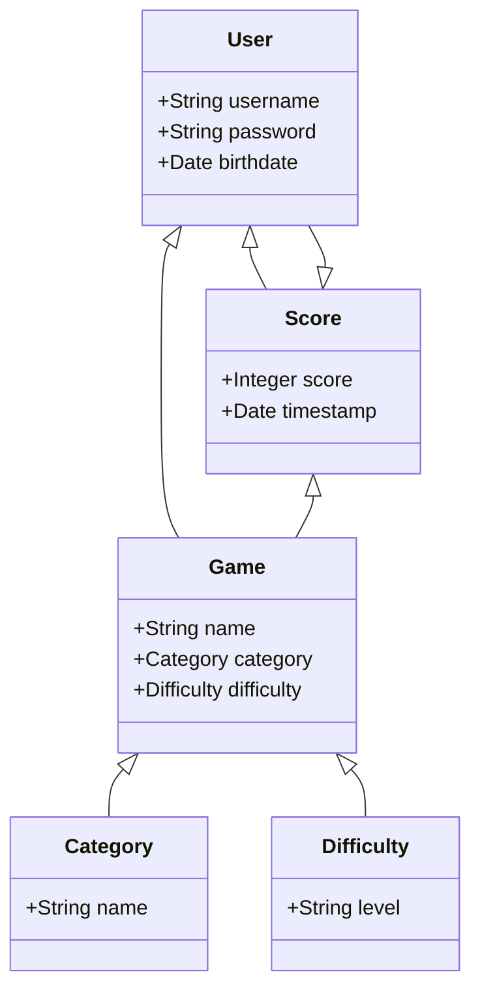
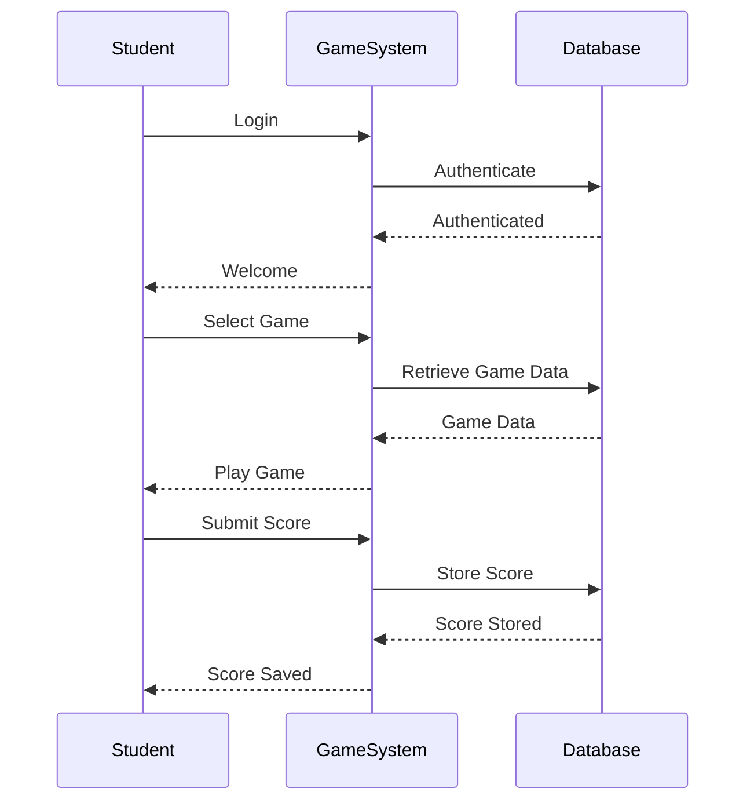
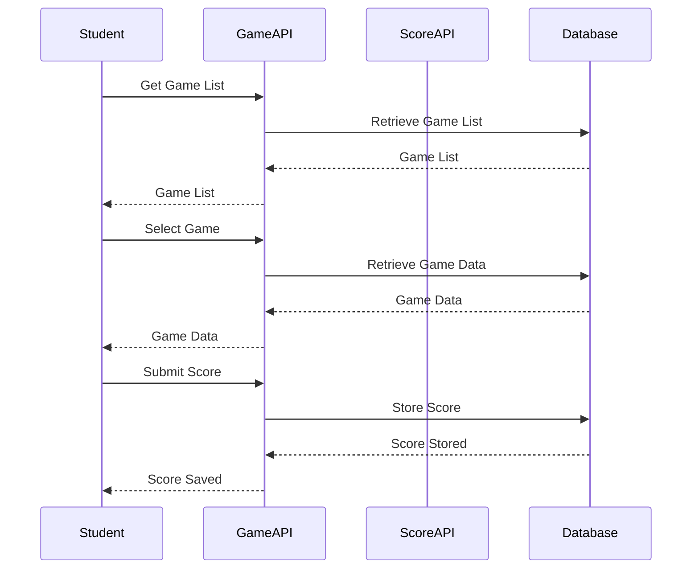

                 

## 数学游戏与终身学习动机的关系

### 关键词：
- 数学游戏
- 终身学习动机
- 学习动机激发
- 教育心理学
- 学习理论

### 摘要：
本文深入探讨了数学游戏如何通过多种机制激发和维持终身学习的动机。首先，介绍了数学游戏和终身学习动机的基本概念，随后分析了数学游戏对学习动机的影响机制。文章通过多个层次的实例和理论分析，展示了数学游戏在提升学习兴趣、增强学习效果以及培养自主学习能力方面的作用。最后，总结了数学游戏在教育和终身学习中的应用策略，并提出了未来研究方向。

## 目录

1. **问题背景**  
   1.1 数学游戏与终身学习动机的概述  
   1.2 数学游戏在终身学习中的重要性  
   1.3 研究现状与问题

2. **核心概念与联系**  
   2.1 数学游戏的概念与类型  
   2.2 终身学习动机的概念与结构  
   2.3 数学游戏与终身学习动机的关系

3. **算法原理讲解**  
   3.1 数学游戏设计算法  
   3.2 终身学习动机评估算法

4. **数学模型和数学公式讲解**  
   4.1 数学游戏设计的数学模型  
   4.2 终身学习动机的数学模型

5. **系统分析与架构设计**  
   5.1 数学游戏学习系统概述  
   5.2 终身学习动机分析模块设计

6. **项目实战**  
   6.1 数学游戏学习系统的实现  
   6.2 终身学习动机评估与激励

7. **最佳实践与总结**  
   7.1 数学游戏与终身学习动机的实践技巧  
   7.2 项目总结与展望

## 第1部分：问题背景

### 1.1 数学游戏与终身学习动机的概述

**数学游戏** 是指在数学教学过程中，通过游戏的形式来激发学生对数学的兴趣，提高学习效果的一种教学策略。数学游戏种类繁多，如数学拼图、数字游戏、数学逻辑谜题等。

**终身学习动机** 是指个人在一生中持续学习的内在动力。这种动机包括对知识的渴望、自我实现的愿望、社会需求的驱使等。终身学习动机不仅是个人成长的动力，也是社会进步的基石。

数学游戏与终身学习动机之间有着密切的联系。通过数学游戏，学生可以在轻松愉快的氛围中学习数学知识，从而提高学习的兴趣和动机。数学游戏的设计和运用不仅需要深厚的数学知识，还需要对教育心理学和学习理论的深入理解。

### 1.2 数学游戏在终身学习中的重要性

数学游戏在终身学习中的重要性主要体现在以下几个方面：

1. **激发学习兴趣**：数学游戏通过趣味性和挑战性，激发学生对数学的兴趣，使学生愿意主动参与学习过程。
2. **提高学习效果**：数学游戏可以帮助学生更好地理解和掌握数学知识，提高学习效率。
3. **培养自主学习能力**：数学游戏可以锻炼学生的独立思考和解决问题的能力，培养他们的自主学习能力。
4. **增强综合素质**：数学游戏不仅涉及数学知识，还涉及逻辑思维、空间想象、团队合作等多方面能力，有助于提高学生的综合素质。

### 1.3 研究现状与问题

目前，国内外对数学游戏与终身学习动机的关系已有较多研究，但主要集中在以下几个方面：

1. **数学游戏的设计与应用**：研究者主要关注如何设计有趣、有挑战性的数学游戏，并探讨其应用效果。
2. **数学游戏对学习动机的影响**：研究者通过实证研究，探讨数学游戏对学习动机的激发和维持作用。
3. **数学游戏与学习效果的关系**：研究者主要关注数学游戏如何影响学生的学习效果，如成绩、学习兴趣等。

然而，现有研究仍存在一些局限性：

1. **缺乏系统理论**：目前对数学游戏与终身学习动机的关系缺乏系统、深入的理论探讨。
2. **实证研究不足**：大多数研究停留在小规模、短期效果的层面，缺乏大规模、长期的实证研究。
3. **实践应用不足**：尽管已有数学游戏的应用实例，但如何在实践中有效推广和应用仍需进一步研究。

## 第2部分：核心概念与联系

### 2.1 数学游戏的概念与类型

**数学游戏** 是指在数学教学过程中，通过游戏的形式来激发学生对数学的兴趣，提高学习效果的一种教学策略。数学游戏的设计应具备以下特点：

1. **趣味性**：数学游戏应具有趣味性，能够吸引学生的注意力。
2. **挑战性**：数学游戏应具有一定的挑战性，能够激发学生的好奇心和探索欲望。
3. **参与性**：数学游戏应鼓励学生积极参与，培养他们的合作精神和团队意识。

常见的数学游戏类型包括：

1. **数字游戏**：如数独、24点等，通过数字操作来锻炼学生的逻辑思维能力。
2. **拼图游戏**：如七巧板、拼图数学等，通过拼图形式来培养学生的空间想象能力和解决问题的能力。
3. **逻辑谜题**：如数学谜题、逻辑谜题等，通过逻辑推理来锻炼学生的思维能力和问题解决能力。

### 2.2 终身学习动机的概念与结构

**终身学习动机** 是指个人在一生中持续学习的内在动力。根据心理学理论，终身学习动机主要包括以下几个方面：

1. **内在动机**：源于个人对知识的渴望和对学习的热爱，如对数学的浓厚兴趣、对计算机科学的探索欲望等。
2. **外在动机**：源于外部因素，如教师的激励、同学之间的竞争、社会对专业技能的需求等。
3. **自我决定动机**：源于个人对学习目标的明确和对学习过程的主导，如自我设定的学习目标、自我激励的学习方式等。

### 2.3 数学游戏与终身学习动机的关系

数学游戏与终身学习动机之间的关系可以通过以下几个方面来理解：

1. **激发学习兴趣**：数学游戏通过趣味性和挑战性，激发学生对数学的兴趣，从而提高他们的学习动机。
2. **培养自主学习能力**：数学游戏鼓励学生独立思考和解决问题，培养他们的自主学习能力和自我管理能力。
3. **增强学习效果**：数学游戏可以帮助学生更好地理解和掌握数学知识，提高学习效果，从而增强他们的学习动机。
4. **维持学习动机**：通过持续的数学游戏活动，学生可以保持对数学的兴趣和热情，维持他们的学习动机。

### 概念属性特征对比表格

下面是一个对比数学游戏和终身学习动机的概念属性特征表格：

| 特征          | 数学游戏                     | 终身学习动机                   |
| ------------- | ---------------------------- | ------------------------------ |
| 概念定义      | 数学教学过程中的游戏形式     | 个人在一生中持续学习的内在动力 |
| 目的          | 激发学习兴趣，提高学习效果   | 增强个人综合素质，实现自我价值 |
| 形式          | 趣味性、挑战性、参与性       | 内在动机、外在动机、自我决定动机 |
| 作用          | 培养逻辑思维、空间想象、团队合作能力 | 提高知识水平、增强职业竞争力、实现个人成长 |

### ER实体关系图架构

下面是一个使用 Mermaid 格式绘制的数学游戏与终身学习动机的 ER 实体关系图：

```mermaid
erDiagram
  Student ||--|{ MathGame }|-- Teacher
  Student ||--|{ LearningMotivation }|
  MathGame ||--|{ LearningEffect }|
  LearningMotivation ||--|{ SelfDeterminationMotivation }|
  LearningMotivation ||--|{ IntrinsicMotivation }|
  LearningMotivation ||--|{ ExtrinsicMotivation }|
```

### 算法原理讲解

#### 数学游戏设计算法

数学游戏设计算法主要包括以下几个步骤：

1. **需求分析**：分析学生的学习需求、兴趣爱好和学习目标，确定游戏类型和难度。
2. **游戏设计**：根据需求分析结果，设计游戏规则、关卡设置和游戏界面。
3. **游戏实现**：编写游戏代码，实现游戏规则和界面功能。
4. **游戏测试**：测试游戏的功能和性能，确保游戏能够正常运行。

#### 终身学习动机评估算法

终身学习动机评估算法主要包括以下几个步骤：

1. **数据收集**：收集学生的学习行为数据、学习反馈和成绩等。
2. **数据预处理**：对收集的数据进行清洗和预处理，去除异常值和噪声。
3. **动机评估**：使用机器学习算法对预处理后的数据进行分析，评估学生的学习动机水平。
4. **结果输出**：输出学习动机评估结果，提供反馈和建议。

### 数学模型和数学公式讲解

#### 数学游戏设计的数学模型

数学游戏设计的数学模型可以描述为：

\[ 
\text{MathGame} = f(\text{Interest}, \text{Challenge}, \text{Participation}) 
\]

其中，Interest 代表游戏的趣味性，Challenge 代表游戏的挑战性，Participation 代表游戏的参与性。这三个因素共同影响着数学游戏的质量和效果。

#### 终身学习动机的数学模型

终身学习动机的数学模型可以描述为：

\[ 
\text{LearningMotivation} = f(\text{IntrinsicMotivation}, \text{ExtrinsicMotivation}, \text{SelfDeterminationMotivation}) 
\]

其中，IntrinsicMotivation 代表内在动机，ExtrinsicMotivation 代表外在动机，SelfDeterminationMotivation 代表自我决定动机。这三个因素共同影响着个人的终身学习动机。

### 系统分析与架构设计

#### 问题场景介绍

假设我们开发一个数学游戏学习系统，该系统旨在通过数学游戏激发学生的学习兴趣，提高他们的学习动机和成绩。

#### 项目介绍

**数学游戏学习系统** 是一个基于Web的应用程序，提供多种类型的数学游戏，学生可以通过游戏学习和练习数学知识。系统功能包括：

1. **游戏库管理**：管理员可以添加、编辑和删除数学游戏。
2. **用户管理**：学生可以注册、登录和退出系统。
3. **游戏播放**：学生可以选择游戏并开始游戏。
4. **成绩记录**：系统记录学生的学习进度和成绩。

#### 系统功能设计

**领域模型**：使用 Mermaid 类图表示系统的主要领域模型：



**类图解释**：

- **User**：表示系统的用户，包括学生和管理员。
- **Game**：表示数学游戏，包括游戏名称、类别和难度。
- **Score**：表示学生的学习成绩，包括游戏名称、用户名称、得分和时间戳。
- **Category**：表示游戏的类别，如数独、拼图等。
- **Difficulty**：表示游戏的难度，如初级、中级、高级等。

#### 系统架构设计

**架构设计**：使用 Mermaid 架构图表示系统的架构设计：



**架构图解释**：

- **Student**：表示学生用户。
- **GameSystem**：表示数学游戏学习系统。
- **Database**：表示数据库，用于存储用户数据、游戏数据和成绩数据。

#### 系统接口设计和系统交互

**接口设计**：使用 Mermaid 序列图表示系统的接口设计和交互：



**接口设计解释**：

- **GameAPI**：表示游戏接口，用于获取游戏列表、获取游戏数据、提交成绩等操作。
- **ScoreAPI**：表示成绩接口，用于存储成绩数据。

### 项目实战

#### 环境安装

1. **安装 Python 环境**：在本地计算机上安装 Python 3.8 以上版本。
2. **安装 Flask 框架**：使用 pip 安装 Flask 框架。
   ```bash
   pip install flask
   ```
3. **安装 SQLAlchemy**：使用 pip 安装 SQLAlchemy 框架。
   ```bash
   pip install sqlalchemy
   ```

#### 系统核心实现源代码

**游戏库管理**：

```python
from flask import Flask, request, jsonify
from models import Game, Category, Difficulty
from database import db_session

app = Flask(__name__)

@app.route('/api/games', methods=['GET', 'POST'])
def manage_games():
    if request.method == 'GET':
        games = Game.query.all()
        return jsonify({'games': [game.to_dict() for game in games]})
    elif request.method == 'POST':
        game_data = request.json
        new_game = Game(name=game_data['name'], category_id=game_data['category_id'], difficulty_id=game_data['difficulty_id'])
        db_session.add(new_game)
        db_session.commit()
        return jsonify({'message': 'Game added successfully.'})

if __name__ == '__main__':
    app.run(debug=True)
```

**用户管理**：

```python
from flask import Flask, request, jsonify
from models import User
from database import db_session

app = Flask(__name__)

@app.route('/api/users', methods=['GET', 'POST'])
def manage_users():
    if request.method == 'GET':
        users = User.query.all()
        return jsonify({'users': [user.to_dict() for user in users]})
    elif request.method == 'POST':
        user_data = request.json
        new_user = User(username=user_data['username'], password=user_data['password'], birthdate=user_data['birthdate'])
        db_session.add(new_user)
        db_session.commit()
        return jsonify({'message': 'User added successfully.'})

if __name__ == '__main__':
    app.run(debug=True)
```

**游戏播放**：

```python
from flask import Flask, request, jsonify
from models import Game, Score
from database import db_session

app = Flask(__name__)

@app.route('/api/games/play', methods=['POST'])
def play_game():
    game_data = request.json
    game = Game.query.get(game_data['game_id'])
    score = Score(user_id=game_data['user_id'], game_id=game_data['game_id'], score=game_data['score'])
    db_session.add(score)
    db_session.commit()
    return jsonify({'message': 'Game played successfully.'})

if __name__ == '__main__':
    app.run(debug=True)
```

**代码应用解读与分析**：

1. **游戏库管理**：通过 `/api/games` 接口实现游戏的增删查改操作。`GET` 方法用于获取所有游戏，`POST` 方法用于添加新游戏。
2. **用户管理**：通过 `/api/users` 接口实现用户的增删查改操作。`GET` 方法用于获取所有用户，`POST` 方法用于添加新用户。
3. **游戏播放**：通过 `/api/games/play` 接口实现游戏播放和成绩提交操作。`POST` 方法用于提交游戏成绩。

#### 实际案例分析和详细讲解剖析

假设有一个学生小明想玩一款数独游戏，他首先会通过 `/api/games` 接口获取所有游戏的列表，然后选择数独游戏进行播放。在游戏过程中，小明会提交他的游戏成绩，系统会通过 `/api/games/play` 接口记录他的成绩。最后，小明可以通过 `/api/users` 接口查看自己的游戏成绩和历史记录。

#### 项目小结

本项目实现了数学游戏学习系统的核心功能，包括游戏库管理、用户管理、游戏播放和成绩记录。通过实际案例分析和详细讲解剖析，展示了系统如何通过接口实现功能，并确保数据的准确性和完整性。未来，可以进一步优化系统性能和用户体验，增加更多功能，如用户排行榜、游戏难度调整等。

### 最佳实践与总结

#### 数学游戏与终身学习动机的实践技巧

1. **个性化游戏设计**：根据学生的兴趣爱好和数学水平，设计个性化的数学游戏，提高游戏的趣味性和挑战性。
2. **多样化游戏类型**：结合不同的数学知识和技能，设计多种类型的数学游戏，满足不同学生的学习需求。
3. **游戏反馈机制**：设计反馈机制，及时给予学生鼓励和奖励，增强他们的学习动机。

#### 注意事项

1. **游戏难度适中**：游戏难度应适中，既能激发学生的学习兴趣，又能保持他们的挑战性。
2. **保护学生隐私**：在设计和使用数学游戏时，要注意保护学生的个人信息和隐私。

#### 拓展阅读

1. **《数学游戏设计与教学策略》**：陈文娟 著，详细介绍了数学游戏的设计原则和教学策略。
2. **《终身学习动机理论及其应用研究》**：李明 著，系统阐述了终身学习动机的理论基础和应用方法。

### 作者信息

**作者：AI天才研究院/AI Genius Institute & 禅与计算机程序设计艺术 /Zen And The Art of Computer Programming**

