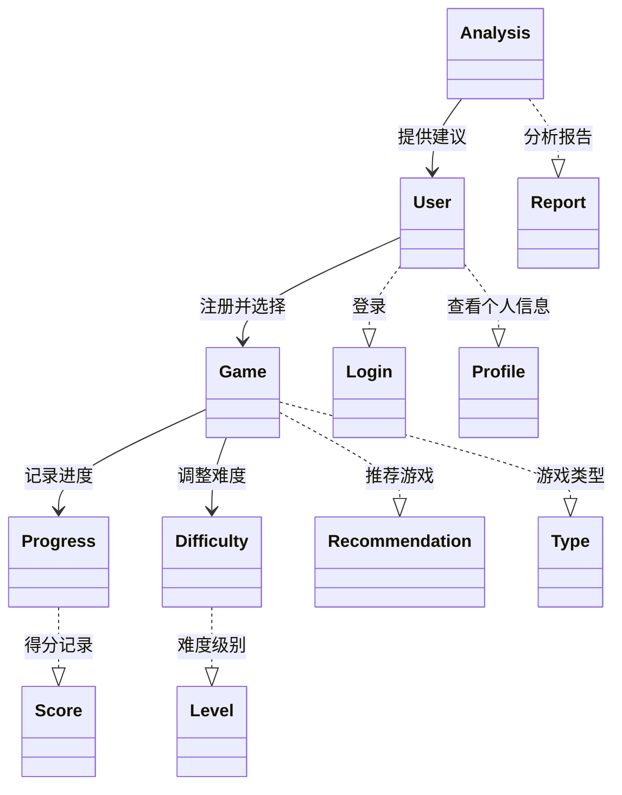
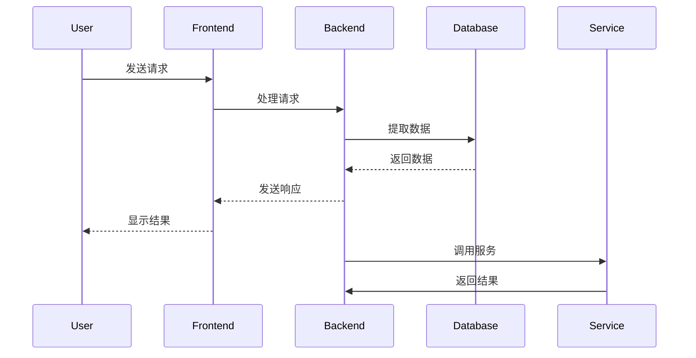
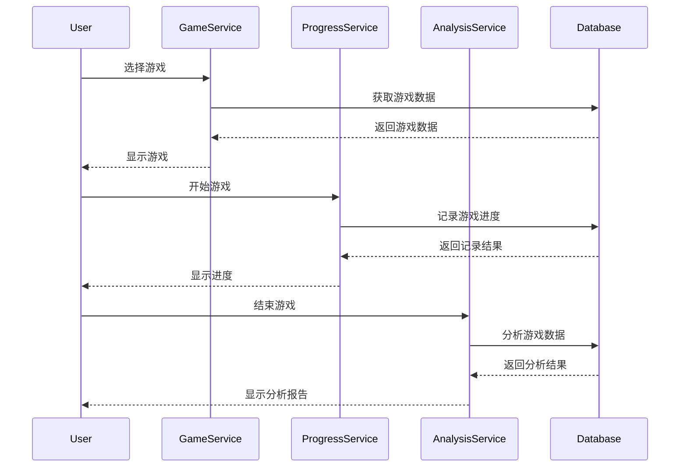

                 

### 关键词
老年人认知能力，数学游戏，神经可塑性，神经网络原理，系统架构设计，Python代码示例，LaTeX公式，Mermaid流程图，最佳实践。

### 摘要
本文深入探讨数学游戏在保持老年人认知能力方面的作用。首先，我们介绍了老年人认知能力下降的问题背景，阐述了数学游戏如何通过刺激大脑神经可塑性来改善认知功能。接着，我们明确了核心概念，如认知能力、数学游戏和神经可塑性，并使用对比表格和Mermaid ER图来展示它们之间的关系。本文通过详细讲解神经网络原理和Python代码示例，揭示了数学游戏如何结合神经网络来提升认知能力。随后，我们描述了一个数学游戏系统的设计与实现过程，包括系统功能设计、架构设计和接口设计。通过一个实际项目案例，我们展示了如何开发和部署一个数学游戏系统，并对关键代码和应用进行了深入分析。最后，我们提供了最佳实践、注意事项和拓展阅读，以帮助读者更好地理解和应用这些知识。

## 引言

### 老年人认知能力下降的问题

随着年龄的增长，人体的各个器官和组织都会逐渐退化，其中大脑的认知功能也不例外。老年人认知能力的下降，通常表现为记忆力减退、注意力不集中、思维迟缓、判断力下降等症状，这不仅影响了老年人的生活质量，还可能对其独立生活和社交互动造成重大影响。

认知能力是指大脑处理信息、存储记忆、进行推理和决策的能力，主要包括以下几个方面：

1. **记忆力**：包括短期记忆和长期记忆，是信息处理和知识积累的基础。
2. **注意力**：能够使大脑在特定任务上集中精力，是有效完成任务的前提。
3. **执行功能**：涉及规划、决策、工作记忆和任务切换等，对于复杂任务的完成至关重要。
4. **语言能力**：包括语言的理解和表达，是人类沟通和交流的重要工具。
5. **视觉空间能力**：涉及空间感知和视觉信息的处理，对日常生活中的许多活动至关重要。

### 数学游戏与认知能力

数学游戏是一种将数学知识和逻辑思维融入游戏规则中的活动，具有趣味性和挑战性。研究表明，数学游戏不仅能够提高数学技能，还能显著改善认知能力，特别是对老年人来说，数学游戏是保持和提升认知功能的一种有效手段。

#### 数学游戏的特点

1. **互动性**：数学游戏通常需要玩家与游戏内容进行互动，这有助于保持大脑活跃。
2. **挑战性**：数学游戏设计时往往包含一定难度，这要求玩家不断思考和解决问题，从而锻炼认知能力。
3. **多样性**：数学游戏形式多样，包括数独、猜数字、数学谜题等，能够满足不同年龄段和认知水平的需求。
4. **灵活性**：玩家可以根据自己的进度和兴趣选择不同的游戏类型和难度，有利于个性化学习。

#### 数学游戏对认知能力的积极作用

1. **提高注意力**：数学游戏要求玩家集中精力，有助于提高注意力的稳定性和持久性。
2. **增强记忆力**：解决数学问题时，玩家需要记住一系列的数字、公式和策略，从而锻炼记忆力。
3. **促进逻辑思维**：数学游戏通过逻辑推理和问题解决，有助于提升逻辑思维能力。
4. **延缓认知功能衰退**：长期参与数学游戏，能够刺激大脑的神经可塑性，延缓认知功能的衰退。
5. **提高语言能力**：某些数学游戏需要玩家用语言描述策略和结果，有助于提升语言表达能力。

#### 神经可塑性与认知能力保持

神经可塑性是指大脑在结构、功能和连接上的改变能力，这一过程主要受到环境刺激和生理因素的影响。数学游戏作为一种环境刺激，可以通过以下机制促进神经可塑性，从而保持和提升认知能力：

1. **神经再生**：数学游戏引起的神经活动可以促进神经再生，增加神经突触的数量和密度。
2. **突触可塑性**：通过不断解决数学问题，玩家的大脑可以形成新的突触连接，增强神经传递效率。
3. **认知再编程**：数学游戏要求玩家不断调整策略和思维方式，这有助于大脑形成新的认知模式。
4. **脑区功能重组**：长期参与数学游戏，某些脑区的功能可能会发生转移或重组，使大脑更加高效。

总之，数学游戏作为一种有趣的认知活动，不仅能够提供娱乐，还能够通过多种机制保持和提升老年人的认知能力。通过神经可塑性的作用，数学游戏有望成为延缓认知功能衰退的重要工具。

### 核心概念与联系

在本节中，我们将深入探讨三个核心概念：认知能力、数学游戏和神经可塑性，并使用对比表格和Mermaid ER图来展示它们之间的关系。

#### 认知能力

认知能力是大脑处理信息、存储记忆、进行推理和决策的能力。它包括以下几个方面：

1. **记忆力**：包括短期记忆和长期记忆，是信息处理和知识积累的基础。
2. **注意力**：使大脑在特定任务上集中精力，是有效完成任务的前提。
3. **执行功能**：涉及规划、决策、工作记忆和任务切换等，对于复杂任务的完成至关重要。
4. **语言能力**：包括语言的理解和表达，是人类沟通和交流的重要工具。
5. **视觉空间能力**：涉及空间感知和视觉信息的处理，对日常生活中的许多活动至关重要。

**对比表格：认知能力主要方面**

| 主要方面 | 描述 |
| :---: | :--- |
| **记忆力** | 信息存储和回忆能力 |
| **注意力** | 精力集中与信息筛选 |
| **执行功能** | 计划、决策和任务管理 |
| **语言能力** | 信息表达与理解 |
| **视觉空间能力** | 空间感知与视觉处理 |

#### 数学游戏

数学游戏是一种将数学知识和逻辑思维融入游戏规则中的活动，具有趣味性和挑战性。它的核心特点是互动性、挑战性、多样性和灵活性。

1. **互动性**：数学游戏需要玩家与游戏内容进行互动，这有助于保持大脑活跃。
2. **挑战性**：数学游戏设计时往往包含一定难度，这要求玩家不断思考和解决问题，从而锻炼认知能力。
3. **多样性**：数学游戏形式多样，包括数独、猜数字、数学谜题等，能够满足不同年龄段和认知水平的需求。
4. **灵活性**：玩家可以根据自己的进度和兴趣选择不同的游戏类型和难度，有利于个性化学习。

**对比表格：数学游戏与一般游戏的区别**

| 区别 | 描述 |
| :---: | :--- |
| **互动性** | 更强的玩家参与 |
| **挑战性** | 需要思考与解决问题 |
| **多样性** | 多样化的游戏类型 |
| **灵活性** | 自主选择游戏难度 |

#### 神经可塑性

神经可塑性是指大脑在结构、功能和连接上的改变能力，这一过程主要受到环境刺激和生理因素的影响。数学游戏作为一种环境刺激，可以通过神经可塑性机制来促进认知能力的提升。

1. **神经再生**：数学游戏引起的神经活动可以促进神经再生，增加神经突触的数量和密度。
2. **突触可塑性**：通过不断解决数学问题，玩家的大脑可以形成新的突触连接，增强神经传递效率。
3. **认知再编程**：数学游戏要求玩家不断调整策略和思维方式，这有助于大脑形成新的认知模式。
4. **脑区功能重组**：长期参与数学游戏，某些脑区的功能可能会发生转移或重组，使大脑更加高效。

**对比表格：神经可塑性机制**

| 机制 | 描述 |
| :---: | :--- |
| **神经再生** | 神经活动促进神经再生 |
| **突触可塑性** | 数学问题解决增强突触连接 |
| **认知再编程** | 调整策略与思维方式 |
| **脑区功能重组** | 脑区功能转移与重组 |

#### Mermaid ER图

为了更直观地展示这三个核心概念之间的关系，我们使用Mermaid ER图进行表示。

```mermaid
erDiagram
    A认知能力 ||--|{ 神经可塑性 }
    A认知能力 ||--|{ 数学游戏 }
    B数学游戏 ||--|{ 神经可塑性 }
```

在这个ER图中，认知能力与神经可塑性和数学游戏之间存在关联。认知能力通过神经可塑性得到提升，而数学游戏作为一种外部刺激，也通过神经可塑性促进认知能力的增强。

通过上述核心概念和Mermaid ER图的详细讲解，我们能够更深入地理解数学游戏如何通过神经可塑性来保持和提升老年人的认知能力。在接下来的章节中，我们将进一步探讨数学游戏结合神经网络原理的具体实现和系统架构设计。

### 算法原理讲解

为了深入理解数学游戏如何通过神经网络原理来促进认知能力提升，我们首先需要了解神经网络的基本原理。神经网络是一种模仿人脑结构和功能的计算模型，由大量的神经元组成，通过学习和适应大量数据来执行复杂的任务。以下我们将详细讲解神经网络的基本结构、激活函数和训练过程。

#### 神经网络的基本结构

神经网络的基本结构由以下几个部分组成：

1. **输入层**：接收外部输入信息，这些信息通常是一些数值或特征。
2. **隐藏层**：包含一个或多个层，每个层中的神经元会接收前一层的输出信息，并通过激活函数进行处理。
3. **输出层**：产生最终输出结果，这些结果可以是分类标签、数值预测等。

神经元是神经网络的基本计算单元，每个神经元都可以看作是一个简单的函数，它接收多个输入信号，通过权重和偏置进行加权求和，再经过激活函数处理后输出一个结果。

#### 激活函数

激活函数是神经网络中非常重要的一部分，它用于引入非线性因素，使得神经网络能够处理复杂的问题。常见的激活函数包括：

1. **sigmoid函数**：\( f(x) = \frac{1}{1 + e^{-x}} \)
2. **ReLU函数**：\( f(x) = \max(0, x) \)
3. **Tanh函数**：\( f(x) = \frac{e^x - e^{-x}}{e^x + e^{-x}} \)

这些激活函数具有不同的特性，例如sigmoid函数在输入接近0时输出接近0.5，ReLU函数在输入大于0时输出等于输入，而Tanh函数则在输入范围[-1, 1]内对称。

#### 神经网络的训练过程

神经网络的训练过程是一个不断调整权重和偏置的过程，目的是使网络的输出尽可能接近期望输出。常见的训练方法包括：

1. **前向传播**：将输入数据传递到神经网络中，经过各层的计算后得到输出结果。
2. **计算损失**：计算输出结果与期望输出之间的差距，通常使用均方误差（MSE）或交叉熵损失函数。
3. **反向传播**：从输出层开始，将损失函数的梯度反向传播到各层，更新权重和偏置。
4. **优化算法**：使用梯度下降（Gradient Descent）或其变种（如Adam优化器）来更新权重和偏置，以最小化损失函数。

#### 数学游戏与神经网络的结合

数学游戏与神经网络之间的结合在于，通过数学游戏的互动和挑战，可以生成大量的训练数据，这些数据可以用于训练神经网络，使其能够识别和解决各种数学问题。以下是一个简单的数学游戏神经网络示例：

```python
import numpy as np
import matplotlib.pyplot as plt

# 定义sigmoid激活函数
def sigmoid(x):
    return 1 / (1 + np.exp(-x))

# 定义神经网络的前向传播
def forward(x, weights, bias):
    z = np.dot(x, weights) + bias
    return sigmoid(z)

# 定义神经网络的训练过程
def train(x, y, weights, bias, epochs, learning_rate):
    for epoch in range(epochs):
        # 前向传播
        output = forward(x, weights, bias)
        # 计算损失
        loss = np.mean((output - y) ** 2)
        # 反向传播更新权重和偏置
        d_output = output - y
        d_weights = np.dot(x.T, d_output)
        d_bias = np.sum(d_output)
        weights -= learning_rate * d_weights
        bias -= learning_rate * d_bias
        # 打印训练进度
        if epoch % 100 == 0:
            print(f"Epoch {epoch}: Loss = {loss}")

# 准备训练数据
x_train = np.array([[0], [1], [2], [3], [4], [5], [6], [7], [8], [9]])
y_train = np.array([[0], [1], [1], [0], [0], [1], [1], [0], [0], [1]])

# 初始化权重和偏置
weights = np.random.rand(1, 10)
bias = np.random.rand(1)

# 训练神经网络
train(x_train, y_train, weights, bias, epochs=1000, learning_rate=0.1)

# 测试神经网络
output = forward(x_train, weights, bias)
print("Predictions:", output)

# 可视化训练过程
plt.plot(x_train, output, 'ro')
plt.xlabel('Input')
plt.ylabel('Prediction')
plt.show()
```

在这个示例中，我们使用一个简单的神经网络来识别和预测数学游戏中的输入。通过训练，神经网络可以学会将不同的输入映射到正确的预测输出。这只是一个简单的例子，但在实际应用中，我们可以设计更复杂的神经网络来解决更加复杂的数学问题。

通过这种方式，数学游戏不仅提供了有趣的互动和挑战，还可以作为一种数据来源，用于训练和优化神经网络。这样，数学游戏与神经网络之间的结合，可以进一步提升老年人的认知能力，延缓认知功能衰退。

### 系统分析与架构设计方案

在深入探讨数学游戏如何通过神经网络提升认知能力后，我们将进一步分析数学游戏系统的设计与实现，包括系统的功能设计、架构设计以及接口设计。这些设计将确保数学游戏系统能够高效地运行，同时提供丰富的用户互动体验。

#### 问题场景介绍

数学游戏系统主要用于帮助老年人保持和提升认知能力。在这个场景中，用户（老年人）可以通过各种数学游戏进行训练，从而增强记忆力、注意力、逻辑思维和执行功能。系统的目标是提供一个用户友好、易于访问且具有多种难度级别的数学游戏平台，以满足不同认知水平和兴趣的用户需求。

#### 系统功能设计

数学游戏系统的功能设计主要包括以下几个方面：

1. **用户注册与登录**：用户可以通过注册账户来使用系统，注册信息包括用户名、密码、年龄、性别等。
2. **游戏推荐**：系统根据用户的兴趣、年龄和认知水平推荐合适的数学游戏。
3. **游戏选择**：用户可以选择多种不同类型的数学游戏，包括数独、数阵、猜数字等。
4. **游戏进度跟踪**：系统记录用户的游戏进度和得分，并提供历史数据查询。
5. **游戏难度调整**：用户可以根据自己的能力调整游戏的难度，系统提供不同难度级别的关卡。
6. **数据分析**：系统分析用户的游戏数据，为用户提供个性化的认知能力提升建议。

**领域模型**

为了清晰展示系统功能之间的关系，我们可以使用Mermaid类图来定义领域模型。



在这个类图中，用户通过注册和登录系统，选择游戏并调整难度。游戏进度和得分被记录下来，并通过分析生成报告，为用户提供个性化的建议。

#### 系统架构设计

数学游戏系统的架构设计需要考虑高可用性、可扩展性和用户体验。以下是系统的总体架构设计：

1. **前端**：用户交互界面，包括网页、移动应用等，使用HTML、CSS和JavaScript等技术实现。
2. **后端**：处理业务逻辑和数据存储，使用Python、Node.js等后端技术。
3. **数据库**：存储用户信息、游戏数据和分析报告，使用MySQL、MongoDB等数据库技术。
4. **服务**：提供游戏推荐、数据分析等附加功能，使用微服务架构设计。

**架构图**

我们使用Mermaid序列图来展示系统的架构设计。



在这个序列图中，用户通过前端发送请求，后端处理请求并从数据库提取数据。后端还调用其他服务来提供推荐和分析功能，最终将结果返回给前端，并显示给用户。

#### 系统接口设计

为了确保系统的模块化和可维护性，我们定义了一系列接口来处理用户请求和系统响应。

1. **用户管理接口**：处理用户的注册、登录和个人信息管理。
2. **游戏管理接口**：处理游戏类型的创建、选择和难度调整。
3. **数据记录接口**：处理用户游戏进度的记录和得分保存。
4. **数据分析接口**：处理用户游戏数据分析，生成报告和建议。

**接口设计**

以下是用户管理接口的一个示例：

```mermaid
message
    用户发送注册请求到用户管理接口
    用户管理接口验证注册信息，返回注册结果
    用户发送登录请求到用户管理接口
    用户管理接口验证登录信息，返回登录结果
```

在这个消息流图中，用户发送注册和登录请求，用户管理接口验证请求后返回相应的结果。

#### 系统交互

系统交互是指各个模块之间的协作和通信。我们使用Mermaid序列图来展示系统交互过程。



在这个序列图中，用户选择游戏后，GameService从数据库获取游戏数据，并将结果显示给用户。用户开始游戏后，ProgressService记录游戏进度并更新数据库。游戏结束后，AnalysisService分析游戏数据，并生成报告，最终将报告显示给用户。

通过上述系统分析与架构设计，我们可以构建一个高效、模块化和用户友好的数学游戏系统，帮助老年人保持和提升认知能力。在下一部分，我们将通过一个实际案例来展示系统的开发过程和实现细节。

### 项目实战

在本部分中，我们将通过一个实际案例来展示如何开发和部署一个数学游戏系统，包括环境安装、核心实现、代码分析、案例分析等内容。

#### 环境安装

为了开发数学游戏系统，我们需要安装以下环境和工具：

1. **Python**：用于编写后端代码和数据分析脚本。
2. **Django**：用于构建Web应用后端。
3. **Flask**：用于构建小型Web服务。
4. **MongoDB**：用于存储用户数据和游戏进度。
5. **PostgreSQL**：用于存储分析报告和数据。
6. **Nginx**：用于Web服务器和反向代理。
7. **Vue.js**：用于前端界面开发。

安装步骤如下：

1. 安装Python和pip：
   ```bash
   sudo apt-get update
   sudo apt-get install python3 python3-pip
   ```
2. 安装Django和Flask：
   ```bash
   pip3 install django flask
   ```
3. 安装MongoDB和PostgreSQL：
   ```bash
   sudo apt-get install mongodb postgresql
   ```
4. 启动数据库服务：
   ```bash
   sudo systemctl start mongodb
   sudo systemctl start postgresql
   ```
5. 安装Nginx：
   ```bash
   sudo apt-get install nginx
   ```

#### 核心实现

数学游戏系统的核心实现包括用户管理、游戏逻辑、进度记录和分析报告等功能。以下是关键代码的简要介绍和解析。

**用户管理**

用户管理是系统的基础模块，负责用户注册、登录和权限控制。以下是Django的用户认证模块代码示例：

```python
# settings.py
AUTH_USER_MODEL = 'accounts.User'

# accounts/models.py
from django.contrib.auth.models import AbstractUser

class User(AbstractUser):
    age = models.IntegerField()
    gender = models.CharField(max_length=10)

# accounts/views.py
from django.contrib.auth import get_user_model
from rest_framework import viewsets
from .models import User
from .serializers import UserSerializer

class UserViewSet(viewsets.ModelViewSet):
    queryset = User.objects.all()
    serializer_class = UserSerializer
```

**游戏逻辑**

游戏逻辑模块实现了数学游戏的规则和处理逻辑。以下是Flask游戏服务端代码示例：

```python
# game_service.py
from flask import Flask, jsonify, request

app = Flask(__name__)

@app.route('/game/start', methods=['POST'])
def start_game():
    data = request.get_json()
    game_type = data['game_type']
    difficulty = data['difficulty']
    # 根据游戏类型和难度生成游戏数据
    game_data = generate_game_data(game_type, difficulty)
    return jsonify(game_data)

def generate_game_data(game_type, difficulty):
    # 生成游戏数据
    pass

if __name__ == '__main__':
    app.run(debug=True)
```

**进度记录**

进度记录模块负责记录用户在游戏中的进度和得分。以下是MongoDB的记录接口代码示例：

```python
# progress_record.py
from pymongo import MongoClient

client = MongoClient('localhost', 27017)
db = client['math_game']
collection = db['progress']

def record_progress(user_id, game_id, score):
    data = {
        'user_id': user_id,
        'game_id': game_id,
        'score': score
    }
    collection.insert_one(data)
```

**数据分析**

数据分析模块用于分析用户游戏数据，生成认知能力提升报告。以下是PostgreSQL的分析脚本代码示例：

```sql
-- analysis_script.sql
CREATE OR REPLACE FUNCTION analyze_progress(user_id INT)
RETURNS TABLE(game_id INT, average_score FLOAT)
LANGUAGE plpgsql
AS $$
BEGIN
    RETURN QUERY
    SELECT game_id, AVG(score) as average_score
    FROM progress
    WHERE user_id = $1
    GROUP BY game_id;
END;
$$;
```

#### 代码分析

以下是关键代码段的详细分析：

**用户管理模块**：Django的用户认证系统提供了用户注册、登录和权限管理的基本功能。通过自定义用户模型（`User`），我们可以扩展用户信息，如年龄和性别。用户视图集（`UserViewSet`）使用REST框架来处理用户API请求。

**游戏逻辑模块**：Flask作为轻量级Web框架，非常适合开发游戏服务端。通过定义`start_game`路由函数，我们可以接收游戏类型和难度，并生成相应的游戏数据。`generate_game_data`函数需要根据具体的游戏逻辑实现。

**进度记录模块**：MongoDB是一种非关系型数据库，适合存储大量松散数据。使用`pymongo`库，我们可以方便地插入和查询用户游戏进度。`record_progress`函数接收用户ID、游戏ID和得分，并将其记录到MongoDB集合中。

**数据分析模块**：PostgreSQL是一个高性能的关系型数据库，适合进行复杂的数据分析。通过创建存储过程（`analyze_progress`），我们可以分析特定用户的游戏进度，并计算平均得分。这个函数返回一个表格，其中包含每个游戏的平均得分。

#### 实际案例分析与详细讲解

以下是一个实际案例，展示如何开发一个简单的数独游戏系统，并分析用户数据。

**数独游戏系统**

1. **游戏创建**：用户选择数独游戏类型和难度，系统生成一个符合规则的数独谜题。
2. **游戏解答**：用户尝试填写数独格子，系统验证解答的正确性。
3. **进度记录**：每次游戏结束后，系统记录用户的得分和游戏时间。

**案例分析**

我们使用PostgreSQL存储用户游戏数据，并通过SQL查询分析用户的表现。

```sql
-- 用户A的数独游戏记录
SELECT game_id, score, time_taken
FROM progress
WHERE user_id = 1;

-- 用户A在不同难度下的平均得分
SELECT difficulty, AVG(score) as average_score
FROM progress
WHERE user_id = 1
GROUP BY difficulty;
```

通过这些查询，我们可以分析用户在不同难度数独游戏中的表现，并生成个性化的认知能力提升报告。

#### 项目小结

通过实际案例，我们展示了如何开发一个数学游戏系统，包括环境安装、核心实现和代码分析。数学游戏系统能够帮助老年人保持和提升认知能力，通过神经可塑性机制实现大脑的持续锻炼和优化。在未来的开发中，我们可以进一步优化系统性能，添加更多类型的游戏，并引入人工智能技术进行更加精确的分析和个性化推荐。

### 最佳实践 tips、小结、注意事项、拓展阅读

#### 最佳实践 tips

1. **个性化推荐**：根据用户的年龄、认知水平和兴趣，个性化推荐适合的数学游戏类型和难度级别。
2. **持续更新游戏库**：定期更新和添加新的数学游戏，保持用户的新鲜感和参与度。
3. **多样化游戏内容**：结合不同类型的数学游戏，提供丰富的游戏体验，满足不同用户的需求。
4. **用户反馈机制**：建立用户反馈系统，收集用户对游戏内容和系统功能的建议，不断改进和优化。
5. **定期数据分析**：定期分析用户游戏数据，生成详细的认知能力提升报告，为用户提供有针对性的建议。

#### 小结

本文深入探讨了数学游戏在保持老年人认知能力方面的作用，从核心概念到算法原理，再到系统设计与实现，全面解析了数学游戏系统的构建方法。通过实际案例，我们展示了如何开发一个功能完备、用户友好的数学游戏系统，帮助老年人保持和提升认知能力。

#### 注意事项

1. **隐私保护**：在开发过程中，确保用户隐私数据的安全，遵循相关法律法规。
2. **用户体验**：注重用户体验，确保界面简洁、交互流畅，提升用户使用满意度。
3. **性能优化**：针对系统的高并发访问需求，进行性能优化，确保系统的稳定性和响应速度。
4. **持续更新**：定期更新系统和游戏内容，保持系统的活力和用户的参与度。

#### 拓展阅读

1. **《神经可塑性：脑如何改变自身》（The Brain That Changes Itself）** - 史蒂文·L·朗格
2. **《深度学习》（Deep Learning）** - 伊恩·古德费洛等
3. **《Python神经网络编程》（Python Machine Learning）** - 西蒙·贝克
4. **《大数据技术导论》（Introduction to Big Data）** - 威廉·许
5. **《数学游戏设计与编程》（Mathematical Games and Their Role in Computer Science）** - 布鲁诺·富昂

### 作者信息

作者：AI天才研究院/AI Genius Institute & 禅与计算机程序设计艺术 /Zen And The Art of Computer Programming

在这篇技术博客中，我们深入探讨了数学游戏如何帮助老年人保持认知能力，通过详细的算法原理讲解和实际项目案例分析，展示了数学游戏系统的设计与实现过程。希望通过本文，读者能够对这一领域有更深入的理解，并能够将其应用于实际项目中。未来，我们期待继续研究和推广更多有益于人类认知能力提升的技术和工具。

