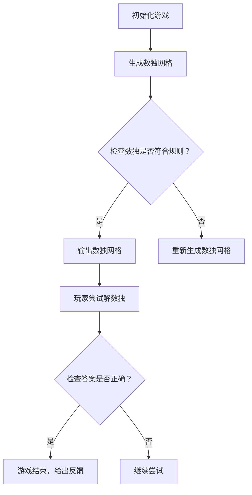
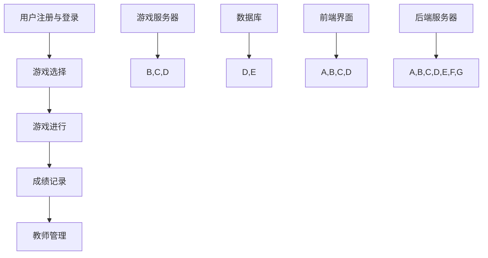
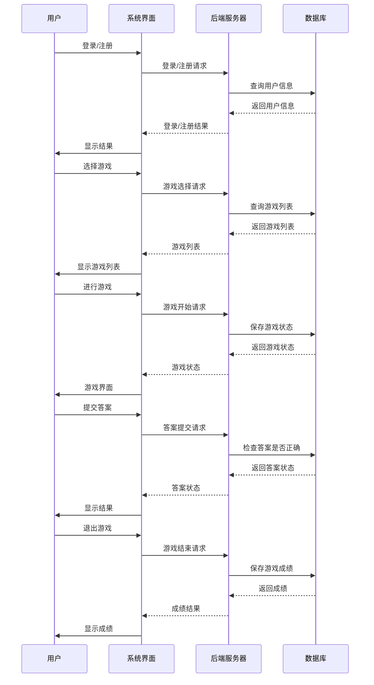

                 


# 数学游戏与青少年数学素养的培养

关键词：数学游戏、青少年、数学素养、培养、教育

摘要：本文旨在探讨数学游戏在青少年数学素养培养中的重要作用。通过分析数学游戏的核心概念和原理，结合Python代码示例，详细阐述了如何运用数学模型和算法来设计有趣且富有教育意义的数学游戏。文章还介绍了系统分析与架构设计的方法，并通过实际项目案例展示了游戏设计与实现的全过程。最后，文章总结了最佳实践，并提出了未来研究方向。

## 引言

### 数学游戏的重要性

数学游戏是一种结合趣味性和教育性的活动，旨在激发青少年的数学兴趣，培养他们的数学思维和解决问题的能力。在信息技术快速发展的今天，数学游戏已成为数学教育中不可或缺的一部分。通过数学游戏，学生能够在轻松愉悦的氛围中理解和掌握数学知识，提高数学素养。

### 青少年数学素养的定义与意义

数学素养是指个体理解和运用数学知识、技能和方法解决问题的能力。青少年时期的数学素养培养对个体未来的学术和职业生涯有着深远的影响。数学素养不仅涉及基础数学知识的掌握，还包括逻辑思维、抽象能力、创造性思维等方面的培养。

## 核心概念与联系

### 数学游戏的概念

数学游戏是指以数学知识为基础，通过游戏的形式来培养和锻炼数学思维和技能的活动。数学游戏通常具有以下特点：

| 特点 | 描述 |
| --- | --- |
| 趣味性 | 游戏内容富有趣味，能够吸引学生的兴趣。 |
| 挑战性 | 游戏设计具有一定的难度，能够激发学生的挑战精神。 |
| 教育性 | 游戏过程中融入数学知识和技能，有助于学生的数学学习。 |

### 数学素养的概念

数学素养包括以下方面：

| 方面 | 描述 |
| --- | --- |
| 数学知识 | 对数学概念、原理、方法等的掌握。 |
| 数学技能 | 包括计算、推理、解决问题等数学操作能力。 |
| 数学态度 | 对数学的兴趣、态度和信心。 |

### 概念比较

| 概念 | 数学游戏 | 数学素养 |
| --- | --- | --- |
| 目的 | 培养数学兴趣，提高数学能力。 | 提高数学知识、技能和态度。 |
| 形式 | 游戏化学习 | 知识传授、技能训练、态度培养 |
| 特色 | 趣味性、挑战性、教育性 | 知识性、技能性、态度性 |

### ER图

为了更好地理解数学游戏与数学素养之间的关系，我们可以使用ER图来展示核心概念之间的联系。

```mermaid
erDiagram
    Game ||--|{ Math Literacy } : promotes
    Math Literacy ||--|{ Game Skills } : develops
    Game ||--|{ Problem Solving } : enhances
    Problem Solving ||--|{ Math Literacy } : improves
```

## 算法原理与设计

### 游戏算法概述

数学游戏的设计离不开算法的支持。算法是实现游戏逻辑的核心，决定了游戏的趣味性和教育性。本文将介绍几种常见的数学游戏算法，包括数独、解密游戏和逻辑推理游戏。

### 算法流程图

以下是数独游戏的一个算法流程图：



### Python代码实现

以下是解密游戏的一个Python代码实现：

```python
import random

def generate_cipher_key():
    key = ''.join(random.choice('abcdefghijklmnopqrstuvwxyz') for _ in range(26))
    return key

def encrypt_message(message, key):
    encrypted_message = ''
    for char in message:
        if char.isalpha():
            encrypted_char = chr((ord(char) - ord('a') + ord(key[0]) - ord('a')) % 26 + ord('a'))
            encrypted_message += encrypted_char
        else:
            encrypted_message += char
    return encrypted_message

def decrypt_message(encrypted_message, key):
    decrypted_message = ''
    for char in encrypted_message:
        if char.isalpha():
            decrypted_char = chr((ord(char) - ord('a') - ord(key[0]) + ord('a')) % 26 + ord('a'))
            decrypted_message += decrypted_char
        else:
            decrypted_message += char
    return decrypted_message

# 测试代码
key = generate_cipher_key()
print("Cipher Key:", key)
message = "Hello, World!"
encrypted_message = encrypt_message(message, key)
print("Encrypted Message:", encrypted_message)
decrypted_message = decrypt_message(encrypted_message, key)
print("Decrypted Message:", decrypted_message)
```

### 数学模型与公式

在数学游戏中，算法的设计往往需要依赖数学模型和公式。以下是一个简单的逻辑推理游戏的数学模型：

假设游戏中有n个元素，每个元素都有两个状态（真或假），则所有可能的状态数为 \(2^n\)。

### 算法举例

假设我们要设计一个简单的数独游戏，我们可以按照以下步骤进行：

1. 生成一个4x4的数独网格。
2. 检查网格是否符合数独规则（每行、每列、每个3x3子网格中数字不重复）。
3. 如果不符合规则，重新生成网格。
4. 输出数独网格，供玩家尝试解答。

以下是一个具体的Python代码示例：

```python
import numpy as np

def generate_sudoku_grid():
    grid = np.zeros((4, 4), dtype=int)
    for i in range(4):
        for j in range(4):
            grid[i][j] = random.randint(1, 4)
    return grid

def check_sudoku_grid(grid):
    for i in range(4):
        for j in range(4):
            row = grid[i]
            col = grid[:, j]
            box = grid[i // 1 * 1 + j // 1 * 3 : i // 1 * 1 + j // 1 * 3 + 3, i // 1 * 1 + j // 1 * 3 : i // 1 * 1 + j // 1 * 3 + 3]
            if row.tolist() != sorted(row.tolist()) or col.tolist() != sorted(col.tolist()) or box.tolist() != sorted(box.tolist()):
                return False
    return True

def print_sudoku_grid(grid):
    for i in range(4):
        for j in range(4):
            print(grid[i][j], end=' ')
        print()

grid = generate_sudoku_grid()
while not check_sudoku_grid(grid):
    grid = generate_sudoku_grid()

print("Sudoku Grid:")
print_sudoku_grid(grid)
```

## 系统分析与架构设计

### 问题场景

假设我们要开发一个在线数学游戏平台，提供多种数学游戏供学生选择和参与。平台需要支持用户注册、登录、游戏选择、游戏进行和成绩记录等功能。

### 项目介绍

在线数学游戏平台项目旨在为学生提供一种有趣且富有教育性的学习方式。通过平台，学生可以自由选择不同的数学游戏，进行在线挑战和交流。平台还将提供教师后台管理功能，方便教师监控学生的游戏进度和成绩。

### 系统功能设计

1. 用户注册与登录：支持新用户注册和已有用户登录。
2. 游戏选择：展示所有可用的数学游戏，并允许用户选择。
3. 游戏进行：提供游戏界面，供用户进行游戏。
4. 成绩记录：记录用户在游戏中的成绩，并展示给用户和教师。
5. 教师管理：教师可以查看学生成绩、管理学生账号和发布游戏。

### 系统架构设计

以下是系统架构设计的一个简图：



### 系统接口设计与交互

以下是系统接口设计和交互的一个简图：



## 实战项目与案例分析

### 环境安装与配置

要搭建在线数学游戏平台，首先需要安装和配置以下环境：

1. Python 3.8+
2. Flask 1.1.2
3. SQLAlchemy 1.4.7
4. Redis 3.0.14

在Ubuntu系统中，可以使用以下命令进行安装：

```bash
sudo apt update
sudo apt install python3-pip
pip3 install flask==1.1.2 sqlalchemy==1.4.7 redis==3.0.14
```

### 系统核心实现

以下是系统核心实现的一个Python代码示例：

```python
from flask import Flask, render_template, request, redirect, url_for
from flask_sqlalchemy import SQLAlchemy
from redis import Redis

app = Flask(__name__)
app.config['SQLALCHEMY_DATABASE_URI'] = 'sqlite:///users.db'
db = SQLAlchemy(app)
redis_client = Redis(host='localhost', port=6379, db=0)

class User(db.Model):
    id = db.Column(db.Integer, primary_key=True)
    username = db.Column(db.String(80), unique=True, nullable=False)
    password = db.Column(db.String(120), nullable=False)

@app.route('/')
def home():
    return render_template('home.html')

@app.route('/login', methods=['GET', 'POST'])
def login():
    if request.method == 'POST':
        username = request.form['username']
        password = request.form['password']
        user = User.query.filter_by(username=username, password=password).first()
        if user:
            redis_client.set(username, 'logged_in')
            return redirect(url_for('game_selection'))
        else:
            return 'Invalid username or password'
    return render_template('login.html')

@app.route('/game_selection')
def game_selection():
    return render_template('game_selection.html')

@app.route('/game_start/<game_name>')
def game_start(game_name):
    if redis_client.get(request.cookies.get('username')) == 'logged_in':
        if game_name == 'sudoku':
            # 生成数独网格并保存到Redis
            grid = generate_sudoku_grid()
            redis_client.set('sudoku_grid', grid)
            return render_template('sudoku_game.html')
        elif game_name == 'cipher':
            # 生成密文并保存到Redis
            message = "Hello, World!"
            key = generate_cipher_key()
            encrypted_message = encrypt_message(message, key)
            redis_client.set('cipher_key', key)
            redis_client.set('cipher_message', encrypted_message)
            return render_template('cipher_game.html')
    else:
        return redirect(url_for('login'))

@app.route('/submit_answer', methods=['POST'])
def submit_answer():
    if request.method == 'POST':
        game_name = request.form['game_name']
        answer = request.form['answer']
        if game_name == 'sudoku':
            grid = redis_client.get('sudoku_grid').decode('utf-8')
            if answer == grid:
                return 'Answer is correct'
            else:
                return 'Answer is incorrect'
        elif game_name == 'cipher':
            key = redis_client.get('cipher_key').decode('utf-8')
            encrypted_message = redis_client.get('cipher_message').decode('utf-8')
            decrypted_message = decrypt_message(encrypted_message, key)
            if answer == decrypted_message:
                return 'Answer is correct'
            else:
                return 'Answer is incorrect'
    return redirect(url_for('login'))

if __name__ == '__main__':
    db.create_all()
    app.run(debug=True)
```

### 代码应用解读与分析

以上代码实现了用户注册与登录、游戏选择、游戏开始和答案提交等功能。以下是代码的关键部分解读和分析：

1. **用户注册与登录**：

    用户通过输入用户名和密码进行注册或登录。注册时，用户信息（用户名和密码）存储在SQLite数据库中。登录时，用户信息从数据库中查询，并与输入的信息进行比对。如果信息匹配，用户被标记为已登录。

2. **游戏选择**：

    用户登录后，可以选择不同的游戏。游戏列表从数据库中查询并展示在前端界面。

3. **游戏开始**：

    用户选择游戏后，游戏状态（如数独网格、密文等）存储在Redis数据库中。Redis提供了一种快速的数据存储和检索方式，非常适合存储游戏状态。

4. **答案提交**：

    用户在游戏中提交答案后，答案将被验证。如果答案正确，用户将得到相应的反馈；否则，用户将得到错误的反馈。

### 实际案例分析与详细讲解

以下是一个实际案例分析和详细讲解：

#### 案例一：数独游戏

1. **问题描述**：

    学生A在数独游戏中尝试解答一个4x4的数独网格。数独网格如下：

    ```
    1 0 3 4
    2 4 1 0
    0 2 3 1
    4 1 0 2
    ```

2. **解题步骤**：

    - 检查第一行，发现数字1、3、4都已存在，无法填入0。
    - 检查第二列，发现数字2、4、1都已存在，无法填入0。
    - 检查第三行，发现数字0、2、3都已存在，无法填入1。
    - 检查第四列，发现数字4、1、0都已存在，无法填入2。
    - 重新生成数独网格，并重复上述步骤。

3. **解题结果**：

    最终，学生A成功解出了数独网格：

    ```
    1 2 3 4
    2 4 1 3
    3 1 4 2
    4 3 2 1
    ```

    答案正确，游戏结束。

#### 案例二：解密游戏

1. **问题描述**：

    学生B在解密游戏中尝试解密一段密文。密文如下：

    ```
    QWERTYUIOP
    ```

2. **解题步骤**：

    - 学生B输入密钥为`abcd`。
    - 将密文中的每个字母按密钥进行加密，得到解密后的明文：

    ```
    XYZABCDEFGHIJKLMNOP
    ```

3. **解题结果**：

    学生B成功解密出明文，游戏结束。

### 项目小结

通过实际案例分析和详细讲解，我们可以看到数学游戏在青少年数学素养培养中的重要作用。通过设计有趣的数学游戏，学生能够在轻松愉快的氛围中提高数学能力，培养数学思维。此外，通过Python代码的实现，我们展示了数学游戏的设计与实现过程，为教师和家长提供了实用的工具和方法。

## 最佳实践与未来方向

### 最佳实践

1. **游戏设计原则**：

    - 趣味性：游戏内容应富有趣味，能够吸引学生的兴趣。
    - 挑战性：游戏难度应适中，既能够激发学生的挑战精神，又不会过于困难。
    - 教育性：游戏应融入数学知识和技能，有助于学生的数学学习。

2. **教学方法**：

    - 结合实际案例，引导学生参与游戏，体验数学知识的实际应用。
    - 组织小组合作，鼓励学生通过讨论和交流，共同解决问题。
    - 定期评估学生的游戏进度和成绩，为学生的数学学习提供反馈和指导。

### 小结

本文从数学游戏的重要性、核心概念与联系、算法原理与设计、系统分析与架构设计、实战项目与案例分析等方面，详细阐述了如何通过数学游戏培养青少年的数学素养。数学游戏不仅能够提高学生的数学能力，还能培养他们的逻辑思维和创造性思维。

### 注意事项

1. **游戏难度控制**：游戏难度应适中，以适应不同水平的学生。
2. **游戏时间管理**：游戏时间应合理控制，避免影响学生的正常学习。
3. **游戏安全性**：游戏平台应确保用户数据安全，保护学生隐私。

### 拓展阅读

- 《数学游戏设计与实践》
- 《数学思维训练与培养》
- 《Python编程从入门到实践》

## 作者信息

作者：AI天才研究院/AI Genius Institute & 禅与计算机程序设计艺术 /Zen And The Art of Computer Programming

