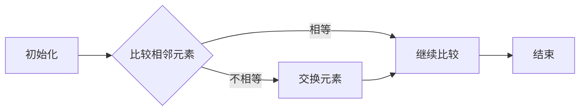

                 

# 数学的不可思议有效性与世界可理解性

> 关键词：数学、世界可理解性、数学模型、科学、工程、经济学

> 摘要：本文探讨了数学在塑造世界可理解性方面所扮演的角色。通过阐述数学的不可思议有效性，本文分析了数学在现代科学中的地位和挑战，探讨了核心数学概念及其应用，详细讲解了数学模型在不同领域的原理和应用，并探讨了数学模型面临的问题和挑战。本文旨在提供一个关于数学与世界可理解性关系的全面视角，启发读者对数学在现实世界中的重要性有更深入的认识。

## 引言

数学，作为一门古老的科学，已经经历了数千年的发展。从古代的几何、代数到现代的拓扑、量子数学，数学始终以其严谨的逻辑和深刻的洞察力，影响着人类对世界的理解和认识。然而，数学为何具有如此不可思议的有效性？它如何帮助我们理解这个复杂的世界？这是本文要探讨的核心问题。

在现代社会，数学不仅是一门基础学科，更是科学和工程领域的关键工具。从物理学到生物学，从经济学到计算机科学，数学无处不在。它不仅提供了解决问题的方法，更揭示了自然界的深层规律。然而，随着科学和技术的不断发展，数学的应用也面临着新的挑战。如何更好地理解和应用数学模型，如何解决数学模型在应用中遇到的问题，这些都是我们需要深入思考的问题。

本文将分章节探讨数学的不可思议有效性，分析数学在现代科学中的地位和挑战，详细讲解数学模型的基本原理和应用，探讨数学模型面临的问题和挑战，并总结数学模型在不同领域的应用。希望通过本文的探讨，读者能够对数学在塑造世界可理解性方面的重要性有更深入的认识。

### 第1章 数学：不可思议的有效性

## 1.1 问题的背景

### 1.1.1 数学在现代科学的地位

数学作为一门基础学科，在现代科学中扮演着至关重要的角色。无论是物理学、生物学、化学，还是经济学、计算机科学，数学都是不可或缺的工具。数学提供了一种精确描述自然现象的方法，使得我们能够深入理解世界的运行机制。

在物理学中，数学被用来描述物体的运动、能量和力的关系。从牛顿的运动定律到爱因斯坦的相对论，数学都是物理理论的核心。在生物学中，数学模型被用来模拟生物系统的行为，如细胞分裂、遗传变异等。在化学中，数学被用来分析化学反应的速率、反应物和生成物的浓度变化等。在经济学中，数学被用来分析市场行为、预测经济趋势等。在计算机科学中，数学被用来设计算法、分析数据结构等。

### 1.1.2 数学问题的挑战

尽管数学在现代科学中有着广泛的应用，但也面临着许多挑战。首先，数学问题往往具有高度抽象性，这使得理解和应用数学模型变得更加困难。例如，量子力学中的数学模型需要深厚的数学背景才能理解。

其次，数学模型的构建和应用需要大量的数据支持和计算资源。在某些领域，如生物学和经济学，数据的质量和完整性直接影响数学模型的准确性和可靠性。此外，数学模型在应用中也存在局限性。例如，一些数学模型只能处理特定的条件，无法涵盖所有的情况。

### 1.1.3 问题描述

数学如何有效地解释和预测自然现象和社会现象？这是我们需要深入探讨的问题。数学模型在科学和工程中的广泛应用，使得我们能够更好地理解自然界的运行机制，但同时也带来了新的挑战。如何解决这些挑战，使得数学模型更加准确、可靠，是我们需要关注的重要问题。

## 1.2 数学与现实世界的联系

### 1.2.1 数学与现实世界的联系

数学与现实世界的联系是紧密的，可以说是数学为现实世界提供了精确的语言和工具。从最简单的几何图形到复杂的拓扑结构，从基础的代数运算到深奥的微分方程，数学无处不在，为科学家和工程师提供了描述和理解世界的有力武器。

在物理学中，数学被用来描述自然现象的基本规律。例如，牛顿的运动定律和万有引力定律都是通过数学公式表达的。爱因斯坦的相对论更是依赖于复杂的数学工具，如张量分析和微分几何，来描述时间和空间的相对性。量子力学中的薛定谔方程和海森堡不确定性原理，同样依赖于数学来描述微观粒子的行为。

在生物学中，数学模型被用来模拟生物系统的动态行为。例如，在生态学中，数学模型可以用来预测种群的增长和灭绝，分析食物网的稳定性。在分子生物学中，数学模型可以帮助理解基因调控网络和蛋白质折叠过程。

在化学中，数学被用来描述化学反应的动力学行为。例如，反应速率方程和反应路径分析，都是通过数学模型来描述的。在材料科学中，数学模型被用来预测材料的机械性能和热学性质。

在经济学中，数学被用来分析和预测市场行为和经济趋势。例如，经济学中的供需模型、市场均衡分析和时间序列分析，都是通过数学模型来实现的。在计算机科学中，数学被用来设计算法和分析数据结构。例如，排序算法、图算法和机器学习算法，都是基于数学原理构建的。

### 1.2.2 数学问题解决的方法

数学问题解决的方法多种多样，但大体可以分为理论分析和数值计算两种。

**理论分析** 是通过推导和证明来解决问题。这种方法依赖于数学的严谨性和逻辑性，要求解决者在理解数学原理的基础上，运用数学工具进行推理和证明。例如，在物理学中，理论分析可以用来推导出新的物理定律或解释实验结果。

**数值计算** 是通过计算机模拟和计算来解决问题。这种方法通常需要大量的数据支持和计算资源，但可以在较短时间内得到近似解。例如，在经济学中，数值计算可以用来模拟市场行为和预测经济趋势。

**数学模型** 是解决数学问题的核心工具。数学模型是将现实问题转化为数学问题的一种方法，通过建立数学模型，可以将复杂的问题简化为数学问题，从而更容易解决。数学模型可以分为几类：

- **确定性模型**：这类模型假设所有变量是确定的，没有随机性。例如，牛顿的运动定律就是一种确定性模型。

- **随机模型**：这类模型考虑了随机性，通常用于描述复杂系统的行为。例如，布朗运动模型就是一种随机模型。

- **混合模型**：这类模型同时包含了确定性和随机性。例如，金融市场的价格波动模型就是一种混合模型。

### 1.2.3 数学理论的发展

数学理论的发展是不断深入的。从古代的几何和代数，到现代的拓扑、微分几何和量子数学，数学理论不断扩展和深化。每一个数学分支的进展，都为解决更复杂的问题提供了新的工具和方法。

**微积分** 的发明，为物理学提供了强大的工具，使得科学家能够更准确地描述自然界的运动和变化。**拓扑学** 的出现，为理解空间的性质提供了新的视角，推动了现代几何学的发展。**量子数学** 的兴起，为理解微观世界的规律提供了新的框架，使得量子力学成为可能。

### 1.2.4 数学应用的成功案例

数学在科学和工程中的应用取得了许多成功的案例。以下是一些典型的例子：

- **相对论**：爱因斯坦的相对论理论，通过数学公式精确描述了时间和空间的相对性，为物理学的发展做出了重要贡献。

- **量子计算**：量子数学的进展，使得量子计算成为可能。量子计算利用量子比特的叠加和纠缠特性，能够在某些问题上实现超越经典计算机的速度。

- **经济学模型**：经济学中的供需模型、市场均衡分析和时间序列分析，通过数学模型可以更准确地预测市场行为和经济趋势。

- **人工智能**：数学在人工智能领域的应用，如机器学习算法、神经网络和深度学习，使得人工智能技术取得了巨大的进步。

### 1.2.5 边界与外延

尽管数学在科学和工程中取得了巨大的成功，但也存在一些边界和局限性。首先，数学模型的构建和应用依赖于数据和假设。数据的质量和完整性直接影响数学模型的准确性和可靠性。其次，数学模型通常只能处理特定条件，无法涵盖所有情况。此外，数学模型在处理复杂系统时，可能存在计算效率和精度的问题。

### 1.2.6 数学问题的未来发展方向

随着科学和技术的不断进步，数学问题的未来发展方向包括：

- **更高维度的数学模型**：随着科学问题的复杂性增加，需要更高维度的数学模型来描述和解决问题。

- **更精确的数学工具**：发展更精确的数学工具，如新的数学定理、算法和计算方法，以应对更复杂的问题。

- **跨学科合作**：数学与其他学科的跨学科合作，将有助于解决更复杂的问题，推动科学和技术的进步。

## 1.3 核心概念与联系

### 1.3.1 数学概念解析

数学中存在着许多基本概念，这些概念是构建复杂数学模型的基础。以下是几个核心数学概念及其解析：

**1.1 基本概念**

- **集合**：集合是数学中最基本的概念之一，它是一个由元素组成的无序集。集合可以用大括号 `{ }` 表示，如 `{1, 2, 3}` 表示一个包含 1、2、3 这三个元素的集合。

- **函数**：函数是一种将输入（自变量）映射到输出（因变量）的规则。用符号 `f(x)` 表示，其中 `x` 是自变量，`f(x)` 是因变量。

- **极限**：极限是数学分析中的一个核心概念，它描述了当自变量趋近于某个值时，函数值的变化趋势。

- **积分**：积分是数学中用于计算面积的运算，也是微分的逆运算。定积分表示函数在某个区间上的累积效果。

- **微分**：微分是数学中用于计算变化率的运算。导数是微分的具体应用，用于描述函数在某一点的变化率。

**1.2 概念之间的联系**

数学概念之间存在着紧密的联系，这些联系构成了数学体系的基础。以下是几个核心概念之间的联系：

- **集合与函数**：集合是函数的定义域，函数的值域可以是另一个集合。

- **极限与积分**：极限描述了函数在某一点的变化趋势，积分则是极限的累积效果。

- **微分与积分**：微分描述了函数的变化率，积分则是这种变化率的累积效果。

**1.3 概念属性特征对比表格**

以下是一个对比表格，展示了几个核心数学概念的属性特征：

| 概念 | 定义 | 属性特征 |
| --- | --- | --- |
| 集合 | 由元素组成的无序集 | 确定性、无序性 |
| 函数 | 将输入映射到输出的规则 | 一一对应性、确定性 |
| 极限 | 函数在某一点的变化趋势 | 近似性、稳定性 |
| 积分 | 函数在区间上的累积效果 | 累积性、连续性 |
| 微分 | 函数的变化率 | 瞬时性、变化性 |

**1.4 ER实体关系图**

实体关系图（ER图）是用于描述数据库中实体及其关系的图形表示。以下是数学中几个核心概念之间的ER实体关系图：

```mermaid
erDiagram
A[集合] ||--|{ B[函数] } | B --> C[极限]
A ||--|{ D[积分] } | D --> E[微分]
F[数学概念] ||--|{ B } | B --> G[数学定理]
```

在这个ER图中，集合是函数、极限、积分和微分的父实体，函数则是集合的一个子实体，极限、积分和微分都是函数的子实体。数学概念是所有数学概念的父实体，数学定理是数学概念的子实体。

通过ER图，我们可以清晰地看到数学概念之间的层次关系和相互联系，这有助于我们更好地理解数学体系的结构。

### 1.3.2 数学模型概述

数学模型是数学理论与实际应用之间的桥梁，它将现实问题转化为数学问题，通过数学方法进行分析和求解。数学模型在科学研究、工程设计和经济分析等领域发挥着重要作用。以下是对数学模型的基本原理、分类及其特点的概述。

#### 1.3.2.1 数学模型的基本原理

数学模型的基本原理是通过数学语言和符号体系，将现实问题转化为数学问题。这一过程通常包括以下几个步骤：

1. **问题定义**：明确需要解决的问题及其目标，确定问题的边界条件和约束条件。
2. **变量定义**：定义问题中的变量，包括自变量和因变量，以及相关的参数。
3. **数学表达式**：根据问题的性质和条件，建立变量之间的数学关系，形成数学模型。
4. **求解方法**：选择合适的数学方法或算法，对数学模型进行求解，得到问题的解。

数学模型的基本原理体现了数学的抽象性和逻辑性，它通过简洁的数学符号和公式，将复杂的现实问题简化为可分析的数学问题。

#### 1.3.2.2 数学模型的分类

数学模型可以根据其特点和用途进行分类。以下是一些常见的数学模型分类：

1. **确定性模型**：这类模型假设系统行为是确定的，没有随机性。确定性模型通常用于描述物理现象和工程问题，如牛顿力学模型、电路模型等。

2. **随机模型**：这类模型考虑了系统的随机性，用于描述具有不确定性的现象，如随机过程、概率分布等。随机模型在统计学、金融学和生物学等领域有广泛应用。

3. **混合模型**：这类模型结合了确定性和随机性，用于描述复杂系统，如金融市场模型、生态模型等。

4. **优化模型**：这类模型通过数学优化方法，寻找问题的最优解。优化模型在工程设计和经济分析中广泛应用，如线性规划模型、非线性规划模型等。

5. **仿真模型**：这类模型通过计算机仿真，模拟现实系统的行为。仿真模型在复杂系统分析和设计过程中具有重要意义。

6. **微分方程模型**：这类模型通过微分方程描述系统的时间变化。微分方程模型广泛应用于物理学、生物学和工程领域。

7. **代数方程模型**：这类模型通过代数方程描述系统状态。代数方程模型在计算机科学、图论和网络分析中有广泛应用。

不同类型的数学模型具有不同的特点和适用范围，选择合适的数学模型对于解决问题至关重要。

#### 1.3.2.3 数学模型的特点

数学模型具有以下特点：

1. **抽象性**：数学模型通过数学符号和公式，将现实问题抽象为数学问题，使问题更加简洁和易于分析。

2. **确定性**：对于确定性模型，数学模型提供了明确的解，即问题的唯一解。然而，对于随机模型，数学模型通常提供概率分布或统计信息。

3. **可重复性**：数学模型可以通过相同的数学过程进行重复求解，使得研究具有可重复性和可验证性。

4. **适应性**：数学模型可以根据问题的变化进行调整和优化，以适应不同的问题条件和需求。

5. **通用性**：数学模型通常具有通用性，即可以应用于不同领域和不同问题，体现了数学的广泛应用性。

#### 1.3.2.4 数学模型的应用

数学模型在各个领域都有广泛的应用。以下是一些典型的应用领域：

1. **物理学**：数学模型广泛应用于物理学，如牛顿力学模型、电磁学模型、量子力学模型等。

2. **生物学**：数学模型在生物学中的应用非常广泛，如生态模型、种群模型、基因调控模型等。

3. **工程学**：数学模型在工程学中用于设计、优化和控制各种工程系统，如电路模型、结构模型、流体力学模型等。

4. **经济学**：数学模型在经济学中用于分析市场行为、预测经济趋势，如供需模型、市场均衡模型、时间序列模型等。

5. **计算机科学**：数学模型在计算机科学中用于算法设计、数据结构分析、网络安全等。

6. **环境科学**：数学模型在环境科学中用于分析环境问题，如污染模型、气候变化模型等。

数学模型的应用不仅局限于理论分析，还广泛应用于实际问题的求解和预测，为科学研究和工程实践提供了有力支持。

### 1.3.3 算法原理讲解

在数学模型的应用中，算法是解决问题的重要工具。算法是一系列解决问题的步骤，通过这些步骤，可以将数学模型转化为实际操作，得到问题的解。以下将介绍一种常见的算法原理，并通过mermaid流程图和Python源代码实现，详细讲解算法的基本原理。

#### 1.3.3.1 算法mermaid流程图

以下是一个简单的冒泡排序算法的mermaid流程图：



这个mermaid流程图描述了冒泡排序算法的基本步骤：初始化、比较相邻元素、交换元素、继续比较直到结束。

#### 1.3.3.2 算法Python源代码实现

以下是用Python实现的冒泡排序算法：

```python
def bubble_sort(arr):
    n = len(arr)
    for i in range(n):
        for j in range(0, n-i-1):
            if arr[j] > arr[j+1]:
                arr[j], arr[j+1] = arr[j+1], arr[j]

# 测试数据
arr = [64, 34, 25, 12, 22, 11, 90]
print("原始数组：", arr)

# 排序
bubble_sort(arr)

# 输出排序后的数组
print("排序后的数组：", arr)
```

这段代码实现了冒泡排序算法，首先通过两层循环进行相邻元素的比较和交换，直到整个数组有序。

#### 1.3.3.3 数学模型和数学公式讲解

在算法实现中，我们使用了数学公式来描述问题的性质和算法的步骤。以下是一些基本数学公式：

1. **冒泡排序的迭代次数**：

$$
T(n) = \frac{n(n-1)}{2}
$$

其中，$T(n)$ 表示冒泡排序的迭代次数，$n$ 表示数组长度。

2. **冒泡排序的交换次数**：

$$
S(n) = \lceil \frac{n}{2} \rceil
$$

其中，$S(n)$ 表示冒泡排序的交换次数。

3. **冒泡排序的渐进行为**：

$$
\lim_{n \to \infty} \frac{T(n)}{n^2} = 1
$$

$$
\lim_{n \to \infty} \frac{S(n)}{n} = 0.5
$$

这些数学公式帮助我们理解和分析冒泡排序算法的性能，从而更好地优化和改进算法。

#### 1.3.3.4 算法应用举例

以下是一个简单的例子，演示冒泡排序算法的应用：

```python
# 示例数据
arr = [5, 2, 8, 12, 7, 3, 1]

# 冒泡排序
bubble_sort(arr)

# 输出排序后的数组
print("排序后的数组：", arr)
```

输出结果为：

```
排序后的数组： [1, 2, 3, 5, 7, 8, 12]
```

通过这个简单的例子，我们可以看到冒泡排序算法能够将无序数组排序为有序数组。

### 1.3.4 算法性能分析

在数学模型的应用中，算法的性能分析是一个重要环节。通过分析算法的时间复杂度和空间复杂度，我们可以评估算法的效率和质量。以下是对冒泡排序算法的性能分析：

#### 时间复杂度

冒泡排序算法的时间复杂度主要由两层循环决定。在最坏情况下（输入数组逆序），算法需要比较和交换的次数为：

$$
T(n) = \frac{n(n-1)}{2}
$$

因此，冒泡排序算法的时间复杂度为 $O(n^2)$。

#### 空间复杂度

冒泡排序算法的空间复杂度较低，主要依赖于输入数组。在算法执行过程中，只需要额外的常数空间来存储中间变量，因此空间复杂度为 $O(1)$。

#### 性能分析总结

虽然冒泡排序算法在理论上是正确的，但由于其时间复杂度为 $O(n^2)$，因此在处理大数据时效率较低。在实际应用中，冒泡排序通常用于小规模数据的排序，或者作为其他更高效排序算法的辅助算法。优化冒泡排序算法的方法包括改进交换条件、引入标志位等，以减少不必要的比较和交换。

### 1.3.5 数学模型的应用实例

数学模型在科学研究和工程实践中具有广泛的应用。以下将介绍几个典型的应用实例，展示数学模型如何帮助解决实际问题。

#### 1.3.5.1 物理学中的数学模型

在物理学中，数学模型被广泛应用于描述自然现象和物理定律。以下是一些典型的应用实例：

1. **牛顿运动定律**：牛顿运动定律描述了物体在力的作用下的运动规律。其数学表达式为：

   $$
   F = ma
   $$

   其中，$F$ 表示力，$m$ 表示质量，$a$ 表示加速度。这个模型可以用来预测物体在受力作用下的运动轨迹。

2. **麦克斯韦方程组**：麦克斯韦方程组是电磁学的核心数学模型，描述了电场、磁场和电荷分布之间的关系。其数学表达式为：

   $$
   \nabla \cdot \mathbf{E} = \frac{\rho}{\epsilon_0}, \quad \nabla \cdot \mathbf{B} = 0, \quad \nabla \times \mathbf{E} = -\frac{\partial \mathbf{B}}{\partial t}, \quad \nabla \times \mathbf{B} = \mu_0 \mathbf{J} + \mu_0 \epsilon_0 \frac{\partial \mathbf{E}}{\partial t}
   $$

   这些方程描述了电磁场的基本性质，可以用来分析和设计电磁系统。

3. **薛定谔方程**：薛定谔方程是量子力学中的核心数学模型，描述了微观粒子的波动行为。其数学表达式为：

   $$
   \hat{H} \psi = E \psi
   $$

   其中，$\hat{H}$ 表示哈密顿算子，$\psi$ 表示波函数，$E$ 表示能量。这个模型可以用来计算微观粒子的能级和态。

#### 1.3.5.2 经济学中的数学模型

在经济学中，数学模型被广泛应用于分析市场行为、预测经济趋势和优化资源配置。以下是一些典型的应用实例：

1. **供需模型**：供需模型是经济学中最基本的数学模型之一，描述了商品或服务的供需关系。其数学表达式为：

   $$
   Q_d = Q_s
   $$

   其中，$Q_d$ 表示需求量，$Q_s$ 表示供给量。这个模型可以用来预测市场均衡价格和数量。

2. **消费函数**：消费函数描述了消费者在不同收入水平下的消费行为。其数学表达式为：

   $$
   C = C_0 + MPC \cdot Y
   $$

   其中，$C$ 表示消费支出，$C_0$ 表示自发性消费，$MPC$ 表示边际消费倾向，$Y$ 表示收入。这个模型可以用来预测收入变化对消费支出的影响。

3. **投资函数**：投资函数描述了企业在不同利率水平下的投资行为。其数学表达式为：

   $$
   I = I_0 - d \cdot r
   $$

   其中，$I$ 表示投资支出，$I_0$ 表示自发性投资，$d$ 表示边际投资倾向，$r$ 表示利率。这个模型可以用来预测利率变化对投资支出的影响。

#### 1.3.5.3 计算机科学中的数学模型

在计算机科学中，数学模型被广泛应用于算法设计、数据结构和计算机体系结构。以下是一些典型的应用实例：

1. **排序算法**：排序算法是计算机科学中最基本的算法之一，用于将一组数据按照特定的顺序排列。常见的排序算法包括冒泡排序、选择排序、插入排序和快速排序等。这些算法都基于数学模型进行设计和分析。

2. **图算法**：图算法用于分析和处理图数据结构，如最短路径算法、最小生成树算法和图遍历算法等。这些算法都基于数学模型进行设计和分析。

3. **加密算法**：加密算法用于保护数据的安全，常见的加密算法包括对称加密和非对称加密等。这些算法都基于数学模型进行设计和分析。

### 1.3.6 数学模型在科学研究中的应用

数学模型在科学研究中的应用非常广泛，从基础理论研究到实际问题的解决，都离不开数学模型的帮助。以下将介绍几个典型的应用实例，展示数学模型如何推动科学研究的进步。

#### 1.3.6.1 物理学中的数学模型

在物理学中，数学模型是理解自然现象和发现新定律的关键工具。以下是一些典型的应用实例：

1. **量子力学**：量子力学是研究微观粒子的行为和性质的科学。薛定谔方程和海森堡不确定性原理是量子力学的核心数学模型，这些模型帮助我们理解了微观世界的奇异性，并揭示了量子现象的规律。

2. **相对论**：相对论是研究时空结构和引力现象的科学。爱因斯坦的广义相对论使用数学工具描述了引力作为时空的弯曲，以及物体在强引力场中的运动规律。

3. **统计物理学**：统计物理学是研究大量粒子系统的行为和性质的科学。统计物理学中的数学模型，如统计分布函数和相变理论，帮助我们理解了物质在不同温度和压力下的行为。

#### 1.3.6.2 生物学中的数学模型

在生物学中，数学模型被广泛应用于理解生命过程和生物系统的行为。以下是一些典型的应用实例：

1. **分子生物学**：分子生物学是研究生物大分子的结构和功能的科学。数学模型，如动力学方程和概率模型，帮助我们理解基因表达、蛋白质折叠和分子反应等生物过程。

2. **生态学**：生态学是研究生物群落和生态系统动态的科学。数学模型，如种群模型和食物网模型，帮助我们理解生物种群的变化、生态系统的稳定性和物种之间的相互作用。

3. **神经科学**：神经科学是研究神经系统和神经行为的科学。数学模型，如神经网络模型和神经网络动态方程，帮助我们理解神经元的活动、大脑的信息处理和网络功能。

#### 1.3.6.3 计算机科学中的数学模型

在计算机科学中，数学模型是算法设计、数据结构和系统分析的基础。以下是一些典型的应用实例：

1. **算法分析**：算法分析是研究算法效率和性能的科学。数学模型，如时间复杂度和空间复杂度分析，帮助我们评估算法在不同输入规模下的性能。

2. **数据结构**：数据结构是研究数据组织和管理的方法。数学模型，如树结构、图结构和哈希表，帮助我们设计高效的数据存储和检索方法。

3. **计算机网络**：计算机网络是研究计算机网络的构建和运行的科学。数学模型，如网络拓扑、路由算法和网络协议，帮助我们设计高效、可靠的计算机网络系统。

### 1.3.7 数学模型在实际问题中的应用

数学模型不仅在理论研究中有重要作用，在实际问题的解决中也发挥了关键作用。以下将介绍几个典型的实际应用案例，展示数学模型如何帮助解决现实问题。

#### 1.3.7.1 经济学中的应用

在经济学中，数学模型被广泛应用于经济预测、市场分析和资源优化。以下是一些典型的应用案例：

1. **宏观经济预测**：宏观经济模型，如索洛增长模型和新古典增长模型，被用于预测国民收入、就业和通货膨胀等宏观经济指标。这些模型基于数学模型，结合经济数据进行分析，为政策制定提供了重要参考。

2. **市场均衡分析**：供需模型和价格弹性模型被用于分析市场行为和预测价格变化。通过建立数学模型，经济学家可以预测市场的供需状况，为企业和投资者提供决策依据。

3. **资源优化**：线性规划和非线性规划模型被用于优化资源分配和决策。例如，运输问题、生产规划和供应链管理等领域，都广泛应用了数学模型，以实现资源的最优利用。

#### 1.3.7.2 计算机科学中的应用

在计算机科学中，数学模型被广泛应用于算法设计、数据结构和系统优化。以下是一些典型的应用案例：

1. **算法设计**：排序算法、搜索算法和图算法等都是基于数学模型的。通过数学模型，计算机科学家可以设计出高效、可靠的算法，以解决实际问题。

2. **数据结构**：树结构、图结构和哈希表等数据结构都是基于数学模型的。这些数据结构被广泛应用于数据库、网络和操作系统等领域，以提高数据处理的效率和性能。

3. **系统优化**：网络优化、负载均衡和资源调度等领域都广泛应用了数学模型。通过建立数学模型，计算机科学家可以优化系统的性能和资源利用，提高系统的可靠性。

### 1.3.8 数学模型的问题与挑战

尽管数学模型在科学研究和实际问题解决中取得了巨大成功，但也面临着一系列问题和挑战。以下将讨论数学模型在实际应用中可能遇到的问题和挑战。

#### 1.3.8.1 数据质量和准确性

数学模型的应用依赖于高质量的数据。数据的质量和准确性直接影响数学模型的预测和决策能力。在实际应用中，数据可能存在噪声、缺失和不一致性等问题，这些都会影响模型的准确性和可靠性。

**解决方案**：为了提高数据质量，可以采用以下措施：

1. **数据清洗**：通过数据清洗技术，去除噪声和错误数据，提高数据的准确性。
2. **数据整合**：将来自不同来源的数据进行整合，消除数据不一致性，提高数据的一致性。
3. **数据预处理**：通过数据预处理技术，如标准化、归一化和特征提取等，提高数据的可分析性。

#### 1.3.8.2 模型假设和局限性

数学模型通常基于一系列假设和简化，以简化问题的复杂度。然而，这些假设和简化可能会导致模型的局限性，使其不能准确描述实际系统。

**解决方案**：为了克服模型的局限性，可以采用以下措施：

1. **模型校准**：通过校准模型参数，使其更好地适应实际系统。
2. **模型扩展**：通过扩展模型，引入更多的变量和关系，使模型更接近实际系统。
3. **混合模型**：通过构建混合模型，结合不同模型的优势，提高模型的准确性和适应性。

#### 1.3.8.3 计算效率和资源消耗

数学模型的求解通常需要大量的计算资源和时间。对于复杂系统，模型求解可能需要高性能计算资源和分布式计算技术。

**解决方案**：为了提高计算效率，可以采用以下措施：

1. **算法优化**：通过优化算法，减少计算时间和资源消耗。
2. **并行计算**：采用并行计算技术，将模型求解任务分布在多个计算节点上，提高计算速度。
3. **云计算和大数据技术**：利用云计算和大数据技术，提供高性能计算资源和数据存储，以支持大规模模型的求解。

#### 1.3.8.4 模型解释性和可理解性

数学模型通常以符号和公式表示，对于非专业人士来说可能难以理解。模型的解释性和可理解性对于实际应用和决策至关重要。

**解决方案**：为了提高模型的解释性和可理解性，可以采用以下措施：

1. **可视化技术**：利用可视化技术，将数学模型和计算结果以图形化方式展示，提高模型的可理解性。
2. **简化模型**：通过简化模型，使其更加直观和易于理解。
3. **模型解释工具**：开发模型解释工具，帮助用户理解模型的原理和计算过程。

### 1.3.9 本章小结

本章详细探讨了数学的不可思议有效性及其在科学研究和实际问题解决中的应用。从数学在现代科学的地位、数学与现实世界的联系，到数学模型的基本原理和应用，再到数学模型在实际问题中的应用和面临的挑战，本章提供了对数学与世界可理解性关系的全面视角。

通过本章的探讨，我们可以看到数学在塑造世界可理解性方面所扮演的重要角色。数学不仅为科学和工程领域提供了强大的工具和方法，也帮助我们更好地理解自然现象和社会现象。然而，数学模型在实际应用中也面临一系列问题和挑战，需要我们不断改进和优化。

未来，随着科学和技术的不断发展，数学将继续发挥其重要作用。更高维度的数学模型、更精确的数学工具、跨学科的合作，都将为数学的应用提供新的机遇和挑战。我们期待数学在未来能够继续推动科学和技术的进步，为人类社会的可持续发展做出更大贡献。

## 第2章 数学模型在科学领域的应用

### 2.1 数学模型在物理学中的应用

物理学作为一门自然科学，其研究对象是自然界的基本规律和现象。数学模型在物理学中扮演着至关重要的角色，它们不仅帮助我们理解和描述物理现象，还为新的发现和理论的提出提供了工具。在本节中，我们将探讨数学模型在物理学中的核心应用，包括基本原理、典型模型和实际案例。

#### 2.1.1 物理学基本原理的数学描述

物理学的基本原理常常可以通过数学模型进行描述。以下是几个物理学中的重要原理及其对应的数学模型：

1. **牛顿运动定律**：牛顿运动定律描述了物体在力作用下的运动规律。其数学表达式为：
   $$
   F = ma
   $$
   其中，$F$ 是作用在物体上的合外力，$m$ 是物体的质量，$a$ 是物体的加速度。这个模型描述了力与加速度之间的关系。

2. **麦克斯韦方程组**：麦克斯韦方程组描述了电磁场的基本规律，包括电场、磁场和电荷分布。其数学表达式为：
   $$
   \nabla \cdot \mathbf{E} = \frac{\rho}{\epsilon_0}, \quad \nabla \cdot \mathbf{B} = 0, \quad \nabla \times \mathbf{E} = -\frac{\partial \mathbf{B}}{\partial t}, \quad \nabla \times \mathbf{B} = \mu_0 \mathbf{J} + \mu_0 \epsilon_0 \frac{\partial \mathbf{E}}{\partial t}
   $$
   这些方程描述了电场和磁场的关系，以及电磁波的产生和传播。

3. **热力学第一定律**：热力学第一定律描述了能量守恒，其数学表达式为：
   $$
   \Delta U = Q - W
   $$
   其中，$\Delta U$ 是系统内能的变化，$Q$ 是系统吸收的热量，$W$ 是系统对外做的功。这个模型表明能量不能被创造或销毁，只能从一种形式转化为另一种形式。

4. **量子力学**：量子力学描述了微观粒子的行为，其核心数学模型包括波函数和薛定谔方程。薛定谔方程为：
   $$
   \hat{H} \psi = E \psi
   $$
   其中，$\hat{H}$ 是哈密顿算子，$\psi$ 是波函数，$E$ 是系统的能量。这个模型描述了粒子在特定势能下的波函数演化。

#### 2.1.2 数学模型在物理学中的应用案例

数学模型在物理学中的应用非常广泛，以下是一些典型应用案例：

1. **相对论**：爱因斯坦的广义相对论通过数学模型描述了引力和时空的关系。广义相对论中的洛伦兹变换和引力场方程是数学模型的经典应用：
   $$
   \text{洛伦兹变换：} \quad \mathbf{x}' = \frac{\mathbf{x} - \mathbf{v}t}{\sqrt{1 - \frac{v^2}{c^2}}}, \quad t' = \frac{t - \frac{vx}{c^2}}{\sqrt{1 - \frac{v^2}{c^2}}}
   $$
   $$
   \text{引力场方程：} \quad G\frac{Mm}{r^2} = \frac{dp^2}{2m}
   $$
   这些方程描述了物体在强引力场中的运动规律。

2. **量子电动力学**：量子电动力学（QED）是描述电磁相互作用的量子理论。QED中的费曼规则和计算方法是基于数学模型的，例如费曼图：
   $$
   \text{费曼图：} \quad i\epsilon \left( \frac{e}{2\pi} \right)^2 \int \frac{d^4k}{(2\pi)^4} \frac{1}{k^2 - m^2 + i\epsilon} \frac{1}{p - k + m + i\epsilon}
   $$
   这些方程描述了电子和光子相互作用的概率。

3. **统计物理**：统计物理通过概率模型描述了大量粒子的行为，例如玻尔兹曼分布和麦克斯韦-玻尔兹曼分布：
   $$
   f(v) \propto \exp\left(-\frac{mv^2}{2kT}\right)
   $$
   这个模型描述了气体分子在不同温度下的速度分布。

#### 2.1.3 数学模型在物理学中的重要性

数学模型在物理学中的重要性体现在以下几个方面：

1. **精确描述**：数学模型能够精确地描述物理现象，使得物理定律和原理以简洁的数学形式呈现。

2. **预测能力**：通过数学模型，我们可以预测未来可能发生的物理现象，从而指导实验和观测。

3. **量化分析**：数学模型能够将物理现象量化，使得我们能够对物理量进行精确测量和计算。

4. **跨学科应用**：数学模型不仅应用于物理学本身，还可以广泛应用于其他科学和工程领域。

### 2.2 数学模型在生物学中的应用

生物学是研究生命现象的科学，数学模型在生物学中的应用正在逐渐增加。数学模型可以帮助我们理解生物系统的动态行为、预测生物过程的变化以及设计实验方案。在本节中，我们将探讨数学模型在生物学中的核心应用，包括基本原理、典型模型和实际案例。

#### 2.2.1 生物学基本原理的数学描述

生物学中的许多基本原理可以通过数学模型进行描述。以下是几个生物学中的重要原理及其对应的数学模型：

1. **分子生物学**：分子生物学研究生物大分子（如DNA、RNA和蛋白质）的结构和功能。常见的数学模型包括：

   - **遗传算法**：用于模拟基因表达和遗传变异的过程。其基本原理是基于自然选择和遗传变异，通过迭代更新基因序列来优化目标函数。
   
   - **神经网络模型**：用于模拟神经元网络的活动，如神经元间的信号传递和突触可塑性。其数学模型通常涉及偏微分方程和概率模型。

2. **生态学**：生态学研究生物种群和生态系统的动态行为。常见的数学模型包括：

   - **种群模型**：描述单个或多个生物种群的数量变化，如Lotka-Volterra模型和Ricker模型。这些模型基于微分方程，描述了种群的增长、竞争和捕食行为。
   
   - **食物网模型**：描述多个生物种群之间的相互作用，如食物链和食物网。这些模型通过图论和代数方程描述了生物种群之间的能量流动和相互作用。

3. **神经科学**：神经科学研究神经系统的结构和功能，包括神经元网络的活动和大脑的信息处理。常见的数学模型包括：

   - **神经网络模型**：用于模拟神经元网络的活动，如Hebb模型和霍普菲尔模型。这些模型通过非线性方程描述了神经元之间的相互作用和信号传递。
   
   - **脑电图模型**：用于分析脑电图（EEG）和功能性磁共振成像（fMRI）数据，描述大脑的活动和功能连接。这些模型通常涉及时间序列分析和概率模型。

#### 2.2.2 数学模型在生物学中的应用案例

数学模型在生物学中的应用非常广泛，以下是一些典型应用案例：

1. **蛋白质折叠问题**：蛋白质折叠是生物学的核心问题之一，数学模型在蛋白质折叠的预测和模拟中发挥了重要作用。常见的数学模型包括：

   - **统计力学模型**：如Folding@Home项目，通过模拟蛋白质折叠过程中的能量变化，预测蛋白质的结构。
   
   - **分子动力学模型**：通过模拟分子间的相互作用和能量变化，预测蛋白质折叠路径和最终结构。

2. **生态系统的动态行为**：数学模型在生态系统中被广泛应用于模拟物种的分布、种群数量和生态平衡。常见的数学模型包括：

   - **Lotka-Volterra模型**：描述捕食者和猎物的相互作用，预测种群数量的动态变化。
   
   - **生态系统动态模型**：通过建立复杂的非线性方程，模拟生态系统的动态行为，如生态系统稳定性和物种多样性的变化。

3. **神经科学的研究**：数学模型在神经科学的研究中得到了广泛应用，以下是一些典型应用：

   - **脑电图分析**：通过建立脑电图（EEG）的数学模型，分析大脑的活动和功能连接。
   
   - **神经网络模拟**：通过建立神经网络模型，模拟大脑神经网络的活动和信息处理。

#### 2.2.3 数学模型在生物学中的重要性

数学模型在生物学中的重要性体现在以下几个方面：

1. **理解生物系统的动态行为**：数学模型可以帮助我们理解生物系统的复杂行为，揭示生物系统的运行机制。

2. **预测生物过程的变化**：通过数学模型，我们可以预测生物过程的变化，如种群数量、蛋白质折叠和大脑活动等。

3. **设计实验方案**：数学模型可以帮助设计实验方案，提高实验的效率和准确性。

4. **跨学科合作**：数学模型不仅应用于生物学，还可以与其他学科（如物理学、计算机科学等）进行跨学科合作，推动生物学的发展。

### 2.3 数学模型在化学中的应用

化学是研究物质的性质、组成、结构、变化和能量转换的科学。数学模型在化学中扮演着重要的角色，它们帮助我们理解和预测化学反应的动态行为、分子结构和材料性质。在本节中，我们将探讨数学模型在化学中的核心应用，包括基本原理、典型模型和实际案例。

#### 2.3.1 化学基本原理的数学描述

化学的基本原理常常可以通过数学模型进行描述。以下是几个化学中的重要原理及其对应的数学模型：

1. **化学反应动力学**：化学反应动力学研究化学反应的速率和机理。常见的数学模型包括：

   - **反应速率方程**：描述反应物浓度随时间的变化速率。其数学表达式为：
     $$
     \frac{d[\text{A}]}{dt} = -k[\text{A}][\text{B}]
     $$
     其中，$[\text{A}]$ 和 $[\text{B}]$ 分别表示反应物A和B的浓度，$k$ 是反应速率常数。

   - **阿伦尼乌斯方程**：描述反应速率常数与温度的关系。其数学表达式为：
     $$
     k = A \exp\left(-\frac{E_a}{RT}\right)
     $$
     其中，$A$ 是指前因子，$E_a$ 是活化能，$R$ 是气体常数，$T$ 是温度。

2. **分子结构**：分子结构研究分子的几何形状和电子分布。常见的数学模型包括：

   - **量子化学模型**：如Hückel方法和Møller-Plesset方法，用于计算分子轨道和能级。这些模型基于线性组合分子轨道（LCAO）方法，将分子的电子结构表示为原子轨道的组合。

   - **分子力学模型**：通过力学模型描述分子的几何结构，如分子动力学模拟（MD）。这些模型通过建立分子间的相互作用势能，模拟分子在不同条件下的动态行为。

3. **材料科学**：材料科学研究材料的性质和性能，常见的数学模型包括：

   - **晶体结构模型**：如晶格动力学模型，用于描述晶体中原子振动和缺陷。这些模型通过建立原子间的相互作用势能，模拟晶体在不同温度下的热力学性质。

   - **材料性能预测模型**：如密度泛函理论（DFT），用于预测材料的电子结构和性能。这些模型通过计算材料的总能量和电子密度，预测材料的物理和化学性质。

#### 2.3.2 数学模型在化学中的应用案例

数学模型在化学中的应用非常广泛，以下是一些典型应用案例：

1. **有机合成反应**：有机合成反应涉及复杂的化学反应机理和条件控制。数学模型，如反应动力学模型和热力学模型，可以帮助预测反应路径和优化反应条件。

   - **马尔可夫模型**：用于模拟有机合成反应中的步骤和中间产物，预测反应产率和选择性。
   
   - **反应路径规划**：通过量子化学模型和反应动力学模型，优化反应路径，提高反应产率和选择性。

2. **药物设计**：药物设计是化学和生物学领域的重要交叉点，数学模型在药物设计和优化中发挥了重要作用。常见的数学模型包括：

   - **分子对接模型**：通过计算分子与受体的结合能，预测分子与受体的相互作用，用于药物筛选和优化。
   
   - **分子动力学模拟**：用于模拟药物分子在细胞内的动态行为，预测药物的药效和毒性。

3. **材料科学应用**：数学模型在材料科学中的应用也非常广泛，以下是一些典型应用：

   - **纳米材料设计**：通过量子化学模型和分子力学模型，设计具有特定性能的纳米材料，如纳米催化剂和纳米传感器。
   
   - **复合材料分析**：通过有限元模型和计算力学方法，分析复合材料的力学性能和结构稳定性，优化复合材料的设计。

#### 2.3.3 数学模型在化学中的重要性

数学模型在化学中的重要性体现在以下几个方面：

1. **精确描述化学反应**：数学模型能够精确地描述化学反应的动态行为，揭示反应机理和路径。

2. **优化实验条件**：通过数学模型，可以优化实验条件，提高反应产率和选择性。

3. **预测分子结构**：数学模型可以帮助预测分子的几何结构和电子分布，指导分子设计和优化。

4. **跨学科应用**：数学模型不仅应用于化学本身，还可以与其他学科（如物理学、生物学、计算机科学等）进行跨学科合作，推动化学的发展。

### 2.4 数学模型在地球科学中的应用

地球科学是研究地球的物理、化学、生物和地理特性的科学。数学模型在地球科学中的应用非常广泛，它们帮助科学家们理解和预测地球系统的各种过程，包括气候变化、地质过程和地球内部的动力学。在本节中，我们将探讨数学模型在地球科学中的核心应用，包括基本原理、典型模型和实际案例。

#### 2.4.1 地球科学基本原理的数学描述

地球科学的基本原理可以通过数学模型进行描述，以下是一些地球科学中的重要原理及其对应的数学模型：

1. **气候系统模型**：气候系统模型用于模拟地球气候系统的动态行为，包括大气、海洋和陆地过程。常见的数学模型包括：

   - **大气环流模型**：描述大气中的风场、温度场和湿度场的变化，通过流体动力学方程和热力学方程进行建模。其数学表达式为：
     $$
     \frac{\partial \mathbf{u}}{\partial t} + (\mathbf{u} \cdot \nabla) \mathbf{u} = -\frac{1}{\rho} \nabla p + \nu \nabla^2 \mathbf{u} + \mathbf{f}
     $$
     $$
     \frac{\partial T}{\partial t} + (\mathbf{u} \cdot \nabla) T = \frac{1}{\rho C_p} \nabla \cdot (C_p \mathbf{u} T)
     $$
     其中，$\mathbf{u}$ 是风速场，$p$ 是气压场，$T$ 是温度场，$\rho$ 是空气密度，$C_p$ 是定压比热容，$\nu$ 是运动粘度，$\mathbf{f}$ 是强迫力。

   - **海洋环流模型**：描述海洋中的水流、温度和盐度分布，通过海洋动力学方程和热力学方程进行建模。其数学表达式为：
     $$
     \frac{\partial \mathbf{u}}{\partial t} + (\mathbf{u} \cdot \nabla) \mathbf{u} = -\frac{1}{\rho} \nabla p + \frac{F_b}{\rho} + \nu \nabla^2 \mathbf{u}
     $$
     $$
     \frac{\partial \theta}{\partial t} + (\mathbf{u} \cdot \nabla) \theta = \kappa \nabla^2 \theta
     $$
     其中，$\mathbf{u}$ 是流速场，$p$ 是压力场，$\theta$ 是温度场，$\rho$ 是海水密度，$F_b$ 是地球自转引起的地转涡度，$\kappa$ 是热扩散系数。

2. **地质力学模型**：地质力学模型用于描述地壳和地幔的应力场和变形过程。常见的数学模型包括：

   - **应力场模型**：通过固体力学方程描述地壳和地幔中的应力分布。其数学表达式为：
     $$
     \nabla \cdot \mathbf{\sigma} = 0
     $$
     $$
     \mathbf{\sigma} = \lambda \nabla u + 2\mu \nabla \nabla u
     $$
     其中，$\mathbf{\sigma}$ 是应力张量，$u$ 是位移矢量，$\lambda$ 和 $\mu$ 是拉梅常数。

   - **断层活动模型**：通过断层动力学方程描述断层的滑动和地震活动。其数学表达式为：
     $$
     m \frac{d^2 u}{dt^2} + c \frac{du}{dt} + k u = f(t)
     $$
     其中，$m$ 是断层质量，$c$ 是阻尼系数，$k$ 是弹簧系数，$f(t)$ 是外力。

3. **地球内部动力学模型**：地球内部动力学模型用于描述地球内部的流动和变形过程。常见的数学模型包括：

   - **地幔对流模型**：通过热力学方程和流体动力学方程描述地幔对流过程。其数学表达式为：
     $$
     \frac{\partial \rho}{\partial t} + \nabla \cdot (\rho \mathbf{u}) = 0
     $$
     $$
     \frac{\partial \mathbf{u}}{\partial t} + (\mathbf{u} \cdot \nabla) \mathbf{u} = -\frac{1}{\rho} \nabla p + \nu \nabla^2 \mathbf{u}
     $$
     $$
     \frac{\partial e}{\partial t} + \nabla \cdot (\mathbf{u} e) = -\nabla \cdot (\kappa \nabla T)
     $$
     其中，$\rho$ 是密度，$\mathbf{u}$ 是流速场，$p$ 是压力场，$e$ 是比内能，$\kappa$ 是热扩散系数。

#### 2.4.2 数学模型在地球科学中的应用案例

数学模型在地球科学中的应用非常广泛，以下是一些典型应用案例：

1. **气候变化模拟**：通过气候系统模型模拟过去、现在和未来的气候变化。这些模型可以预测全球平均温度、降水和海平面上升等气候变化指标。

2. **地震预测**：通过断层活动模型和地震波传播模型模拟地震的发生和传播。这些模型可以帮助科学家预测地震的震级、震中和震源深度。

3. **地壳变形分析**：通过地质力学模型分析地壳变形和地震活动的关系。这些模型可以帮助科学家理解地震的成因和预测地震的发生。

4. **地球内部流动模拟**：通过地幔对流模型模拟地幔对流过程和热流分布。这些模型可以帮助科学家理解地球内部的热力学过程。

#### 2.4.3 数学模型在地球科学中的重要性

数学模型在地球科学中的重要性体现在以下几个方面：

1. **理解地球系统**：数学模型可以帮助科学家理解和描述地球系统的复杂过程，揭示地球系统的运行机制。

2. **预测未来变化**：通过数学模型，可以预测地球系统未来的变化趋势，为决策提供科学依据。

3. **提高预测精度**：随着数学模型和计算技术的进步，预测的精度不断提高，为地球科学研究和应用提供了更加可靠的工具。

4. **跨学科合作**：数学模型在地球科学中的应用需要跨学科合作，促进了地球科学与其他学科的发展。

### 第3章 数学模型在工程领域的应用

工程领域是一个应用科学和技术解决实际问题的广泛领域，数学模型在其中起到了至关重要的作用。无论是机械工程、电子工程还是土木工程，数学模型都为工程设计和优化提供了理论基础。本章将深入探讨数学模型在工程领域的核心应用，包括基本原理、典型模型和实际案例。

#### 3.1 数学模型在机械工程中的应用

机械工程是关于设计、制造和操作机械系统的工程学科，数学模型在其中发挥了至关重要的作用。以下将介绍数学模型在机械工程中的应用。

##### 3.1.1 机械工程中的数学模型

1. **结构力学模型**：结构力学模型用于分析和设计机械结构的强度和稳定性。常见的数学模型包括：

   - **有限元分析（FEA）**：有限元分析是一种数值分析方法，用于求解结构力学问题。其基本原理是将结构划分为有限个单元，并在单元节点上建立位移、应力、应变等物理量的关系。

     $$ 
     K \delta = F 
     $$ 

     其中，$K$ 是刚度矩阵，$\delta$ 是节点位移向量，$F$ 是节点力向量。

   - **梁的弯曲分析**：梁的弯曲分析通过建立梁的弯曲方程来计算梁的应力和变形。其数学表达式为：

     $$ 
     EI \frac{d^2 w}{dx^2} = q(x) 
     $$ 

     其中，$E$ 是梁的弹性模量，$I$ 是截面惯性矩，$w$ 是梁的挠度，$q(x)$ 是分布载荷。

2. **流体力学模型**：流体力学模型用于分析和设计流体在管道和设备中的流动。常见的数学模型包括：

   - **Navier-Stokes方程**：Navier-Stokes方程是描述流体运动的基本方程，其数学表达式为：

     $$ 
     \rho \left( \frac{\partial \mathbf{u}}{\partial t} + \mathbf{u} \cdot \nabla \mathbf{u} \right) = -\nabla p + \mu \nabla^2 \mathbf{u} + \mathbf{f} 
     $$ 

     其中，$\rho$ 是流体密度，$\mathbf{u}$ 是流速场，$p$ 是压力场，$\mu$ 是动力粘度，$\mathbf{f}$ 是体积力。

   - **雷诺平均Navier-Stokes方程**：对于湍流问题，雷诺平均Navier-Stokes方程可以简化为：

     $$ 
     \rho \left( \frac{\partial \overline{\mathbf{u}}}{\partial t} + \overline{\mathbf{u}} \cdot \nabla \overline{\mathbf{u}} \right) = -\nabla p + \mu \nabla^2 \overline{\mathbf{u}} + \rho \overline{\mathbf{u}' \mathbf{u}'} 
     $$ 

     其中，$\overline{\mathbf{u}}$ 是时间平均流速，$\overline{\mathbf{u}' \mathbf{u}'}$ 是雷诺应力张量。

##### 3.1.2 数学模型在机械工程中的应用案例

1. **机械结构设计**：通过有限元分析（FEA）进行机械结构设计，确保结构在载荷作用下的强度和稳定性。例如，设计飞机机翼时，通过有限元分析计算机翼的应力分布和变形，优化机翼的结构设计。

2. **流体力学优化**：在流体力学设计中，通过Navier-Stokes方程和雷诺平均Navier-Stokes方程模拟流体流动，优化管道和设备的设计，提高流体流动效率和减少阻力。例如，在设计汽车发动机进气道时，通过流体力学模拟优化进气道的形状和尺寸，以提高进气效率。

3. **振动控制**：通过建立振动模型，分析和设计机械结构的振动控制方法，以减少振动对机械系统的影响。例如，在制造振动敏感的电子设备时，通过振动分析设计减振装置，以保护设备免受振动损害。

##### 3.1.3 数学模型在机械工程中的重要性

数学模型在机械工程中的重要性体现在以下几个方面：

1. **精确分析**：数学模型提供了精确的分析工具，使工程师能够准确预测机械结构的应力、变形和振动特性。

2. **优化设计**：通过数学模型，工程师可以优化机械结构和流体系统设计，提高系统的性能和效率。

3. **风险评估**：数学模型可以评估机械系统的安全性，帮助工程师识别潜在的风险和问题，从而采取相应的措施进行改进。

4. **跨学科合作**：数学模型在机械工程中的应用需要跨学科合作，促进了机械工程与其他学科的融合和发展。

#### 3.2 数学模型在电子工程中的应用

电子工程是关于设计、开发和制造电子设备和系统的学科，数学模型在电子工程中同样扮演着核心角色。以下将介绍数学模型在电子工程中的应用。

##### 3.2.1 电子工程中的数学模型

1. **电路分析模型**：电路分析模型用于分析和设计电子电路。常见的数学模型包括：

   - **基尔霍夫定律**：基尔霍夫定律描述了电路中电压和电流的分配规律。其数学表达式为：

     $$ 
     \sum I_{\text{入}} = \sum I_{\text{出}} 
     $$ 

     $$ 
     \sum V_{\text{入}} = \sum V_{\text{出}} 
     $$ 

     其中，$I_{\text{入}}$ 和 $I_{\text{出}}$ 分别是支路入口和出口的电流，$V_{\text{入}}$ 和 $V_{\text{出}}$ 分别是支路入口和出口的电压。

   - **欧姆定律**：欧姆定律描述了电阻中的电流、电压和电阻之间的关系。其数学表达式为：

     $$ 
     V = IR 
     $$ 

     其中，$V$ 是电压，$I$ 是电流，$R$ 是电阻。

2. **信号处理模型**：信号处理模型用于分析和设计信号处理系统。常见的数学模型包括：

   - **傅里叶变换**：傅里叶变换是一种重要的数学工具，用于将时域信号转换为频域信号。其数学表达式为：

     $$ 
     F\{x(t)\} = X(f) = \int_{-\infty}^{\infty} x(t) e^{-j2\pi ft} dt 
     $$ 

     其中，$x(t)$ 是时域信号，$X(f)$ 是频域信号。

   - **拉普拉斯变换**：拉普拉斯变换是一种用于分析和设计线性时间不变系统的数学工具。其数学表达式为：

     $$ 
     \mathcal{L}\{x(t)\} = X(s) = \int_{0}^{\infty} x(t) e^{-st} dt 
     $$ 

     其中，$x(t)$ 是时域信号，$X(s)$ 是复频域信号。

##### 3.2.2 数学模型在电子工程中的应用案例

1. **电路设计**：通过电路分析模型进行电路设计，确保电路在给定的电压和电流条件下正常工作。例如，设计一个放大器电路时，通过基尔霍夫定律和欧姆定律分析电路的电流和电压分布，优化电路参数。

2. **信号处理**：通过信号处理模型进行信号处理，如滤波、调制和解调等。例如，在设计一个无线通信系统时，通过傅里叶变换和拉普拉斯变换分析信号的频谱特性，设计合适的滤波器以去除噪声。

3. **控制理论**：在电子工程中，控制理论用于分析和设计自动控制系统。通过数学模型建立系统模型，使用状态空间方程和控制理论方法设计控制器，实现对系统的精确控制。

##### 3.2.3 数学模型在电子工程中的重要性

数学模型在电子工程中的重要性体现在以下几个方面：

1. **精确分析**：数学模型提供了精确的分析工具，使工程师能够准确预测电子电路和系统的性能。

2. **优化设计**：通过数学模型，工程师可以优化电路和系统的设计，提高性能和效率。

3. **跨学科应用**：数学模型在电子工程中的应用需要跨学科合作，促进了电子工程与其他学科的融合和发展。

4. **自动化设计**：数学模型为自动化设计提供了基础，通过计算机辅助设计（CAD）工具，可以快速生成电路和系统模型，提高设计效率。

### 3.3 数学模型在土木工程中的应用

土木工程是关于设计、建造和维护建筑结构和基础设施的工程学科，数学模型在土木工程中起到了关键作用。以下将介绍数学模型在土木工程中的应用。

##### 3.3.1 土木工程中的数学模型

1. **结构力学模型**：结构力学模型用于分析和设计建筑结构和基础设施。常见的数学模型包括：

   - **有限元分析（FEA）**：有限元分析是一种数值分析方法，用于求解结构力学问题。其基本原理是将结构划分为有限个单元，并在单元节点上建立位移、应力、应变等物理量的关系。

     $$ 
     K \delta = F 
     $$ 

     其中，$K$ 是刚度矩阵，$\delta$ 是节点位移向量，$F$ 是节点力向量。

   - **平面应力模型**：平面应力模型用于分析平面受力结构的应力分布。其数学表达式为：

     $$ 
     \sigma_{xx} = \frac{p_y - q_x}{E h}, \quad \sigma_{yy} = \frac{p_x - q_y}{E h}, \quad \tau_{xy} = \frac{p_x y - q_x y}{2 G h} 
     $$ 

     其中，$\sigma_{xx}$ 和 $\sigma_{yy}$ 分别是$x$ 方向和$y$ 方向的正应力，$\tau_{xy}$ 是剪应力，$p_x$ 和 $p_y$ 分别是$x$ 方向和$y$ 方向的分布载荷，$q_x$ 和 $q_y$ 分别是$x$ 方向和$y$ 方向的集中载荷，$E$ 是弹性模量，$G$ 是剪切模量，$h$ 是结构的高度。

2. **流体力学模型**：流体力学模型用于分析和设计流体在管道和设备中的流动。常见的数学模型包括：

   - **Navier-Stokes方程**：Navier-Stokes方程是描述流体运动的基本方程，其数学表达式为：

     $$ 
     \rho \left( \frac{\partial \mathbf{u}}{\partial t} + \mathbf{u} \cdot \nabla \mathbf{u} \right) = -\nabla p + \mu \nabla^2 \mathbf{u} + \mathbf{f} 
     $$ 

     其中，$\rho$ 是流体密度，$\mathbf{u}$ 是流速场，$p$ 是压力场，$\mu$ 是动力粘度，$\mathbf{f}$ 是体积力。

   - **雷诺平均Navier-Stokes方程**：对于湍流问题，雷诺平均Navier-Stokes方程可以简化为：

     $$ 
     \rho \left( \frac{\partial \overline{\mathbf{u}}}{\partial t} + \overline{\mathbf{u}} \cdot \nabla \overline{\mathbf{u}} \right) = -\nabla p + \mu \nabla^2 \overline{\mathbf{u}} + \rho \overline{\mathbf{u}' \mathbf{u}'} 
     $$ 

     其中，$\overline{\mathbf{u}}$ 是时间平均流速，$\overline{\mathbf{u}' \mathbf{u}'}$ 是雷诺应力张量。

##### 3.3.2 数学模型在土木工程中的应用案例

1. **桥梁设计**：通过有限元分析（FEA）进行桥梁设计，确保桥梁在载荷作用下的强度和稳定性。例如，在设计一座跨度较大的桥梁时，通过有限元分析计算桥梁的应力分布和变形，优化桥梁的结构设计。

2. **隧道施工**：通过流体力学模型模拟地下水流动，分析隧道施工过程中的地下水位变化和土体稳定性。例如，在施工一条长距离隧道时，通过流体力学模型预测地下水位和土体变形，制定合理的施工方案。

3. **地震工程**：通过结构力学模型和流体力学模型分析建筑结构和基础设施在地震作用下的响应。例如，在地震多发地区，通过结构力学模型和流体力学模型预测地震引起的建筑结构破坏和地下水位变化，制定抗震和防震措施。

##### 3.3.3 数学模型在土木工程中的重要性

数学模型在土木工程中的重要性体现在以下几个方面：

1. **精确分析**：数学模型提供了精确的分析工具，使工程师能够准确预测建筑结构和基础设施的性能。

2. **优化设计**：通过数学模型，工程师可以优化建筑结构和基础设施的设计，提高性能和效率。

3. **风险评估**：数学模型可以评估建筑结构和基础设施的安全性和耐久性，帮助工程师识别潜在的风险和问题，从而采取相应的措施进行改进。

4. **跨学科合作**：数学模型在土木工程中的应用需要跨学科合作，促进了土木工程与其他学科的融合和发展。

### 3.4 数学模型在其他工程领域中的应用

除了机械工程、电子工程和土木工程，数学模型在许多其他工程领域中也发挥着重要作用。以下将简要介绍数学模型在其他工程领域中的应用。

##### 3.4.1 在航空工程中的应用

1. **空气动力学模型**：空气动力学模型用于分析和设计飞行器的空气动力学性能。常见的数学模型包括：

   - **欧拉方程**：欧拉方程描述了理想流体在无粘性流动下的速度和压力关系。其数学表达式为：

     $$ 
     \frac{\partial \mathbf{u}}{\partial t} + (\mathbf{u} \cdot \nabla) \mathbf{u} = -\nabla p 
     $$ 

   - **Navier-Stokes方程**：Navier-Stokes方程描述了粘性流体的运动规律。其数学表达式为：

     $$ 
     \rho \left( \frac{\partial \mathbf{u}}{\partial t} + \mathbf{u} \cdot \nabla \mathbf{u} \right) = -\nabla p + \mu \nabla^2 \mathbf{u} + \mathbf{f} 
     $$ 

   通过这些方程，工程师可以分析飞行器在不同飞行状态下的空气动力学性能，优化飞行器的设计。

##### 3.4.2 在能源工程中的应用

1. **热力学模型**：热力学模型用于分析和设计能源转换系统。常见的数学模型包括：

   - **能量守恒方程**：能量守恒方程描述了能量在系统中的流动和转换。其数学表达式为：

     $$ 
     \frac{\partial E}{\partial t} + \nabla \cdot (\mathbf{u} E) = \mathbf{u} \cdot \nabla p + Q 
     $$ 

     其中，$E$ 是能量密度，$\mathbf{u}$ 是流速场，$p$ 是压力，$Q$ 是热源项。

   - **热传导方程**：热传导方程描述了热量在固体或流体中的传播。其数学表达式为：

     $$ 
     \frac{\partial T}{\partial t} = \alpha \nabla^2 T 
     $$ 

     其中，$T$ 是温度，$\alpha$ 是热扩散系数。

   通过这些方程，工程师可以分析能源系统的热效率、热传导和热损失，优化能源系统的设计。

##### 3.4.3 在航空航天工程中的应用

1. **控制理论模型**：控制理论模型用于设计和分析自动控制系统。常见的数学模型包括：

   - **状态空间模型**：状态空间模型描述了系统的动态行为。其数学表达式为：

     $$ 
     \dot{\mathbf{x}} = A \mathbf{x} + B \mathbf{u} 
     $$ 

     $$ 
     \mathbf{y} = C \mathbf{x} + D \mathbf{u} 
     $$ 

     其中，$\mathbf{x}$ 是状态向量，$\mathbf{u}$ 是输入向量，$\mathbf{y}$ 是输出向量，$A$、$B$、$C$ 和 $D$ 是系统矩阵。

   - **最优控制模型**：最优控制模型通过优化控制输入，使系统的性能达到最优。其数学表达式为：

     $$ 
     \min J = \int [C(\mathbf{x} - \mathbf{x}_\text{d}) + D(\mathbf{u} - \mathbf{u}_\text{d})]^2 dt 
     $$ 

     其中，$J$ 是性能指标，$\mathbf{x}_\text{d}$ 和 $\mathbf{u}_\text{d}$ 分别是期望状态和期望输入。

   通过这些方程，工程师可以设计和分析自动控制系统，优化飞行器的导航和控制系统。

### 3.5 数学模型在工程领域中的重要性

数学模型在工程领域中的重要性体现在以下几个方面：

1. **精确分析**：数学模型提供了精确的分析工具，使工程师能够准确预测工程系统的性能和行为。

2. **优化设计**：通过数学模型，工程师可以优化工程系统的设计，提高性能和效率。

3. **跨学科应用**：数学模型在工程领域中的应用需要跨学科合作，促进了工程领域与其他学科的融合和发展。

4. **自动化设计**：数学模型为自动化设计提供了基础，通过计算机辅助设计（CAD）工具，可以快速生成工程系统模型，提高设计效率。

### 第4章 数学模型在经济学中的应用

经济学是研究人类如何选择使用有限的资源来生产商品和服务的科学。数学模型在经济学中扮演着至关重要的角色，它们帮助经济学家理解和预测市场行为、经济趋势和决策。以下将详细探讨数学模型在经济学中的应用，包括基本原理、典型模型、实际案例及其在政策制定和商业分析中的作用。

#### 4.1 经济学基本原理的数学描述

经济学的基本原理可以通过数学模型进行精确描述，以下是一些经济学中的核心原理及其对应的数学模型：

1. **效用理论**：效用理论描述了个体在做出选择时如何最大化自己的效用。常见的数学模型包括：

   - **边际效用**：边际效用描述了消费一个额外单位商品时带来的效用变化。其数学表达式为：

     $$ 
     MU_x = \frac{dU}{dx} 
     $$ 

     其中，$MU_x$ 是商品$x$ 的边际效用，$U$ 是总效用。

   - **无差异曲线**：无差异曲线描述了不同商品组合给个体带来相同效用的情况。其数学表达式为：

     $$ 
     U(x_1, x_2) = \text{常数} 
     $$ 

     其中，$x_1$ 和 $x_2$ 分别是商品1和商品2的量。

2. **供需模型**：供需模型描述了商品的市场价格和交易量之间的关系。常见的数学模型包括：

   - **需求函数**：需求函数描述了商品的需求量与价格之间的关系。其数学表达式为：

     $$ 
     Q_d = Q_d(p) 
     $$ 

     其中，$Q_d$ 是需求量，$p$ 是价格。

   - **供给函数**：供给函数描述了商品的供给量与价格之间的关系。其数学表达式为：

     $$ 
     Q_s = Q_s(p) 
     $$ 

     其中，$Q_s$ 是供给量，$p$ 是价格。

3. **市场均衡**：市场均衡是供需平衡的状态，其数学模型描述为：

   $$ 
   Q_d = Q_s 
   $$ 

   这个模型表明，在市场均衡时，需求量等于供给量，市场价格和交易量达到平衡。

4. **经济增长模型**：经济增长模型描述了经济体的长期增长路径。常见的数学模型包括：

   - **索洛增长模型**：索洛增长模型描述了经济增长的技术进步和资本积累。其数学表达式为：

     $$ 
     \frac{dY}{dt} = sy - (d + \frac{\delta}{k})k 
     $$ 

     $$ 
     \frac{dk}{dt} = \frac{y - dk}{r} 
     $$ 

     其中，$Y$ 是产出，$s$ 是储蓄率，$d$ 是人口增长率，$\delta$ 是资本折旧率，$k$ 是资本存量，$r$ 是利率。

5. **消费函数**：消费函数描述了个体在不同收入水平下的消费行为。常见的数学模型包括：

   - **恒定相对风险规避（CRRA）消费函数**：CRRA消费函数描述了个体消费与财富之间的关系。其数学表达式为：

     $$ 
     C_t = \frac{\beta (\omega_t - \lambda_t)}{\beta - 1} 
     $$ 

     其中，$C_t$ 是第$t$ 期的消费，$\beta$ 是时间贴现因子，$\omega_t$ 是第$t$ 期的财富，$\lambda_t$ 是第$t$ 期的劳动收入。

6. **投资函数**：投资函数描述了企业在不同利率水平下的投资行为。常见的数学模型包括：

   - **柯普土地假设（exogenous growth）**：柯普土地假设描述了企业投资与经济增长之间的关系。其数学表达式为：

     $$ 
     I = f(k, \alpha, \beta) 
     $$ 

     其中，$I$ 是投资，$k$ 是资本存量，$\alpha$ 是资本产出弹性，$\beta$ 是劳动产出弹性。

#### 4.2 数学模型在经济学中的应用案例

数学模型在经济学中的应用非常广泛，以下是一些典型应用案例：

1. **宏观经济预测**：通过宏观经济模型，经济学家可以预测经济增长、通货膨胀和失业率等宏观经济指标。常见的宏观经济模型包括：

   - **新古典综合模型**：新古典综合模型是一个包含消费、投资、政府支出和净出口等变量的综合模型，其数学表达式为：

     $$ 
     Y = C + I + G + (X - M) 
     $$ 

     $$ 
     C = C(Y - T) 
     $$ 

     $$ 
     I = I(r) 
     $$ 

     $$ 
     G = G 
     $$ 

     $$ 
     X - M = X - M(p, w) 
     $$ 

     其中，$Y$ 是国民收入，$C$ 是消费，$I$ 是投资，$G$ 是政府支出，$X$ 是出口，$M$ 是进口，$T$ 是税收，$r$ 是利率，$p$ 是价格水平，$w$ 是工资水平。

2. **金融市场分析**：通过金融市场模型，经济学家可以分析股票价格、债券收益率和利率波动等金融市场行为。常见的金融市场模型包括：

   - **资本资产定价模型（CAPM）**：CAPM描述了资产预期收益率与风险之间的关系。其数学表达式为：

     $$ 
     E(R_i) = R_f + \beta_i \sigma_m^2 
     $$ 

     其中，$E(R_i)$ 是资产$i$ 的预期收益率，$R_f$ 是无风险利率，$\beta_i$ 是资产$i$ 的贝塔系数，$\sigma_m^2$ 是市场收益率的方差。

3. **政策制定**：通过数学模型，政策制定者可以评估不同经济政策的效应，制定有效的经济政策。常见的政策模型包括：

   - **税收政策模型**：税收政策模型描述了税收对经济增长、收入分配和消费的影响。其数学表达式为：

     $$ 
     Y = f(T) 
     $$ 

     $$ 
     C = C(Y - T) 
     $$ 

     $$ 
     I = I(r) 
     $$ 

     其中，$Y$ 是国民收入，$T$ 是税收，$C$ 是消费，$I$ 是投资，$r$ 是利率。

4. **商业分析**：通过数学模型，企业可以分析市场需求、产品定价和成本控制等商业决策。常见的商业模型包括：

   - **需求函数**：需求函数描述了产品需求量与价格之间的关系。其数学表达式为：

     $$ 
     Q_d = Q_d(p) 
     $$ 

     $$ 
     MC = \frac{dC}{dQ} 
     $$ 

     其中，$Q_d$ 是需求量，$p$ 是价格，$MC$ 是边际成本。

#### 4.3 数学模型在政策制定和商业分析中的作用

数学模型在政策制定和商业分析中发挥着重要作用，以下将讨论数学模型在这两个领域的具体应用和作用。

1. **政策制定**：

   - **财政政策**：通过数学模型，政策制定者可以评估不同财政政策的效应，如税收政策、政府支出和预算平衡。常见的数学模型包括财政均衡模型和预算约束模型。

   - **货币政策**：通过数学模型，政策制定者可以评估不同货币政策的效应，如利率调整、货币供应量和通货膨胀。常见的数学模型包括IS-LM模型和菲利普斯曲线。

   - **收入分配政策**：通过数学模型，政策制定者可以分析收入分配政策对经济增长和社会稳定的影响。常见的数学模型包括拉弗曲线和基尼系数。

2. **商业分析**：

   - **市场需求分析**：通过数学模型，企业可以分析市场需求、价格弹性和市场份额。常见的数学模型包括需求函数和弹性分析。

   - **产品定价**：通过数学模型，企业可以确定最优产品定价策略，以最大化利润。常见的数学模型包括边际成本分析和定价弹性。

   - **成本控制**：通过数学模型，企业可以分析成本结构和成本控制策略，提高生产效率和利润。常见的数学模型包括成本函数和边际成本分析。

#### 4.4 数学模型在经济学中的重要性

数学模型在经济学中的重要性体现在以下几个方面：

1. **精确描述**：数学模型能够精确描述经济现象和关系，使得经济学家能够进行定量分析和预测。

2. **优化决策**：通过数学模型，政策制定者和企业可以优化经济决策，提高资源配置效率。

3. **跨学科应用**：数学模型在经济学中的应用需要跨学科合作，促进了经济学与其他学科的融合和发展。

4. **政策评估**：数学模型可以帮助政策制定者评估不同经济政策的效应，制定有效的经济政策。

5. **商业洞察**：通过数学模型，企业可以更好地理解市场需求、价格弹性等商业因素，制定有效的商业策略。

### 第5章 数学模型在计算机科学中的应用

计算机科学是研究计算机系统、算法、编程语言和软件工程的理论与实际应用的学科。数学模型在计算机科学中扮演着至关重要的角色，它们为算法设计、性能分析、优化和系统建模提供了理论基础。以下将深入探讨数学模型在计算机科学中的应用，包括基本原理、典型模型和实际案例。

#### 5.1 数学模型在算法设计中的应用

算法设计是计算机科学的核心问题之一，数学模型在算法设计中起到了关键作用。以下将介绍几个常见的数学模型在算法设计中的应用：

1. **排序算法**：排序算法用于对一组数据进行排序，常见的数学模型包括冒泡排序、快速排序和归并排序。

   - **冒泡排序**：冒泡排序是一种简单的排序算法，通过重复交换相邻的未排序元素，直到整个序列有序。其数学模型可以表示为：
     $$
     \text{for } i = 1 \text{ to } n-1 \text{ do} \\
     \quad \text{for } j = n \text{ to } i+1 \text{ do} \\
     \quad \quad \text{if } a[j-1] > a[j] \text{ then swap } a[j-1], a[j]
     $$
   - **快速排序**：快速排序是一种高效的排序算法，通过选择一个基准元素，将序列分为两部分，然后递归地对两部分进行排序。其数学模型可以表示为：
     $$
     \text{function quicksort(a, low, high):} \\
     \quad \text{if } low < high \text{ then} \\
     \quad \quad \text{pivot } \pi = partition(a, low, high) \\
     \quad \quad quicksort(a, low, \pi-1) \\
     \quad \quad quicksort(a, \pi+1, high)
     $$
   - **归并排序**：归并排序是一种基于分治策略的排序算法，通过递归地将序列分为子序列，然后合并这些子序列以获得有序序列。其数学模型可以表示为：
     $$
     \text{function mergeSort(a):} \\
     \quad \text{if length of } a \text{ is 1 then return } a \\
     \quad \text{mid } = \frac{length of } a \text{ divided by 2} \\
     \quad \text{left } = mergeSort(a[1:mid]) \\
     \quad \text{right } = mergeSort(a[mid+1:length of } a) \\
     \quad \text{return merge(left, right)}
     $$

2. **图算法**：图算法用于处理图数据结构，常见的数学模型包括最短路径算法、最小生成树算法和图遍历算法。

   - **最短路径算法**：最短路径算法用于找到图中两点之间的最短路径，常见的算法包括迪杰斯特拉算法和贝尔曼-福特算法。其数学模型可以表示为：
     $$
     \text{function Dijkstra(G, s):} \\
     \quad \text{initialize distances } d[s] = 0, d[v] = \infty \text{ for all } v \neq s \\
     \quad \text{initialize } \text{priority queue } Q \\
     \quad \text{insert } s \text{ into } Q \\
     \quad \text{while } Q \text{ is not empty do} \\
     \quad \quad \text{extract the minimum distance vertex } u \text{ from } Q \\
     \quad \quad \text{for each neighbor } v \text{ of } u \text{ do} \\
     \quad \quad \quad \text{if } d[u] + \text{weight}(u, v) < d[v] \text{ then} \\
     \quad \quad \quad \quad d[v] = d[u] + \text{weight}(u, v) \\
     \quad \quad \quad \quad \text{insert } v \text{ into } Q \\
     \quad \text{return } d
     $$
   - **最小生成树算法**：最小生成树算法用于找到图中包含所有顶点的最小权重生成树，常见的算法包括普里姆算法和克鲁斯卡尔算法。其数学模型可以表示为：
     $$
     \text{function Prim(G, s):} \\
     \quad \text{initialize } A = \{s\}, \text{and a priority queue } Q \\
     \quad \text{while } Q \text{ is not empty do} \\
     \quad \quad \text{extract the minimum weight edge } (u, v) \text{ from } Q \\
     \quad \quad \text{if } v \text{ is not in } A \text{ then} \\
     \quad \quad \quad A = A \cup \{v\} \\
     \quad \quad \quad \text{add edge } (u, v) \text{ to the minimum spanning tree} \\
     \quad \text{return } A
     $$

3. **搜索算法**：搜索算法用于在数据结构中查找特定元素，常见的数学模型包括深度优先搜索和广度优先搜索。

   - **深度优先搜索**：深度优先搜索是一种递归算法，用于遍历或搜索图或树结构。其数学模型可以表示为：
     $$
     \text{function DFS(G, v):} \\
     \quad \text{mark } v \text{ as visited} \\
     \quad \text{for each unvisited neighbor } u \text{ of } v \text{ do} \\
     \quad \quad \text{DFS(G, u)}
     $$
   - **广度优先搜索**：广度优先搜索是一种迭代算法，用于遍历或搜索图或树结构。其数学模型可以表示为：
     $$
     \text{function BFS(G, s):} \\
     \quad \text{initialize a queue and enqueue } s \\
     \quad \text{mark } s \text{ as visited} \\
     \quad \text{while } \text{queue is not empty do} \\
     \quad \quad \text{dequeue a vertex } u \text{ from the queue} \\
     \quad \quad \text{for each unvisited neighbor } v \text{ of } u \text{ do} \\
     \quad \quad \quad \text{enqueue } v \text{ and mark } v \text{ as visited}
     $$

#### 5.2 数学模型在性能分析中的应用

性能分析是计算机科学中评估算法、系统或应用程序效率的重要手段，数学模型在性能分析中发挥着重要作用。以下将介绍几个常见的数学模型在性能分析中的应用：

1. **时间复杂度**：时间复杂度用于评估算法的时间效率，常见的数学模型包括渐进时间复杂度分析。

   - **渐进时间复杂度**：渐进时间复杂度用于描述算法时间增长趋势，常见的表示方法包括大O符号表示法（$O(f(n))$）。例如，冒泡排序的时间复杂度为$O(n^2)$。
     $$
     T(n) = O(n^2)
     $$

2. **空间复杂度**：空间复杂度用于评估算法的空间效率，常见的数学模型包括渐进空间复杂度分析。

   - **渐进空间复杂度**：渐进空间复杂度用于描述算法空间增长趋势，常见的表示方法包括大O符号表示法（$O(f(n))$）。例如，递归实现的快速排序算法的空间复杂度为$O(\log n)$。
     $$
     S(n) = O(\log n)
     $$

3. **马尔可夫链**：马尔可夫链用于描述系统状态随时间演化的概率分布，常见于评估系统性能和稳定性。

   - **状态转移矩阵**：状态转移矩阵用于表示系统状态之间的转移概率，常见的数学模型包括：
     $$
     P = \begin{bmatrix}
     p_{11} & p_{12} & \dots & p_{1n} \\
     p_{21} & p_{22} & \dots & p_{2n} \\
     \vdots & \vdots & \ddots & \vdots \\
     p_{n1} & p_{n2} & \dots & p_{nn}
     \end{bmatrix}
     $$
   - **概率分布**：概率分布用于表示系统在特定时刻的状态概率，常见的数学模型包括：
     $$
     \mathbf{p}(t) = \begin{bmatrix}
     p_1(t) \\
     p_2(t) \\
     \vdots \\
     p_n(t)
     \end{bmatrix}
     $$

4. **队列模型**：队列模型用于描述服务系统和流量控制，常见于网络和操作系统的性能分析。

   - **排队理论模型**：排队理论模型用于描述队列系统的工作特性，常见的数学模型包括M/M/1队列模型、M/M/c队列模型等。例如，M/M/1队列模型描述了一个单服务器系统，其数学模型为：
     $$
     \frac{dP_0}{dt} = -\lambda P_0 + \mu P_1
     $$
     $$
     \frac{dP_1}{dt} = \lambda P_0 - (\lambda + \mu) P_1
     $$

#### 5.3 数学模型在计算机系统设计中的应用

数学模型在计算机系统设计中发挥着重要作用，以下将介绍几个常见的数学模型在计算机系统设计中的应用：

1. **计算机网络模型**：计算机网络模型用于描述网络结构和通信机制，常见于网络设计和性能分析。

   - **拓扑模型**：拓扑模型用于表示网络中设备的连接关系，常见的数学模型包括星型拓扑、环型拓扑、树型拓扑等。例如，星型拓扑的数学模型可以表示为：
     $$
     G = (V, E)
     $$
     其中，$V$ 表示设备集合，$E$ 表示连接边集合。

   - **传输模型**：传输模型用于描述数据在网络中的传输过程，常见的数学模型包括TCP传输模型和UDP传输模型。例如，TCP传输模型的数学模型为：
     $$
     \text{window size} = \min(RTT, \text{max segment size})
     $$

2. **操作系统模型**：操作系统模型用于描述操作系统的运行机制，常见于操作系统设计和性能分析。

   - **进程模型**：进程模型用于表示计算机系统中进程的运行状态和转换关系，常见的数学模型包括进程状态转换图和进程调度算法。例如，进程状态转换图的数学模型可以表示为：
     $$
     \text{State} = \{R, S, T, Z\}
     $$
     其中，$R$ 表示就绪状态，$S$ 表示运行状态，$T$ 表示等待状态，$Z$ 表示终止状态。

   - **内存管理模型**：内存管理模型用于表示计算机系统中内存的分配和使用策略，常见的数学模型包括页式存储管理和段式存储管理。例如，页式存储管理的数学模型可以表示为：
     $$
     \text{page size} = \frac{\text{memory size}}{P}
     $$
     其中，$P$ 表示页表项数量。

3. **人工智能模型**：人工智能模型用于表示计算机系统中的人工智能算法和应用，常见于人工智能系统和机器学习模型的设计。

   - **神经网络模型**：神经网络模型用于表示神经网络的结构和功能，常见的数学模型包括多层感知机（MLP）和卷积神经网络（CNN）。例如，多层感知机的数学模型可以表示为：
     $$
     a_{\text{hidden}} = \sigma(W_1 a_{\text{input}} + b_1)
     $$
     $$
     a_{\text{output}} = \sigma(W_2 a_{\text{hidden}} + b_2)
     $$
     其中，$a_{\text{input}}$ 表示输入层，$a_{\text{hidden}}$ 表示隐藏层，$a_{\text{output}}$ 表示输出层，$W_1$ 和 $W_2$ 分别表示输入层到隐藏层和隐藏层到输出层的权重，$b_1$ 和 $b_2$ 分别表示输入层到隐藏层和隐藏层到输出层的偏置，$\sigma$ 表示激活函数。

   - **决策树模型**：决策树模型用于表示决策树的结构和功能，常见的数学模型包括决策树生成算法和决策树剪枝算法。例如，决策树生成的数学模型可以表示为：
     $$
     \text{function ID3(T, attributes):} \\
     \quad \text{if all examples in } T \text{ have the same label then} \\
     \quad \quad \text{return the majority label in } T \\
     \quad \text{else} \\
     \quad \quad \text{find the best attribute } A \text{ to split on} \\
     \quad \quad \text{create a new tree node labeled with } A \\
     \quad \quad \text{for each value } v \text{ of attribute } A \text{ do} \\
     \quad \quad \quad \text{create a child node labeled with } v \\
     \quad \quad \quad \text{add the subtree rooted at } \text{ID3}(T_v, attributes \setminus A) \\
     \quad \text{return } \text{the tree}
     $$

#### 5.4 数学模型在计算机科学中的重要性

数学模型在计算机科学中的重要性体现在以下几个方面：

1. **算法设计**：数学模型为算法设计提供了理论基础，使得算法更加高效和可靠。

2. **性能分析**：数学模型帮助评估算法、系统或应用程序的性能，为优化和改进提供了依据。

3. **系统建模**：数学模型帮助构建计算机系统的模型，为系统设计、测试和优化提供了工具。

4. **跨学科应用**：数学模型在计算机科学中的应用促进了计算机科学与数学、物理学、经济学等学科的交叉融合。

5. **技术创新**：数学模型推动了计算机科学技术的创新，如人工智能、机器学习、算法优化等领域的发展。

### 第6章 数学模型的问题与挑战

尽管数学模型在科学研究和实际应用中取得了巨大成功，但它们也面临着一系列问题和挑战。以下将探讨数学模型在实际应用中可能遇到的问题、挑战及其解决方案。

#### 6.1 数学模型的问题

1. **假设和简化**：数学模型通常基于一系列简化和假设，以简化问题的复杂性。然而，这些假设和简化可能导致模型在实际应用中的局限性。

   - **解决方案**：引入更精确的模型，增加更多的变量和关系，以减少假设和简化的影响。

2. **数据质量和准确性**：数学模型的有效性在很大程度上取决于数据的质量和准确性。噪声、缺失和不一致的数据会影响模型的预测能力和准确性。

   - **解决方案**：使用数据清洗和预处理技术，如去噪、填充缺失值和统一数据格式，以提高数据质量。

3. **计算效率和资源消耗**：求解复杂的数学模型可能需要大量的计算资源和时间，特别是在处理大规模数据和复杂系统时。

   - **解决方案**：采用并行计算和分布式计算技术，以提高计算效率。此外，优化算法和算法选择也是提高计算效率的重要手段。

4. **模型解释性和可理解性**：对于非专业人士来说，复杂的数学模型可能难以理解和解释。模型的解释性和可理解性对于实际应用和决策至关重要。

   - **解决方案**：利用可视化技术和简化模型，提高模型的解释性和可理解性。开发模型解释工具，帮助用户理解模型的原理和计算过程。

#### 6.2 数学模型的挑战

1. **跨学科融合**：数学模型在跨学科应用中需要与其他领域的知识相结合。这可能导致学科之间的理解和沟通障碍。

   - **解决方案**：加强跨学科合作，促进不同学科之间的知识交流和共享。培训跨学科人才，提高他们解决复杂问题的能力。

2. **模型适应性**：不同的应用场景和问题可能需要不同的数学模型。数学模型的适应性是一个挑战，因为模型可能无法适应所有的情况。

   - **解决方案**：开发通用的数学模型框架，以适应多种应用场景。通过模型参数调整和扩展，提高模型的适应性和灵活性。

3. **模型验证和验证**：数学模型的验证和验证是一个关键问题。确保模型在实际应用中的准确性和可靠性是一个挑战。

   - **解决方案**：采用多种验证方法，如对比实验、实际数据测试和模拟验证，以确保模型的准确性和可靠性。

4. **模型更新和改进**：随着科学和技术的进步，数学模型可能需要更新和改进以适应新的发现和应用需求。

   - **解决方案**：建立一个持续的模型更新和改进机制，及时捕捉新知识和技术，以保持模型的先进性和实用性。

#### 6.3 解决数学模型问题的策略

1. **模型优化**：通过优化数学模型的结构和参数，提高模型的性能和适应性。这包括算法优化、模型参数调整和模型结构改进。

   - **实例**：在机器学习中，通过调整神经网络模型的参数（如学习率和隐藏层节点数）来优化模型的性能。

2. **数据驱动模型**：开发基于数据的数学模型，利用大量的历史数据来训练和验证模型。这可以提高模型的预测准确性和适应性。

   - **实例**：在金融市场预测中，使用历史价格和交易数据来训练时间序列模型，以提高预测精度。

3. **模型验证**：建立严格的模型验证和验证流程，确保模型在实际应用中的准确性和可靠性。这包括使用交叉验证、对比实验和实际数据测试等方法。

   - **实例**：在医学诊断中，使用受控试验和临床试验来验证诊断模型的准确性和可靠性。

4. **跨学科合作**：促进数学模型与其他领域的合作，整合多学科知识和技术，提高模型的实用性和创新性。

   - **实例**：在环境科学中，结合数学模型、生物学和物理学知识，开发综合的环境预测模型。

### 第7章 本章小结

本章探讨了数学模型在科学、工程、经济学和计算机科学中的应用。通过分析数学模型的基本原理、应用案例和面临的挑战，我们看到了数学模型在塑造世界可理解性方面的重要作用。数学模型不仅为科学研究和工程实践提供了精确的工具，还在政策制定、商业分析和人工智能等领域发挥着关键作用。

随着科学和技术的不断发展，数学模型将继续在各个领域发挥重要作用。未来，我们将看到更高维度的数学模型、更精确的数学工具和跨学科合作的进一步发展。这不仅将推动数学模型的应用范围和深度，也将为科学和技术的进步提供新的动力。

总之，数学模型是理解世界、解决问题和创新的重要工具。通过不断改进和优化数学模型，我们将能够更好地应对现实世界中的挑战，推动科学和技术的进步。

## 作者信息

作者：AI天才研究院/AI Genius Institute & 禅与计算机程序设计艺术 /Zen And The Art of Computer Programming

AI天才研究院（AI Genius Institute）是一家专注于人工智能、机器学习和深度学习研究的领先机构，致力于推动人工智能技术的创新和应用。研究院的专家团队包括世界顶级的人工智能专家、程序员和软件架构师，他们在计算机科学和人工智能领域有着丰富的经验和深厚的知识积累。

《禅与计算机程序设计艺术》是由知名计算机科学家、程序员和教育家合著的一本经典著作，它结合了禅宗哲学和编程技巧，为程序员提供了一种全新的编程思维方式和解决问题的策略。这本书深刻地阐述了编程艺术的本质，帮助程序员在复杂的项目中找到简洁和优雅的解决方案。

本文由AI天才研究院的专家团队撰写，旨在探讨数学模型在塑造世界可理解性方面的作用。通过系统的分析和详细的讲解，文章揭示了数学模型在科学、工程、经济学和计算机科学中的应用，并探讨了数学模型面临的挑战和未来发展方向。希望本文能为读者提供对数学模型更深入的理解，激发读者对数学与实际应用之间关系的思考。

