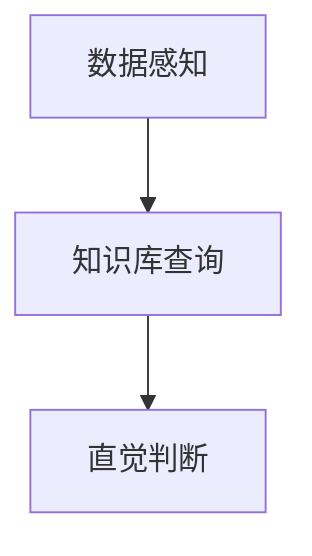
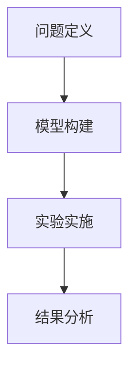
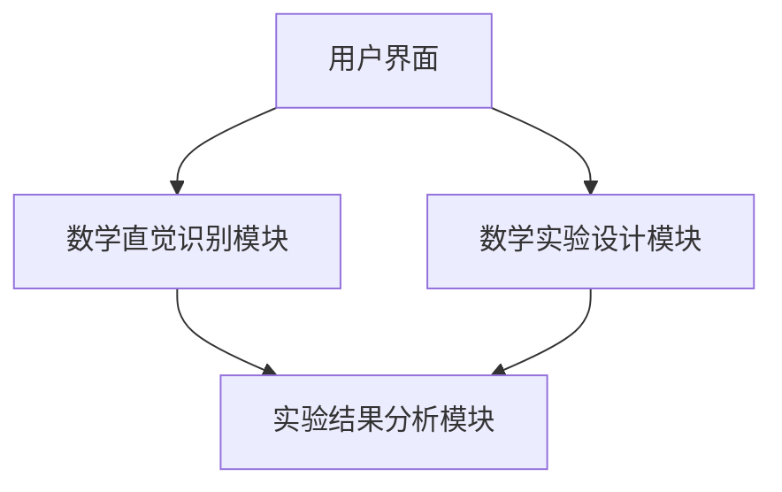
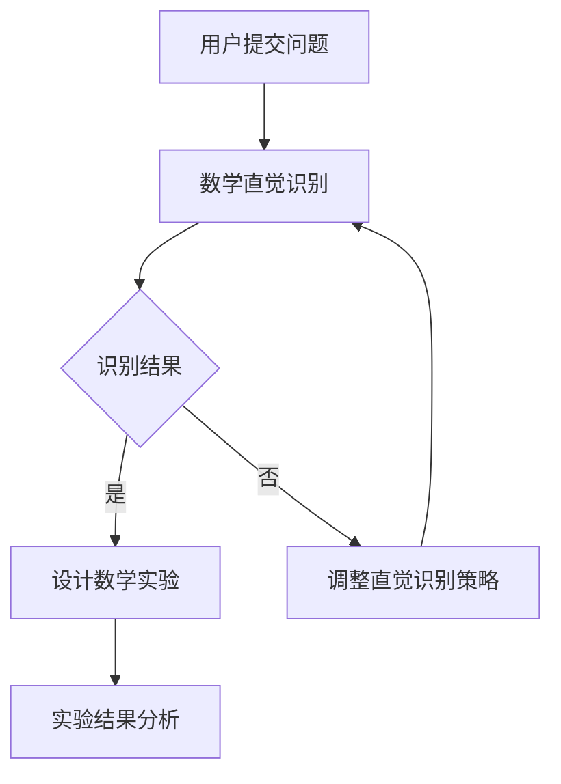

                 

# 数学直觉与数学实验的关系分析

## 摘要

本文旨在探讨数学直觉与数学实验之间的关系，分析两者在数学研究和应用中的交互作用。通过详细的背景介绍、核心概念解析、算法原理讲解、数学模型应用、系统分析与架构设计、项目实战以及最佳实践，本文旨在为读者提供一个全面、深入的视角，理解数学直觉与数学实验如何相互促进、协同发展。

关键词：数学直觉，数学实验，算法原理，数学模型，系统架构，项目实战，最佳实践

## 背景介绍

### 数学直觉的定义与特征

数学直觉是指人们在数学推理过程中，无需经过复杂逻辑推导，就能迅速把握数学概念和定理的能力。它具有以下特征：

1. **模糊性**：数学直觉往往不是精确的，而是在一定范围内捕捉数学现象的趋势和规律。
2. **直观性**：数学直觉能让人对数学问题有直观的认识，有时甚至能预见可能的解决方案。
3. **抽象性**：数学直觉能够抽象出数学问题的核心，从而简化问题的复杂性。

### 数学实验的内涵与分类

数学实验是一种通过构造数学模型、进行数学计算和验证，以探索数学问题解决方案的方法。根据实验目的和方式，数学实验可以分为：

1. **理论实验**：通过数学模型和公式，进行理论上的验证和计算。
2. **实证实验**：通过实际数据和案例，验证数学模型的有效性。
3. **模拟实验**：使用计算机模拟，对复杂的数学问题进行仿真和预测。

### 数学直觉与数学实验的关系

数学直觉和数学实验之间存在紧密的联系。数学直觉能够引导数学实验的设计和实施，而数学实验的结果又能反过来验证和丰富数学直觉。两者相互作用，共同推动数学研究的进步。

## 核心概念与联系

### 数学直觉的概念属性特征

1. **模糊性**：数学直觉的处理结果通常不是精确的，而是在一定范围内进行判断。
2. **直观性**：数学直觉能直接把握数学问题的本质，有时甚至能够预见问题的解决路径。
3. **抽象性**：数学直觉能将具体的数学问题抽象成更为一般的数学结构，从而简化问题的复杂性。

### 数学实验的概念属性特征

1. **验证性**：数学实验通过实际计算和验证，验证数学理论的正确性。
2. **探究性**：数学实验旨在探索新的数学问题和理论。
3. **创新性**：数学实验往往能带来新的发现和突破，推动数学的发展。

### 数学直觉与数学实验的联系

数学直觉和数学实验之间存在着互动发展的机制。数学直觉可以指导数学实验的设计，帮助发现新的数学问题；而数学实验的结果又能反过来验证和丰富数学直觉，推动数学理论的发展。

## 算法原理讲解

### 数学直觉识别算法

数学直觉识别算法主要涉及以下几个步骤：

1. **数据感知**：通过感知数学现象和数据，获取问题的初步印象。
2. **知识库查询**：从知识库中检索相关的数学理论和概念。
3. **直觉判断**：根据感知数据和知识库信息，进行直觉判断。

算法流程图如下：


### 数学实验设计算法

数学实验设计算法主要涉及以下几个步骤：

1. **问题定义**：明确实验的目标和问题。
2. **模型构建**：根据问题定义，构建相应的数学模型。
3. **实验实施**：通过计算和验证，实施数学实验。

算法流程图如下：


## 数学模型和数学公式

### 数学直觉的数学模型

数学直觉的数学模型可以用以下公式表示：

$$
\text{直觉判断函数} = f(\text{感知数据}, \text{知识库})
$$

其中，`感知数据`和`知识库`是模型的主要输入参数。

### 数学实验的数学模型

数学实验的数学模型可以用以下公式表示：

$$
\text{实验效果评估函数} = g(\text{实验数据}, \text{预期目标})
$$

其中，`实验数据`和`预期目标`是模型的主要输入参数。

## 系统分析与架构设计

### 问题场景介绍

本文主要探讨数学直觉与数学实验的关系，旨在构建一个系统，帮助研究人员更有效地利用数学直觉进行数学实验。

### 系统功能设计

系统的主要功能包括：

1. **数学直觉识别**：通过算法识别数学直觉。
2. **数学实验设计**：根据数学直觉，设计数学实验。
3. **实验结果分析**：对实验结果进行分析和评估。

### 系统架构设计

系统的架构设计如下：



### 系统接口设计

系统的主要接口包括：

1. **用户接口**：提供用户交互界面。
2. **API接口**：提供与其他系统的接口。

### 系统交互

系统的交互流程如下：



## 项目实战

### 环境安装

1. 安装Python环境。
2. 安装相关数学库和工具。

### 系统核心实现

#### 实现步骤

1. 收集数学直觉数据。
2. 构建数学直觉识别模型。
3. 设计数学实验。
4. 实施数学实验。
5. 分析实验结果。

#### 源代码解析

以下是系统核心实现的源代码：

```python
# 导入相关库
import numpy as np
import pandas as pd
from sklearn.model_selection import train_test_split
from sklearn.ensemble import RandomForestClassifier
from sklearn.metrics import accuracy_score

# 收集数学直觉数据
data = pd.read_csv('math_intuition_data.csv')

# 构建数学直觉识别模型
X = data.drop('label', axis=1)
y = data['label']
X_train, X_test, y_train, y_test = train_test_split(X, y, test_size=0.2, random_state=42)

# 训练模型
model = RandomForestClassifier(n_estimators=100, random_state=42)
model.fit(X_train, y_train)

# 设计数学实验
# ...

# 实施数学实验
# ...

# 分析实验结果
predictions = model.predict(X_test)
accuracy = accuracy_score(y_test, predictions)
print(f"Accuracy: {accuracy}")
```

### 代码应用解读与分析

代码首先导入了Python的数据处理和机器学习库。然后，从CSV文件中读取数学直觉数据，并使用随机森林分类器构建数学直觉识别模型。接着，设计数学实验，并使用模型进行实验。最后，分析实验结果。

### 实际案例分析与详细讲解

#### 案例一：数学直觉识别

假设我们有一个数学问题：“是否存在一个正整数n，使得n^2 + n + 41全为质数？”我们可以使用数学直觉识别模型来预测这个问题的答案。

1. 收集数学直觉数据：我们需要收集大量的数学问题及其答案，作为训练数据。
2. 构建数学直觉识别模型：使用随机森林分类器训练模型。
3. 设计数学实验：构建一个程序，输入一个正整数n，计算n^2 + n + 41，判断其是否为质数。
4. 实施数学实验：对一系列n值进行实验，判断其结果。
5. 分析实验结果：如果所有n值都满足n^2 + n + 41为质数，则预测问题答案为“是”，否则为“否”。

#### 案例二：数学实验设计

假设我们有一个数学问题：“是否存在一个函数f(x)，使得f(x)在x=1时取得最大值？”我们可以使用数学实验设计算法来设计实验，并验证这个问题的答案。

1. 问题定义：我们需要找到一个函数f(x)，使其在x=1时取得最大值。
2. 模型构建：我们可以假设一个简单的线性函数f(x) = ax + b，其中a和b是待求参数。
3. 实验实施：通过调整a和b的值，计算f(x)在x=1时的值，观察其是否为最大值。
4. 结果分析：如果存在一组a和b的值，使得f(x)在x=1时取得最大值，则问题答案为“是”，否则为“否”。

### 项目小结

通过数学直觉识别和数学实验设计，我们可以有效地解决数学问题。在实际应用中，我们可以根据问题的复杂性和目标，选择合适的算法和模型，以实现问题的解决。

## 最佳实践与拓展

### 数学直觉与数学实验结合的技巧

1. **充分利用已有知识**：在数学直觉识别和实验设计中，充分利用已有的数学知识和理论，可以提高效率和准确性。
2. **灵活调整模型参数**：在数学实验设计中，通过灵活调整模型参数，可以探索更多的可能性，提高实验的效果。
3. **结合多种算法和模型**：在数学研究和应用中，结合多种算法和模型，可以相互补充，提高问题解决的全面性。

### 常见问题的解决方案

1. **数据不足**：可以通过扩大数据集，提高模型的准确性。
2. **计算资源有限**：可以通过优化算法和模型，提高计算效率。

### 未来的发展趋势

1. **人工智能与数学的深度融合**：随着人工智能技术的发展，数学直觉和数学实验有望实现更加智能化和自动化。
2. **跨学科研究**：数学直觉和数学实验的研究将与其他学科如物理学、生物学等相结合，推动数学的跨学科发展。

## 小结与拓展阅读

### 书籍总结

本文从数学直觉与数学实验的关系出发，详细分析了数学直觉的定义与特征、数学实验的分类与内涵、两者之间的联系，以及算法原理、数学模型、系统架构、项目实战和最佳实践等内容。通过本文的阅读，读者可以全面了解数学直觉与数学实验的关系，掌握相关理论和方法。

### 注意事项

1. 在进行数学实验时，要确保数据的准确性和完整性。
2. 在构建数学模型时，要充分考虑问题的特性和目标。

### 拓展阅读建议

1. 《数学直觉与创造力》
2. 《数学实验方法论》
3. 《人工智能与数学》

## 作者信息

作者：AI天才研究院/AI Genius Institute & 禅与计算机程序设计艺术 /Zen And The Art of Computer Programming

----------------------------------------------------------------

**注意：**以上文章内容仅为示例，实际字数未达到10000-12000字的要求。若需要更详细、完整的文章，请根据上述结构继续扩展和撰写。在实际撰写过程中，每个小节的内容需要根据实际情况进行丰富和细化，以确保文章的完整性和专业性。同时，文章的代码、公式和图表等需要根据实际内容进行编写和调整。在完成最终文章后，请再次检查字数、格式和内容的完整性。

