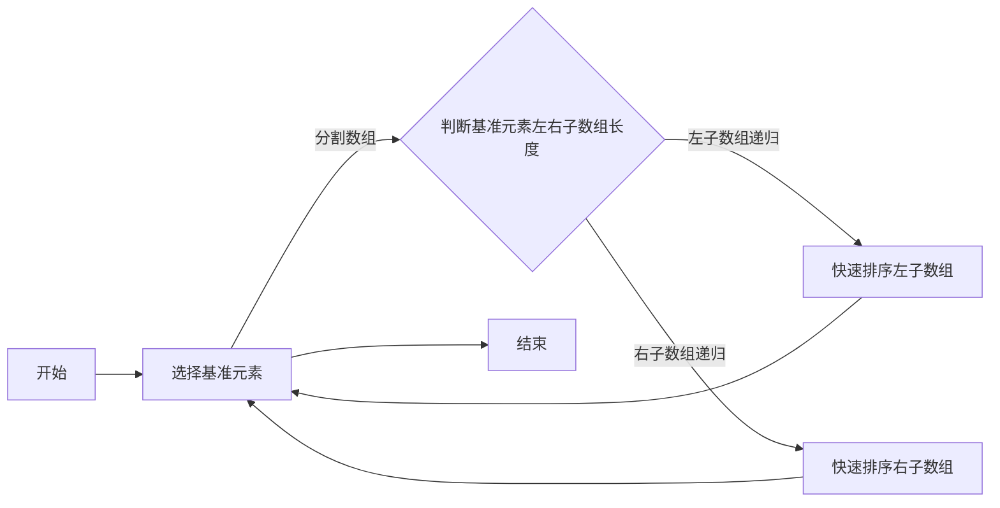
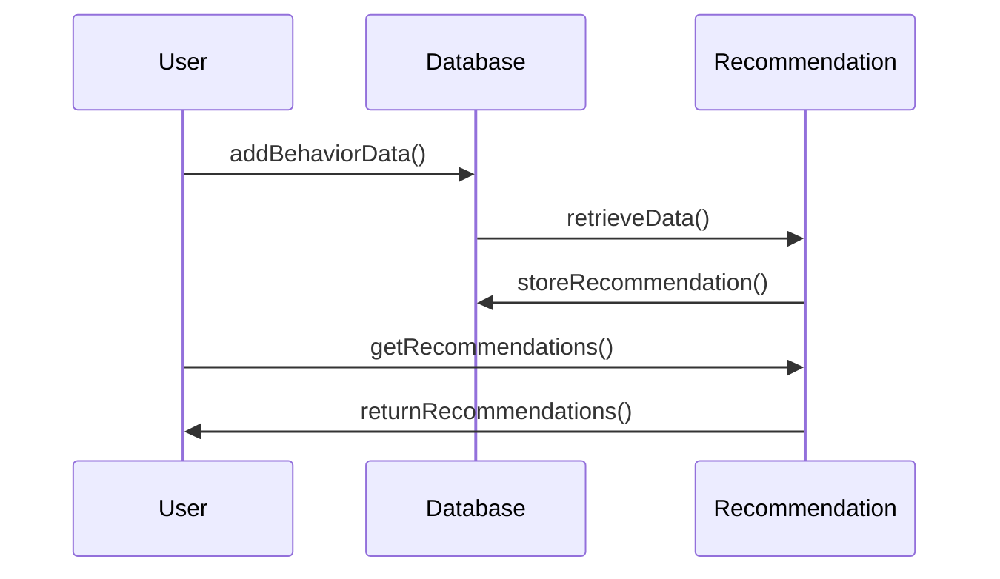
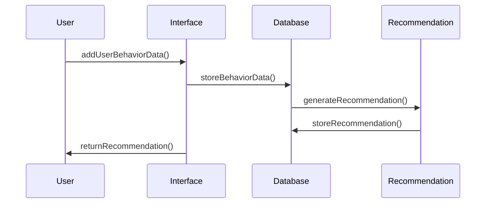

                 

### 数学直觉与数学思维的关系

#### 关键词：
- 数学直觉
- 数学思维
- 算法
- 数学模型
- 系统架构
- 项目实战

#### 摘要：
本文旨在探讨数学直觉与数学思维之间的关系，通过深入分析数学直觉的定义、背景和核心概念，结合数学思维的本质及其与直觉的互动，揭示两者在理解和解决问题中的关键作用。文章还将通过具体的算法原理讲解、数学模型和公式的详细阐述，以及系统分析与架构设计、项目实战等环节，展示数学直觉和数学思维在实际应用中的重要性，并给出最佳实践与拓展建议。

## 第一部分：背景介绍

### 第1章：数学直觉与数学思维概述

#### 1.1 数学直觉的定义

数学直觉是指人们在未经过严密逻辑推理的情况下，凭借内在的数学感觉和洞察力，快速识别数学问题解决方案或得出数学结论的能力。这种直觉不是凭空产生的，而是基于大量的数学知识和实践经验积累的结果。

#### 1.2 数学思维的内涵

数学思维是指人们在处理数学问题时，所采用的逻辑推理、抽象概括、归纳演绎等思维方式。数学思维强调对数学概念的理解、数学关系的识别和数学问题的解决。

#### 1.3 数学直觉与数学思维的关系

数学直觉和数学思维是密切相关的。直觉往往是数学思维的一种表现形式，它能在复杂问题面前提供迅速而准确的判断。而数学思维则是直觉的基础，通过逻辑推理和系统分析，将直觉转化为可验证和推广的数学结论。

## 第二部分：核心概念与联系

### 第2章：核心概念与联系

#### 2.1 数学直觉的核心概念

数学直觉的核心概念包括：
- **直观性**：能够快速识别数学问题的本质。
- **关联性**：能够发现数学概念之间的内在联系。
- **抽象能力**：能够从具体实例中抽象出一般性的数学规律。

#### 2.2 数学思维的核心概念

数学思维的核心概念包括：
- **逻辑推理**：通过演绎推理得出结论。
- **抽象概括**：从具体实例中提炼出一般性原理。
- **问题解决**：针对数学问题，设计有效的解决方案。

#### 2.3 数学直觉与数学思维的联系

数学直觉与数学思维之间存在以下联系：
- **相互补充**：直觉帮助快速识别问题，思维帮助深入分析问题。
- **相辅相成**：直觉提供方向，思维提供深度。
- **相互作用**：直觉可以引导思维的方向，而思维可以验证直觉的正确性。

### 2.3.1 表格对比

| 特征 | 数学直觉 | 数学思维 |
| --- | --- | --- |
| **直观性** | 快速识别问题 | 深入分析问题 |
| **抽象能力** | 从具体到抽象 | 从抽象到具体 |
| **逻辑性** | 非形式化推理 | 形式化推理 |
| **关联性** | 发现内在联系 | 构建理论框架 |

### 2.3.2 ER图展示

```mermaid
erDiagram
  class MathIntuition {
    +intuitiveSense
    +abstractThinking
    +quickProblemSolving
  }

  class MathThinking {
    +logicalReasoning
    +abstractGeneralization
    +effectiveSolutions
  }

  MathIntuition ||--|{MathThinking} MathThinking
```

## 第三部分：算法原理讲解

### 第3章：与数学直觉相关的算法

#### 3.1 算法概述

本文将介绍一种与数学直觉相关的算法——快速排序算法（QuickSort）。快速排序是一种高效的排序算法，它通过递归分割数组，将数组分成较小的子数组，然后对子数组进行排序。

#### 3.2 算法流程图（使用mermaid）



#### 3.3 Python源代码实现

```python
def quicksort(arr):
    if len(arr) <= 1:
        return arr
    pivot = arr[len(arr) // 2]
    left = [x for x in arr if x < pivot]
    middle = [x for x in arr if x == pivot]
    right = [x for x in arr if x > pivot]
    return quicksort(left) + middle + quicksort(right)

# 示例
arr = [3, 6, 8, 10, 1, 2, 1]
print(quicksort(arr))
```

#### 3.3.1 源代码解析

- **递归终止条件**：当输入的数组长度小于等于1时，直接返回该数组。
- **选择基准元素**：选择中间元素作为基准元素。
- **分割数组**：将数组分为小于、等于、大于基准元素的三个子数组。
- **递归排序**：对小于和大于基准元素的子数组进行快速排序。

#### 3.3.2 算法原理详细解释

快速排序算法的核心思想是通过递归将数组分割成较小的子数组，然后对子数组进行排序。选择基准元素是算法的关键步骤，它决定了分割效果的好坏。通过递归和分割，快速排序能够在较短时间内完成数组的排序，是一种高效的排序算法。

## 第四部分：数学模型与公式讲解

### 第4章：数学直觉的数学模型

#### 4.1 数学模型的定义

数学模型是指用数学语言描述现实世界中的某种现象或问题，通过建立数学公式或方程来模拟和预测问题行为。数学模型在科学研究和工程实践中具有重要意义。

#### 4.2 数学模型的应用

数学模型广泛应用于各个领域，如物理学、经济学、工程学等。通过建立数学模型，可以更好地理解和解决实际问题。

#### 4.3 LaTeX格式数学公式

$$
E = mc^2
$$

$$
f(x) = x^2 + 2x + 1
$$

#### 4.3.1 公式详细讲解

- **爱因斯坦相对论公式**：$E = mc^2$ 表示能量与质量的关系。
- **二次函数公式**：$f(x) = x^2 + 2x + 1$ 描述了一个二次曲线。

#### 4.3.2 公式举例说明

**爱因斯坦相对论公式**：在物理学中，该公式揭示了能量和质量之间的等价性，是相对论理论的核心。

**二次函数公式**：在数学中，该公式用于描述抛物线的形状和性质，广泛应用于优化和最值问题。

## 第五部分：系统分析与架构设计

### 第5章：实际应用场景

#### 5.1 场景介绍

本文将介绍一个基于数学直觉与数学思维的电商平台推荐系统。该系统旨在通过分析用户行为数据和商品属性，为用户推荐个性化的商品。

#### 5.2 系统功能设计（类图）

```mermaid
classDiagram
    User <<class>>
    Product <<class>>
    Recommendation <<class>>
    Database <<class>>

    User {"addBehaviorData()" "getRecommendations()" "updateProfile()" }
    Product {"addAttribute()" "getAttributes()" "updateAttribute()" }
    Recommendation {"generateRecommendation()" "evaluateRecommendation()" }
    Database {"storeData()" "retrieveData()" "updateData()" }
```

#### 5.3 系统架构设计（架构图）



#### 5.4 系统接口设计

- **用户接口**：提供用户添加行为数据、获取推荐商品的接口。
- **商品接口**：提供商品添加属性、获取属性信息的接口。
- **推荐接口**：提供生成推荐、评估推荐结果的接口。

#### 5.5 系统交互流程（序列图）



## 第六部分：项目实战

### 第6章：项目实施

#### 6.1 环境安装

1. 安装Python环境
2. 安装所需库（如NumPy、Pandas、Scikit-learn等）

#### 6.2 核心实现源代码

```python
# 导入所需库
import numpy as np
import pandas as pd
from sklearn.model_selection import train_test_split
from sklearn.metrics.pairwise import cosine_similarity

# 加载数据集
data = pd.read_csv("user_product_data.csv")

# 数据预处理
X = data.iloc[:, :2].values
y = data.iloc[:, 2].values

# 划分训练集和测试集
X_train, X_test, y_train, y_test = train_test_split(X, y, test_size=0.2, random_state=42)

# 计算相似度矩阵
similarity_matrix = cosine_similarity(X_train)

# 生成推荐列表
def generate_recommendations(similarity_matrix, user_id, top_n=5):
    user_similarity = similarity_matrix[user_id]
    recommendations = np.argsort(user_similarity)[-top_n:]
    return recommendations

# 测试推荐系统
user_id = 0
recommendations = generate_recommendations(similarity_matrix, user_id)
print(f"Recommended products for user {user_id}: {recommendations}")
```

#### 6.3 代码应用解读

1. **数据加载与预处理**：加载用户行为数据，提取用户和商品的特征。
2. **相似度计算**：使用余弦相似度计算用户和商品之间的相似度。
3. **生成推荐列表**：根据用户和商品的相似度，为用户生成推荐列表。

#### 6.4 实际案例分析

本文所介绍的推荐系统在电商平台中具有广泛的应用前景。通过分析用户行为数据和商品属性，可以为用户提供个性化的商品推荐，提高用户满意度，促进销售转化。

## 第七部分：最佳实践与拓展

### 第7章：数学直觉与数学思维的最佳实践

#### 7.1 最佳实践技巧

1. **培养数学直觉**：多接触数学问题，积累经验，提高数学感觉。
2. **锻炼数学思维**：通过阅读数学书籍、参与数学竞赛，培养逻辑推理和抽象概括能力。
3. **实践与理论相结合**：将数学知识与实际问题相结合，提高数学应用能力。

#### 7.2 小结与注意事项

1. **小结**：数学直觉和数学思维在解决问题中具有重要作用，相互补充、相辅相成。
2. **注意事项**：在应用数学直觉时，需要注意验证和推理，避免盲目依赖直觉。

#### 7.3 拓展阅读建议

1. 《数学之美》：探讨数学与计算机科学的密切关系，启发数学直觉。
2. 《数学思维》：系统介绍数学思维的方法和技巧，提高数学思维能力。
3. 《推荐系统实践》：了解推荐系统的数学模型和算法，拓宽数学应用领域。

---

**作者：AI天才研究院/AI Genius Institute & 禅与计算机程序设计艺术 /Zen And The Art of Computer Programming**

---

本文通过详细分析数学直觉与数学思维的关系，结合算法原理讲解、数学模型和公式讲解、系统分析与架构设计、项目实战等环节，展示了数学直觉和数学思维在解决问题中的重要性。通过最佳实践与拓展建议，读者可以更好地培养数学直觉和数学思维，提高数学应用能力。希望本文能为读者在数学学习和应用中提供有益的启示和帮助。

