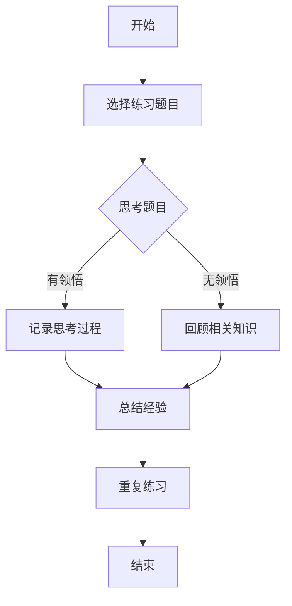
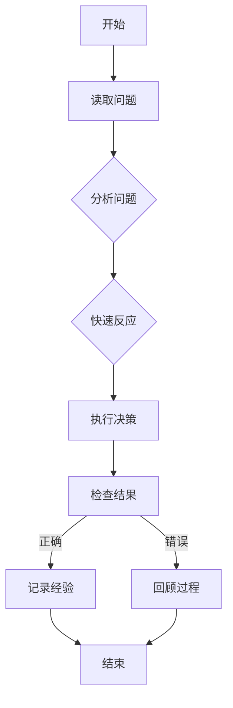
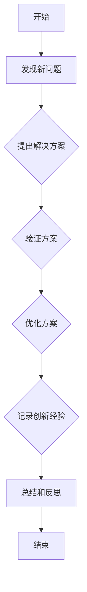

                 

## 数学直觉与数学教学的关系

### 关键词

数学直觉、数学教学、教育心理学、认知科学、算法原理、教学方法、教学策略

### 摘要

数学直觉是数学学习中一种关键能力，它不仅影响学生的学习效果，还对他们的创造力与问题解决能力有着深远的影响。本文旨在探讨数学直觉与数学教学之间的关系，通过分析数学直觉的定义、特征以及数学教学的方法与策略，揭示培养数学直觉的途径。本文首先介绍数学直觉与数学教学的基本概念，接着深入探讨它们之间的内在联系，然后提出一系列培养数学直觉的教学策略和算法原理，并通过具体实例进行说明。最后，文章将对数学直觉与数学教学的关系进行总结，并提出未来研究的方向。

### 背景介绍

#### 1. 问题背景

数学直觉是数学学习中的一个重要方面，它涉及到学生通过直观的感知和思维过程，快速识别数学模式和关系的能力。这种直觉不仅体现在解决数学问题的过程中，也体现在数学发现和创新的各个环节。数学直觉的强弱往往决定了学生在数学学习中的成就感和自信心，它是数学思维的重要组成部分。

在数学教学中，传统的教学方法往往侧重于逻辑推理、公式记忆和计算技能的培养，而忽视了数学直觉的作用。这种教学方式可能导致学生在面对复杂问题时，无法迅速地运用直觉进行思考和解决问题，从而影响了他们的学习效果和创造力。

#### 2. 问题描述

当前数学教学中的一个突出问题是如何有效地培养学生的数学直觉。虽然许多教育者和研究人员已经认识到数学直觉的重要性，但在具体的教学实践中，如何将其融入数学教学过程仍然是一个挑战。具体问题包括：

- 如何在数学教学中识别和培养学生的数学直觉？
- 哪些教学策略和教学方法能够有效地促进数学直觉的发展？
- 如何在课程设计和教学过程中平衡直觉和逻辑推理之间的关系？

#### 3. 问题解决

为了解决这些问题，我们需要从多个角度来探讨数学直觉与数学教学的关系，并提出相应的解决方案。具体策略包括：

- **课程设计**：在课程设计中，应该融入更多的实践环节和探究活动，让学生在实际操作中培养数学直觉。
- **教学方法**：采用多样化的教学方法，如探究式学习、合作学习等，可以激发学生的直觉思维。
- **教学策略**：通过游戏、谜题、故事等形式，将数学直觉融入日常教学中，使学生在轻松愉快的氛围中感受数学的魅力。
- **评估方式**：改革评估方式，不仅注重学生的知识掌握情况，还关注他们的直觉思维和创新能力。

#### 4. 边界与外延

数学直觉不仅限于数学学科内部，它在跨学科领域中也发挥着重要作用。例如，在数学物理、数学生物学等交叉学科中，数学直觉往往能够帮助研究者快速发现问题和提出解决方案。因此，研究数学直觉与数学教学的关系，不仅有助于提升数学教育质量，也能促进跨学科研究的发展。

#### 5. 概念结构与核心要素组成

数学直觉的核心要素包括：

- **感知与领悟**：通过直接的感知和领悟，快速发现数学事实和规律。
- **快速反应**：在解决问题时，能迅速作出正确的判断和决策。
- **创新思维**：在数学研究和学习中，能进行创造性思维，提出新的问题和解决方案。

这些要素共同构成了数学直觉的基本结构，也是数学教学中需要重点培养的能力。

### 核心概念与联系

#### 6. 核心概念原理

**6.1 数学直觉**

数学直觉是指学生在数学学习过程中，通过直接的感知和领悟，快速发现数学事实、解决问题和进行创造性思维的能力。数学直觉的特点是快速、直接、高效，它往往超越了逻辑推理和计算技能的范畴。

**6.2 数学教学**

数学教学是指通过多种教学方法和策略，引导学生掌握数学知识、技能和方法，培养学生的数学思维能力和创新意识的过程。数学教学的目标不仅在于传授知识，更在于培养学生的数学素养和解决问题的能力。

#### 7. 概念属性特征对比表格

| 概念        | 数学直觉                          | 数学教学                          |
|-------------|----------------------------------|----------------------------------|
| 定义        | 快速发现数学事实和规律           | 引导学生掌握数学知识、技能和方法 |
| 特点        | 直接、高效、快速                 | 系统、有序、规范                 |
| 重要性      | 是数学创新和突破的重要源泉       | 是数学学习的重要保障             |

#### 8. ER实体关系图架构

```mermaid
erDiagram
  Student ||--|{ MathIntuition }
  Teacher ||--|{ MathIntuition }
  Class << EntityClass
  Student ||--|{ Class }
  Teacher ||--|{ Class }
```

### 算法原理讲解

#### 9. 培养数学直觉的算法原理

为了培养数学直觉，我们可以采用以下算法原理：

**9.1 感知与领悟**

感知与领悟是培养数学直觉的基础。通过大量的数学练习和思考，学生可以逐渐培养出对数学现象的敏锐感知能力。以下是一个简单的算法流程：



**9.2 快速反应**

快速反应是培养数学直觉的关键。通过反复练习和思考，学生可以在面对数学问题时迅速作出正确的判断和决策。以下是一个简单的算法流程：



**9.3 创新思维**

创新思维是培养数学直觉的高级阶段。通过跨学科学习和创造性思维训练，学生可以在数学学习和研究中提出新的问题和解决方案。以下是一个简单的算法流程：



### 数学直觉与数学教学的关系分析

#### 1. 数学直觉在数学教学中的作用

数学直觉在数学教学中发挥着重要作用。它不仅能够提高学生的学习效率，还能激发他们的学习兴趣和创造力。以下具体分析数学直觉在数学教学中的几个关键作用：

**1.1 提高问题解决能力**

数学直觉能够帮助学生快速识别问题本质，找到解决问题的关键点。通过直觉，学生可以避免繁琐的推理过程，直接到达问题解决方案，从而提高问题解决的效率。

**1.2 促进创新思维**

数学直觉鼓励学生进行创造性思维，提出新颖的数学问题和解法。这种创新能力是数学研究的核心，也是培养学生综合素质的重要方面。

**1.3 增强学习兴趣**

数学直觉让学生感受到数学的魅力和乐趣，从而增强他们的学习兴趣和动机。当学生通过直觉获得数学问题的答案时，他们会感到满足和成就感，这种积极的情感体验有助于长期的学习。

#### 2. 数学教学对数学直觉培养的影响

数学教学方法和策略对数学直觉的培养有着深远的影响。以下从几个方面分析数学教学对数学直觉培养的影响：

**2.1 教学内容的选择**

教学内容的选择直接影响学生对数学直觉的培养。教师应该选择那些能够激发学生直觉思维的内容，如几何图形、数学游戏等，这些内容有助于学生直观地理解数学概念。

**2.2 教学方法的运用**

教学方法的运用是培养数学直觉的重要手段。教师可以采用探究式学习、合作学习等教学方法，鼓励学生在实践中发现和解决问题，从而培养他们的数学直觉。

**2.3 教学评价的改革**

教学评价的改革有助于促进数学直觉的培养。教师应该改革传统的评估方式，不仅关注学生的知识掌握情况，还要关注他们的直觉思维和创新能力。例如，可以通过项目报告、问题解决比赛等形式，评估学生的数学直觉能力。

#### 3. 数学直觉与数学教学相互促进的关系

数学直觉与数学教学之间存在着相互促进的关系。数学直觉可以激发学生的学习兴趣和创造力，从而提高教学效果；而有效的数学教学又能培养和发展学生的数学直觉。以下具体阐述数学直觉与数学教学相互促进的关系：

**3.1 数学直觉推动教学创新**

数学直觉可以激发教师的创新意识，推动数学教学方法的改革。教师可以根据学生的直觉思维特点，设计出更具有吸引力和互动性的教学活动，从而提高教学效果。

**3.2 数学教学促进直觉发展**

有效的数学教学可以为学生提供丰富的数学实践机会，促进他们的数学直觉发展。通过多样化的教学方法和策略，学生可以在实际操作中不断体验和领悟数学直觉，从而提高直觉思维能力。

**3.3 教学反馈强化直觉培养**

在教学过程中，教师的反馈对学生数学直觉的培养起着重要作用。通过及时的反馈，学生可以了解自己的直觉思维是否正确，从而调整和优化自己的思维过程，不断提高数学直觉能力。

### 实际教学案例中的数学直觉培养

为了更好地说明数学直觉在数学教学中的应用，我们来看几个实际教学案例：

**案例1：几何直觉的培养**

在某次几何教学中，教师让学生通过观察几何图形，尝试发现图形之间的关系。学生通过直觉感知，很快发现了许多几何性质，如对顶角相等、同位角相等等。教师鼓励学生用自己的语言描述这些发现，从而培养了他们的几何直觉。

**案例2：概率直觉的培养**

在概率教学中，教师设计了一个投掷硬币的游戏。学生通过多次实验，逐渐形成了对概率的直觉理解，如正面朝上的概率大约是50%。教师引导学生分析实验结果，从而加深他们对概率直觉的认识。

**案例3：数学游戏中的直觉培养**

教师设计了一系列数学游戏，如“24点”、“数独”等，让学生在游戏中培养数学直觉。学生在游戏中需要快速计算和推理，从而提高了他们的数学直觉能力。

### 数学直觉培养的教学策略与实施方法

为了有效地培养数学直觉，教师可以采取以下教学策略与实施方法：

**1. 创设情境，激发直觉**

教师可以通过创设丰富的教学情境，激发学生的数学直觉。例如，通过现实生活中的数学问题，引导学生观察和发现数学现象，从而激发他们的直觉思维。

**2. 提供多样化的学习材料**

教师应提供多样化的学习材料，如数学游戏、故事、谜题等，这些材料可以帮助学生直观地理解数学概念，培养他们的数学直觉。

**3. 采用探究式学习**

探究式学习是一种有效的培养数学直觉的方法。教师可以设计探究性问题，引导学生通过自主探究和合作学习，发现数学规律和模式。

**4. 强化实践环节**

通过大量的数学实践活动，学生可以不断锻炼和提升他们的数学直觉。教师应鼓励学生动手操作、自主探索，从而在实践中培养数学直觉。

**5. 适时反馈与评价**

教师应及时给予学生反馈和评价，鼓励他们根据自己的直觉进行思考和判断。通过反馈和评价，学生可以了解自己的直觉是否准确，从而不断调整和优化自己的思维过程。

### 总结与展望

数学直觉在数学学习和教学中具有重要作用，它是培养学生综合素质和创新能力的重要途径。通过有效的教学策略和实施方法，教师可以有效地培养和提升学生的数学直觉。未来，研究数学直觉与数学教学的关系将继续深入，为数学教育改革提供理论支持和实践指导。

### 附录：相关研究综述

为了进一步探讨数学直觉与数学教学的关系，我们回顾了近年来相关研究的主要成果。以下是对这些研究的综述：

**1. 数学直觉的定义与特征**

研究一致认为，数学直觉是一种通过直接感知和领悟快速发现数学事实和解决问题的能力。数学直觉的特点包括快速性、直接性和高效性。不同研究者对数学直觉的具体定义略有不同，但普遍认同其作为数学思维的重要组成部分。

**2. 数学直觉在教学中的作用**

研究指出，数学直觉能够显著提高学生的数学问题解决能力、创新思维能力和学习兴趣。通过数学直觉，学生能够更快速地识别问题、找到解决方案，并在数学研究中提出新的问题和观点。

**3. 数学直觉的培养方法**

研究者提出了多种培养数学直觉的方法，包括情境创设、多样化学习材料、探究式学习和实践环节等。此外，一些研究还探讨了如何通过跨学科学习和创造性思维训练来培养数学直觉。

**4. 数学直觉与数学教学的关系**

研究指出，数学直觉与数学教学之间存在密切的联系。有效的数学教学能够促进数学直觉的发展，而数学直觉的培养也有助于提高数学教学的效果。同时，数学直觉与数学教学的关系还涉及到教学策略、教学方法、教学评价等多个方面。

**5. 现存问题和未来方向**

尽管已有大量研究探讨了数学直觉与数学教学的关系，但仍然存在一些问题，如数学直觉的测量和评估方法、数学直觉与逻辑推理的关系等。未来研究应进一步深入探讨这些问题的解决方法，并探索新的教学策略和培养方法，以促进数学直觉的发展。

### 跨学科视角下的数学直觉与数学教学

在当今跨学科研究日益重要的背景下，数学直觉与数学教学的关系也得到了新的视角和思考。以下从几个跨学科的角度探讨数学直觉在数学教学中的应用和培养。

#### 1. 认知科学与数学直觉

认知科学是研究人类认知过程和思维机制的学科，它与数学直觉有着密切的联系。认知科学研究表明，人的直觉思维过程涉及大脑的多个区域，包括前额叶、顶叶和颞叶等。通过认知科学的方法和技术，如脑成像技术，可以揭示数学直觉形成的神经基础。在教学过程中，教师可以利用这些研究成果，设计出更符合学生认知特点的教学活动，从而更好地培养数学直觉。

#### 2. 心理学与数学直觉

心理学研究人类行为和心理过程，包括感知、记忆、思维和决策等。在数学教学中，心理学的研究成果可以帮助教师理解学生在数学学习过程中的心理变化和思维特点。例如，通过心理学的实验研究，教师可以发现哪些因素会影响学生的数学直觉，如情绪状态、动机水平、认知负荷等。基于这些研究成果，教师可以采取针对性的教学策略，提高学生的数学直觉能力。

#### 3. 跨学科教育与数学直觉

跨学科教育强调将不同学科的知识和思维方式融合在一起，培养学生解决复杂问题的能力。在跨学科教育中，数学直觉作为数学学习和创新的核心能力，可以与其他学科的方法和工具相结合。例如，在数学与物理、数学与生物、数学与计算机科学的交叉研究中，数学直觉可以帮助学生发现新的数学模型和解决方法。教师可以设计跨学科项目，引导学生运用数学直觉进行跨学科探索，从而培养他们的综合能力。

#### 4. 教育技术与数学直觉

随着信息技术的快速发展，教育技术为数学直觉的培养提供了新的平台和工具。例如，虚拟现实技术可以模拟复杂的数学情境，让学生在虚拟环境中进行直观操作和体验。计算机编程和算法设计等教育技术课程也可以培养学生的数学直觉，通过编程实践和算法优化，学生可以深入理解数学概念和方法。此外，在线学习平台和移动学习应用为教师和学生提供了丰富的数学资源和互动机会，有助于数学直觉的培养。

#### 5. 数学直觉在跨学科研究中的应用

数学直觉不仅在数学教学中发挥着重要作用，也在跨学科研究中发挥着关键作用。在数学与物理的交叉研究中，数学直觉帮助物理学家发现新的物理现象和规律；在数学与生物学的交叉研究中，数学直觉帮助生物学家建立数学模型，揭示生物系统的复杂动态；在数学与计算机科学的交叉研究中，数学直觉帮助计算机科学家设计高效的算法和解决方案。跨学科研究的成功离不开数学直觉的发挥，这也为数学直觉的培养提供了更多的实践机会和应用场景。

### 数学直觉培养的最佳实践与教学策略

为了有效地培养数学直觉，教师可以采取多种最佳实践与教学策略。以下是一些具体的方法和步骤，以及它们在实际教学中的应用和效果：

#### 1. 创设问题情境，激发直觉思维

**方法**：教师可以通过设计有趣且富有挑战性的数学问题，激发学生的直觉思维。这些问题可以是开放性的，鼓励学生从不同的角度思考问题，从而激发他们的直觉。

**实际应用**：例如，教师可以让学生通过观察几何图形，尝试找出图形之间的关系。通过这种方式，学生可以在直观感知中培养几何直觉。

**效果**：这种方法能够提高学生的数学思维能力和解决问题的兴趣，培养他们的直觉思维。

#### 2. 利用数学游戏，培养直觉

**方法**：数学游戏是一种有趣且有效的教学工具，可以帮助学生在轻松愉快的氛围中培养数学直觉。教师可以选择适合学生年龄和认知水平的数学游戏，如“24点”、“数独”等。

**实际应用**：例如，在“24点”游戏中，学生需要通过加减乘除的运算，将给定的四个数字组合成结果为24的算式。这种游戏能够锻炼学生的快速计算和逻辑推理能力，同时培养他们的数学直觉。

**效果**：数学游戏能够提高学生的数学兴趣和参与度，培养他们的直觉思维和解决问题的能力。

#### 3. 开展合作学习，增强直觉交流

**方法**：合作学习可以促进学生之间的交流和互动，共同培养数学直觉。教师可以将学生分成小组，让他们在合作中解决问题。

**实际应用**：例如，在小组讨论中，学生可以共同分析一个复杂的数学问题，分享各自的思考过程和直觉判断。通过这种方式，学生可以相互启发，共同提高数学直觉。

**效果**：合作学习能够增强学生的合作精神和团队意识，提高他们的数学直觉和问题解决能力。

#### 4. 利用信息技术，丰富直觉体验

**方法**：信息技术为数学直觉的培养提供了丰富的资源和工具。教师可以利用计算机软件、虚拟现实和在线学习平台等，为学生提供直观的数学体验。

**实际应用**：例如，教师可以使用数学软件进行几何绘图和动态模拟，让学生在直观操作中理解几何概念。通过这种方式，学生可以在互动体验中培养几何直觉。

**效果**：信息技术能够丰富学生的数学学习体验，提高他们的直觉思维能力和操作技能。

#### 5. 鼓励自主探究，发展直觉能力

**方法**：自主探究是一种重要的教学方法，可以培养学生的独立思考和创新能力。教师应鼓励学生主动探索数学问题，通过自主研究培养数学直觉。

**实际应用**：例如，教师可以布置开放性的数学探究任务，让学生根据自己的兴趣和研究方向进行探究。通过这种方式，学生可以在自主探究中培养数学直觉。

**效果**：自主探究能够提高学生的自主学习能力和创新能力，培养他们的数学直觉和解决问题的能力。

#### 6. 结合生活实际，培养直觉应用

**方法**：将数学与生活实际结合起来，可以帮助学生更好地理解数学概念，培养他们的数学直觉。教师可以在教学中引入生活中的实际问题，让学生运用数学直觉解决这些问题。

**实际应用**：例如，教师可以让学生分析日常生活中的数学现象，如购物折扣、时钟问题等。通过这种方式，学生可以在实际情境中培养数学直觉。

**效果**：结合生活实际的教学能够提高学生的数学应用能力和解决实际问题的能力，培养他们的数学直觉。

### 小结

通过以上最佳实践与教学策略，教师可以有效地培养学生的数学直觉。这些方法不仅提高了学生的数学思维能力和问题解决能力，还激发了他们的学习兴趣和创造力。在未来的数学教学中，教师应继续探索和运用这些策略，为学生的数学直觉发展提供更好的支持和引导。

### 数学直觉与数学教学关系的未来发展趋势

数学直觉与数学教学的关系在未来将继续深化和拓展，随着教育理论和技术的不断发展，以下几个方面有望成为研究的热点和趋势：

#### 1. 个性化教学与数学直觉培养

随着人工智能和大数据技术的应用，个性化教学将更加普及。未来的教学系统可能会根据学生的数学直觉水平和学习习惯，提供个性化的教学资源和策略。通过分析学生的学习行为和表现，教师可以更精准地培养学生的数学直觉，提高教学效果。

#### 2. 跨学科教学与数学直觉培养

跨学科教学有助于培养学生的综合能力和创新能力。未来，数学直觉的培养将更加注重与其他学科的结合，如数学与物理、数学与计算机科学、数学与艺术等。通过跨学科教学，学生可以在不同领域的实践中发展数学直觉，提高他们的综合素养。

#### 3. 教育技术与数学直觉培养

教育技术的不断进步将为数学直觉的培养提供更多可能性。虚拟现实、增强现实、在线学习平台等新技术将为学生提供更加丰富和直观的数学学习体验。教师可以利用这些技术工具，设计更加生动和互动的教学活动，从而更好地培养学生的数学直觉。

#### 4. 教学评估与数学直觉测量

未来的教学评估将更加注重数学直觉的测量和评价。通过开发有效的评估工具和方法，教师可以更准确地评估学生的数学直觉水平，了解教学效果，从而不断优化教学策略。

#### 5. 数学直觉的神经科学基础研究

神经科学研究将为数学直觉提供更深入的理论基础。通过脑成像技术、神经心理学等方法，研究者可以探索数学直觉的神经机制，揭示数学直觉的形成和发展过程，为数学教学提供科学依据。

#### 6. 数学直觉与教育公平

随着教育资源的分配和普及程度不断提高，数学直觉的培养也将更加关注教育公平。未来，如何确保所有学生，尤其是资源较少的学生，都能够得到有效的数学直觉培养，将是一个重要的研究课题。

### 结论

数学直觉在数学学习和教学中具有重要作用，它不仅影响学生的学习效果，还对他们的问题解决能力和创新能力产生深远影响。本文从多个角度探讨了数学直觉与数学教学的关系，分析了数学直觉的基本概念和特征，讨论了数学直觉在数学教学中的应用和培养方法。未来的研究应继续深入探讨数学直觉的测量和评估方法，探索跨学科教学和个性化教学的策略，为数学直觉的培养提供更加科学和有效的支持。通过不断探索和创新，我们可以为学生的数学直觉发展创造更好的条件，推动数学教育质量的提升。

### 附录：进一步阅读推荐

1. **《数学直觉：从概念到应用》（Mathematical Intuition: From Concepts to Applications）**，作者：John Mighton
   - 本书详细探讨了数学直觉的概念、特征和应用，提供了丰富的案例和研究结果，适合对数学直觉感兴趣的读者阅读。

2. **《数学直觉与认知科学》（Mathematical Intuition and Cognitive Science）**，作者：Matthew Inglis
   - 本书从认知科学的视角出发，分析了数学直觉的神经基础和认知机制，对于研究数学直觉与认知关系的学者有重要参考价值。

3. **《直觉思维与数学教育》（Intuitive Thinking and Mathematics Education）**，作者：Paul Ernest
   - 本书讨论了直觉思维在数学教育中的地位和作用，提供了多种教学策略和方法，适合数学教育工作者参考。

4. **《数学游戏与直觉培养》（Mathematical Games and the Cultivation of Intuition）**，作者：David Wells
   - 本书通过数学游戏的实例，展示了如何利用游戏培养学生的数学直觉，适合数学教师和教育爱好者阅读。

### 注意事项与拓展阅读

在数学直觉的培养过程中，教师和家长需要注意以下几点：

1. **鼓励探索**：鼓励学生自主探索数学问题，培养他们的好奇心和探索精神。
2. **提供多样化的资源**：为学生提供多样化的数学学习资源，如书籍、游戏、在线课程等，以丰富他们的数学体验。
3. **及时反馈**：对学生的问题解决过程和直觉判断给予及时反馈，帮助他们了解自己的思维过程和结果。
4. **跨学科结合**：将数学与其他学科结合，通过跨学科项目培养学生的综合能力和创新思维。

拓展阅读方面，读者可以关注以下主题：

1. **数学直觉与创造力**：研究数学直觉与创造力之间的关系，探讨如何通过数学教育培养创新思维。
2. **数学直觉与认知发展**：探讨数学直觉在不同年龄阶段的发展特点和影响因素。
3. **数学直觉与教育技术**：研究教育技术如何促进数学直觉的培养，如虚拟现实、在线学习平台等的应用。

通过持续的研究和实践，我们可以为学生的数学直觉发展提供更有力的支持，推动数学教育的不断进步。

