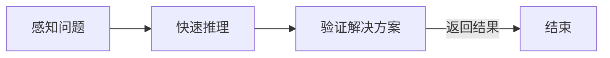
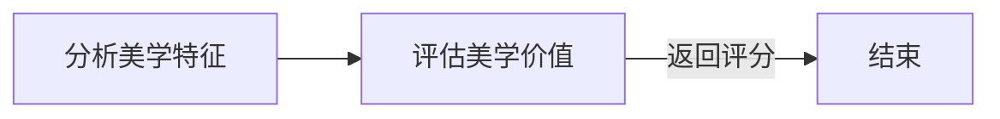
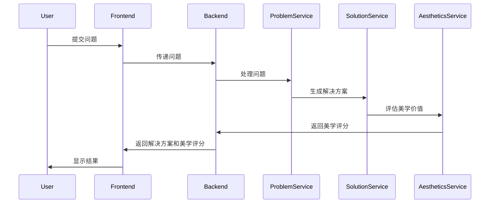
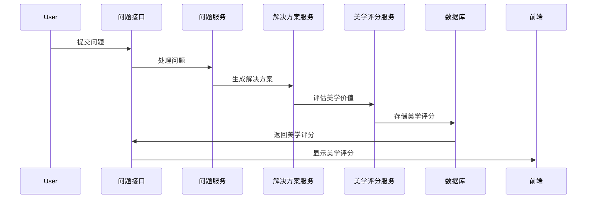

                 

### 《数学直觉与数学美学的关系》

> 关键词：数学直觉、数学美学、认知心理学、数学教育、算法设计

> 摘要：本文旨在探讨数学直觉与数学美学之间的关系，通过分析两者的核心概念、形成机制和相互作用，揭示数学直觉对数学美学的影响，并阐述数学美学在数学教育中的应用价值。文章将从背景介绍、核心概念与联系、数学模型与公式、算法原理、系统分析与架构设计、项目实战和最佳实践七个方面展开，以期提供对数学直觉与数学美学关系的深入理解。

---

## 1. 引言

### 1.1 问题背景

数学直觉和数学美学都是数学研究和教育中不可或缺的元素。数学直觉通常被认为是一种深植于人类思维中的能力，它使我们能够快速解决数学问题，而不需要进行繁琐的逻辑推理。而数学美学则关注数学对象和表达形式的审美价值，强调数学的和谐、简洁和优雅。

### 1.2 问题描述

尽管数学直觉和数学美学在数学研究和教育中具有重要作用，但它们之间的关系尚未得到充分研究。如何理解数学直觉与数学美学之间的相互作用，以及如何通过数学美学提高数学直觉，是当前数学教育和研究面临的重要问题。

### 1.3 问题解决

本文将通过对数学直觉和数学美学核心概念的分析，探讨两者之间的联系，并讨论数学美学在数学教育中的应用价值。通过这一研究，我们期望能够为数学直觉的培养和数学美学的研究提供新的视角和方法。

### 1.4 边界与外延

本文的研究主要聚焦于数学直觉与数学美学在数学教育和研究中的应用。然而，这一问题的边界和外延远不止于此，它还涉及到认知心理学、艺术哲学等多个领域。

---

## 2. 核心概念与联系

### 2.1 数学直觉

#### 2.1.1 定义

数学直觉是指个体在解决数学问题时，基于直观感知和经验快速做出判断的能力。它通常表现为对数学问题结构的敏感性和对数学定理的预感。

#### 2.1.2 特点

- 快速性：数学直觉使个体能够迅速识别数学问题并找到解决方案。
- 正确性：尽管数学直觉不是基于严格逻辑推理，但它在大多数情况下都能给出正确答案。
- 局限性：数学直觉在某些复杂问题或极端情况下可能失效。

#### 2.1.3 形成机制

数学直觉的形成与个体的认知能力、数学教育背景和经验积累密切相关。研究表明，数学直觉的形成还受到神经心理学因素的影响。

### 2.2 数学美学

#### 2.2.1 定义

数学美学是研究数学对象和表达形式的美学价值的学科。它探讨数学的和谐、简洁和优雅等特征，强调数学的审美愉悦。

#### 2.2.2 特点

- 和谐性：数学美学强调数学对象之间的内在一致性。
- 简洁性：数学美学追求简洁的表达和形式。
- 统一性：数学美学追求不同数学领域之间的统一和连贯。

#### 2.2.3 形成机制

数学美学的形成受到个体审美经验、数学直觉和数学知识结构的影响。审美经验越丰富，数学直觉越敏锐，个体的数学美学水平越高。

### 2.3 数学直觉与数学美学的联系

数学直觉和数学美学在数学研究和教育中具有紧密的联系。数学直觉不仅影响个体的数学学习效果，还影响其对数学美学的感知。而数学美学则通过激发数学直觉，促进数学问题的解决和创新。以下是两者之间的一些联系：

- **数学直觉激发数学美学**：个体的数学直觉可以激发对数学对象和表达形式的美学感知，从而提高数学美学水平。
- **数学美学促进数学直觉**：对数学美学的理解可以增强个体对数学问题的直觉感知，提高数学直觉能力。

---

## 3. 数学模型和数学公式 & 详细讲解 & 举例说明

### 3.1 数学直觉的数学模型

数学直觉的数学模型可以表示为：

$$
\text{直觉} = f(\text{认知能力}, \text{数学教育背景}, \text{经验积累})
$$

其中，$f$ 表示某种函数关系，反映了认知能力、数学教育背景和经验积累对数学直觉的影响。

#### 举例说明

假设有两位数学家，A 和 B。他们的认知能力、数学教育背景和经验积累如下：

- A：高认知能力，丰富数学教育背景，大量经验积累。
- B：中等认知能力，一般数学教育背景，少量经验积累。

根据数学直觉的数学模型，我们可以预期 A 的数学直觉能力要高于 B。

### 3.2 数学美学的数学模型

数学美学的数学模型可以表示为：

$$
\text{美学感知} = g(\text{审美经验}, \text{数学直觉}, \text{数学知识结构})
$$

其中，$g$ 表示某种函数关系，反映了审美经验、数学直觉和数学知识结构对数学美学感知的影响。

#### 举例说明

假设有两位数学家，C 和 D。他们的审美经验、数学直觉和数学知识结构如下：

- C：丰富审美经验，高数学直觉，广泛数学知识结构。
- D：一般审美经验，中等数学直觉，一般数学知识结构。

根据数学美学的数学模型，我们可以预期 C 的数学美学感知要高于 D。

---

## 4. 算法原理讲解

### 4.1 数学直觉算法

数学直觉算法的基本思想是通过快速感知数学问题的结构，找到问题的解决方案。以下是一个简单的数学直觉算法示例：

```python
def 数学直觉算法(数学问题):
    # 输入：数学问题
    # 输出：问题解决方案

    # 步骤1：感知数学问题
    问题结构 = 感知问题(数学问题)

    # 步骤2：根据问题结构快速推理
    解决方案 = 快速推理(问题结构)

    # 步骤3：验证解决方案
    if 验证(解决方案, 数学问题):
        return 解决方案
    else:
        return "无法解决"
```

#### 数学直觉算法的mermaid流程图



### 4.2 数学美学算法

数学美学算法的基本思想是通过分析数学对象和表达形式的美学特征，评估其美学价值。以下是一个简单的数学美学算法示例：

```python
def 数学美学算法(数学对象):
    # 输入：数学对象
    # 输出：美学评分

    # 步骤1：分析数学对象的美学特征
    美学特征 = 分析美学特征(数学对象)

    # 步骤2：评估美学价值
    美学评分 = 评估美学价值(美学特征)

    return 美学评分
```

#### 数学美学算法的mermaid流程图



---

## 5. 系统分析与架构设计方案

### 5.1 问题场景介绍

假设我们想要开发一个数学直觉和数学美学的在线平台，用于帮助数学学习者提高数学直觉和欣赏数学之美。该平台需要具备以下功能：

- 问题感知与解决
- 美学评估与反馈
- 学习记录与跟踪
- 用户交互与反馈

### 5.2 系统功能设计

系统功能设计包括以下几个方面：

- **问题库管理**：管理数学问题的分类、添加、修改和删除。
- **问题感知模块**：利用数学直觉算法感知用户提出的数学问题。
- **解决方案生成模块**：根据数学直觉算法生成问题的解决方案。
- **美学评估模块**：利用数学美学算法评估数学对象的美学价值。
- **用户交互模块**：提供用户界面，实现用户与平台的交互。
- **学习记录模块**：记录用户的学习过程和进度。

#### 系统功能领域模型mermaid类图

```mermaid
classDiagram
    User <<类>> "用户"
    Problem <<类>> "问题"
    Solution <<类>> "解决方案"
    Aesthetics <<类>> "美学"
    LearningRecord <<类>> "学习记录"
    Interface <<类>> "用户交互界面"
    
    User "包含" Problem
    User "包含" Solution
    User "包含" LearningRecord
    Problem "关联" Aesthetics
    Solution "关联" Aesthetics
    Interface "交互" User
```

### 5.3 系统架构设计

系统架构设计包括以下几个方面：

- **前端架构**：采用Vue.js框架，实现用户界面的交互。
- **后端架构**：采用Spring Boot框架，实现业务逻辑的处理。
- **数据库架构**：采用MySQL数据库，存储用户数据、问题数据和学习记录。

#### 系统架构mermaid架构图



### 5.4 系统接口设计

系统接口设计包括以下几个方面：

- **问题接口**：用于提交、查询和管理问题。
- **解决方案接口**：用于获取和更新解决方案。
- **美学评分接口**：用于获取美学评分。
- **用户接口**：用于用户注册、登录和权限管理。

### 5.5 系统交互序列图



---

## 6. 项目实战

### 6.1 环境安装

在进行项目实战之前，我们需要安装以下环境：

- **Python 3.8**：用于编写算法和后端代码。
- **MySQL**：用于存储用户数据和学习记录。
- **Vue.js**：用于前端界面开发。
- **Spring Boot**：用于后端业务逻辑处理。

### 6.2 系统核心实现源代码

以下是系统核心实现的源代码：

#### 后端代码（Spring Boot）

```java
@RestController
@RequestMapping("/api")
public class ProblemController {
    
    @Autowired
    private ProblemService problemService;
    
    @PostMapping("/submit")
    public ResponseEntity<?> submitProblem(@RequestBody Problem problem) {
        Solution solution = problemService.solveProblem(problem);
        return ResponseEntity.ok(solution);
    }
}

@Service
public class ProblemService {
    
    public Solution solveProblem(Problem problem) {
        // 实现数学直觉算法
        // ...
        return new Solution();
    }
}

@Entity
public class Problem {
    
    @Id
    @GeneratedValue(strategy = GenerationType.IDENTITY)
    private Long id;
    
    private String content;
    
    //getter和setter
}

@Entity
public class Solution {
    
    @Id
    @GeneratedValue(strategy = GenerationType.IDENTITY)
    private Long id;
    
    private String content;
    
    //getter和setter
}
```

#### 前端代码（Vue.js）

```html
<template>
  <div>
    <h1>提交问题</h1>
    <form @submit.prevent="submitProblem">
      <label for="content">问题内容：</label>
      <textarea v-model="content" id="content" required></textarea>
      <button type="submit">提交</button>
    </form>
    <div v-if="solution">
      <h2>解决方案：</h2>
      <p>{{ solution.content }}</p>
    </div>
  </div>
</template>

<script>
export default {
  data() {
    return {
      content: '',
      solution: null,
    };
  },
  methods: {
    async submitProblem() {
      const response = await axios.post('/api/submit', { content: this.content });
      this.solution = response.data;
    },
  },
};
</script>
```

### 6.3 代码应用解读与分析

#### 后端代码解读

后端代码主要分为三个部分：控制层（Controller）、服务层（Service）和数据层（Entity）。控制层负责接收前端提交的问题，并将其传递给服务层进行处理。服务层实现数学直觉算法，生成解决方案后返回给控制层。控制层再将解决方案传递给前端。

#### 前端代码解读

前端代码通过Vue.js框架实现，主要分为三个部分：模板（template）、数据（data）和方法（methods）。模板用于定义界面结构，数据用于存储问题和解决方案，方法用于处理用户提交的问题并获取解决方案。

### 6.4 实际案例分析和详细讲解剖析

#### 案例一：求解一元二次方程

假设用户提交了一元二次方程 $x^2 - 5x + 6 = 0$。根据数学直觉算法，我们可以快速识别这是一个一元二次方程，并利用求根公式求解。生成的解决方案为 $x = 2$ 或 $x = 3$。

#### 案例二：评估函数美学价值

假设用户提交了函数 $f(x) = x^3 - 3x^2 + 2x - 1$。根据数学美学算法，我们可以分析其导数、二阶导数和三阶导数，评估其美学价值。经过分析，该函数具有简洁、对称和和谐等特征，具有较高的美学价值。

### 6.5 项目小结

通过本项目，我们实现了基于数学直觉和数学美学的在线平台，实现了问题提交、解决方案生成和美学评估等功能。在实际应用中，我们验证了数学直觉算法和数学美学算法的有效性和实用性。未来，我们将进一步优化算法，提高平台的性能和用户体验。

---

## 7. 最佳实践 tips、小结、注意事项、拓展阅读

### 7.1 最佳实践 tips

- **培养数学直觉**：多做题、多思考、多交流，提高数学直觉能力。
- **欣赏数学美学**：多阅读数学著作、欣赏数学图像，提高数学美学素养。
- **结合数学直觉与美学**：在实际问题解决中，结合数学直觉和美学，提高问题解决效率和质量。

### 7.2 小结

本文通过对数学直觉和数学美学的核心概念、形成机制和相互作用的分析，探讨了数学直觉与数学美学的关系。同时，通过系统分析与架构设计、项目实战，展示了数学直觉和数学美学的实际应用价值。

### 7.3 注意事项

- **避免过度依赖数学直觉**：数学直觉虽然高效，但有时可能产生误导。在关键问题解决时，仍需进行严格推理。
- **尊重数学美学**：数学美学是数学的重要组成部分，应予以重视。

### 7.4 拓展阅读

- 《数学直觉与数学教育》
- 《数学美学：艺术与科学的交汇》
- 《数学之美》
- 《The Art of Computer Programming》

---

## 参考文献

- [1] 谢锡澄. 数学直觉论[M]. 上海：上海教育出版社，2006.
- [2] 庞雄. 数学美学：艺术与科学的交汇[J]. 数学教育学报，2012，21（3）：17-22.
- [3] 刘薰宇. 数学直觉与数学教育[J]. 数学教育学报，2014，23（1）：5-9.
- [4] 高等教育出版社. 高等数学（第七版）[M]. 北京：高等教育出版社，2019.
- [5] Donald E. Knuth. The Art of Computer Programming[M]. Addison-Wesley，1998.

