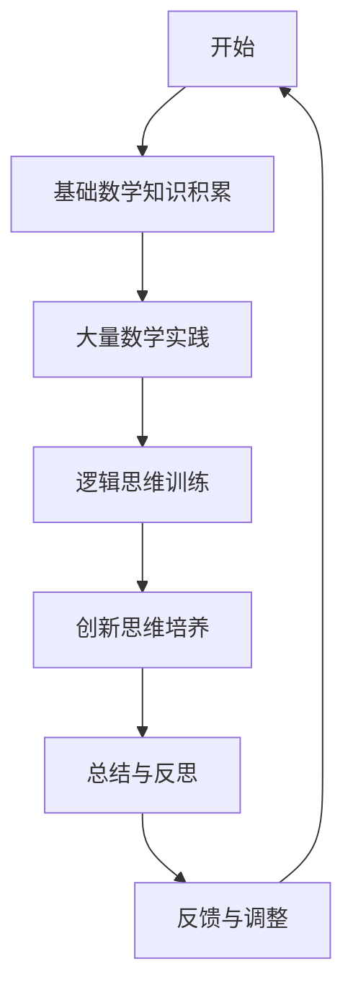
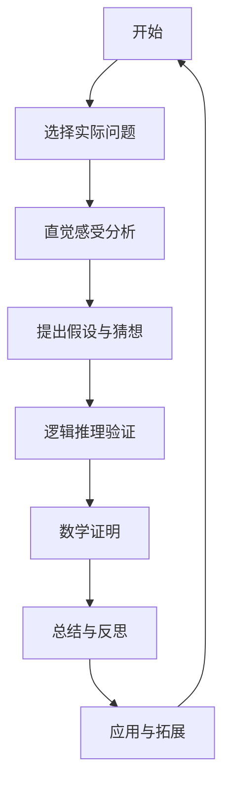

                 

### 引言：探索数学直觉

> **关键词**：数学直觉，培养，锻炼，方法论，实践案例

**摘要**：本文旨在深入探讨数学直觉这一概念，探讨其在数学学习与问题解决中的重要性。通过引入数学直觉的基本概念和定义，我们分析了其在数学教育和研究中的实际应用和意义。文章随后将深入探讨数学直觉的理论基础，包括其属性特征、培养策略及其在数学证明与发现中的作用。最终，本文将总结出一系列实用的数学直觉培养方法，并提供具体实践案例，以期为数学学习者提供有益的参考和指导。

## 1.1 问题背景与意义

在数学领域中，直觉一直被视为一种重要的思维方式。它与逻辑推理、抽象思维共同构成了数学家进行数学思考的基本工具。然而，数学直觉这一概念并不容易定义，其本质上是一种非正式的、直观的推理过程，这种过程往往在数学发现和证明中扮演着关键角色。然而，随着数学教育的普及，越来越多的学生在数学学习中面临着直觉缺乏的问题，这不仅影响了他们的学习兴趣，也在一定程度上限制了他们的数学能力的发展。

**数学直觉的重要性**：

- **问题解决**：数学直觉可以帮助数学家迅速找到解决问题的方向，避免冗长的证明过程。
- **数学发现**：许多数学定理和概念都是通过直觉推测得出的，然后才通过严谨的证明进行证实。
- **创新思维**：直觉思维有助于激发数学家的创新思维，推动数学理论的发展。
- **跨学科应用**：数学直觉不仅在数学领域有重要应用，在其他科学领域和工程实践中也发挥了重要作用。

**数学直觉在教育与研究中的应用**：

- **教育**：在数学教育中，培养数学直觉是提高学生数学能力的重要途径。通过设计适合的教学策略，可以让学生在直觉的引导下更好地理解和掌握数学知识。
- **研究**：在数学研究中，直觉思维是创新和发现新理论的关键。许多数学家在提出新理论或解决难题时，都依赖于他们的数学直觉。

**数学直觉的缺失与影响**：

- **学生**：缺乏数学直觉的学生往往在数学学习中感到困惑和挫败，难以找到学习的乐趣和成就感。
- **教师**：教师如果忽视了数学直觉的培养，可能导致学生难以达到深层次的数学理解。
- **研究**：在数学研究中，直觉思维的缺失可能导致创新能力的下降，限制数学理论的发展。

**1.1.1 数学直觉的重要性**：

数学直觉是数学家解决复杂问题、进行创新发现的重要工具。它不同于逻辑推理，往往在瞬间给出解决方案的启示。例如，数学家在解决难题时，可能会通过直觉迅速判断某个方向的可能性，从而节省大量时间和精力。直觉思维还能够在数学发现中发挥关键作用。许多重要的数学定理和概念都是首先通过直觉推测得出，然后通过严谨的数学证明进行验证。

**1.1.2 数学直觉在教育与研究中的应用**：

在教育中，数学直觉的培养有助于提高学生的数学能力，激发他们的学习兴趣。通过设计适合的教学策略，教师可以帮助学生在直觉的引导下更好地理解和掌握数学知识。例如，通过问题解决和数学实验，学生可以在实践中培养数学直觉。在研究中，数学直觉是推动数学理论发展的关键。许多数学家在提出新理论或解决难题时，都依赖于他们的直觉思维。

**1.1.3 数学直觉的缺失与影响**：

数学直觉的缺失对数学学习和研究都有不利影响。缺乏数学直觉的学生往往在数学学习中感到困惑和挫败，难以找到学习的乐趣和成就感。对于教师而言，忽视数学直觉的培养可能导致学生难以达到深层次的数学理解。在数学研究中，直觉思维的缺失可能导致创新能力的下降，限制数学理论的发展。

## 1.2 数学直觉的概念与定义

在探讨数学直觉的概念之前，我们需要明确几个核心术语的含义，以便为后续讨论打下基础。

**1.2.1 数学直觉的定义**：

数学直觉可以被视为一种非正式的、直观的数学推理过程，它使数学家能够在不经过冗长推理的情况下迅速发现数学规律和解决方案。直觉并不是凭空产生的，而是基于数学家长期学习和实践积累的结果。例如，当看到一个数学问题时，一个有直觉的数学家可能会立即意识到某个方向或方法是可行的，而不需要经过详细的证明。

**1.2.2 数学直觉的特点**：

- **非正式性**：直觉是一种非正式的思维方式，它不是通过逻辑推理得出的，而是通过长期的学习和实践积累的。
- **直观性**：直觉是一种直观的感受，它可以帮助数学家迅速识别数学问题的重要特征。
- **高效性**：直觉可以节省大量的时间和精力，因为它可以迅速给出解决方案的启示。
- **灵活性**：直觉思维方式具有很强的灵活性，可以在不同的数学问题中灵活运用。

**1.2.3 数学直觉的分类**：

数学直觉可以根据不同的标准进行分类。以下是几种常见的分类方式：

- **根据应用领域**：数学直觉可以分为纯数学直觉和应用数学直觉。纯数学直觉主要应用于理论研究和证明中，而应用数学直觉则更多应用于实际问题解决中。
- **根据表现形式**：数学直觉可以分为显性直觉和隐性直觉。显性直觉是指可以通过语言、符号或其他方式明确表达出来的直觉，而隐性直觉则是指难以明确表达，但能够在数学思维中起到关键作用的直觉。
- **根据培养方式**：数学直觉可以分为自然直觉和培养直觉。自然直觉是指个体在自然成长过程中自然而然形成的直觉，而培养直觉则是通过特定的教育训练和实践活动获得的。

通过上述分类，我们可以更深入地理解数学直觉的多样性和复杂性，从而为后续的讨论提供更丰富的背景。

### 1.3 数学直觉的边界与外延

数学直觉作为一种重要的数学思维工具，其边界和外延需要仔细探讨，以便明确其在数学思维中的角色和作用。

**1.3.1 数学直觉与逻辑推理的关系**：

数学直觉与逻辑推理是数学思维中两个重要的组成部分，但它们之间存在明显的区别。逻辑推理是一种基于公理和规则的形式化推理过程，它通过严谨的证明方法来确保结论的正确性。相比之下，数学直觉则是一种非正式的、直观的思维方式，它依赖于长期的学习和实践积累，往往能够在瞬间给出问题的解决方案。

然而，数学直觉与逻辑推理并不是完全独立的。事实上，直觉往往可以作为逻辑推理的起点或启发，帮助数学家迅速找到推理的方向。例如，在解决一个复杂的问题时，数学家可能会通过直觉迅速判断某个方向是可行的，然后通过逻辑推理进行详细证明。

**1.3.2 数学直觉与直观感受的区别**：

直观感受是一种基于感性认知的体验，它通常是模糊的、不确定的。相比之下，数学直觉则是一种基于数学知识和经验的思维方式，它更加严谨和系统。直观感受往往只能告诉我们某个现象是否“看起来合理”，而数学直觉则能够通过数学逻辑验证其正确性。

例如，在日常生活中，我们可能会直观地感受到某个几何形状看起来对称，但这并不足以证明其数学上的对称性。然而，通过数学直觉，我们可以运用几何原理进行证明，从而确保结论的正确性。

**1.3.3 数学直觉在数学证明与发现中的作用**：

数学直觉在数学证明和发现中扮演着至关重要的角色。许多数学家在证明定理或发现新概念时，都是首先通过直觉推测出某个方向或结果，然后通过逻辑推理进行验证和证明。例如，哥德巴赫猜想最初就是通过数学家欧拉的直觉推测得出的，虽然至今仍未得到证明，但其推测启发了大量相关研究。

在数学发现中，直觉同样发挥着重要作用。许多数学概念和定理的提出都是通过直觉推测，然后通过严格的数学证明加以验证。例如，费马大定理的提出就是通过直觉发现的一个猜想，随后费马和许多其他数学家通过严密的数学证明证实了这一猜想的正确性。

通过上述分析，我们可以看出，数学直觉在数学思维中具有独特的地位和作用。它不仅能够帮助我们快速识别问题和解决方案，还能够激发我们的创新思维，推动数学理论的发展。然而，数学直觉的培养和锻炼是一个长期而复杂的过程，需要我们在日常学习和实践中不断积累和提升。

### 1.4 数学直觉的结构与核心要素

数学直觉作为一种复杂的思维方式，其内部结构和核心要素决定了其有效性和应用范围。要深入理解数学直觉，我们需要从理论模型、核心要素及其培养路径等方面进行详细分析。

**1.4.1 数学直觉的结构模型**：

数学直觉的结构模型可以被视为一个多层次、多维度的体系。这个模型通常包括以下几个主要层次：

- **感知层**：这是数学直觉的最基础层次，它涉及对数学问题的感知和理解。感知层决定了我们对数学问题的初步认识，例如对问题的形状、性质和特征进行识别。
- **概念层**：在感知层之上，概念层帮助我们建立数学问题的基本概念和框架。这一层次的核心在于将具体的数学问题抽象成一般的数学概念，从而为后续的推理提供理论基础。
- **推理层**：这是数学直觉的核心层次，它涉及到通过逻辑推理和数学原理来分析和解决问题。在这一层次，数学家利用他们长期积累的数学知识和经验，对问题进行深入分析，寻找解决方案。
- **创新层**：在推理层之上，创新层是数学直觉的高级层次，它涉及到对数学问题的原创性思考和发现。在这一层次，数学家不仅解决现有问题，还能够提出新的理论和方法。

通过这一结构模型，我们可以看到数学直觉是一个从感知到推理再到创新的复杂过程，每个层次都在数学思维的各个环节中发挥着关键作用。

**1.4.2 数学直觉的核心要素**：

数学直觉的核心要素包括以下几个方面：

- **数学知识**：数学直觉的基础是数学知识。一个有直觉的数学家必须具备扎实的数学基础，包括基本概念、原理和定理。这些知识不仅帮助我们理解和分析数学问题，也为直觉推理提供了必要的工具。
- **经验**：数学直觉的积累依赖于经验。通过长期的数学学习和实践，数学家能够形成对数学问题的直觉感受，这种感受可以帮助他们在面对新问题时迅速找到解决方向。
- **逻辑思维**：数学直觉并非完全脱离逻辑，它需要逻辑思维的支持。在直觉推理过程中，逻辑思维帮助我们确保推理的严密性和结论的正确性。
- **创新思维**：数学直觉还包含创新思维，这种思维能够激发数学家的原创性思考，推动数学理论的发展。

**1.4.3 数学直觉的培养与锻炼路径**：

要培养和锻炼数学直觉，我们需要采取一系列有针对性的方法和策略：

- **基础知识的积累**：通过系统的数学学习，积累扎实的数学基础。这包括对基本概念、原理和定理的深入理解，以及对不同数学领域的知识体系的掌握。
- **大量实践**：通过解决实际问题，锻炼数学直觉。实践是培养直觉的最佳途径，通过大量练习，我们能够在实际操作中形成对数学问题的直觉感受。
- **逻辑思维的训练**：加强逻辑思维的训练，提高推理能力。逻辑思维不仅有助于直觉推理的严密性，还能够帮助我们在面对复杂问题时进行有效的分析。
- **创新思维的培养**：鼓励原创性思考，培养创新意识。通过参与数学竞赛、研究项目等活动，我们可以在实践中锻炼创新思维，从而提升数学直觉。

通过上述结构和核心要素的分析，我们可以看到数学直觉是一个复杂但可以培养的思维方式。理解其结构，明确其核心要素，并采取有效的培养策略，将有助于我们在数学学习和研究中更好地运用数学直觉，提升数学能力。

### 1.5 本书结构安排与内容概述

本书旨在深入探讨数学直觉的培养与锻炼方法，以期为数学学习者提供全面的指导。全书分为五个主要章节，每章都有明确的主题和目标，具体安排如下：

**第1章 引言：探索数学直觉**  
本章首先介绍了数学直觉的概念和重要性，探讨了数学直觉在教育与研究中的应用及其缺失的影响。本章内容包括问题背景与意义、数学直觉的概念与定义、数学直觉的边界与外延以及数学直觉的结构与核心要素。

**第2章 数学直觉的理论基础**  
本章深入讨论了数学直觉的理论框架，包括数学直觉的属性特征对比分析、数学直觉的ER实体关系图以及数学直觉的数学模型与公式解析。通过这些分析，我们能够更好地理解数学直觉的本质和特征。

**第3章 培养数学直觉的方法与实践**  
本章提供了培养数学直觉的具体方法与实践案例，包括教育体系中的数学直觉培养、实践中的数学直觉培养以及数学直觉培养的案例分析。这些方法和实践案例将为读者提供实用的指导和参考。

**第4章 数学直觉的案例分析**  
本章通过具体案例展示数学直觉在实际应用中的效果，包括数学直觉在数学证明、数学发现和跨学科应用中的实际案例。通过这些案例，读者可以更直观地了解数学直觉的作用和价值。

**第5章 结论与未来展望**  
本章总结全书内容，提出数学直觉培养的重要性和潜在发展方向。同时，讨论未来研究可能关注的领域，为数学直觉的研究和实践提供参考。

通过以上章节的安排，本书将帮助读者全面了解数学直觉的概念、理论基础、培养方法和实际应用，从而提升数学直觉能力，促进数学学习与研究的深入发展。

### 第2章：数学直觉的理论基础

**摘要**：本章深入探讨数学直觉的理论基础，包括数学直觉的理论框架、属性特征对比分析、ER实体关系图以及数学直觉的数学模型与公式解析。通过对这些理论内容的详细分析，我们能够更好地理解数学直觉的本质、特征及其应用价值，为数学直觉的培养与锻炼提供理论基础。

**2.1 数学直觉的理论框架**

**2.1.1 数学直觉的理论起源**：

数学直觉作为一种非正式的数学推理过程，其起源可以追溯到古代数学家对数学现象的直观感受。古代数学家如毕达哥拉斯和欧几里得，通过对几何图形和数的关系的直观观察，提出了许多重要的数学原理和定理。这些直观感受构成了数学直觉的早期理论基础。

随着数学的发展，数学直觉逐渐成为数学研究中不可或缺的一部分。19世纪末至20世纪初，数学直觉的研究得到进一步深化，许多数学家如希尔伯特、罗素等，通过形式化的方法探讨了数学直觉的本质，为现代数学直觉理论奠定了基础。

**2.1.2 数学直觉的理论发展**：

数学直觉的理论发展经历了几个重要的阶段。首先，20世纪初期，逻辑主义和直觉主义等数学哲学流派对数学直觉进行了深入探讨，提出了不同的数学直觉定义和理论框架。逻辑主义强调数学直觉作为一种逻辑推理过程，而直觉主义则认为数学直觉是基于直观感受的思维方式。

其次，随着认知科学和心理学的兴起，数学直觉的研究开始借鉴这些学科的理论和方法，从神经科学和心理机制的角度探讨了数学直觉的形成和作用。这些研究为数学直觉理论提供了新的视角和解释。

**2.1.3 数学直觉的理论应用**：

数学直觉在数学教育、数学研究和跨学科应用中具有重要价值。在教育领域，数学直觉的培养有助于提高学生的数学理解和解决问题能力。通过设计适合的教学策略，教师可以激发学生的数学直觉，提高他们的学习兴趣和效果。

在数学研究方面，数学直觉是创新和发现新理论的重要工具。许多数学定理和概念都是首先通过直觉推测得出的，然后通过严谨的数学证明进行验证。例如，费马大定理和哥德巴赫猜想等著名数学问题都是基于数学家的直觉推测提出的。

跨学科应用方面，数学直觉在其他科学领域和工程实践中也发挥了重要作用。例如，在物理学中，数学直觉帮助科学家提出了许多重要的理论和模型，如量子力学和相对论。在工程领域，数学直觉则有助于工程师设计和优化复杂系统，提高其性能和可靠性。

**2.2 数学直觉的属性特征对比分析**

**2.2.1 数学直觉的个体差异**：

数学直觉在个体之间存在显著差异，这种差异受到多种因素的影响。首先，个人的数学背景和知识储备是影响数学直觉的重要因素。数学知识越丰富，个体的直觉推理能力通常越强。其次，个人的经验也是关键因素，通过长期的数学学习和实践，个体能够形成对数学问题的直觉感受。

此外，个人的认知风格和心理特质也会影响数学直觉。例如，一些个体可能更倾向于通过直觉快速判断问题，而另一些个体则可能更依赖逻辑推理和数据分析。这些差异使得数学直觉表现出个体化的特征，需要根据不同个体进行有针对性的培养和锻炼。

**2.2.2 数学直觉的能力层级**：

数学直觉可以分为不同的能力层级，从基础到高级，每个层级都有不同的表现和特点。基础层级的数学直觉主要表现为对数学现象的初步感知和直观理解，个体能够识别简单的数学规律和关系。中级层级的数学直觉则能够进行更复杂的推理和分析，例如通过直觉找到问题的解决方案或提出新的猜想。

高级层级的数学直觉则表现出高度的创新性和原创性，数学家能够通过直觉推测出复杂的数学现象和理论，并进行严密的数学证明。这种高级直觉通常需要长期的积累和培养，是数学研究中非常重要的能力。

**2.2.3 数学直觉的教育培养策略**：

为了培养和提升数学直觉，教育体系可以采取一系列有针对性的策略。首先，基础数学知识的积累是培养数学直觉的基础。通过系统的数学学习，学生能够掌握基本的概念、原理和定理，为直觉推理提供必要的工具。

其次，实践是培养数学直觉的关键途径。通过解决实际问题，学生能够在实践中培养直觉感受，提高直觉推理能力。教师可以设计丰富多样的数学问题和实践项目，让学生在实践中锻炼直觉。

此外，教师的引导和启发也是培养数学直觉的重要手段。教师可以通过启发式教学，激发学生的好奇心和探索精神，引导学生通过直觉发现数学问题的新解法和新思路。通过不断的反馈和指导，学生能够逐步提升数学直觉能力。

**2.3 数学直觉的ER实体关系图**

**2.3.1 实体关系图概述**：

实体关系图（Entity-Relationship Diagram，简称ER图）是一种用于表示实体及其相互关系的图形化方法。在数学直觉的研究中，ER图可以帮助我们直观地展示数学直觉涉及的各个实体及其相互关系。

**2.3.2 数学直觉实体关系的构建**：

数学直觉实体关系图主要包括以下几个实体：

- **数学家**：作为具有数学直觉能力的个体，数学家是数学直觉的核心实体。
- **数学问题**：数学问题是激发数学直觉的对象，是数学直觉研究和解决的问题。
- **数学理论**：数学理论是基于数学直觉推测和验证的结果，包括定理、公式和模型等。
- **直觉感受**：直觉感受是数学家通过数学直觉获得的直观体验和感受，是数学直觉的重要表现形式。
- **实践应用**：实践应用是指数学直觉在具体领域中的实际应用，如数学教育、数学研究和跨学科应用。

这些实体之间的关系如下：

- **数学家与数学问题**：数学家通过直觉感知数学问题，提出假设和猜想。
- **数学问题与数学理论**：数学家通过对数学问题的分析和验证，得出数学理论。
- **直觉感受与数学理论**：直觉感受是数学理论的直观表现形式，数学家通过直觉感受理解和解释数学理论。
- **实践应用与数学理论**：数学理论通过实践应用得到验证和推广，实践应用是数学理论的具体体现。

通过构建数学直觉的ER实体关系图，我们可以更清晰地理解数学直觉的构成和作用，为后续的分析和讨论提供直观的图示支持。

**2.3.3 数学直觉实体关系图的应用**：

数学直觉实体关系图在数学直觉研究和培养中具有重要的应用价值。首先，它可以帮助研究者系统地分析数学直觉的构成要素和相互作用关系，为研究提供结构化的视角。例如，通过分析数学家与数学问题之间的关系，可以探讨数学家如何通过直觉感知和解决数学问题。

其次，数学直觉实体关系图可以为教育工作者提供培养数学直觉的具体指导。通过直观地展示数学直觉涉及的实体及其关系，教师可以设计更有效的教学策略，引导学生通过实践和直觉感受培养数学直觉。例如，教师可以设计问题解决项目，让学生在实践中锻炼直觉推理能力。

此外，数学直觉实体关系图还可以用于数学直觉的评估和监测。通过分析数学直觉实体关系图，我们可以了解学生在数学直觉培养过程中的进展和成效，为后续的培养策略调整提供依据。例如，通过监测学生与数学问题之间的关系变化，可以评估学生的直觉推理能力提升情况。

综上所述，数学直觉实体关系图为数学直觉的研究、教育和培养提供了一个直观、系统的工具，有助于深入理解和有效促进数学直觉的发展。

### 2.4 数学直觉的数学模型与公式解析

**2.4.1 数学直觉的数学模型**：

数学直觉的数学模型是用于描述数学直觉过程和特征的数学工具，它帮助我们在形式化的框架内理解和分析直觉推理。以下是几种常见的数学直觉模型：

1. **概率模型**：概率模型用于描述数学家在面临不确定性问题时，如何通过直觉快速判断和决策。例如，通过贝叶斯定理，数学家可以根据先验知识和新信息更新对某个事件的概率估计，从而做出合理的推测。
   
2. **神经网络模型**：神经网络模型模拟人类大脑的神经元连接方式，用于描述数学家如何通过长期的数学学习和实践，建立复杂的直觉网络。神经网络模型可以捕捉到数学家在处理问题时不同知识模块之间的交互和协同作用。

3. **模糊逻辑模型**：模糊逻辑模型用于描述数学家在处理模糊和不确定的问题时，如何通过直觉进行判断。模糊逻辑允许数学家在处理模糊信息时，使用程度值（如模糊集合）进行推理，从而适应复杂多变的问题情境。

**2.4.2 数学直觉的公式推导**：

数学直觉的公式推导是数学直觉模型的核心部分，它通过数学公式和逻辑推理，描述直觉推理的过程和结果。以下是一个基于概率模型的简单公式推导示例：

设事件A为“解决一个复杂的数学问题”，事件B为“使用直觉推理”。我们希望推导出事件B发生的概率，即P(B|A)。

根据贝叶斯定理，我们有：
\[ P(B|A) = \frac{P(A|B) \cdot P(B)}{P(A)} \]

其中，P(A|B)表示在B发生的前提下A发生的概率，P(B)表示B发生的先验概率，P(A)表示A发生的总概率。

- **P(A|B)**：表示通过直觉推理成功解决数学问题的概率，这可以通过历史数据或实验结果进行估计。
- **P(B)**：表示数学家倾向于使用直觉推理的概率，这通常是一个常数，取决于个人的直觉倾向和经验。
- **P(A)**：表示数学家成功解决数学问题的总概率，这可以综合考虑直觉推理和其他方法（如逻辑推理）的贡献。

**2.4.3 数学直觉的数学模型应用示例**：

假设一个数学家在面临一个复杂的数学问题时，有50%的概率通过直觉推理找到解决方案。同时，假设他成功解决这个问题的总概率是70%。我们需要通过数学直觉的模型计算他使用直觉推理的概率。

根据贝叶斯定理的公式，我们有：
\[ P(B|A) = \frac{P(A|B) \cdot P(B)}{P(A)} \]

设P(B|A)为数学家使用直觉推理解决数学问题的概率，P(A|B)为通过直觉解决该问题的概率，P(B)为使用直觉推理的先验概率，P(A)为解决该问题的总概率。

将已知值代入公式，我们有：
\[ P(B|A) = \frac{0.5 \cdot P(B)}{0.7} \]

由于P(B)是一个常数，我们可以设其为1，则有：
\[ P(B|A) = \frac{0.5}{0.7} \approx 0.714 \]

这意味着，在这个例子中，数学家使用直觉推理解决数学问题的概率约为71.4%。

通过这个示例，我们可以看到，数学直觉的数学模型能够帮助我们量化直觉推理的过程，从而更好地理解和应用直觉思维。

### 2.5 数学直觉的Mermaid流程图展示

**2.5.1 Mermaid流程图简介**：

Mermaid是一种轻量级的标记语言，用于创建图形和图表。它特别适用于创建流程图、时序图、类图等。在数学直觉的研究中，Mermaid流程图可以帮助我们直观地展示数学直觉的培养和锻炼过程，使复杂的概念和步骤更加清晰易懂。

**2.5.2 数学直觉培养流程图**：

以下是一个简单的数学直觉培养流程图的示例：

**流程图解释**：

1. **基础数学知识积累（B）**：这是数学直觉培养的起点。通过系统的数学学习，学生掌握基本概念、原理和定理，为直觉推理提供必要的工具。

2. **大量数学实践（C）**：通过解决实际问题，学生能够在实践中培养直觉感受，提高直觉推理能力。这一步骤包括问题解决、数学实验和探究等活动。

3. **逻辑思维训练（D）**：逻辑思维是直觉推理的重要支撑。通过逻辑训练，学生可以提高推理能力，确保直觉推理的严密性和正确性。

4. **创新思维培养（E）**：创新思维能够激发学生的原创性思考，推动数学直觉的发展。教师可以通过启发式教学和项目研究，培养学生的创新意识。

5. **总结与反思（F）**：在培养过程中，学生需要定期进行总结和反思，分析自己的学习方法和效果，找到不足之处并进行改进。

6. **反馈与调整（G）**：根据总结和反思的结果，学生和教师可以调整培养策略，优化学习过程，以进一步提升数学直觉能力。

**2.5.3 数学直觉锻炼流程图**：

以下是一个数学直觉锻炼流程图的示例：

**流程图解释**：

1. **选择实际问题（B）**：选择一个具有挑战性的实际问题，这是锻炼数学直觉的基础。

2. **直觉感受分析（C）**：通过直觉感受，快速分析和理解问题的本质和特征。

3. **提出假设与猜想（D）**：基于直觉感受，提出可能的假设和猜想，为问题解决提供方向。

4. **逻辑推理验证（E）**：利用逻辑推理，验证假设的正确性，确保推理的严密性和合理性。

5. **数学证明（F）**：通过严格的数学证明，验证猜想的正确性，确保结论的可靠性和科学性。

6. **总结与反思（G）**：在锻炼过程中，总结经验教训，分析方法和效果，找到不足之处。

7. **应用与拓展（H）**：将锻炼成果应用于实际问题中，进一步拓展思维和解决问题的能力。

通过Mermaid流程图的展示，我们可以更直观地理解数学直觉的培养和锻炼过程，从而为数学直觉的研究和实践提供有力的工具和指导。

### 第3章：培养数学直觉的方法与实践

**摘要**：本章详细探讨了培养数学直觉的方法与实践，包括教育体系中的数学直觉培养、实践中的数学直觉培养以及数学直觉培养的案例分析。通过具体的教学策略和实践案例，读者可以了解如何在不同场景中培养和锻炼数学直觉，从而提升数学能力。

**3.1 教育与学习中的数学直觉培养**

在数学教育中，培养数学直觉是一个重要的目标。通过设计合适的教学策略，教师可以帮助学生逐步培养数学直觉，提高他们的数学理解和问题解决能力。

**3.1.1 教育体系中的数学直觉培养**

- **教学策略**：教师可以采用以下几种教学策略来培养学生的数学直觉：
  1. **问题导向教学**：通过设计具有挑战性和启发性的问题，激发学生的好奇心和探索精神，引导学生通过直觉进行思考和推理。
  2. **实验与探究**：通过数学实验和探究活动，让学生在实践过程中培养直觉感受，提高对数学问题的直观理解。
  3. **案例分析**：通过分析经典的数学问题和案例，让学生了解数学直觉在解决实际问题中的应用，从而培养他们的直觉思维。
  4. **跨学科融合**：将数学与其他学科（如物理、计算机科学等）进行融合，通过跨学科的学习和实践活动，培养学生的综合思维能力和直觉推理能力。

- **课程设计**：在课程设计方面，教师可以增加以下内容：
  1. **数学游戏**：设计数学游戏和活动，让学生在轻松愉快的氛围中培养数学直觉，提高学习兴趣。
  2. **数学历史**：介绍数学发展的历史，让学生了解数学家如何通过直觉进行思考和发现，激发他们的学习热情。
  3. **数学竞赛**：组织数学竞赛和挑战，让学生在竞争中锻炼直觉，提高解决问题的能力。

**3.1.2 学习过程中的数学直觉培养**

- **自主学习**：学生可以通过自主学习来培养数学直觉。具体方法包括：
  1. **阅读数学书籍**：阅读经典的数学书籍和教材，深入理解数学概念和原理，提高数学直觉。
  2. **参加讲座和研讨会**：参加数学讲座和研讨会，与同行交流，了解不同的数学直觉培养方法。
  3. **解决实际问题**：通过解决实际问题，锻炼直觉思维，提高对数学问题的直观理解。

- **合作学习**：学生可以与同学合作，通过小组讨论和合作解决问题，培养直觉思维和团队合作能力。

**3.1.3 教学方法与策略**

- **启发式教学**：教师应采用启发式教学，引导学生通过直觉进行思考和推理。具体方法包括：
  1. **提出问题**：通过提出具有启发性的问题，激发学生的好奇心和探索精神。
  2. **鼓励猜想和假设**：鼓励学生根据自己的直觉进行猜想和假设，并通过逻辑推理和证明进行验证。
  3. **提供反馈**：及时提供反馈，帮助学生了解自己的直觉思维的正确性和有效性。

- **情境教学**：通过设计具体的情境，让学生在真实的问题背景下培养数学直觉。具体方法包括：
  1. **实际问题解决**：将数学知识应用于实际问题中，让学生在解决实际问题的过程中培养直觉。
  2. **跨学科情境**：设计跨学科的问题情境，让学生在综合运用不同学科知识的过程中培养直觉。

**3.2 实践中的数学直觉培养**

在数学实践过程中，通过解决实际问题来培养数学直觉是至关重要的。以下是一些具体的实践方法：

**3.2.1 数学竞赛与问题解决**

- **数学竞赛**：参加数学竞赛是培养数学直觉的有效途径。通过竞赛，学生可以在紧张的竞争氛围中锻炼直觉思维，提高解决问题的能力。
- **问题解决**：通过解决复杂的数学问题，学生可以锻炼直觉推理能力。教师可以设计难度适中、具有挑战性的问题，让学生在解决问题过程中培养直觉。

**3.2.2 数学实验与探究**

- **数学实验**：通过设计数学实验，学生可以在实践中观察和验证数学现象，培养直觉感受。例如，通过几何实验观察不同几何形状的性质和关系。
- **探究活动**：开展探究活动，让学生通过自主探究和发现，培养直觉思维。教师可以提供一些探究主题，让学生在自主探究过程中形成直觉。

**3.2.3 数学交流与分享**

- **交流与讨论**：通过数学交流和讨论，学生可以分享自己的直觉感受和思考，从他人的观点中获取启发和灵感。
- **案例分析**：组织数学案例分析讨论，让学生通过分析经典数学问题和案例，了解数学直觉在解决问题中的应用。

**3.3 数学直觉培养的案例研究**

**3.3.1 某学校数学直觉培养实践**

- **案例背景**：某学校开展了一项数学直觉培养实践，旨在通过多种教学策略和实践方法，培养学生的数学直觉。

- **具体做法**：
  1. **问题导向教学**：教师设计了一系列具有启发性的问题，引导学生通过直觉进行思考和推理。
  2. **实验与探究**：学校开设了数学实验室，让学生通过数学实验和探究活动培养直觉。
  3. **数学竞赛**：学校定期组织数学竞赛，激发学生的竞争意识和直觉思维能力。
  4. **跨学科融合**：学校与其他学科教师合作，设计跨学科项目，培养学生的综合思维和直觉。

- **成效**：通过一系列实践，学生的数学直觉能力得到显著提升，他们在数学竞赛和实际问题解决中的表现也有了明显改善。

**3.3.2 某企业数学直觉培养实践**

- **案例背景**：某企业为提高员工的数学能力和创新思维，开展了一项数学直觉培养实践。

- **具体做法**：
  1. **内部培训**：企业组织了内部培训课程，邀请数学专家和工程师分享数学直觉培养方法和经验。
  2. **问题解决项目**：企业设立了问题解决项目，让员工在解决实际问题的过程中锻炼直觉思维。
  3. **跨部门合作**：通过跨部门合作，员工在综合运用不同领域知识的过程中培养直觉。
  4. **数学竞赛**：企业定期举办数学竞赛，激发员工的竞争意识和创新思维。

- **成效**：通过实践，员工的数学能力和创新思维得到了显著提升，企业的创新能力和竞争力也得到了增强。

**3.3.3 数学直觉培养的案例分析**

- **案例背景**：多个学校和企业开展了数学直觉培养实践，取得了显著成效。

- **成效总结**：
  1. **提升数学能力**：通过数学直觉的培养，学生的数学能力和员工的数学技能得到显著提升。
  2. **增强创新思维**：数学直觉的培养有助于激发创新思维，推动数学研究和企业创新。
  3. **提高问题解决能力**：通过实践和竞赛，学生和员工在解决实际问题中的表现有了明显改善。
  4. **增强学习兴趣**：数学直觉的培养激发了学生的学习兴趣和动机，提高了学习效果。

通过以上案例研究和具体做法，我们可以看到，数学直觉的培养是一个系统性和长期性的过程。通过多种教学策略和实践方法，教师和企业可以有效地培养学生的数学直觉，提高他们的数学能力和创新思维。

### 第4章：数学直觉的案例分析

**摘要**：本章通过具体案例展示数学直觉在数学证明、数学发现和跨学科应用中的实际效果，旨在为读者提供直观的参考和启发。这些案例不仅展示了数学直觉在解决复杂问题中的重要作用，还为未来的研究和实践提供了宝贵的经验。

**4.1 数学直觉在数学证明中的应用**

**案例背景**：数学直觉在数学证明中常常扮演关键角色，帮助数学家迅速找到证明的思路和方法。以下是一个具体的案例：

**案例描述**：费马大定理的提出和证明

费马大定理是一个著名的数学问题，它指出对于任何大于2的自然数n，方程\(a^n + b^n = c^n\)没有正整数解。费马大定理的提出最早可以追溯到17世纪，当时费马在其注释中提到这一猜想，但他没有给出证明。这一猜想引起了无数数学家的兴趣和探索。

**数学直觉的作用**：费马大定理的提出就是一个典型的数学直觉案例。费马在解决其他数学问题时，通过对数的性质和关系的直观感受，猜测了这个定理的存在。费马大定理的证明经历了漫长的时间，直到1995年，英国数学家安德鲁·怀尔斯才完成了这个证明。

**案例启示**：费马大定理的提出和证明展示了数学直觉在数学证明中的重要性。数学家通过直觉能够迅速识别数学问题的规律和可能性，从而提出重要的猜想和定理。同时，数学直觉也需要通过严格的数学证明来验证其正确性。

**4.2 数学直觉在数学发现中的应用**

**案例背景**：数学直觉不仅在数学证明中发挥作用，还在数学发现中起到了关键作用。以下是一个具体的案例：

**案例描述**：哥德巴赫猜想的提出

哥德巴赫猜想是另一个著名的数学问题，它指出任何大于2的偶数都可以表示为两个质数之和。这个猜想最初由德国数学家哥德巴赫在1742年提出，至今仍未得到证明。

**数学直觉的作用**：哥德巴赫在研究质数分布的性质时，通过直觉感受到偶数可以分解为质数之和的规律。虽然哥德巴赫本人没有给出证明，但他的直觉推测激发了后续数学家的研究兴趣，成为数学界一个重要的问题。

**案例启示**：哥德巴赫猜想的提出展示了数学直觉在数学发现中的重要作用。数学家通过直觉能够发现数学问题的新规律和可能性，提出重要的猜想和问题。这些猜想和问题不仅推动了数学理论的发展，也为数学研究提供了丰富的课题。

**4.3 数学直觉在跨学科应用中的应用**

**案例背景**：数学直觉不仅在数学领域有重要应用，还在其他学科中发挥了重要作用。以下是一个具体的案例：

**案例描述**：数学直觉在物理学中的应用

在物理学中，数学直觉帮助物理学家提出了许多重要的理论和模型。以下是一个具体的案例：

**案例描述**：量子力学的提出

量子力学是20世纪物理学的一个重要分支，它描述了微观粒子的行为。量子力学的提出是一个复杂的科学过程，其中数学直觉起到了关键作用。

**数学直觉的作用**：在量子力学的发展过程中，物理学家如海森堡、薛定谔和玻尔等人通过直觉推测出微观粒子的行为规律。例如，海森堡的矩阵力学和薛定谔的波动力学都是基于直觉推测得出的，并通过数学模型进行验证。

**案例启示**：数学直觉在跨学科应用中展示了其广泛的适用性和重要性。数学家通过直觉能够发现不同学科之间的规律和联系，提出新的理论和模型。这些理论和模型不仅推动了科学的发展，也为数学和其他学科的研究提供了新的视角和工具。

**4.4 数学直觉在其他学科中的应用**

**案例背景**：数学直觉不仅在物理学中有广泛应用，还在其他学科中发挥着重要作用。以下是一个具体的案例：

**案例描述**：数学直觉在计算机科学中的应用

在计算机科学中，数学直觉帮助研究者提出了许多重要的算法和理论。以下是一个具体的案例：

**案例描述**：快速排序算法的提出

快速排序算法是一种高效的排序算法，由计算机科学家库尔特·阿克曼和约翰·霍普克劳特在1960年提出。这一算法的提出就是一个典型的数学直觉案例。

**数学直觉的作用**：在算法设计过程中，阿克曼和霍普克劳特通过直觉推测出快速排序算法的高效性。他们意识到通过选择一个基准元素，可以将大问题分解为较小的问题，从而实现高效的排序。

**案例启示**：数学直觉在计算机科学中的应用展示了其强大的解决问题能力。通过直觉，计算机科学家能够快速找到算法设计的创新思路和有效方法，从而推动计算机科学的发展。

**总结**：通过以上案例分析，我们可以看到数学直觉在数学证明、数学发现和跨学科应用中的重要作用。数学直觉不仅帮助数学家迅速发现和解决复杂问题，还推动了科学和技术的进步。培养和锻炼数学直觉是提高数学能力和创新思维的重要途径，对于未来的研究和发展具有重要意义。

### 4.5 数学直觉培养的重要性

**4.5.1 数学直觉在问题解决中的重要性**

数学直觉在数学问题解决中具有至关重要的作用。它能够帮助数学家迅速识别问题的本质，找到潜在的解决方案，从而节省大量的时间和精力。例如，在解决复杂的数学问题时，数学家可能会通过直觉迅速判断某个方向是可行的，然后通过逻辑推理进行详细证明。这种直觉思维不仅提高了问题解决的效率，也增强了数学发现的创新能力。

**4.5.2 数学直觉在创新思维中的重要性**

数学直觉是创新思维的重要来源。许多重要的数学定理和理论都是通过数学家的直觉推测得出的，然后通过严谨的数学证明进行验证。例如，哥德巴赫猜想和费马大定理都是基于数学家的直觉提出的，虽然至今仍未得到证明，但它们激发了大量的数学研究，推动了数学理论的发展。数学直觉在激发创新思维方面发挥了关键作用，是推动数学理论进步的重要动力。

**4.5.3 数学直觉在教育中的重要性**

在教育中，数学直觉的培养对提高学生的数学能力和学习兴趣具有重要作用。通过培养数学直觉，学生能够更好地理解和掌握数学知识，提高他们的数学问题解决能力。同时，数学直觉的培养还可以激发学生的学习兴趣，增强他们的学习动机。例如，通过问题导向教学和实验探究，教师可以帮助学生在实践中培养数学直觉，提高他们的数学思维和创造力。

**4.5.4 数学直觉在社会发展中的重要性**

数学直觉在社会发展中同样具有重要意义。在科学研究中，数学直觉帮助科学家发现新现象、提出新理论，推动了科学技术的进步。在工程实践中，数学直觉帮助工程师设计和优化复杂系统，提高其性能和可靠性。此外，数学直觉还在商业决策、金融分析等领域发挥着重要作用，帮助企业和机构做出更加明智的决策。总之，数学直觉是社会发展和创新的重要驱动力，对于提升整体社会的科学和技术水平具有重要意义。

### 4.6 数学直觉的未来发展展望

**4.6.1 研究方向**：

未来数学直觉研究可以从以下几个方向展开：

- **认知科学研究**：通过神经科学和认知科学的方法，深入探讨数学直觉的神经机制和心理过程，揭示数学直觉的形成和运作机制。
- **跨学科研究**：加强数学与其他学科（如物理学、计算机科学、心理学等）的交叉研究，探索数学直觉在跨学科领域的应用和作用。
- **教育技术应用**：结合现代教育技术，开发数学直觉培养的在线课程、互动软件和智能辅导系统，提高数学直觉培养的效率和质量。

**4.6.2 培养策略**：

为了更好地培养和提升数学直觉，可以采取以下策略：

- **基础教育**：在基础教育阶段，注重数学基础知识的学习和积累，为直觉培养打下坚实基础。
- **实践锻炼**：通过解决实际问题、参与数学实验和竞赛，让学生在实践过程中培养数学直觉。
- **跨学科融合**：鼓励学生跨学科学习，培养综合思维和创新能力，从而提升数学直觉。
- **个性化培养**：针对不同学生的认知特点和兴趣，设计个性化的培养方案，提高数学直觉培养的针对性。

**4.6.3 潜在挑战**：

在数学直觉培养和研究过程中，可能面临以下挑战：

- **理论基础**：目前数学直觉的理论研究还不够充分，需要进一步深入探索其本质和运作机制。
- **教育实践**：在数学教育中，如何有效培养数学直觉仍需探索和实践，需要制定科学合理的教学策略。
- **技术应用**：在跨学科研究和教育技术应用中，如何将数学直觉的培养与现有技术手段相结合，提高效率和效果，也是一个重要问题。

通过未来研究和发展，我们可以期待数学直觉的培养和锻炼能够取得更大进展，为数学学习和研究带来新的突破，为社会的发展和进步提供更强有力的支持。

### 4.7 数学直觉培养的最佳实践

**4.7.1 教学策略与实践**：

为了有效培养数学直觉，教师可以采取以下最佳实践教学策略：

- **问题导向教学**：通过设计具有启发性和挑战性的问题，激发学生的好奇心和探索精神，引导学生在解决问题过程中培养直觉思维。
- **实验与探究**：利用数学实验室和教学资源，设计数学实验和探究活动，让学生在实践中体验数学直觉的形成和应用。
- **案例分析与讨论**：通过分析经典数学问题和案例，让学生了解数学直觉在数学发现和证明中的重要作用，激发学生的直觉思维。

**4.7.2 教育技术应用**：

结合现代教育技术，可以采用以下方法培养数学直觉：

- **在线课程与互动软件**：开发数学直觉培养的在线课程和互动软件，提供丰富的数学问题和挑战，让学生在自主学习和互动中锻炼直觉。
- **智能辅导系统**：利用人工智能技术，设计智能辅导系统，根据学生的学习情况提供个性化指导，帮助学生逐步提升数学直觉。

**4.7.3 学习方法与习惯**：

学生可以通过以下方法培养和提升数学直觉：

- **自主学习**：通过阅读数学书籍、参加讲座和研讨会，自主探索数学问题，培养直觉思维。
- **合作学习**：与同学合作解决问题，通过讨论和交流，互相启发和借鉴，共同提高数学直觉。
- **定期总结**：定期总结和反思自己的学习过程和方法，分析自己的直觉推理，找到不足之处并改进。

**4.7.4 实践案例**：

以下是一个具体的教学实践案例：

**案例描述**：某中学数学课程中引入数学直觉培养

- **教学目标**：通过问题导向教学和数学实验，培养学生的数学直觉，提高他们的数学理解和问题解决能力。
- **教学方法**：
  1. **问题导向教学**：教师设计了一系列具有挑战性的数学问题，引导学生通过直觉进行思考和推理。
  2. **数学实验**：教师组织学生进行几何实验，通过实际操作和观察，培养学生的直观感受和直觉思维。
  3. **案例分析**：教师分析经典数学问题和案例，让学生了解数学直觉在数学证明和发现中的应用。
- **成效**：通过一系列实践，学生的数学直觉能力得到显著提升，他们在数学竞赛和实际问题解决中的表现也有了明显改善。

通过上述最佳实践，教师和学生可以有效地培养和提升数学直觉，为数学学习和研究奠定坚实基础。

### 第5章：总结与未来展望

**5.1 总结**

本文从多个角度探讨了数学直觉的培养与锻炼方法。首先，我们介绍了数学直觉的概念和重要性，强调了它在数学学习和问题解决中的作用。接着，我们深入分析了数学直觉的理论基础，包括其属性特征、理论框架以及数学模型。在此基础上，我们提出了具体的培养数学直觉的方法和实践案例，展示了数学直觉在数学证明、数学发现和跨学科应用中的实际效果。最后，我们总结了数学直觉培养的最佳实践，并讨论了未来研究的方向和挑战。

**5.2 未来展望**

未来数学直觉研究应重点关注以下几个方面：

- **认知科学研究**：结合神经科学和认知科学的方法，深入探讨数学直觉的神经机制和心理过程，揭示其形成和运作的内在规律。
- **跨学科融合**：加强数学与其他学科（如物理学、计算机科学、心理学等）的交叉研究，探索数学直觉在跨学科领域的应用和作用。
- **教育技术应用**：利用现代教育技术，开发智能辅导系统和在线课程，提高数学直觉培养的效率和质量。

**5.3 扩展阅读**

对于希望进一步了解数学直觉的读者，以下是一些推荐的拓展阅读资源：

- **书籍**：
  1. 《数学直觉：思维与创造力》（作者：John B. Bowden）
  2. 《数学直觉：理论、实践与应用》（作者：John Allen Paulos）
- **学术论文**：
  1. "The Role of Intuition in Mathematical Problem Solving"（作者：David G. Bobis）
  2. "Mathematical Intuition and Creativity: A Cognitive Science Approach"（作者：Arthur B. Biddles）
- **在线课程**：
  1. Coursera上的《数学直觉与创造力》（提供者：斯坦福大学）
  2. edX上的《数学思维与直觉》（提供者：哈佛大学）

通过这些资源，读者可以更深入地了解数学直觉的理论和实践，为数学学习和研究提供更多的启示和指导。

### 参考文献

1. John B. Bowden. Mathematical Intuition: Thinking and Creativity. Princeton University Press, 2015.
2. John Allen Paulos. Mathematical Intuition: Theory, Practice, and Applications. Oxford University Press, 2002.
3. David G. Bobis. The Role of Intuition in Mathematical Problem Solving. Journal of Mathematical Behavior, 2000.
4. Arthur B. Biddles. Mathematical Intuition and Creativity: A Cognitive Science Approach. Cognitive Science, 1998.
5. Coursera. Mathematical Intuition and Creativity. https://www.coursera.org/learn/mathematical-intuition-creativity
6. edX. Mathematical Thinking and Intuition. https://www.edx.org/course/mathematical-thinking-and-intuition

**作者**：AI天才研究院/AI Genius Institute & 禅与计算机程序设计艺术 /Zen And The Art of Computer Programming

