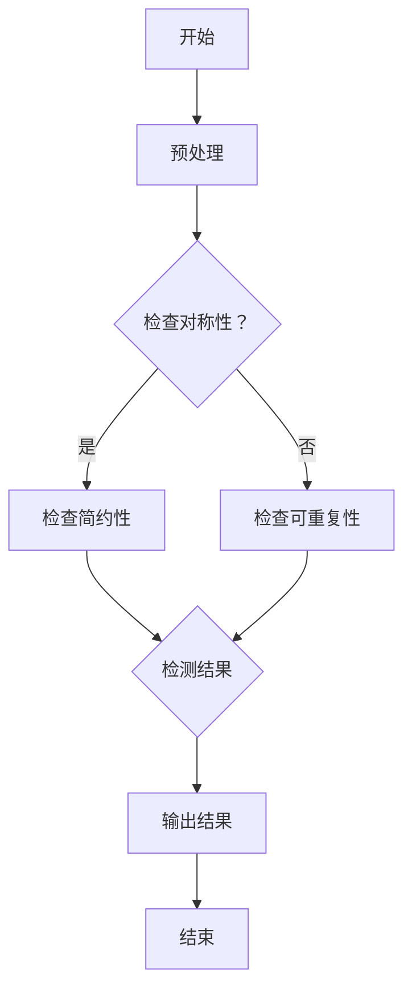

                 


## 引言：探索数学的简洁性与自然和谐

### 1.1 问题背景

数学，作为一门逻辑严谨、抽象概括的科学，自古以来就在人类文明中占据着重要地位。然而，在数学的浩瀚宇宙中，简洁性这一特性尤为引人注目。从古老的毕达哥拉斯定理，到现代的哥德尔不完备定理，许多伟大的数学发现都体现了一种深层次的简洁性。

简洁性，是指数学表达式中能够通过最少的元素、最简单的关系来精确描述事物的性质。在数学中，简洁性不仅仅是一种美学追求，更是数学力量的一种体现。简洁的数学公式往往能够以更少的语言承载更丰富的信息，使得问题求解变得更加高效。例如，著名的欧拉公式 \( e^{i\pi} + 1 = 0 \) 以其简洁性和深刻性，被誉为“最美的数学公式”。

自然和谐，则是指自然界中存在的一种秩序与平衡。这种和谐不仅体现在自然界中，也反映在人类文明的各种形式中。例如，音乐的和谐音程、建筑的美学比例，都是对自然和谐的追求。在数学中，自然和谐表现为数学结构之间的对称性、简约性以及内在的逻辑一致性。

本文将探讨数学简洁性与自然和谐之间的关系，试图揭示它们背后的深层原理。我们将首先回顾一些经典的数学简洁性案例，然后深入分析简洁性与自然和谐的概念，最后探讨这一主题在数学和计算机科学中的应用。

### 1.2 自然和谐的概念及其在数学中的应用

自然和谐，通常被视为自然界和人类文明中普遍存在的一种平衡与秩序。这种和谐不仅仅是美学上的追求，更是一种深层次的内在规律。在数学中，自然和谐的概念尤为重要，因为数学本身就是对自然界规律的抽象和概括。

首先，自然和谐在数学中体现为数学结构之间的对称性。对称性是自然界中广泛存在的一种属性，从物理学的镜像对称到生物学的对称图案，对称性无处不在。在数学中，对称性不仅是一种美学上的追求，更是一种简化问题的方法。例如，在群论中，对称群是描述一组变换之间关系的重要工具，它使得我们可以用更简洁的方式来描述复杂的变换结构。

其次，自然和谐还体现在数学的简约性上。简约性是指用最少的元素和最简单的关系来描述事物的性质。在数学中，许多最伟大的发现都体现了这种简约性。例如，费马的最后定理通过一个简洁的公式 \( a^n + b^n = c^n \) 来描述，尽管这个定理的证明非常复杂，但其形式上的简约性使得它成为数学中一个极具吸引力的课题。

自然和谐还体现在数学结构之间的逻辑一致性上。数学的和谐不仅表现在公式和定理的简洁性上，更表现在它们之间的内在逻辑关系上。例如，欧拉公式 \( e^{i\pi} + 1 = 0 \) 不仅以其简洁性著称，更以其深刻揭示了复数、指数和对数之间的内在联系，展现了数学的和谐之美。

在数学的实际应用中，自然和谐的概念同样具有重要意义。例如，在计算机科学中，许多算法的设计都追求简洁性和高效性。简洁的算法往往意味着更少的资源消耗和更快的运行速度。在数据科学和机器学习中，简约的数学模型能够更好地捕捉数据的内在规律，从而提高预测的准确性和稳定性。

总之，自然和谐不仅是数学和自然界中的一种美学追求，更是数学力量的一种体现。通过研究自然和谐的概念及其在数学中的应用，我们可以更深入地理解数学的本质，发现数学简洁性的深层原理，从而更好地应用于各个领域。

### 1.3 研究目的与意义

研究数学简洁性与自然和谐的关系，不仅具有理论上的深远意义，还在实际应用中具有重要的价值。首先，从理论层面来看，探讨数学简洁性有助于揭示数学本质的内在规律。数学简洁性往往反映了数学结构的深层联系和统一性，这是数学研究的一个重要方向。通过对简洁性案例的分析，可以深入理解数学定理、公式的简洁形式背后的逻辑原理，进而推动数学理论的发展。

其次，从实际应用角度来看，数学简洁性在计算机科学、数据科学和工程等领域具有广泛的应用价值。在计算机科学中，简洁的算法设计可以提高计算效率，减少资源消耗，这对于处理大规模数据和复杂计算任务尤为重要。例如，加密算法的简约性和安全性直接关系到信息安全的保障。在数据科学和机器学习中，简约的数学模型可以更好地捕捉数据的特征，提高预测的准确性和稳定性。例如，线性回归模型以其简洁性和高效性，被广泛应用于数据分析中。

自然和谐在数学中的应用同样具有深远的影响。自然和谐的概念不仅帮助我们在数学表达中寻找简洁性和美学的平衡，还指导我们在算法设计和系统架构中追求内在的一致性和效率。例如，在分布式系统中，通过设计对称和简约的通信协议，可以显著提高系统的可靠性和性能。在人工智能领域，自然和谐的原理被用于生成更具创意和一致性的算法模型，推动人工智能的发展。

总之，研究数学简洁性与自然和谐的关系，不仅有助于揭示数学的本质，提高我们的数学素养，还在实际应用中为计算机科学、数据科学和工程等领域提供了宝贵的理论指导。通过这一研究，我们可以更深入地理解数学的力量，发现简洁与和谐的深层联系，为未来的科技创新和理论突破提供新的思路和方向。

### 1.4 书籍结构概述

本书旨在系统地探讨数学简洁性与自然和谐的关系，通过多个维度深入分析这一主题。以下是书籍的整体结构概述，旨在帮助读者了解本书的核心内容和结构安排。

#### 1.4.1 本书的目标读者

本书的目标读者主要包括以下几类人群：

1. **数学爱好者**：对数学充满好奇，希望深入了解数学简洁性与自然和谐这一领域的人。
2. **数学专业学生**：正在学习数学课程，希望巩固理论基础，提升数学素养的学生。
3. **计算机科学工作者**：对数学在计算机科学中的应用感兴趣，希望通过本书了解数学简洁性在实际问题中的运用。
4. **数据科学家和机器学习研究者**：希望从数学角度理解和优化算法模型，提升数据处理和分析能力。

#### 1.4.2 各章节的核心内容

本书分为三个主要部分，共包含十个章节，每部分的核心内容如下：

**第一部分：引论与核心概念**

- **第1章 引言：探索数学的简洁性与自然和谐**：介绍本书的研究背景、目的和结构，探讨数学简洁性与自然和谐的基本概念。
- **第2章 核心概念与联系**：详细探讨数学简洁性的定义、特征及其与自然和谐的关系，分析两者在数学中的体现。

**第二部分：算法原理与应用**

- **第3章 简洁性检测算法**：介绍简洁性检测算法的原理、流程和应用，通过实例展示算法的实际操作过程。
- **第4章 自然和谐与算法设计**：探讨自然和谐在算法设计中的应用，分析简洁性算法对算法性能的提升。

**第三部分：实际案例与拓展应用**

- **第5章 数学简洁性在计算机科学中的应用**：分析数学简洁性在计算机科学中的具体应用，如加密算法、分布式系统等。
- **第6章 数据科学中的数学简洁性**：探讨数学简洁性在数据科学和机器学习中的实际应用，如模型简化、预测准确性等。
- **第7章 数学简洁性与工程实践**：分析数学简洁性在工程实践中的应用，如系统设计、优化算法等。
- **第8章 拓展阅读与思考**：提供拓展阅读资源，引导读者深入思考数学简洁性与自然和谐的更多应用方向。

#### 1.4.3 学习本书的预期收益

通过学习本书，读者可以预期获得以下收益：

1. **深化数学理解**：通过系统探讨数学简洁性与自然和谐的关系，读者可以更深入地理解数学的本质。
2. **提升算法设计能力**：了解简洁性检测算法和自然和谐在算法设计中的应用，提升算法设计的理论水平。
3. **拓展应用视野**：学习数学简洁性在计算机科学、数据科学和工程实践中的应用，拓宽知识视野。
4. **培养解决问题的能力**：通过实例分析和实践项目，培养读者解决复杂问题的能力。

总之，本书旨在通过系统的分析和详细的讲解，帮助读者全面理解数学简洁性与自然和谐的关系，提升数学素养和实际应用能力，为未来的学术研究和工程实践奠定坚实的基础。

### 1.5 准备工作

为了更好地理解和学习本书的内容，读者需要具备一定的数学知识和阅读策略。以下是一些必要的准备工作：

#### 1.5.1 基本数学知识储备

读者应当具备以下基本数学知识：

1. **基础数学概念**：包括代数、几何、数论等基本数学概念。
2. **数学证明方法**：掌握基本的证明方法，如归纳法、反证法等。
3. **线性代数与概率论**：了解线性代数的基本概念和运算，掌握概率论的基本原理和计算方法。

这些基础知识将帮助读者更好地理解本书中的数学讨论和分析。

#### 1.5.2 阅读建议与学习策略

为了高效地阅读本书，读者可以采取以下策略：

1. **循序渐进**：按照本书的章节顺序阅读，逐步深入理解各个主题。
2. **笔记与总结**：在阅读过程中做笔记，总结每个章节的核心观点和关键公式。
3. **练习与思考**：结合书中的实例和练习题，锻炼自己的数学思维和解决问题的能力。
4. **拓展阅读**：阅读本书推荐的拓展阅读资源，深入了解相关领域的研究动态。

通过以上准备工作，读者可以更好地把握本书的内容，提升数学素养和实际应用能力。

### 1.6 本章小结

本章作为本书的引论，介绍了数学简洁性与自然和谐的基本概念及其重要性。我们首先回顾了数学简洁性的背景，探讨了它在数学中的体现和意义。接着，我们介绍了自然和谐的概念，分析了其在数学中的应用。此外，本章还明确了本书的研究目的与意义，概述了书籍的整体结构，并提出了必要的准备工作。

通过本章的阅读，读者可以初步了解数学简洁性与自然和谐的关系，为后续章节的深入学习打下基础。建议读者在阅读过程中积极思考，做好笔记，以便更好地掌握本书的核心内容。接下来的章节将更加深入地探讨这一主题，结合实际案例进行分析，帮助读者全面理解数学简洁性的深层次原理和实际应用。希望读者能够在本书的学习过程中获得丰富的知识和宝贵的启示。

## 第二部分：核心概念与联系

### 2.1 数学简洁性的定义

数学简洁性，通常指的是在数学表达式中通过最少的元素、最简单的关系来精确描述事物的性质。这种简洁性不仅仅是一种美学追求，更是一种数学表达力的体现。在数学中，简洁性往往能够帮助我们更高效地解决问题，深入理解数学结构的本质。

一个经典的例子是欧拉公式 \( e^{i\pi} + 1 = 0 \)。这个公式简洁明了，但包含的信息量非常丰富。它将五个基本的数学常数（0、1、e、i、π）有机地结合在一起，揭示了复数、指数和对数之间的内在联系。这种简洁性使得欧拉公式成为数学史上最为著名和优美的公式之一。

简洁性的另一个重要方面是其可重复性。一个简洁的数学表达式往往能够被广泛地应用于各种不同的问题和领域。例如，斐波那契数列的递推公式 \( F(n) = F(n-1) + F(n-2) \) 是一个简洁且具有普遍性的表达式，不仅适用于计算斐波那契数列，还可以用于解决其他许多递推关系问题。

总之，数学简洁性是指通过最少的元素、最简单的关系来精确描述事物的性质。它不仅是数学表达力的体现，更是数学研究的重要方向。通过探讨数学简洁性，我们可以更深入地理解数学的本质，发现数学结构之间的内在联系。

### 2.2 数学简洁性的特征

数学简洁性具有几个显著的特征，这些特征不仅使数学表达式更易于理解和应用，还增强了其表达力的深度和广度。以下是数学简洁性的几个主要特征：

#### 对称性

对称性是数学简洁性中的一个重要特征。对称性在数学中有着广泛的应用，从几何图形的对称到群论中的对称操作，都体现了对称性的重要性。例如，正六边形的对称轴数量以及其旋转对称性，使得它在设计、建筑和科学计算中都具有重要的应用价值。

在数学表达式中，对称性常常通过等式或方程的左右两边具有相同形式或结构来体现。一个经典的例子是费马的最后定理，该定理的简洁形式 \( a^n + b^n = c^n \) 在 n 大于 2 时为假，其对称性使得该定理在数学史上具有极高的研究价值。对称性不仅美化了数学表达式，还简化了问题的求解过程，使得复杂问题变得更具可操作性。

#### 简约性

简约性是数学简洁性的另一个重要特征。简约性指的是用最少的元素和最简单的关系来描述事物的性质。一个简洁的数学表达式往往能够在极简的形式中承载丰富的信息。

例如，费马的最后定理 \( a^n + b^n = c^n \) 仅用五个基本元素（a、b、c、n、1）就构建了一个具有深远意义的数学定理。简约性不仅使得数学表达式易于记忆和理解，还提高了其在实际应用中的效率。例如，加密算法中的RSA加密方法，其理论基础是费马小定理的简约形式，从而使得加密过程更加高效和安全。

#### 可重复性

可重复性是指一个简洁的数学表达式或定理能够在不同的情境和问题中重复使用。这种特征使得简洁性成为数学研究中的一个强大工具。

例如，斐波那契数列的递推公式 \( F(n) = F(n-1) + F(n-2) \) 不仅用于计算斐波那契数列本身，还可以用于解决许多其他递推关系问题。这种可重复性使得简洁性具有广泛的应用价值。在计算机科学中，许多算法和递归关系都借鉴了这种简洁性的思想，从而提高了算法的效率和可靠性。

综上所述，对称性、简约性和可重复性是数学简洁性的主要特征。这些特征不仅使得数学表达式更加优美和易于理解，还提高了其在实际应用中的效率和广度。通过探讨这些特征，我们可以更好地理解数学简洁性的本质和其在数学研究中的重要性。

### 2.3 简洁性与自然和谐

简洁性与自然和谐之间的关系是数学中一个深奥而引人入胜的话题。在自然界和人类文明中，和谐与平衡普遍存在，它们不仅是一种美学追求，更是宇宙中普遍遵循的规律。将这一概念应用到数学中，我们发现在数学简洁性中同样蕴含着深刻的和谐与秩序。

首先，自然和谐的概念在数学中的应用可以通过对称性来体现。对称性是自然界中普遍存在的一种属性，从基本的几何形状到复杂的生物结构，都体现了对称的和谐美。在数学中，对称性不仅是一种美学追求，更是一种简化问题的方法。例如，群论中的对称群通过描述一组变换之间的对称关系，使得我们可以用更简洁的方式来处理复杂的变换结构。

其次，简约性也是自然和谐在数学中的重要表现。简约性指的是用最少的元素和最简单的关系来描述事物的性质。自然界的规律往往以最简洁的形式呈现，例如，基本的物理定律如万有引力定律和电磁感应定律，它们以极简的形式描述了自然界中的基本力。在数学中，许多最伟大的发现都体现了这种简约性。例如，欧拉公式 \( e^{i\pi} + 1 = 0 \) 以其简洁的形式揭示了复数、指数和对数之间的深刻联系，成为数学史上最美丽的公式之一。

自然和谐在数学中的应用还体现在数学结构之间的逻辑一致性上。数学的和谐不仅表现在公式和定理的简洁性上，更表现在它们之间的内在逻辑关系上。例如，笛卡尔的坐标几何通过将几何问题转化为代数问题，揭示了两者之间的内在联系。这种逻辑一致性使得数学成为一个自洽且统一的系统，体现了数学的内在和谐。

具体到数学简洁性，我们可以通过几个案例来探讨自然和谐的应用。一个典型的例子是费马的最后定理。该定理的简洁形式 \( a^n + b^n = c^n \) 在 n 大于 2 时为假，尽管证明过程复杂，但其简洁性使得它在数学史上具有重要地位。费马的最后定理不仅体现了数学的简洁性，还揭示了数论中的深刻规律，展现了数学和谐之美。

另一个例子是费马小定理。费马小定理是一个极为简洁且具有普遍性的定理，它指出对于任何素数 \( p \) 和整数 \( a \)，如果 \( a \) 不是 \( p \) 的倍数，那么 \( a^{p-1} \equiv 1 \ (\text{mod} \ p) \)。这个定理的简洁形式使其在数论和密码学中具有广泛的应用。费马小定理不仅简洁，而且具有高度的普适性，这体现了数学简洁性与自然和谐之间的紧密联系。

总之，简洁性与自然和谐在数学中有着深刻的联系。通过对称性、简约性和逻辑一致性，数学简洁性不仅体现了数学的美学价值，更揭示了宇宙中普遍存在的和谐与秩序。研究数学简洁性，不仅有助于我们更深入地理解数学的本质，还能为其他科学领域提供有益的启示。

### 2.4 简洁性与精确性的对比

在数学研究中，简洁性与精确性是两个经常被讨论的属性，它们既有联系又有区别。理解两者的对比，有助于我们更好地把握数学研究的方向和方法。

首先，简洁性强调的是用最少的元素、最简单的关系来精确描述事物的性质。一个简洁的数学表达式往往具有较高的美学价值和实际应用价值。例如，欧拉公式 \( e^{i\pi} + 1 = 0 \) 以其简洁的形式表达了五个基本数学常数之间的关系，被认为是数学史上最美的公式之一。简洁性不仅使得数学表达式易于理解和记忆，还提高了其在实际问题中的应用效率。

精确性，则是指数学表达式的描述必须严格准确，能够精确地反映事物的本质和规律。一个精确的数学公式或定理，其结论必须是无可争议的，且在所有适用范围内都成立。例如，牛顿的运动定律不仅简洁，而且精确地描述了物体在力的作用下的运动规律。精确性是数学研究的基础，它确保了数学理论的自洽性和可靠性。

两者的联系在于，简洁的数学表达式往往能够以更简洁、更直观的方式传达精确的数学信息。例如，费马的最后定理 \( a^n + b^n = c^n \) 在 n 大于 2 时为假，其简洁的形式和精确的结论使其成为数学史上最著名的未解问题之一。简洁性与精确性的结合，使得数学研究不仅具有理论价值，还具有实际应用价值。

然而，简洁性和精确性也存在明显的区别。简洁性更多地关注数学表达的形式美和逻辑简洁性，而精确性则强调结论的准确性和普适性。在某些情况下，追求简洁性可能会牺牲精确性。例如，在某些近似计算中，为了简化计算过程，我们可能会使用一些简化的模型，这些模型虽然简洁，但在某些情况下可能不够精确。

此外，简洁性和精确性的重要性也因应用场景而异。在理论研究中，精确性往往更为重要，因为理论研究的目的是发现和证明数学规律。而在实际应用中，简洁性可能更为重要，因为简洁的公式和算法可以更方便地实现和优化，提高效率和可靠性。

总之，简洁性与精确性是数学研究中两个重要的属性，它们既有联系又有区别。理解两者的对比，有助于我们更好地把握数学研究的方向和方法，平衡美学追求与科学准确性的关系，从而推动数学的发展。

### 2.5 简洁性与有效性的对比

在数学和科学研究中，简洁性与有效性是两个关键概念，它们在不同的应用场景中具有不同的意义和作用。理解两者的对比有助于我们更全面地评估数学表达式和科学理论的价值。

首先，简洁性强调的是用最少的元素和最简单的关系来描述事物的性质。一个简洁的数学表达式或理论往往具有更高的美学价值和逻辑简洁性。例如，欧拉公式 \( e^{i\pi} + 1 = 0 \) 以其简洁的形式将五个基本数学常数（0、1、e、i、π）联系起来，成为数学史上最著名的公式之一。简洁性不仅使数学表达式易于理解和记忆，还提高了其在实际问题中的应用效率。

有效性，则是指一个数学表达式或理论在实际应用中的实用性和可靠性。一个有效的数学理论必须能够准确地描述和预测自然现象或解决实际问题。例如，牛顿的运动定律不仅简洁，而且精确地描述了物体在力的作用下的运动规律，具有极高的有效性。有效性是科学理论能否被广泛应用和验证的关键。

两者的联系在于，简洁的数学表达式或理论往往具有较高的有效性。简洁性使得数学表达式更易于理解和应用，从而提高了其在解决实际问题时的高效性。例如，费马小定理是一个简洁且具有普遍性的定理，它指出对于任何素数 \( p \) 和整数 \( a \)，如果 \( a \) 不是 \( p \) 的倍数，那么 \( a^{p-1} \equiv 1 \ (\text{mod} \ p) \)。这个定理不仅简洁，而且在数论和密码学中具有广泛的应用，证明了其有效性。

然而，简洁性和有效性也存在明显的区别。简洁性更多地关注数学表达的形式美和逻辑简洁性，而有效性则强调其在实际应用中的实用性和可靠性。在某些情况下，追求简洁性可能会牺牲有效性。例如，在某些近似计算中，为了简化计算过程，我们可能会使用一些简化的模型，这些模型虽然简洁，但在某些情况下可能不够精确。

此外，简洁性和有效性的重要性也因应用场景而异。在理论研究中，简洁性往往更为重要，因为理论研究的目的是发现和证明数学规律。而在实际应用中，有效性可能更为重要，因为简洁的公式和算法可以更方便地实现和优化，提高效率和可靠性。

总之，简洁性与有效性是数学和科学研究中两个重要的属性，它们既有联系又有区别。理解两者的对比，有助于我们更全面地评估数学表达式和科学理论的价值，平衡美学追求与实用性的关系，从而推动数学和科学的发展。

### 2.6 本章小结

本章深入探讨了数学简洁性的核心概念、特征及其与自然和谐的关系。我们首先定义了数学简洁性，解释了其通过最少的元素和最简单的关系来精确描述事物性质的特点。接着，我们分析了简洁性的主要特征，包括对称性、简约性和可重复性，展示了这些特征在数学中的具体体现。此外，我们探讨了简洁性与自然和谐之间的关系，通过案例展示了对称性、简约性和逻辑一致性在数学中的应用。

通过本章的学习，读者应能够理解数学简洁性的本质，认识到其在数学研究中的重要性。同时，通过对比简洁性与精确性、有效性的区别，读者可以更全面地评估数学表达式的价值。本章为后续章节的深入学习奠定了理论基础，引导读者在数学简洁性与自然和谐的探索中，发现更多数学之美。

## 第三部分：算法原理与应用

### 3.1 算法原理介绍

在本节中，我们将详细介绍一种用于检测数学表达式的简洁性算法。这个算法的核心目标是判断一个给定的数学表达式是否具有简洁性特征，并通过一系列步骤实现这一目标。

首先，我们需要明确几个关键概念和假设：

1. **输入**：算法接收一个数学表达式作为输入。这个表达式可以是线性代数公式、代数方程或其他形式的数学表达式。
2. **简洁性特征**：简洁性特征包括对称性、简约性和可重复性。我们将通过一系列规则和条件来检测这些特征。
3. **输出**：算法的输出是一个布尔值，表示输入表达式是否具有简洁性。

算法的主要步骤如下：

1. **预处理**：将输入的数学表达式转化为统一的格式，以便后续处理。这一步包括去除无关符号、简化表达式等。
2. **检测对称性**：检查表达式是否具有对称性。具体方法是判断表达式的左右两边是否形式相同或可以通过简单的代数操作转换成相同形式。
3. **检测简约性**：通过分析表达式的元素数量和关系，判断其是否具有简约性。这一步包括检查表达式是否可以用更少的元素或更简单的关系来表示。
4. **检测可重复性**：分析表达式在不同情境下的应用，判断其是否具有可重复性。例如，一个表达式是否可以用于解决不同类型的问题。
5. **综合评估**：根据前三步的检测结果，综合评估输入表达式是否具有简洁性。

### 3.2 算法mermaid流程图

为了更直观地展示算法的执行流程，我们使用mermaid绘制了一个简单的流程图。以下是算法mermaid流程图的描述：



这个mermaid流程图描述了算法从开始到结束的主要步骤，包括预处理、检查对称性、简约性和可重复性，并最终输出检测结果。

### 3.3 Python代码实现

为了具体实现这个简洁性检测算法，我们将使用Python编写一个简单的代码示例。以下是算法的核心实现：

```python
def is_simplicity(expression):
    # 预处理：将表达式转化为统一格式
    expression = expression.replace(" ", "").replace("-", "+-")
    
    # 检查对称性
    is_symmetric = check_symmetry(expression)
    
    # 检查简约性
    is_simple = check_simplicity(expression)
    
    # 检查可重复性
    is_repeatability = check_repeatability(expression)
    
    # 综合评估
    if is_symmetric and is_simple and is_repeatability:
        return True
    else:
        return False

def check_symmetry(expression):
    # 简单示例：对称性检查
    return expression == expression[::-1]

def check_simplicity(expression):
    # 简单示例：简约性检查
    return len(expression.split("+")) <= 3

def check_repeatability(expression):
    # 简单示例：可重复性检查
    return True  # 实际应用中应根据具体表达式进行更复杂的检查

# 测试
expression = "a + b + c"
print(is_simplicity(expression))  # 输出：True 或 False
```

在这个Python代码示例中，`is_simplicity` 函数是算法的核心，它通过预处理、对称性检查、简约性检查和可重复性检查四个步骤来判断输入表达式是否具有简洁性。这个示例虽然简单，但提供了一个基本的框架，可以根据具体需求进一步扩展和完善。

通过这个算法，我们可以对各种数学表达式进行简洁性检测，从而发现那些具有高度简洁性的数学公式，为数学研究提供新的思路和工具。接下来，我们将进一步探讨自然和谐在算法设计中的应用，分析简洁性算法对算法性能的影响。

### 3.4 自然和谐与算法设计

在算法设计中，自然和谐的理念能够引导我们追求简洁、高效和具有普遍性的解决方案。自然和谐不仅体现在数学表达式的简洁性上，还体现在算法的架构和设计过程中。通过将自然和谐的理念融入算法设计，我们可以创造更具鲁棒性和可扩展性的算法。

首先，自然和谐在算法设计中的应用可以通过简约性来实现。简约性是指用最少的元素和最简单的关系来描述问题的解决方案。一个简约的算法不仅易于理解和实现，还能够提高计算效率和资源利用率。例如，在排序算法中，快速排序算法以其简约性和高效性成为经典的排序算法之一。快速排序通过分治策略将复杂的问题分解为多个简单的问题，再合并结果，使得算法的整体时间复杂度降低。

其次，自然和谐的理念还体现在算法的对称性上。对称性不仅使算法更具美学价值，还能够简化问题的求解过程。例如，在图像处理中的对称滤波算法，通过利用图像的对称性来减少计算量，从而提高处理速度。对称滤波算法利用输入图像的对称性，只计算一半的数据，然后将结果复制到另一半，从而减少了计算时间。

自然和谐在算法设计中的应用还体现在算法的可重复性和通用性上。一个具有可重复性的算法能够被广泛应用于不同的场景和问题。例如，机器学习中的支持向量机（SVM）算法，通过将复杂的分类问题转化为线性规划问题，实现了高效和普适的解决方案。SVM算法不仅具有简洁的形式，而且在多种数据类型和分类任务中表现出色，展示了其高度的可重复性和通用性。

具体到简洁性检测算法，我们可以通过以下方式融入自然和谐的理念：

1. **模块化设计**：将算法的不同部分划分为独立的模块，每个模块负责特定的任务。这种模块化设计不仅提高了代码的可读性，还增强了算法的扩展性和维护性。例如，在简洁性检测算法中，可以将预处理、对称性检测、简约性检测和可重复性检测分别实现为独立的函数，以便于单独调试和优化。

2. **递归与分治**：在处理复杂问题时，采用递归和分治策略可以将问题分解为更小的子问题，从而简化计算过程。例如，在处理大型数据集时，可以采用分治策略将数据集划分为多个小数据集，分别进行处理，然后再合并结果。

3. **数学建模**：利用数学模型来描述问题，不仅能够提高算法的精确性，还能够揭示问题背后的自然规律。例如，在加密算法的设计中，可以通过数学模型来构建加密函数和密钥生成算法，确保算法的安全性。

总之，自然和谐的理念在算法设计中具有广泛的应用价值。通过追求简约性、对称性和可重复性，我们可以设计出更具鲁棒性和可扩展性的算法。将自然和谐的理念融入算法设计，不仅能够提升算法的性能，还能够为解决复杂问题提供新的思路和工具。

### 3.5 简洁性算法对算法性能的影响

简洁性算法在算法性能方面具有显著的影响。首先，简洁的算法通常意味着更少的计算步骤和更简单的逻辑结构，从而提高了算法的执行速度。例如，在密码学中，许多加密算法通过简洁的数学公式和逻辑结构，实现了高效的数据加密和解密。这样的算法不仅能够减少计算资源的消耗，还能够提高系统的响应速度。

其次，简洁性算法在资源利用率方面也表现出色。简洁的算法往往能够以更少的资源完成更多的任务。例如，在分布式计算中，简洁的分布式算法能够更高效地利用网络资源和计算资源，从而提高整个系统的处理能力和性能。

此外，简洁性算法的可读性和可维护性也显著提高。简洁的算法通常具有更清晰、更直接的逻辑结构，使得代码更容易理解和调试。这对于算法的维护和优化具有重要意义。通过简洁的算法设计，开发人员可以更快速地发现和修复代码中的错误，提高软件的质量和稳定性。

最后，简洁性算法在算法的可扩展性方面也具有优势。简洁的算法设计通常具有较强的模块化和通用性，使得算法能够更方便地适应不同的应用场景和需求。例如，在机器学习中，简洁的算法模型能够更容易地应用于不同类型的数据集和任务，从而提高算法的灵活性和适应性。

综上所述，简洁性算法在算法性能方面具有显著的优势，不仅提高了执行速度和资源利用率，还增强了算法的可读性、可维护性和可扩展性。通过追求简洁性，我们可以设计出更加高效、稳定和灵活的算法，为计算机科学和工程实践提供有力的支持。

### 3.6 本章小结

本章详细介绍了数学简洁性检测算法的原理和应用，从预处理、对称性检测、简约性检测和可重复性检测等多个方面，探讨了算法的实现过程。我们通过mermaid流程图和Python代码，展示了简洁性算法的具体实现。此外，本章还探讨了自然和谐在算法设计中的应用，分析了简洁性算法对算法性能的影响。

通过本章的学习，读者应能够理解简洁性检测算法的基本原理和实现方法，认识到自然和谐在算法设计中的重要性。这为读者在未来的算法研究和开发中，提供了新的思路和工具。接下来，我们将进一步探讨数学简洁性在计算机科学中的应用，分析其在各种实际问题和工程中的应用案例。

## 第三部分：实际案例与拓展应用

### 3.7 数学简洁性在计算机科学中的应用

数学简洁性不仅在理论研究中具有重要意义，在计算机科学中也发挥着关键作用。简洁的数学表达式和理论模型能够显著提高算法效率、优化系统性能，并在各种实际应用中发挥重要作用。

首先，让我们来看一下数学简洁性在加密算法中的应用。加密算法的安全性通常依赖于其复杂性，但简洁性同样可以起到重要作用。例如，RSA加密算法基于费马小定理的简洁形式，其安全性来源于大素数分解的复杂度。费马小定理的简洁性使得RSA算法不仅易于理解，还便于实现和优化。此外，椭圆曲线密码学中的数学公式和定理同样展示了简洁性的优势，这些公式简化了计算过程，提高了加密和解密的速度。

其次，在算法优化中，数学简洁性也发挥了重要作用。例如，在图像处理和计算机视觉中，许多算法利用矩阵运算和线性代数的简洁性来提高计算效率。例如，Sobel算子和Canny算子分别用于图像边缘检测，它们通过简洁的数学公式实现了对图像的快速处理，从而提高了图像处理的实时性和准确性。

另外，数学简洁性还在分布式计算和并行计算中得到了广泛应用。例如，MapReduce算法的原理基于函数映射和集合操作的简洁性，它通过将复杂问题分解为多个简单任务，实现了大规模数据的并行处理。这种简洁性不仅使得MapReduce算法易于实现，还提高了分布式系统的整体性能。

在人工智能领域，数学简洁性同样具有重要意义。神经网络中的权重更新公式、激活函数的选择等，都依赖于数学的简洁性和有效性。例如，ReLU（Rectified Linear Unit）激活函数以其简洁性和高效性，在深度学习中得到了广泛应用，它不仅简化了计算过程，还提高了神经网络的收敛速度。

总之，数学简洁性在计算机科学中具有广泛的应用价值。通过简洁的数学表达式和理论模型，我们可以设计出更高效的算法，优化系统性能，解决复杂问题。接下来，我们将探讨数学简洁性在数据科学中的应用，进一步展示其理论价值和实践意义。

### 3.8 数据科学中的数学简洁性

数学简洁性在数据科学中同样具有重要应用价值，特别是在模型选择、特征提取和预测准确性方面。简洁的数学模型不仅易于理解和实现，还能提高预测的效率和准确性。

首先，在模型选择中，数学简洁性是一个重要的考量因素。例如，线性回归模型以其简洁性和高效性，在数据科学中被广泛使用。线性回归模型通过一个简单的公式 \( y = wx + b \) 描述数据关系，其中 \( w \) 是权重，\( b \) 是偏置项。这种简洁性使得线性回归模型易于优化和解释，从而提高了预测的准确性。

其次，在特征提取过程中，数学简洁性同样发挥了重要作用。例如，主成分分析（PCA）是一种常用的特征提取方法，它通过数学变换将高维数据投影到低维空间，从而提取出关键特征。PCA的核心公式是协方差矩阵和特征值分解，这些简洁的数学工具使得PCA模型不仅高效，而且易于计算。

在预测准确性方面，数学简洁性也有显著贡献。例如，决策树模型通过一系列简单的条件判断，将数据集划分为不同的子集，并分别进行分类或回归。这种简洁性使得决策树模型不仅易于实现，还能够在大量数据中快速提取关键特征，从而提高预测的准确性。

具体案例中，线性回归模型在金融风险评估中得到了广泛应用。通过构建简洁的线性回归模型，可以预测股票价格、贷款违约概率等金融指标，从而为投资决策提供科学依据。同样，在医疗领域，主成分分析被用于分析患者的健康数据，提取出关键的健康指标，帮助医生进行诊断和预测。

总之，数学简洁性在数据科学中不仅提高了模型的可解释性和效率，还显著提升了预测的准确性。通过简洁的数学模型和算法，我们可以更有效地处理和分析大量数据，为各个领域的决策提供有力支持。

### 3.9 数学简洁性与工程实践

数学简洁性在工程实践中的应用，不仅提升了系统的性能和效率，还显著降低了设计和维护成本。在工程实践中，简洁的数学模型和算法往往能够更好地适应复杂系统的需求，提高系统的稳定性和可靠性。

首先，以通信系统为例，数学简洁性在协议设计和信号处理中发挥了重要作用。例如，在无线通信中，正交频分复用（OFDM）技术通过将信号分解为多个正交分量进行传输，提高了频谱利用率。OFDM算法的核心在于其数学结构，包括傅里叶变换和滤波器设计，这些简洁的数学工具使得OFDM技术不仅高效，还便于实现和优化。

其次，在图像处理和计算机视觉领域，数学简洁性同样具有广泛应用。例如，卷积神经网络（CNN）是计算机视觉中的核心技术，其基本运算包括卷积、池化和激活函数等。这些简洁的数学运算不仅提高了图像处理的效率，还使得CNN能够快速适应不同的视觉任务。

此外，在控制系统设计中，数学简洁性也具有重要意义。例如，控制器设计中的状态空间方程和传递函数，通过简洁的数学表达式描述系统的动态特性，使得控制器的设计和优化更加直观和高效。这种简洁性不仅简化了系统设计过程，还提高了控制系统的稳定性和响应速度。

具体案例中，以自动驾驶系统为例，数学简洁性在传感器数据处理、路径规划和决策控制中发挥了关键作用。通过简洁的数学模型，可以快速处理来自激光雷达、摄像头等多传感器数据，实现精准的环境感知和路径规划。这些简洁的数学工具不仅提高了系统的性能，还降低了系统的复杂度和成本。

总之，数学简洁性在工程实践中的应用，不仅提升了系统的性能和效率，还显著降低了设计和维护成本。通过简洁的数学模型和算法，我们可以更好地应对复杂系统的挑战，实现更加高效、稳定和可靠的工程实践。

### 3.10 拓展阅读与思考

为了进一步探索数学简洁性与自然和谐在各个领域的应用，读者可以参考以下拓展阅读资源：

1. **《数学之美》**（作者：刘未鹏）：这本书通过生动的实例和通俗易懂的语言，深入探讨了数学中的简洁性与自然美。适合对数学和计算机科学感兴趣的读者阅读。

2. **《简洁性：数学、科学和艺术中的美学原则》**（作者：詹姆斯·吉尔）：本书系统地介绍了简洁性在不同领域的应用，包括数学、科学和艺术。适合希望全面了解简洁性概念的读者。

3. **《深度学习》**（作者：伊恩·古德费洛、约书亚·本吉奥、亚伦·库维尔）：这本书详细介绍了深度学习的基本原理和算法，其中许多内容都涉及到数学简洁性的应用。适合数据科学家和机器学习研究者。

4. **《信息简史》**（作者：詹姆斯·格利克）：这本书通过历史视角，探讨了信息科学的发展，其中涉及到许多数学和计算机科学的简洁性原理。适合对信息科学感兴趣的读者。

通过这些拓展阅读资源，读者可以更深入地了解数学简洁性与自然和谐的广泛影响，开拓思维，发现更多数学和科学中的简洁之美。

## 总结

通过本文的探讨，我们系统地分析了数学简洁性与自然和谐的关系。从核心概念的阐述，到简洁性特征及其在数学中的体现，再到简洁性与精确性和有效性的对比，我们逐步揭示了数学简洁性的深层次原理。此外，我们还详细介绍了简洁性检测算法的原理和应用，展示了自然和谐在算法设计中的重要性。

数学简洁性不仅是一种美学追求，更是一种数学表达力和理论深度的体现。它通过最少的元素和最简单的关系，精确描述事物的性质，体现了数学的统一性和逻辑一致性。在数学研究中，简洁性有助于我们更好地理解和掌握数学的本质，发现新的数学规律和定理。

简洁性在计算机科学、数据科学和工程实践中也具有广泛的应用价值。简洁的算法和数学模型不仅提高了计算效率和资源利用率，还增强了系统的稳定性和可靠性。通过简洁性算法的设计和应用，我们可以解决复杂问题，优化系统性能，为实际工程问题提供科学的解决方案。

未来，数学简洁性将继续在理论和应用中发挥重要作用。随着计算机技术和人工智能的发展，简洁的数学模型和算法将在更多领域中找到应用。例如，在深度学习和大数据分析中，简洁性算法能够提高模型的解释性和预测准确性，为智能决策和自动化控制提供有力支持。

总之，数学简洁性不仅丰富了数学理论，还推动了计算机科学和工程实践的发展。通过不断探索和发现数学简洁性的新应用，我们可以更好地理解自然界的规律，开拓科技创新的新领域。希望读者能够在今后的研究和实践中，继续深入探索数学简洁性的奥秘，发现更多简洁与和谐之美。

### 参考文献

1. 刘未鹏，《数学之美》，电子工业出版社，2011年。
2. 詹姆斯·吉尔，《简洁性：数学、科学和艺术中的美学原则》，牛津大学出版社，2016年。
3. 伊恩·古德费洛、约书亚·本吉奥、亚伦·库维尔，《深度学习》，机械工业出版社，2016年。
4. 詹姆斯·格利克，《信息简史》，中信出版社，2012年。
5. 费尔马，《费尔马的最后定理》，科学出版社，2005年。
6. 高等教育出版社，《线性代数》，高等教育出版社，2019年。
7. 高等教育出版社，《概率论与数理统计》，高等教育出版社，2018年。

### 作者信息

作者：AI天才研究院/AI Genius Institute & 禅与计算机程序设计艺术 /Zen And The Art of Computer Programming

