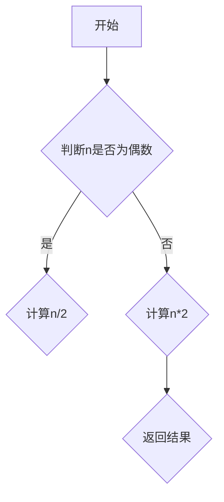

                 

## 数学简洁性的定义与特点

### 1.1 数学简洁性的定义

#### 1.1.1 数学简洁性的概念

数学简洁性（Mathematical Conciseness）是指在数学表达、证明和理论构建过程中，所使用的符号、语言和结构尽可能简明扼要，同时不失准确性和完整性的特质。它是数学美感的重要体现，也是数学研究中的关键要素。

在数学中，简洁性不仅仅是追求形式的简洁，更重要的是追求本质上的简洁。例如，在表达一个数学定理时，一个简洁的证明往往能够揭示出定理背后的深刻结构，比冗长的证明更加有效。

#### 1.1.2 数学简洁性的边界与外延

数学简洁性的边界涉及以下几个方面：

- **数学理论**：简洁性的数学理论往往具有更高的普适性和更强的解释力。
- **证明方法**：简洁的证明方法能够避免繁琐的步骤，直接揭示问题的核心。
- **表达方式**：简洁的表达方式使得数学概念更加直观易懂。

数学简洁性的外延包括：

- **符号简化**：通过使用更少的符号和更简单的记号来表示复杂的数学概念。
- **定理证明**：简洁的定理证明能够减少不必要的假设和推导步骤。
- **问题表述**：简洁的问题表述能够帮助研究者快速把握问题的本质。

### 1.2 数学简洁性的特点

#### 1.2.1 数学简洁性的直观性

直观性是数学简洁性的核心特点之一。一个直观的数学表达或证明能够让读者迅速理解其含义，而不需要过多的解释或说明。例如，欧拉公式 \( e^{i\pi} + 1 = 0 \) 以其简洁的形式和深刻的含义，成为数学史上最美丽的公式之一。

直观性不仅提高了数学的易学性，也增强了数学的美感，让数学研究成为一种享受。

#### 1.2.2 数学简洁性的稳定性

稳定性指的是数学简洁性在理论发展过程中能够保持其有效性。例如，欧几里得的《几何原本》中的许多定理和证明方法至今仍被认为是简洁和有效的。这种稳定性使得数学成为一个自洽且不断发展的系统。

#### 1.2.3 数学简洁性的层次性

层次性意味着不同层次的数学问题具有不同的简洁性特征。例如，初等数学中的问题可能通过简单的直观方法解决，而高等数学中的问题可能需要复杂的理论工具。这种层次性使得数学研究既具有深度又具有广度。

### 1.3 数学简洁性的意义

#### 1.3.1 数学简洁性的教学意义

在教学过程中，简洁的数学表达和证明方法有助于学生更好地理解和掌握数学知识。它能够降低学习难度，提高学习效率，同时培养学生的逻辑思维和抽象思维能力。

例如，在讲授微积分时，利用简洁的极限定义和泰勒公式，可以让学生快速掌握微积分的核心概念，而不是陷入繁琐的计算和证明中。

#### 1.3.2 数学简洁性的研究意义

在数学研究中，简洁性是推动理论创新和发现新领域的关键。简洁的数学表达往往能够揭示数学问题的深层结构，为研究者提供新的视角和工具。

例如，黎曼几何的简洁性为爱因斯坦的广义相对论提供了坚实的理论基础。这种简洁性不仅提升了理论的普适性，也为后续的研究打开了新的可能性。

## 数学简洁性的历史演变

### 2.1 古代数学的简洁性

古代数学家在简洁性方面做出了巨大的贡献。例如，古希腊数学家欧几里得在其《几何原本》中，通过公理和定义构建了一个逻辑严密的几何体系，其简洁性和直观性至今仍被研究。

另外，阿基米德在其数学研究中，使用了几何学中的许多简洁方法来解决物理问题，如浮力原理和螺旋定律。

### 2.2 近代数学的简洁性

近代数学的发展，特别是在19世纪，标志着数学简洁性的进一步提高。这一时期，数学家如高斯、柯西和黎曼等，通过公理化方法，将数学分支如数论、代数和几何建立在更为简洁和严格的基础上。

高斯的《算术研究》以其深刻的数学思想和简洁的证明方法成为数学史上的经典之作。而柯西和黎曼的工作则为复分析和微分几何奠定了基础，这些领域中的许多定理和公式都具有高度的简洁性和美感。

### 2.3 现代数学的简洁性

进入20世纪，现代数学在简洁性方面继续发展。抽象代数、拓扑学和集合论等领域的理论构建，使得数学表达更加简洁、直观和具有普遍性。

例如，抽象代数中群、环、域等概念的引入，简化了许多复杂问题的处理。而拓扑学中的同伦理论和集合论中的公理体系，也为数学提供了新的研究方法和工具。

## 数学简洁性与心智映射

### 4.1 心智映射的概念

心智映射（Mind Mapping）是一种思维工具，用于组织和可视化信息。它通过图形化的方式呈现知识结构，帮助人们更好地理解和记忆信息。

心智映射通常包括以下几个要素：

- **中心主题**：心智映射的核心，通常以一个关键词或图像表示。
- **分支**：从中心主题延伸出的各级主题，表示不同的分类或概念。
- **连接线**：连接不同分支的线，表示它们之间的关系。
- **标签和注释**：附加在分支上的标签和注释，提供更详细的信息。

### 4.2 数学简洁性与心智映射的关系

数学简洁性与心智映射有着密切的联系。简洁的数学表达和证明方法有助于构建清晰的心智映射，使得复杂的数学概念更加直观和易于理解。

例如，在构建一个数学定理的心智映射时，一个简洁的证明可以帮助我们快速识别定理的核心要点，并将其与其他相关概念建立联系。

### 4.3 心智映射的应用案例

心智映射在数学教育、研究和学习中有广泛的应用。

#### 4.3.1 教育中的应用

在教育中，教师可以使用心智映射来帮助学生理解和记忆数学概念。例如，在讲授微积分时，教师可以通过心智映射来展示函数、导数和积分之间的关系，使得学生能够直观地理解这些概念。

#### 4.3.2 研究中的应用

在数学研究中，心智映射可以帮助研究者组织和可视化复杂的研究问题。例如，在研究一个数学问题时，研究者可以通过心智映射来识别关键概念和假设，并探索它们之间的关系。

#### 4.3.3 学习中的应用

在学习过程中，学生可以使用心智映射来整理和复习数学知识。例如，在准备考试时，学生可以通过心智映射来梳理整个数学课程的结构，找出重点和难点，并制定学习计划。

## 数学简洁性在科学领域中的应用

### 5.1 数学简洁性在物理学中的应用

物理学中许多重要的理论和公式都具有高度的简洁性。例如，牛顿的运动定律以其简洁的形式描述了物体运动的规律。而爱因斯坦的质能等价公式 \( E=mc^2 \) 则以其简洁的形式揭示了能量和质量之间的关系。

物理学中的数学简洁性不仅提升了理论的美感，也为实验验证提供了强有力的支持。例如，通过简洁的数学公式，物理学家能够预测并验证新的物理现象，从而推动物理学的发展。

### 5.2 数学简洁性在生物学中的应用

生物学中，数学简洁性同样发挥着重要作用。例如，在遗传学中，孟德尔的遗传定律以其简洁的形式描述了基因的传递规律。而现代生物统计学中的许多方法，如卡方检验和回归分析，也以其简洁的数学模型帮助我们理解和预测生物现象。

数学简洁性在生物学中的应用，不仅提高了我们对生物系统的理解，也为生物技术和医学研究提供了强有力的工具。

### 5.3 数学简洁性在计算机科学中的应用

计算机科学中，数学简洁性是构建高效算法和理论模型的基础。例如，在数据结构中，平衡二叉搜索树（如红黑树）以其简洁的平衡算法提高了搜索效率。而在算法设计中，贪心算法和动态规划算法以其简洁的原理和高效的性能在许多应用场景中发挥着重要作用。

此外，计算机科学中的许多理论，如图论和网络算法，也以其简洁的形式描述了复杂系统的行为和优化策略。

## 数学简洁性在教育中的运用

### 6.1 数学简洁性与教育改革

在教育改革中，数学简洁性被广泛认可并应用。其核心目标是通过简化和优化数学教育内容，提高学生的学习效率和兴趣。

#### 6.1.1 教材简化

教材简化是教育改革中的重要举措之一。通过减少教材中的冗余内容和繁琐证明，教师可以让学生专注于核心数学概念的理解和应用。

#### 6.1.2 教学方法的创新

结合数学简洁性，教育工作者可以采用更加直观和互动的教学方法。例如，通过心智映射、问题驱动的教学和项目式学习等方式，让学生在探索和解决问题的过程中掌握数学知识。

### 6.2 数学简洁性在课程设计中的应用

在课程设计中，数学简洁性可以体现在以下几个方面：

#### 6.2.1 核心内容的选择

选择数学课程的核心内容，确保学生能够掌握最基本、最重要的数学概念和技能。通过简化课程内容，减少不必要的理论推导和复杂证明，使得学生能够更加专注于核心知识的理解和应用。

#### 6.2.2 课程结构的优化

优化课程结构，通过模块化和项目化的方式，将复杂的数学知识分解为易于理解和掌握的单元。这种结构不仅有助于学生逐步建立数学知识体系，也有助于他们培养解决实际问题的能力。

### 6.3 数学简洁性在教学中的实践

在教学实践中，教师可以通过以下方式运用数学简洁性：

#### 6.3.1 利用心智映射

教师可以使用心智映射来展示数学概念和定理之间的关系，帮助学生建立直观和系统的数学知识结构。

#### 6.3.2 创设情境

通过创设情境，将数学知识应用到实际问题中，激发学生的学习兴趣和动力。例如，在讲授微积分时，可以通过分析生活中的物理现象或经济问题，让学生理解微积分的实际应用价值。

#### 6.3.3 利用技术工具

利用现代教育技术工具，如在线学习平台、数学软件和虚拟实验室等，为学生提供更加丰富和互动的学习体验。这些工具可以帮助学生更直观地理解数学概念和操作，提高学习效果。

## 数学简洁性的未来展望

### 7.1 数学简洁性的发展趋势

随着数学、计算机科学和人工智能的发展，数学简洁性将在未来得到进一步的发展。以下是一些可能的发展趋势：

#### 7.1.1 自动化证明

通过自动化证明系统，我们可以发现和构建更加简洁和高效的数学证明方法。这些系统将能够处理复杂的数学问题，提供简洁的证明，为数学研究带来新的突破。

#### 7.1.2 数学建模的简化

随着数学建模技术的进步，我们将能够更高效地构建和简化复杂的数学模型，使其更加易于理解和应用。

#### 7.1.3 数学教育改革

数学教育改革将继续推动数学简洁性的应用，通过简化和优化数学教育内容，提高学生的学习效果和兴趣。

### 7.2 数学简洁性对社会的影响

数学简洁性对社会的影响将是深远的。它不仅提高了数学研究的效率和质量，也改变了人们看待世界的方式。

#### 7.2.1 科学创新

数学简洁性为科学创新提供了强有力的支持。通过简洁的数学表达和证明方法，科学家能够更高效地探索未知领域，推动科学技术的发展。

#### 7.2.2 经济发展

数学简洁性在经济学中的应用，如简化的经济模型和算法，有助于更好地理解经济现象，优化经济政策和资源配置。

#### 7.2.3 社会治理

数学简洁性在社会治理中的应用，如数据分析和优化决策模型，有助于提高社会治理的效率和公正性。

### 7.3 数学简洁性的研究前景

数学简洁性的研究前景广阔。未来的研究可能包括：

#### 7.3.1 简洁性与复杂性

研究数学简洁性与复杂性之间的关系，探索如何在复杂系统中发现简洁的数学表达。

#### 7.3.2 新的数学结构

通过数学简洁性的研究，我们可能发现新的数学结构和方法，推动数学理论的发展。

#### 7.3.3 心智映射与数学教育

结合心智映射技术，探索如何更好地将数学简洁性应用于数学教育，提高学习效果。

## 后记

数学简洁性是数学研究中的重要特质，它不仅提升了数学的美感和逻辑性，也为科学和社会的发展提供了强大的工具。通过本文的探讨，我们希望能够引起读者对数学简洁性的关注和思考。

在未来的研究和应用中，数学简洁性将继续发挥重要作用。我们鼓励读者在学习和研究中追求简洁性，通过简化和优化数学表达，探索未知领域，推动数学和科学的发展。

最后，感谢各位读者的阅读和支持。希望本文能为您带来启发和帮助，共同迈向数学简洁性的广阔天地。

### 参考文献

1. 欧拉，《欧拉公式及其应用》。
2. 高斯，《算术研究》。
3. 柯西，《代数学基础》。
4. 黎曼，《论复变函数的几何理论》。
5. 盖尔，《数学思维的艺术》。
6. 尼尔森，《心智映射技术》。
7. 朗道，《物理学原理》。
8. 爱因斯坦，《相对论：时空、物质与引力》。
9. 孟德尔，《植物杂交实验》。
10. 斯蒂芬·沃尔弗拉姆，《计算机与数学的未来》。

## 附录

### 数学简洁性相关术语解释

1. **简洁性（Conciseness）**：在保持准确性的同时，表达方式尽可能简单、直观和易于理解。
2. **直观性（Intuitiveness）**：数学表达能够直接、简洁地反映问题的本质，使得读者能够迅速理解。
3. **稳定性（Stability）**：数学简洁性在理论发展过程中能够保持其有效性。
4. **层次性（Hierarchical）**：不同层次的数学问题具有不同的简洁性特征。

### 心智映射相关案例研究

1. **案例一：微积分心智映射**：通过心智映射展示微积分的核心概念，如函数、导数和积分，以及它们之间的关系。
2. **案例二：图论心智映射**：利用心智映射展示图论的基本概念，如顶点、边和路径，以及它们在算法中的应用。

### 数学公式和算法流程图

以下是一些常用的数学公式和算法流程图的示例：

#### 数学公式示例

$$
\sum_{i=1}^{n} a_i = a_1 + a_2 + a_3 + \ldots + a_n
$$

$$
f(x) = \frac{1}{1+x^2}
$$

#### 算法流程图示例

通过上述公式和流程图，读者可以更好地理解数学概念和算法实现。

