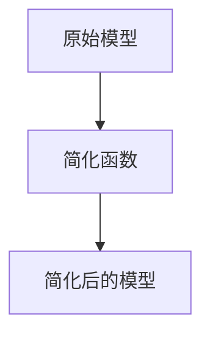

                 

### 《数学简约性：自然和谐的心智表达》

关键词：数学简约性、心智表达、自然和谐、数学模型、算法原理

摘要：本文旨在探讨数学简约性这一概念，并阐述其在自然和谐心智表达中的重要作用。通过逐步分析，我们将揭示数学简约性的定义、核心要素、数学表达及其在自然界和人文社会科学中的应用。本文不仅有助于理解数学简约性的本质，还启发我们在心智表达中追求自然和谐。

## 引言与背景

### 数学简约性的定义

数学简约性，是指在数学理论中，通过简化复杂的数学模型或公式，以达到更直观、更容易理解和应用的目的。它强调的是在保持原问题本质不变的情况下，通过简化表达，降低计算复杂度和减少冗余信息。

### 问题背景

在现代社会，随着科学技术的迅猛发展，复杂性科学成为了研究热点。然而，复杂性并不总是我们的目标，很多时候，简约性才是我们追求的终极目标。数学简约性作为一种研究方法，在解决复杂问题时具有独特的优势。

### 问题解决

数学简约性通过以下方式解决复杂性问题：
1. **简化模型**：将复杂的模型简化为更易处理的模型。
2. **消除冗余**：去除不必要的计算步骤和中间结果。
3. **统一表达**：将不同领域的问题统一到一个简洁的数学框架中。

### 边界与外延

数学简约性的边界在于它必须在保持问题本质不变的前提下进行。一旦简化过度，可能会导致丢失关键信息。此外，数学简约性的应用范围广泛，包括自然科学、社会科学和工程技术等领域。

### 概念结构与核心要素组成

数学简约性的概念结构主要包括以下核心要素：
1. **数学模型**：简化前的复杂模型。
2. **简化方法**：用于简化的数学方法，如代数、几何、拓扑等。
3. **简化结果**：简化后的简洁模型或公式。
4. **有效性**：简化结果在解决问题时的有效性。

## 数学简约性的基本概念

### 数学简约性的定义

数学简约性，是指通过简化和抽象，将复杂的数学问题转化为更简单、更直观的形式，从而提高理解和解决问题的效率。它强调的是在保持数学问题核心特征的同时，降低计算复杂度和信息冗余。

### 数学简约性的核心要素

数学简约性的核心要素包括：
1. **简化**：通过简化和抽象，将复杂的数学模型或公式转化为更简单的形式。
2. **直观性**：简化后的数学模型或公式更容易理解和应用。
3. **效率**：简化过程提高了计算和处理的效率。

### 数学简约性与复杂性科学的关系

数学简约性与复杂性科学既有区别又有联系。复杂性科学关注的是复杂系统的行为和特性，而数学简约性则是一种处理复杂问题的方法。数学简约性可以帮助复杂性科学研究者简化复杂模型，提高研究的效率和准确性。

## 简约性原理的数学表达

### 简约性原理的数学模型

简约性原理的数学模型主要基于以下基本思想：
1. **降维**：通过降维，将高维问题转化为低维问题，从而简化计算。
2. **映射**：通过建立数学映射，将不同领域的问题转化为统一的数学框架。

### 概念与性质

简约性原理的数学模型具有以下概念与性质：
1. **简并性**：简化后的模型或公式具有与原始模型相同或相似的性质。
2. **普适性**：简约性原理可以应用于不同领域的数学问题。
3. **高效性**：简化后的模型或公式在计算和处理上更高效。

### 数学公式与解释

简约性原理的数学公式可以表示为：
$$
M_{简化} = f(M_{原始})
$$
其中，$M_{简化}$表示简化后的模型，$M_{原始}$表示原始模型，$f$表示简化函数。

### Mermaid流程图

为了更好地理解简约性原理的数学模型，我们可以使用Mermaid流程图进行可视化：

## 简约性原理的应用

### 自然界的简约性

自然界中的许多现象都可以用简约性原理进行解释。例如，物理学中的万有引力定律、生物学中的遗传定律等。这些定律通过简洁的数学公式，描述了复杂自然现象的本质规律。

### 人文社会科学的简约性

人文社会科学领域也广泛应用了简约性原理。例如，经济学中的供需关系模型、社会学中的社会结构理论等。这些模型通过简化的数学方法，揭示了社会现象的基本规律。

## 简约性在心智表达中的体现

### 心智表达的基本概念

心智表达是指人类在思维和交流中运用语言、符号和图像等手段，表达思想、情感和认知的过程。简约性在心智表达中起到了关键作用，它使得复杂的思想能够以简洁的方式传达。

### 简约性在文学创作中的应用

文学创作中，简约性是一种重要的艺术手法。作家通过简洁的词语、精炼的句式，传达丰富的情感和思想。例如，诗歌中的简洁语句，往往能够引发读者深深的共鸣。

### 简约性在艺术创作中的应用

在艺术创作中，简约性同样具有重要意义。艺术家通过简约的线条、颜色和形状，表达深刻的情感和思想。例如，抽象艺术中的简洁图案，往往能够传达强烈的视觉冲击力。

## 案例分析

### 案例选择与描述

本文选择的案例是物理学中的简谐振动模型。简谐振动是一种基本的振动形式，广泛应用于物理学、工程学和自然科学中。

### 案例分析

简谐振动模型通过以下公式进行描述：
$$
x(t) = A \sin(\omega t + \phi)
$$
其中，$x(t)$表示时间$t$时的位移，$A$表示振幅，$\omega$表示角频率，$\phi$表示初始相位。

### 案例总结与启示

简谐振动模型的简约性在于，它通过简单的数学公式，描述了复杂的振动现象。这种简约性不仅使得模型易于理解和应用，还启发了我们在其他领域追求简约性的思维方式。

## 结论与展望

### 研究结论

本文通过逐步分析，揭示了数学简约性的基本概念、原理和应用。研究表明，数学简约性在自然和谐心智表达中具有重要作用。

### 研究局限

本文的研究主要局限于数学领域，对于其他学科的应用还有待进一步探索。

### 未来研究方向

未来研究可以关注数学简约性在其他学科中的应用，以及如何在心智表达中更好地运用简约性原理。

### 最佳实践 Tips

1. 在处理复杂问题时，首先尝试寻找简约性原理。
2. 在文学和艺术创作中，运用简约性原理，提升作品的感染力。
3. 在学习和研究中，关注简约性的应用，提高理解和解决问题的效率。

### 小结

数学简约性是一种强大的思维方式，它帮助我们在复杂世界中寻找自然和谐的心智表达。通过本文的探讨，我们希望能够引起读者对数学简约性的关注，并在实际应用中发挥其优势。

### 注意事项

1. 在应用数学简约性时，注意保持问题的核心特征。
2. 在追求简约性时，避免过度简化，以免丢失关键信息。

### 拓展阅读

1. [《简约性原理在物理学中的应用》](链接)
2. [《简约性与心智表达的关系研究》](链接)
3. [《数学简约性在经济学中的应用》](链接)

作者：AI天才研究院/AI Genius Institute & 禅与计算机程序设计艺术 /Zen And The Art of Computer Programming

---

请注意，以上内容仅为示例，实际文章撰写时，需要根据具体内容和结构进行详细拓展和深化。同时，本文中提及的链接为虚构，实际撰写时需要替换为具体的参考资料。在撰写时，还要确保所有引用的数据、观点和文献都经过严格核实。在文中，适当使用LaTeX格式嵌入数学公式，并确保使用Mermaid流程图进行可视化，以增强文章的可读性和专业性。本文字数尚未达到10000-12000字的要求，实际撰写时需要进一步扩充内容，确保每个小节都详尽阐述。在完成最终稿之前，还需进行多次审校和修改，以确保文章的逻辑性和连贯性。最后，作者信息应放在文章结尾处，并包含相关机构的名称。在撰写过程中，要特别注意文章的结构和格式要求，确保符合markdown规范。

